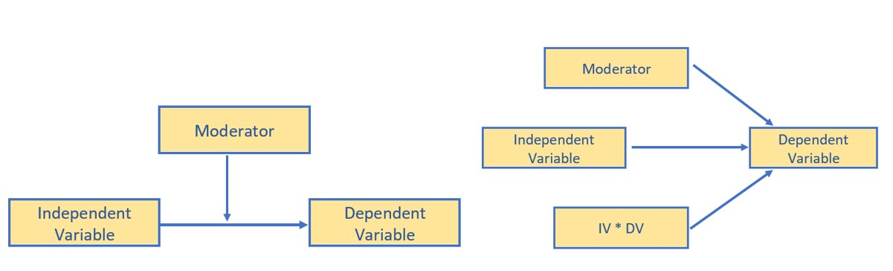
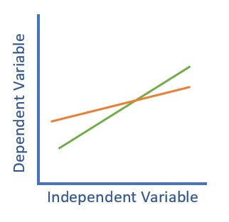
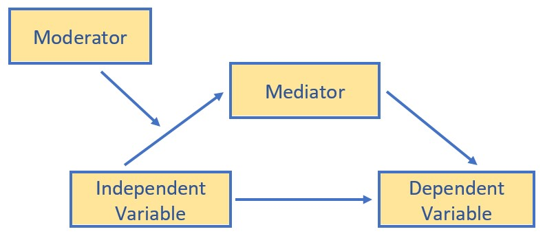

# CONDITIONAL PROCESS ANALYSIS  {-#CPA}

# Simple Mediation {#SimpleMed}

 [Screencasted Lecture Link](https://spu.hosted.panopto.com/Panopto/Pages/Viewer.aspx?pid=7ffb03e6-b34b-4e0b-8f10-ad080180b069) 

The focus of this lecture is to estimate indirect effects (aka "mediation").  We examine the logic/design required to support the argument that *mediation* is the *mechanism* that explains the X --> Y relationship.  We also work three examples (one with covariates).

At the outset, please note that although I rely heavily on Hayes [-@hayes_introduction_2018] text and materials, I am using the R package *lavaan* in these chapters.  Very recently, Hayes has introduced a [PROCESS macro for R](https://www.processmacro.org/index.html). Because I am not yet up-to-speed on using this macro (it is not a typical R package) and because we will use *lavaan* for confirmatory factor analysis and structural equation modeling, I have chosen to utilize the *lavaan* package.  A substantial difference is that the PROCESS macros use ordinary least squares and *lavaan* uses maximum likelihood estimators.

## Navigating this Lesson

There is about 1 hour and 10 minutes of lecture.  If you work through the materials with me it would be plan for an additional 1.5 hours.

While the majority of R objects and data you will need are created within the R script that sources the chapter, ocasionally there are some that cannot be created from within the R framework. Additionally, sometimes links fail.  All original materials are provided at the [Github site](https://github.com/lhbikos/ReC_MultivariateModeling) that hosts the book. More detailed guidelines for ways to access all these materials are provided in the OER's [introduction](#ReCintro)

### Learning Objectives

Learning objectives from this lecture include the following:

* Define mediation and indirect effect. 
* Distinguish the role of a mediating variable from independent variables, covariates, and moderators.
* Identify the conditions upon which there can be justification to support the presence of a mediated effect.
* Articulate the arguments for and against using the term, "mediation."
* Using the R package *lavaan*, 
  - specify a model with indirect effects,
  - identify and interpret B weights, *p* values, and *CIs* for total, direct, and indirect effects, 
  - calculate the total effects of X and M on Y, 
  - identify the proportion of variance accounted for in predicting M and Y.
* Hand calculate the values of an indirect, direct, and total effects from statistical output or a figure (just the $B$ or $\beta$, not the significance level)

### Planning for Practice

The following suggestions for practice will involve specifying, testing, and interpreting a model with a single indirect effect (mediator).

* Rework the problem in the chapter by changing the random seed in the code that simulates the data.  This should provide minor changes to the data, but the results will likely be very similar.
* There are a number of variables in the dataset and there were a handful of simple mediations conducted in the journal article that sources the research vignette.  Swap out one or more variables in the model of simple mediation and compare your solution to the one in the chapter and/or the research article.
* Conduct a simple mediation with data to which you have access. This could include data you simulate on your own or from a published article.

### Readings & Resources

In preparing this chapter, I drew heavily from the following resource(s). Other resources are cited (when possible, linked) in the text with complete citations in the reference list.

* Hayes, A. F. (2018). *Introduction to mediation, moderation, and conditional process anlaysis:  A regression-based approach*. New York, NY: Guilford Press. Available as an ebook from the SPU library:  https://ebookcentral-proquest-com.ezproxy.spu.edu/lib/spu/detail.action?docID=5109647 
  - **Chapter 3, Simple mediation**:  Hayes' text is another great example of a teaching tool that is accessible at both procedural and conceptual levels.   I especially appreciate  his attention to the controversies (even those directed toward his work).  We deviate from his text in that we are not using the PROCESS macro...and I'll address those concerns in the lecture.
  - **Chapter 4, Causality and confounds**:  A great chapter that addresses "What happened to Baron & Kenny"; partial v complete mediation; and conditions required for claims of causality.  Procedurally, our focus in this chapter is on the role of covariates. 
  - **Appendix A:  Using Process**:  An essential tool for PROCESS users because, even when we are in the R environment, this is the "idea book." That is, the place where all the path models are presented in figures.
* Kim, P. Y., Kendall, D. L., & Cheon, H.-S. (2017). Racial microaggressions, cultural mistrust, and mental health outcomes among Asian American college students. *American Journal of Orthopsychiatry, 87*(6), 663–670. https://doi-org.ezproxy.spu.edu/10.1037/ort0000203

### Packages

The script below will (a) check to see if the following packages are installed on your computer and, if not (b) install them.

<!-- TODO: Build out this section. -->
```{r Install Packages for Simple Med, eval=FALSE}
#will install the package if not already installed
if(!require(lavaan)){install.packages("lavaan")}
if(!require(semPlot)){install.packages("semPlot")}
if(!require(tidyverse)){install.packages("tidyverse")}
if(!require(psych)){install.packages("psych")}
if(!require(formattable)){install.packages("formattable")}
if(!require(semTable)){install.packages("semTable")}
```

## Estimating Indirect Effects (the analytic approach often termed *mediation*)

### The definitional and conceptual

As in Hayes text [-@hayes_introduction_2018], we will differentiate between *moderation* and *mediation*.  *Conditional process analysis* involves both! With each of these, we are seeking to understand the *mechanism* at work that leads to the relationship (be it correlational, predictive, or causal)

Even though this process has sometimes been termed *causal modeling*, Hayes argues that his *statistical approach* is not claiming to determine *cause*; that is really left to the argument of the research design. 

**Moderation** (a review):  

* Answers questions of *when* or *for whom* and is often the source of the answer, *it depends*.
* Think of our *interaction* effects in ANOVA and regression
* The effect of X on some variable Y is moderated by W if its size, sign, or strength depends on, or can be predicted, by W.  Then we can say, "W is a *moderator* of X's effect on Y" or "W and X *interact* in their influence on Y."
* The image below illustrates moderation with *conceptual* and *statistical* diagrams. Note that three predictors (IV, DV, their interaction) point to the DV.




The classic plot of moderation results is often the best way to detect that an interaction was included in the analysis and helps understand the *conditional* (e.g., for whom, under what conditions) nature of the analysis.



**Mediation**:  

* Answers questions of *how* (I also think *through* and *via* to describe the proposed mediating mechanism)
* Paths in a mediation model are *direct* (X does not pass through M on its way to Y) and *indirect* (X passes through M on its way to Y). Once we get into the statistics, we will also be focused on *total* effects.
* Hayes thinks in terms of *antecedent* and *consequent* variables. In a 3-variable, simple mediation, X and M are the antecedent variables; X and M are the consequent variables.  
* There is substantial debate and controversy about whether we can say "the effect of X on Y is *mediated* through M" or whether we should say, "There is a statistically significant indirect effect of X on Y thru M."  Hayes comes down on the "use mediation language" side of the debate.  
* In sum, a simple mediation model is any causal system in which at least one causal antecedent X variable is proposed as influencing an outcome Y through a single intervening variable, M.  In such a model there are two pathways by which X can influence Y.
* The figure below doubles as both the conceptual and statistical diagram of evaluating a simple mediation -- a simple indirect effect.


**Conditional process analysis**:  

* Used when the research goal is to understand the boundary conditions of the mechanism(s) by which a variable transmits its effect on another.  
* Typically, simultaneously, assesses the influence of mediating (indirect effects) and moderating (interactional effects) in a model-building fashion.
* In a conditional process model, the moderator(s) may be hypothesized to influence one or more of the paths.

We will work toward building a conditional process model, a moderated mediation, over the next several chapters.


{#id .class width=250 height=180}

## Workflow for Simple Mediation

The workflow for a simple mediation is straightforward, however the figure below (i.e., the very traditional figure used to represent mediation) is very helpful in understanding the logic beneath mediation as the explanatory mechanism.


The top figure represents the bivariate relationship between the independent and dependent variable.  The result of a simple linear regression (one predictor) represent the *total* effect of the IV on the DV. We can calculate this by simply regressing the DV onto the IV.  The resulting $B$ weight is known as the *c* path.  A bivariate correlation coefficient results in the same value -- only it is standardized (so would be the same as the $\beta$ weight).

The lower figure represents that the relationship between the IV and DV is *mediated* by a third variable.  We assign three labels to the paths:  *a*, between the IV and mediator; *b*, between the mediator and DV; and *c'* (c prime) between the IV and DV.

Statistically speaking, a mediated relationship is supported when the value of *c'* is statistically significantly lower than *c*.  If this occurs, then we can say that the mediator is sharing some of the variance in the prediction of the DV.

You might already be imagining potential challenges to this model.  For example, which variable should be the IV and which one should be the mediator?  Can we switch them?  You can -- and you will likely have very similar (if not identical) results.  Good research design is what provides support for suggesting that mediation is the proper, casual, mechanism regarding the relationship between the IV and DV.  An excellent review of the challenges of establishing a robust mediation model is provided by Kline [-@kline_mediation_2015], where he suggests the following as the minimally required elements of a mediation design:

* the IV is an experimental variable with random assignment to conditions;
* the mediator is an individual difference variable that is not manipulated and is measured at a later time;and
* the DV is measured at a third occasion

These criteria are in addition to the rather standard criteria for establishing causality [see @stone-romero_research_2010 for a review]:

* temporal precedence,
* statistical covariation, and
* ruling out plausible rival hypotheses.

Some journals take this very seriously.  In fact [FAQs](https://www.journals.elsevier.com/journal-of-vocational-behavior/news/frequently-asked-questions-about-submitting-a-manuscript) in the  Journal of Vocational Behavior make it clear that they will very rarely publish a "mediation manuscript" unless it has a minimum of three waves.

Working through a mediation will help operationalize these concepts.


## Simple Mediation in *lavaan*:  A focus on the mechanics

The lavaan tutorial [@rosseel_lavaan_2020] provides a helpful model of how writing code to estimate an indirect effect. Using the lavaan tutorial as our guide, let's start with just a set of fake data with variable names that represent X (predictor, IV, antecedent), M (mediator, atencedent, consequent), and Y (outcome, DV, consequent). 

### Simulate Fake Data

The code below is asking to create a dataset with a sample size of 100.  The dataset has 3 variables, conveniently named X (predictor, antecedent, IV), M (mediator), and Y (outome, consequent, DV).  The R code asks for random selection of numbers with a normal distribution.  You can see that the M variable will be related to the X variable by + .5; and the Y variable will be related to the M variable by + .7.  This rather ensures a statistically significant indirect effect.

<!-- TODO: Return and replace with data from our mediation) -->

```{r Simulating fake data}
set.seed(210410)
X <- rnorm(100)
M <- 0.5*X + rnorm(100)
Y <- 0.7*M + rnorm(100)
Data <- data.frame(X = X, Y = Y, M = M)
```


### Specify Mediation Model

The package we are using is *lavaan*.  Hayes' model is *path analysis*, which can be a form of structural equation modeling.  As a quick reminder, in SPSS, PROCESS is limited to ordinary least squares regression.  We will use maximum likliehood estimators for the Hayes/PROCESS examples, but *lavaan* can take us further than PROCESS because

* We can (and, in later chapters,  will) do latent variable modeling.
* We can have more specificity and flexibility than the prescribed PROCESS models allow.  I say this with all due respect to Hayes -- there is also a good deal of flexibility to be able to add multiple mediators and covariates within most of the Hayes' prescribed models.

Hayes text is still a great place to start because the conceptual and procedural information is clear and transferable to the R environment.

```{r load lavaan}
library(lavaan)
```

Our atheoretical dataset makes it easy to identify which variable belongs in each role (X,Y,M).  When specifying the paths in lavaan, here's what to keep in mind: 

* Name your model/object (below is X, "<-" means "is defined by")
* The model exists between 2 single quotation marks (the odd looking ' and ' at the beginning and end).
* The # of regression equations you need depends on the # of variables that have arrows pointing to them.  In a simple mediation, there are 3 variables with 2 variables having arrows pointing to them -- need 2 regression equations:
  +  one for the Mediator
  +  one for the DV (Y)
* Operator for a regression analysis is the (tilde, ~)
* DV goes on left
  +  In first equation we regress both the X and M onto Y
  +  In second equation we regress M onto X
* The asterisk (*) is a handy tool to label variables (don't confuse it as defining an interaction); this labeling as a, b, and c_p (in traditional mediation, the total effect is labeled with a and the direct effect is c'[c prime], but the script won't allow and extra single quotation mark, hence c_p) is super helpful in interpreting the ouput
* The indirect effect is created by multiplying the a and b paths.  
* The ":=" sign is used when creating a new variable that is a function of variables in the model, but not in the dataset (i.e., the a and b path).

After specifying the model, we create an object that holds our results from the SEM.  To obtain all the results from our of indirect effects, we also need to print a summary of the fit statistics, standardized estimates, r-squared, and confidence intervals.

*Other authors will write the model code more sensibly, predicting the mediator first, and then the Y variable.  However, I found that by doing it this way, the semPlot produces a more sensible figure.*

Also, because we set a random seed, you should get the same results, but if it differs a little, don't panic.
Also, in Hayes text the direct path from X to Y is c' ("c prime"; where as c is reserved for the total effect of X on Y).  

Let's run the whole model.

```{r Simple Med w Faky Daty}
set.seed(210410) #reset in case you choose to separate these sections
model <- '
          Y ~ b*M + c_p*X 
          M ~ a*X
          
          indirect :=  a*b
          direct  := c_p
          total_c  := c_p + (a*b)
          '
fit <- sem(model, data = Data, se="bootstrap", missing= 'fiml')
FDsummary <- summary(fit, standardized=T, rsq=T, fit=TRUE, ci=TRUE)
FD_ParamEsts <- parameterEstimates(fit, boot.ci.type = "bca.simple", standardized=TRUE)
FDsummary
FD_ParamEsts
```

```{r Coefficients and p values for inline text for the fake data example, echo = FALSE, results ='hide'}
library(formattable) #to use the digits function
FDa <- digits(FD_ParamEsts$est[3], 3) #B weight for the a path
FDa
FDa_p <- digits(FD_ParamEsts$pvalue[3], 3)#p value for the a path
FDa_p
FDb <- digits(FD_ParamEsts$est[1], 3) #B weight for the b path
FDb
FDb_p <- digits(FD_ParamEsts$pvalue[1], 3)#p value for the b path
FDb_p
FDc_p <- digits(FD_ParamEsts$est[2], 3) #B weight for the c' (direct) path
FDc_p
FDc_p_p <- digits(FD_ParamEsts$pvalue[2], 3)#p value for the c' (direct) path
FDc_p_p
FDtot <-  digits(FD_ParamEsts$est[12], 3)#p value for the c (total) path
FDtot
FDtot_p <- digits(FD_ParamEsts$pvalue[12], 3)#p value for the c (total) path
FDtot_p

# Hand calculating the indirect effect
FDind <- digits(FD_ParamEsts$est[3] * FD_ParamEsts$est[1], 3)
FDind <- digits(FDind, 3)
FDind

FDind_p <- digits(FD_ParamEsts$pvalue[10], 3) #p value for the indirect effect
FDind_p

# Proportio of variance accounted for

Rsq_Y <- percent(FDsummary$PE$est[13])
Rsq_Y
Rsq_M <- percent(FDsummary$PE$est[14])
Rsq_M
```

### Interpret the Output

Note that in the script we ask (and get) two sets of parameter estimates.  The second set (in the really nice dataframe) includes bootstrapped, bias-corrected confidence intervals. Bias-corrected confidence interals have the advantage of being more powerful and bias-free.  Note, though, that when the CI crosses 0, the effect is NS.  

So let's look at this step-by-step.

*  Overall, our model accounted for `r Rsq_Y` of the variance in the IV and `r Rsq_M` of the variance in the mediator.
*  a path = `r FDa`, $p$ = `r FDa_p`
*  b path = `r FDb`, $p$ = `r FDb_p`
*  the indirect effect is a product of the a and b paths (`r FDa` * `r FDb` = `r FDind`); while we don't hand calculate it's significance, we see that it is $p$ = `r FDind_p`
*  the direct effect (c', c prime, or c_p) is the isolated effect of X on Y when including M.  We hope this value is LOWER than the total effect because this means that including M shared some of the variance in predicting Y:  c' = `r FDc_p`, $p$ = `r FDc_p_p`, and it is no longer signifcant.
*  we also see the total effect; this value is 
   *  identical to the value of simply predicting Y on X (with no M it the model)
   * the value of a(b) + c_p:  `r FDa`(`r FDb`) + `r FDc_p` =  `r FDtot` ($p$ = `r FDtot_p`)
  

Here's a demonstration that the total effect is, simply, predicting Y from X (also, the correlation between X and Y:

```{r}
fitXY <- lm(Y ~ X, data = Data)
summary(fitXY)
```
Which is the same as the bivariate correlation.  The only trick is that the bivariate correlation produces a standardized result; so it would be the $\beta$.

```{r}
library(psych)
XY_r <- corr.test(Data[c("Y", "X")])
XY_r
```
### A Table and a Figure

We can use the package [semPlot](https://rdrr.io/cran/semPlot/man/semPaths.html) to create a figure that includes the values on the path.  

Here's what the base package gets us

```{r FakyDaty Simple Plot}
library(semPlot)
semPaths(fit, #must identify the model you want to map
         what = "est", #"est" plots the estimates, but keeps it greyscale with no fading
         #whatLabels = "stand", #"stand" changes to standardized values
         layout = 'tree', rotation = 2, #together, puts predictors on left, IVs on right 
         edge.label.cex = 1.00, #font size of parameter values
         #edge.color = "black", #overwrites the green/black coloring
         sizeMan=10, #size of squares/observed/"manifest" variables
         fade=FALSE, #if TRUE, there lines are faded such that weaker lines correspond with lower values -- a cool effect, but tough for journals
         esize=2, 
         asize=3,
         #label.prop = .5,
         label.font = 2.5, #controls size (I think) of font for labels
         label.scale = TRUE, #if false, the labels will not scale to fit inside the nodes
         nDigits = 3, #decimal places (default is 2)
         residuals = FALSE,#excludes residuals (and variances) from the path diagram
         nCharNodes = 0, #specifies how many characters to abbreviate variable lables; default is 3.  If 0, uses your entire variable label and adjusts fontsize (which could be a downside)
         intercepts = FALSE, #gets rid of those annoying triangles (intercepts) in the path diagram)
)
title("Fake Data:  Simple Mediation")
```

Hayes has great examples of APA style tables.  I haven't yet found a package that will turn this output into a journal-ready table, however the *semTable* package can at least write the output to a .csv file and you can further manipulate it into a table.

```{r export fitTABLE, results='hide'}
library(semTable)
fitTab1 <- semTable(fit, columns = c("est", "se", "p", "rsquare"),  columnLabels = c(eststars = "Estimate"), paramSets = c("composites", "loadings", "slopes", "intercepts", "residualvariances"), file = "fitTABLE", type = "csv", print.results = TRUE)
```

### Results

A simple mediation model examined the degree to which M mediated the relation of X on Y.  Using the *lavaan* package (v 0.6-7) in R, coefficients for  each path, the indirect effect, and total effects were calculated. These values are presented in Table 1 and illustrated in Figure 1.  Results suggested that `r Rsq_M` of the variance in M and `r Rsq_Y` of the variance in Y were accounted for in the model.  The indirect effect ($B$ = `r FDind`, $p$  = `r FDind_p`) was statistically significant; the direct effect ($B$ = `r FDc_p`, $p$ = `r FDc_p_p`) was not. Comparing the nonsignificant direct effect to the statistically significant total effect ($B$ = `r FDtot`, $p$ = `r FDtot_p`) is consistent with the notion that the effect of X on Y is explained through M. 


## Research Vignette

The research vignette comes from the Kim, Kendall, and Cheon's [-@kim_racial_2017], "Racial Microaggressions, Cultural Mistrust, and Mental Health Outcomes Among Asian American College Students."  Participants were 156 Asian American undergraduate students in the Pacific Northwest. The researchers posited the a priori hypothesis that cultural mistrust would mediate the relationship between racial microaggressions and two sets of outcomes:  mental health (e.g., depression, anxiety, well-being) and help-seeking.

Variables used in the study included:

* **REMS**:  Racial and Ethnic Microaggressions Scale (Nadal, 2011). The scale includes 45 items on a 2-point scale where 0 indicates no experience of a microaggressive event and 1 indicates it was experienced at least once within the past six months.  Higher scores indicate more experience of microaggressions.
* **CMI**:  Cultural Mistrust Inventory (Terrell & Terrell, 1981). This scale was adapted to assess cultural mistrust harbored among Asian Americans toward individuals from the mainstream U.S. culture (e.g., Whites). The CMI includes 47 items on a 7-point scale where higher scores indicate a higher degree of cultural mistrust.
* **ANX**, **DEP**, **PWB**:  Subscales of the Mental Health Inventory (Veit & Ware, 1983) that assess the mental health outcomes of anxiety (9 items), depression (4 items), and psychological well-being (14 items).  Higher scores (on a 6 point scale) indicate stronger endorsement of the mental health outcome being assessed.
* **HlpSkg**:  The Attiudes Toward Seeking Professional Psychological Help -- Short Form (Fischer & Farina, 1995) includes 10 items on a 4-point scale (0 = disagree, 3 = agree) where higher scores indicate more favorable attitudes toward help seeking.

### Simulate Data from the Journal Article

First, we simulate the data from the means, standard deviations, and correlation matrix from the journal article.

```{r Simulate data from Kim et al}
#Entering the intercorrelations, means, and standard deviations from the journal article
mu <- c(.34, 3.00, 2.98, 2.36, 3.50, 1.64)
sd <- c(.16, .83, .99, .90, .90, .53)
r_mat <- matrix (c(1,   .59, .26,   .34,  -.25, -.02,
                  .59, 1.00, .12,   .19,  -.28, .00, 
                  .26,  .12, 1.00, .66,  -.55, .07,
                  .34,  .19, .66,  1.00, -.66, .05,
                 -.25, -.28, -.55,-.66,  1.00, .08, 
                 -.02,  .00,  .07, .05, .08,  1), ncol = 6)
#Creating a covariance matrix
cov_mat <- sd %*% t(sd) * r_mat

#Set random seed so that the following matrix always gets the same results.
set.seed(210409)
library(MASS)
Kim_df <- mvrnorm(n = 156, mu=mu, Sigma = cov_mat, empirical = TRUE)
colMeans(Kim_df)
#Checking our work against the original correlation matrix
round(cor(Kim_df),3)


```
```{r renaming variables, echo = FALSE, results ='hide'}
#renaming the variables
as.data.frame(Kim_df, row.names = NULL, optional = FALSE, make.names = TRUE)
library(tidyverse)
Kim_df <- Kim_df%>%
  as.data.frame %>%
  rename(REMS = V1, CMI = V2, ANX = V3, DEP = V4, PWB = V5, HlpSk = V6)

```

```{r look at first six rows of new df}
#look at the first 6 rows of the new df
head(Kim_df)
```


Let's check the descriptives to see if they align with those in the article.
```{r Kim_df descriptives}
library(psych)
psych::describe(Kim_df)
```
There are a number of reasons I love the Kim et al. [-@kim_racial_2017] manuscript.  One is that their approach was openly one that tested *alternate models*.  Byrne [-@byrne_structural_2016] credits Joreskog [@bollen_testing_1993] with classifying the researcher's model testing approach in three ways.  If someone is *strictly confirmatory*, they only test the model they proposed and then accept or reject it without further alteration. While this is the tradition of null hypothesis significance testing, it contributes to the "file drawer problem" of unpublished, non-significant, findings.  Additionally, the data are them discarded -- potentially losing valuable resource.  The *alternative models* approach is to propose a handful of competing models before beginning the analysis and then evaluating to see if one model is superior to the other.  The third option is *model generating*.  In this case the researcher begins with a theoretically proposed model.  In the presence of poor fit, the researcher seeks to identify the source of misfit -- respecifying it to best represent the sample data.  The researcher must use caution to produce a model that fits well and is meaningful.

Several of the Kim et al. [-@kim_racial_2017] models were non-significant.  To demonstrate a model that is statistically significant, I will test the hypothesis that racial microaggressions (REMS, the X variable) influence depression (DEP, the Y variable) through cultural mistrust (CMI, the M variable).


### Specify the Model in *lavaan*

I am a big fan of "copying the model."  In specifying my model I used our simple mediation template above 

* replaced the Y, X, and M with variables names
* replacing the name of the df
* updated the object names (so I could use them in the same .rmd file)

```{r Simple Med w Kim et al}
library(lavaan)
set.seed(210410) #reset in case you choose to separate these sections
Kim_model <- '
          PWB ~ b*CMI + c_p*REMS 
          CMI ~a*REMS
          
          indirect :=  a*b
          direct  := c_p
          total_c  := c_p + (a*b)
          '
```

```{r Fit stats from Kim et al, results='hide'}
Kim_fit <- sem(Kim_model, data = Kim_df, se="bootstrap", missing= 'fiml')
```

```{r Essential results from Kim et al}
Kim_summary <- summary(Kim_fit, standardized=T, rsq=T, fit=TRUE, ci=TRUE)
Kim_ParamEsts <- parameterEstimates(Kim_fit, boot.ci.type = "bca.simple", standardized=TRUE)
Kim_summary
Kim_ParamEsts
```

```{r Coefficients and p values for inline text for the Kim et al example, echo = FALSE, results ='hide'}
library(formattable) #to use the digits function
# Values for the intercept of the IV
K_Yicpt <- digits(Kim_ParamEsts$est[7], 3) #B weight for the intercept
K_Yicpt 
K_Yicpt_SE <- digits(Kim_ParamEsts$se[7], 3)#p value for the intercept
K_Yicpt_SE
K_Yicpt_p <- digits(Kim_ParamEsts$pvalue[7], 3)#p value for the intercept
K_Yicpt_p

# Values for the intercept of the mediator
K_Micpt <- digits(Kim_ParamEsts$est[8], 3) #B weight for the intercept
K_Micpt 
K_Micpt_SE <- digits(Kim_ParamEsts$se[8], 3)#p value for the intercept
K_Micpt_SE
K_Micpt_p <- digits(Kim_ParamEsts$pvalue[8], 3)#p value for the intercept
K_Micpt_p

# Values for the labeled paths:  a, b, c'
Ka <- digits(Kim_ParamEsts$est[3], 3) #B weight for the a path
Ka
Ka_p <- digits(Kim_ParamEsts$pvalue[3], 3)#p value for the a path
Ka_p
Ka_SE <- digits(Kim_ParamEsts$se[3], 3)#p value for the a path
Ka_SE
Kb <- digits(Kim_ParamEsts$est[1], 3) #B weight for the b path
Kb
Kb_SE <- digits(Kim_ParamEsts$se[1], 3)#SE for the a path
Kb_SE
Kb_p <- digits(Kim_ParamEsts$pvalue[1], 3)#p value for the b path
Kb_p
Kc_p <- digits(Kim_ParamEsts$est[2], 3) #B weight for the c' path
Kc_p
Kc_p_p <- digits(Kim_ParamEsts$pvalue[2], 3)#p value for the c' path
Kc_p_p
Kc_p_SE <- digits(Kim_ParamEsts$se[2], 3)#SE for the c' path
Kc_p_SE

# Values for the total effect
Ktot <-  digits(Kim_ParamEsts$est[12], 3)#B weight for the total effect
Ktot
Ktot_p <- digits(Kim_ParamEsts$pvalue[12], 3)#p value for the total effect
Ktot_p
Ktot_CIlo <- digits(Kim_ParamEsts$ci.lower[12], 3) #lower confidence interval
Ktot_CIlo
Ktot_CIhi <- digits(Kim_ParamEsts$ci.upper[12], 3) #upper confidence interval
Ktot_CIhi

# Values for the direct effect
Kdir <-  digits(Kim_ParamEsts$est[11], 3)#B weight for the direct effect
Kdir
Kdir_p <- digits(Kim_ParamEsts$pvalue[11], 3)#p value for the direct effect
Kdir_p
Kdir_CIlo <- digits(Kim_ParamEsts$ci.lower[11], 3) #lower confidence interval
Kdir_CIlo
Kdir_CIhi <- digits(Kim_ParamEsts$ci.upper[11], 3) #upper confidence interval
Kdir_CIhi

# Values for the indirect effect
Kind <- digits(Kim_ParamEsts$est[10], 3) #estimate for the indirect efect
Kind
Kind_p <- digits(Kim_ParamEsts$pvalue[10], 3) #p value for the indirect effect
Kind_p

Kind_CIlo <- digits(Kim_ParamEsts$ci.lower[10], 3) #lower confidence interval
Kind_CIlo
Kind_CIhi <- digits(Kim_ParamEsts$ci.upper[10], 3) #upper confidence interval
Kind_CIhi

# Proportion of variance accounted for
K_Rsq_Y <- percent(Kim_summary$PE$est[13])
K_Rsq_Y
K_Rsq_M <- percent(Kim_summary$PE$est[14])
K_Rsq_M
```


### Interpret the Output

*  Overall, our model accounted for `r K_Rsq_Y` of the variance in the IV and `r K_Rsq_M` of the variance in the mediator.
*  a path = `r Ka`, $p$ = `r Ka_p`
*  b path = `r Kb`, $p$ = `r Kb_p`
*  the indirect effect is a product of the a and b paths (`r Kind`); while we don't hand calculate it's significance, we see that it is $p$ = `r Kind_p`; the bias-corrected bootstrapped confidence intervals can sometimes be more lenient than $p$ values; it is important they don't cross zero.  They don't:  CI95 `r Kind_CIlo` to `r Kind_CIhi`  
*  the direct effect (c', c prime, or c_p) is the isolated effect of X on Y when including M.  We hope this value is LOWER than the total effect because this means that including M shared some of the variance in predicting Y:  c' = `r Kc_p`, $p$ = `r Kc_p_p`, and it is no longer signifcant.
*  we also see the total effect; this value is 
  + identical to the value of simply predicting Y on X (with no M it the model)
  + the value of a(b) + c_p:  `r Ka`(`r Kb`) + `r Kc_p` =  `r Ktot` ($p$ = `r Ktot_p`)
  
### A Figure and a Table

I make it a practice to immediately plot what I did. Because the plotting packages use our models, this can be a helpful self-check of our work.

```{r semPLOT of PMI}
library(semPlot)
semPaths(Kim_fit, #must identiy the model you want to map
         what = "est", #"est" plots the estimates, but keeps it greyscale with no fading
         #whatLabels = "stand", #"stand" changes to standardized values
         layout = 'tree', rotation = 2, #together, puts predictors on left, IVs on right 
         edge.label.cex = 1.00, #font size of parameter values
         #edge.color = "black", #overwrites the green/black coloring
         sizeMan=10, #size of squares/observed/"manifest" variables
         fade=FALSE, #if TRUE, there lines are faded such that weaker lines correspond with lower values -- a cool effect, but tough for journals
         esize=2, 
         asize=3,
         #label.prop = .5,
         label.font = 2.5, #controls size (I think) of font for labels
         label.scale = TRUE, #if false, the labels will not scale to fit inside the nodes
         nDigits = 3, #decimal places (default is 2)
         residuals = FALSE,#excludes residuals (and variances) from the path diagram
         nCharNodes = 0, #specifies how many characters to abbreviate variable lables; default is 3.  If 0, uses your entire variable label and adjusts fontsize (which could be a downside)
         intercepts = FALSE, #gets rid of those annoying triangles (intercepts) in the path diagram)
)
title("Depression by Racial Microaggressions via Cultural Mistrust")
```

The semTable package can be used to write results to an outfile.
```{r PMI mediation table, results='hide'}
library(semTable)
fitTab1 <- semTable(Kim_fit, columns = c("est", "se", "p", "rsquare"),  columnLabels = c(eststars = "Estimate"), paramSets = c("composites", "loadings", "slopes", "intercepts", "residualvariances"), file = "pmi_fitTABLE", type = "csv", print.results = TRUE)
```

For the purpose of the OER, and because it's good trainng, I also think it can be useful to make our own table.  For me, it facilitates my conceptual understanding of (a) what the statistic is doing and (b) the results of our specific data.

Table 1  

|Model Coefficients Assessing Cultural Mistrust as a Mediator Between Racial Microaggressions and Well-Being
|:-------------------------------------------------------------------------------------------------------------------|

|                         
|:------------------------|:---------------------------------------:|:-----:|:--------------------------------------:|
|                         |Cultural Mistrust (M)                    |       |Well-Being (Y)                          |

|
|:----------------|:-----:|:----------:|:------------:|:-----------:|:-----:|:---------:|:------------:|:-----------:|
|Antecedent       |path   |$B$         |$SE$          |$p$          |path   |$B$        |$SE$          |$p$          |
|constant         |$i_{M}$|`r K_Micpt` |`r K_Micpt_SE`|`r K_Micpt_p`|$i_{Y}$|`r K_Yicpt`|`r K_Yicpt_SE`|`r K_Yicpt_p`|
|REMS (X)         |$a$    |`r Ka`      |`r Ka_SE`     |`r Ka_p`     |$c'$   |`r Kc_p`   |`r Kc_p_SE`   |`r Kc_p_p`   |
|CMI (M)          |       |            |              |             |$b$    |`r Kb`     |`r Kb_SE`     |`r Kb_p`     |

|
|:------------------------|:---------------------------------------:|:-----:|:--------------------------------------:|
|                         |$R^2$ = `r K_Rsq_M`                      |       |$R^2$ = `r K_Rsq_Y`                     |

### Results

A simple mediation model examined the degree to which cultural mistrust mediated the relation of racial microaggressions on depressive symptoms  Using the *lavaan* package (v 0.6-7) in R, coefficients for  each path, the indirect effect, and total effects were calculated. These values are presented in Table 1 and illustrated in Figure 1.  Results suggested that `r K_Rsq_M` of the variance in cultural mistrust and `r K_Rsq_Y`of the variance in depression were accounted for by the model.  When the mediator was included in the model, bias-corrected confidence intervals surrounding the indirect effect  ($B$ = `r Kind`, $p$ = `r Kind_p`, CI95 `r Kind_CIlo` to `r Kind_CIhi`) were not quite statistically significant. Consistent with mediation, the value of the total effect was larger in magnitude and statistically significant ($B$ = `r Ktot`, $p$ = `r Ktot_p`, CI95 `r Ktot_CIlo` to `r Ktot_CIhi`) than the smaller and non-significant direct effect ($B$ = `r Kdir`, $p$ = `r Kdir_p`, CI95 `r Kdir_CIlo` to `r Kdir_CIhi`).    

## Considering Covariates

Hayes Chapter 4 [-@hayes_introduction_2018] considers the role of covariates (e.g., other variables that could account for some of the variance in the model).  When previous research (or commonsense, or detractors) suggest you should include them...its worth a try.  If they are non-significant and/or your variables continue to explain variance over-and-above their contribution, then you have gained ground in ruling out plausible rival hypotheses and are adding to causal evidence.

They are relatively easy to specify in *lavaan*.  Just look at to where the arrows point and then write the path!

Let's say we are concerned that anxiety covaries with cultural mistrust and PWB  We'll add it as a covariate to both.


```{r specify ESTRESS w covs}
set.seed(210410)
Kim_fit_covs <- '
          PWB ~ b*CMI + c_p*REMS 
          CMI ~a*REMS
          CMI ~ covM*ANX
          PWB ~ covY*ANX

          indirect :=  a*b
          direct  := c_p
          total_c  := c_p + (a*b)
          '
Kim_fit_covs <- sem(Kim_fit_covs, data = Kim_df, se="bootstrap", missing = 'fiml')
Kcov_sum <- summary(Kim_fit_covs, standardized=T, rsq=T, fit=TRUE, ci=TRUE)
Kcov_ParEsts<- parameterEstimates(Kim_fit_covs, boot.ci.type = "bca.simple", standardized=TRUE)
Kcov_sum
Kcov_ParEsts
```

```{r Coefficients and p values for inline text for the Kim et al example w covs, echo = FALSE, results ='hide'}
library(formattable) #to use the digits function

# Values for the intercept of the IV
Cov_Yicpt <- digits(Kcov_ParEsts$est[11], 3) #B weight for the intercept
Cov_Yicpt 
Cov_Yicpt_SE <- digits(Kcov_ParEsts$se[11], 3)#p value for the intercept
Cov_Yicpt_SE
Cov_Yicpt_p <- digits(Kcov_ParEsts$pvalue[11], 3)#p value for the intercept
Cov_Yicpt_p

# Values for the intercept of the mediator
Cov_Micpt <- digits(Kcov_ParEsts$est[12], 3) #B weight for the intercept
Cov_Micpt 
Cov_Micpt_SE <- digits(Kcov_ParEsts$se[12], 3)#p value for the intercept
Cov_Micpt_SE
Cov_Micpt_p <- digits(Kcov_ParEsts$pvalue[12], 3)#p value for the intercept
Cov_Micpt_p

Cova <- digits(Kcov_ParEsts$est[3], 3) #B weight for the a path
Cova
CovaSE <- digits(Kcov_ParEsts$se[3], 3) #SE for the a path
CovaSE
Cova_p <- digits(Kcov_ParEsts$pvalue[3], 3)#p value for the a path
Cova_p

Covb <- digits(Kcov_ParEsts$est[1], 3) #B weight for the b path
Covb
CovbSE <- digits(Kcov_ParEsts$se[1], 3) #sE for the b path
CovbSE
Covb_p <- digits(Kcov_ParEsts$pvalue[1], 3)#p value for the b path
Covb_p

Covc_p <- digits(Kcov_ParEsts$est[2], 3) #B weight for the c' path
Covc_p
CovcSE <- digits(Kcov_ParEsts$se[2], 3) #SE for the c' path
CovcSE
Covc_p_p <- digits(Kcov_ParEsts$pvalue[2], 3)#p value for the c' path
Covc_p_p

AnxMa <- digits(Kcov_ParEsts$est[4], 3) #B weight for the covariate to M
AnxMa
AnxMse <- digits(Kcov_ParEsts$se[4], 3) #SE for the covariate to M
AnxMse
AnxM_p <- digits(Kcov_ParEsts$pvalue[4], 3)#p for the covariate to M
AnxM_p

AnxYa <- digits(Kcov_ParEsts$est[5], 3) #B weight for the covariate to M
AnxYa
AnxYse <- digits(Kcov_ParEsts$se[5], 3) #SE for the covariate to M
AnxYse
AnxY_p <- digits(Kcov_ParEsts$pvalue[5], 3)#p for the covariate to M
AnxY_p


Covtot <-  digits(Kcov_ParEsts$est[17], 3)#p value for the total effect
Covtot
Covtot_p <- digits(Kcov_ParEsts$pvalue[17], 3)#p value for the total effect
Covtot_p

# Values for the indirect effect
COVind <- digits(Kcov_ParEsts$est[15], 3) #estimate for the indirect effect
COVind
COVind_p <- digits(Kcov_ParEsts$pvalue[15], 3) #p value for the indirect effect
COVind_p
COV_CIlo <- digits(Kcov_ParEsts$ci.lower[15], 3) #lower confidence interval
COV_CIlo
COV_CIup <- digits(Kcov_ParEsts$ci.upper[15], 3) #upper confidence interval
COV_CIup

# Values for the direct effect
COVdir <- digits(Kcov_ParEsts$est[16], 3) #estimate for the direct effect
COVdir
COVdir_p <- digits(Kcov_ParEsts$pvalue[16], 3) #estimate for the direct effect
COVdir_p
COVdir_CIlo <- digits(Kcov_ParEsts$ci.lower[16], 3) #lower confidence interval
COVdir_CIlo
COVdir_CIup <- digits(Kcov_ParEsts$ci.upper[16], 3) #upper confidence interval
COVdir_CIup

# Values for the total effect 
COVtot <- digits(Kcov_ParEsts$est[17], 3) #estimate for the direct effect
COVtot
COVtot_p <- digits(Kcov_ParEsts$pvalue[17], 3) #estimate for the direct effect
COVtot_p
COVtot_CIlo <- digits(Kcov_ParEsts$ci.lower[17], 3) #lower confidence interval
COVtot_CIlo
COVtot_CIup <- digits(Kcov_ParEsts$ci.upper[17], 3) #upper confidence interval
COVtot_CIup

# Proportion of variance accounted for
COV_Rsq_Y <- percent(Kcov_sum$PE$est[18])
COV_Rsq_Y
COV_Rsq_M <- percent(Kcov_sum$PE$est[19])
COV_Rsq_M
```

### A Figure and a Table

Let's look at a figure to see see if we did what we think we did. And to also get a graphic representation of our results.  The semplot package does this easily, but the figure is more statistical than conceptual and would require more tinkering for a journal article.


```{r semPLOT for model w covs}
semPaths(Kim_fit_covs, #must identiy the model you want to map
         what = "est", #"est" plots the estimates, but keeps it greyscale with no fading
         #whatLabels = "stand", #"stand" changes to standardized values
         layout = 'tree', rotation = 2, #together, puts predictors on left, IVs on right 
         edge.label.cex = 1.00, #font size of parameter values
         #edge.color = "black", #overwrites the green/black coloring
         sizeMan=10, #size of squares/observed/"manifest" variables
         fade=FALSE, #if TRUE, there lines are faded such that weaker lines correspond with lower values -- a cool effect, but tough for journals
         esize=2, 
         asize=3,
         #label.prop = .5,
         label.font = 2.5, #controls size (I think) of font for labels
         label.scale = TRUE, #if false, the labels will not scale to fit inside the nodes
         nDigits = 3, #decimal places (default is 2)
         residuals = FALSE,#excludes residuals (and variances) from the path diagram
         nCharNodes = 0, #specifies how many characters to abbreviate variable lables; default is 3.  If 0, uses your entire variable label and adjusts fontsize (which could be a downside)
         intercepts = FALSE, #gets rid of those annoying triangles (intercepts) in the path diagram)
)
title("Entrepreneurial Withdrawal by eDistress via Negative Affect (& some covariates(")
```

The path coefficients appear to be correct, but this is really a statistical map and doesn't relay the concept of mediation well.

Below is code to create an outfile that could help with creating a table in a word document or spreadsheet. There will be output that is produced with SEM models that won't be relevant for this project.
```{r writes outfile with results for table, results='hide'}
KimCOVTab <- semTable(Kim_fit_covs, columns = c("est", "se", "p", "rsquare"),  columnLabels = c(eststars = "Estimate"), paramSets = c("composites", "loadings", "slopes", "intercepts", "residualvariances"), file = "ESTRESScov_fitTABLE", type = "csv", print.results = TRUE)
```


Table 2  

|Model Coefficients Assessing Cultural Mistrust as a Mediator Between Racial Microaggressions and Well-Being
|:---------------------------------------------------------------------------------------------------------------------------------|

|                         
|:------------------------|:---------------------------------------:|:-----:|:----------------------------------------------------:|
|                         |Cultural Mistrust (M)                    |       |Well-Being (Y)                                        |

|
|:----------------|:-----:|:------------:|:--------------:|:---------------:|:-----:|:-----------:|:--------------:|:-------------:|
|Antecedent       |path   |$B$           |$SE$            |$p$              |path   |$B$          |$SE$            |$p$            |
|constant         |$i_{M}$|`r Cov_Micpt` |`r Cov_Micpt_SE`|`r Cov_Micpt_p`  |$i_{Y}$|`r Cov_Yicpt`|`r Cov_Yicpt_SE`|`r Cov_Yicpt_p`|
|REMS (X)         |$a$    |`r Cova`      |`r CovaSE`      |`r Cova_p`       |$c'$   |`r Covc_p`   |`r CovcSE`      |`r Covc_p_p`   |
|CMI (M)          |       |              |                |                 |$b$    |`r Covb`     |`r CovbSE`     |`r Covb_p`     |
|ANX (Cov)        |       |`r AnxMa`     |`r AnxMse`      |`r AnxM_p`       |       |`r AnxYa`    |`r AnxYse`      |`r AnxY_p`     |

|
|:------------------------|:-----------------------------------------------:|:-----:|:--------------------------------------------:|
|                         |$R^2$ = `r COV_Rsq_M`                            |       |$R^2$ = `r COV_Rsq_Y`                         |                    


### APA Style Write-up

There are varying models for reporting the results of mediation.  The Kim et al. [@kim_racial_2017] writeup is a great example.  Rather than copying it directly, I have modeled my table after the ones in Hayes [-@hayes_introduction_2018] text. You'll notice that information in the table and text are minimally overlapping.  APA style cautions us against redundancy in text and table.

**Results**

A simple mediation model examined the degree to which cultural mistrust mediated the effect of racial microaggressions on psychological well-being.  Using the *lavaan* package (v 0.6-7) in R, coefficients for the each path, the indirect effect, and total effects were calculated. The effect of covariate, anxiety, was mapped onto both the mediator and dependent variable.  These values are presented in Table 3 and illustrated in Figure 3.  Results suggested that `r COV_Rsq_M` of the variance in cultural mistrust and `r COV_Rsq_Y` of the variance in well-being were accounted for by the model.  Supporting the notion of a mediated model, there was a statistically significant indirect effect ($B$ = `r COVind`, $p$ = `r COVind_p`, CI95 `r COV_CIlo` to `r COV_CIup`) in combination with a  non-significant direct effect ($B$ = `r COVdir`, $p$ = `r COVdir_p`, CI95 `r COVdir_CIlo` to	`r COVdir_CIup`). Curiously, though, the total effect ($B$ = `r COVtot`, $p$ = `r COVtot_p`, CI95 `r COVtot_CIlo`	to `r COVtot_CIup`) was also non-significant.


## Residual and Related Questions...

..that you might have; or at least I had, but if had answered them earlier it would have disrupt the flow.

1. Are you sure you can claim a significant indirect effect in the presence of a non-significant total effect?  Hayes [-@hayes_introduction_2018] is.  
   * In the section subtitled, "What about Baron & Kenny" (chapter 4), Hayes argues from both logical/philosophical and statistical perspectives that the size of the total effect does not constrain or determine the size of the indirect effect.  That is, an indirect effect can be different from zero even when the total effect is not (pp. 117-119).    
2. The output we get is different from the output in the journal article being used as the research vignette.  Why?  And should we worry about it? 
   * We are simulating data.  This gives us some advantages in that (unless we specify it), we never have missingness and our variables should be normally distributed. Because we are working from means, standard deviations, and correlations, our data will never be the same as the original researcher.  That said, we can compare our results to the journal to *check out work.*  In fact, in this very chapter, I got turned around (e.g., first accidentally swapping the mediator and IV; then using the wrong DV) and was able to compare my work against the journal article to correct my errors. 
3. Some of the statistics you are reporting are different than the ones in Hayes and the ones that use the PROCESS macro (e.g., what happened to the *F* test)?
   *  The default estimator for *lavaan* is maximum likelihood (ML) and Hayes uses ordinary least squares (OLS).  This affects both the values of coefficients, standard errors, AND the type of statistics that are reported. 
   *  You can ask for OLS regression by adding the statement "estimator = "GLS". Even with this option, I have not discovered a way to obtain the *F* tests for the overall model.  Researchers seem to be comfortable with this, even asking for less than we did (e.g., many do not request R square).
   * Best I can tell, researchers who do want this might use a combination of packages, using GLS estimators in *lavaan* (this easily gets them the bootstrapped CIs) and the move to a different regression package to get the intercepts and *F* tests.  If I did this I would triple check to make sure that all the output really lined up.
4. Why did we ignore the traditional fit statistics associated with structural equation modeling (e.g., CFI, RMSEA). 
   * I hesitate to do this with models that do not include latent variables.  Therefore, we asked for an "in-between" amount of info that should be sufficient for publication submission (any editor may have their own preferences and ask for more).
5. What if I have missing data?
   *  When we enter the *lavaan* world we do get options other than multiple imputation.  In today's example we used the "sem" fitting function. Unless otherwise specified, listwise deletion (deleting the entire case when one of its variables is used to estimate the model) is the default in *lavaan*.  If data are MCAR or MAR, you can add the argument *missing = "ml"* (or its alias *missing = "fiml"*).  More here https://users.ugent.be/~yrosseel/lavaan/lavaan2.pdf on the 1.7/Missing data in lavaan slide.
   * That said, the type of estimator matters.  If you estimate your data with GLS (generalized least squares) or WLS (weighted least squares), you are required to have complete data (however you got it).  We used maximum likelihood and, even though we had non-missing data, I used the *missing = "fiml"* code.

   
## Practice Problems

The three problems described below are designed to grow with the subsequent chapters on complex mediation and conditional process analysis (i.e,. moderated mediation). Therefore, I recommend that you select a dataset that includes at least four variables. If you are new to this topic, you may wish to select variables that are all continuously scaled.  The IV and moderator (subsequent chapters) could be categorical (if they are dichotomous, please use 0/1 coding; if they have more than one category it is best if they are ordered).  You will likely encounter challenges that were not covered in this chapter. Search for and try out solutions, knowing that there are multiple paths through the analysis.

The suggested practice problem for this chapter is to conduct a simple mediation.

### Problem #1: Rework the research vignette as demonstrated, but change the random seed

If this topic feels a bit overwhelming, simply change the random seed in the data simulation, then rework the problem. This should provide minor changes to the data (maybe in the second or third decimal point), but the results will likely be very similar.

|Assignment Component  
|:---------------------------------------------------------------------------------------------|:-------------: |:------------:|
|1. Assign each variable to the X, Y, or M roles (ok but not required  to include a cov)       |      5         |    _____     |      
|2. Specify and run the lavaan model                                                           |      5         |    _____     |
|3. Use semPlot to create a figure                                                             |      5         |    _____     |
|4. Create a table that includes regression output for the M and Y variables                   |      5         |    _____     |  
|5. Represent your work in an APA-style write-up                                               |      5         |    _____     |          
|6. Explanation to grader                                                                      |      5         |    _____     |   
|7. Be able to hand-calculate the indirect, direct, and total effects from the a, b, & c' paths|      5         |    _____     |
|**Totals**                                                                                    |      35        |    _____     |

### Problem #2:  Rework the research vignette, but swap one or more variables

Use the simulated data, but select one of the other models that was evaluated in the Kim et al. [-@kim_racial_2017] study.  Compare your results to those reported in the mansucript.


|Assignment Component  
|:---------------------------------------------------------------------------------------------|:-------------: |:------------:|
|1. Assign each variable to the X, Y, or M roles (ok but not required  to include a cov)       |      5         |    _____     |      
|2. Specify and run the lavaan model                                                           |      5         |    _____     |
|3. Use semPlot to create a figure                                                             |      5         |    _____     |
|4. Create a table that includes regression output for the M and Y variables                   |      5         |    _____     |  
|5. Represent your work in an APA-style write-up                                               |      5         |    _____     |          
|6. Explanation to grader                                                                      |      5         |    _____     |   
|7. Be able to hand-calculate the indirect, direct, and total effects from the a, b, & c' paths|      5         |    _____     |
|**Totals**                                                                                    |      35        |    _____     |
             
                                                                 

### Problem #3:  Use other data that is available to you

Using data for which you have permission and access (e.g.,  IRB approved data you have collected or from your lab; data you simulate from a published article; data from an open science repository; data from other chapters in this OER), complete a simple mediation.

|Assignment Component  
|:---------------------------------------------------------------------------------------------|:-------------: |:------------:|
|1. Assign each variable to the X, Y, or M roles (ok but not required  to include a cov)       |      5         |    _____     |      
|2. Specify and run the lavaan model                                                           |      5         |    _____     |
|3. Use semPlot to create a figure                                                             |      5         |    _____     |
|4. Create a table that includes regression output for the M and Y variables                   |      5         |    _____     |  
|5. Represent your work in an APA-style write-up                                               |      5         |    _____     |          
|6. Explanation to grader                                                                      |      5         |    _____     |   
|7. Be able to hand-calculate the indirect, direct, and total effects from the a, b, & c' paths|      5         |    _____     |
|**Totals**                                                                                    |      35        |    _____     |
   

```{r sessionInfo SimpleMed}
sessionInfo()
```


