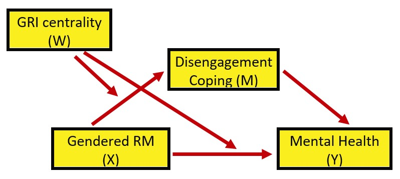
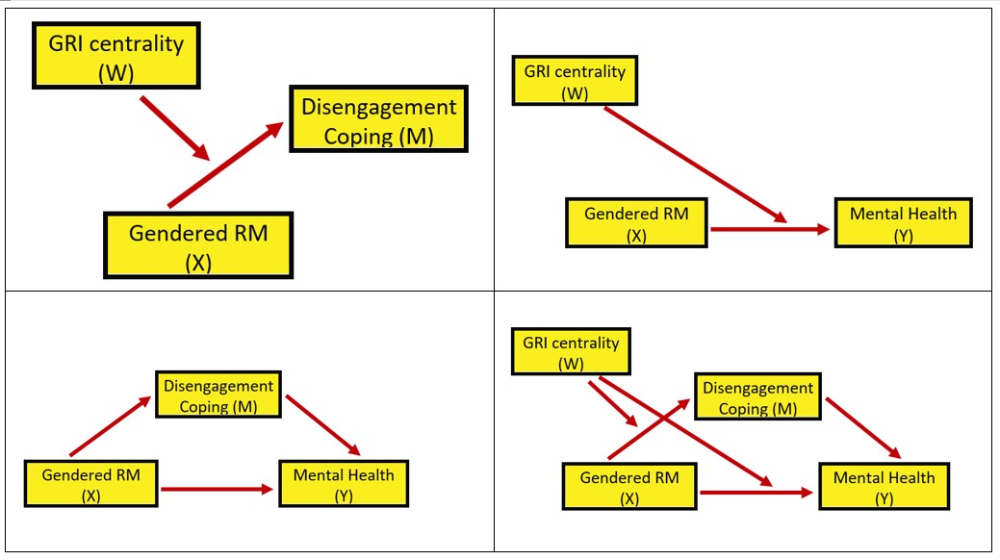

# Moderated Mediation {#ModMed}

 [Screencasted Lecture Link](https://spu.hosted.panopto.com/Panopto/Pages/Viewer.aspx?pid=1d28d076-efad-4471-b52d-ad1601826f92) 

```{r eliminates scientific notation}
options(scipen=999)#eliminates scientific notation
```

The focus of this lecture is the moderated mediation.  That is, are the effects of the indirect effect (sign, significance, strength, presence/absence) *conditional* on the effects of the moderator.

At the outset, please note that although I rely heavily on Hayes [-@hayes_introduction_2018] text and materials, I am using the R package *lavaan* in these chapters.  Very recently, Hayes has introduced a [PROCESS macro for R](https://www.processmacro.org/index.html). Because I am not yet up-to-speed on using this macro (it is not a typical R package) and because we will use *lavaan* for confirmatory factor analysis and structural equation modeling, I have chosen to utilize the *lavaan* package.  A substantial difference is that the PROCESS macros use ordinary least squares and *lavaan* uses maximum likelihood estimators.

## Navigating this Lesson

There is about 1 hour and 15 minutes of lecture.  If you work through the materials with me it would be plan for an additional hour and a half.

While the majority of R objects and data you will need are created within the R script that sources the chapter, occasionally there are some that cannot be created from within the R framework. Additionally, sometimes links fail.  All original materials are provided at the [Github site](https://github.com/lhbikos/ReC_MultivariateModeling) that hosts the book. More detailed guidelines for ways to access all these materials are provided in the OER's [introduction](#ReCintro)

### Learning Objectives

Learning objectives from this lecture include the following:

* Outline a process of evaluating a moderated mediation in a piecewise [@hayes_introduction_2018] approach to model building
* Recognize conditional process modeling from R script.
* Using the R package *lavaan*, 
  - specify a model with indirect effects,
  - identify and interpret B weights, *p* values, and *CIs* for total, direct, and indirect effects,   
  - calculate the total effects of X and M on Y, 
  - identify the proportion of variance accounted for in predicting M and Y.
* Regarding conditional indirect effects
  - Interpret an index of moderated mediation
  - Know the essential components of calculating an index of moderated mediation
  - Probe a conditional indirect effect
* Interpret "the usual" things we find in regression:  B/beta weights, R, $R^{2}$, and figures

### Planning for Practice

The suggestions for homework are graded in complexity and, if you like, can extend from the prior chapter on simple moderation. If you choose the first or second options, you can further amend the simulated data by making further variations such as sample size.

* Rework the problem in the chapter by changing the random seed in the code that simulates the data.  This should provide minor changes to the data, but the results will likely be very similar.
* There are a number of variables in the dataset.  Swap out one or more variables in the moderated mediation and compare your solution to the one in the chapter (and/or oe you mimicked in the journal article).
* Conduct a moderated mediation with data to which you have access. This could include data you simulate on your own or from a published article.

### Readings & Resources

In preparing this chapter, I drew heavily from the following resource(s). Other resources are cited (when possible, linked) in the text with complete citations in the reference list.

* Hayes, A. F. (2018). *Introduction to mediation, moderation, and conditional process anlaysis:  A regression-based approach*. New York, NY: Guilford Press. Available as an ebook from the SPU library:  https://ebookcentral-proquest-com.ezproxy.spu.edu/lib/spu/detail.action?docID=5109647 
  - **Chapter 11, CPA fundamentals**:  In this chapter Hayes disentangles conditional indirect effects. 
  - **Chapter 12, More CPA examples**:  Among the examples is one that includes covariates.  
  - **Appendix A:  Using Process**:  An essential tool for PROCESS users because, even when we are in the R environment, this is the "idea book." That is, the place where all the path models are presented in figures.
* Lewis, J. A., Williams, M. G., Peppers, E. J., & Gadson, C. A. (2017). Applying intersectionality to explore the relations between gendered racism and health among Black women. *Journal of Counseling Psychology, 64*(5), 475–486. https://doi-org.ezproxy.spu.edu/10.1037/cou0000231

### Packages

The script below will (a) check to see if the following packages are installed on your computer and, if not (b) install them.
```{r Install Packages}
#will install the package if not already installed
if(!require(lavaan)){install.packages("lavaan")}
if(!require(semPlot)){install.packages("semPlot")}
if(!require(tidyverse)){install.packages("tidyverse")}
if(!require(psych)){install.packages("psych")}
if(!require(jtools)){install.packages("jtools")}
```

## Conditional Process Analysis

### The definitional and conceptual

Hayes [-@hayes_introduction_2018] coined the term and suggests we also talk about "conditional process modeling."

**Conditional process analysis**:  used when the analytical goal is to describe and understand the conditional nature of the mechanism or mechanisms by which a variable transmits its effect on another.

We are integrating moderation and mediation mechanisms together into a single integrated analytical model. 

* **Mediator**: Any causal system in which at least one causal antecedent X variable is proposed as influencing an outcome Y through a intervening variable M.  In this model, there are two pathways by which X can influence Y:  *direct* effect of X on Y, and *indirect* effect of X on Y through M. 
  * Answers question, "How does X affect Y"
  * Partitions the X-to-Y relationship into two paths of influence: direct, indirect.
  * Indirect effect contains two components (a,b) that when multipled (a*b) yield an estimate of how much these two cases that differ by one unit on X are estimated to differ on Y through the effect of X on M, which in turn affects Y.
  * Keywords: how, through, via, indirect effect
* **Moderator**:  The effect of X on some variable Y is moderated by W if its size, sign, or strength depends on or can be predicted by W.
  * Stated another way, W and X *interact* in their influence on Y.  
  * Moderators help establish the boundary conditions of an effect or the circumstances, stimuli, or type of people for which the effect is large v. small, present v. absent, positive v. negative, and so forth.
  * Keywords:  "it depends," interaction effect.

**Why should we engage both mediators and moderators?**  Hayes [-@hayes_introduction_2018] suggest that if we have only a mediator(s) in the model that we lose information if we "reduce complex responses that no doubt differ from person to person or situation to situation" (p. 394).  He adds that "all effects are moderated by something" (p. 394). Correspondingly, he recommends we add them to a mediation anlaysis.

Hayes [-@hayes_introduction_2018] suggests that "more complete" (p. 395) analyses model the mechanisms at work linking X to Y (mediator[s]) while simultaneously allowing those effects to be contingent on context, circumstance, or individual difference (moderator[s]).

**What are conditional direct and indirect effects?**.  Mediation analyses produce indirect (the product of a sequence of effects that are assumed to be causal) and direct (the unique contribution of X to Y, controlling for other variables in the model) effects.  These effects (the X-to-Y/direct and X-to-M-to-Y/indirect), can also be moderated.  This is our quest! Figure 11.2 in Hayes' text [-@hayes_introduction_2018] illustrates conceptually and statistically that we can specify moderation of any combination of direct and indirect paths/effects.


Within the CPA framework we have lots of options that generally fall into two categories:

* *Moderated mediation*:  when an indirect effect of X on Y through M is moderated; the mechanism represented by the *X-to-M-to-Y* chain of events operates to varying degrees (or not at all) for certain people or in certain contexts. 
  * Any model in which the indirect effect (a*b) changes as a function of one or more moderators.  These moderators can be operating on the a, b, or c' paths or any possible combination of the three
  * X could moderate its own indirect effect on Y through M if the effect of M on Y depends on X, or
  * The indirect effect of X on Y through M could be contingent on a fourth variable if that fourth variable W moderates one or more of the relationships in a three-variable causal system, or
  * An indirect effect could be contingent on a moderator variable

* *Mediated moderation*:  an interaction between X and some moderator W on Y is carried through a mediator M; 
  * mediated moderation analysis is simply a mediation analysis with the product of two variables serving as the causal agent of focus
  * An interaction between a moderator W and causal agent X on outcome Y could operate through a mediator M

Hayes argues that the mediated moderation hypotheses are "regularly articulated and tested by scientists" [-@hayes_introduction_2018, p. 459].  He warns, though, that we should not confuse the "abundance of published examples of mediated moderation anlayses...with the meaningfulness of the procedure itself" (p. 460).  He later adds that mediation moderation is "neither interesting nor meaningful."  Why?  

*  Conceptualizing a process in terms of a mediated moderation misdirects attention toward a variable in the model that actually doesn't measure anything.
*   Most often there are moderated mediation models that are identical in equations and resulting coefficients - the difference is in the resulting attentional focus and interpretation.
*   Hayes [-@hayes_introduction_2018] recommends that models proposing mediated moderation be recast in terms of moderated mediation process.
*   Consequently, we will not work a mediated moderation, but there is an example in chapter 12.

### Hayes' [-@hayes_introduction_2018] Piecewise Approach to Building Models

In summarizing a strategic approach for testing structural equation models, Joreskog [@bollen_testing_1993] identified three scenarios:

* *strictly confirmatory*:  the traditional NHST approach of proposing a single, theoretically derived, model, and after analyzing the data either rejects or fails to reject the model.  No further modifications are made/allowed.
* *alternative models*:  the reseacher proposes competing (also theoretically derived) models.  Following analysis of a single set of empirical data, he or she selects one model as appropriate in representing the sample data.
* *model generating*:  A priori, the researcher acknowledges that they may/may not find what they have theoretically proposed. So, a priori, they acknowledge that in the absence of ideal fit (which is the usual circumstance), they will proceed in an exploratory fashion to respecify/re-estimate the model.  The goal is to find a model that is both substantively meaningful and statistically well-fitting.

A legacy of our field is the *strictly confirmatory* approach.  I am thrilled when I see research experts (e.g., [@byrne_structural_2016]) openly endorse a model building approach.  In Chapter 12, Hayes [-@hayes_introduction_2018] demonstrates the piecewise approach to building (and understanding) a complex model.


## Workflow for Moderated Mediation

At this point in this OER's development, I don't have a workflow graphic developed for this statistic. However, Hayes' [-@hayes_introduction_2018] *piecewise* approach to model testing/building is really the workflow.  The secret is to decompose the model into its simplest moderations and mediations and analyze them separately before assembling them. When we get to the model we will analyze with this research vignette, a series of diagrams will make this more clear.

Additionally, at the end of the chapter, I offer a template of R script for the popular moderated mediation (a single moderator influencin both the *a* and *c'* paths).

## Research Vignette

Once again the research vignette comes from the Lewis, Williams, Peppers, and Gadson's [-@lewis_applying_2017] study titled, "Applying Intersectionality to Explore the Relations Between Gendered Racism and Health Among Black Women."  The study was published in the Journal of Counseling Psychology. Participants were 231 Black women who completed an online survey. 

Variables used in the study included:

* **GRMS**:  Gendered Racial Microaggressions Scale [@lewis_construction_2015] is a 26-item scale that assesses the frequency of nonverbal, verbal, and behavioral negative racial and gender slights experienced by Black women. Scaling is along six points ranging from 0 (never) to 5 (once a week or more).  Higher scores indicate a greater frequency of gendered racial microaggressions. An example item is, "Someone has made a sexually inappropriate comment about my butt, hips, or thighs."

* **MntlHlth** and **PhysHlth**: Short Form Health Survey - Version 2 [@ware_comparison_1995] is a 12-item scale used to report self-reported mental (six items) and physical health (six items).
Higher scores indicate higher mental health (e.g., little or no psychological ldistress) and physical health (e.g., little or no reported symptoms in physical functioning). An example of an item assessing mental health was, "How much of the time during the last 4 weeks have you felt calm and peaceful?"; an example of a physical health item was, "During the past 4 weeks, how much did pain interfere with your normal work?"

* **Sprtlty**, **SocSup**, **Engmgt**, and **DisEngmt** are four subscales from the Brief Coping with Problems Experienced Inventory [@carver_you_1997]. The 28 items on this scale are presented on a 4-point scale ranging from 1 (*I usually do not do this at all*) to 4(*I usually do this a lot*).  Higher scores indicate a respondents' tendency to engage in a particular strategy.  Instructions were modified to ask how the female participants responded to recent experiences of racism and sexism as Black women. The four subscales included spirituality (religion, acceptance, planning), interconnectedness/social support (vent emotions, emotional support,instrumental social support), problem-oriented/engagement coping (active coping, humor, positive reinterpretation/positive reframing), and disengagement coping (behavioral disengagement, substance abuse, denial, self-blame, self-distraction).

* **GRIcntlty**:  The Multidimensional Inventory of Black Identity Centrality subscale [@sellers_multidimensional_nodate] was modified to measure the intersection of racial and gender identity centrality.  The scale included 10 items scaled from 1 (*strongly disagree*) to 7 (*strongly agree*). An example item was, "Being a *Black woman* is important to my self-image."  Higher scores indicated higher levels of gendered racial identity centrality.

### Simulating the data from the journal article

First, we simulate the data from the means, standard deviations, and correlation matrix from the journal article.

```{r Create covariance matrix for Lewis 2017 data}
#Entering the intercorrelations, means, and standard deviations from the journal article
LEWmu <- c(1.99, 2.82, 2.48, 2.32, 1.75, 5.71, 21.37, 21.07)
LEWsd <- c(.90, .70, .81, .61, .53, 1.03, 3.83, 4.66)
LEWr_mat <- matrix (c(1, .20, .28, .30, .41, .19, -.32, -.18,
        .20, 1, .49, .57, .22, .13, -.06, -.13,
        .28, .49, 1, .46, .26, .38, -.18,-.08, 
        .30, .57, .46,  1, .37, .08, -.14, -.06,
        .41, .22, .26, .37, 1, .05, -.54, -.28, 
        .19, .13, .38, .08, .05, 1, -.10, .14, 
        -.32, -.06, -.18, -.14, -.54, -.10, 1, .47,
        -.18, -.13, -.08, -.06, -.28, .14, .47, 1), ncol = 8)
#Creating a covariance matrix

LEWcov_mat <- LEWsd %*% t(LEWsd) * LEWr_mat
LEWcov_mat
```

```{r }
#Set random seed so that the following matrix always gets the same results.
set.seed(210403)
library(MASS)
Lewis_df <- mvrnorm(n = 212, mu=LEWmu, Sigma = LEWcov_mat, empirical = TRUE)
colMeans(Lewis_df)
#Checking our work against the original correlation matrix
cor(Lewis_df)
```

Rename the variables
```{r Rename Variables Lewis df, results='hide'}
as.data.frame(Lewis_df, row.names = NULL, optional = FALSE, make.names = TRUE)
library(tidyverse)
Lewis_df <- Lewis_df%>%
  as.data.frame %>%
  rename(GRMS = V1, Sprtlty = V2, SocSup = V3, Engmgt = V4, DisEngmt = V5, GRIcntlty = V6, MntlHlth = V7, PhysHlth = V8)
```

```{r}
head(Lewis_df)
```
### Quick peek at the data
```{r}
library(psych)
psych::describe(Lewis_df)
```

And a quick peek at a correlation matrix.

```{r apaTables for means SDs corr}
library(apaTables)
apa.cor.table (Lewis_df, show.conf.interval = FALSE)
```


## Working the Moderated Mediation

The model we are testing is predicting a mental health (MntlHlth, Y) from gendered racial microaggressions (GRMS,X), mediated by disengagement coping (DisEngmt, M).  The relationship between gendered racial microaggressions and disengagement coping (i.e., the *a* path) is expected to be moderated by gendered racial identity centrality (GRIcntlty, W). Gendered racial identity centrality is also expected to moderate the path between gendered racial microaggressions and mental health (i.e., the *c'* path). Thus, the specified model involves the evaluation of a conditional indirect effect.



Hayes' [-@hayes_introduction_2018] textbook and training materials frequently display the conceptual (above) and statistical models (below).  These help facilitate understanding.


Looking at the diagram, with two consequent variables (i.e., those with arrows pointing to them) we can see two equations are needed to explain the model:

$$M = i_{M}+a_{1}X + a_{2}W + a_{3}XW + e_{M}$$

$$Y = i_{Y}+c_{1}^{'}X+ c_{2}^{'}W+c_{3}^{'}XW+ bM+e_{Y}$$

When we have complicated models such as these, Hayes [-@hayes_introduction_2018] suggests a piecewise approach to model building. Specifically, he decompose the model into its aggregate parts:  a simple mediation and two simple moderation.  




Let's start with the the simple moderations.

### Piecewise Assembly of the Moderated Mediation

#### Analysis #1:  A simple moderation

We are asking, "Does GRI centrality moderate the relationship between gendered racial microaggressiona and disengagement coping?

Y = disengagement coping
X = gendered racial microaggressions
W = GRI centrality


The formula we are estimating:
$$Y=b_{0}+b_{1}X+b_{2}W+b_{3}XW+e_{Y}$$  

Let's specify this simple moderation model with base R's *lm()* function.  Let's use the *jtools* package so we get that great summ function and *interactions* for the awesome plot.

Since we are just working to understand our moderations, we can run them with "regular old" ordinary least squares.  

```{r MOD a path specification}
library(jtools) #the summ function creates a terrific regression table
library(interactions)
library(ggplot2)

Mod_a_path <- lm(DisEngmt~GRMS*GRIcntlty, data=Lewis_df)
summ(Mod_a_path, digits = 3)
```
 
Looking at these results we can see that the predictors account for about 17% of variance in disengagement coping.  However, there is no significance in the predictors.  Neither the IV variable (GRMS, [X]), nor the moderator (GRIcntlty, [Y])), nor its interaction (GRMS:GRIcntlty, [XW]) are significant.
 
It's always helpful to graph the relationship.  The *interaction_plot()* function from the package, *interactions* can make helpful illustrations.  In the case of interactions/moderations, I like to run them "both ways" to see which makes more sense.

```{r MOD a path plot}
interact_plot(Mod_a_path, pred = GRMS, modx = GRIcntlty)
interact_plot(Mod_a_path, pred = GRIcntlty, modx = GRMS)
``` 
The figure with GRIcntrlty as the moderator, shows a very similar prediction of disengagement coping from gendered racial microaggressions.  The figure that uses GRMS as the moderator, visually, looks like there are big differences as a function of GRMS.  Looking at the Y axis (disengagement), though, shows that the scaling variables are not well-spaced.
 
 
Next, let's probe the interaction with simple slopes.  Probing the interaction is a common follow-up.  With these additional inferential tests we can see where in the distribution of the moderator, X has an effect on Y that is different from zero (and where it does not). There are two common approaches.

The Johnson-Neyman is a *floodlight* approach and provides an indication of the places in the distribution of W (moderator) that X has an effect on Y that is different than zero. The pick-a-point is sometimes called the *analysis of simple slopes* or a *spotlight* approach, probes the distribution at specific values (often the *M* +/- 1*SD*).  

```{r MOD a path simple slopes}
sim_slopes(Mod_a_path, pred = GRMS, modx = GRIcntlty)
#sim_slopes(Mod_a_path, pred=GRIcntlty, modx = GRMS) #sometimes I like to look at it in reverse -- like in the plots
```
The Johnson-Neyman suggests that between the GRIcntlty values of 3.02 and 9.03, the relationship between GRMS is statistically significant. We see the same result in the pick-a-point approach where at the GRIcntlty values of 4.68, 5.71, and 6.74, X has a statistically significant effect on Y. Is this a contradiction to the non-significant interaction effect?

No. The test of interaction is an interaction about the relationship between *W* and *X*'s effect on *Y*.  Just showing that *X* is significantly related to *Y* for a specific value does not address any dependence upon the moderator (*W*).  Hayes [-@hayes_introduction_2018] covers this well in his Chapter 14, in the section "Reporting a Moderation Analysis."

**What have we learned in this simple moderation?**
 
* While there are no significant predictors (neither X, W, nor XW), the model accounts for about 17% of variance in the DV.
* Although there was a non-significant effect of GRMS on disengagement coping, analysis of simple slopes suggested a significant relationship between these variables at a given ranges of GRIcntlty.
* We'll keep these in mind.

#### Analysis #2:  Another simple moderation

We are asking, "Does gendered racial identity centrality moderate the relationship between gendered racial microaggressions and mental health?"

Y = mental health
X = gendered racial microaggressions
W = GRI centrality


As before, this is our formulaic rendering:  
$$Y=b_{0}+b_{1}X+b_{2}W+b_{3}XW+e_{Y}$$  


```{r MOD c pr path specification}
Mod_c_path <- lm(MntlHlth~GRMS*GRIcntlty, data=Lewis_df)
summ(Mod_c_path, digits = 3)
```
 
In this model that is, overall, statistically significant, we account for about 11% of variance in the DV. Looking at these results we can see that there is no significance in the predictors.  Neither the IV (GRMS, [X]), nor the moderator (GRIcntlty, [Y])), nor its interaction (GRMS:GRIcntlty, [XW]) are significant.
 
Let's look at the plots.

```{r MOD c path plot}
interact_plot(Mod_c_path, pred = GRMS, modx = GRIcntlty)
interact_plot(Mod_c_path, pred = GRIcntlty, modx = GRMS)
``` 
The figure with GRIcntrlty as the moderator, shows fanning out when mental health is high and GRMS is low.
 
 
Next, let's probe the interaction with simple slopes.  Probing the interaction is a common follow-up.  With these additional inferential tests we can see where in the distribution of the moderator, X has an effect on Y that is different from zero (and where it does not). There are two common approaches.

The Johnson-Neyman is a *floodlight* approach and provides an indication of the places in the distribution of W (moderator) that X has an effect on Y that is different than zero. The pick-a-point is sometimes called the *analysis of simple slopes* or a *spotlight* approach, probes the distribution at specific values (often the *M* +/- 1*SD*).  

```{r MOD c path simple slopes}
sim_slopes(Mod_c_path, pred = GRMS, modx = GRIcntlty)
#sim_slopes(Mod_c_path, pred=GRIcntlty, modx = GRMS) #sometimes I like to look at it in reverse -- like in the plots
```
The Johnson-Neyman suggests that between the GRIcntlty values of 2.972 and 7.46, the relationship between GRMS is statistically significant. We see the same result in the pick-a-point approach where at the GRIcntlty values of 4.68, 5.71, and 6.74, X has a statistically significant effect on Y. Is this a contradiction to the non-significant interaction effect?

Again. No. The test of interaction is an interaction about the relationship between *W* and *X*'s effect on *Y*.  Just showing that *X* is significantly related to *Y* for a specific value does not address any dependence upon the moderator (*W*).  Hayes [-@hayes_introduction_2018] covers this well in his Chapter 14, in the section "Reporting a Moderation Analysis."

**What have we learned in this simple moderation?**

* As predictors to the DV, disengagement coping, the IV (X), moderator (W), and its interaction term (XW) have non-significant effects. That said, the overall model was significant and accounted for 11% of variance in the DV.
* Although there was a non-significant effect of GRMS on mental health, analysis of simple slopes suggested a significant relationship between these variables at a given range of GRIcntlty.
* We'll keep these in mind.

#### Analysis #3:  A simple mediation

We are asking, "Does disengagement coping mediate the relationship between gendered racial microaggressions and mental health?"

Y = mental health
X = gendered racial microaggressions
M = GRI centrality


Looking at the diagram, with two consequent variables (i.e., those with arrows pointing to them) we can see two equations are needed to explain the model:

$$M = i_{M}+aX + e_{M}$$

$$Y = i_{Y}+c'X+ bM+e_{Y}$$

To conduct this analysis, I am using the guidelines in the [chapter on simple mediation](#SimpleMed).  We are switching to the *lavaan* package.

```{r Simple med in the modmed}
library(lavaan)
set.seed(210421) #reset in case you choose to separate these sections
LMedModel <- '
          MntlHlth ~ b*DisEngmt + c_p*GRMS 
          DisEngmt ~a*GRMS
          
          #intercepts
          DisEngmt ~ DisEngmt.mean*1
          MntlHlth ~ MntlHlth.mean*1
          
          indirect :=  a*b
          direct  := c_p
          total_c  := c_p + (a*b)
          '
LMed_fit <- sem(LMedModel, data = Lewis_df, se="bootstrap", missing = 'fiml')
LMed_Sum <-  summary(LMed_fit, standardized=T, rsq=T, ci=TRUE)
LMed_ParEsts<- parameterEstimates(LMed_fit, boot.ci.type = "bca.simple", standardized=TRUE)
LMed_Sum
LMed_ParEsts
```

**In this simple mediation we learn***:

* The *a* path (GRMS --> DisEngmt) is statistically significant.
* The *b* path (DisEngmt --> MntlHlth) is statistically significant.
* The total effect (GRMS --> MntlHlth) is statistically significant.
* The direct effect (GRMS --> MntlHlth when DisEngmt is in the model) falls out of significance.
* The indirect effect is statistically significant.
* The model accounts for 30% of the variance in mental health (DV) and 17% of the variance in disengagement coping (M).

Recall how the bootstrapped, bias-corrected confidence intervals can be different?  It's always good to check.  In this case, CI95s and the $p$ values are congruent.

```{r semPlot of simple med in the modmed}
set.seed(210421)
library(semPlot)
semPaths(LMed_fit, #must identiy the model you want to map
         what = "est", #"est" plots the estimates, but keeps it greyscale with no fading
         #whatLabels = "stand", #"stand" changes to standardized values
         layout = 'tree', rotation = 2, #together, puts predictors on left, IVs on right 
         #layout = 'circle',
         edge.label.cex = 1.00, #font size of parameter values
         #edge.color = "black", #overwrites the green/black coloring
         sizeMan=10, #size of squares/observed/"manifest" variables
         fade=FALSE, #if TRUE, there lines are faded such that weaker lines correspond with lower values -- a cool effect, but tough for journals
         esize=2, 
         asize=3,
         #label.prop = .5,
         label.font = 2.5, #controls size (I think) of font for labels
         label.scale = TRUE, #if false, the labels will not scale to fit inside the nodes
         nDigits = 3, #decimal places (default is 2)
         residuals = FALSE,#excludes residuals (and variances) from the path diagram
         nCharNodes = 0, #specifies how many characters to abbreviate variable lables; default is 3.  If 0, uses your entire variable label and adjusts fontsize (which could be a downside)
         intercepts = FALSE, #gets rid of those annoying triangles (intercepts) in the path diagram)
)
title("Disengagement Coping as Mediator between GRMS and Mental Health")
```

## The Moderated Mediation:  A Combined analysis

For a quick reminder, the diagram with labeled paths will help specify this in *lavaan*.


Looking at the diagram, with two consequent variables (i.e., those with arrows pointing to them) we can see two equations are needed to explain the model:

$$M = i_{M}+a_{1}X + a_{2}W + a_{3}XW + e_{M}$$

$$Y = i_{Y}+c_{1}^{'}X+ c_{2}^{'}W+c_{3}^{'}XW+ bM+e_{Y}$$
Y = MntlHlth
X = GRMS
W = DisEngmt
M = GRIcntlty

### Specification in *lavaan*

In the code below

* First specify the equations, hints
    + the a,b,c, labels are affixed with the *(asterisk)
    + interaction terms are identifed with the colon
* Create code for the intercepts (Y and M) with the form:  VarName ~ VarName.mean*1
* Create code for the mean and variance of all moderators (W, Z, etc.); these will be used in simple slopes.
    + Means use the form:  VarName ~ VarName.mean*1
    + Variances use the form:  VarName ~~VarName.var*VarName
* Calculate the *index of moderated mediation*:  quantifies the relationship between the moderator and the indirect effect.  
    + To the degree that the value of the IMM is different from zero and the associated inferential test is statistically significant (bootstrapped confidence intervals are preferred; more powerful), we can conclude that the indirect effect is moderated.
      + The IMM is used in the formula to calculate the conditional indirect effects.
      +  Hayes argues that a statistically significant IMM suggest they are (boom, done, p. 430).
* Create code to calculate indirect effects conditional on (*M* +/- 1*SD*) moderator with the general form:
    + product of the indirect effect (a*b) PLUS
    + the product of the IMM and the moderated value
* Because our direct path is moderated, we will use a similar process to specify the direct effects conditional on (*M* +/- 1*SD*) moderator with the general form:
    + the direct effect (c_p1) PLUS
    + the moderated value (c_p3) at each of the three levels (*M* +/- 1*SD*) 
* Although they don't tend to be reported, you can create total effects conditional on the (*M* +/- 1*SD*).  These are simply the sum of the c_p and all indirect paths, specified individually, at their *M* +/- 1*SD* conditional values.
    

```{r specify mediation in lavaan}
set.seed(190505)
Combined <- '
    #equations
    DisEngmt ~ a1*GRMS + a2*GRIcntlty + a3*GRMS:GRIcntlty
    MntlHlth ~ c_p1*GRMS + c_p2*GRIcntlty + c_p3*GRMS:GRIcntlty + b*DisEngmt

    #intercepts
    DisEngmt ~ DisEngmt.mean*1
    MntlHlth ~ MntlHlth.mean*1

    #means, variances of W for simple slopes
    GRIcntlty ~ GRIcntlty.mean*1
    GRIcntlty ~~ GRIcntlty.var*GRIcntlty
    
    #index of moderated mediation, there will be an a and b path in the product
    #if the a and/or b path is moderated, select the label that represents the moderation
    imm := a3*b

    #Note that we first create the indirect product, then add to it the product of the imm and the W level
    indirect.SDbelow := a1*b + imm*(GRIcntlty.mean - sqrt(GRIcntlty.var))
    indirect.mean := a1*b + imm*(GRIcntlty.mean)
    indirect.SDabove := a1*b + imm*(GRIcntlty.mean + sqrt(GRIcntlty.var))

    #direct effect is also moderated so calculate with c_p1 + c_p3
    direct.SDbelow := c_p1 + c_p3*(GRIcntlty.mean - sqrt(GRIcntlty.var)) 
    direct.Smean := c_p1 + c_p3*(GRIcntlty.mean)
    direct.SDabove := c_p1 + c_p3*(GRIcntlty.mean + sqrt(GRIcntlty.var))

    #total effect
    total.SDbelow := direct.SDbelow + indirect.SDbelow
    total.mean := direct.Smean + indirect.mean
    total.SDabove := direct.SDabove + indirect.SDabove
 '
Combined_fit <- sem(Combined, data = Lewis_df, se = "bootstrap", missing = 'fiml', bootstrap = 1000)

```
```{r Results for modmed}
cFITsum <- summary(Combined_fit, standardized = TRUE, rsq=T, ci=TRUE)    
cParamEsts <- parameterEstimates(Combined_fit, boot.ci.type = "bca.simple", standardized=TRUE)
```
### A quick plot

```{r semPlot of the modmed}
library(semPlot)
semPaths(Combined_fit, #must identiy the model you want to map
         what = "est", #"est" plots the estimates, but keeps it greyscale with no fading
         #whatLabels = "stand", #"stand" changes to standardized values
         layout = 'tree', rotation = 2, #together, puts predictors on left, IVs on right 
         #layout = 'circle',
         edge.label.cex = 1.00, #font size of parameter values
         #edge.color = "black", #overwrites the green/black coloring
         sizeMan=10, #size of squares/observed/"manifest" variables
         fade=FALSE, #if TRUE, there lines are faded such that weaker lines correspond with lower values -- a cool effect, but tough for journals
         esize=2, 
         asize=3,
         #label.prop = .5,
         label.font = 2.5, #controls size (I think) of font for labels
         label.scale = TRUE, #if false, the labels will not scale to fit inside the nodes
         nDigits = 3, #decimal places (default is 2)
         residuals = FALSE,#excludes residuals (and variances) from the path diagram
         nCharNodes = 0, #specifies how many characters to abbreviate variable lables; default is 3.  If 0, uses your entire variable label and adjusts fontsize (which could be a downside)
         intercepts = FALSE, #gets rid of those annoying triangles (intercepts) in the path diagram)
)
title("Moderated Mediation")
```

```{r Write results to a csv file for easier table making}
write.csv (cParamEsts, file="Combined_fit.csv") #optional to write it to a .csv file
```

```{r Coefficients and p values for inline text for the Lewis ModMed example, echo = FALSE, results ='hide'}
library(formattable) #to use the digits function
# Values for the intercept of the IV
MM_Yicpt <- digits(cParamEsts$est[9], 3) #B weight for the intercept
MM_Yicpt 
MM_Yicpt_SE <- digits(cParamEsts$se[9], 3)#p value for the intercept
MM_Yicpt_SE
MM_Yicpt_p <- digits(cParamEsts$pvalue[9], 3)#p value for the intercept
MM_Yicpt_p

# Values for the intercept of the mediator
MM_Micpt <- digits(cParamEsts$est[8], 3) #B weight for the intercept
MM_Micpt 
MM_Micpt_SE <- digits(cParamEsts$se[8], 3)#SE value for the intercept
MM_Micpt_SE
MM_Micpt_p <- digits(cParamEsts$pvalue[8], 3)#p value for the intercept
MM_Micpt_p

# Values for the labeled paths:  a, b, c'
MMa1 <- digits(cParamEsts$est[1], 3) #B weight for the a1 path
MMa1
MMa1_SE <- digits(cParamEsts$se[1], 3)#SE value for the a1 path
MMa1_SE
MMa1_p <- digits(cParamEsts$pvalue[1], 3)#p value for the a1 path
MMa1_p

MMa2 <- digits(cParamEsts$est[2], 3) #B weight for the a2 path
MMa2
MMa2_SE <- digits(cParamEsts$se[2], 3)#SE value for the a2 path
MMa2_SE
MMa2_p <- digits(cParamEsts$pvalue[2], 3)#p value for the a2 path
MMa2_p

MMa3 <- digits(cParamEsts$est[3], 3) #B weight for the a3 path
MMa3
MMa3_SE <- digits(cParamEsts$se[3], 3)#SE value for the a3 path
MMa3_SE
MMa3_p <- digits(cParamEsts$pvalue[3], 3)#p value for the a3 path
MMa3_p

MMb <- digits(cParamEsts$est[7], 3) #B weight for the b path
MMb
MMb_SE <- digits(cParamEsts$se[7], 3)#SE for the a path
MMb_SE
MMb_p <- digits(cParamEsts$pvalue[7], 3)#p value for the b path
MMb_p


MMc_p1 <- digits(cParamEsts$est[4], 3) #B weight for the c1' path
MMc_p1
MMc_p1_SE <- digits(cParamEsts$se[4], 3)#SE for the c1' path
MMc_p1_SE
MMc_p1_p <- digits(cParamEsts$pvalue[4], 3)#p value for the c1' path
MMc_p1_p

MMc_p2 <- digits(cParamEsts$est[5], 3) #B weight for the c2' path
MMc_p2
MMc_p2_SE <- digits(cParamEsts$se[5], 3)#SE for the c2' path
MMc_p2_SE
MMc_p2_p <- digits(cParamEsts$pvalue[5], 3)#p value for the c2' path
MMc_p2_p

MMc_p3 <- digits(cParamEsts$est[6], 3) #B weight for the c3' path
MMc_p3
MMc_p3_SE <- digits(cParamEsts$se[6], 3)#SE for the c3' path
MMc_p3_SE
MMc_p3_p <- digits(cParamEsts$pvalue[6], 3)#p value for the c3' path
MMc_p3_p

#Index of moderated moderation
MMimm <- digits(cParamEsts$est[19], 3) #B weight for the c3' path
MMimm
MMimm_SE <- digits(cParamEsts$se[19], 3)#SE for the c3' path
MMimm_SE
MMimm_p <- digits(cParamEsts$pvalue[19], 3)#p value for the c3' path
MMimm_p
MMimm_CIloL <- digits(cParamEsts$ci.lower[19], 3) #lower confidence interval, 1 SD below mean
MMimm_CIloL
MMimm_CIhiL <- digits(cParamEsts$ci.upper[19], 3) #upper confidence interval, 1 SD below mean
MMimm_CIhiL

# Values for the total effect
MMtotL <-  digits(cParamEsts$est[26], 3)#B weight for the total effect, 1 SD below mean
MMtotL
MMtotL_se <- digits(cParamEsts$se[26], 3)#SE weight for the total effect, 1 SD below mean
MMtotL_se
MMtot_pL <- digits(cParamEsts$pvalue[26], 3)#p value for the total effect, 1 SD below mean
MMtot_pL
MMtot_CIloL <- digits(cParamEsts$ci.lower[26], 3) #lower confidence interval, 1 SD below mean
MMtot_CIloL
MMtot_CIhiL <- digits(cParamEsts$ci.upper[26], 3) #upper confidence interval, 1 SD below mean
MMtot_CIhiL

MMtotM <-  digits(cParamEsts$est[27], 3)#B weight for the total effect, at mean
MMtotM
MMtotM_se <- digits(cParamEsts$se[27], 3)#SE weight for the total effect, at mean
MMtotM_se
MMtot_pM <- digits(cParamEsts$pvalue[27], 3)#p value for the total effect, at mean
MMtot_pM
MMtot_CIloM <- digits(cParamEsts$ci.lower[27], 3) #lower confidence interval, at mean
MMtot_CIloM
MMtot_CIhiM <- digits(cParamEsts$ci.upper[27], 3) #upper confidence interval, at mean
MMtot_CIhiM

MMtotH <-  digits(cParamEsts$est[28], 3)#B weight for the total effect, 1SD above mean
MMtotH
MMtotH_se <- digits(cParamEsts$se[28], 3)#SE weight for the total effect, 1SD above mean
MMtotH_se
MMtot_pH <- digits(cParamEsts$pvalue[28], 3)#p value for the total effect, 1SD above mean
MMtot_pH
MMtot_CIloH <- digits(cParamEsts$ci.lower[28], 3) #lower confidence interval, 1SD above mean
MMtot_CIloH
MMtot_CIhiH <- digits(cParamEsts$ci.upper[28], 3) #upper confidence interval, 1SD above mean
MMtot_CIhiH

# Values for the direct effect
MMdirL <-  digits(cParamEsts$est[23], 3)#B weight for the direct effect, 1 SD below mean
MMdirL
MMdir_seL <-  digits(cParamEsts$se[23], 3)#SE weight for the direct effect, 1 SD below mean
MMdir_seL
MMdir_pL <- digits(cParamEsts$pvalue[23], 3)#p value for the direct effect, 1 SD below mean
MMdir_pL
MMdir_CIloL <- digits(cParamEsts$ci.lower[23], 3) #lower confidence interval, 1 SD below mean
MMdir_CIloL
MMdir_CIhiL <- digits(cParamEsts$ci.upper[23], 3) #upper confidence interval, 1 SD below mean
MMdir_CIhiL

MMdirM <-  digits(cParamEsts$est[24], 3)#B weight for the direct effect, at mean
MMdirM
MMdir_seM <-  digits(cParamEsts$se[24], 3)#SE weight for the direct effect, at mean
MMdir_seM
MMdir_pM <- digits(cParamEsts$pvalue[24], 3)#p value for the direct effect, at mean
MMdir_pM
MMdir_CIloM <- digits(cParamEsts$ci.lower[24], 3) #lower confidence interval, at mean
MMdir_CIloM
MMdir_CIhiM <- digits(cParamEsts$ci.upper[24], 3) #upper confidence interval, at mean
MMdir_CIhiM


MMdirH <-  digits(cParamEsts$est[25], 3)#B weight for the direct effect, 1SD above mean
MMdirH
MMdir_seH <-  digits(cParamEsts$se[25], 3)#SE weight for the direct effect, 1SD above mean
MMdir_seH
MMdir_pH <- digits(cParamEsts$pvalue[25], 3)#p value for the direct effect, 1SD above mean
MMdir_pH
MMdir_CIloH <- digits(cParamEsts$ci.lower[25], 3) #lower confidence interval, 1SD above mean
MMdir_CIloH
MMdir_CIhiH <- digits(cParamEsts$ci.upper[25], 3) #upper confidence interval, 1SD above mean
MMdir_CIhiH

# Values for the indirect effect
MMindL <- digits(cParamEsts$est[20], 3) #estimate for the indirect effect, 1 SD below mean
MMindL
MMind_seL <-  digits(cParamEsts$se[20], 3)#SE weight for the inddirect effect, 1 SD below mean
MMind_seL
MMind_pL <- digits(cParamEsts$pvalue[20], 3) #p value for the indirect effect, 1 SD below mean
MMind_pL
MMind_CIloL <- digits(cParamEsts$ci.lower[20], 3) #lower confidence interval, 1 SD below mean
MMind_CIloL
MMind_CIhiL <- digits(cParamEsts$ci.upper[20], 3) #upper confidence interval, 1 SD below mean
MMind_CIhiL

MMindM <- digits(cParamEsts$est[21], 3) #estimate for the indirect effect, at mean
MMindM
MMind_seM <-  digits(cParamEsts$se[21], 3)#SE weight for the inddirect effect, at mean
MMind_seM
MMind_pM <- digits(cParamEsts$pvalue[21], 3) #p value for the indirect effect, at mean
MMind_pM
MMind_CIloM <- digits(cParamEsts$ci.lower[21], 3) #lower confidence interval, at mean
MMind_CIloM
MMind_CIhiM <- digits(cParamEsts$ci.upper[21], 3) #upper confidence interval, at mean
MMind_CIhiM

MMindH <- digits(cParamEsts$est[22], 3) #estimate for the indirect effect, 1SD above mean
MMindH
MMind_seH <-  digits(cParamEsts$se[22], 3)#SE weight for the inddirect effect, 1SD above mean
MMind_seH
MMind_pH <- digits(cParamEsts$pvalue[22], 3) #p value for the indirect effect, 1SD above mean
MMind_pH
MMind_CIloH <- digits(cParamEsts$ci.lower[22], 3) #lower confidence interval, 1SD above mean
MMind_CIloH
MMind_CIhiH <- digits(cParamEsts$ci.upper[22], 3) #upper confidence interval, 1SD above mean
MMind_CIhiH

# Proportion of variance accounted for
MM_Rsq_Y <- percent(cFITsum$PE$est[30])
MM_Rsq_Y
MM_Rsq_M <- percent(cFITsum$PE$est[29])
MM_Rsq_M
```

### Beginning the interpretation

We have already looked at some of the simple effects found within the more complex model.  Let's grab the formulae.

$$\hat{M} = i_{M}+a_{1}X + a_{2}W + a_{3}XW + e_{M}$$


$$\hat{Y} = i_{Y}+c_{1}^{'}X+ c_{2}^{'}W+c_{3}^{'}XW+ bM+e_{Y}$$

And substitute in our values

$$\hat{M} = 1.417 + 0.212X + (-0.027) W + 0.006XW$$
$$\hat{Y} = 31.703 + (-1.4115)X + (-0.556)W + 0.164XW + (-3.567)M$$

### Tabling the data

Table 1  

|Analysis of Moderated Mediation for GRMS, Gendered Racial Identity Centrality, Coping, and Mental Health
|:----------------------------------------------------------------------------------------------------------------------------|

|                         
|:------------------|:--------------------------------------------------:|:--------------------------------------------------:|
|                   |Disengagement Coping (M)                            |Mental Health (Y)                                   |

|
|:------------------|:-----:|:-----------:|:-------------:|:------------:|:-----:|:----------:|:-------------:|:-------------:|
|Antecedent         |path   |$B$          |$SE$           |$p$           |path   |$B$         |$SE$           |$p$            |
|constant           |$i_{M}$|`r MM_Micpt` |`r MM_Micpt_SE`|`r MM_Micpt_p`|$i_{Y}$|`r MM_Yicpt`|`r MM_Yicpt_SE`|`r MM_Yicpt_p` |
|GRMS (X)           |$a_{1}$|`r MMa1`     |`r MMa1_SE`    |`r MMa1_p`    |$c_{1}$|`r MMc_p1`  |`r MMc_p1_SE`  |`r MMc_p1_p`   |
|GRIcntrlty (W)     |$a_{2}$|`r MMa2`     |`r MMa2_SE`    |`r MMa2_p`    |$c_{2}$|`r MMc_p2`  |`r MMc_p2_SE`  |`r MMc_p2_p`   |
|GRMS*GRIcntrlty(XW)|$a_{3}$|`r MMa3`     |`r MMa3_SE`    |`r MMa3_p`    |$c_{3}$|`r MMc_p3`  |`r MMc_p3_SE`  |`r MMc_p3_p`   |
|DisEngmt (M)       |       |             |               |              |$b$    |`r MMb`     |`r MMb_SE`     |`r MMb_p`      |

|
|:------------------|:--------------------------------------------------:|:--------------------------------------------------:|
|                   |$R^2$ = `r MM_Rsq_M`                                |$R^2$ = `r MM_Rsq_Y`                                |

|                         
|:---------------------------------------------------------------------------------------------------------------------------:|
|Conditional Indirect, Direct, and Total Effects at Gendered Racial Identity Centrality Values                                |       

|                         
|:----------------------------|:--------------:|:-----------:|:--------------:|:---------------------------------------------:|
|                             |Boot effect     |Boot SE      |Boot CI95 lower |Boot CI95 upper                                |
|Index of moderated mediation |`r MMimm`       |`r MMimm_SE` |`r MMimm_CIloL` |`r MMimm_CIhiL`                                |
|Indirect                     |                |             |                |                                               |
|-1 *SD*                      |`r MMindL`      |`r MMind_seL`|`r MMind_CIloL` |`r MMind_CIhiL`                                |
|Mean                         |`r MMindM`      |`r MMind_seM`|`r MMind_CIloM` |`r MMind_CIhiM`                                |
|+1 *SD*                      |`r MMindH`      |`r MMind_seH`|`r MMind_CIloH` |`r MMind_CIhiH`                                |
|Direct                       |                |             |                |                                               |
|-1 *SD*                      |`r MMdirL`      |`r MMdir_seL`|`r MMdir_CIloL` |`r MMdir_CIhiL`                                |
|Mean                         |`r MMdirM`      |`r MMdir_seM`|`r MMdir_CIloM` |`r MMdir_CIhiM`                                |
|+1 *SD*                      |`r MMdirH`      |`r MMdir_seH`|`r MMdir_CIloH` |`r MMdir_CIhiH`                                |
|Total                        |                |             |                |                                               |
|-1 *SD*                      |`r MMtotL`      |`r MMtotL_se`|`r MMtot_CIloL` |`r MMtot_CIhiL`                                |
|Mean                         |`r MMtotM`      |`r MMtotM_se`|`r MMtot_CIloM` |`r MMtot_CIhiM`                                |
|+1 *SD*                      |`r MMtotH`      |`r MMtotH_se`|`r MMtot_CIloH` |`r MMtot_CIhiH`                                |

|
|-----------------------------------------------------------------------------------------------------------------------------|
*Note*. IV(X) = gendered racial microaggressions; M = disengagement coping; W; gendered racial identity centrality; Y = mental health. The significance of the indirect and direct effects were calculated with bias-corrected confidence intervals (.95) bootstrap analysis.


`r MM_Rsq_M` of the variance in disengagement coping (mediator) and `r MM_Rsq_Y` of the variance in mental health (DV) are predicted by their respective models.

The model we tested suggested that both the indirect and direct effects should be moderated. Hayes provides a more detailed and elaborate explanation of this on pp. 447 - 458.

#### Conditional Indirect effects 

* An indirect effect can be moderated if either the *a* or *b* path (or both) is(are) moderated. 
* If at least one of the indirect paths is part of a moderation, then the whole indirect (axb) path would be moderated.
    + In this model, we specified a moderation of the *a* path. 
* We know if the *a* path is moderated if the moderation term is statistically significant.  
    + In our case, $a_{3}$ GRMS:GRIcntlty was not statistically significant ($B$ = `r MMa3`, $p$ = `r MMa3_p`).
* We also look at the *Index of Moderated Mediation*. The IMM is the product of the moderated path (in this case, the value of $a_{3}$) and *b*.  If this index is 0, then the slope of the line for the indirect effect is flat. The bootstrap confidence interval associated with this test is the way to determine whether/not this slope is statistically significant from zero. In our case, IMM = `r MMimm`, CI095 = `r MMimm_CIloL` to `r MMimm_CIhiL`. This suggests that we do not have a moderated mediation.  Hayes claims the IMM saves us from formally comparing (think "contrasts" pairs of conditional indirect effects)
*  We can even get more information about the potentially moderated indirect effect  by *probing the conditional indirect effect*.  Because an indirect effect is not normally distributed, Hayes discourages using a Johnson-Neyman approach and suggests that we use the pick-a-point.  He usually selects the 16th, 50th, and 84th percentiles of the distribution. However, many researchers commonly report the mean+/-1SD.
  * at 1SD below the mean $B$ =  `r MMindL`, CI95 `r MMind_CIloL` to `r MMind_CIhiL`; 
  * at the mean $B$ = `r  MMindM`, CI95 `r MMind_CIloM` to `r MMind_CIhiM`).  
  * at 1SD above the mean, the conditional indirect effect was significant ($B$ = `r  MMindH`, CI95 `r MMind_CIloH` to `r MMind_CIhiH`).  
  * Looking at the relative consistency of the $B$ weights and the consistently significant $p$ values, we see that there was an indirect effect throughout the varying levels of the moderator, gendered racial identity centrality.  Thus, it makes sense that this was not a moderated mediation.


#### Conditional Direct effect

* The direct effect of X to Y estimates how differences in X relate to differences in Y holding constant the proposed mediator(s).
* We know the direct effect is moderated if the interaction term (c_p3)is statistically significant.  In our case, it was not (*B* = `r MMc_p3`, *p* = `r MMc_p3_p`). 
* Probing a conditional direct effect is straightforward...we typically use the same points as we did in the probing of the conditional indirect effect.
  + For both my values (mean and +/- 1SD) and Hayes values (16th, 50th, 84th percentiles), the direct effect (e.g., the effect of skepticism on willingness to donate) was not statistically significant from zero at any level of the moderator.

### Model trimming

Hayes terms it *pruning*, but suggests that when there is no moderation of an effect, the researcher may want to delete that interaction term.  In our case, neither the direct nor indirect effect was moderated (although the +1*SD* was close ($B$ = `r MMdirH`, $p$ = `r MMdir_CIhiH`).  Deleting these paths one at a time is typical practice because the small boost of power with each deleted path may "turn on" significance elsewhere. If I were to engage in model trimming, I would start with the indirect effect to see if the direct effect became moderated. This is consistent with the simple moderation we ran earlier where we saw a fanning out at one end of the distribution.

### APA Style Write-up

*Note*:  Make sure to look at the write-up in the Lewis et al. [@lewis_applying_2017] manuscript. I am a little confused in that Figure 2 of their manuscript suggests there was a moderation of both the *a* and *c'* paths. However, the results in Table 4 do not provide information about the moderation to the *c'* path. The Lewis et al. write-up is an efficient one, simultaneously presenting the results of two outcome variables -- mental and physical health. While our *B* weights from our simulated data map similarly onto those reported in the Lewis et al. manuscript, we do not get get the statistically significant moderated mediation that they get.

**Results**

**Preliminary Analyses**

*  Missing data anlaysis and managing missing data
*  Bivariate correlations, means, SDs
*  Distributional characteristics, assumptions, etc.
*  Address limitations and concerns

**Primary Analyses**
Our analysis evaluated a moderation mediation model predicting mental health (Y/MntlHlth) from gendered racial microaggressions (X/GRMS) mediated by disengagement coping (M/DisEngmt).  Gendered racial identity centrality (W/GRIcntrlty) was our moderating variable.  We specified a moderation of path *a* (X/GRMS to M/DisEngmt) and the direct path, *c'* (X/GRMS to Y/MntlHlth). Data were analyzed with maximum likelihood estimation in the R package *lavaan* (v. 0.6-7); the significance of effects were tested with 1000 bootstrap confidence intervals. Results of the full model are presented in Table 1 and illustrated in Figure 1 (*a variation of the semPlot or Hayes style representation*).  The formula for the mediator and dependent variable are expressed below.  


$$\hat{M} = 1.417 + 0.212X + (-0.027) W + 0.006XW$$
$$\hat{Y} = 31.703 + (-1.4115)X + (-0.556)W + 0.164XW + (-3.567)M$$

Results suggested a strong and negative total effect of gendered racial microaggressions on mental health that is mediated through disengagement coping. That is, in the presence of gendered racial microaggressions, participants increased disengagement coping which, in turn, had negative effects on mental health. The index of moderated mediation was `r MMimm` (CI95 `r MMimm_CIloL` to `r MMimm_CIhiL`) and suggested that the indirect effects were not conditional on the values of the moderator. While there was no evidence of moderation on the indirect or direct paths, there was a statistically significant, and consistently strong, mediation throughout the range of the gendered racial identity centrality (moderator).  **Because we did not have a moderated mediation, I would probably not include the rest of this paragraph (nor include the moderation figure).  I just wanted to demonstrate how to talk about findings if they were significant (although I acnowledg throughat that these are non-significant).* Figure 2 illustrates the conditional effects (non-significant) of GRMS (X) on mental health (Y) among those at the traditional levels of mean and +/- 1 *SD* where there is a fanning out of the effect of GRMS on when the presence of gendered racial microaggressions is low and mental health is at its highest. In this combination, mental health is even more positive in the presence of positive gendered racial identity centrality. Our model accounted for `r MM_Rsq_M` of the variance in the mediator (disengagement coping) and `r MM_Rsq_Y` of the variance in the dependent variable (mental health).


## Residual and Related Questions...

..that you might have; or at least I had, but if had answered them earlier it would have disrupt the flow.

1. Would you stop here?  Or keep tinkering?
   * I am tempted (but out of time, at least today, so stay tuned) to delete moderation of the indirect effect to see if I can get a moderated direct effect. My choice would also depend on to what I committed in any kind of pre-registration. My approach to science tends to be *model generating* [@bollen_testing_1993] and in his text, Hayes [-@hayes_introduction_2018] advised authors to write about what they found -- not all the things they tried. This *tinkering* remains strongly in the vein of theoretically driven analyses.
2. The output we get is different from the output in the journal article being used as the research vignette.  Why?  And should we worry about it? 
   * We are simulating data.  This gives us some advantages in that (unless we specify it), we never have missingness and our variables should be normally distributed. Because we are working from means, standard deviations, and correlations, our data will never be the same as the original researcher.  That said, we can compare our results to the journal to *check out work.*  I am somewhat reassured that our $B$ weights align and somewhat concerned that the index of moderated moderation was so far off.  I suppose I will always doubt myself, and will therefore be open to anyone who finds an error in the specification of the model. 
3. Some of the statistics you are reporting are different than the ones in Hayes and the ones that use the PROCESS macro (e.g., what happened to the *F* test)?
   *  The default estimator for *lavaan* is maximum likelihood (ML) and Hayes uses ordinary least squares (OLS).  This affects both the values of coefficients, standard errors, AND the type of statistics that are reported. 
   *  You can ask for OLS regression by adding the statement "estimator = "GLS". Even with this option, I have not discovered a way to obtain the *F* tests for the overall model.  Researchers seem to be comfortable with this, even asking for less than we did (e.g., many do not request R square).
   * Best I can tell, researchers who do want this might use a combination of packages, using GLS estimators in *lavaan* (this easily gets them the bootstrapped CIs) and the move to a different regression package to get the intercepts and *F* tests.  If I did this I would triple check to make sure that all the output really lined up.
4. Why did we ignore the traditional fit statistics associated with structural equation modeling (e.g., CFI, RMSEA). 
   * I hesitate to do this with models that do not include latent variables.  Therefore, we asked for an "in-between" amount of info that should be sufficient for publication submission (any editor may have their own preferences and ask for more).
5. What if I have missing data?
   *  When we enter the *lavaan* world we do get options other than multiple imputation.  In today's example we used the "sem" fitting function. Unless otherwise specified, listwise deletion (deleting the entire case when one of its variables is used to estimate the model) is the default in *lavaan*.  If data are MCAR or MAR, you can add the argument *missing = "ml"* (or its alias *missing = "fiml"*).  More here https://users.ugent.be/~yrosseel/lavaan/lavaan2.pdf on the 1.7/Missing data in lavaan slide.
   * That said, the type of estimator matters.  If you estimate your data with GLS (generalized least squares) or WLS (weighted least squares), you are required to have complete data (however you got it).  We used maximum likelihood and, even though we had non-missing data, I used the *missing = "fiml"* code.

   
## Practice Problems

The three problems described below were designed to grow during the series of chapters on simple and complex mediation, complex moderation, and conditional process analysis (i.e,. this chapter). I have recommended that you select a dataset that includes at least four variables. If you are new to this topic, you may wish to select variables that are all continuously scaled.  The IV and moderator (next chapters) could be categorical (if they are dichotomous, please use 0/1 coding; if they have more than one category it is best if they are ordered).  You will likely encounter challenges that were not covered in this chapter. Search for and try out solutions, knowing that there are multiple paths through the analysis.

The suggested practice problem for this chapter is to conduct a simple mediation.

* There are a number of variables in the dataset.  Swap out one or more variables in the model of simple mediation and compare your solution to the one in the chapter.
* Conduct a simple mediation with data to which you have access. This could include data you simulate on your own or from a published article.

### Problem #1: Rework the research vignette as demonstrated, but change the random seed

If this topic feels a bit overwhelming, simply change the random seed in the data simulation, then rework the problem. This should provide minor changes to the data (maybe in the second or third decimal point), but the results will likely be very similar.

|Assignment Component  
|:---------------------------------------------------------------------------------------------|:-------------: |:------------:|
|1. Assign each variable to the X, Y, M, or W roles (ok but not required  to include a cov)    |      5         |    _____     |      
|2. Specify and run the lavaan model                                                           |      5         |    _____     |
|3. Use semPlot to create a figure                                                             |      5         |    _____     |
|4. Create a table that includes regression output for the M and Y variables and the moderated effects| 5       |    _____     |  
|5. Represent your work in an APA-style write-up                                               |      5         |    _____     |          
|6. Explanation to grader                                                                      |      5         |    _____     |   
|7. Be able to hand-calculate the indirect, direct, and total effects from the a, b, & c' paths|      5         |    _____     |
|**Totals**                                                                                    |      35        |    _____     |

### Problem #2:  Rework the research vignette, but swap one or more variables

Use the simulated data, but select one of the other models that was evaluated in the Lewis et al. [@lewis_applying_2017] study.  Compare your results to those reported in the mansucript.

|Assignment Component  
|:---------------------------------------------------------------------------------------------|:-------------: |:------------:|
|1. Assign each variable to the X, Y, M, or W roles (ok but not required  to include a cov)    |      5         |    _____     |      
|2. Specify and run the lavaan model                                                           |      5         |    _____     |
|3. Use semPlot to create a figure                                                             |      5         |    _____     |
|4. Create a table that includes regression output for the M and Y variables and the moderated effects|      5  |    _____     |  
|5. Represent your work in an APA-style write-up                                               |      5         |    _____     |          
|6. Explanation to grader                                                                      |      5         |    _____     |   
|7. Be able to hand-calculate the indirect, direct, and total effects from the a, b, & c' paths|      5         |    _____     |
|**Totals**                                                                                    |      35        |    _____     |
             
                                                                 

### Problem #3:  Use other data that is available to you

Using data for which you have permission and access (e.g.,  IRB approved data you have collected or from your lab; data you simulate from a published article; data from an open science repository; data from other chapters in this OER), complete a simple mediation.

|Assignment Component  
|:---------------------------------------------------------------------------------------------|:-------------: |:------------:|
|1. Assign each variable to the X, Y, M, or W roles (ok but not required  to include a cov)   |      5          |    _____     |      
|2. Specify and run the lavaan model                                                           |      5         |    _____     |
|3. Use semPlot to create a figure                                                             |      5         |    _____     |
|4. Create a table that includes regression output for the M and Y variables and the moderated effects |5       |    _____     |  
|5. Represent your work in an APA-style write-up                                               |      5         |    _____     |          
|6. Explanation to grader                                                                      |      5         |    _____     |   
|7. Be able to hand-calculate the indirect, direct, and total effects from the a, b, & c' paths|      5         |    _____     |
|**Totals**                                                                                    |      35        |    _____     |
   

## Bonus Track: 

{#id .class width=620 height=211}

I find it useful to have script with the variables labeled merely by their role.  Below, I quickly create an ModMeddemo_df from the Lewis et al. [@lewis_applying_2017] simulated data and then run the analysis with the variables named in their roles.  

```{r}
library(tidyverse)
ModMedDemo_df <- rename(Lewis_df, X = GRMS, Y = MntlHlth, W = GRIcntlty, M = DisEngmt )
```


```{r specify modmed for template in lavaan}
library(lavaan)
set.seed(190505)
ModMedDemo <- '
    #equations
    M ~ a1*X + a2*W + a3*X:W
    Y ~ c_p1*X + c_p2*W + c_p3*X:W + b*M

    #intercepts
    M ~ M.mean*1
    Y ~ Y.mean*1

    #means, variances of W for simple slopes
    W ~ W.mean*1
    W ~~ W.var*W
    
    #index of moderated mediation, there will be an a and b path in the product
    #if the a and/or b path is moderated, select the label that represents the moderation
    imm := a3*b

    #Note that we first create the indirect product, then add to it the product of the imm and the W level
    indirect.SDbelow := a1*b + imm*(W.mean - sqrt(W.var))
    indirect.mean := a1*b + imm*(W.mean)
    indirect.SDabove := a1*b + imm*(W.mean + sqrt(W.var))

    #direct effect is also moderated so calculate with c_p1 + c_p3
    direct.SDbelow := c_p1 + c_p3*(W.mean - sqrt(W.var)) 
    direct.Smean := c_p1 + c_p3*(W.mean)
    direct.SDabove := c_p1 + c_p3*(W.mean + sqrt(W.var))

    #total effect
    total.SDbelow := direct.SDbelow + indirect.SDbelow
    total.mean := direct.Smean + indirect.mean
    total.SDabove := direct.SDabove + indirect.SDabove
 '
ModMedDemo_fit <- sem(ModMedDemo, data = ModMedDemo_df, se = "bootstrap", missing = 'fiml', bootstrap = 1000)
ModMed_FitSum <- summary(ModMedDemo_fit, standardized = TRUE, rsq=T, ci=TRUE)    
ModMed_ParamEsts <- parameterEstimates(ModMedDemo_fit, boot.ci.type = "bca.simple", standardized=TRUE)
```


```{r sessionInfo modmed}
sessionInfo()
```

# References {-#refs}
