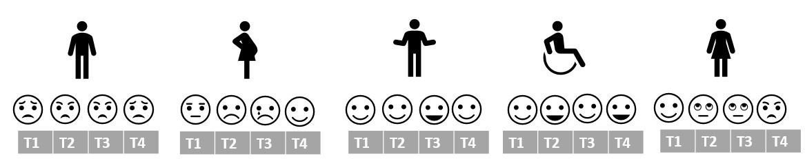
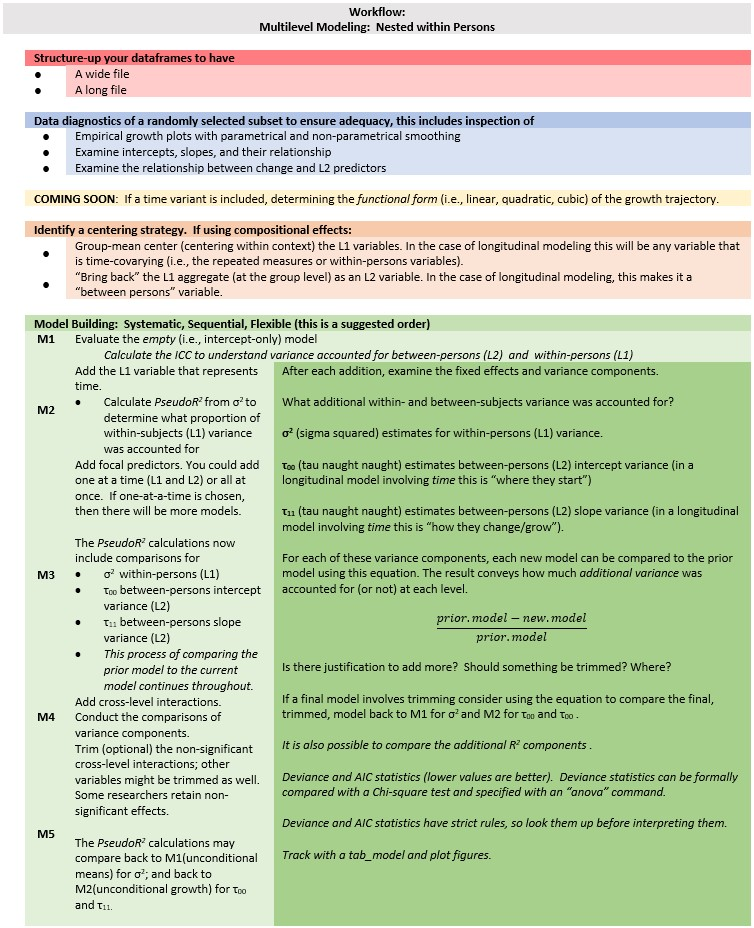

```{r }
options(scipen=999)#eliminates scientific notation
```

# Preliminary (OLS style) Exploration of Longitudinal Growth {#MLMexplore}

[Screencasted Lecture Link](https://spu.hosted.panopto.com/Panopto/Pages/Viewer.aspx?pid=36075f1d-b805-40b9-92da-ad2b0053f46c) 

This lesson is an introduction to longitudinal modeling when time is a factor. In this lecture we explore the longitudinal data using OLS tools.  Doing so provides the proper screening/vetting of the data to ensure that it is appropriate for multilevel analysis.  Simultaneously, it provides an orientation to the types of questions that MLM will address.

## Navigating this Lesson

There is about 1 hour and 20 minutes of lecture.  If you work through the materials with me it would be plan for an additional two hours

While the majority of R objects and data you will need are created within the R script that sources the chapter, occasionally there are some that cannot be created from within the R framework. Additionally, sometimes links fail.  All original materials are provided at the [Github site](https://github.com/lhbikos/ReC_CPA) that hosts the book. More detailed guidelines for ways to access all these materials are provided in the OER's [introduction](#ReCintro)

### Learning Objectives

Learning objectives from this lecture include the following:

* Identify the 3 criteria for longitudinal analysis (in an HLM/MLM framework)
* Know the key variable (type) requirements of a longitudinal dataset.
* Know the distinction (and lingo) between level-1 and level-2.
* Recognize the difference between wide and long files by instantaneous sight.
* Speculate about the findings by looking at the figures, means(*SD*), and correlations we produced.
* Interpret a correlation coefficient of intercepts and slopes.


### Planning for Practice

The suggestions for homework are graded in complexity and I encourage you to select an option(s) that will stretch you -- at least a bit. The more complete descriptions at the end of the chapter follow these suggestions.

The assignment is intended to span several lessons.  Using a dataset that is provided (or one of your own), walk through exploring, conducting, and writing up a complete multilevel model for change with each step below. Minimally, predictors must include time and an L2 variable.

FROM THIS LESSON

1.  Restructure the dataset from wide to long.
2.  Provide three examples of data exploration
    * An unfitted model
    * A model fitted with a linear growth trajectory
    * The fitted (or unfitted) data identified by the L2 predictor

FROM SUBSEQUENT LESSONS

3.  Using a staged approach to model development, report on at least four models, these must include
    * An unconditional means model
    * An unconditional growth model
    * An intermediary model (please test both a time variable and an L2 variable)
    * A final model
3.  Write up the Results as demonstrated in the lecture
4.  Table (use the tab_model outfile) and Figure are required

* Rework the problem in the chapter by changing the random seed in the code that simulates the data.  This should provide minor changes to the data, but the results will likely be very similar. SINCE I'M NOT CONVINCED THAT CHANGING THE RANDOM SEED DOES MUCH, I MAY CHANGE THIS ONE TO AN EXAMPLE I WORK WITH ANSWERS AT THE END.
* Data from a second MLM analysis from the research vignette are provided at the end. The only difference in the scenario is that the outcome variable changes from anxiety to depression. Use this data.
* Conduct a multi-level analysis with data to which you have access. This could include data you simulate on your own or from a published article. It is quite possible the conditions of your data will necessitate deviations from this approach. Investigate what they are and apply them.

### Readings & Resources

In preparing this chapter, I drew heavily from the following resource(s). Other resources are cited (when possible, linked) in the text with complete citations in the reference list.

* Singer, J. D., & Willett, J. B. (2003). A framework for investigating change over time/Chapter 1 and Exporing longitudinal data on change/Chapter 2 in *Applied longitudinal data analysis: Modeling change and event occurrence.* Oxford University Press. https://doi-org.ezproxy.spu.edu/10.1093/acprof:oso/9780195152968.001.0001
  * The [UCLA IDRE website](https://stats.idre.ucla.edu/other/examples/alda/) hosts R solutions (as well as SPSS, SAS, MPlus, and HLM) to many of the examples in this text.
* Lefevor, G. T., Janis, R. A., & Park, S. Y. (2017). Religious and sexual identities: An intersectional, longitudinal examination of change in therapy. *The Counseling Psychologist, 45*(3), 387–413. https://doi-org.ezproxy.spu.edu/10.1177/0011000017702721

I love the Singer and Willett [-@singer_applied_2003] text for so many reasons. Singer and Willet have published a number of articles together. In the Preface of their text they indicated that they were hired at Harvard at about he same time. Their colleagues expected them to voracious competitors. In contrast, they became great collaborators and made decisions about authorship early on. Their agreement was that in any collaboration they would randomly select who was first author, and they have (including for their text).

### Packages

The script below will (a) check to see if the following packages are installed on your computer and, if not (b) install them.
```{r tidy=TRUE, tidy.opts=list(width.cutoff=70), warning=FALSE, message=FALSE}
#will install the package if not already installed
#if(!require(robumeta)){install.packages("robumeta")}
#if(!require(tidyverse)){install.packages("tidyverse")}
#if(!require(psych)){install.packages("psych")}
#if(!require(lme4)){install.packages("lme4")}
#if(!require(nlme)){install.packages("nlme")}
#if(!require(sjstats)){install.packages("sjstats")}
#if(!require(scales)){install.packages("scales")}

```

## Change-Over-Time Analytics

There are a host of ways to investigate change over time:  longitudinal SEM, latent growth curve modeling, latent mixture models, and so forth.  We are focused on the subset of this approach that has so many names:  individual growth curve models, random coefficient models, multilevel models, linear mixed effects models, hierachical linear models.

Before we start down the longitudinal/repeated measures path, a note to say that this class of statistics was born out of a need to deal with *dependency* in the data and it applies to both *cross-sectional* and *longitudinal/repeated measures* models.

* Remember ANOVA?  *(Excepting repeated measure or mixed design ANOVA)* One of the statistical assumptions was that the data had to be *independent.*  That is, you could not have family members, co-workers, etc., in the dataset because their data would likely be correlated.
* In the context of these related circumstances (students in a classroom, supervisees of a manager) researchers were confused about how to handle the data.  Should they *aggregate* the dependent data (effectively reduce the sample size by taking the mean of all those in a dependent cluster and using it with the non-dependent data)?  Should they keep it *disaggregated* (effectively repeating/copying the non-dependent data for each member of the cluster)?  Each approach was fraught with difficulty.

Random coefficient regression models (RCR or RCM) are an effective alternative to ordinary least squares (OLS) to account for dependencies within the data.  The math and approach toward longitudinal modeling is largely the same as when we manage dependencies cross-sectional studies (e.g., members of a team, supervisors reporting to a leader/manager). A more thorough review of aggregation and disaggregation can be found in the *ReCentering Psych Stats* [chapter](#wGroups) devoted to cross-sectional data.


This class of analysis allows us to address questions about:

1. **Within-individual change**:  How does each person change over time?
    + These are descriptive questions:  Is change linear? nonlinear? consistent? fluctuating?
    + *level-1* concerns **within-individual change** over time
    + *individual growth trajectory* -- the way outcome values rise and fall over time
    + Goal is to describe the *shape* of each person's growth trajectory

2. **Interindividual differences in change**:  What predicts differences among people in their changes?
    + A relational question:  What is the association between predictors and patterns of change?  Are these relations moderated? 
    + *level-2* concerns **interindividual differences in change**
    + Do different people manifest different patterns of within-individual change?  What predicts these differences?
    + Goal is to detect heterogeneity in change across individuals and to determine the relationship between predictors and the shape of each person's individual growth trajectory.
    
Together, we map the research questions onto a *linked pair* of statistical models known as the *multilevel model for change*:

1.  a *level-1* (L1) model, describing within-individual change over time; and
2.  a *level-2* (L2) model, relating predictors to any interindividual differences in change


Asking these questions requires three criteria of the research design/data:

1.  **Multiple waves of data**
    + Contrast with a developmental psychologist analyzing cross-sectional data composed of children of differing ages.  In spite of compelling (and totally fine) research designs, the cross-sectional nature of the design can not rule out *plausible rival hypotheses*.
    + Contrast with two waves of data. Singer and Willett [-@singer_applied_2003] state that these data, "are only marginally better" (p. 10).  Two-wave researchers argued in favor of their *increment* (i.e, the simple difference between scores assessed on the two measurement occasions).  Even if the *increment* is large, Singer and Willett [-@singer_applied_2003] argue that the increment cannot describe the *process of change* because it cannot describe the *shape* (the focus of the *level-1* question). Singer and Willett further argue that two-wave studies cannot describe individual change trajectories because they confound true change with measurement error.
    + *How many waves?*  Within cost and logistical constraints, "more waves are always better."  More allows more complex modeling.  The statistical rule is that you need one-more-wave than the shape you wish to model.  For example, you need 2 waves for a straight line (linear model), 3 waves for a quadratic (1 hump) model, 4 waves for a cubic (2 curves) model, and so forth.

2.  **A substantively meaningful metric for time**
    + "Time is the fundamental predictor in every study of change; it must be measured reliably and validly in a sensible metric" (p. 10).  
    + What is sensible?  ages, grades, months-since-intake, miles, etc.  The choice of metric affects related decisions including number and spacing of waves.
    + Consider the *cadence* you expect in the outcome.  Weeks or number of sessions is sensible for psychotherapy studies.  Grade or age is sensible for education.  Parental or child age might make sense for parenting.
    + "The temporal variable can change only monotonically" (p. 12), that is, it cannot *reverse* diretions.  This means you can have height as a temporal variable, but not weight.
    + There is NOTHING SACRED about evenly spaced variables.  In fact, if you expect rapid nonlinear change during some periods, you should collect mored data at those times.  If you expect little movement, you can maybe space them urther apart.
    + *Time-structured* schedules assess all participants on an identical schedule (cb equally or unequally spaced).  *Time-unstructured* schedules allow data collection schedules to vary across individuals. Multi-level modeling can accomodate both.
    + No requirement for *balance*.  That is, each person can have a different number of waves.  While non-random attrition can be problematic for drawing inferences, individual growth modeling does not require balanced data.

3.  **An outcome that changes systematically**
    + The *content* of measurement is a substantive, not statistical decision.  However...
    + *How* the construct is measured *is* a statistical decision and "not all variables are equally suited" (p. 13).  Individual growth models are designed for continuous outcomes whose values change systematically over time.
    + *Continuous outcomes* are those that support "all the usual manipulations of arithmetic" (p. 13). That is, you can take differences between pairs of scores, add, subtract, multiply, divide.  Most psychometrically credible instruments will work.  BUT!
    + the "metric, validity, and precision" of the outcome must be preserved across time.  That is, the outcome scores must be "equatable over time".  That is, a given value of the outcome on any occasion must represent the same "amount" of the outcome on every occasion.    *Outcome equatability* is supported (in part) by using the identical instrument each time.
    + *Standardization* in the longitudinal context is hotly debated and not a simple solution for equating shifty metrics.  Why?  the SD units likely have different size/meaning at different intervals.  Transforming the *M* to 0.0 and the *SD* to 1.0 masks the variance differences that may exist.  The raw metric preserves the variance and avoids all the issues.
    + Outcomes should be *equally valid* across all measurement occasions.  For example, a multiplication test may be a valid measure of mathematical skill among young children, but a measure of memory among teenagers.
    + Although *precision* need not be identical at every occasion, the goal is to minimize errors introduced by instrument administration.  Look for reliabilities of .8 and above.

"Structuring up" a longitudinal data set and engaging in preliminary data anlaysis is a great way to further understand this approach to statistical modeling.  So, let's transition to our research vignette.

## Workflow for Longitudinal MLM




## Research Vignette

Our research vignette [@lefevor_religious_2017] examines the intersection of religious and sexual identities of clients in therapy. With 12,825 participants from the Center for Collegiate Mental Health 2012-2014 data set, the project is an example of working with *big data.* Because the data is available to members only (and behind a paywall), I simulated the data. In the simulation, categorical variables (e.g., sexual identity, session number, religious identity) were rendered as continuous variables and in the simulation, I needed to transform them back into categorical ones. Inevitably, this will have introduced a great deal of error. Thus, we can expect that the results from the simulated data will be different from those obtained by the authors. 

The Method section of the article provides detailed information about the inclusion criteria ofr the study and the coding of the variables. This included data about the religious and sexual identities as well as a minimum of three separate scores on the Counseling Center Assessment of Psychologial Sympsoms [CCAPS, @locke_development_2012] measure. For the final dataset, clients attended an average of 10.58 sessions (*SD* = 7.65) and had an average of 5.36 CCAPS administrations (*SD* = 4.04).  This means that in the original dataset, each client was represented by a varying number of observations (likely ranging from 3 [the minimum required for inclusion] and, perhaps as many as 17 [adding +3*SD*s to the mean CCAPS administrations]). In simulating the data, I specified five observations for each of the 12,825 clients.

```{r echo = FALSE, results='hide'}
5.36 + 4.04*(3)
```

Let's take a look at the variables in the study

* **Anxiety and Depression**:  The anxiety and depression ratings were taken from the CCAPS measure [@locke_development_2012] that assesses psychological distress across seven domains. Clients rate themselves over the past two weeks on a 5-point Likert-type scale ranging from 0 (*not at all like me*) to 4 (*extremely like me*). Higher scores indicate more distress. The dataset comes from multiple institutions with different procedures around assessment CCAPS there is not a 1:1 correspondence with session number and CCAPS assessment.

* **Sexual Identity**:  Sexual identity was dichotomized into heterosexual (-1, 85.5%) and LGBQQ (1, 14.5%).

* **Relious Identity**:  Religious identity was coded into three categories including dominant religious (DR; Christian, Catholic), nondominant religious (NDR; Muslim, Hindu, Buddhist, Jewish), and nondominant unaffiliated (NDU; agnostic, atheist, no preference).  The three categories were contrast coded with an orthogonal contrast-coding scheme with two variables.  The first variable compared DR(coded as 2) to NDU and NDR (coded as -1); the second variable compared the two nondominant groups (NDU = -1, DR = 0, NDR = 1). 


### Simulating the data from the journal article

```{rtidy=TRUE, tidy.opts=list(width.cutoff=70), echo=FALSE, results='hide'}
#calculations for the simulation
#SD estimated by multiplying SE by square root of N
.02 *sqrt(12825)
#SD for anxiety in empty model
.02*sqrt(12825)

#Range (+/- 3SD) for anxiety in Mod5
2.03 - 3*(.02 *sqrt(12825))
2.03 + 3*(.02 *sqrt(12825))

#Range (+/- 3SD) for session in Mod5
-.22 - 3*(.01 *sqrt(12825))
-.22 + 3*(.01 *sqrt(12825))

#Range (+/- 3SD) for sexual identity in Mod5
.13 - 3*(.02 *sqrt(12825))
.13 + 3*(.02 *sqrt(12825))

#Range (+/- 3SD) for Religious 1 in Mod4
-.03 - 3*(.01 *sqrt(12825))
-.03 + 3*(.01 *sqrt(12825))

#Range (+/- 3SD) for Religious 1 in Mod4
.01 - 3*(.01 *sqrt(12825))
.01 + 3*(.01 *sqrt(12825))
```

```{r  tidy=TRUE, tidy.opts=list(width.cutoff=70), results='hide'}
set.seed(200513)
n_client = 12825
n_session = 5
b0 = 2.03 #intercept for anxiety
b1 = -.22 #b weight for L1 session
b2 = .13 #b weight for L2 sexual identity
b3 =  -.03 #b weight for L2 Rel1 (D-R vs ND-R & ND-U)
b4 = .01 #b weight for the L2 Rel2 (ND-R vs ND-U)
#the values used below are the +/- 3SD they produce continuous variables which later need to be transformed to categorical ones; admittedly this introduces a great deal of error/noise into the simulation
#the article didn't include a correlation matrix or M/SDs so this was a clunky process 
( Session = runif(n_client*n_session, -3.61, 3.18)) #calc L1 Session, values are the +/3 3SD
( SexualIdentity = runif(n_client*Session, -6.66, 6.92)) #calc L2 Sexual Identity, values are the +/3 3SD
( Religion1 = runif(n_client*Session, -3.43, 3.37)) #calc L2 Religion1, values are the +/3 3SD
( Religion2 = rep (runif(n_session, -3.38, 3.41), each = n_session)) #calc L2 Religion2, values are the +/3 3SD
mu = 1.76 #intercept of empty model 
sds = 2.264 #this is the SD of the DV
sd = 1 #this is the observation-level random effect variance that we set at 1

#( church = rep(LETTERS[1:n_church], each = n_mbrs) ) #this worked in the prior
( client = rep(LETTERS[1:n_client], each = n_session) )
#( session = numbers[1:(n_client*n_session)] )
( clienteff = rnorm(n_client, 0, sds) )
( clienteff = rep(clienteff, each = n_session) )
( sessioneff = rnorm(n_client*n_session, 0, sd) )
( Anxiety = b0 + b1*Session + b2*SexualIdentity + b3*Religion1 + b4*Religion2 + clienteff + sessioneff)
( dat = data.frame(client, clienteff, sessioneff, Session, SexualIdentity, Religion1, Religion2, Anxiety) )

library(dplyr)
dat <- dat %>% mutate(ID = row_number())
#moving the ID number to the first column; requires 
dat <- dat%>%select(ID, everything())

Lefevor2017 <- dat%>%
  select(ID, client, Session, SexualIdentity, Religion1, Religion2, Anxiety)

Lefevor2017$ClientID <- rep(c(1:12825), each = 5)
#rounded Sexual Identity into dichotomous variable
#85% were heterosexual, 

library(robumeta)
#The following variables should be L2, but were simulated as if they were L1
Lefevor2017$Rel1 <- as.numeric(group.mean(Lefevor2017$Religion1,Lefevor2017$ClientID))#aggregated at group mean
Lefevor2017$Rel2 <- as.numeric(group.mean(Lefevor2017$Religion2,Lefevor2017$ClientID))#aggregated at group mean
Lefevor2017$SxID <- as.numeric(group.mean(Lefevor2017$SexualIdentity,Lefevor2017$ClientID))#aggregated at group mean

#Rel2 has contrast codes for dominant religion (DR, 0), nondominant religious (NDR, 1) and nondominant unspecified (NDU, -1)
#Strategy is to figure out the raw score associated with the percentile rank of  -1 and 0, to set the breakpoints for the coding
#NDU coded as -1
#19.2+13.5+9.6
#NDU has bottom 42.3 percent

#DR coded as 0, so quantile cut will be 42.3 + 52.7 = 95th
#33.4 + 19.3
#52.7% of sample (according to article) was DR
#must look up percentile ranks for 5% and 57.5%

#NDR
#2.3+1+1+.7
#NDR has 5% of sample
#42.3+52.7
#quantile(Lefevor2017$Religion2, probs = c(.423, .95))
#effects coding the second Religion variable so that NDU = -1, DR = 0, NDR = 1
Lefevor2017$Rel2L2 <- ifelse(Lefevor2017$Religion2 <= -3.0877087, -1, 
                             ifelse(Lefevor2017$Religion2 >= -3.0877087 & Lefevor2017$Religion2 <= 0.9299491, 0,1))

#checking work
#Rel2L2_table <- table(Lefevor2017$Rel2L2)
#prop.table(Rel2L2_table)
#Lefevor2017 %>%
#count(Rel2L2)

#creating the first religion variable where DR is 2 and NDR and NDU are both -1
Lefevor2017$Rel1L2 <- plyr::mapvalues(Lefevor2017$Rel2L2, from = c(-1, 0, 1), to = c(-1, 2, -1))
Lefevor2017$DRel0 <- plyr::mapvalues(Lefevor2017$Rel2L2, from = c(-1, 0, 1), to = c(1, 0, 1))

#checking to make sure that 52.7% are coded 2 (DR)
#Rel1L2_table <- table(Lefevor2017$Rel1L2)
#prop.table(Rel1L2_table)

#heterosexual is -1
#LGBTQIA+ is 1
#quantile(Lefevor2017$SxID, probs = c(.85))
Lefevor2017$SexID <- ifelse(Lefevor2017$SxID <= 1.203468, -1,1)
Lefevor2017$Het0 <- plyr::mapvalues(Lefevor2017$SexID, from = c(-1,1), to = c(0,1))
#SexID_table <- table(Lefevor2017$SexID)
#prop.table(SexID_table)

#creating a variable representing the session number for each client, in the article up to 20 sessions were allowed. 
#install.packages("scales")
library(scales)
#Right from the beginning I centered this so that 0 would represent intake
Lefevor2017$Session0 <- as.integer(scales::rescale(Lefevor2017$Session, to = c(0, 19)))

#creating session waves (1 thru 5) by rank ordering within each person's variable the continuous variable Session that was created in the original simulation
library(dplyr)
Lefevor2017 <- Lefevor2017%>%
  dplyr::group_by(ClientID) %>%
  mutate(Index = rank(Session))

#selecting the simulated variables
Lefevor2017_sim <- Lefevor2017%>%
  select(ClientID, Index, Session0, Anxiety, DRel0, Het0)

#In the transition from long-to-wide, it seems like you can only do one L1 variable at a time
#When there are multiple L1 and L2 vars, put all L2 vars on left of tilde
#The wave/index function should come next; this should be finite (like integers of 1,2,3,4) with a maximum
#Put the name of the SINGLE L1 variable in the concatonated list
library(data.table)
LfvrWp1<-reshape2::dcast(Lefevor2017_sim, ClientID + DRel0 + Het0 ~ Index, value.var = c("Index"))
#rename the anxiety variable
LfvrWp1<-  rename(LfvrWp1, Index1 = "1", Index2 = "2", Index3 = "3", Index4 = "4", Index5 = "5")
LfvrWp2<-reshape2::dcast(Lefevor2017_sim, ClientID ~ Index, value.var = c("Anxiety"))
#rename the anxiety variable
LfvrWp2<-  rename(LfvrWp2, Anx1 = "1", Anx2 = "2", Anx3 = "3", Anx4 = "4", Anx5 = "5")
#For remaining L1 variable, do them one at a time -- key them from the person-level ID and the wave/index.
LfvrWp3<-reshape2::dcast(Lefevor2017_sim, ClientID ~ Index, value.var = c("Session0"))
LfvrWp3<-  rename(LfvrWp3, Sess1 = "1", Sess2 = "2", Sess3 = "3", Sess4 = "4", Sess5 = "5")
#Next, join the dataframes by the person-level ID
#Only two can be joined at a time
LfvrWide <- dplyr::full_join(LfvrWp1, LfvrWp2, by = c("ClientID"))
LfvrWide <- dplyr::full_join(LfvrWide, LfvrWp3,  by = c("ClientID"))
```


To increase the portability of the OER, this chapter uses simulated data. Here is script for exporting/downloading the data as a .csv file to your local computer and then importing/uploading it again. I find that saving the .csv file (data) in the same place as the .rmd file(s) is essential for R to connect the two.

Because this simulation can take a few minutes, you may wish to do this, even as you work through this chapter, so that resimulations take less time and comuting resources.
```{r tidy=TRUE, tidy.opts=list(width.cutoff=70)}
write.table(LfvrWide, file="LefevorWide.csv", sep=",", col.names=TRUE, row.names=FALSE)
LfvrWide <- read.csv ("LefevorWide.csv", head = TRUE, sep = ",")
```


## Longitudinal Exploration

### The Structure of the Data File as the First Step in Understanding Longitudinal Modeling

We are accustomed to viewing data in its *wide* format. The wide format is also technically termed the **person-level** data set or the *multivariate* format of data.  It is characterized by the following:

* Each person has one record and multiple variables contain the data from each measurement occasion; a 16-person set has 16 records while a 20,000 person set has 20,000 records.
* As you collect additional waves, a person-level file gains new variables (not new cases).
* In the context of longitudinal modeling, data in this form allows us to visually examing an *empirical growth record* (the temporally sequenced outcomes).
* This wide file arrays each person's empirical growth record horizontally

There are **disadvantages** to the wide format:

* The summaries are uninformative.
* It omits an explicit time variable.
* It is inefficient/useless when the number and spacing of waves varies
* It cannot handle the presence of time-varying predictors.

```{r tidy=TRUE, tidy.opts=list(width.cutoff=70)}
library(psych)
round(psych::describe(LfvrWide),3)
```

We *could* (but it is not advised in this specific instance) use the wide format to create the multilevel correlation matrix, allowing us to see the correlations between the person-level (L2) variables of religious identity and sexual identity with the repeated measures variable (L1), anxiety. 

The bivariate correlations tell us little about change-over-time for individuals or groups.  However, in this dataset we can see a strong correlation (they are all *r* = .80) between anxiety at one session and the next.

Thinking of what it takes to get a positive and strong correlation (e.g., relative rankings must stay stable), we learn that the *rank order* of clients (relative to anxiety) remains relatively stable across occasions, but it does not tell us how each person changes over time nor about the direction of change.  

```{r tidy=TRUE, tidy.opts=list(width.cutoff=70), warning=FALSE, message=FALSE}
#Multilevel level correlation matrix
apaTables::apa.cor.table(LfvrWide[c(
"DRel0", "Het0", "Anx1", "Anx2", "Anx3", "Anx4", "Anx5")], show.conf.interval = FALSE, landscape = TRUE, table.number = 1, filename="Lfvr2017_CorMatrix.doc")
```
I should note that a bivariate matrix created from the wide format is rather useless when the assessments are unevenly spaced (time-unstructured; ours are) and the dataset is unbalanced (ours is). 

### Job#1 is to get our data from person-level into person-period

**Person-period data set** aka a *long* or *univariate* file:  

* Each person has multiple records -- one for each measurement occasion.
* As you collect additional waves,the file gains new records, but no new variables
* This long file arrays each person's empirical growth record vertically
* 4 types of variables
    + Subject identifier -- typically in the first column and identical across waves; required for sorting and grouping
    + Time indicator -- often labeled AGE, WAVE, or TIME (or something sensible); it is fine  to have "unstructured time" (e.g., 0.5, 1.2, 3.4 months)
    + Outcome variable(s) -- time-varying, but represented by a single variable/column 
    + Predictor variable(s) -- each individual predictor (whether time-covarying or time-invariant) is represented by a single variable/column

Let's restructure (shapeshift) our dataset with the technique known as *melting*.

Each set of variables being melted in each set being restructured need to be on the same scale.  In this problem, the Anx# and Sess# variables should be on the same scale.
```{r }
str(LfvrWide)
```
They are.  Each is *num*eric.

```{r tidy=TRUE, tidy.opts=list(width.cutoff=70)}
library(data.table) #the package for melting (better than reshape2 because it can accommodate multiple repeated measures variables)

#add the name of the wide df after "setDT"
#id.vars are L2 variables that do not change over time
#measure.vars are those that change over time; if there is more than one that is time-covarying, add a comma followed by another another concatonated list.

LfvrLong <- (data.table::melt(setDT(LfvrWide), id.vars = c("ClientID", "DRel0", "Het0"), measure.vars =list(c("Anx1", "Anx2", "Anx3", "Anx4", "Anx5"), c("Sess1", "Sess2", "Sess3", "Sess4", "Sess5"))))
```
Take a peek at LfvrLong:

* Anx1 through Anx5 and Sess1 through Sess5 are gone
* Two new variables have appeared
  - *variable* is the former variable name; it represents the *unit* of time (or condition) associated with the repeated measure
  - *value* is the value of that measurement for that person
* We must rename these
```{r tidy=TRUE, tidy.opts=list(width.cutoff=70)}
#This process  does not preserve the variable names, so we need to rename them
LfvrLong<-  rename(LfvrLong<-  rename(LfvrLong<-  rename(LfvrLong, Index = variable, Anxiety = "value1", SesNum = "value2")))

#rearranging variables so that IDs are together
LfvrLong <- LfvrLong%>%
  select(ClientID, Index, SesNum, Anxiety, DRel0, Het0)
#resorting data so that each person is together
LfvrLong <- arrange(LfvrLong, ClientID, Index)


```
It can be helpful to have this written to your local file so you can bring it back in without having to re-prep it.
```{r tidy=TRUE, tidy.opts=list(width.cutoff=70)}
write.table(LfvrLong, file="LfvrLong.csv", sep=",", col.names=TRUE, row.names=FALSE)
LfvrLong <- read.csv ("LfvrLong.csv", head = TRUE, sep = ",")
```

Let's peek at the characteristics and descriptives as a result of this restructuring from wide to long.
```{r tidy=TRUE, tidy.opts=list(width.cutoff=70)}
str(LfvrLong)
round(psych::describe(LfvrLong),3)
```

Evaluating longitudinal growth trajectories in MLM means that we invest in substantial preliminary exploration.

With the long form of data, we can properly examine multilevel descriptives and correlations.

### Multilevel Descriptive Statistics and Correlations

```{r tidy=TRUE, tidy.opts=list(width.cutoff=70)}
misty::multilevel.descript(LfvrLong[, c("SesNum", "Anxiety", "DRel0", "Het0")],
               cluster = LfvrLong$ClientID)
```
Here we learn that we have 64125 observations provided by 12825 clients. Each client has provided data from 5 counseling sessions (with no variability around that -- the beauty of simulated data). We can see the mean for anxiety (*M* = 2.08); since the dominant religion and heterosexual variables are dichotomous, the values in the "mean" row indicate the proportion of clients that are part of a non-dominant religion (60%) and who are LGBQQ (28%). These descriptive statistics also provide a preliminary indication of the intraclass correlation (ICC), which quantifies the proportion of total variance in a dataset that is due to variability between groups (i.e., clusters, levels) relative to total variance. The *official* ICC we will use will come from our empty model. This preliminary value associated with our dependent variable (0.780) indicates that a substantial amount of variance is between subjects. Therefore, we cannot ignore the dependency introduced by the longitudinal nature of the data and we should use a procedure like multilevel modeling.

We can also look at multilevel correlations. This program does not like dichotomous variables, so I only included those that are continuous.

```{r tidy=TRUE, tidy.opts=list(width.cutoff=70)}
corrmatrix <- misty::multilevel.cor(LfvrLong[, c("SesNum", "Anxiety")],
               cluster = LfvrLong$ClientID, split=FALSE, output = TRUE, write = "MLMcorr.xlsx", print = c("cor", "p"), digits = 3, missing = "listwise")
corrmatrix
```
The lower half of the triangle has the within person multilevel corelation. within each person, as sessions increase, anxiety decreases (*r* = -0.357, *p* < 0.001). In contrast, at the group level, more sessions are not correlated with changes in anxiety (*p* = 0.052, *p* = 0.382)

### Empirical Growth Plots

```{r  message=FALSE, warning=FALSE}
library(lattice)
library(ggplot2)
```

Researchers commonly look at individual dataplots to see if there are clear trends/patterns across the individuals.  Do they rise?  Is there a curve?  Do some rise and some fall?

With the *lattice* package we are asking for the anxiety scores to be plotted by session, for each person (noted with "ClientID").

Especially in large datasets it is common to create a smaller subset of data for this inspection. The easiest way I found to do this was to grab a set of 30 from the wide file and then quickly turn it to a long file.

```{r tidy=TRUE, tidy.opts=list(width.cutoff=70)}
set.seed(210515)
RndmSmpl30 <- LfvrWide[sample(1:nrow(LfvrWide), 30,
   replace=FALSE),] 
RndmLong <- (data.table::melt(setDT(RndmSmpl30), id.vars = c("ClientID", "DRel0", "Het0"), measure.vars =list(c("Anx1", "Anx2", "Anx3", "Anx4", "Anx5"), c("Sess1", "Sess2", "Sess3", "Sess4", "Sess5"))))
RndmLong<-  rename(RndmLong<-  rename(RndmLong<-  rename(RndmLong, Index = variable, Anxiety = "value1", Session0 = "value2")))
#resorting data so that each person is together
RndmLong <- arrange(RndmLong, ClientID, Index)
```


### Plotting a Trajectory as Summary of Each Person's Empirical Growth Record

Singer and Willett [-@singer_applied_2003] suggest that we do this two ways:

* *nonparametric* models let the "data speak for themselves" by smoothing across temporal idiosyncracies without imposing a specific functional form
* *parametric* models impose a researcher-selected common functional form (e.g., linear, quadratic, cubic) and then fit a separate regression model to each person's data, yielding a "fitted trajectory"

While our multilevel modeling will use maximum likelihood, these individual plots are fitted with OLS regression models.

A better "group-by" tool:  
http://r4stats.com/2017/04/18/group-by-modeling-in-r-made-easy/ 


#### Nonparametrical Smoothing of the Empirical Growth Trajectory**

The "smoothed" nonparametric trajectory is superimposed on the data.

To evaluate, focus on elevation, shape, and title.  Where do scores hover at the low, medium, or high end?  Does everyone change over time or do some remain the same?  Is there an overall pattern of change:  linear, curvilinear, smooth, steplike?  Is the rate of change similar or different across people.

Below I have shown how to plot these with variable, Index variable and then again with the variable, Session.  Recall that Index is a structured form of counting across the 5 client sessions.  In contrast, Session is "time-unstructured" because the intervals are unevenly spaced.  Our Index variable clocks 1 through 5; Session0 starts at 0.0, providing a better "intercept" at the first session. Singer and Willett [-@singer_applied_2003] recommend also  staring at the entire set together as a group.  Notice anything?

```{r tidy=TRUE, tidy.opts=list(width.cutoff=70), warning=FALSE}

xyplot(Anxiety~Session0 | ClientID, data=RndmLong,
  prepanel = function(x, y) prepanel.loess(x, y, family="gaussian"),
  xlab = "Session", ylab = "Anxiety",
  panel = function(x, y) {
  panel.xyplot(x, y)
  panel.loess(x,y, family="gaussian") },
   as.table=T)

xyplot(Anxiety~Index | ClientID, data=RndmLong,
  prepanel = function(x, y) prepanel.loess(x, y, family="gaussian"),
  xlab = "Index", ylab = "Anxiety",
  panel = function(x, y) {
  panel.xyplot(x, y)
  panel.loess(x,y, family="gaussian") },
   as.table=T)
```

When we examine these, we simply look for patterns:

* Are there *general* trends?
  * Seems like anxiety tends to go downward
* Are the levels at the start of the study (Wave 1, intercept) at the same place?  Or differenct?
  * In this dataset, they are definitely different.
* Is the change-over-time (slope) linear or curvilinear?
  * The general trend seems to be linear -- a decline or staying flat
  * Some show "bump ups" in anxiety before it declines again
  * One case shows a "bump down" in anxiety and then it rises again

Because clients (a) start at different points and (b) change differently, MLM is a reasonable approach to analyzing the data. Our choice of L1 (time-covarying) and L2 (person-level) variables may help disentangle these differences. 

As we continue the preliminary exploration, I will use the Session0 variable as our representation of time because it is "truer" to the data.

#### Parametric Smoothing of the Empirical Growth Trajectory w OLS Regression**

Here we fit a separate parametric model to each person's data; OLS is appropriate for this preliminary exploration. Next we can summarize each person's growth trajectory by fitting a separate parametric model to each person's data. Singer and Willett [-@singer_applied_2003] indicate that this is "hardly the most efficient use of longitudinal data...[but] it connects empirical researchers with their data in a direct and intimate way" (p. 28).

We must identify a "common functional form" (e.g., linear, quadratic, cubic) to fit to all the individuals.  Clearly, this is an oversimplification. However, it allows us to easily spot folks for whom the model works and does not. Often the best choice is a straight line and that's what we will do here.

There are three steps:

1.  Estimate a within-person regression model for each person.  This means we regress the outcome [Anxiety] on some representation of time(we'll use Session0 around 0). In order to conduct separate analyses for each person, we conduct the regression analysis "by Client"
2.  Use summary statistics from all the within-person regression models into a separate data set. For a linear change model, the intercept and slope summarize their growth trajectory; the $R^2$ and residual variance statistics summarize the goodness of fit.
3.  Superimpose each person's fitted regression line on a plot of their empirical growth record.  

Let's start with step #1:

This little script produces individual regression models for each person.

```{r tidy=TRUE, tidy.opts=list(width.cutoff=70)}
ANX_OLS <- function (RndmLong){
  summary(lm(Anxiety ~ Session0, data = RndmLong))
}
by(RndmLong, RndmLong$ClientID, ANX_OLS)
```

Looking at our data, we might observe:

* $R^2$ values range from 0 to 74%
* Level of anxiety starts at different places
* For many, anxiety decreases as a function of session
  * but not for all,
  * and for a few it goes negative

Next we superimpose each client's fitted OLS trajectory on their empirical growth plot.

```{r  tidy=TRUE, tidy.opts=list(width.cutoff=70), warning=FALSE}
xyplot(Anxiety ~ Session0 | ClientID, data=RndmLong,
  panel = function(x, y){
    panel.xyplot(x, y)
    panel.lmline(x, y)
  },  as.table=T)
```

What do we observe?  A linear change trajectory

* is ideal for a few members
* reasonable for many others
* The $R^2$ coincides well with those for whom the line is the best fit

Singer and Willett [-@singer_applied_2003] can read your minds, "Don't OLS regression methods assume independence and homoscedastic residuals?" Why, yes!  They do.  Singer and Willett indicate OLS estimates are very useful for exploratory purposes in that they provide an unbiased estimate of the intercept and slope of the individual change.

#### Snapshot of the Entire Set of Smooth Trajectories**

We can plop all our trajectories in a set of smoothed individual trajectories. This first plot is simply the raw data.  This first plot is just a smoothed (there is a line for each client) plot of the raw/natural metric of the data.

```{r tidy=TRUE, tidy.opts=list(width.cutoff=70)}
#plot of raw data for every case
#Session0 provided splotchy data; Index0 gives some indication of change
interaction.plot(RndmLong$Index, RndmLong$ClientID, RndmLong$Anxiety)
```


The next two sets of code plot our fitted trajectories into a single plot. 

First, we fit the model.
```{r  tidy=TRUE, tidy.opts=list(width.cutoff=70)}
#fitting the linear model by ID
fit <- by(RndmLong, RndmLong$ClientID, 
          function(bydata) fitted.values(lm(Anxiety ~ Session0, data=bydata)))
fit <- unlist(fit)
```
Then make the plot.
```{r tidy=TRUE, tidy.opts=list(width.cutoff=70)}
#plotting the linear fit by ID
interaction.plot(RndmLong$Index, RndmLong$ClientID, fit, xlab="Sessions", ylab="Anxiety")
```

What do we observe? Clients present with varying levels of anxiety.  On average, change in anxiety declined (at least a little) from the first wave to the fifth.

### Examining intercepts, slopes, and their relationship 

*Sample means of the estimated intercepts and slopes* (level-1 OLS estimated intercepts and slopes) are unbiased estimates of initial status and rate of change *for each person*.  Their sample means are, therefore, unbiased estimates of the key features of the average observed change trajectory.

*Sample variances (SDs) of the estimated intercepts and slopes* quantify the amount of observed interindividual heterogeneity in change.

```{r tidy=TRUE, tidy.opts=list(width.cutoff=70)}
#obtaining the intercept from the linear model by ClientID
ints <- by(RndmLong, RndmLong$ClientID,
          function(data) coefficients(lm(Anxiety ~ Session0, data=data))[[1]])
ints1 <- unlist(ints)
names(ints1) <- NULL
mean(ints1)
```

```{r }
sqrt(var(ints1))
```

Our calculations tell us that at Session 1, anxiety is 3.23 (*SD* = 2.69).  

The next two values calculate the slope and its variation.

```{r tidy=TRUE, tidy.opts=list(width.cutoff=70)}
#obtaining the slopes from linear model by id
slopes <- by(RndmLong, RndmLong$ClientID,
            function(data) coefficients(lm(Anxiety ~ Session0, data=data))[[2]])
slopes1 <- unlist(slopes)
names(slopes1) <- NULL
mean(slopes1)
```

```{r }
sqrt(var(slopes1))
```

Here we learn that the average slope is -0.07 (*SD* = 0.08).  On average, anxiety decreases by .07 points per session.  Relative to their means, the magnitudes of the *SD*s around the slope and intercept are pretty big, so there is a great deal of variation.

**Sample correlation between the estimated intercepts and slopes** summarizes the association between the fitted initial status and fitted rate of change.  It answers the question, "Are observed initial status and rate of change related?"

```{r }
cor( ints1, slopes1)
```

Not really.  *r* = 0.01. 


### Exploring the relationship between Change and Time-Invariant Predictors

Looking at our level-2 predictors can help uncover *systematic interindividual differences in change*.  In this vignette religious affiliation and sexual identity are our L2 predictors.

Let's start with religious affiliation Is there a difference in intercept (initial tolerance) or slope (rate of change) as a function of religious affiliation?

We start by selecting DR, fitting a regression model, and plotting it.

```{r tidy=TRUE, tidy.opts=list(width.cutoff=70)}
#fitting the linear model by ID, DR only
DR <- filter(RndmLong, DRel0=="0")
fitmlist <- by(DR, DR$ClientID, function(bydata) fitted.values(lm(Anxiety ~ Session0, data=bydata)))
fitDR <- unlist(fitmlist)
```

```{r tidy=TRUE, tidy.opts=list(width.cutoff=70)}
#appending the average for the whole group of DR
lm.DR <- fitted( lm(Anxiety ~ Session0, data=DR) )
names(lm.DR) <- NULL
fit.DR2 <- c(fitDR, lm.DR[1:5])
Sess1.DR <- c(DR$Index, seq(1,5))#Note that I used Session0 to create the lm, but plotted by Index0
id.DR <- c(DR$ClientID, rep(30, 5))
```

```{r tidy=TRUE, tidy.opts=list(width.cutoff=70)}
#plotting the linear fit by id, males
#id.m=111 denotes the average value for males
interaction.plot(Sess1.DR, id.DR, fit.DR2, ylim=c(-2, 8), xlab="Sessions", ylab="Anxiety", lwd=1)
title(main="Dominant Religious")
```
Trajectories for those from dominantreligions stay flat; a few decline.

Now for non-dominant religious (including those that are affiliated and unaffiliated).

```{r tidy=TRUE, tidy.opts=list(width.cutoff=70)}
#fitting the linear model by ID, DR only
NDR <- filter(RndmLong, DRel0=="1")
fitmlist <- by(NDR, NDR$ClientID, function(bydata) fitted.values(lm(Anxiety ~ Session0, data=bydata)))
fitNDR <- unlist(fitmlist)
```

```{r tidy=TRUE, tidy.opts=list(width.cutoff=70)}
#appending the average for the whole group of males
lm.NDR <- fitted( lm(Anxiety ~ Session0, data=NDR) )
names(lm.NDR) <- NULL
fit.NDR2 <- c(fitNDR, lm.NDR[1:5])
Sess1.NDR <- c(NDR$Index, seq(1,5))#Note that I used Session0 to create the lm, but plotted by Index0
id.NDR <- c(NDR$ClientID, rep(30, 5))
```

```{r tidy=TRUE, tidy.opts=list(width.cutoff=70)}
#plotting the linear fit by id, males
#id.m=111 denotes the average value for males
interaction.plot(Sess1.NDR, id.NDR, fit.NDR2, ylim=c(-2, 8), xlab="Sessions", ylab="Anxiety", lwd=1)
title(main="Non-Dominant Religious")
```

It appears that there is more decline in anxiety for those who claim non-dominant religions.

What about the effects of sexual identity?

```{r tidy=TRUE, tidy.opts=list(width.cutoff=70)}
#fitting the linear model by ID, HET = 0 only
HET <- filter(RndmLong, Het0=="0")
fitmlist <- by(HET, HET$ClientID, function(bydata) fitted.values(lm(Anxiety ~ Session0, data=bydata)))
fitHET <- unlist(fitmlist)
```

```{r tidy=TRUE, tidy.opts=list(width.cutoff=70)}
#appending the average for the whole group of males
lm.HET <- fitted( lm(Anxiety ~ Session0, data=HET) )
names(lm.HET) <- NULL
fit.HET <- c(fitHET, lm.HET[1:5])
Sess1.HET <- c(HET$Index, seq(1,5))#Note that I used Session0 to create the lm, but plotted by Index0
id.HET <- c(HET$ClientID, rep(30, 5))
```

```{r tidy=TRUE, tidy.opts=list(width.cutoff=70)}
#plotting the linear fit by id, males
#id.m=111 denotes the average value for males
interaction.plot(Sess1.HET, id.HET, fit.HET, ylim=c(-2, 8), xlab="Sessions", ylab="Anxiety", lwd=1)
title(main="Heterosexual")
```

Among clients who identify as heterosexual, there is a mixed profile.  Clients start with varying degrees of anxiety and we see it stay the same, increase, and decrease.

```{r tidy=TRUE, tidy.opts=list(width.cutoff=70)}
#fitting the linear model by ID, DR only
LGBQQ <- filter(RndmLong, Het0=="1")
fitmlist <- by(LGBQQ, LGBQQ$ClientID, function(bydata) fitted.values(lm(Anxiety ~ Session0, data=bydata)))
fitLGBQQ <- unlist(fitmlist)
```

```{r tidy=TRUE, tidy.opts=list(width.cutoff=70)}
#appending the average for the whole group of males
lm.LGBQQ <- fitted( lm(Anxiety ~ Session0, data=LGBQQ) )
names(lm.LGBQQ) <- NULL
fit.LGBQQ <- c(fitLGBQQ, lm.LGBQQ[1:5])
Sess1.LGBQQ <- c(LGBQQ$Index, seq(1,5)) #Note that I used Session0 to create the lm, but plotted by Index0
id.LGBQQ <- c(LGBQQ$ClientID, rep(30, 5))
```

```{r tidy=TRUE, tidy.opts=list(width.cutoff=70)}
#plotting the linear fit by id, males
#id.m=111 denotes the average value for males
interaction.plot(Sess1.LGBQQ, id.LGBQQ, fit.LGBQQ, ylim=c(-2, 8), xlab="Sessions", ylab="Anxiety", lwd=1)
title(main="LGBQQ")
```

What do we observe?  Clients who identify as LGBQQ start at different levels of anxiety; most decline somewhere in the middle and then maintain in a consistent/level manner.


### The Relationship between OLS-Estimated Trajectories and Substantive Predictors

Below are two plots (and corresponding correlation coefficients) for religious affiliation and sexual identity regarding intercept (or initial status).  They help us answer the question, is initial status different as a function of gender (then, exposure level).

*NOTE* that these are calculated from the the wide-format.

**First, is anxiety at Session0 (our initial, or intercept) different for those from dominant and nondominant religions?**

For these analyses of intercepts, the fitted model that we are using for the plot and correlation keeps the assessment at the Session0 intercept.

```{r tidy=TRUE, tidy.opts=list(width.cutoff=70)}
#Using the slopes and intercepts from the linear model fitted by id
#generated for use in table 2.3
plot(RndmSmpl30$DRel0, ints1, xlab="Religion", ylab="Fitted initial status")
```

```{r }
cor(RndmSmpl30$DRel0, ints1)
```

For religion, looking at the dots on 0 and 1 and the correlation, it looks like the anxiety intercept is lower for those from the dominant religion.

**Next, is Anxiety at Session 1 different as a function of level of sexual identity?**

```{r tidy=TRUE, tidy.opts=list(width.cutoff=70)}
plot(RndmSmpl30$Het0, ints1, xlab="Sexual Identity", ylab="Fitted initial status")
```
The plot of this random sample of data emphasizes that those who identify as LGBQQ are, proportionately, much smaller. Their range of anxiety is more restricted, but higher.

```{r }
cor(RndmSmpl30$Het0, ints1)
```
Looking at the correlation of intercepts and plot together, wee see that anxiety is higher for those who identify as LGBQQ.

**Next, we look at 2 more plots and correlations for religion and sexual identity regarding slope/rate of change.**

```{r tidy=TRUE, tidy.opts=list(width.cutoff=70)}
plot(RndmSmpl30$DRel0, slopes1, xlab="Religion", ylab="Fitted rate of change")
```
```{r }
cor(RndmSmpl30$DRel0, slopes1)
```
The plot is the rate of change or slope. It's maybe a little more difficult to plot. We see that dominant religions have a slower rate of change than those who claim a nondominant religion (or no religion).

**What about change in anxiety as a function of sexual identity?**

```{r tidy=TRUE, tidy.opts=list(width.cutoff=70)}
plot(RndmSmpl30$Het0, slopes1, xlab = "Sexual Identity", ylab =
  "Fitted rate of change")
```

```{r }
cor(RndmSmpl30$Het0, slopes1)
```
Those with who identify as LGBQQ have sharper rates of change.


### APA Style Writeup

**Method/Analytic Strategy**

COMING SOON:  Will be completed in next lesson

**Results**

**Preliminary Analyses**

Preliminary analysis involved the creation and visual inspection of empirical growth plots with parametrical and nonparmetrical smoothing. We also calculated and plotted intercepts, slopes, and their relationship. Results suggested that intercepts and slopes differed across the clients. Thus, utilizing multi-level modeling as the framework for analyzing the data is justified.

**Primary Analyses**

COMING SOON:  Will be completed as we work the problem in the next lesson(s).

## Observations about the Social and Cultural Responsivity of the Project

* Accessing and analyzing *big data* is a strength; it is through these collaborative endeavors that we get greater access to sample sizes representing populations that are marginalized in numbers for which it is possible to analyze.
* Heterosexual and dominant religions are still the basis for comparison. Is this a strength or limitation?  It depends on the goal of the project.  This dataset, though, may have sufficient representation among marginalized groups for within-group analysis without comparison.
* In the simulation, nondominant religions disappeared.  They had been only 5% of the original sample. The authors describe how they ran the models with and without this subgroup and chose to leave them in the dataset.

   
## Practice Problems

The assignment is designed to span several lessons. Therefore, at this stage, please select a longitudinal dataset that will allow you to engage in the preliminary exploring, model building (including both exploration of an unconditional growth model and adding at least one L2 variables), and writing up a complete multilevel model for change (as specified below). Minimally, you should have a time-changing dependent variable and corresponding time-covarying (L1) predictor with a minimum of three waves each; our time-covarying predictor is Session. Variables will be clocked with a "sensible time metric." You should also have a time invariant L2 predictor. 

FROM THIS LESSON

1.  Restructure the dataset from wide to long.
2.  Provide three examples of data exploration
    * An unfitted model
    * A model fitted with a linear growth trajectory
    * The fitted (or unfitted) data identified by the L2 predictor

FROM SUBSEQUENT LESSONS

3.  Using a staged approach to model development, report on at least four models, these must include
    * An unconditional means model
    * An unconditional growth model
    * An intermediary model (please test both a time variable and an L2 variable)
    * A final model
3.  Write up the Results as demonstrated in the lecture
4.  Table (use the tab_model outfile) and Figure are required

### Problem #1: Rework the research vignette as demonstrated, but change the random seed

If this topic feels a bit overwhelming, simply change the random seed in the data simulation, then rework the problem. This should provide minor changes to the data (maybe in the second or third decimal point), but the results will likely be very similar.

### Problem #2:  Rework the research vignette using a different outcome variable

At the end of the lesson there is code that simulates data when depression is the outcome variable.

### Problem #3:  Use other data that is available to you

Using data for which you have permission and access (e.g.,  IRB approved data you have collected or from your lab; data you simulate from a published article; data from an open science repository; data from other chapters in this OER), complete the exploratory analyses.

### Grading Rubric

Regardless of your choic(es) complete all the elements listed in the grading rubric.

|Assignment Component  
|:---------------------------------------------------------------------------------------------|:-------------: |:------------:|
|1. Restructure the dataset from wide to long (or from long to wide)                           |      5         |    _____     |      
|2. Provide three examples of data exploration:  an unfitted model, a model fitted with a linear growth trajectory, and the fitted (or unfitted) data identified by the L2 predictor                                                                 |      5         |    _____     |
|3. Provide a write-up of what you found in this process                                       |      5         |    _____     |
|6. Explanation to grader                                                                      |      5         |    _____     |   
|**Totals**      


## Simulated Data when Depression is the Outcome

One suggestion for practice is to work the second MLM example in the Lefevor et al. [@lefevor_religious_2017] example. The code below will simulate the data.

```{r tidy=TRUE, tidy.opts=list(width.cutoff=70), echo=FALSE, results='hide'}
#calculations for the simulation
#SD estimated by multiplying SE by square root of N
.02 *sqrt(12825)
#SD for depression in empty model
.02*sqrt(12825)

#Range (+/- 3SD) for depression in Mod5
1.84 - 3*(.02 *sqrt(12825))
1.84 + 3*(.02 *sqrt(12825))

#Range (+/- 3SD) for session in Mod5
-.28 - 3*(.01 *sqrt(12825))
-.28 + 3*(.01 *sqrt(12825))

#Range (+/- 3SD) for sexual identity in Mod5
.15 - 3*(.02 *sqrt(12825))
.15 + 3*(.02 *sqrt(12825))

#Range (+/- 3SD) for Religious 1 in Mod4
-.06 - 3*(.01 *sqrt(12825))
-.06 + 3*(.01 *sqrt(12825))

#Range (+/- 3SD) for Religious 2 in Mod4
-.04 - 3*(.01 *sqrt(12825))
-.04 + 3*(.01 *sqrt(12825))
```

```{r  tidy=TRUE, tidy.opts=list(width.cutoff=70), results='hide'}
set.seed(200513)
n_client = 12825
n_session = 5
b0 = 1.84 #intercept for depression
b1 = -.28 #b weight for L1 session
b2 = .15 #b weight for L2 sexual identity
b3 =  -.06 #b weight for L2 Rel1 (D-R vs ND-R & ND-U)
b4 = 0.04 #b weight for the L2 Rel2 (ND-R vs ND-U)
#the values used below are the +/- 3SD they produce continuous variables which later need to be transformed to categorical ones; admittedly this introduces a great deal of error/noise into the simulation
#the article didn't include a correlation matrix or M/SDs so this was a clunky process 
( Session = runif(n_client*n_session, -3.67, 3.12)) #calc L1 Session, values are the +/3 3SD
( SexualIdentity = rep(runif(n_session, -6.64, 6.94), each = n_session)) #calc L2 Sexual Identity, values are the +/3 3SD
( Religion1 = rep(runif(n_session, -3.46, 3.34), each = n_session)) #calc L2 Religion1, values are the +/3 3SD
( Religion2 = rep (runif(n_session, -3.44, 3.36), each = n_session)) #calc L2 Religion2, values are the +/3 3SD
mu = 1.49 #intercept of empty model 
sds = 2.264 #this is the SD of the DV
sd = 1 #this is the observation-level random effect variance that we set at 1

#( church = rep(LETTERS[1:n_church], each = n_mbrs) ) #this worked in the prior
( client = rep(LETTERS[1:n_client], each = n_session) )
#( session = numbers[1:(n_client*n_session)] )
( clienteff = rnorm(n_client, 0, sds) )
( clienteff = rep(clienteff, each = n_session) )
( sessioneff = rnorm(n_client*n_session, 0, sd) )
( Depression = b0 + b1*Session + b2*SexualIdentity + b3*Religion1 + b4*Religion2 + clienteff + sessioneff)
( dat = data.frame(client, clienteff, sessioneff, Session, SexualIdentity, Religion1, Religion2, Depression) )

library(dplyr)
dat <- dat %>% mutate(ID = row_number())
#moving the ID number to the first column; requires 
dat <- dat%>%select(ID, everything())

Lefevor2017D <- dat%>%
  select(ID, client, Session, SexualIdentity, Religion1, Religion2, Depression)

Lefevor2017D$ClientID <- rep(c(1:12825), each = 5)
#rounded Sexual Identity into dichotomous variable
#85% were heterosexual, 

#Rel2 has contrast codes for dominant religion (DR, 0), nondominant religious (NDR, 1) and nondominant unspecified (NDU, -1)
#Strategy is to figure out the raw score associated with the percentile rank of  -1 and 0, to set the breakpoints for the coding
#NDU coded as -1
#19.2+13.5+9.6
#NDU has bottom 42.3 percent

#DR coded as 0, so quantile cut will be 42.3 + 52.7 = 95th
#33.4 + 19.3
#52.7% of sample (according to article) was DR
#must look up percentile ranks for 5% and 57.5%

#NDR
#2.3+1+1+.7
#NDR has 5% of sample
#42.3+52.7
quantile(Lefevor2017D$Religion2, probs = c(.423, .95))
#effects coding the second Religion variable so that NDU = -1, DR = 0, NDR = 1
Lefevor2017D$Rel2L2 <- ifelse(Lefevor2017D$Religion2 <= -0.3304528 , -1, 
                             ifelse(Lefevor2017D$Religion2 >= -0.3304529 & Lefevor2017D$Religion2 <= 2.4446784, 0,1))

#creating the  religion variable where DR is 0 and NDR and NDU are both 1
Lefevor2017D$DRel0 <- plyr::mapvalues(Lefevor2017D$Rel2L2, from = c(-1, 0, 1), to = c(1, 0, 1))

#checking 
#DRel0_table <- table(Lefevor2017D$DRel0)
#prop.table(DRel0_table)
#heterosexual is -1
#LGBQQ is 1
#quantile(Lefevor2017D$SexualIdentity, probs = c(.85))
Lefevor2017D$SexID <- ifelse(Lefevor2017D$SexualIdentity <= 5.747946, -1,1)
Lefevor2017D$Het0 <- plyr::mapvalues(Lefevor2017D$SexID, from = c(-1,1), to = c(0,1))
#Het0_table <- table(Lefevor2017D$Het0)
#prop.table(Het0_table)#to make sure that 85% are coded 0 for Het

#creating a variable representing the session number for each client, in the article up to 20 sessions were allowed. 
#install.packages("scales")
library(scales)
#Right from the beginning I centered this so that 0 would represent intake
Lefevor2017D$Session0 <- as.integer(scales::rescale(Lefevor2017D$Session, to = c(0, 19)))

#creating session waves (1 thru 5) by rank ordering within each person's variable the continuous variable Session that was created in the original simulation
library(dplyr)
Lefevor2017D <- Lefevor2017D%>%
  dplyr::group_by(ClientID) %>%
  mutate(Index = rank(Session))

#selecting the simulated variables
Lefevor2017D_sim <- Lefevor2017D%>%
  select(ClientID, Index, Session0, Depression, DRel0, Het0)

#In the transition from long-to-wide, it seems like you can only do one L1 variable at a time
#When there are multiple L1 and L2 vars, put all L2 vars on left of tilde
#The wave/index function should come next; this should be finite (like integers of 1,2,3,4) with a maximum
#Put the name of the SINGLE L1 variable in the concatonated list
library(data.table)
DLfvrWp1<-reshape2::dcast(Lefevor2017D_sim, ClientID + DRel0 + Het0 ~ Index, value.var = c("Index"))
#rename the anxiety variable
DLfvrWp1<-  rename(DLfvrWp1, Index1 = "1", Index2 = "2", Index3 = "3", Index4 = "4", Index5 = "5")
DLfvrWp2<-reshape2::dcast(Lefevor2017D_sim, ClientID ~ Index, value.var = c("Depression"))
#rename the anxiety variable
DLfvrWp2<-  rename(DLfvrWp2, Dep1 = "1", Dep2 = "2", Dep3 = "3", Dep4 = "4", Dep5 = "5")
#For remaining L1 variable, do them one at a time -- key them from the person-level ID and the wave/index.
DLfvrWp3<-reshape2::dcast(Lefevor2017D_sim, ClientID ~ Index, value.var = c("Session0"))
DLfvrWp3<-  rename(DLfvrWp3, Sess1 = "1", Sess2 = "2", Sess3 = "3", Sess4 = "4", Sess5 = "5")
#Next, join the dataframes by the person-level ID
#Only two can be joined at a time
DLfvrWide <- dplyr::full_join(DLfvrWp1, DLfvrWp2, by = c("ClientID"))
DLfvrWide <- dplyr::full_join(DLfvrWide, DLfvrWp3,  by = c("ClientID"))
```

The parallel dataset with depression as the outcome is called:  DLfvrWide  Here is script to save it as an outfile and then import it back into R.

```{r tidy=TRUE, tidy.opts=list(width.cutoff=70)}
write.table(DLfvrWide, file="DLfvrWide.csv", sep=",", col.names=TRUE, row.names=FALSE)
DLfvrWide <- read.csv ("DLfvrWide.csv", head = TRUE, sep = ",")
```

```{r include=FALSE}
sessionInfo()
```

*Note to self:*

* need recording for multilevel descriptives and correlations
