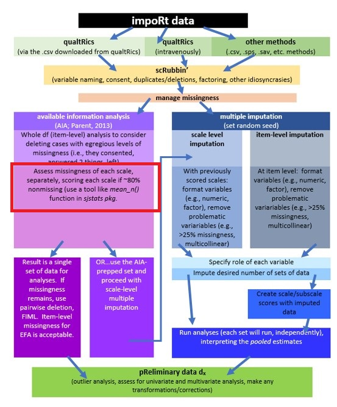
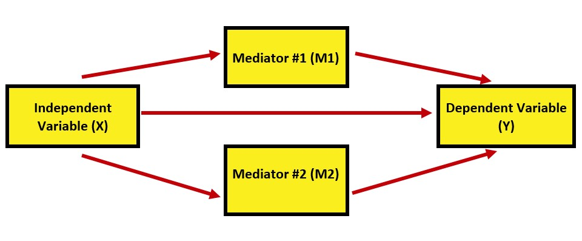

--- 
lang: "en"
title: "ReCentering Psych Stats:  Multivariate Modeling"
author: "Lynette H Bikos, PhD, ABPP"
knit: "bookdown::render_book"
site:  bookdown::bookdown_site
documentclass: book
bibliography: STATSnMETH.bib
citation-style: apa-single-spaced.csl
link-citations: true

#url: 'http\://whateveritis
#github-repo: whatever it is

description: 'This is an open-access, book-in-progress. My goal in offering it is to re-center the materials used in training statistics and research methods in graduate and post-graduate psychology programs.'
#cover-image: "ReCenter_bookcover.jpg"

output:
  bookdown::gitbook:
    dev: svglite
    css: css/style.css
    includes: 
        #in_header: [google-analytics-otl.html]
    toc_depth: 4
    split-by: section
    split_bib: true
    number_sections: true
    #pandoc_args: [ "--csl", "apa-single-spaced.csl" ]
    config:
      toc:
        scroll_highlight: yes
        collapse: section
        before: |
          <li><a href="./"><strong>ReCentering Psych Stats: Multivariate Modeling</strong><br>by Lynette H Bikos, PhD, ABPP</a></li>
        after: |
          #<li><a href="https:link" target="_blank">Open access book-in-progress</br>
          <li><a rel="license" href="http://creativecommons.org/licenses/by-nc-sa/4.0/"></a></li>
            <li><a href="https://bookdown.org" target="_blank">Built with Bookdown</a></li>
      download: [pdf]
      view: https://github.com/ontheline/otl-bookdown/blob/master/%s
      search: yes
      sharing:
        facebook: yes
        github: yes
        twitter: yes

  #bookdown::pdf_book:
    #citation_package: default
    #pandoc_args: [ "--csl", "apa-single-spaced.csl" ]

  bookdown::word_document2:
    default

  bookdown::markdown_document2:
    default
---

# BOOK COVER {-}


# PREFACE {-}

**If you are viewing this document, you should know that this is a book-in-progress.  Early drafts are released for the purpose teaching my classes and gaining formative feedback from a host of stakeholders.  The document was last updated on `r format (Sys.Date(), '%d %b %Y')`**

[Screencasted Lecture Link](https://spu.hosted.panopto.com/Panopto/Pages/Viewer.aspx?id=c932455e-ef06-444a-bdca-acf7012d759a)

To *center* a variable in regression means to set its value at zero and interpret all other values in relation to this reference point. Regarding race and gender, researchers often center male and White at zero. Further, it is typical that research vignettes in statistics textbooks are similarly seated in a White, Western (frequently U.S.), heteronormative, framework. The purpose of this project is to create a set of open educational resources (OER) appropriate for doctoral and post-doctoral training that contribute to a socially responsive pedagogy -- that is, it contributes to justice, equity, diversity, and inclusion. 

Statistics training in doctoral programs are frequently taught with fee-for-use programs (e.g., SPSS/AMOS, SAS, MPlus) that may not be readily available to the post-doctoral professional. In recent years, there has been an increase and improvement in R packages (e.g., *psych*, *lavaan*) used for in analyses common to psychological research. Correspondingly, many graduate programs are transitioning to statistics training in R (free and open source).  This is a challenge for post-doctoral psychologists who were trained with other software. This OER will offer statistics training with R and be freely available (specifically in a GitHub respository and posted through GitHub Pages) under a Creative Commons Attribution - Non Commercial - Share Alike license [CC BY-NC-SA 4.0]. 

Training models for doctoral programs in HSP are commonly scholar-practitioner, scientist-practitioner, or clinical-scientist.  An emerging model, the *scientist-practitioner-advocacy* training model incorporates social justice advocacy so that graduates are equipped to recognize and address the sociocultural context of oppression and unjust distribution of resources and opportunities [@mallinckrodt_scientist-practitioner-advocate_2014]. In statistics textbooks, the use of research vignettes engages the learner around a tangible scenario for identifying independent variables, dependent variables, covariates, and potential mechanisms of change. Many students recall examples in Field's  [-@field_discovering_2012] popular statistics text:  Viagra to teach one-way ANOVA, beer goggles for two-way ANOVA, and bushtucker for repeated measures.  What if the research vignettes were more socially responsive? 

In this OER, research vignettes will be from recently published articles where: 

* the author’s identity is from a group where scholarship is historically marginalized (e.g., BIPOC, LGBTQ+, LMIC[low-middle income countries]), 
* the research is responsive to issues of justice, equity, inclusion, diversity, 
* the lesson’s statistic is used in the article, and 
* there is sufficient information in the article to simulate the data for the chapter example(s) and practice problem(s); or it is publicly available.  

In training for multicultural competence, the saying, "A fish doesn't know that it's wet" is often used to convey the notion that we are often unaware of our own cultural characteristics. In recent months and years, there has been an increased awakening to the institutional and systemic racism that our systems are perpetuating. Queuing from the water metaphor, I am hopeful that a text that is recentered in the ways I have described can contribute to *changing the water* in higher education and in the profession of psychology.

## Copyright with Open Access {-}
<a rel="license" href="http://creativecommons.org/licenses/by-nc-sa/4.0/"></a>

This book is published under a a <a rel="license" href="http://creativecommons.org/licenses/by-nc-sa/4.0/">Creative Commons Attribution-NonCommercial-ShareAlike 4.0 International License</a>. This means that this book can be reused, remixed, retained, revised and redistributed (including commercially) as long as appropriate credit is given to the authors. If you remix, or modify the original version of this open textbook, you must redistribute all versions of this open textbook under the same license - CC BY-SA.


A [GitHub open-source repository](https://github.com/lhbikos/ReC_MultivariateModeling) contains all of the text and source code for the book, including data and images. 

# ACKNOWLEDGEMENTS {-}

As a doctoral student at the University of Kansas (1992-2005), I learned that "a foreign language" was required for graduation. *Please note that as one who studies the intersections of global, vocational, and sustainable psychology, I regret that I do not have language skills beyond English.* This could have been met with credit from high school my rural, mid-Missouri high school did not offer such classes. This requirement would have typically been met with courses taken during an undergraduate program -- but my non-teaching degree in the University of Missouri's School of Education was exempt from this. The requirement could have also been met with a computer language (fortran, C++) -- I did not have any of those either. There was a tiny footnote on my doctoral degree plan that indicated that a 2-credit course, "SPSS for Windows" would substitute for the language requirement.  Given that it was taught by my one of my favorite professors, I readily signed up. As it turns out, Samuel B. Green, PhD, was using the course to draft chapters in the textbook [@green_using_2014] that has been so helpful for so many. Unfortunately, Drs. Green (1947 - 2018) and Salkind (2947 - 2017) are no longer with us. I have worn out numerous versions of their text. Another favorite text of mine was Dr. Barbara Byrne's [-@byrne_structural_2016], "Structural Equation Modeling with AMOS." I loved the way she worked through each problem and paired it with a published journal article, so that the user could see how the statistical evaluation fit within the larger project/article. I took my tea-stained text with me to a workshop she taught at APA and was proud of the signature she added to it (a little catfur might have fallen out).  Dr. Byrne created SEM texts for a number of statistical programs (e.g., LISREL, EQS, MPlus). As I was learning R, I wrote Dr. Byrne, asking if she had an edition teaching SEM/CFA with R. She promptly wrote back, saying that she did not have the bandwidth to learn a new statistics package.  We lost Dr. Byrne in December 2020. I am so grateful to these role models for their contributions to my statistical training.  I am also grateful for the doctoral students who have taken my courses and are continuing to provide input for how to improve the materials.

The inspiration for training materials that re*center statistics and research methods came from the [Academics for Black Survival and Wellness Initiative](https://www.academics4blacklives.com/). This project, co-founded by Della V. Mosley, Ph.D., and Pearis L. Bellamy, M.S., made clear the necessity and urgency for change in higher education and the profession of psychology. 

At very practical levels, I am indebted to SPU's Library, and more specifically, SPU's Education, Technology, and Media Department.  Assistant Dean for Instructional Design and Emerging Technologies, R. John Robertson, MSc, MCS, has offered unlimited consultation, support, and connection. Senior Instructional Designer in Graphics & Illustrations, Dominic Wilkinson, designed the logo and bookcover.  Psychology and Scholarly Communications Librarian, Kristin Hoffman, MLIS, has provided consultation on topics ranging from OERS to citations. I am alo indebted to Associate Vice President, Teaching and Learning at Kwantlen Polytechnic University, Rajiv Jhangiani, PhD. Dr. Jhangiani's text [-@jhangiani_research_2019] was the first OER I ever used and I was grateful for his encouraging conversation.

Financial support for this text has been provided from the *Call to Action on Equity, Inclusion, Diversity, Justice, and Social Responsivity
Request for Proposals* grant from the Association of Psychology Postdoctoral and Internship Centers (2021-2022). 

<!--chapter:end:index.Rmd-->

---
output:
  word_document: default
  html_document: default
---
# Introduction {#ReCintro}

[Screencasted Lecture Link](https://spu.hosted.panopto.com/Panopto/Pages/Viewer.aspx?pid=cc9b7c0d-e5c3-4e4e-a469-acf7013ee761)

## What to expect in each chapter

This textbook is intended as *applied,* in that a primary goal is to help the scientist-practitioner-advocate use a variety of statistics in research problems and *writing them up* for a program evaluation, dissertation, or journal article. In support of that goal, I try to provide just enough conceptual information so that the researcher can select the appropriate statistic (i.e., distinguishing between when ANOVA is appropriate and when regression is appropriate) and assign variables to their proper role (e.g., covariate, moderator, mediator).

This conceptual approach does include occasional, step-by-step, *hand-calculations* (only we calculate them arithmetically in R) to provide a *visceral feeling* of what is happening within the statistical algorithm that may be invisible to the researcher.  Additionally, the conceptual review includes a review of the assumptions about the characteristics of the data and research design that are required for the statistic. Statistics can be daunting, so I have worked hard to establish a *workflow* through each analysis. When possible, I include a flowchart that is referenced frequently in each chapter and assists the the researcher keep track of their place in the many steps and choices that accompany even the simplest of analyses.

As with many statistics texts, each chapter includes a *research vignette.* Somewhat unique to this resource is that the vignettes are selected from recently published articles. Each vignette is chosen with the intent to meet as many of the following criteria as possible:

* the statistic that is the focus of the chapter was properly used in the article,
* the author’s identity is from a group where scholarship is historically marginalized (e.g., BIPOC, LGBTQ+, LMIC [low middle income countries]),
* the research has a justice, equity, inclusion, diversity, and social responsivity focus and will contribute positively to a social justice pedagogy, and 
* the data is available in a repository or there is sufficient  information in the article to simulate the data for the chapter example(s) and practice problem(s).  

In each chapter we employ *R* packages that will efficiently calculate the statistic and the dashboard of metrics (e.g., effect sizes, confidence intervals) that are typically reported in psychological science.

## Strategies for Accessing and Using this OER

There are a number of ways you can access this resource. You may wish to try several strategies and then select which works best for you.  I demonstrate these in the screencast that accompanies this chapter.

1. Simply follow along in the .html formatted document that is available on via GitHub Pages, and then
   * open a fresh .rmd file of your own, copying (or retyping) the script  and running it 
2. Locate the original documents at the [GitHub repository](https://github.com/lhbikos/ReC_MultivariateModeling) . You can
   * open them to simply take note of the "behind the scenes" script
   * copy/download individual documents that are of interest to you
   * fork a copy of the entire project to your own GitHub site and further download it (in its entirety) to your personal workspace. The [GitHub Desktop app](https://desktop.github.com/) makes this easy!
3. Listen to the accompanying lectures (I think sound best when the speed is 1.75). The lectures are being recorded in Panopto and should include the closed captioning.
4. Provide feedback to me!  If you fork a copy to your own GitHub repository, you can 
   * open up an editing tool and mark up the document with your edits,
   * start a discussion by leaving comments/questions, and then
   * sending them back to me by committing and saving.  I get an e-mail notiying me of this action.  I can then review (accepting or rejecting) them and, if a discussion is appropriate, reply back to you.

## If You are New to R

R can be oveRwhelming. Jumping right into advanced statistics might not be the easiest way to start. However, in these chapters, I provide complete code for every step of the process, starting with uploading the data. To help explain what R script is doing, I sometimes write it in the chapter text; sometimes leave hastagged-comments in the chunks; and, particularly in the accompanying screencasted lectures, try to take time to narrate what the R script is doing.  

I've found that, somewhere on the internet, there's almost always a solution to what I'm trying to do. I am frequently stuck and stumped and have spent hours searching the internet for even the tiniest of things.  When you watch my videos, you may notice that in my R studio, there is a "scRiptuRe" file. I takes notes on the solutions and scripts here -- using keywords that are meaningful to me so that when I need to repeat the task, I can hopefully search my own prior solutions and find a fix or a hint.

### Base R

The base program is free and is available here:  https://www.r-project.org/  

Because R is already on my machine (and because the instructions are sufficient), I will not walk through the instllation, but I will point out a few things.

* Follow the instructions for your operating system (Mac, Windows, Linux)
* The "cran" (I think "cranium") is the *Comprehensive R Archive Network.*  In order for R to run on your computer, you have to choose a location.  Because proximity is somewhat related to processing speed, select one that is geographically "close to you." 
* You will see the results of this download on your desktop (or elsewhere if you chose to not have it appear there) but you won't ever use R through this platform.

### R Studio

*R Studio* is the desktop application I work in R.  It's a separate download. Choose the free, desktop, option that is appropriate for your operating system:   https://www.rstudio.com/products/RStudio/

* Upper right window:  Includes several tabs; we frequently monitor the
  + Environment: it lists the *objects* that are available to you (e.g., dataframes)
* Lower right window: has a number of helpful tabs.
  + Files:  Displays the file structure in your computer's environment.  Make it a practice to (a) organize your work in small folders and (b) navigating to that small folder that is holding your project when you are working on it.
  + Packages:  Lists the packages that have been installed.  If you navigate to it, you can see if it is "on."  You can also access information about the package (e.g., available functions, examples of script used with the package) in this menu.  This information opens in the Help window.
  + Viewer and Plots are helpful, later, when we can simultaneously look at our output and still work on our script.
* Primary window
  + R Studio runs in the background(in the console).  Very occasionally, I can find useful troubleshooting information here.
  + More commonly, I open my R Markdown document so that it takes the whole screen and I work directly, right here.
* *R Markdown* is the way that many analysts write *script*, conduct analyses, and even write up results.  These are saved as .rmd files.
  + In R Studio, open an R Markdown document through File/New File/R Markdown
  + Specify the details of your document (title, author, desired ouput)
  + In a separate step, SAVE this document (File/Save] into a NEW FILE FOLDER that will contain anything else you need for your project (e.g., the data).
  + *Packages* are at the heart of working in R.  Installing and activating packages require writing script.

### R Hygiene

Many initial problems in R can be solved with good R hygiene. Here are some suggestions for basic practices.  It can be tempting to "skip this."  However, in the first few weeks of class, these are the solutions I am presenting to my students.

#### Everything is documented in the .rmd file

Although others do it differently, everything is in my .rmd file. That is, for uploading data and opening packages I write the code in my .rmd file.  Why?  Because when I read about what I did hours or years later, I have a permanent record of very critical things like (a) where my data is located, (b) what version I was using, and (c) what package was associated with the functions.

#### File organization

File organization is a critical key to this:

* Create a project file folder.
* Put the data file in it.
* Open an R Markdown file.
* Save it in the same file folder.
* When your data and .rmd files are in the same folder (not your desktop, but a shared folder), they can be connected.

#### Chunks

The R Markdown document is an incredible tool for integrating text, tables, and analyses.  This entire OER is written in R Markdown.  A central feature of this is "chunks."

The easiest way to insert a chunk is to use the INSERT/R command at the top of this editor box.  You can also insert a chunk with the keyboard shortcut:  CTRL/ALT/i

"Chunks" start and end with with those three tic marks and will show up in a shaded box, like this:

```{r title for the chunk contents}
#hashtags let me write comments to remind myself what I did
#here I am simply demonstrating arithmetic (but I would normally be running code)
2021 - 1966
```

Each chunk must open and close.  If one or more of your tic marks get deleted, your chunk won't be read as such and your script will not run.  The only thing in the chunks should be script for running R; you can hashtag-out script so it won't run.

Although unnecessary, you can add a brief title for the chunk in the opening row, after the "r."  These create something of a table of contents of all the chunks -- making it easier to find what you did.  You can access them in the "Chunks" tab at the bottom left of R Studio. If you wish to knit a document, you cannot have identical chunk titles.

You can put almost anything you want in the space outside of tics.  Syntax for simple formatting in the text areas (e.g,. using italics, making headings, bold, etc.) is found here:  https://rmarkdown.rstudio.com/authoring_basics.html


#### Packages

As scientist-practitioners (and not coders), we will rely on *packages* to do our work for us. At first you may feel overwhelmed about the large number of packages that are available. Soon, though, you will become accustomed to the ones most applicable to our work (e.g., psych, tidyverse, lavaan, apaTables).

Researchers treat packages differently. In these lectures, I list all the packages we will use in an opening chunk that asks R to check to see if the package is installed, and if not, installs it.  

```{r checking for packages}
if(!require(psych)){install.packages("psych")}
```

To make a package operable, you need to open it through the library.  This process must be repeated each time you restart R. I don't open the package (through the "library(package_name)") command until it is time to use it.  Especially for new users, I think it's important to connect the functions with the specific packages.

```{r opening psych, package, message=FALSE, warning=FALSE}
#install.packages ("psych")
library (psych)
```

If you type in your own "install.packages" code, hashtag it out once it's been installed.  It is problematic to continue to re-run this code .

#### Knitting

An incredible feature of R Markdown is its capacity to *knit* to HTML, powerpoint, or word. If you access the .rmd files for this OER, you can use annotate or revise them to suit your purposes.  If you redistribute them, though, please honor the Creative Commons Attribution-NonCommercial-ShareAlike 4.0 International License with a citation.

### tRoubleshooting in R maRkdown

Hiccups are normal.  Here are some ideas that I have found useful in getting unstuck.

* In an R script, you must have everything in order -- Every. Single. Time. 
  + All the packages have to be in your library and activated; if you restart R, you need to reload each package.
  + If you open an .rmd file and want a boxplot, you cannot just scroll down to that script.  You need to run any *prerequisite* script (like loading the package, importing data, putting the data in the global environment, etc.)
  + Do you feel lost?  clear your global environment (broom) and start at the top of the R script. Frequent, fresh starts are good.
* Your .rmd file and your data need to be stored in the same file folder.  These should be separate for separate projects, no matter how small.
* Type any warnings you get into a search engine.  Odds are, you'll get some decent hints in a manner of seconds.  Especially at first, these are common errors:
  + The package isn't loaded (if you restarted R, you need to reload your packages)
  + The .rmd file has been saved yet, or isn't saved in the same folder as the data
  + Errors of punctuation or spelling
* Restart R (it's quick -- not like restarting your computer)
* If you receive an error indicating that a function isn't working or recognized, and you have loaded the package, type the name of the package in front of the function with two colons (e.g., psych::describe(df). If multiple packages are loaded with functions that have the same name, R can get confused.

### stRategies for success

* Engage with R, but don't let it overwhelm you.
  + The *mechanical is also the conceptual*. Especially when it is *simpler*, do try to retype the script into your own .rmd file and run it. Track down the errors you are making and fix them.
  + If this stresses you out, move to simply copying the code into the .rmd file and running it.  If you continue to have errors, you may have violated one of the best practices above (Is the package loaded? Are the data and .rmd files in the same place? Is all the prerequisite script run?).
  + Still overwhelmed?  Keep moving forward by downloading a copy of the .rmd file that accompanies any given chapter and just "run it along" with the lecture. Spend your mental power trying to understand what each piece does. Then select a practice problem that is appropriate for your next level of growth. 
* Copy script that works elsewhere and replace it with your datafile, variables, etc.  
* The leaRning curve is steep, but not impossible.  Gladwell[-@gladwell_outliers_2008] reminds us that it takes about 10,000 hours to get GREAT at something (2,000 to get reasonably competent). Practice. Practice. Practice.
* Updates to R, R Studio, and the packages are NECESSARY, but can also be problematic.  It could very well be that updates cause programs/script to fail (e.g., "X has been deprecated for version X.XX").  Moreover, this very well could have happened between my distribution of these resources and your attempt to use it.  My personal practice is to update R, R Studio, and the packages a week or two before each academic term.
* Embrace your downward dog.  Also, walk away, then come back.
  

### Resources for getting staRted

R for Data Science:  https://r4ds.had.co.nz/

R Cookbook:  http://shop.oreilly.com/product/9780596809164.do

R Markdown homepage with tutorials:  https://rmarkdown.rstudio.com/index.html

R has cheatsheets for everything, here's one for R Markdown:  https://www.rstudio.com/wp-content/uploads/2015/02/rmarkdown-cheatsheet.pdf 

R Markdown Reference guide:  https://www.rstudio.com/wp-content/uploads/2015/03/rmarkdown-reference.pdf

Using R Markdown for writing reproducible scientific papers:  https://libscie.github.io/rmarkdown-workshop/handout.html 

LaTeX equation editor:  https://www.codecogs.com/latex/eqneditor.php


<!--chapter:end:01-Introduction.Rmd-->

---
output:
  word_document: default
  html_document: default
---
# DATA PREP {-#dataprep}
# Scrubbing {#scrub}

[Screencasted Lecture Link](https://spu.hosted.panopto.com/Panopto/Pages/Viewer.aspx?pid=7c87f991-276b-448f-aed9-acf6015b9638) 

The focus of this chapter is the process of starting with raw data and preparing it for multivariate analysis.   To that end, we will address the conceptual considerations and practical steps in "scrubbing and scoring." 

A twist in this lesson is that I am asking you to contribute to the dataset that serves as the basis for the chapter and the practice problems. In the spirit of *open science*, this dataset is available to you and others for your own learning. Before continuing, please take 15-20 minutes to complete the survey titled, [Rate-a-Recent-Course:  A ReCentering Psych Stats Exercise](https://spupsych.az1.qualtrics.com/jfe/form/SV_b2cClqAlLGQ6nLU). The study is approved by the Institutional Review Board at Seattle Pacific University (SPUIRB# 202102011, no expiration). Details about the study, including an informed consent, are included at the link.

## Navigating this Lesson

There is about 90 minutes of lecture.  If you work through the materials with me it would be good to add another hour.

While the majority of R objects and data you will need are created within the R script that sources the chapter, there are a few that cannot be created from within the R framework. Additionally, sometimes links fail.  All original materials are provided at the [Github site](https://github.com/lhbikos/ReC_MultivariateModeling) that hosts the book. More detailed guidelines for ways to access all these materials are provided in the OER's [introduction](#ReCintro)

### Learning Objectives

Learning objectives from this lecture include the following:

* Import data from Qualtrics into R.
* Begin the scrubbing process by applying exclusion and inclusion criteria. 
* Rename variables.
* Create a smaller dataframe with variables appropriate for testing a specific statistical model.
* Use critical data manipulation functions from the *tidyverse* (and *dplyr*) in particular such as *filter()*, *select()*, and *mutate()* to prepare variables.
* Articulate the initial steps in a workflow for scrubbing and scoring data.

### Planning for Practice

<!-- TODO: Specify set of items to score for homework. -->

The suggestions for practice will start with this chapter and continue in the next two chapters (Scoring, Data Dx). Using Parent's [-@parent_handling_2013] AIA approach to managing missing data, you will scrub-and-score a raw dataset. Options of graded complexity could incude:

* Repeating the steps in the chapter with the most recent data from the Rate-A-Recent-Course survey; differences will be in the number of people who have completed the survey since the chapter was written.
* Use the dataset that is the source of the chapter, but score a different set of items that you choose. Hey :)
* Begin with raw data to which you have access. 

### Readings & Resources

In preparing this chapter, I drew heavily from the following resource(s). Other resources are cited (when possible, linked) in the text with complete citations in the reference list.

* Parent, M. C. (2013). Handling item-level missing data: Simpler is just as good. The Counseling Psychologist, 41(4), 568–600. https://doi.org/10.1177/0011000012445176

* Kline, R. B. (2015). Data preparation and psychometrics review. In Principles and Practice of Structural Equation Modeling, Fourth Edition. Guilford Publications. http://ebookcentral.proquest.com/lib/spu/detail.action?docID=4000663

* Grolemund, G., & Wickham, H. (n.d.). 5 Data transformation | R for Data Science. Retrieved March 12, 2020, from https://r4ds.had.co.nz/


### Packages

The script below will (a) check to see if the following packages are installed on your computer and, if not (b) install them.

<!-- TODO: Build out this section. -->
```{r initial packages for Scrubbing, eval=FALSE}
#will install the package if not already installed
if(!require(qualtRics)){install.packages("qualtRics")}
if(!require(tidyverse)){install.packages("tidyverse")}
```


## Workflow for Scrubbing and Scoring

The following is a proposed workflow for preparing data for analysis. 

<!-- TODO: When finalized, save as PDF so it can open in its own window) -->

 

Here is a narration of the figure:

1. The workflow begins by importing data into R. Most lessons in this series involve simulated data that are created directly in R. Alternatively, data could be:
   * imported "intRavenously" through programs such as Qualtrics,
   * exported from programs such as Qualtrics to another program (e.g., .xlxs, .csv),
   * imported in other forms (e.g., .csv,.sps, .sav).
2. Scrubbing data by 
   * variable naming,
   * specifying variable characteristics such as factoring,
   * ensuring that included particpiants consented to participation, 
   * determining and executing the inclusion and exclusion criteria.
3. Conduct preliminary data diagnostics such as
   * outlier anlaysis
   * assessing for univariate and multivariate analysis
   * making transformations and/or corrections
4. Managing missingness by one of two routes
   * Available information analysis [@parent_handling_2013] at either the item-level or scale level.  The result is a single set of data for analysis.  If missingness remains, options include pairwise deletion, listwise deletion, or specifying FIML (when available).  Another option is to use multiple imputation.
   * Multiple imputation at either scale level or item-level

## Research Vignette

To provide first-hand experience as both the respondent and analyst for the same set of data, you were asked to complete a survey titled, [Rate-a-Recent-Course:  A ReCentering Psych Stats Exercise](https://spupsych.az1.qualtrics.com/jfe/form/SV_b2cClqAlLGQ6nLU).  If you haven't yet completed it, please consider doing so, now. In order to reduce the potential threats to validity by providing background information about the survey, I will wait to describe it until later in the chapter.

The survey is administered in Qualtrics. In the chapter I teach two ways to import Qualtrics data into R. We will then use the data to work through the steps identified in the workflow.

## Working the Problem

### intRavenous Qualtrics

I will demonstrate using a Qualtrics account at my institution, Seattle Pacific University. The only surveys in this account are for the *Recentering Psych Stats* chapters and lessons. All surveys are designed to not capture personally identifying information.

Access credentials for the institutional account, individual user's account, and survey are essential for getting the survey items and/or results to export into R. The Qualtrics website provides a tutorial for [generating an API token](https://www.qualtrics.com/support/integrations/api-integration/overview/#GeneratingAnAPIToken).     

We need two pieces of information:  the **root_url** and an **API token**.  

* Log into your respective qualtrics.com account.
* Select Account Settings
* Choose "Qualtrics IDs" from the user name dropdown


We need the  **root_url**.  This is the first part of the web address for the Qualtrics account.  For our institution it is: spupsych.az1.qualtrics.com 

The API token is in the box labeled, "API." If it is empty, select, "Generate Token." If you do not have this option, locate the *brand administrator* for your Qualtrics account. They will need to set up your account so that you have API privileges.

*BE CAREFUL WITH THE API TOKEN*  This is the key to your Qualtrics accounts.  If you leave it in an .rmd file that you forward to someone else, this key and the base URL gives access to every survey in your account. If you share it, you could be releasing survey data to others that would violate confidentiality promises in an IRB application.

If you mistakenly give out your API token you can generate a new one within your Qualtrics account and re-protect all its contents.

You do need to change the API key/token if you want to download data from a different Qualtrics account.  If your list of surveys generates the wrong set of surveys, restart R, make sure you have the correct API token and try again.

```{r API token, eval=FALSE}
#only have to run this ONCE to draw from the same Qualtrics account...but will need to get different token if you are changing between accounts 
library(qualtRics)
#qualtrics_api_credentials(api_key = "mUgPMySYkiWpMFkwHale1QE5HNmh5LRUaA8d9PDg",
              #base_url = "spupsych.az1.qualtrics.com", overwrite = TRUE, install = TRUE)
```

*all_surveys()* generates a dataframe containing information about all the surveys stored on your Qualtrics account.

```{r Show all surveys, eval=FALSE}
surveys <- all_surveys() 
#View this as an object (found in the right: Environment).  
#Get survey id # for the next command
#If this is showing you the WRONG list of surveys, you are pulling from the wrong Qualtrics account (i.e., maybe this one instead of your own). Go back and change your API token (it saves your old one). Changing the API likely requires a restart of R.
surveys
```

To retrieve the survey, use the *fetch_survey()* function.  

```{r intRavenous Qualtrics,  message=FALSE, WARNING=FALSE}
#obtained with the survey ID 
#"surveyID" should be the ID from above
#"verbose" prints messages to the R console
#"label", when TRUE, imports data as text responses; if FALSE prints the data as numerical responses
#"convert", when TRUE, attempts to convert certain question types to the "proper" data type in R; because I don't like guessing, I want to set up my own factors.
#"force_request", when TRUE, always downloads the survey from the API instead of from a temporary directory (i.e., it always goes to the primary source)
# "import_id", when TRUE includes the unique Qualtrics-assigned ID; since I have provided labels, I want false

#Out of the blue, I started getting an error, that R couldn't find function "fetch_survey."  After trying a million things, adding qualtRics:: to the front of it solved the problem
QTRX_df <-qualtRics::fetch_survey(surveyID = "SV_b2cClqAlLGQ6nLU", time_zone = NULL, verbose = FALSE, label=FALSE, convert=FALSE, force_request = TRUE, import_id = FALSE)

#useLocalTime = TRUE,
```
<!-- TODO: Link to the Bonus Reel -->
*It is possible (and helpful, even) to import Qualtrics data that has been downloaded from Qualtrics as a .csv.  I demo this in the Bonus Reel.*

### About the *Rate-a-Recent-Course* Survey

<!-- TODO: Add link to chapter when it is available. -->

As a teaching activity for the ReCentering Psych Stats OER, the topic of the survey was selected to be consistent with the overall theme of OER. Specifically, the purpose of this study is to understand the campus climate for students whose identities make them vulnerable to bias and discrimination. These include  students who are Black, non-Black students of color, LGBTQ+ students, international students, and students with disabilities. 

Although the dataset should provide the opportunity to test a number of statistical models, one working hypothesis that framed the study is that the there will be a greater sense of belonging and less bias and discrimination when there is similar representation (of identities that are often marginalized) in the instructional faculty and student body. Termed,  "structural diversity" [@lewis_black_2019] this is likely an oversimplification.  In fact, an increase in diverse representation without attention to interacting factors can increase hostility on campus [@hurtado_linking_2007]. Thus, we included the task of rating of a single course relates to the larger campus along the dimensions of belonging and bias/discrimination. For example, if a single class has higher ratings on issues of inclusivity, diversity, and respect, we would expect that sentiment to be echoed in the broader institution.

Our design has notable limitations  You will likely notice that we ask about demographic characteristics of the instructional staff and classmates in the course rated, but we do not ask about the demographic characteristics of the respondent. In making this decision, we likely lose important information; Iacovino and James [-@iacovino_retaining_2016] have noted that White students perceive campus more favorably than Black student counterparts. We made this decision to protect the identity of the respondent. As you will see when we download the data, if a faculty member asked an entire class to take the survey, the datestamp and a handful of demographic identifiers could very likely identify a student. In certain circumstances, this might be risky in that private information (i.e., gender nonconformity, disclosure of a disability) or course evaluation data could be related back to the student.  

Further, the items that ask respondents to *guess* the identities of the instructional staff and classmates are limited, and contrary to best practices in survey construction that recommend providing the option of a "write-in" a response.  After consulting with a diverse group of stakeholders and subject matter experts (and revising the response options numerous times) I have attempted to center anti-Black racism in the U.S. [@mosley_critical_2021; @mosley_radical_2020; @singh_building_2020].  In fact, the display logic does not present the race items when the course is offered outside the U.S. There are only five options for race: *biracial/multiracial*, *Black*, *non-Black person(s) of color*, *White*, and *I did not notice* (intended to capture a color-blind response). One unintended negative consequence of this design is that the response options could contribute to *colorism* [@adames_fallacy_2021; @capielo_rosario_acculturation_2019]. Another possibility is that the limited options may erase, or make invisible, other identities. At the time that I am writing the first draft of this chapter, the murder of six Asian American women in Atlanta has just occurred. The Center for the Study of Hate and Extremeism has documented that while overall hate drimes dropped by 7% in 2020, anti-Asian hate crimes reported to the police in America's largest cities increasedby 149% [@noauthor_fact_nodate]. These incidents have occurred not only in cities, but in our neighborhoods and on our campusus [@kim_guest_2021; @kim_yes_2021; @noauthor_stop_nodate]. While this survey is intended to assess campus climate as a function of race, it unfortunately does not distinguish between many identities that experience marginalization. 

In parallel, the items asking respondents to identity characteristics of the instructional staff along dimensions of gender, international status, and disability are "large buckets" and do not include "write-in" options. Similarly, there was no intent to cause harm by erasing or making invisible individuals whose identities are better defined by different descriptors.  Further, no write-in items were allowed.  This was also intentional to prevent potential harm caused by people who could leave inappropriate or harmful comments. 


### The Codebook
In order to scrub-and-score a survey, it is critical to know about its content, scoring directions for scales/subscales, and its design. A more complete description of the survey design elements is (or will be) available in the *Recentering Psych Stats: Psychometric* OER. The review in this chapter provides just-enough information to allow us to make decisions about which items to retain and how to score them. When they are well-written, information in the [IRB application](./Bikos_ReCenteringPsychStats_ReCupload.pdf) and [pre-registration](https://osf.io/a8e5u) can be helpful in the scrubbing and scoring process.

Let's look "live" at the survey. In Qualtrics it is possible to *print* a PDF that looks very similar to its presentation when someone is taking it. You can access that static version [here](./Rate_a_CoursePDF.pdf).

We can export a [codebook](./Rate-a-Course_Codebook.pdf), that is, a Word (or PDF) version of the survey with all the coding.  In Qualtrics the protocol is: Survey/Tools/ImportExport/Export Survey to Word.  Then select all the options you want (especially "Show Coded Values"). A tutorial provided by Qualtrics can be found [here](https://www.qualtrics.com/support/survey-platform/survey-module/survey-tools/import-and-export-surveys/). This same process can be used to print the PDF example I used above.

It is almost impossible to give this lecture without some reference to Qualtrics and the features used in Qualtrics. An import of raw data from Qualtrics into R can be nightmare in that the Qualtrics-assigned variable names are numbers (e.g., QID1, QID2) – but often out of order because the number is assigned when the question is first created.  If the survey is reordered, the numbers get out of sequence.

Similarly, values for Likert-type scales can also get out of order if the scale anchors are revised (which is common to do).

I recommend providing custom variable names and recode values directly in Qualtrics before exporting them into R.  A Qualtrics tutorial for this is provided [here](https://www.qualtrics.com/support/survey-platform/survey-module/question-options/recode-values/). In general, consider these qualities when creating variable names:

*	Brevity: historically, SPSS variable names could be a maximum of 8 characters.
*	Intuitive: although variables can be renamed in R (e.g., for use in charts and tables), it is helpful when the name imported from  Qualtrics provides some indication of what the variable is.
*	Systematic: start items in a scale with the same stem, followed by the item number -- ITEM1, ITEM2, ITEM3.

The Rate-a-Recent-Course survey was written using some special features in Qualtrics.  These include

* Display logic
  * Items that are U.S.-centric are only shown if the respondent is taking a course from an institution in the U.S. is a student in the U.S.
* Loop and merge
  * Because course may have multiple instructional staff, the information asking about demographic characteristics of the instructors is repeated according to the number input by the respondent
* Random presentation of the 30 items asking about campus climate for the five groups of students
  * Although this might increase the cognitive load of the survey, this helps "spread out" missingness for respondents who might tire of the survey and stop early
* Rank ordering of the institutional level (department, school/faculty, campus/university) to which the respondent feels most connected

Looking at the QTRX_df, *StartDate* thru *UserLanguage* are metadata created by Qualtrics. The remaining variables and associated value labels are in the [codebook](./Rate-a-Course_Codebook.pdf).  


## Scrubbing

With a look at our survey, codebook, and imported data, we now get to the business of scRubbing (deleting those who did not give consent, deleting previews, etc.). This level of "scrubbing" precedes the more formal detection of outliers.

### Tools for Data Manipulations

The next stages will provide some experience manipulating data with **dplyr** from  the **tidyverse**.

The **tidyverse** is a system of packages (i.e,. when you download the tidyverse, you download all its packages/members) for data manipulation, exploration and visualization.  The packages in the tidyverse share a common design philosophy. These were mostly developed by Hadley Wickham, but more recently, more designers are contributing to them. Tidyverse packages are intended to make statisticians and data scientists more productive by guiding them through workflows that facilitate communication and result in reproducible work products. Fundamentally, the tidyverse is about the connections between the tools that make the workflow possible. Critical packages in the tidyverse include:

*  **dplyr**: data manipulation:  mutate, select, filter, summarize, arrange
*  **ggplot2**: extravagant graphing
*  **tibble**:  a *tibble* is a dataframe that provides the user with more (and less) control over the data.
*  **readr**: gives access to "rectangular data" like .csv and tables
*  **tidyr**: tidy data is where each variable is a column, each observation is a row, each value is a cell (duh).  **tidyr**'s contributions are gather(wide to long) and spread(long to wide) as well as separate, extract, unite.
*  **purrr**: facilitates working with functions and vectors. For example, if you write a function, using purrr may help you replace loops with code that is more efficient and intuitive.

The tidyverse is ever-evolving -- so check frequently for updates and troubleshooting.

A handy cheatsheet for data transformation is found [here](https://www.rstudio.com/wp-content/uploads/2015/02/data-wrangling-cheatsheet.pdf).

### Inclusion and Exclusion Criteria

For me, the first pass at scrubbing is to eliminate the obvious. In our case this is includes *previews* and respondents who did not consent to continue.  Previews are the researcher-initiated responses usually designed to proofread or troubleshoot survey problems. There could be other first-pass-deletions, such as selecting response between certain dates. 

I think these first-pass deletions, especially the ones around consent, are important to do as soon as possible. Otherwise, we might delete some of the variables (e.g., timestamps, consent documentation, preview status) and neglect to delete these cases later in the process.

We are here in the workflow:


We can either update the existing df (by using the same object), or creating a new df from the old. Either works. In my early years, I tended to create lots of new objects. As I have gained confidence in myself and in R, I'm inclined to update the existing df. Why? Because unless you write the object as an outfile (using the same name for the object as for the filename -- which I do not recommend), the object used in R does not change the source of the dat.  Therefore, it is easy to correct early code and it keeps the global environment less cluttered.

In this particular survey, the majority of respondents will take the survey because they clicked an *anonymous* link provided by Qualtrics.  Another Qualtrics distribution method is e-mail.  At the time of this writing, we have not recruited by e-mail, but it is is possible we could do so in the future.  What we should not include, though, are *previews*.  These are the times when the researcher is self-piloting the survey to look for errors and to troubleshoot. 

```{r exclude previews,  message=FALSE, WARNING=FALSE}
# the filter command is used when we are making inclusion/exclusion decisions about rows
# != means do not include cases with "preview"
library(tidyverse)
QTRX_df <- filter (QTRX_df, DistributionChannel != "preview")

#FYI, another way that doesn't use tidyverse, but gets the same result
#QTRX_df <- QTRX_df[!QTRX_df$DistributionChannel == "preview",]
```


APA Style, and in particular the Journal Article Reporting Standards (JARS) for quantitative research specify that we should report the frequency or percentages of missing data.  We would start our counting *after* eliminating the previews.  

```{r number of cases}
# I created an object that lists how many rows/cases remain.
# I used inline text below to update the text with the new number
attempts <- nrow(QTRX_df)
attempts
```

CAPTURING RESULTS FOR WRITING IT UP:  Data screening suggested that `r attempts` individuals opened the survey link.

Next let's filter in only those who consented to take the survey.  Because Qualtrics discontinued the survey for everyone who did not consent, we do not have to worry that their data is unintentionally included, but it can be useful to mention the number of non-consenters in the summary of missing data.
```{r include consented}
# == are used 
QTRX_df <-(filter (QTRX_df, Consent == 1))
consented_attempts <- nrow(QTRX_df)
consented_attempts
```
CAPTURING RESULTS FOR WRITING IT UP:  Data screening suggested that `r attempts` individuals opened the survey link. Of those, `r consented_attempts`, granted consent and proceeded into the survey items.

In this particular study, the categories used to collect race were U.S.-centric.  Thus, they were only shown if the respondent indicated that the course being rated was taught by an institution in the U.S. Therefore, an an additional inclusion criteria for this specific research model should be that the course was taught in the U.S.
```{r include US institutions}
QTRX_df <-(filter (QTRX_df, USinst == 0))
US_inclusion <- nrow(QTRX_df)
US_inclusion
```

CAPTURING RESULTS FOR WRITING IT UP:  Data screening suggested that `r attempts` individuals opened the survey link. Of those, `r consented_attempts`, granted consent and proceeded into the survey items. A further inclusion criteria was that the course was taught in the U.S; `r US_inclusion` met this criteria.

### Renaming Variables

Even though we renamed the variables in Qualtrics, the loop-and-merge variables were auto-renamed such that they each started with a number. I cannot see how to rename these from inside Qualtrics. A potential problem is that, in R, when variable names start with numbers, they need to be surrounded with single quotation marks. I find it easier to rename them now. I used "i" to start the variable name to represent "instructor."

The form of the *rename()* function is this:
df_named <- rename(df_raw, NewName1 = OldName1)

```{r rename variables that start with numbers}
library(tidyverse)
QTRX_df <- rename(QTRX_df, iRace1 = '1_iRace', iRace2 = '2_iRace', iRace3 = '3_iRace', iRace4 = '4_iRace', iRace5 = '5_iRace', iRace6 = '6_iRace', iRace7 = '7_iRace', iRace8 = '8_iRace', iRace9 = '9_iRace', iRace10 = '10_iRace')
```

Also in Qualtrics, it was not possible to rename the variable (formatted with sliders) that asked respondents to estimate the proportion of classmates in each race-based category.  Using the codebook, we can do this now.  I will use "cm" to precede each variable name to represent "classmates."
```{r rename a regular variable}
QTRX_df <- rename(QTRX_df, cmBiMulti = Race_10, cmBlack = Race_1, cmNBPoC = Race_7, cmWhite = Race_8, cmUnsure = Race_2)
```

Let's also create an ID variable (different from the lengthy Qualtrics-issued ID) and then move it to the front of the distribution.
```{r create ID variable}
QTRX_df <- QTRX_df %>% mutate(ID = row_number())

#moving the ID number to the first column; requires 
QTRX_df <- QTRX_df%>%select(ID, everything())
```

### Downsizing the Dataframe

Although researchers may differ in their approach, my tendency is to downsize the df to the variables I will be using in my study.  These could include variables in the model, demographic variables, and potentially auxiliary variables (i.e,. variables not in the model, but that might be used in the case of multiple imputation).  

This particular survey did not collect demographic information, so that will not be used.  The model that I will demonstrate in this research vignette examines the the respondent's perceived campus climate for students who are Black, predicted by the the respondent's own campus belonging, and also the *structural diversity* [@lewis_black_2019] proportions of Black students in the classroom and BIPOC (Black, Indigenous, and people of color) instructional staff. 

*I would like to assess the model by having the instructional staff variable to be the %Black instructional staff.  At the time that this lecture is being prepared, there is not sufficient Black representation in the staff to model this.* 

The *select()* function can let us list the variables we want to retain.

```{r select model variables}
#You can use the ":" to include all variables from the first to last variable in any sequence; I could have written this more efficiently.  I just like to "see" my scales and clusters of variables.

Model_df <-(select (QTRX_df, ID, iRace1, iRace2, iRace3, iRace4, iRace5, iRace6, iRace7, iRace8, iRace9, iRace10, cmBiMulti, cmBlack, cmNBPoC, cmWhite, cmUnsure, Belong_1:Belong_3, Blst_1:Blst_6))
```


It can be helpful to save outfile of progress as we go along.  Here I save this raw file.
```{r write outfile}
write.table(Model_df, file="BlackStntsModel210318.csv", sep=",", col.names=TRUE, row.names=FALSE)
```


## Toward the APA Style Write-up

### Method/Procedure

Data screening suggested that `r attempts` individuals opened the survey link. Of those, `r consented_attempts` granted consent and proceeded to the survey items. A further inclusion criteria was that the course was taught in the U.S; `r US_inclusion` met this criteria.


## Practice Problems

Starting with this chapter, the practice problems for this and the next two chapters (i.e., Scoring, Data Dx) are connected. Whatever practice option(s) you choose, please (a) use raw data that (b) has some data missing.  This second criteria will be important in the subsequent chapters.

The three problems below are listed in the order of graded complexity. If you are just getting started, you may wish to start with the first problem. If you are more confident, choose the second or third option. You will likely encounter challenges that were not covered in this chapter. Search for and try out solutions, knowing that there are multiple paths through the analysis.


### Problem #1: Rework the Chapter Problem

Because the *Rate-a-Recent-Course* survey remains open, it is quite likely that there will be more participants who have taken the survey since this chapter was last updated. If not -- please encourage a peer to take it.  Even one additional response will change the results. This practice problem encourages you to rework the chapter, as written, with the updated data from the survey.

|Assignment Component                                    | Points Possible| Points Earned|
|:------------------------------------------------------ |:-------------: |:------------:|
|1. Import the data from Qualtrics                       |      5         |    _____     |           
|2. Exclude all previews                                 |      5         |    _____     |
|3. Include only those who consented                     |      5         |    _____     |  
|4. Exclude those whose institutions are outside the U.S.|      5         |    _____     |               
|5. Rename variables                                     |      5         |    _____     |   
|6. Downsize the dataframe to the variables of interest  |      5         |    _____     |       
|7. Write up of preliminary results                      |      5         |    _____     |
|8. Explanation to grader                                |      5         |    _____     |
|**Totals**                                              |      40        |    _____     |             


### Problem #2:  Use the *Rate-a-Recent-Course* Survey, Choosing Different Variables

Before starting this option, choose a minimum of three variables from the *Rate-a-Recent-Course* survey to include in a simple statistical model. Work through the chapter making decisions that are consistent with the research model you have proposed. There will likely be differences at several points in the process.  For example, you may wish to include (not exclude) data where the rated-course was offered by an institution outside the U.S. Different decisions may involve an internet search for the R script you will need as you decide on inclusion and exclusion criteria.

|Assignment Component                                    | Points Possible| Points Earned|
|:------------------------------------------------------ |:-------------: |:------------:|
|1. Import the data from Qualtrics                       |      5         |    _____     |           
|2. Exclude all previews                                 |      5         |    _____     |
|3. Include only those who consented                     |      5         |    _____     |  
|4. Other exclusionary/inclusionary criteria?            |      5         |    _____     |               
|5. Rename variables                                     |      5         |    _____     |   
|6. Downsize the dataframe to the variables of interest  |      5         |    _____     |       
|7. Write up of preliminary results                      |      5         |    _____     |
|8. Explanation to grader                                |      5         |    _____     |
|**Totals**                                              |      40        |    _____     |   
      

### Problem #3:  Other data

Using raw data for which you have access, use the chapter as a rough guide.  Your data will likely have unique characteristics that may involved searching for solutions beyond this chapter/OER.

|Assignment Component                                    | Points Possible| Points Earned|
|:------------------------------------------------------ |:-------------: |:------------:|
|1. Import the data                                      |      5         |    _____     |           
|2. Include only those who consented                     |      5         |    _____     |
|3. Apply other exclusionary/inclusionary critera        |      5         |    _____     |  
|4. Addressing unique concerns                           |      5         |    _____     |               
|5. Rename variables                                     |      5         |    _____     |   
|6. Downsize the dataframe to the variables of interest  |      5         |    _____     |       
|7. Write up of preliminary results                      |      5         |    _____     |
|8. Explanation to grader                                |      5         |    _____     |
|**Totals**                                              |      40        |    _____     |   


## Bonus Track: 

{#id .class width=620 height=211}

### Importing data from an exported Qualtrics .csv file

The lecture focused on the "intRavenous" import.  It is is also possible to download the Qualtrics data in a variety of formats (e.g., CSV, Excel, SPSS).  Since I got started using files with the CSV extension (think "Excel" lite), that is my preference.

In Qualtrics, these are the steps to download the data:  Projects/YOURsurvey/Data & Analysis/Export & Import/Export data/CSV/Use numeric values

I think that it is critical that to save this file in the same folder as the .rmd file that you will use with the data. 

R is sensitive to characters used filenames  As downloaded, my Qualtrics .csv file had a long name with spaces and symbols that are not allowed.  Therore, I gave it a simple, sensible, filename, "ReC_Download210319.csv".  An idiosyncracy of mine is to datestamp filenames. I use two-digit representations of the year, month, and date so that if the letters preceding the date are the same, the files would alphabetize automatically.

```{r Read a CSV file exported from Qualtrics}
library(qualtRics)
QTRX_csv <- read_survey("ReC_Download210319.csv", strip_html = TRUE, import_id = FALSE, time_zone=NULL, legacy = FALSE)
```

Although minor tweaking may be required, the same script above should be applicable to this version of the data.  

```{r sessionInfo 02}
sessionInfo()
```


<!--chapter:end:02-Scrubbing.Rmd-->

# Scoring {#score}

[Screencasted Lecture Link](https://spu.hosted.panopto.com/Panopto/Pages/Viewer.aspx?pid=18a6be07-5bdc-404d-bc95-acf601830887)

The focus of this chapter is to continue the process of scrubbing-and-scoring.  We continue with the raw data we downloaded and prepared in the prior chapter. In this chapter we analyze and manage missingness, score scales/subscales, and represent our work with an APA-style write-up. To that end, we will address the conceptual considerations and practical steps in this process. 

## Navigating this Lesson

There is about 1 hour and 20 minutes of lecture.  If you work through the materials with me it would be good to add another hour.

While the majority of R objects and data you will need are created within the R script that sources the chapter, there are a few that cannot be created from within the R framework. Additionally, sometimes links fail.  All original materials are provided at the [Github site](https://github.com/lhbikos/ReC_MultivariateModeling) that hosts the book. More detailed guidelines for ways to access all these materials are provided in the OER's [introduction](#ReCintro)

### Learning Objectives

Learning objectives from this lecture include the following:

* Recognize the key components of data loss mechanisms (MCAR, MAR, MNAR), including how to diagnose MCAR.
* Interpret missingness figures produced by packages such as *mice*.
* Articulate a workflow for scrubbing and scoring data.
* Use critical data manipulation functions from *dplyr* including *filter()*, *select()*, and *mutate()* to prepare variables.
* Interpret code related to missingness (i.e., "is.na", "!is.na") and the pipe (%>%)

### Planning for Practice

<!-- TODO: Specify set of items to score for homework. -->

The suggestions for practice continue from the prior chapter. The assignment in the prior chapter involved downloading a dataset from Qualtrics and the "scrubbing" it on the basis of inclusion and exclusion criteria. Using that same data, the practice suggestions in this chapter will continue to use Parent's [-@parent_handling_2013] AIA approach to managing missing data, to score the variables of interest. Options of graded complexity could incude:

* Repeating the steps in the chapter with the most recent data from the Rate-A-Recent-Course survey; differences will be in the number of people who have completed the survey since the chapter was written.
* Use the dataset that is the source of the chapter, but score a different set of items that you choose.
* Begin with raw data to which you have access. 

### Readings & Resources

In preparing this chapter, I drew heavily from the following resource(s). Other resources are cited (when possible, linked) in the text with complete citations in the reference list.

* Parent, M. C. (2013). Handling item-level missing data: Simpler is just as good. The Counseling Psychologist, 41(4), 568–600. https://doi.org/10.1177/0011000012445176

* Kline, R. B. (2015). Data preparation and psychometrics review. In Principles and Practice of Structural Equation Modeling, Fourth Edition. Guilford Publications. http://ebookcentral.proquest.com/lib/spu/detail.action?docID=4000663

* Grolemund, G., & Wickham, H. (n.d.). 5 Data transformation | R for Data Science. Retrieved March 12, 2020, from https://r4ds.had.co.nz/


### Packages

The script below will (a) check to see if the following packages are installed on your computer and, if not (b) install them.

<!-- TODO: Build out this section. -->
```{r initial packages 03, eval=FALSE}
if(!require(tidyverse)){install.packages("tidyverse")}
if(!require(psych)){install.packages("psych")}
if(!require(formattable)){install.packages("formattable")}
if(!require(mice)){install.packages("mice")}
if(!require(sjstats)){install.packages("sjstats")}
```


## Workflow for Scrubbing and Scoring

The following is a proposed workflow for preparing data for analysis. 

<!-- TODO: When finalized, save as PDF so it can open in its own window) -->

The same workflow guides us through the Scrubbing, Scoring, and Data dx chapters.  At this stage in the chapter we are still scrubbing as we work through the item-level and whole-level portions of the AIA (left side) of the chart.


## Research Vignette

The research vignette comes from the survey titled, [Rate-a-Recent-Course:  A ReCentering Psych Stats Exercise](https://spupsych.az1.qualtrics.com/jfe/form/SV_b2cClqAlLGQ6nLU) and is explained in the prior chapter. In the prior chapter we conducted super-preliminary scrubbing of variables that will allow us to examine the respondent's perceived campus climate for students who are Black, predicted by the the respondent's own campus belonging, and also the *structural diversity* proportions of Black students in the classroom and the  BIPOC instructional staff. At present, I see this as a parallel mediation. That is, the perceived campus climate for Black students will be predicted by the respondent's sense of belonging, through the proportion of Black classmates and BIPOC (Black, Indigenous, and people of color)instructional staff.

*I would like to assess the model by having the instructional staff variable to be the %Black instructional staff.  At the time that this lecture is being prepared, there is not sufficient Black representation in the staff to model this.* 


First, though, let's take a more conceptual look at issues regarding missing data.  We'll come back to details of the survey as we work with it.

## On Missing Data

On the topic of missing data, we follow the traditions in most textbooks.  We start by considering *data loss mechanisms* and options for *managing missingness.*

Although the workflow I recommend is fairly straightforward, the topic is not.  Quantitative psychologist have produced volumes of research that supports and refutes all of these issues in detail.  An in-deth review of this is found in Enders' [-@enders_applied_2010] text.

### Data Loss Mechanisms

We generally classify missingess in data in three different ways [@kline_principles_2016; @parent_handling_2013]: 

**Missing completely at random (MCAR)** is the ideal case (and often unrealistic in actual data).  For variable *Y* this mean that

* Missingness is due to a factor(s) completely unrelated to the missing data.  Stated another way: 
  * Missing observations differ from the observed scores only by chance; that is, whether scores on Y are missing or not missing is unrelated to *Y* itself
* The presence versus absence of data on *Y* is unrelated to all other variables in the dataset.  That is, the nonmissing data are just a random sample of scores that the researcher would have analyzed had the data been complete.  We might think of it as *haphazard* missing.
  * A respondent is interrupted, looks up, looks down, and skips an item.
  * A computer glitch causes spotty missingness -- unrelated to any particular variable.
  
MCAR is the ideal state because results from it should not be biased as a function of the missingness.

**Missing at random (MAR)** missing data arise from a process that is both measured and predictable in a particular sample. *Admittedly the use of "random" in this term is odd, because, by definition, the missingness is not random.*

Restated:

1. Missingness on Y is unrelated to Y itself, but
2. Missingness is on Y is correlated with other variables in the data set.

Example: Men are less likely to respond to questions about mental health than women, but among men, the probability of responding is unrelated to their true mental health status.

Kline [-@kline_principles_2016] indicated that information loss due to MAR is potentially recoverable through imputation where missing scores are replaced by predicted scores.  The predicted scores are generated from other variables in the data set that predict missingness on Y.  If the strength of that prediction is reasonably strong, then results on Y after imputation may be relatively unbiased.  In this sense, the MAR pattern is described as *ignorable* with regard to potential bias. Two types of variables can be used to predict the missing data 

1.  variables that are in the prediction equation, and 
2. *auxiliary* variables (i.e., variables in the dataset that are not in the prediction equation).

Parent [-@parent_handling_2013] noted that multiple imputation and expectation maximization have frequently been used to manage missingness in MAR circumstances.

**Missing not at random (MNAR)** is when the presence versus absence of scores on *Y* depend on *Y* itself.  This is *non-ignorable*.

For example, if a patient drops out of a medical RCT because there are unpleasant side effects from the treatment, this discomfort is not measured, but the data is missing due to a process that is unknown in a particular data set.  Results based on *complete cases only* can be severely biased when the data loss pattern is MNAR.  That is, a treatment may look more beneficial than it really is if data from patients who were unable to tolerate the treatment are lost.

Parent [-@parent_handling_2013] described MNAR a little differently -- but emphasized that the systematic missingness would be related to a variable outside the datset. Parent provided the example of items written in a manner that may be inappropriate for some participants (e.g., asking women about a relationship with their boyfriend/husband, when the woman might be in same gender relationship).  If there were not demographic items that could identify the bias, this would be MNAR.  Parent strongly advises researchers to carefully proofread and pilot surveys to avoid MNAR circumstances.

Kline [-@kline_principles_2016] noted that the choice of the method to deal with the incomplete records can make a difference in the results, and should be made carefully.

### Diagnosing Missing Data Mechanisms

The bad news is that we never really know (with certainty) the type of missing data mechanism in our data. The following tools can help understand the mechanisms that contribute to missingness.

* Missing data analyses often includes correlations that could predict missingness.
* Little and Rubin [-@little_statistical_2002] proposed a multivariate statistical test of the MCAR assumption that simultaneously compares complete versus incomplete cases on *Y* across all other variables.  If this comparison is significant, then the MCAR hypothesis is rejected. 
  * To restate: we want a non-significant result; and we use the sometimes-backwards-sounding NHST (null hypothesis significance testing) language, "MCAR cannot be rejected."
* MCAR can also be examined through a series of *t* tests of the cases that have missing scores on Y with cases that have complete records on other variables. Unfortunately, sample sizes contribute to problems with interpretation.  With low samples, they are underpowered; in large samples they can flag trivial differences.

If MCAR is rejected, we are never sure whether the data loss mechanism is MAR or MNAR. There is no magical statistical "fix."  Kline [-@kline_principles_2016] wrote, "About the best that can be done is to understand the nature of the underlying data loss pattern and accordingly modify your interpretation of the results" (p. 85).

### Managing Missing Data

There are a number of approaches to managing missing data.  Here is a summary of the ones most commonly used.

* **Listwise deletion** (aka, Complete Case Analysis)  If there is a missing score on any variable, that case is excluded from **all**
analyses.
  
* **Pairwise deletion** Cases are excluded only if they have missing data on variables involved in a particular analysis. AIA is a variant of pair-wise deletion, but it preserves as much data as possible with person-mean imputation at the scale level.

* **Mean/median substitution** Mean/median substitution replaces missing values with the mean/median of that particular variable.  While this preserves the mean of the dataset, it can cause bias by decreasing variance.  For example, if you have a column that has substantial of missingness and you replace each value with the same, fixed, mean, the variability of that variable has just been reduced.  A variation on this is a **group-mean substitution** where the missing score in a particular group (e.g., women) is replaced by the group mean.

*  **Full information maximum likelihood (FIML)**  A *model-based method* that takes the researcher's model as the starting point.  The procedure partitions the cases in a raw data file into subsets, each with the same pattern of missing observations, including none (complete cases).  Statistical information (e.g., means, variances) is extracted from each subset so all case are retained in the analysis.  Parameters for the researcher's model are estimated after combining all available information over the subsets of cases.

* **Multiple imputation** A *data based method* that works with the whole raw data file (not just with the observed variables that comprise the researcher's model). Multiple imputation assumes that data are MAR (remember, MCAR is the more prestigious one).  This means that researchers assume that missing values can be replaced by predictions derived from the observable portion fo the dataset.

  - Multiple datasets (often 5 to 20) are created where missing values are replaced via a randomized process (so the same missing value [item 4 for person A] will likely have different values for each dataset).
  - The desired anlayis(es) is conducted simultaneously/separately for each of the imputed sets (so if you imputed 5 sets and wanted a linear regression, you get 5 linear regressions).
  - A *pooled analysis* uses the point estimates and the standard errors to provide a single result that represents the analysis.

### Available Information Analysis (AIA)

Parent [-@parent_handling_2013] has created a set of recommendations that help us create a streamlined workflow for managing missing data.  After evaluating three approaches to managing missingness (AIA, mean substitution, and multiple imputation) Parent concluded that in datasets with (a) low levels of missingness, (b) a reasonable sample size, and (c) adequate internal reliability of measures, these approaches had similar results.  

Further, in simulation studies where there was (a) low sample size (*n* = 50), (b) weak associations among items, and (c) a small number of missing items, AIA was equivalent to multiple imputation.  Even in cases where the data conditions were the "best" (i.e., *N* = 200, moderate correlations, at least 10 items), even 10% missingness (overall) did not produce notable difference among the methods.  That is, means, standard errors, and alphas were similar across the methods (AIA, mean substitution, multiple imputation).

AIA is an older method of handling missing data that, as its name suggests, uses the *available data* for analysis and excludes missing data points only for analyses in which the missing data point would be directly involved.  This means

* In the case of research that uses multiple item scales, and analysis takes place at the scale level
  - AIA is used to generate **mean** scores for the scale using the available data without substituting or imputing values;
  - This method generally produces a fairly complete set of scale-level data where 
     * pairwise deletion (the whole row/case/person is skipped) can be used where there will be multiple analyses using statistics (e.g., correlations, t-tests, ANOVA) were missingness is not permitted
     * FIML can be specified in path analysisand CFA/SEM (where item-level data is required), and
     * some statistics, such as principal components analysis and principal axis factoring (item-level analyses) permit missing data, 
  - Of course, the researcher could still impute data, but why...
  
Parent's [-@parent_handling_2013] recommendations: 

* Scale scores should be first calculated as a *mean* (average) not a sum. Why?
   - Calculating a "sum" from available data will result in automatically lower scores in cases where there is missingness.
   - If a sum is required (i.e., because you want to interpret some clinical level of something), calculate the mean first, do the analyses, then transform the results back into the whole-scale equivalent (multiply the mean by the number of items) for any interpretation.
   - For R script, do not write the script ([item1 + item2 + item3]/3) because this will return an empty entry for participants missing data (same problem as if you were to use sum).  There are several functions for properly computing a mean; I will demo the *mean_n()* function from *sjstats* package because it allows us to simultaneously specify the tolerance level (next item).
* Determine your *tolerance* for missingness (20% seems to be common, although you could also look for guidance in the test manual/article). Then
  - Run a "percent missingness" check on the level of analysis (i.e., total score, scale, or subscale) you are using. If you are using a total scale score, then check to see what percent is missing across all the items in the whole scale.  In contrast, if you are looking at subscales, run the percent missing at that level.
  - Parent [-@parent_handling_2013] advised that the tolerance levels should be made mindfully.  A four-item scale with one item missing, won't meet the 80% threshold, so it may make sense to set a 75% threshold for this scale.
* "Clearly and concisely detail the level of missingness" in papers [@parent_handling_2013, p. 595].  This includes
  - tolerance level for missing data by scale or subscale (e.g., 80% or 75%)
  - the number of missing values out of all data points on that scale for all participants and the maximum by participant (e.g., "For Scale X, a total of # missing data points out of ### were observed with no participant missing more than a single point.")
  - verify a manual inspection of missing data for obvious patterns (e.g., abnormally high missing rates for only one or two items).  This can be accomplished by requesting frequency output for the items and checking the nonmissing data points for each scale, ensuring there are no abnormal spikes in missingness (looking for MNAR).
* Curiously, Parent [-@parent_handling_2013] does not recommend that we run all the diagnostic tests. However, because recent reviewers have required them of me, I will demonstrate a series of them.
* Reducing missingness starts at the survey design -- make sure that all people can answer all items (i.e,. relationship-related items may contain heterosexist assumptions...which would result in an MNAR circumstance)

Very practically speaking, Parent's [-@parent_handling_2013] recommendations follow us through the entire data analysis process.  

## Working the Problem

In the prior chapter we imported the data from Qualtrics and applied the broadest levels of inclusion (e.g., the course rated was offered from an institution in the U.S., the respondent consented to participation) and exclusion (e.g., the survey was not a preview). We then downsized the survey to include the variables we will use in our statistical model. We then saved the data in a .csv file. 

Presuming that you are working along with me in an .rmd file, if you have placed that file in the same folder as this .rmd file, the following code should read the data into your environment.

I use *different* names for the object/df in my R environment than I use for the filename that holds the data on my computer.  Why?  I don't want to accidentally overwrite this precious "source" of data.

```{r read in data from csv}
scrub_df <- read.csv ("BlackStntsModel210318.csv", head = TRUE, sep = ",")
str(scrub_df)
```

Let's think about how the variables in our model should be measured:

* DV: Campus Climate for Black Students (as perceived by the respondent) 
  - mean score of the 6 items on that scale (higher scores indicate a climate characterized by hostility, nonresponsiveness, and stigma)
  - 1 item needs to be reverse-coded
  - this scale was adapted from the LGBT Campus Climate Scale [@szymanski_perceptions_2020]
* IV:  Belonging
  - mean score for the 3 items on that scale (higher scores indicate a greater sense of belonging)
  - this scale is taken from the Sense of Belonging subscale from the Perceived Cohesion Scale [@bollen_perceived_1990]
* Proportion of classmates who are Black
  - a single item
* Proportion of instructional staff who are BIPOC
  - must be calculated from each of the single items for each instructor
  
Our next step is to conduct a preliminary missing data analysis at the item level, across the dataset we are using. The Campus Climate and Belonging scales are traditional in the sense that they have items that we sum. The variable representing proportion of classmates who are Black is a single item. The variable representing the proportion of instructional staff who are BIPOC must be calculated in a manner that takes into consideration the there may be multiple instructors. The survey allowed a respondent to name up to 10 instructors.

```{r str of iRace1}
str(scrub_df$iRace1)
```


Looking at the structure of our data, the iRace(1 thru 10) variables are in "int" or integer format.  This means that they are represented as whole numbers.  We need them to be represented as factors. R handles factors represented as words well.  Therefore, let's use our codebook to reformat this variable as a an ordered factor, with words instead of numbers.

Qualtrics imports many of the categorical variables as numbers.  R often reads them numerically (integers or numbers). If they are directly converted to factors, R will sometimes collapse across missing numbers.  In this example, if there is a race that is not represented (e.g., 2 for BiMulti), when the numbers are changed to factors, R will assume they are ordered and there is a consecutive series of numbers (0,1,2,3,4).  If a number in the sequence is missing (0,1,3,4) and labels are applied, it will collapse across the numbers and the labels you think are attached to each number are not.  Therefore, it is ESSENTIAL to check (again and again ad nauseum) to ensure that your variables are recoding in a manner you understand.

One way to avoid this is to use the code below to identify the levels and the labels.  When they are in order, they align and don't "skip" numbers. To quadruple check our work, we will recode into a new variable "tRace#" for "teacher" Race.

```{r creating factors for the iRace variable}
scrub_df$tRace1 = factor(scrub_df$iRace1,
                        levels = c(0,1,2,3,4),
                        labels = c("Black", "nBpoc", "BiMulti", "White", "NotNotice"))
scrub_df$tRace2 = factor(scrub_df$iRace2,
                        levels = c(0,1,2,3,4),
                        labels = c("Black", "nBpoc", "BiMulti", "White", "NotNotice"))
scrub_df$tRace3 = factor(scrub_df$iRace3,
                        levels = c(0,1,2,3,4),
                        labels = c("Black", "nBpoc", "BiMulti", "White", "NotNotice"))
scrub_df$tRace4 = factor(scrub_df$iRace4,
                        levels = c(0,1,2,3,4),
                        labels = c("Black", "nBpoc", "BiMulti", "White", "NotNotice"))
scrub_df$tRace5 = factor(scrub_df$iRace5,
                        levels = c(0,1,2,3,4),
                        labels = c("Black", "nBpoc", "BiMulti", "White", "NotNotice"))
scrub_df$tRace6 = factor(scrub_df$iRace6,
                        levels = c(0,1,2,3,4),
                        labels = c("Black", "nBpoc", "BiMulti", "White", "NotNotice"))
scrub_df$tRace7 = factor(scrub_df$iRace7,
                        levels = c(0,1,2,3,4),
                        labels = c("Black", "nBpoc", "BiMulti", "White", "NotNotice"))
scrub_df$tRace8 = factor(scrub_df$iRace8,
                        levels = c(0,1,2,3,4),
                        labels = c("Black", "nBpoc", "BiMulti", "White", "NotNotice"))
scrub_df$tRace9 = factor(scrub_df$iRace9,
                        levels = c(0,1,2,3,4),
                        labels = c("Black", "nBpoc", "BiMulti", "White", "NotNotice"))
scrub_df$tRace10 = factor(scrub_df$iRace10,
                        levels = c(0,1,2,3,4),
                        labels = c("Black", "nBpoc", "BiMulti", "White", "NotNotice"))
```

Let's check the structure to see if they are factors.

```{r glimps of the scrub_df}
library(tidyverse)
glimpse(scrub_df)
```

Calculating the proportion of the BIPOC instructional staff could likely be accomplished a number of ways.  My searching for solutions resulted in this. Hopefully it's a fair balance between intuitive and elegant coding.  First, I created code that 

* created a new variable (count.BIPOC) by
  * summing across the tRace1 through tRace10 variables,
  * assigning a count of "1" each time the factor value was Black, nBpoc, or BiMulti
```{r count not-White instructional staff}
scrub_df$count.BIPOC <- apply(scrub_df[c("tRace1", "tRace2", "tRace3", "tRace4", "tRace5", "tRace6", "tRace7", "tRace8", "tRace9", "tRace10")], 1, function(x) sum(x %in% c("Black", "nBpoc", "BiMulti")))
```

Next, I created a variable that counted the number of non-missing values across the tRace1 through tRace10 variables.
```{r count non-missing}
scrub_df$count.nMiss <- apply(scrub_df[c("tRace1", "tRace2", "tRace3", "tRace4", "tRace5", "tRace6", "tRace7", "tRace8", "tRace9", "tRace10")], 1, function(x) sum(!is.na(x)))
```

Now to calculate the proportion of BIPOC instructional faculty for each case.
```{r}
scrub_df$iBIPOC_pr = scrub_df$count.BIPOC/scrub_df$count.nMiss
```


### Missing Data Analysis:  Whole df and Item level

In understanding missingness across the dataset, I think it is important to analyze and manage it, iteratively.  We will start with a view of the whole df-level missingness. Subsequently, and consistent with the available information analysis [AIA; @parent_handling_2013] approach, we will score the scales and then look again at missingness, using the new information to update our decisions about how to manage it.


Because we just created a host of new variables in creating the *prop_BIPOC* variable, let's downsize the df so that the calculations are sensible.

```{r}
scrub_df <-(select (scrub_df, ID, iBIPOC_pr, cmBlack, Belong_1:Belong_3, Blst_1:Blst_6))
```

With a couple of calculations, we create a proportion of item-level missingness.

In this chunk I first calculate the number of missing (nmiss)

```{r degree of item level missingness}
#Calculating number and proportion of item-level missingness
scrub_df$nmiss <- scrub_df%>%
    select(iBIPOC_pr:Blst_6) %>% #the colon allows us to include all variables between the two listed (the variables need to be in order)
    is.na %>% 
    rowSums

scrub_df<- scrub_df%>%
  mutate(prop_miss = (nmiss/11)*100) #11 is the number of variables included in calculating the proportion
```

We can grab the descriptives for the *prop_miss* variable to begin to understand our data.  I will create an object from it so I can use it with inline
```{r desriptives of proportion missing}
library(formattable)
CaseMiss<-psych::describe(scrub_df$prop_miss)
CaseMiss
missMin <- digits(CaseMiss$min, 0)
missMax <- digits(CaseMiss$max, 0)
```

CUMULATIVE CAPTURE FOR WRITING IT UP:  Across cases that were deemed eligible on the basis of the inclusion/exclusion criteria, missingness ranged from `r missMin`% to `r missMax`%.

At the time that I am lecturing this, the the amount of missing is not so egregious that I want to eliminate any cases. That is, I'm willing to wait until after I score the items to make further decisions, then. 

Because (a) I want to teach it and (b) it is quite likely that we will receive responses with high levels of missingness, I will write code to eliminate cases with $\geq$ 90%.

```{r eliminate missing based on proportion of item level missingness}
scrub_df <- filter(scrub_df, prop_miss <= 90)  #update df to have only those with at least 90% of complete data
```

To analyze missingness at this level, we need a df that has only the variables of interest.  That is, variables like *ID* and the *prop_miss* and *nmiss* variables we created will interfere with an accurate assessment of missingness. I will update our df to eliminate these.  

```{r df for analyzing missingness}
scrub_df <- scrub_df %>%
  select (-c(ID, nmiss, prop_miss))#further update to exclude the n_miss and prop_miss variables
```

Missing data analysis commonly looks at proportions by:

* the entire df
* rows/cases/people

```{r calculate proportions of cells and cases w missing}
#install.packages("formattable")
CellsMiss <- percent(mean(is.na(scrub_df)))#what proportion of cells missing across entire dataset
CaseComplete <- percent(mean(complete.cases(scrub_df)))#what proportion of cases (rows) are complete (nonmissing)
CellsMiss
CaseComplete
```

CUMULATIVE CAPTURE FOR WRITING IT UP: Across cases that were deemed eligible on the basis of the inclusion/exclusion criteria, missingness ranged from `r missMin`% to `r missMax`%.  Across the dataset, `r CellsMiss` of cells had missing data and `r CaseComplete` of cases had nonmissing data.


### Analyzing Missing Data Patterns

One approach to analyzing missing data is to assess patterns of missingness. 

Several R packages are popularly used for conducting such analyses.  In the *mice* package, *md.pattern()* function provides a matrix with the number of columns + 1, in which each row corresponds to a missing data pattern (1 = observed, 0 = missing).  

Rows and columns are sorted in increasing amounts of missing information.  

The last column and row contain row and column counts, respectively.  

```{r item level missingness w mice, eval=FALSE}
#Using the package: mice
library(mice)

mice_out <- md.pattern(scrub_df, plot = TRUE, rotate.names = TRUE)
mice_out
write.csv (mice_out, file="mice_out.csv") #optional to write it to a .csv file
```

The table lets you look at each missing pattern and see which variable(s) is/are missing. The output is in the form of a table that indicates the frequency of each pattern of missingness.  Because I haven't (yet) figured out how to pipe objects from this table into the chapter, this text may dier from the patterns in the current data frame.

Each row in the table represents a different pattern of missingness.  At the time of writing, there are *6* patterns of missing data. The patterns are listed in descending order of the least amount of missingness. The most common pattern (*23* cases, top row) is one with no missing data. One cases (is missing three cells -- three of the items assessing the campus climate for Black students, and so forth. *These numbers are not piped and subject to change.*

In general, the data patterns represented a haphazard patterns of responding [@enders_applied_2010].


### Missing Mechanisms

Remember Little's MCAR test.  Recently it has a history of appearing, working with glitches, disappearing, and so forth.  At the present time I cannot find a package that is working well.  When I do, I will add this section.


## Scoring

So let's get to work to score up the measures for our analysis. Each step of this should involve careful cross-checking with the [codebook](./Rate-a-Course_Codebook.pdf).

### Reverse scoring

As we discovered previously, in the scale that assesses campus climate (higher scores reflect a more negative climate) one of our items (Blst_1, "My *institution* provides a supportive environment for Black students.") requires reverse-coding.

To rescore:

* Create a *new* variable (this is essential) that is designated as the reversed item.  We might put a the letter "r" (for reverse scoring) at the beginning or end:  rBlst_1 or Blst_1r. It does not matter; just be consistent.
  - We don't reverse score into the same variable because when you rerun the script, it just re-reverses the reversed score...into infinity. It's very easy to lose your place.
* The reversal is an *equation* where you subtract the value in the item from the range/scaling + 1.  For the our three items we subtract each item's value from 8.

```{r reverse scoring}
scrub_df<- scrub_df %>%
  mutate(rBlst_1 = 8 - Blst_1) #if you had multiple items, you could add a pipe (%>%) at the end of the line and add more until the last one
```

Per Parent [-@parent_handling_2013] we will analyze missingness for each scale, separately.  

* We will calculate scale scores on each scale separately when 80% (roughly) of the data is present.
  - this is somewhat arbitrary, on 4 item scales, I would choose 75% (to allow one to be missing)
  - on the 3 item scale, I will allow one item to be missing (65%)
* After calculating the scale scores, we will return to analyzing the missingness, looking at the whole df

The *mean_n()* function of *sjstats* package has allows you to specify how many items (whole number) or what percentage of items should be present in order to get the mean. First, though, we should identify the variables (properly formatted, if rescoring was needed) that should be included in the calculation of each scale and subscale.

In our case, the scale assessing belonging [@bollen_perceived_1990; @hurtado_effects_1997] involves three items with no reversals. Our campus climate scale was adapted from Szymanski et al.'s LGBTQ College Campus Climate Scale [@szymanski_perceptions_2020]. While it has not been psychometrically evaluated for the purpose for which I am using it, I will follow the scoring structure in the journal article that introduces the measure. Specifically, the factor structure permits a total scale score and two subscales representing the college response and stigma.

```{r Scoring scales}
library(sjstats)
#Making the list of variables
Belonging_vars <- c('Belong_1','Belong_2','Belong_3')
ResponseBL_vars <- c('rBlst_1', 'Blst_4','Blst_6')
StigmaBL_vars <- c('Blst_2', 'Blst_3','Blst_5')
ClimateBL_vars <- c('rBlst_1', 'Blst_4','Blst_6','Blst_2', 'Blst_3','Blst_5' )

#Creating the new variables
scrub_df$Belonging <- mean_n(scrub_df[,Belonging_vars], .65)
scrub_df$ResponseBL <- mean_n(scrub_df[,ResponseBL_vars], .80)
scrub_df$StigmaBL <- mean_n(scrub_df[,StigmaBL_vars], .80)
scrub_df$ClimateBL <- mean_n(scrub_df[,ClimateBL_vars], .80)
```

Later it will be helpful to have a df with the item and scale-level variables.  It will also be helpful if there is an ID for each case.

```{r}
library(tidyverse)
scrub_df <- scrub_df %>% mutate(ID = row_number())

#moving the ID number to the first column; requires 
scrub_df <- scrub_df%>%select(ID, everything())
```


Let's save our *scrub_df* data for this and write it as an outfile.

```{r write scrub_df as outfile}
write.table(scrub_df, file="BlStItmsScrs210320.csv", sep=",", col.names=TRUE, row.names=FALSE)
```


## Missing Analysis:  Scale level 

Let's return to analyzing the missingness, this time including the *scale level* variables (without the individual items) that will be in our statistical model(s). 



First let's get the df down to the variables we want to retain:

```{r Filtering in scored variables}
scored <-(select (scrub_df, iBIPOC_pr, cmBlack, Belonging, ResponseBL, StigmaBL, ClimateBL))
ScoredCaseMiss <- nrow(scored) #I produced this object for the sole purpose of feeding the number of cases into the inline text, below
```

Before we start our formal analysis of missingness at the scale level, let's continue to scrub by eliminating cases that clearly won't remain. In the script below we create a variable that counts the number of missing variables and then creates a proportion by dividing it by the number of total variables.

Using the *describe()* function from the *psych* package, we can investigate this variable.

```{r row missingness for scoed variables}
library(psych)
#Create a variable (n_miss) that counts the number missing
scored$n_miss <- scored%>%
select(iBIPOC_pr:ClimateBL) %>% 
is.na %>% 
rowSums

#Create a proportion missing by dividing n_miss by the total number of variables (6)
#Pipe to sort in order of descending frequency to get a sense of the missingness
scored<- scored%>%
mutate(prop_miss = (n_miss/6)*100)%>%
  arrange(desc(n_miss))

ScoredPrMiss <- psych::describe(scored$prop_miss)
ScoredPrMiss
ScrdMissMin <- digits(ScoredPrMiss$min, 0)#this object is displayed below and I use input from  it for the inline text used in the write-up
ScrdMissMax <- digits(ScoredPrMiss$max, 0)
ScrdMissMin
ScrdMissMax
```
CUMULATIVE CAPTURE FOR WRITING IT UP:  Across the `r ScoredCaseMiss` cases for which the scoring protocol was applied, missingness ranged from `r ScrdMissMin`% to `r ScrdMissMax`%.

We need to decide what is our retention threshhold. Twenty percent seems to be a general rule of thumb.  Let's delete all cases with missingness at 20% or greater.

```{r delete missing greater than 20%}
scored <- filter(scored, prop_miss <= 20)  #update df to have only those with at least 20% of complete data (this is an arbitrary decision)

scored <-(select (scored, iBIPOC_pr:ClimateBL)) #the variable selection just lops off the proportion missing

ScoredCasesIncluded <- nrow(scored)
ScoredCasesIncluded #this object is displayed below and I use input from  it for the inline text used in the write-up
```

CUMULATIVE CAPTURE FOR WRITING IT UP:  Across the `r ScoredCaseMiss` cases for which the scoring protocol was applied, missingness ranged from `r ScrdMissMin`% to `r ScrdMissMax`%. After eliminating cases with greater than 20% missing, the dataset analyzed included `r ScoredCasesIncluded` cases. 

With a decision about the number of cases we are going to include, we can continue to analyze missingness.

## Revisiting Missing Analysis at the Scale Level

We work with a df that includes only the variables in our model.  In our case this is easy.  In other cases (i.e., maybe there is an ID number) it might be good to create a subset just for this analysis.

Again, we look at missingness as the proportion of 

* individual cells across the dataset, and
* rows/cases with nonmissing data

```{r Scale level missing data summaries}
PrScoredCellsMissing <-percent(mean(is.na(scored))) #percent missing across df
PrScoredRowsMissing <- percent(mean(complete.cases(scored))) #percent of rows with nonmissing data
PrScoredCellsMissing
PrScoredRowsMissing
```


CUMULATIVE CAPTURE FOR WRITING IT UP: Across the `r ScoredCaseMiss` cases for which the scoring protocol was applied, missingness ranged from `r ScrdMissMin`% to `r ScrdMissMax`%. After eliminating cases with greater than 20% missing, the dataset analyzed included `r ScoredCasesIncluded` cases. In this dataset we had `r PrScoredCellsMissing` missing across the df; `r PrScoredRowsMissing` of the rows had nonmissing data.

Let's look again at missing patterns and mechanisms.

### Scale Level:  Patterns of Missing Data

Returning to the *mice* package, we can use the *md.pattern()* function to examine a matrix with the number of columns + 1 in which each row corresponds to a missing data pattern (1 = observed, 0 = missing). The rows and columns are sorted in increasing amounts of missing information. The last column and row contain row and column counts, respectively.

```{r scale level missingness w mice, message=FALSE, warning=FALSE}
#Using the package: mice
library(mice)
mice_ScaleLvl <- md.pattern(scored, plot = TRUE, rotate.names=TRUE)
```

At the scale-level, this is much easier to interpret.  As I am lecturing the results today (the numbers will change) there are *2* rows of data because there are only *2* patterns of missingness. The most common pattern is non-missing data (*n* = 26). 


### Is it MCAR?

As noted earlier, I cannot find an MCAR package.  This is a placeholder for updating this portion of the lecture when one becomes readily available (and I learn about it)


### R-eady for Analysis

At this stage the data is ready for analysis (data diagnostics). With the AIA approach [@parent_handling_2013] the following preliminary analyses would involve pairwise deletion (i.e., the row/case is dropped for that analysis, but included for all others):


* data diagnostics
  +  psychometric properties of scales, such as alpha coefficients
  +  assessing assumptions such as univariate and multivariate normality, outliers, etc.
* preliminary analyses
  +  descriptives (means/standard deviations, frequencies)
  +  correlation matrices

AIA can also be used with primary analyses.  Examples of how to manage missingness include:

* ANOVA/regression models
  +  if completed with ordinary least squares, pairwise deletion would be utilized
* SEM/CFA models with observed, latent, or hybrid models
  + if FIML (we'll discuss later) is specified, all cases are used, even when there is missingness
* EFA models
  + these can handle item-level missingness
* Hierarchical linear modeling/multilevel modeling/mixed effects modeling
  + While all data needs to be present for a given cluster/wave, it is permissible to have varying numbers of clusters/waves per case
  
## The APA Style Write-Up

## Results

All analyses were completed in R Studio (v. 1.4.1106) with R (v. 4.0.4). 

**Missing Data Analysis and Treatment of Missing Data**

Available item analysis (AIA; [@parent_handling_2013]) is a strategy for managing missing data that uses available data for analysis and excludes cases with missing data points only for analyses in which the data points would be directly involved. Parent (2013) suggested that AIA is equivalent to more complex methods (e.g., multiple imputation) across a number of variations of sample size, magnitude of associations among items, and degree of missingness. Thus, we utilized Parent’s recommendations to guide our approach to managing missing data. Missing data analyses were conducted with tools in base R as well as the R packages, *psych* (v. 1.0.12) and *mice* (v. 3.13.0). 

Across cases that were deemed eligible on the basis of the inclusion/exclusion criteria, missingness ranged from `r missMin`% to `r missMax`%.  Across the dataset, `r CellsMiss` of cells had missing data and `r CaseComplete` of cases had nonmissing data. At this stage in the analysis, we allowed all cases with less than 90% missing to continue to the scoring stage. Guided by Parent's [-@parent_handling_2013] AIA approach, scales with three items were scored if at least two items were non-missing; the scale with four items was scored if it at least three non-missing items; and the scale with six items was scored if it had at least five non-missing items. 

Across the `r ScoredCaseMiss` cases for which the scoring protocol was applied, missingness ranged from `r ScrdMissMin`% to `r ScrdMissMax`%. After eliminating cases with greater than 20% missing, the dataset analyzed included `r ScoredCasesIncluded` cases. In this dataset we had `r PrScoredCellsMissing` missing across the df; `r PrScoredRowsMissing` of the rows had nonmissing data.

## Practice Problems

The three problems described below are designed to be continuations from the previous chapter (Scrubbing). You will likely encounter challenges that were not covered in this chapter. Search for and try out solutions, knowing that there are multiple paths through the analysis.

### Problem #1: Reworking the Chapter Problem

If you chose this option in the prior chapter, you imported the data from Qualtrics, applied inclusion/exclusion criteria, renamed variables, downsized the df to the variables of interest, and wrote up the preliminary results.  

Continue working with this data to:

|Assignment Component  
|:---------------------------------------------------------------------------------------------|:-------------: |:------------:|
|1. Proper formatting of your the variable representing the proportion of BIPOC instructor     |      5         |    _____     |        
|2. Proper formatting of your the variable representing the proportion of Black students in the classroom|      5         |    _____     |
|3. Proper formatting of variables that will be used in the scales/subscales                   |      5         |    _____     |
|4. Evaluate and interpret item-level missingness                                              |      5         |    _____     |  
|5. Score any scales/subscales                                                                 |      5         |    _____     |               
|6. Evaluate and interpret scale-level missingness                                             |      5         |    _____     |   
|7. Represent your work in an APA-style write-up (added to the writeup in the previous chapter)|      5         |    _____     |       
|8. Explanation to grader                                                                      |      5         |    _____     |
|**Totals**                                                                                    |      40        |    _____     |               


### Problem #2:  Use the *Rate-a-Recent-Course* Survey, Choosing Different Variables

If you chose this option in the prior chapter, you chose a minimum of three variables from the *Rate-a-Recent-Course* survey to include in a simple statistical model. You imported the dat from Qualtrics, applied inclusion/exclusion criteria, renamed variables, downsized the df to the variables of interest and wrote up the preliminary results.

Continue working with this data to:

|Assignment Component                                                                          | Points Possible| Points Earned|
|:---------------------------------------------------------------------------------------------|:-------------: |:------------:|
|1. Proper formatting of your first variable                                                   |      5         |    _____     |           
|2. Proper formatting of your second variable                                                  |      5         |    _____     |
|3. Proper formatting of your third variable                                                   |      5         |    _____     |
|4. Evaluate and interpret item-level missingness                                              |      5         |    _____     |  
|5. Score any scales/subscales                                                                 |      5         |    _____     |               
|6. Evaluate and interpret scale-level missingness                                             |      5         |    _____     |   
|7. Represent your work in an APA-style write-up (added to the writeup in the previous chapter)|      5         |    _____     |       
|8. Explanation to grader                                                                      |      5         |    _____     |
|**Totals**                                                                                    |      40        |    _____     |                                                                          

### Problem #3:  Other data

If you chose this option in the prior chapter, you used raw data that was available to you. You imported it into R, applied inclusion/exclusion criteria, renamed variables, downsized the df to the variables of interest, and wrote up the preliminary results.

Continue working with this data to:

|Assignment Component                                                                          | Points Possible| Points Earned|
|:---------------------------------------------------------------------------------------------|:-------------: |:------------:|
|1. Proper formatting of variables of interest (at least three)                                |      15        |    _____     |           
|2. Evaluate and interpret item-level missingness                                              |      5         |    _____     |  
|3. Score any scales/subscales                                                                 |      5         |    _____     |               
|4. Evaluate and interpret scale-level missingness                                             |      5         |    _____     |   
|5. Represent your work in an APA-style write-up (added to the writeup in the previous chapter)|      5         |    _____     |       
|6. Explanation to grader                                                                      |      5         |    _____     |
|**Totals**                                                                                    |      40        |    _____     |                                                                          

```{r sessionInfo 03}
sessionInfo()
```


<!--chapter:end:03-Scoring.Rmd-->


# Data Dx {#DataDx}

 [Screencasted Lecture Link](https://spu.hosted.panopto.com/Panopto/Pages/Viewer.aspx?pid=43dbe818-8186-498d-8e84-acf7000acb5b) 

The focus of this chapter engage in *data diagnostics*, that is, to evaluate the appropriateness of the data for the *specific research model we are going to evaluate*. We are asking the question, "Does the data have the appropriate characteristics for the analysis we want to perform?" Some statistics are more robust than others to violations of the assumptions about the characteristics of the data. None-the-less, we must report these characteristics when we disseminate the results.

## Navigating this Lesson

There is about 45 minutes of lecture.  If you work through the materials with me it would be plan for an additional hour.

While the majority of R objects and data you will need are created within the R script that sources the chapter, there are a few that cannot be created from within the R framework. Additionally, sometimes links fail.  All original materials are provided at the [Github site](https://github.com/lhbikos/ReC_MultivariateModeling) that hosts the book. More detailed guidelines for ways to access all these materials are provided in the OER's [introduction](#ReCintro)

### Learning Objectives

Learning objectives from this lecture include the following:

* Conduct and interpret critical data diagnostics, including
  * alpha coefficients
  * skew
  * kurtosis
* Assess univariate and multivariate normality
* Identify options for managing outliers and skewed data
* Articulate a workflow for data preparation, including scrubbing, scoring, and data diagnostics


### Planning for Practice

The suggestions from practice are a continuation from the two prior chapters. If you have completed one or more of those assignments, you should have started with a raw dataset and then scrubbed and scored it. This chapter will involve running basic data diagnostics. Options of graded complexity could incude:

* Repeating the steps in the chapter with the most recent data from the Rate-A-Recent-Course survey; differences will be in the number of people who have completed the survey since the chapter was written.
* Use the dataset that is the source of the chapter, but score a different set of items that you choose.
* Begin with raw data to which you have access. 

### Readings & Resources

In preparing this chapter, I drew heavily from the following resource(s). Other resources are cited (when possible, linked) in the text with complete citations in the reference list.

* Parent, M. C. (2013). Handling item-level missing data: Simpler is just as good. The Counseling Psychologist, 41(4), 568–600. https://doi.org/10.1177/0011000012445176

* Kline, R. B. (2015). Data preparation and psychometrics review. In Principles and Practice of Structural Equation Modeling, Fourth Edition. Guilford Publications. http://ebookcentral.proquest.com/lib/spu/detail.action?docID=4000663


### Packages

The script below will (a) check to see if the following packages are installed on your computer and, if not (b) install them.

<!-- TODO: Build out this section. -->
```{r initial packages for Data Dx, eval=FALSE}
if(!require(tidyverse)){install.packages("tidyverse")} #this includes dplyr
if(!require(psych)){install.packages("psych")}
if(!require(apaTables)){install.packages("apaTables")}
if(!require(formattable)){install.packages("formattable")}
```


## Workflow for Scrubbing and Scoring

<!-- TODO: When finalized, save as PDF so it can open in its own window) -->

The same workflow guides us through the Scrubbing, Scoring, and Data Dx chapters.  At this stage we have 

* imported our raw data from Qualtrics, 
* scrubbed the data by applying our inclusion and exclusion criteria, and
* used Parent's available information approach [AIA; -@parent_handling_2013] for determining the acceptable amount of missingness for each scale, and
* prepared variables and scored them.

We are now ready to engage in data diagnostics for the statistical model we will test.


## Research Vignette

The research vignette comes from the survey titled, [Rate-a-Recent-Course:  A ReCentering Psych Stats Exercise](https://spupsych.az1.qualtrics.com/jfe/form/SV_b2cClqAlLGQ6nLU) and is explained in the [scrubbing chapter](#scrub). In the [scoring chapter](#score) we prepared four variables for analysis. Details for these are in our [codebook](./Rate-a-Course_Codebook.pdf).

Variable recap:

* Perceived Campus Climate for Black Students includes 6 items, one of which was reverse scored. This scale was adapted from Szymanski et al.'s [-@szymanski_perceptions_2020] Campus Climate for LGBTQ students. It has not been evaluated for use with other groups.  The Szymanski et al. analysis suggested that it could be used as a total scale score, or divided into three items each that assess
  * College response to LGBTQ students (items 6, 4, 1)
  * LGBTQ stigma (items 3, 2, 5)
* Sense of Belonging includes 3 items. This is a subscale from Bollen and Hoyle's [-@bollen_perceived_1990] Perceived Cohesion Scale. There are no items on this scale that require reversing.
* Percent of Black classmates is a single item that asked respondents to estimate the proportion of students in various racial categories
* Percent of BIPOC instructional staff, similarly, asked respondents to identify the racial category of each member of their instructional staff

As we noted in the [scrubbing chapter](#scrub), our design has notable limitations. Briefly, (a) owing to the open source aspect of the data we do not ask about the demographic characteristics of the respondent; (b) the items that ask respondents to *guess* the identities of the instructional staff and to place them in broad categories, (c) we do not provide a "write-in" a response. We made these decisions after extensive conversation with stakeholders. The primary reason for these decisions was to prevent potential harm (a) to respondents who could be identified if/when the revealed private information in this open-source survey, and (b) trolls who would write inappropriate or harmful comments. 
  
As I think about "how these variables go together" (which is often where I start in planning a study), imagine a parallel mediation.  That is the perception of campus climate for Black students would be predicted by the respondent's sense of belonging, mediated in separate paths through the proportion of classmates who are Black and the proportion of BIPOC instructional staff.  

*I would like to assess the model by having the instructional staff variable to be the %Black instructional staff.  At the time that this lecture is being prepared, there is not sufficient Black representation in the staff to model this.* 


I will finish up this chapter by conducting a regression. Because parallel mediation can be complicated (I teach it in a later chapter), I will demonstrate use of our prepared variables with a simple multiple regression.


First, though, let's take a more conceptual look at issues regarding missing data.  We'll come back to details of the survey as we work with it.

## Internal Consistency of Scales/Subscales

Alpha coefficients are *reliability coefficients* that assess the *internal consistency* of an instrument. It asks, "For each person, are responses *consistently* high, or medium, or low?"  To the degree that they are (meaning there are high inter-item correlations), the internal consistency coefficient will be high.  We want values >.80.  There are numerous problems with alpha coefficients.  The biggest one is that they are influenced by sample size -- longer scales have higher alpha coefficients [@cortina_what_1993].  Fourteen seems to be a magic number where we begin to not trust the high alpha coefficient. I address this more thoroughly -- offering an alternative -- in psychometrics. While there is much criticism about the usefulness of the alpha coefficient [@sijtsma_use_2009], researchers continue to use the alpha coefficient as an indicator of the internal consistency of scales that consist of multiple items and contain several variables.  

We need item level data to compute an alpha coefficient. The easiest way to get an alpha coefficient is to feed the *alpha()* function (*psych* package) a contatonated list of items (with any items already reverse-scored). There should be no extra items. In the [scoring chapter](#score) we already reverse-coded the single item in the campus climate scale, so we are ready to calculate alphas. 

The df from which I am pulling data was created and written as an outfile in the [scoring chapter](#score). This particular df has item-level data.

```{r import item level data for alpha coefficients}
item_scores_df <- read.csv ("BlStItmsScrs210320.csv", head = TRUE, sep = ",")
```

From this, we create tiny dfs, one for each of the alpha coefficients we need to create. A priori, we are planning to use all six items of the campus climate scale. We'll go ahead and also calculate the subscales because (a) it's good practice and (b) if the alpha is low, a *reason* might show up in one of the subscales.


```{r Belonging alpha}
library(psych)
library(formattable)
Bel_alpha <- psych::alpha(item_scores_df[c("Belong_1", "Belong_2", "Belong_3")])
Bel_alpha
```
CAPTURE FOR THE APA STYLE WRITE-UP(since these are generally placed in the description of each measure in the Method section, I am not doing a cumulative capture):  Cronbach's alpha for the belonging scale was `r digits(Bel_alpha$total$raw_alpha, 3)`.


```{r Campus Climate alpha}
CClim_alpha <- psych::alpha(item_scores_df[c("rBlst_1", "Blst_2", "Blst_3", "Blst_4", "Blst_5", "Blst_6")])
CClim_alpha

```
CAPTURE FOR THE APA STYLE WRITE-UP (since these are generally placed in the description of each measure in the Method section, I am not doing a cumulative capture):  Cronbach's alpha for the campus climate scale was `r digits(CClim_alpha$total$raw_alpha, 3)`. Since this value is $\geq$ .80, it is within the realm of acceptability. Let's go ahead, though, and look at its subscales.


```{r Stigma alpha}
Stigma_alpha <- psych::alpha(item_scores_df[c("Blst_3", "Blst_2", "Blst_5")])
Stigma_alpha

```
 Cronbach's alpha for the campus climate stigma subscale was `r digits(Stigma_alpha$total$raw_alpha, 3)`. 

```{r Responsive alpha}
Resp_alpha <- psych::alpha(item_scores_df[c("rBlst_1", "Blst_4", "Blst_6")])
Resp_alpha
```

Cronbach's alpha for the campus climate responsiveness subscale was `r digits(Resp_alpha$total$raw_alpha, 3)`.  Between the two subscales, it looks as if the responsivenes subscale is more internally consistent. 

## Distributional Characteristics of the Variables

### Evaluating Univariate Normality

Statistics like ANOVA and regression each have a set of assumptions about the distributional characteristics of the data. In most of the chapters in this OER we review those assumptions and how to evaluate them.  Common across many statistics is the requirement of univariate and multivariate normality.  Let's take a look at the variables we will use in our analysis and assess those.

We can continue to work from the df we uploaded at the beginning of the chapter to do this work.  Let's take a quick peek.  This df has the item-level data (we used it for the alpha coefficients); the scale and subscale scores; and the two items that assess proportion of instructional staff that are BIPOC and proportion of classmates that are BIPOC.

The *str()* function let's us look at the variable format/measurement level of each variable. 
```{r}
str(item_scores_df)
```
The difference between "int" (integer) and "num" (numerical) is that integers are limited to whole numbers. In the functions used in this chapter, both are acceptable formats for the variables.

```{r}
# the script may look a little complicated; I could have simply written
# describe(item_scores_df) #it would have given me descriptives for all the items in the df
# because I only wanted a few variables, I provided them in a concatenated: list [c("iBIPOC_pr", "cmBlack", "Belonging", "ClimateBL")]
# I also added "psych::" in front of the command to make sure that R is using the describe function from the psych package
# I popped the output into an object; objects are not required, but can be helpful to write as outfiles, to pipe elements of inline text, and to use with packages like apaTables
# When we use an object, we need to write it below so the results will display
descriptives <- (psych::describe(item_scores_df[c("iBIPOC_pr", "cmBlack", "Belonging", "ClimateBL")]))
descriptives
write.csv (descriptives, file="DataDx_descripts.csv") #this can be useful if you wish to manually format the data for an APA style table
```

To understand whether our data are normally distributed, we can look at skew and kurtosis.  The skew and kurtosis indices in the psych package are reported as *z* scores.  Regarding skew, values > 3.0 are generally considered "severely skewed."  Regarding kurtosis, "severely kurtotic" is argued anywhere > 8 to 20 [@kline_principles_2016].  At the time I am writing this chapter, our skew and kurtosis values fall below the thresholds that Kline identified as concerning.

We can also apply the Shapiro-Wilk test of normality to each of our variables. When the $p$ value is < .05, the variable's distribution is deviates from a normal distribution to a degree that is statistically significant. Below, the plotting of the histogram with a normal curve superimposed shows how the distribution approximates one that is normal.

```{r Shapiro Wilk tests of univariate normality}
#The shapiro-test is in base R; it's specification is simple:  shapiro.test(df$variable)
#I added the object (and had to list it below) so I can use the inline text function
SWt_i <- shapiro.test(item_scores_df$iBIPOC_pr)
SWt_cm <- shapiro.test(item_scores_df$cmBlack)
SWt_Bel <-shapiro.test(item_scores_df$Belonging)
SWt_Cl <-shapiro.test(item_scores_df$ClimateBL)
SWt_i
SWt_cm
SWt_Bel
SWt_Cl
```

```{r extracting Shapiro Wilks objects, echo = FALSE, results='hide'}

iSW <- digits(SWt_i$statistic, 3)
iSWp <- digits(SWt_i$p.value, 4)
iSW
iSWp

cmSW <- digits(SWt_cm$statistic, 3)
cmSWp <- digits(SWt_cm$p.value, 4)
cmSW
cmSWp

belSW <- digits(SWt_Bel$statistic, 3)
belSWp <- digits(SWt_Bel$p.value, 4)
belSW
belSWp

clSW <- digits(SWt_Cl$statistic, 3)
clSWp <- digits(SWt_Cl$p.value, 4)
clSW
clSWp
```

CUMULATIVE CAPTURE FOR THE APA STYLE WRITE-UP:  Regarding the distributional characteristics of the data, skew and kurtosis values of the variables fell below the values of 3 (skew) and 8 to 20 (kurtosis) that Kline suggests are concerning [-@kline_principles_2016]. Results of the Shapiro-Wilk test of normality indicate that our variables assessing the proportion of classmates who are Black ($W$ = `r cmSW`, $p$ = `r cmSWp`) and the proportion of BIPOC instructional staff($W$ = `r iSW`, $p$ = `r iSWp`)  are statistically significantly different than a normal distribution. The scales assessing the respondent's belonging ($W$ = `r belSW`, $p$ = `r belSWp`) and the respondent's perception of campus climate for Black students ($W$ = `r clSW`, $p$ = `r clSWp`) did not differ differently from a normal distribution.

*Note.  Owing to the open nature of the dataset, these values will change.  While I have used inline text to update the values of the Shapiro Wilks' and associated significance test, the text narration is not automatically updated and may be inconsistent with the results.*

What would we do in the case of a univariate outlier? I find Kline's [-@kline_principles_2016] chapter on data preparation and management to be extremely useful. He provides ideas for more complex analysis of both univariate and multivariate normality and provides suggestions that range from recoding an extreme value to the next most extreme that is within three standard deviations of the mean to more complicated transformations. First, though we need to further examine the relationships between variables.  We do that, next.

### Pairs Panels

As we work our way from univariate to multivariate inspection of our data, let's take a look at the bivariate relations.

The *pairs.panels()* function from the *psych* package is useful for showing the relationship between variables (probably no more than 10) in a model.

* The lower half is a scatterplot between the two variables with a regression line (red) and mean (dot).  
* The diagonal is a histogram of each variable.  
* The upper half of is the correlation coefficient between the two variables.

```{r pairs panels}
psych::pairs.panels(item_scores_df[c("iBIPOC_pr", "cmBlack", "Belonging", "ClimateBL")], stars = TRUE, lm = TRUE)
```

The histograms displayed in the diagonal graph for us what we learned from the Shapiro Wilk's test of normality.  We can clearly see the non-normal distribution in the iBIPOC_pr and cmBlack variables.


## Evaluating Multivariate Normality

**Multivariate outliers** have extreme scores on two or more variables, or a pattern of scores that is atypical.  For example, a case may have scores between two and three standard deviations above the mean on all variables, even though no case would be extreme.  A common method of multivariate outlier detection is the  **Mahalanobis distance** ($D_{M}^{2}$).  This indicates the  distance in variance units between the profile of scores for that case and the vector of sample means, or **centroid**, correcting for intercorrelations.

The *outlier()* function from the *psych* package tells us how far each datapoint is from the multivariate centroid of the data.  That is, find the squared Mahalanobis distance for each data point and compare it to the expected values of $\chi^2$.  The *outlier()* protocol also produces a Q-Q (quantile-quantile) plot with the *n* most extreme data points labeled. 

The code below appends the Mahalanobis values to the dataframe.  It is easy, then, to identify, sort, and examine the most extreme values (relative to the rest of the data in their case/row) to make decisions about their retention or adjustment.

Numeric variables are required in the for the calculation of the Mahalanobis.

```{r Detect multivariate outliers}
item_scores_df$Mahal <- psych::outlier(item_scores_df[c("iBIPOC_pr", "cmBlack", "Belonging", "ClimateBL")]) 
```

Q-Q plots take your sample data, sort it in ascending order, and then plot them versus quantiles (the number varies; you can see it on the X axis) calculated from a theoretical distribution. The number of quantiles is selected to match the size of your sample data. While Normal Q-Q Plots are the ones most often used in practice due to so many statistical methods assuming normality, Q-Q Plots can actually be created for any distribution. To the degree that the plotted line stays on the straight line (representing the theoretical normal distribution), the data is multivariate normally distributed.

It is possible, then to analyze the Mahalanobis distance values.

```{r Mahalanobis descriptives}
psych::describe(item_scores_df$Mahal)
```

Using this information we can determine cases that have a Mahalanobis distance values that exceeds three standard deviations around the median.  In fact, we can have these noted in a column in the dataframe.

```{r warning=FALSE }
library(dplyr)
#str(item_scores_df$Mahal)
item_scores_df$MOutlier <- if_else(item_scores_df$Mahal > (median(item_scores_df$Mahal) + (3*sd(item_scores_df$Mahal))), TRUE, FALSE)

library(dplyr)
OutlierCount <- item_scores_df%>%
  count(MOutlier)
OutlierCount

NumOutliers <- nrow(item_scores_df) - OutlierCount #calculating how many outliers
NumOutliers #this object is used for the inline text for the reesults
NumOutliers

head(item_scores_df) #shows us the first 6 rows of the data so we can see the new variables (Mahal, MOutlier)

```

CUMULATIVE CAPTURE FOR THE APA STYLE WRITE-UP:  We evaluated multivariate normality with the Mahalanobis distance test. Specifically, we used the *outlier()* function in the *psych* package and included all continuous variables in the calculation. Our visual inspection of the Q-Q plot suggested that the plotted line strayed from the straight line as the quantiles increased.  Additionally, we appended the Mahalanobis distance scores as a variable to the data. Analyzing this variable, we found that `r NumOutliers$n` exceed three standard deviations beyond the median. *Thus, with no outliers, we assumed multivariate normality and proceeded with the data analysis* AS DATA IS ADDED THIS NUMBER OF OUTLIERS COULD UPDATE FROM ZERO AND THIS TEXT COULD CHANGE.

## A Few Words on Transformations

To quote from Kline [-@kline_principles_2016], "Before applying a normalizing transformation, you should think about the variables of interest and whether the expectation of normality is reasonable." (p. 77)  

At this point in history, the non-normal distribution of the proportions of classmates who are Black and instructional staff who are BIPOC are accurate representations in higher education. Kline [-@kline_principles_2016] has noted that transforming an inherently non-normal variable to force a normal distribution may fundamentally alter it such that the variable of interest is not actually studied. Kline's chapter reviews some options for applying corrections to outliers.  Additionally, the chapter describes a variety of normalizing transformations.

On a personal note, while I will use stadardized scores (a linear transformation) if it improves interpretation and center variables around a meaningful intercept, I tend to resist the transformation of data without a really compelling reason. Why?  It's complicated and can make interpretation difficult.


## The APA Style Write-Up

Since the focus of this chapter was on data diagnostics, the APA style writeup will focus on on this element of the Method section:

### Data Diagnostics

Data screening suggested that `r attempts` individuals opened the survey link. Of those, `r consented_attempts` granted consent and proceeded to the survey items. A further inclusion criteria was that the course was taught in the U.S; `r US_inclusion` met this criteria.

Available item analysis (AIA; [@parent_handling_2013]) is a strategy for managing missing data that uses available data for analysis and excludes cases with missing data points only for analyses in which the data points would be directly involved. Parent (2013) suggested that AIA is equivalent to more complex methods (e.g., multiple imputation) across a number of variations of sample size, magnitude of associations among items, and degree of missingness. Thus, we utilized Parent’s recommendations to guide our approach to managing missing data. Missing data analyses were conducted with tools in base R as well as the R packages, *psych* (v. 1.0.12) and *mice* (v. 3.13.0). 

Across cases that were deemed eligible on the basis of the inclusion/exclusion criteria, missingness ranged from `r missMin`% to `r missMax`%.  Across the dataset, `r CellsMiss` of cells had missing data and `r CaseComplete` of cases had nonmissing data. At this stage in the analysis, we allowed all cases with less than 90% missing to continue to the scoring stage. Guided by Parent's [-@parent_handling_2013] AIA approach, scales with three items were scored if at least two items were non-missing; the scale with four items was scored if it at least three non-missing items; and the scale with six items was scored if it had at least five non-missing items. 

Across the `r ScoredCaseMiss` cases for which the scoring protocol was applied, missingness ranged from `r ScrdMissMin`% to `r ScrdMissMax`%. After eliminating cases with greater than 20% missing, the dataset analyzed included `r ScoredCasesIncluded` cases. In this dataset we had `r PrScoredCellsMissing` missing across the df; `r PrScoredRowsMissing` of the rows had nonmissing data.

Regarding the distributional characteristics of the data, skew and kurtosis values of the variables fell below the values of 3 (skew) and 8 to 20 (kurtosis) that Kline suggests are concerning [-@kline_principles_2016]. Results of the Shapiro-Wilk test of normality indicate that our variables assessing the proportion of classmates who are Black ($W$ = `r cmSW`, $p$ = `r cmSWp`) and the proportion of BIPOC instructional staff($W$ = `r iSW`, $p$ = `r iSWp`)  are statistically significantly different than a normal distribution. The scales assessing the respondent's belonging ($W$ = `r belSW`, $p$ = `r belSWp`) and the respondent's perception of campus climate for Black students ($W$ = `r clSW`, $p$ = `r clSWp`) did not differ differently from a normal distribution.

We evaluated multivariate normality with the Mahalanobis distance test. Specifically, we used the *outlier()* function in the *psych* package and included all continuous variables in the calculation. Our visual inspection of the Q-Q plot suggested that the plotted line strayed from the straight line as the quantiles increased.  Additionally, we appended the Mahalanobis distance scores as a variable to the data. Analyzing this variable, we found that `r NumOutliers$n` exceed three standard deviations beyond the median. *Thus, with no outliers, we assumed multivariate normality and proceeded with the data analysis* AS DATA IS ADDED THIS NUMBER OF OUTLIERS COULD UPDATE FROM ZERO AND THIS TEXT COULD CHANGE.

Given that our sample sizes were reasonable for the planned analyses and the degree of missingness was low, we used pairwise deletion in our multiple regression analysis.

## A Quick Regression of our Research Vignette

With some confidence that our scrubbed-and-scored variables are appropriate for analysis, let me conduct the super quick regression that is our research vignette.


```{r Predicting perceptions of campus climate for Black students}
Climate_fit <- lm(ClimateBL ~ Belonging + cmBlack + iBIPOC_pr, data = item_scores_df)
summary(Climate_fit)
```

```{r Coefficients and p values for inline text, echo = FALSE, results ='hide'}
library(formattable)
#Here I am creating objects to feed into the inline text as I write up the results
Bel_B <- digits(Climate_fit$coefficients[2],3) #this is the beta weight for Belonging
Bel_p <- digits(summary(Climate_fit)$coefficients[2,4],3) #this is the p value for Belonging
Bel_B #listing the object lets me check to see that I obtained the correct value
Bel_p

cm_B <- digits(Climate_fit$coefficients[3],3) #beta weight for proportion of classmates who are Black
cm_p <- digits(summary(Climate_fit)$coefficients[3,4],3)#p value for proportion of classmates who are Black
cm_B
cm_p

i_B <- digits(Climate_fit$coefficients[4],3) #beta weight for proportion of instructional staff who are Black
i_p <- digits(summary(Climate_fit)$coefficients[4,4],3) #p value for for proportion of instructional staff who are Black
i_B
i_p

modR2 <- percent(summary(Climate_fit)$r.squared)
modR2

#this section doesn't appear in the built/knitted products because I used "echo=False, results='hide'" in the chunk label
```

```{r}
names(Climate_fit)
```


Results of a multiple regression predicting the respondents' perceptions of campus climate for Black students indicated that neither contributions of the respondents' personal belonging ($B$ = `r Bel_B`, $p$ = `r Bel_p`) nor the proportion of BIPOC instructional staff ($B$ = `r i_B`, $p$ = `r i_p`), nor the proportion of Black classmates ($B$ = `r cm_B`, $p$ = `r cm_p`) led to statistically significant changes in perceptions of campus climate for Black students.  Although it accounted for `r modR2` of the variance, the overall model was not statistically significant. Results are presented in Table 2.

```{r}
library(apaTables)
apa.cor.table(item_scores_df[c("iBIPOC_pr", "cmBlack", "Belonging", "ClimateBL")], table.number = 1, show.sig.stars = TRUE, filename = "Table1_M_SDs_r_DataDx.doc")
```

```{r}
library(apaTables)
apaTables::apa.reg.table(Climate_fit, table.number = 2, filename = "Climate_table.doc")
```

## Practice Problems

The three problems described below are designed to be continuations from the previous chapter (Scrubbing). You will likely encounter challenges that were not covered in this chapter. Search for and try out solutions, knowing that there are multiple paths through the analysis.

### Problem #1: Reworking the Chapter Problem

If you chose this option in the prior chapters, you imported the data from Qualtrics, applied inclusion/exclusion criteria, renamed variables, downsized the df to the variables of interest, properly formatted the variables, interpreted item-level missingness, scored the scales/subscales, interpreted scale-level missingness, and wrote up the results.

If you continue with this option, please continue working with the data to:

Continue working with this data to:

|Assignment Component  
|:---------------------------------------------------------------------------------------------|:-------------: |:------------:|
|1. Calculate alpha coefficients for scales/subscales.                                         |      5         |    _____     |      
|2. Evaluate univariate normality (skew, kurtosis, Shapiro-Wilks).                             |      5         |    _____     |
|3. Evaluate multivarite normality (Mahalanobis test)                                          |      5         |    _____     |
|4. Represent your work in an APA-style write-up (added to the writeup in the previous chapter)|      5         |    _____     |  
|5. For fun, run a quick analysis (e.g., regression, ANOVA) including at least three variables |      5         |    _____     |          
|6. Explanation to grader                                                                      |      5         |    _____     |   
|**Totals**                                                                                    |      30        |    _____     |               


### Problem #2:  Use the *Rate-a-Recent-Course* Survey, Choosing Different Variables

If you chose this option in the prior chapter, you chose a minimum of three variables from the *Rate-a-Recent-Course* survey to include in a simple statistical model. You imported the data from Qualtrics, applied inclusion/exclusion criteria, renamed variables, downsized the df to the variables of interest, properly formatted the variables, interpreted item-level missingness, scored the scales/subscales, interpreted scale-level missingness, and wrote up the results.

Continue working with this data to:

|Assignment Component  
|:---------------------------------------------------------------------------------------------|:-------------: |:------------:|
|1. Calculate alpha coefficients for scales/subscales.                                         |      5         |    _____     |           
|2. Evaluate univariate normality (skew, kurtosis, Shapiro-Wilks).                             |      5         |    _____     |
|3. Evaluate multivarite normality (Mahalanobis test)                                          |      5         |    _____     |
|4. Represent your work in an APA-style write-up (added to the writeup in the previous chapter)|      5         |    _____     |  
|5. For fun, run a quick analysis (e.g., regression, ANOVA) including at least three variables |      5         |    _____     |          
|6. Explanation to grader                                                                      |      5         |    _____     |   
|**Totals**                                                                                    |      30        |    _____     |               
                                                                 

### Problem #3:  Other data

If you chose this option in the prior chapter, you used raw data that was available to you. You imported it into R, applied inclusion/exclusion criteria, renamed variables, downsized the df to the variables of interest, properly formatted the variables, interpreted item-level missingness, scored the scales/subscales, interpreted scale-level missingness, and wrote up the results.

Continue working with this data to:

|Assignment Component  
|:---------------------------------------------------------------------------------------------|:-------------: |:------------:|
|1. Calculate alpha coefficients for scales/subscales.                                         |      5         |    _____     |       
|2. Evaluate univariate normality (skew, kurtosis, Shapiro-Wilks).                             |      5         |    _____     |
|3. Evaluate multivarite normality (Mahalanobis test)                                          |      5         |    _____     |
|4. Represent your work in an APA-style write-up (added to the writeup in the previous chapter)|      5         |    _____     |  
|5. For fun, run a quick analysis (e.g., regression, ANOVA) including at least three variables |      5         |    _____     |          
|6. Explanation to grader                                                                      |      5         |    _____     |   
|**Totals**                                                                                    |      30        |    _____     |               
                                                                                                                                         

```{r sessionInfo 04}
sessionInfo()
```


<!--chapter:end:04-DataDx.Rmd-->

---
output:
  word_document: default
  html_document: default
---
# Multiple Imputation (A Brief Demo) {#multimp}

[Screencasted Lecture Link](https://spu.hosted.panopto.com/Panopto/Pages/Viewer.aspx?pid=94d59efe-3f02-4c65-b068-ad01003e09a9)

Multiple imputation is a tool for managing missing data that works with the whole raw data file to impute values for missing data for *multiple sets* (e.g., 5-20) of the raw data. Those multiple sets are considered together in analyses (such as regression) and interpretation is made on the pooled results.  Much has been written about multiple imputation and, if used, should be done with many considerations.  This chapter is intended as a brief introduction.  In this chapter, I demonstrate the use of multiple imputation with the data from the [Rate-a-Recent-Course:  A ReCentering Psych Stats Exercise](https://spupsych.az1.qualtrics.com/jfe/form/SV_b2cClqAlLGQ6nLU) that has served as the research vignette for the first few chapters of this OER.

## Navigating this Lesson

There is about one hour of lecture.  If you work through the materials with me it would be good to add another hour (to an hour-and-a-half).

While the majority of R objects and data you will need are created within the R script that sources the chapter, there are a few that cannot be created from within the R framework. Additionally, sometimes links fail.  All original materials are provided at the [Github site](https://github.com/lhbikos/ReC_MultivariateModeling) that hosts the book. More detailed guidelines for ways to access all these materials are provided in the OER's [introduction](#ReCintro)

### Learning Objectives

Learning objectives from this lecture include the following:

* Describe circumstances under which multiple imputation would be appropriate 
* List and define the stages in multiple imputation.
* Apply multiple imputation to a dataset that has missingness
* Interpret results from a simple regression that uses multiple imputation
* Articulate how multiple imputation fits into the workflow for scrubbing and scoring data.
* Write up the results of an the process of imputation from raw data through analyzing a simple regression (or similar) analysis.

### Planning for Practice

The suggestions for practice are a continuation from the three prior chapters. If you have completed one or more of those assignments, you should have worked through the steps in preparing a data set and evaluating its appropriateness for the planned, statistical, analysis. This chapter takes a deviation from the AIA [@parent_handling_2013] approach that was the focus of the first few chapters in that we used multiple imputation as the approach for managing missingness.  Options, of graded complexity, for practice include:

* Repeating the steps in the chapter with the most recent data from the Rate-A-Recent-Course survey; differences will be in the number of people who have completed the survey since the chapter was written.
* Use the dataset that is the source of the chapter, but score a different set of items that you choose.
* Begin with raw data to which you have access. 

### Readings & Resources

In preparing this chapter, I drew heavily from the following resource(s). Other resources are cited (when possible, linked) in the text with complete citations in the reference list.

Enders, C. K. (2017). Multiple imputation as a flexible tool for missing data handling in clinical research. *Behaviour Research and Therapy*, 98, 4–18.

Katitas, A. (2019). Getting Started with Multiple Imputation in R. University of Virginia Library:  Research Data Services + Sciences. https://uvastatlab.github.io/2019/05/01/getting-started-with-multiple-imputation-in-r/

Kline Ch4, Data Preparation & Psychometrics Review (pp. 72/Outliers - 88/Modern Methods)

Little, T. D., Howard, W. J., McConnell, E. K., & Stump, K. N. (2008). Missing data in large data projects: Two methods of missing data imputation when working with large data projects. KUant Guides, 011.3, 10.

### Packages

The script below will (a) check to see if the following packages are installed on your computer and, if not (b) install them.

<!-- TODO: Build out this section. -->
```{r initial packages for multiple imputation, eval=FALSE}
#will install the package if not already installed
if(!require(qualtRics)){install.packages("qualtRics")}
if(!require(psych)){install.packages("psych")}
if(!require(dplyr)){install.packages("dplyr")}
if(!require(mice)){install.packages("mice")}
#if(!require(foreign)){install.packages("foreign")}
#if(!require(car)){install.packages("car")}
```


## Workflow for Multiple Imputation

The following is a proposed workflow for preparing data for analysis. 

 

In this lecture we are working on the right side of the flowchart in the multiple imputation (blue) section.  Within it, there are two options, each with a slightly different set of options.

* imputing at the item level
  * in this case, scales/subscales are scored after the item-level imputation
* imputating at the scale level
  * in this case, scales/subscales are scored prior to the imputation; likely using some of the same criteria as identified in the scoring chapter (i.e., scoring if 75-80% of data are non-missing). Multiple imputation, then, is used to estimate the remaining, missing values.
 
Whichever approach is used, the imputed variables (multiple sets) are used in a *pooled analysis* and results are interpreted from that analysis.

## Research Vignette

The research vignette comes from the survey titled, [Rate-a-Recent-Course:  A ReCentering Psych Stats Exercise](https://spupsych.az1.qualtrics.com/jfe/form/SV_b2cClqAlLGQ6nLU) and is explained in the [scrubbing chapter](#scrub). In the [scoring chapter](#score) we prepared four variables for analysis. In the [data diagnostics chapter](#DataDx) we assessed the quality of the variables and conducted the multiple regression described below. Details for these are in our [codebook](./Rate-a-Course_Codebook.pdf).

Let's quickly review the variables in our model:

* Perceived Campus Climate for Black Students includes 6 items, one of which was reverse scored. This scale was adapted from Szymanski et al.'s [-@szymanski_perceptions_2020] Campus Climate for LGBTQ students. It has not been evaluated for use with other groups.  The Szymanski et al. analysis suggested that it could be used as a total scale score, or divided into three items each that assess
  * College response to LGBTQ students (items 6, 4, 1)
  * LGBTQ stigma (items 3, 2, 5)
* Sense of Belonging includes 3 items. This is a subscale from Bollen and Hoyle's [-@bollen_perceived_1990] Perceived Cohesion Scale. There are no items on this scale that require reversing.
* Percent of Black classmates is a single item that asked respondents to estimate the proportion of students in various racial categories
* Percent of BIPOC instructional staff, similarly, asked respondents to identify the racial category of each member of their instructional staff

As we noted in the [scrubbing chapter](#scrub), our design has notable limitations. Briefly, (a) owing to the open source aspect of the data we do not ask about the demographic characteristics of the respondent; (b) the items that ask respondents to *guess* the identities of the instructional staff and to place them in broad categories, (c) we do not provide a "write-in" a response. We made these decisions after extensive conversation with stakeholders. The primary reason for these decisions was to prevent potential harm (a) to respondents who could be identified if/when the revealed private information in this open-source survey, and (b) trolls who would write inappropriate or harmful comments. 
  
As I think about "how these variables go together" (which is often where I start in planning a study), I suspect parallel mediation.  That is the perception of campus climate for Black students would be predicted by the respondent's sense of belonging, mediated in separate paths through the proportion of classmates who are Black and the proportion of BIPOC instructional staff.  

*I would like to assess the model by having the instructional staff variable to be the %Black instructional staff.  At the time that this lecture is being prepared, there is not sufficient Black representation in the instructional staff to model this.* 


As in the [data diagnostic chapter](#DataDx), I will conclude this chapter by conducting a statistical analysis with the multiply imputed data. Because parallel mediation can be complicated (I teach it in a later chapter), I will demonstrate use of our prepared variables with a simple multiple regression.


## Multiple Imputation -- a Super Brief Review

Multiple imputation is complex. Numerous quantitative psychologists had critiqued it and provided numerous cautions and guidelines for its use [@enders_applied_2010; @enders_multiple_2017; @little_missing_2008; @little_statistical_2002]. In brief, 

### Steps in Multiple Imputation

* Multiple imputation starts with a raw data file. 
  * Multiple imputation assumes that data are MAR (remember, MCAR is the more prestigious one).  This means that researchers assume that missing values can be replaced by predictions derived from the observable portion of the dataset.  
* Multiple datasets (often 5 to 20) are created where missing values are replaced via a randomized process (so the same missing value [item 4 for person A] will likely have different values for each dataset). 
* The desired analysis is conducted simultaneously/separately for each of the imputed sets (so if you imputed 5 sets and wanted a linear regression, you get 5 linear regressions).  
* A *pooled analysis* uses the point estimates and the standard errors to provide a single result that represents the analysis.

In a web-hosted guide from the University of Virginia Library, Katitas [-@katitas_getting_2019] provided a user-friendly review and example of using tools in R in a multiple imputation. Katitas' figure is a useful conceptual tool in understanding how multiple imputation works. *This figure is my recreation of Katitas' original.*


* the dataframe with missing data is the single place we start
* we intervene with a package like *mice()* to 
* impute multiple sets of data (filling in the missing variables with different values that are a product of their conditional distribution and an element of "random"); 
  * "mids" ("multiply imputed dataset") is an object class where the completed datasets are stored.
* the "with_mids" command allows OLS regression to be run, as many times as we have imputed datasets (in this figure, 3X).  It produces different regression coefficients for each datset
* the "pool" command pools together the multiple coefficients taking into consideration the value of the coefficients,the standard errors, and the variance of the missing value parameter across the samples.

### Statistical Approaches to Multiple Imputation

**Joint multivariate normal distribution multiple imputation** assumes that the observed data follow a multivariate normal distribution.  The algorithm used draws from this assumed distribution.  A drawback is that if the data do not follow a multivariate normal distribution, the imputed values are incorrect.  *Amelia* and *norm* packages use this approach.

**Conditional multiple imputation** is an iterative procedure, modeling the conditional distribution of a certain variable given the other variables.  In this way the distribution is assumed for each variable, rather than or the entire dataset.  *mice* uses this approach.

*mice*:  multivariate imputation by chained equations

## Working the Problem

Katitas [-@katitas_getting_2019] claims that it is best to impute the data in its rawest form possible because any change would be taking it away from its original distribution.  There are debates about how many variables to include in an imputation.  Some authors would suggest that researchers include everything that was collected. Others (like me) will trim the dataset to include (a) the variables included in the model, plus (b) auxiliary variables (i.e., variables not in the model, but that are sufficiently non-missing and will provide additional information to the data).

In our case we will want:

Item for the variables represented in our model

* the item level responses to the scales/subscales
  * respondents' sense of belonging to campus (3 items)
  * respondents' rating of campus climate for Black students (6 items)
* proportion of BIPOC instructional staff
* proportion of classmates who are Black

Auxiliary variables -- let's choose four. One will be the format of the course.  Three items will be from the course evaluation.

* format, whether the course was taught in-person, a blend, or virtual
* cEval_1, "Course material was presented clearly"
* cEval_13, "Where applicable, issues were considered from multiple perspectives"
* cEval_19, "My understanding of the subject matter increased over the span of the course"


### Selecting and Formatting Variables

There are some guidelines for selecting and formatting variables for imputation.  

* Variables should be in their *most natural* state
* Redundant or too highly correlated variables should not be included
  * If you reverse coded a variable (we haven't yet), that's ok, but if you have already reverse-coded, then exclude the original variable
  * Redundant variables (or multicollinear variables) may cause the multiple imputation process to cease
  * Violation of this also provides clues for troubleshooting 
* Exclude variables with more than 25% missing

To make this as realistic as possible. Let's start with our very raw data.  The [Scrubbing chapter](#scrub) provides greater detail on importing data directly from Qualtrics.  Therefore, I will repeat our protocol that imports the data and then scrubs it for our purposes. As described in the prior chapter, I named variables in Qualtrics to facilitate a more intuitive use in R.

```{r intRavenous qualtRics, warning=FALSE, message=FALSE}
library(qualtRics)
QTRX_df2 <- qualtRics::fetch_survey(surveyID = "SV_b2cClqAlLGQ6nLU",useLocalTime = TRUE,
                         verbose = FALSE, label=FALSE, convert=FALSE, force_request = TRUE, import_id = FALSE)
```

Next, I apply inclusion/exclusion criteria.  As described in the [Scrubbing chapter](#scrub) this includes:

* excluding all *previews*
* including only those who consented
* including only those whose rated course was offered by a U.S. institution

```{r Apply inclusion and exclusion critera}
library(tidyverse)
QTRX_df2 <- filter (QTRX_df2, DistributionChannel != "preview")
QTRX_df2 <-filter (QTRX_df2, Consent == 1)
QTRX_df2 <-filter (QTRX_df2, USinst == 0)
```

Preparing the data also meant renaming some variables that started with numbers (a hassle in R). I also renamed variables on the Campus Climate scale so that we know to which subscale they belong.
```{r rename variables that start with a number}
library(tidyverse)
#renaming variables that started with numbers
QTRX_df2 <- rename(QTRX_df2, iRace1 = '1_iRace', iRace2 = '2_iRace', iRace3 = '3_iRace', iRace4 = '4_iRace', iRace5 = '5_iRace', iRace6 = '6_iRace', iRace7 = '7_iRace', iRace8 = '8_iRace', iRace9 = '9_iRace', iRace10 = '10_iRace')
#renaming variables from the identification of classmates
QTRX_df2 <- rename(QTRX_df2, cmBiMulti = Race_10, cmBlack = Race_1, cmNBPoC = Race_7, cmWhite = Race_8, cmUnsure = Race_2)
```

The Qualtrics download does not include an ID number.  Because new variables are always appended to the end of the df, we also include code to make this the first column. 
```{r applying an ID number for each case}
QTRX_df2 <- QTRX_df2 %>% mutate(ID = row_number())
#moving the ID number to the first column; requires 
QTRX_df2 <- QTRX_df2%>%select(ID, everything())
```

Because this huge df is cumbersome to work with, let's downsize it to be closer to the size we will work with in the imputation
```{r downsizing the df}
mimp_df <-  select (QTRX_df2, ID, iRace1, iRace2, iRace3, iRace4, iRace5, iRace6, iRace7, iRace8, iRace9, iRace10, cmBiMulti, cmBlack, cmNBPoC, cmWhite, cmUnsure, Belong_1:Belong_3, Blst_1:Blst_6, cEval_1, cEval_13, cEval_19, format)
#glimpse(mimp_df)
head(mimp_df)
```

### Creating Composite Variables

Qualtrics imports many of the categorical variables as numbers.  R often reads them numerically (integers or numbers). If they are directly converted to factors, R will sometimes collapse.  In this example, if there is a race that is not represented (e.g., 2 for BiMulti), when the numbers are changed to factors, R will assume it's ordered and will change up the numbers.  Therefore, it is ESSENTIAL to check (again and again ad nauseum) to ensure that your variables are recoding in a manner you understand.
```{r creating an ordered factor}
mimp_df$iRace1 = factor(mimp_df$iRace1,
                        levels = c(0,1,2,3,4),
                        labels = c("Black", "nBpoc", "BiMulti", "White", "NotNotice"))
mimp_df$iRace2 = factor(mimp_df$iRace2,
                        levels = c(0,1,2,3,4),
                        labels = c("Black", "nBpoc", "BiMulti", "White", "NotNotice"))
mimp_df$iRace3 = factor(mimp_df$iRace3,
                        levels = c(0,1,2,3,4),
                        labels = c("Black", "nBpoc", "BiMulti", "White", "NotNotice"))
mimp_df$iRace4 = factor(mimp_df$iRace4,
                        levels = c(0,1,2,3,4),
                        labels = c("Black", "nBpoc", "BiMulti", "White", "NotNotice"))
mimp_df$iRace5 = factor(mimp_df$iRace5,
                        levels = c(0,1,2,3,4),
                        labels = c("Black", "nBpoc", "BiMulti", "White", "NotNotice"))
mimp_df$iRace6 = factor(mimp_df$iRace6,
                        levels = c(0,1,2,3,4),
                        labels = c("Black", "nBpoc", "BiMulti", "White", "NotNotice"))
mimp_df$iRace7 = factor(mimp_df$iRace7,
                        levels = c(0,1,2,3,4),
                        labels = c("Black", "nBpoc", "BiMulti", "White", "NotNotice"))
mimp_df$iRace8 = factor(mimp_df$iRace8,
                        levels = c(0,1,2,3,4),
                        labels = c("Black", "nBpoc", "BiMulti", "White", "NotNotice"))
mimp_df$iRace9 = factor(mimp_df$iRace9,
                        levels = c(0,1,2,3,4),
                        labels = c("Black", "nBpoc", "BiMulti", "White", "NotNotice"))
mimp_df$iRace10 = factor(mimp_df$iRace10,
                        levels = c(0,1,2,3,4),
                        labels = c("Black", "nBpoc", "BiMulti", "White", "NotNotice"))
```

```{r another peek, results='hide'}
head(mimp_df)
```

This is a quick recap of how we calculated the proportion of instructional staff who are BIPOC.
```{r calculating the proportion of BIPOC instructional staff}
#creating a count of BIPOC faculty identified by each respondent
mimp_df$count.BIPOC <- apply(mimp_df[c("iRace1", "iRace2", "iRace3", "iRace4", "iRace5", "iRace6", "iRace7", "iRace8", "iRace9", "iRace10")], 1, function(x) sum(x %in% c("Black", "nBpoc", "BiMulti")))

#creating a count of all instructional  faculty identified by each respondent
mimp_df$count.nMiss <- apply(mimp_df[c("iRace1", "iRace2", "iRace3", "iRace4", "iRace5", "iRace6", "iRace7", "iRace8", "iRace9", "iRace10")], 1, function(x) sum(!is.na(x)))

#calculating the proportion of BIPOC faculty with the counts above
mimp_df$iBIPOC_pr = mimp_df$count.BIPOC/mimp_df$count.nMiss
```

I have included another variable, *format* that we will use as auxiliary variable. As written, these are the following meanings:

1. In-person (all persons are attending in person)
2. In person (some students are attending remotely)
3. Blended:  some sessions in person and some sessions online/virtual
4. Online or virtual
5. Other

Let's recoded it to have three categories:

0. 100% in-person (1)
1. Some sort of blend/mix (2, 3)
2. 100% online/virtual (4)
NA. Other (5)

```{r creating an ordered factor for course format}
#we can assign more than one value to the same factor by repeating the label
mimp_df$format = factor(mimp_df$format,
                        levels = c(1,2,3,4,5),
                        labels = c("InPerson", "Blend", "Blend", "Online", is.na(5)))
```


Let's trim the df again to just include the variables we need in the imputation.
```{r trim the df to variables of interest}
mimp_df <-  select (mimp_df, ID, iBIPOC_pr, cmBlack, Belong_1:Belong_3, Blst_1:Blst_6, cEval_1, cEval_13, cEval_19, format)
```

Recall one of the guidelines was to remove variables with more than 25% missing. This code calculates the proportion missing from our variables and places them in rank order.
```{r Proportion of missingness of each variable for raw data}
p_missing <- unlist(lapply(mimp_df, function(x) sum(is.na(x))))/nrow(mimp_df)
sort(p_missing[p_missing > 0], decreasing = TRUE)
```
Luckily, none of our variables have more than 25% missing (*or at least they didn't when I wrote this; the open nature of the survey and how it sources this chapter could change this*). If we did have a variable with more than 25% missing, we would have to consider what to do about it.

Later we learn that we should eliminate case with greater than 50% missingness.  Let's write code for that, now.
```{r Remove cases with too much missingness}
#Calculating number and proportion of item-level missingness
mimp_df$nmiss <- mimp_df%>%
    select(iBIPOC_pr:format) %>% #the colon allows us to include all variables between the two listed (the variables need to be in order)
    is.na %>% 
    rowSums

mimp_df<- mimp_df%>%
  mutate(prop_miss = (nmiss/15)*100) #11 is the number of variables included in calculating the proportion

mimp_df <- filter(mimp_df, prop_miss <= 50)  #update df to have only those with at least 50% of complete data
```

Once again, trim the df to include only the data to be included in the imputation
```{r another trimming of the df}
mimp_df <-  select (mimp_df, ID, iBIPOC_pr, cmBlack, Belong_1:Belong_3, Blst_1:Blst_6, cEval_1, cEval_13, cEval_19, format)
```

### The Multiple Imputation

Because multiple imputation is a *random* process, if we all want the same answers we need to set a *random seed.* 

```{r Set random seed}
set.seed(210404) #you can pick any number you want, today I'm using today's datestamp
```

The program we will use is *mice*. *mice* assumes that each variable has a distribution and it imputes missing variables according to that distribution.  

This means we need to correctly specify each variable's format/role.  *mice* will automatically choose a distribution (think "format") for each variable; we can override this by changing the methods' characteristics.

The following code sets up the structure for the imputation. I'm not an expert at this -- just following the Katitas example.

```{r Setting up the structure for the imputation}
library(mice)
# runs the mice code with 0 iterations
imp <- mice(mimp_df, maxit = 0)
# Extract predictor Matrix and methods of imputation 
predM = imp$predictorMatrix
meth = imp$method
```

Here we code what format/role each variable should be.
```{r Specifying variable role in imputation}
#These variables are left in the dataset, but setting them = 0 means they are not used as predictors.  
#We want our ID to be retained in the df.  There's nothing missing from it, and we don't want it used as a predictor, so it will just hang out.
predM[, c("ID")]=0

#If you like, view the first few rows of the predictor matrix
#head(predM)

#We don't have any ordered categorical variables, but if we did we would follow this format
#poly <- c("Var1", "Var2")

#We don't have any dichotomous variables, but if we did we would follow this format
#log <- c("Var3", "Var4")

#Unordered categorical variables (nominal variables), but if we did we would follow this format
poly2 <- c("format")

#Turn their methods matrix into the specified imputation models
#Remove the hashtag if you have any of these variables
#meth[poly] = "polr" 
#meth[log] = "logreg"
meth[poly2] = "polyreg"

meth
```

This list (meth) contains all our variables; "pmm" is the default and is the "predictive mean matching" process used. We see that format (an unordered categorical variable) is noted as "polyreg."  If we had used other categorical variables (ordered/poly, dichotomous/log), we would have seen those designations, instead.  If there is "" underneath it means the data is complete.

Our variables of interest are now configured to be imputed with the imputation method we specified.  Empty cells in the method matrix mean that those variables aren't going to be imputed.

If a variable has no missing values, it is automatically set to be empty.  We can also manually set variables to not be imputed with the *meth[variable]=""* command.

The code below begins the imputation process. We are asking for 5 datasets. If you have many cases and many variables, this can take awhile. How many imputations?  Recommendations have ranged as low as five to several hundred.


```{r imputing five sets}
# With this command, we tell mice to impute the anesimpor2 data, create 5vvdatasets, use predM as the predictor matrix and don't print the imputation process. 
#If you would like to see the process (or if the process is failing to execute) set print as TRUE; seeing where the execution halts can point to problematic variables (more notes at end of lecture)

imp2 <- mice(mimp_df, maxit = 5, 
             predictorMatrix = predM, 
             method = meth, print =  FALSE)
```

We need to create a "long file" that stacks all the imputed data.  Looking at the df in R Studio shows us that when imp = 0 (the pe-imputed data), there is still missingness.  As we scroll through the remaining imputations, there are no NA cells.

```{r Restructuring df to long}
# First, turn the datasets into long format
# This procedure is, best I can tell, unique to mice and wouldn't work for repeated measures designs
mimp_long <- mice::complete(imp2, action="long", include = TRUE)
```

If we look at it, we can see 6 sets of data.  Playing with it...

* .imp = 0 is the unimputed set; there are still missing values
* .imp = 1, 2, 3, or 5 has no missing values for the variables we included in the imputation

Sort on the ID number to see how this works...6 sets of data.

With this fully imputed file, let's recode the data as we had done for the OLS regression with the raw, unimputed, data.

```{r Proportion of missingness for each imputed item, eval = FALSE}
p_missing_mimp_long <- unlist(lapply(mimp_long, function(x) sum(is.na(x))))/nrow(mimp_long)
sort(p_missing_mimp_long[p_missing_mimp_long > 0], decreasing = TRUE)#check to see if this works
```

### Creating Scale Scores

Because our imputation was item-level, we need to score the variables with scales/subscales.  As demonstrated more completely in the [Scoring chapter](#score), this required reversing one item in the campus climate scale:

```{r reverse scoring the Blst_1 item}
mimp_long<- mimp_long %>%
  mutate(rBlst_1 = 8 - Blst_1) #if you had multiple items, you could add a pipe (%>%) at the end of the line and add more until the last one
```


Below is the scoring protocol we used in the AIA protocol for scoring.  Although the protocol below functionally says, "Create a mean score if (65-80)% is non-missing, for the imputed version, it doesn't harm anything to leave this because there is no missing data.
```{r Scoring scales and subscales}
library(sjstats)
#Making the list of variables
Belonging_vars <- c('Belong_1','Belong_2','Belong_3')
ResponseBL_vars <- c('rBlst_1', 'Blst_4','Blst_6')
StigmaBL_vars <- c('Blst_2', 'Blst_3','Blst_5')
ClimateBL_vars <- c('rBlst_1', 'Blst_4','Blst_6','Blst_2', 'Blst_3','Blst_5' )

#Creating the new variables
mimp_long$Belonging <- mean_n(mimp_long[,Belonging_vars], .65)
mimp_long$ResponseBL <- mean_n(mimp_long[,ResponseBL_vars], .80)
mimp_long$StigmaBL <- mean_n(mimp_long[,StigmaBL_vars], .80)
mimp_long$ClimateBL <- mean_n(mimp_long[,ClimateBL_vars], .80)
```


## Multiple Regression with Multiply Imputed Data

For a refresher, here was the script when we used the AIA approach for managing missingness:

~~~
Climate_fit <- lm(ClimateBL ~ Belonging + cmBlack + iBIPOC_pr, data = item_scores_df)
summary(Climate_fit)
~~~

In order for the regression to use multiply imputed data, it must be a "mids" (multiply imputed data sets) type
```{r Convertion to mids_A}
# Convert to mids type - mice can work with this type
mimp_mids<-as.mids(mimp_long)
```

Here's what we do with imputed data:

```{r OLS regression w imputed data}
fitimp <- with(mimp_mids,
               lm(ClimateBL ~ Belonging + cmBlack + iBIPOC_pr))
```

In this process, 5 individual, OLS, regressions are being conducted and the results being pooled into this single set.

```{r Summary of each OLS regression}
# to get the 5, individual imputations
summary(fitimp)
```

```{r The pooled result}
# the pooled result
pooledests <- pool(fitimp)
pooledests
#str(pooledests)
```

```{r Another view of the pooled result}
sumpooled <- summary(pool(fitimp))
sumpooled
#str(sumpooled)
```

```{r creating the inline text objects, echo=FALSE, results='hide'}
library(formattable)
mimpBel_B <- digits(sumpooled$estimate[2],3)
mimpBel_B
mimpBel_p <- digits(sumpooled$p.value[2],3)
mimpBel_p
mimp_cmBl_B <- digits(sumpooled$estimate[3],3)
mimp_cmBl_B
mimp_cmBl_p <- digits(sumpooled$p.value[3],3)
mimp_cmBl_p
mimp_i_B <- digits(sumpooled$estimate[4],3)
mimp_i_B
mimp_i_p <- digits(sumpooled$p.value[4],3)
mimp_i_p
```
Results of a multiple regression predicting the respondents' perceptions of campus climate for Black students indicated that neither contributions of the respondents' personal belonging ($B$ = `r mimpBel_B`, $p$ = `r mimpBel_p`) nor the proportion of BIPOC instructional staff ($B$ = `r mimp_i_B`, $p$ = `r mimp_i_p`) led to statistically significant changes in perceptions of campus climate for Black students. Results did suggest a statistically significant negative effect of the proportion of Black classmates on the campus climate for Black students. Specifically, as the proportion of Black students increases, there is less stigmatization and hostility on the campus ($B$ = `r mimp_cmBl_B`, $p$ = `r mimp_cmBl_p`). Results are presented in Table X.


## Toward the APA Style Write-up

### Method/Data Diagnostics

Data screening suggested that `r attempts` individuals opened the survey link. Of those, `r consented_attempts` granted consent and proceeded to the survey items. A further inclusion criteria was that the course was taught in the U.S; `r US_inclusion` met this criteria.  Across cases that were deemed eligible on the basis of the inclusion/exclusion criteria, missingness ranged from `r missMin`% to `r missMax`%.  Across the dataset, `r CellsMiss` of cells had missing data and `r CaseComplete` of cases had nonmissing data. At this stage in the analysis, we allowed all cases with fewer than 50% missing to be included the multiple imputation [@katitas_getting_2019].

Regarding the distributional characteristics of the data, skew and kurtosis values of the variables fell below the values of 3 (skew) and 8 to 20 (kurtosis) that Kline suggests are concerning [-@kline_principles_2016]. Results of the Shapiro-Wilk test of normality indicate that our variables assessing the proportion of classmates who are Black ($W$ = `r cmSW`, $p$ = `r cmSWp`) and the proportion of BIPOC instructional staff($W$ = `r iSW`, $p$ = `r iSWp`)  are statistically significantly different than a normal distribution. The scales assessing the respondent's belonging ($W$ = `r belSW`, $p$ = `r belSWp`) and the respondent's perception of campus climate for Black students ($W$ = `r clSW`, $p$ = `r clSWp`) did not differ differently from a normal distribution.

We evaluated multivariate normality with the Mahalanobis distance test. Specifically, we used the *outlier()* function in the *psych* package and included all continuous variables in the calculation. Our visual inspection of the Q-Q plot suggested that the plotted line strayed from the straight line as the quantiles increased.  Additionally, we appended the Mahalanobis distance scores as a variable to the data. Analyzing this variable, we found that `r NumOutliers$n` exceed three standard deviations beyond the median. *Thus, with no outliers, we assumed multivariate normality and proceeded with the data analysis* AS DATA IS ADDED THIS NUMBER OF OUTLIERS COULD UPDATE FROM ZERO AND THIS TEXT COULD CHANGE.*

We managed missing data with multiple imputation [@enders_multiple_2017; @katitas_getting_2019]. We imputed five sets of data with the R package, *mice* (v. 3.13) -- a program that utilizes conditional multiple imputation. The imputation included the item-level variables that comprised our scales, the variables that represented proportion of BIPOC instructional staff and proportion of Black classmates, as well as four auxiliary variables (three variables from the course evaluation and the format [in-person/blended/virtual] of the class).

### Results

Results of a multiple regression predicting the respondents' perceptions of campus climate for Black students indicated that neither contributions of the respondents' personal belonging ($B$ = `r Bel_B`, $p$ = `r Bel_p`) nor the proportion of BIPOC instructional staff ($B$ = `r i_B`, $p$ = `r i_p`) led to statistically significant changes in perceptions of campus climate for Black students. Results did suggest a statistically significant negative effect of the proportion of Black classmates on the campus climate for Black students. Specifically, as the proportion of Black students increases, there is less stigmatization and hostility on the campus ($B$ = `r cm_B`, $p$ = `r cm_p`). Although it accounted for `r modR2` of the variance, the overall model was not statistically significant. Results are presented in Table 2.

**Some notes about this write-up**

* I went ahead and used the data diagnostics that we did in the AIA method.  It feels to me like these should be calculated with the multiply imputed data (i.e., 5 sets, with pooled estimates and standard errors), but I do not see that modeled -- anywhere in R.
* Note the similarities with the AIA write-up. 


## Multiple imputation considerations

* Character vectors (i.e., values that are represented with words) can be problematic.  If they are causing trouble, consider
  * recode into factors,
  * keep it in the df, but exclude it from the imputation protocol,
  * our "format" variable was an ordered factor (i.e., each term was associated with a value), so I think that helped us avoid problems
* Variables with really high (like 50% or more) proportions of missingness should be excluded.
* Variables that are highly correlated or redundant (even if inverse) will halt the execution. If you set print=TRUE you will see where the algorithm is having difficulty because it will halt at that variable.
* Variables with non-missing values can be problematic.  If they are problematic, just exclude them from the process.
*Width (columns/variables) versus length (rows/cases).  You must have more rows/cases than columns/variables.  It is difficult to say how many.  If this is a problem:
  * Consider scoring scales first with AIA, then impute with whole scales.
  * Divide the df in halves or thirds, impute separately, then join with the ID numbers. 
  * There should be auxiliary variables in each.
*Item-level imputation is its "whole big thing" with multiple, complex considerations.  There are tremendous resources
  *  Enders [BLIMP](http://www.appliedmissingdata.com/multilevel-imputation.html) app is free and works with R
  *  Little's [-@little_statistical_2002] article
* How many imputations? Controversial and has changed over the years. 
  *  Practical concern: the more you request, the longer it will take in R, this demo was 5
  *  For a number of years there was a push for 20, but I've also seen recommendations for 100s.
  *  Check examples of imputed studies in your disciplinary specialty/journals.
* There are lots of discussions and debates about
  * allowing for fractional/decimal responses (a 3.5 on 1 to 4 scaling; or a 0.75 on a dichotomous variable such as male/female)
  * out-of-bounds estimates (what if you get a 7 on 1 to 4 scaling?)


## Practice Problems

The three problems described below are designed to be continuations from the previous chapters. You will likely encounter challenges that were not covered in this chapter. Search for and try out solutions, knowing that there are multiple paths through the analysis.

### Problem #1: Reworking the Chapter Problem

If you chose this option in the prior chapters, you imported the data from Qualtrics, applied inclusion/exclusion criteria, renamed variables, downsized the df to the variables of interest, properly formatted the variables, interpreted item-level missingness, scored the scales/subscales, interpreted scale-level missingness, and wrote up the results.

Continue working with this data to:

|Assignment Component                                                          | Points Possible| Points Earned|
|:---------------------------------------------------------------------------- |:-------------: |:------------:|
|1. Import the raw data from Qualtrics                                         |      5         |    _____     |           
|2. Apply inclusionary/exclusionary criteria                                   |      5         |    _____     |
|3. Format any variables that shouldn't be imputed in their raw form           |      5         |    _____     |  
|4. Multiply impute a minimum of 5 sets of data                                |      5         |    _____     |               
|5. Run a regression with at least three variables                             |      5         |    _____     |   
|6. APA style write-up of the multiple imputation section of data diagnostics  |      5         |    _____     |       
|7. APA style write-up regression results                                      |      5         |    _____     |
|8. Explanation to grader                                                      |      5         |    _____     |
|**Totals**                                                                    |      40        |    _____     |             


### Problem #2:  Use the *Rate-a-Recent-Course* Survey, Choosing Different Variables

If you chose this option in the prior chapter, you chose a minimum of three variables from the *Rate-a-Recent-Course* survey to include in a simple statistical model. You imported the data from Qualtrics, applied inclusion/exclusion criteria, renamed variables, downsized the df to the variables of interest, properly formatted the variables, interpreted item-level missingness, scored the scales/subscales, interpreted scale-level missingness, and wrote up the results.

Continue working with this data to:

|Assignment Component                                                          | Points Possible| Points Earned|
|:---------------------------------------------------------------------------- |:-------------: |:------------:|
|1. Import the raw data from Qualtrics                                         |      5         |    _____     |           
|2. Apply inclusionary/exclusionary criteria                                   |      5         |    _____     |
|3. Format any variables that shouldn't be imputed in their raw form           |      5         |    _____     |  
|4. Multiply impute a minimum of 5 sets of data                                |      5         |    _____     |               
|5. Run a regression with at least three variables                             |      5         |    _____     |   
|6. APA style write-up of the multiple imputation section of data diagnostics  |      5         |    _____     |       
|7. APA style write-up regression results                                      |      5         |    _____     |
|8. Explanation to grader                                                      |      5         |    _____     |
|**Totals**                                                                    |      40        |    _____     |   
      

### Problem #3:  Other data

If you chose this option in the prior chapter, you used raw data that was available to you. You imported it into R, applied inclusion/exclusion criteria, renamed variables, downsized the df to the variables of interest, properly formatted the variables, interpreted item-level missingness, scored the scales/subscales, interpreted scale-level missingness, and wrote up the results.

Continue working with this data to:

|Assignment Component                                                          | Points Possible| Points Earned|
|:---------------------------------------------------------------------------- |:-------------: |:------------:|
|1. Import the raw data from Qualtrics (or elsewhere)                          |      5         |    _____     |           
|2. Apply inclusionary/exclusionary criteria                                   |      5         |    _____     |
|3. Format any variables that shouldn't be imputed in their raw form           |      5         |    _____     |  
|4. Multiply impute a minimum of 5 sets of data                                |      5         |    _____     |               
|5. Run a regression with at least three variables                             |      5         |    _____     |   
|6. APA style write-up of the multiple imputation section of data diagnostics  |      5         |    _____     |       
|7. APA style write-up regression results                                      |      5         |    _____     |
|8. Explanation to grader                                                      |      5         |    _____     |
|**Totals**                                                                    |      40        |    _____     |   
                     

```{r sessionInfo 05}
sessionInfo()
```


<!--chapter:end:05-MultipleImputation.Rmd-->

# CONDITIONAL PROCESS ANALYSIS  {-#CPA}

# Simple Mediation {#SimpleMed}

 [Screencasted Lecture Link](https://spu.hosted.panopto.com/Panopto/Pages/Viewer.aspx?pid=7ffb03e6-b34b-4e0b-8f10-ad080180b069) 

The focus of this lecture is to estimate indirect effects (aka "mediation").  We examine the logic/design required to support the argument that *mediation* is the *mechanism* that explains the X --> Y relationship.  We also work three examples (one with covariates).

At the outset, please note that although I rely heavily on Hayes [-@hayes_introduction_2018] text and materials, I am using the R package *lavaan* in these chapters.  Very recently, Hayes has introduced a [PROCESS macro for R](https://www.processmacro.org/index.html). Because I am not yet up-to-speed on using this macro (it is not a typical R package) and because we will use *lavaan* for confirmatory factor analysis and structural equation modeling, I have chosen to utilize the *lavaan* package.  A substantial difference is that the PROCESS macros use ordinary least squares and *lavaan* uses maximum likelihood estimators.

## Navigating this Lesson

There is about 1 hour and 10 minutes of lecture.  If you work through the materials with me it would be plan for an additional 1.5 hours.

While the majority of R objects and data you will need are created within the R script that sources the chapter, ocasionally there are some that cannot be created from within the R framework. Additionally, sometimes links fail.  All original materials are provided at the [Github site](https://github.com/lhbikos/ReC_MultivariateModeling) that hosts the book. More detailed guidelines for ways to access all these materials are provided in the OER's [introduction](#ReCintro)

### Learning Objectives

Learning objectives from this lecture include the following:

* Define mediation and indirect effect. 
* Distinguish the role of a mediating variable from independent variables, covariates, and moderators.
* Identify the conditions upon which there can be justification to support the presence of a mediated effect.
* Articulate the arguments for and against using the term, "mediation."
* Using the R package *lavaan*, 
  - specify a model with indirect effects,
  - identify and interpret B weights, *p* values, and *CIs* for total, direct, and indirect effects, 
  - calculate the total effects of X and M on Y, 
  - identify the proportion of variance accounted for in predicting M and Y.
* Hand calculate the values of an indirect, direct, and total effects from statistical output or a figure (just the $B$ or $\beta$, not the significance level)

### Planning for Practice

The following suggestions for practice will involve specifying, testing, and interpreting a model with a single indirect effect (mediator).

* Rework the problem in the chapter by changing the random seed in the code that simulates the data.  This should provide minor changes to the data, but the results will likely be very similar.
* There are a number of variables in the dataset and there were a handful of simple mediations conducted in the journal article that sources the research vignette.  Swap out one or more variables in the model of simple mediation and compare your solution to the one in the chapter and/or the research article.
* Conduct a simple mediation with data to which you have access. This could include data you simulate on your own or from a published article.

### Readings & Resources

In preparing this chapter, I drew heavily from the following resource(s). Other resources are cited (when possible, linked) in the text with complete citations in the reference list.

* Hayes, A. F. (2018). *Introduction to mediation, moderation, and conditional process anlaysis:  A regression-based approach*. New York, NY: Guilford Press. Available as an ebook from the SPU library:  https://ebookcentral-proquest-com.ezproxy.spu.edu/lib/spu/detail.action?docID=5109647 
  - **Chapter 3, Simple mediation**:  Hayes' text is another great example of a teaching tool that is accessible at both procedural and conceptual levels.   I especially appreciate  his attention to the controversies (even those directed toward his work).  We deviate from his text in that we are not using the PROCESS macro...and I'll address those concerns in the lecture.
  - **Chapter 4, Causality and confounds**:  A great chapter that addresses "What happened to Baron & Kenny"; partial v complete mediation; and conditions required for claims of causality.  Procedurally, our focus in this chapter is on the role of covariates. 
  - **Appendix A:  Using Process**:  An essential tool for PROCESS users because, even when we are in the R environment, this is the "idea book." That is, the place where all the path models are presented in figures.
* Kim, P. Y., Kendall, D. L., & Cheon, H.-S. (2017). Racial microaggressions, cultural mistrust, and mental health outcomes among Asian American college students. *American Journal of Orthopsychiatry, 87*(6), 663–670. https://doi-org.ezproxy.spu.edu/10.1037/ort0000203

### Packages

The script below will (a) check to see if the following packages are installed on your computer and, if not (b) install them.

<!-- TODO: Build out this section. -->
```{r Install Packages for Simple Med, eval=FALSE}
#will install the package if not already installed
if(!require(lavaan)){install.packages("lavaan")}
if(!require(semPlot)){install.packages("semPlot")}
if(!require(tidyverse)){install.packages("tidyverse")}
if(!require(psych)){install.packages("psych")}
if(!require(formattable)){install.packages("formattable")}
if(!require(semTable)){install.packages("semTable")}
```

## Estimating Indirect Effects (the analytic approach often termed *mediation*)

### The definitional and conceptual

As in Hayes text [-@hayes_introduction_2018], we will differentiate between *moderation* and *mediation*.  *Conditional process analysis* involves both! With each of these, we are seeking to understand the *mechanism* at work that leads to the relationship (be it correlational, predictive, or causal)

Even though this process has sometimes been termed *causal modeling*, Hayes argues that his *statistical approach* is not claiming to determine *cause*; that is really left to the argument of the research design. 

**Moderation** (a review):  

* Answers questions of *when* or *for whom* and is often the source of the answer, *it depends*.
* Think of our *interaction* effects in ANOVA and regression
* The effect of X on some variable Y is moderated by W if its size, sign, or strength depends on, or can be predicted, by W.  Then we can say, "W is a *moderator* of X's effect on Y" or "W and X *interact* in their influence on Y."
* The image below illustrates moderation with *conceptual* and *statistical* diagrams. Note that three predictors (IV, DV, their interaction) point to the DV.


The classic plot of moderation results is often the best way to detect that an interaction was included in the analysis and helps understand the *conditional* (e.g., for whom, under what conditions) nature of the analysis.


**Mediation**:  

* Answers questions of *how* (I also think *through* and *via* to describe the proposed mediating mechanism)
* Paths in a mediation model are *direct* (X does not pass through M on its way to Y) and *indirect* (X passes through M on its way to Y). Once we get into the statistics, we will also be focused on *total* effects.
* Hayes thinks in terms of *antecedent* and *consequent* variables. In a 3-variable, simple mediation, X and M are the antecedent variables; X and M are the consequent variables.  
* There is substantial debate and controversy about whether we can say "the effect of X on Y is *mediated* through M" or whether we should say, "There is a statistically significant indirect effect of X on Y thru M."  Hayes comes down on the "use mediation language" side of the debate.  
* In sum, a simple mediation model is any causal system in which at least one causal antecedent X variable is proposed as influencing an outcome Y through a single intervening variable, M.  In such a model there are two pathways by which X can influence Y.
* The figure below doubles as both the conceptual and statistical diagram of evaluating a simple mediation -- a simple indirect effect.


**Conditional process analysis**:  

* Used when the research goal is to understand the boundary conditions of the mechanism(s) by which a variable transmits its effect on another.  
* Typically, simultaneously, assesses the influence of mediating (indirect effects) and moderating (interactional effects) in a model-building fashion.
* In a conditional process model, the moderator(s) may be hypothesized to influence one or more of the paths.

We will work toward building a conditional process model, a moderated mediation, over the next several chapters.


{#id .class width=250 height=180}

## Workflow for Simple Mediation

The workflow for a simple mediation is straightforward, however the figure below (i.e., the very traditional figure used to represent mediation) is very helpful in understanding the logic beneath mediation as the explanatory mechanism.


The top figure represents the bivariate relationship between the independent and dependent variable.  The result of a simple linear regression (one predictor) represent the *total* effect of the IV on the DV. We can calculate this by simply regressing the DV onto the IV.  The resulting $B$ weight is known as the *c* path.  A bivariate correlation coefficient results in the same value -- only it is standardized (so would be the same as the $\beta$ weight).

The lower figure represents that the relationship between the IV and DV is *mediated* by a third variable.  We assign three labels to the paths:  *a*, between the IV and mediator; *b*, between the mediator and DV; and *c'* (c prime) between the IV and DV.

Statistically speaking, a mediated relationship is supported when the value of *c'* is statistically significantly lower than *c*.  If this occurs, then we can say that the mediator is sharing some of the variance in the prediction of the DV.

You might already be imagining potential challenges to this model.  For example, which variable should be the IV and which one should be the mediator?  Can we switch them?  You can -- and you will likely have very similar (if not identical) results.  Good research design is what provides support for suggesting that mediation is the proper, casual, mechanism regarding the relationship between the IV and DV.  An excellent review of the challenges of establishing a robust mediation model is provided by Kline [-@kline_mediation_2015], where he suggests the following as the minimally required elements of a mediation design:

* the IV is an experimental variable with random assignment to conditions;
* the mediator is an individual difference variable that is not manipulated and is measured at a later time;and
* the DV is measured at a third occasion

These criteria are in addition to the rather standard criteria for establishing causality [see @stone-romero_research_2010 for a review]:

* temporal precedence,
* statistical covariation, and
* ruling out plausible rival hypotheses.

Some journals take this very seriously.  In fact [FAQs](https://www.journals.elsevier.com/journal-of-vocational-behavior/news/frequently-asked-questions-about-submitting-a-manuscript) in the  Journal of Vocational Behavior make it clear that they will very rarely publish a "mediation manuscript" unless it has a minimum of three waves.

Working through a mediation will help operationalize these concepts.


## Simple Mediation in *lavaan*:  A focus on the mechanics

The lavaan tutorial [@rosseel_lavaan_2020] provides a helpful model of how writing code to estimate an indirect effect. Using the lavaan tutorial as our guide, let's start with just a set of fake data with variable names that represent X (predictor, IV, antecedent), M (mediator, atencedent, consequent), and Y (outcome, DV, consequent). 

### Simulate Fake Data

The code below is asking to create a dataset with a sample size of 100.  The dataset has 3 variables, conveniently named X (predictor, antecedent, IV), M (mediator), and Y (outome, consequent, DV).  The R code asks for random selection of numbers with a normal distribution.  You can see that the M variable will be related to the X variable by + .5; and the Y variable will be related to the M variable by + .7.  This rather ensures a statistically significant indirect effect.

<!-- TODO: Return and replace with data from our mediation) -->

```{r Simulating fake data}
set.seed(210410)
X <- rnorm(100)
M <- 0.5*X + rnorm(100)
Y <- 0.7*M + rnorm(100)
Data <- data.frame(X = X, Y = Y, M = M)
```


### Specify Mediation Model

The package we are using is *lavaan*.  Hayes' model is *path analysis*, which can be a form of structural equation modeling.  As a quick reminder, in SPSS, PROCESS is limited to ordinary least squares regression.  We will use maximum likliehood estimators for the Hayes/PROCESS examples, but *lavaan* can take us further than PROCESS because

* We can (and, in later chapters,  will) do latent variable modeling.
* We can have more specificity and flexibility than the prescribed PROCESS models allow.  I say this with all due respect to Hayes -- there is also a good deal of flexibility to be able to add multiple mediators and covariates within most of the Hayes' prescribed models.

Hayes text is still a great place to start because the conceptual and procedural information is clear and transferable to the R environment.

```{r load lavaan}
library(lavaan)
```

Our atheoretical dataset makes it easy to identify which variable belongs in each role (X,Y,M).  When specifying the paths in lavaan, here's what to keep in mind: 

* Name your model/object (below is X, "<-" means "is defined by")
* The model exists between 2 single quotation marks (the odd looking ' and ' at the beginning and end).
* The # of regression equations you need depends on the # of variables that have arrows pointing to them.  In a simple mediation, there are 3 variables with 2 variables having arrows pointing to them -- need 2 regression equations:
  +  one for the Mediator
  +  one for the DV (Y)
* Operator for a regression analysis is the (tilde, ~)
* DV goes on left
  +  In first equation we regress both the X and M onto Y
  +  In second equation we regress M onto X
* The asterisk (*) is a handy tool to label variables (don't confuse it as defining an interaction); this labeling as a, b, and c_p (in traditional mediation, the total effect is labeled with a and the direct effect is c'[c prime], but the script won't allow and extra single quotation mark, hence c_p) is super helpful in interpreting the ouput
* The indirect effect is created by multiplying the a and b paths.  
* The ":=" sign is used when creating a new variable that is a function of variables in the model, but not in the dataset (i.e., the a and b path).

After specifying the model, we create an object that holds our results from the SEM.  To obtain all the results from our of indirect effects, we also need to print a summary of the fit statistics, standardized estimates, r-squared, and confidence intervals.

*Other authors will write the model code more sensibly, predicting the mediator first, and then the Y variable.  However, I found that by doing it this way, the semPlot produces a more sensible figure.*

Also, because we set a random seed, you should get the same results, but if it differs a little, don't panic.
Also, in Hayes text the direct path from X to Y is c' ("c prime"; where as c is reserved for the total effect of X on Y).  

Let's run the whole model.

```{r Simple Med w Faky Daty}
set.seed(210410) #reset in case you choose to separate these sections
model <- '
          Y ~ b*M + c_p*X 
          M ~ a*X
          
          indirect :=  a*b
          direct  := c_p
          total_c  := c_p + (a*b)
          '
fit <- sem(model, data = Data, se="bootstrap", missing= 'fiml')
FDsummary <- summary(fit, standardized=T, rsq=T, fit=TRUE, ci=TRUE)
FD_ParamEsts <- parameterEstimates(fit, boot.ci.type = "bca.simple", standardized=TRUE)
FDsummary
FD_ParamEsts
```

```{r Coefficients and p values for inline text for the fake data example, echo = FALSE, results ='hide'}
library(formattable) #to use the digits function
FDa <- digits(FD_ParamEsts$est[3], 3) #B weight for the a path
FDa
FDa_p <- digits(FD_ParamEsts$pvalue[3], 3)#p value for the a path
FDa_p
FDb <- digits(FD_ParamEsts$est[1], 3) #B weight for the b path
FDb
FDb_p <- digits(FD_ParamEsts$pvalue[1], 3)#p value for the b path
FDb_p
FDc_p <- digits(FD_ParamEsts$est[2], 3) #B weight for the c' (direct) path
FDc_p
FDc_p_p <- digits(FD_ParamEsts$pvalue[2], 3)#p value for the c' (direct) path
FDc_p_p
FDtot <-  digits(FD_ParamEsts$est[12], 3)#p value for the c (total) path
FDtot
FDtot_p <- digits(FD_ParamEsts$pvalue[12], 3)#p value for the c (total) path
FDtot_p

# Hand calculating the indirect effect
FDind <- digits(FD_ParamEsts$est[3] * FD_ParamEsts$est[1], 3)
FDind <- digits(FDind, 3)
FDind

FDind_p <- digits(FD_ParamEsts$pvalue[10], 3) #p value for the indirect effect
FDind_p

# Proportio of variance accounted for

Rsq_Y <- percent(FDsummary$PE$est[13])
Rsq_Y
Rsq_M <- percent(FDsummary$PE$est[14])
Rsq_M
```

### Interpret the Output

Note that in the script we ask (and get) two sets of parameter estimates.  The second set (in the really nice dataframe) includes bootstrapped, bias-corrected confidence intervals. Bias-corrected confidence interals have the advantage of being more powerful and bias-free.  Note, though, that when the CI crosses 0, the effect is NS.  

So let's look at this step-by-step.

*  Overall, our model accounted for `r Rsq_Y` of the variance in the IV and `r Rsq_M` of the variance in the mediator.
*  a path = `r FDa`, $p$ = `r FDa_p`
*  b path = `r FDb`, $p$ = `r FDb_p`
*  the indirect effect is a product of the a and b paths (`r FDa` * `r FDb` = `r FDind`); while we don't hand calculate it's significance, we see that it is $p$ = `r FDind_p`
*  the direct effect (c', c prime, or c_p) is the isolated effect of X on Y when including M.  We hope this value is LOWER than the total effect because this means that including M shared some of the variance in predicting Y:  c' = `r FDc_p`, $p$ = `r FDc_p_p`, and it is no longer signifcant.
*  we also see the total effect; this value is 
   *  identical to the value of simply predicting Y on X (with no M it the model)
   * the value of a(b) + c_p:  `r FDa`(`r FDb`) + `r FDc_p` =  `r FDtot` ($p$ = `r FDtot_p`)
  

Here's a demonstration that the total effect is, simply, predicting Y from X (also, the correlation between X and Y:

```{r}
fitXY <- lm(Y ~ X, data = Data)
summary(fitXY)
```
Which is the same as the bivariate correlation.  The only trick is that the bivariate correlation produces a standardized result; so it would be the $\beta$.

```{r}
library(psych)
XY_r <- corr.test(Data[c("Y", "X")])
XY_r
```
### A Table and a Figure

We can use the package [semPlot](https://rdrr.io/cran/semPlot/man/semPaths.html) to create a figure that includes the values on the path.  

Here's what the base package gets us

```{r FakyDaty Simple Plot}
library(semPlot)
semPaths(fit, #must identify the model you want to map
         what = "est", #"est" plots the estimates, but keeps it greyscale with no fading
         #whatLabels = "stand", #"stand" changes to standardized values
         layout = 'tree', rotation = 2, #together, puts predictors on left, IVs on right 
         edge.label.cex = 1.00, #font size of parameter values
         #edge.color = "black", #overwrites the green/black coloring
         sizeMan=10, #size of squares/observed/"manifest" variables
         fade=FALSE, #if TRUE, there lines are faded such that weaker lines correspond with lower values -- a cool effect, but tough for journals
         esize=2, 
         asize=3,
         #label.prop = .5,
         label.font = 2.5, #controls size (I think) of font for labels
         label.scale = TRUE, #if false, the labels will not scale to fit inside the nodes
         nDigits = 3, #decimal places (default is 2)
         residuals = FALSE,#excludes residuals (and variances) from the path diagram
         nCharNodes = 0, #specifies how many characters to abbreviate variable lables; default is 3.  If 0, uses your entire variable label and adjusts fontsize (which could be a downside)
         intercepts = FALSE, #gets rid of those annoying triangles (intercepts) in the path diagram)
)
title("Fake Data:  Simple Mediation")
```

Hayes has great examples of APA style tables.  I haven't yet found a package that will turn this output into a journal-ready table, however the *semTable* package can at least write the output to a .csv file and you can further manipulate it into a table.

```{r export fitTABLE, results='hide'}
library(semTable)
fitTab1 <- semTable(fit, columns = c("est", "se", "p", "rsquare"),  columnLabels = c(eststars = "Estimate"), paramSets = c("composites", "loadings", "slopes", "intercepts", "residualvariances"), file = "fitTABLE", type = "csv", print.results = TRUE)
```

### Results

A simple mediation model examined the degree to which M mediated the relation of X on Y.  Using the *lavaan* package (v 0.6-7) in R, coefficients for  each path, the indirect effect, and total effects were calculated. These values are presented in Table 1 and illustrated in Figure 1.  Results suggested that `r Rsq_M` of the variance in M and `r Rsq_Y` of the variance in Y were accounted for in the model.  The indirect effect ($B$ = `r FDind`, $p$  = `r FDind_p`) was statistically significant; the direct effect ($B$ = `r FDc_p`, $p$ = `r FDc_p_p`) was not. Comparing the nonsignificant direct effect to the statistically significant total effect ($B$ = `r FDtot`, $p$ = `r FDtot_p`) is consistent with the notion that the effect of X on Y is explained through M. 


## Research Vignette

The research vignette comes from the Kim, Kendall, and Cheon's [-@kim_racial_2017], "Racial Microaggressions, Cultural Mistrust, and Mental Health Outcomes Among Asian American College Students."  Participants were 156 Asian American undergraduate students in the Pacific Northwest. The researchers posited the a priori hypothesis that cultural mistrust would mediate the relationship between racial microaggressions and two sets of outcomes:  mental health (e.g., depression, anxiety, well-being) and help-seeking.

Variables used in the study included:

* **REMS**:  Racial and Ethnic Microaggressions Scale (Nadal, 2011). The scale includes 45 items on a 2-point scale where 0 indicates no experience of a microaggressive event and 1 indicates it was experienced at least once within the past six months.  Higher scores indicate more experience of microaggressions.
* **CMI**:  Cultural Mistrust Inventory (Terrell & Terrell, 1981). This scale was adapted to assess cultural mistrust harbored among Asian Americans toward individuals from the mainstream U.S. culture (e.g., Whites). The CMI includes 47 items on a 7-point scale where higher scores indicate a higher degree of cultural mistrust.
* **ANX**, **DEP**, **PWB**:  Subscales of the Mental Health Inventory (Veit & Ware, 1983) that assess the mental health outcomes of anxiety (9 items), depression (4 items), and psychological well-being (14 items).  Higher scores (on a 6 point scale) indicate stronger endorsement of the mental health outcome being assessed.
* **HlpSkg**:  The Attiudes Toward Seeking Professional Psychological Help -- Short Form (Fischer & Farina, 1995) includes 10 items on a 4-point scale (0 = disagree, 3 = agree) where higher scores indicate more favorable attitudes toward help seeking.

### Simulate Data from the Journal Article

First, we simulate the data from the means, standard deviations, and correlation matrix from the journal article.

```{r Simulate data from Kim et al}
#Entering the intercorrelations, means, and standard deviations from the journal article
mu <- c(.34, 3.00, 2.98, 2.36, 3.50, 1.64)
sd <- c(.16, .83, .99, .90, .90, .53)
r_mat <- matrix (c(1,   .59, .26,   .34,  -.25, -.02,
                  .59, 1.00, .12,   .19,  -.28, .00, 
                  .26,  .12, 1.00, .66,  -.55, .07,
                  .34,  .19, .66,  1.00, -.66, .05,
                 -.25, -.28, -.55,-.66,  1.00, .08, 
                 -.02,  .00,  .07, .05, .08,  1), ncol = 6)
#Creating a covariance matrix
cov_mat <- sd %*% t(sd) * r_mat

#Set random seed so that the following matrix always gets the same results.
set.seed(210409)
library(MASS)
Kim_df <- mvrnorm(n = 156, mu=mu, Sigma = cov_mat, empirical = TRUE)
colMeans(Kim_df)
#Checking our work against the original correlation matrix
round(cor(Kim_df),3)


```
```{r renaming variables, echo = FALSE, results ='hide'}
#renaming the variables
as.data.frame(Kim_df, row.names = NULL, optional = FALSE, make.names = TRUE)
library(tidyverse)
Kim_df <- Kim_df%>%
  as.data.frame %>%
  rename(REMS = V1, CMI = V2, ANX = V3, DEP = V4, PWB = V5, HlpSk = V6)

```

```{r look at first six rows of new df}
#look at the first 6 rows of the new df
head(Kim_df)
```


Let's check the descriptives to see if they align with those in the article.
```{r Kim_df descriptives}
library(psych)
psych::describe(Kim_df)
```
There are a number of reasons I love the Kim et al. [-@kim_racial_2017] manuscript.  One is that their approach was openly one that tested *alternate models*.  Byrne [-@byrne_structural_2016] credits Joreskog [@bollen_testing_1993] with classifying the researcher's model testing approach in three ways.  If someone is *strictly confirmatory*, they only test the model they proposed and then accept or reject it without further alteration. While this is the tradition of null hypothesis significance testing, it contributes to the "file drawer problem" of unpublished, non-significant, findings.  Additionally, the data are them discarded -- potentially losing valuable resource.  The *alternative models* approach is to propose a handful of competing models before beginning the analysis and then evaluating to see if one model is superior to the other.  The third option is *model generating*.  In this case the researcher begins with a theoretically proposed model.  In the presence of poor fit, the researcher seeks to identify the source of misfit -- respecifying it to best represent the sample data.  The researcher must use caution to produce a model that fits well and is meaningful.

Several of the Kim et al. [-@kim_racial_2017] models were non-significant.  To demonstrate a model that is statistically significant, I will test the hypothesis that racial microaggressions (REMS, the X variable) influence depression (DEP, the Y variable) through cultural mistrust (CMI, the M variable).


### Specify the Model in *lavaan*

I am a big fan of "copying the model."  In specifying my model I used our simple mediation template above 

* replaced the Y, X, and M with variables names
* replacing the name of the df
* updated the object names (so I could use them in the same .rmd file)

```{r Simple Med w Kim et al}
library(lavaan)
set.seed(210410) #reset in case you choose to separate these sections
Kim_model <- '
          PWB ~ b*CMI + c_p*REMS 
          CMI ~a*REMS
          
          indirect :=  a*b
          direct  := c_p
          total_c  := c_p + (a*b)
          '
```

```{r Fit stats from Kim et al, results='hide'}
Kim_fit <- sem(Kim_model, data = Kim_df, se="bootstrap", missing= 'fiml')
```

```{r Essential results from Kim et al}
Kim_summary <- summary(Kim_fit, standardized=T, rsq=T, fit=TRUE, ci=TRUE)
Kim_ParamEsts <- parameterEstimates(Kim_fit, boot.ci.type = "bca.simple", standardized=TRUE)
Kim_summary
Kim_ParamEsts
```

```{r Coefficients and p values for inline text for the Kim et al example, echo = FALSE, results ='hide'}
library(formattable) #to use the digits function
# Values for the intercept of the IV
K_Yicpt <- digits(Kim_ParamEsts$est[7], 3) #B weight for the intercept
K_Yicpt 
K_Yicpt_SE <- digits(Kim_ParamEsts$se[7], 3)#p value for the intercept
K_Yicpt_SE
K_Yicpt_p <- digits(Kim_ParamEsts$pvalue[7], 3)#p value for the intercept
K_Yicpt_p

# Values for the intercept of the mediator
K_Micpt <- digits(Kim_ParamEsts$est[8], 3) #B weight for the intercept
K_Micpt 
K_Micpt_SE <- digits(Kim_ParamEsts$se[8], 3)#p value for the intercept
K_Micpt_SE
K_Micpt_p <- digits(Kim_ParamEsts$pvalue[8], 3)#p value for the intercept
K_Micpt_p

# Values for the labeled paths:  a, b, c'
Ka <- digits(Kim_ParamEsts$est[3], 3) #B weight for the a path
Ka
Ka_p <- digits(Kim_ParamEsts$pvalue[3], 3)#p value for the a path
Ka_p
Ka_SE <- digits(Kim_ParamEsts$se[3], 3)#p value for the a path
Ka_SE
Kb <- digits(Kim_ParamEsts$est[1], 3) #B weight for the b path
Kb
Kb_SE <- digits(Kim_ParamEsts$se[1], 3)#SE for the a path
Kb_SE
Kb_p <- digits(Kim_ParamEsts$pvalue[1], 3)#p value for the b path
Kb_p
Kc_p <- digits(Kim_ParamEsts$est[2], 3) #B weight for the c' path
Kc_p
Kc_p_p <- digits(Kim_ParamEsts$pvalue[2], 3)#p value for the c' path
Kc_p_p
Kc_p_SE <- digits(Kim_ParamEsts$se[2], 3)#SE for the c' path
Kc_p_SE

# Values for the total effect
Ktot <-  digits(Kim_ParamEsts$est[12], 3)#B weight for the total effect
Ktot
Ktot_p <- digits(Kim_ParamEsts$pvalue[12], 3)#p value for the total effect
Ktot_p
Ktot_CIlo <- digits(Kim_ParamEsts$ci.lower[12], 3) #lower confidence interval
Ktot_CIlo
Ktot_CIhi <- digits(Kim_ParamEsts$ci.upper[12], 3) #upper confidence interval
Ktot_CIhi

# Values for the direct effect
Kdir <-  digits(Kim_ParamEsts$est[11], 3)#B weight for the direct effect
Kdir
Kdir_p <- digits(Kim_ParamEsts$pvalue[11], 3)#p value for the direct effect
Kdir_p
Kdir_CIlo <- digits(Kim_ParamEsts$ci.lower[11], 3) #lower confidence interval
Kdir_CIlo
Kdir_CIhi <- digits(Kim_ParamEsts$ci.upper[11], 3) #upper confidence interval
Kdir_CIhi

# Values for the indirect effect
Kind <- digits(Kim_ParamEsts$est[10], 3) #estimate for the indirect efect
Kind
Kind_p <- digits(Kim_ParamEsts$pvalue[10], 3) #p value for the indirect effect
Kind_p

Kind_CIlo <- digits(Kim_ParamEsts$ci.lower[10], 3) #lower confidence interval
Kind_CIlo
Kind_CIhi <- digits(Kim_ParamEsts$ci.upper[10], 3) #upper confidence interval
Kind_CIhi

# Proportion of variance accounted for
K_Rsq_Y <- percent(Kim_summary$PE$est[13])
K_Rsq_Y
K_Rsq_M <- percent(Kim_summary$PE$est[14])
K_Rsq_M
```


### Interpret the Output

*  Overall, our model accounted for `r K_Rsq_Y` of the variance in the IV and `r K_Rsq_M` of the variance in the mediator.
*  a path = `r Ka`, $p$ = `r Ka_p`
*  b path = `r Kb`, $p$ = `r Kb_p`
*  the indirect effect is a product of the a and b paths (`r Kind`); while we don't hand calculate it's significance, we see that it is $p$ = `r Kind_p`; the bias-corrected bootstrapped confidence intervals can sometimes be more lenient than $p$ values; it is important they don't cross zero.  They don't:  CI95 `r Kind_CIlo` to `r Kind_CIhi`  
*  the direct effect (c', c prime, or c_p) is the isolated effect of X on Y when including M.  We hope this value is LOWER than the total effect because this means that including M shared some of the variance in predicting Y:  c' = `r Kc_p`, $p$ = `r Kc_p_p`, and it is no longer signifcant.
*  we also see the total effect; this value is 
  + identical to the value of simply predicting Y on X (with no M it the model)
  + the value of a(b) + c_p:  `r Ka`(`r Kb`) + `r Kc_p` =  `r Ktot` ($p$ = `r Ktot_p`)
  
### A Figure and a Table

I make it a practice to immediately plot what I did. Because the plotting packages use our models, this can be a helpful self-check of our work.

```{r semPLOT of PMI}
library(semPlot)
semPaths(Kim_fit, #must identiy the model you want to map
         what = "est", #"est" plots the estimates, but keeps it greyscale with no fading
         #whatLabels = "stand", #"stand" changes to standardized values
         layout = 'tree', rotation = 2, #together, puts predictors on left, IVs on right 
         edge.label.cex = 1.00, #font size of parameter values
         #edge.color = "black", #overwrites the green/black coloring
         sizeMan=10, #size of squares/observed/"manifest" variables
         fade=FALSE, #if TRUE, there lines are faded such that weaker lines correspond with lower values -- a cool effect, but tough for journals
         esize=2, 
         asize=3,
         #label.prop = .5,
         label.font = 2.5, #controls size (I think) of font for labels
         label.scale = TRUE, #if false, the labels will not scale to fit inside the nodes
         nDigits = 3, #decimal places (default is 2)
         residuals = FALSE,#excludes residuals (and variances) from the path diagram
         nCharNodes = 0, #specifies how many characters to abbreviate variable lables; default is 3.  If 0, uses your entire variable label and adjusts fontsize (which could be a downside)
         intercepts = FALSE, #gets rid of those annoying triangles (intercepts) in the path diagram)
)
title("Depression by Racial Microaggressions via Cultural Mistrust")
```

The semTable package can be used to write results to an outfile.
```{r PMI mediation table, results='hide'}
library(semTable)
fitTab1 <- semTable(Kim_fit, columns = c("est", "se", "p", "rsquare"),  columnLabels = c(eststars = "Estimate"), paramSets = c("composites", "loadings", "slopes", "intercepts", "residualvariances"), file = "pmi_fitTABLE", type = "csv", print.results = TRUE)
```

For the purpose of the OER, and because it's good trainng, I also think it can be useful to make our own table.  For me, it facilitates my conceptual understanding of (a) what the statistic is doing and (b) the results of our specific data.

Table 1  

|Model Coefficients Assessing Cultural Mistrust as a Mediator Between Racial Microaggressions and Well-Being
|:-------------------------------------------------------------------------------------------------------------------|

|                         
|:------------------------|:---------------------------------------:|:-----:|:--------------------------------------:|
|                         |Cultural Mistrust (M)                    |       |Well-Being (Y)                          |

|
|:----------------|:-----:|:----------:|:------------:|:-----------:|:-----:|:---------:|:------------:|:-----------:|
|Antecedent       |path   |$B$         |$SE$          |$p$          |path   |$B$        |$SE$          |$p$          |
|constant         |$i_{M}$|`r K_Micpt` |`r K_Micpt_SE`|`r K_Micpt_p`|$i_{Y}$|`r K_Yicpt`|`r K_Yicpt_SE`|`r K_Yicpt_p`|
|REMS (X)         |$a$    |`r Ka`      |`r Ka_SE`     |`r Ka_p`     |$c'$   |`r Kc_p`   |`r Kc_p_SE`   |`r Kc_p_p`   |
|CMI (M)          |       |            |              |             |$b$    |`r Kb`     |`r Kb_SE`     |`r Kb_p`     |

|
|:------------------------|:---------------------------------------:|:-----:|:--------------------------------------:|
|                         |$R^2$ = `r K_Rsq_M`                      |       |$R^2$ = `r K_Rsq_Y`                     |

### Results

A simple mediation model examined the degree to which cultural mistrust mediated the relation of racial microaggressions on depressive symptoms  Using the *lavaan* package (v 0.6-7) in R, coefficients for  each path, the indirect effect, and total effects were calculated. These values are presented in Table 1 and illustrated in Figure 1.  Results suggested that `r K_Rsq_M` of the variance in cultural mistrust and `r K_Rsq_Y`of the variance in depression were accounted for by the model.  When the mediator was included in the model, bias-corrected confidence intervals surrounding the indirect effect  ($B$ = `r Kind`, $p$ = `r Kind_p`, CI95 `r Kind_CIlo` to `r Kind_CIhi`) were not quite statistically significant. Consistent with mediation, the value of the total effect was larger in magnitude and statistically significant ($B$ = `r Ktot`, $p$ = `r Ktot_p`, CI95 `r Ktot_CIlo` to `r Ktot_CIhi`) than the smaller and non-significant direct effect ($B$ = `r Kdir`, $p$ = `r Kdir_p`, CI95 `r Kdir_CIlo` to `r Kdir_CIhi`).    

## Considering Covariates

Hayes Chapter 4 [-@hayes_introduction_2018] considers the role of covariates (e.g., other variables that could account for some of the variance in the model).  When previous research (or commonsense, or detractors) suggest you should include them...its worth a try.  If they are non-significant and/or your variables continue to explain variance over-and-above their contribution, then you have gained ground in ruling out plausible rival hypotheses and are adding to causal evidence.

They are relatively easy to specify in *lavaan*.  Just look at to where the arrows point and then write the path!

Let's say we are concerned that anxiety covaries with cultural mistrust and PWB  We'll add it as a covariate to both.


```{r specify ESTRESS w covs}
set.seed(210410)
Kim_fit_covs <- '
          PWB ~ b*CMI + c_p*REMS 
          CMI ~a*REMS
          CMI ~ covM*ANX
          PWB ~ covY*ANX

          indirect :=  a*b
          direct  := c_p
          total_c  := c_p + (a*b)
          '
Kim_fit_covs <- sem(Kim_fit_covs, data = Kim_df, se="bootstrap", missing = 'fiml')
Kcov_sum <- summary(Kim_fit_covs, standardized=T, rsq=T, fit=TRUE, ci=TRUE)
Kcov_ParEsts<- parameterEstimates(Kim_fit_covs, boot.ci.type = "bca.simple", standardized=TRUE)
Kcov_sum
Kcov_ParEsts
```

```{r Coefficients and p values for inline text for the Kim et al example w covs, echo = FALSE, results ='hide'}
library(formattable) #to use the digits function

# Values for the intercept of the IV
Cov_Yicpt <- digits(Kcov_ParEsts$est[11], 3) #B weight for the intercept
Cov_Yicpt 
Cov_Yicpt_SE <- digits(Kcov_ParEsts$se[11], 3)#p value for the intercept
Cov_Yicpt_SE
Cov_Yicpt_p <- digits(Kcov_ParEsts$pvalue[11], 3)#p value for the intercept
Cov_Yicpt_p

# Values for the intercept of the mediator
Cov_Micpt <- digits(Kcov_ParEsts$est[12], 3) #B weight for the intercept
Cov_Micpt 
Cov_Micpt_SE <- digits(Kcov_ParEsts$se[12], 3)#p value for the intercept
Cov_Micpt_SE
Cov_Micpt_p <- digits(Kcov_ParEsts$pvalue[12], 3)#p value for the intercept
Cov_Micpt_p

Cova <- digits(Kcov_ParEsts$est[3], 3) #B weight for the a path
Cova
CovaSE <- digits(Kcov_ParEsts$se[3], 3) #SE for the a path
CovaSE
Cova_p <- digits(Kcov_ParEsts$pvalue[3], 3)#p value for the a path
Cova_p

Covb <- digits(Kcov_ParEsts$est[1], 3) #B weight for the b path
Covb
CovbSE <- digits(Kcov_ParEsts$se[1], 3) #sE for the b path
CovbSE
Covb_p <- digits(Kcov_ParEsts$pvalue[1], 3)#p value for the b path
Covb_p

Covc_p <- digits(Kcov_ParEsts$est[2], 3) #B weight for the c' path
Covc_p
CovcSE <- digits(Kcov_ParEsts$se[2], 3) #SE for the c' path
CovcSE
Covc_p_p <- digits(Kcov_ParEsts$pvalue[2], 3)#p value for the c' path
Covc_p_p

AnxMa <- digits(Kcov_ParEsts$est[4], 3) #B weight for the covariate to M
AnxMa
AnxMse <- digits(Kcov_ParEsts$se[4], 3) #SE for the covariate to M
AnxMse
AnxM_p <- digits(Kcov_ParEsts$pvalue[4], 3)#p for the covariate to M
AnxM_p

AnxYa <- digits(Kcov_ParEsts$est[5], 3) #B weight for the covariate to M
AnxYa
AnxYse <- digits(Kcov_ParEsts$se[5], 3) #SE for the covariate to M
AnxYse
AnxY_p <- digits(Kcov_ParEsts$pvalue[5], 3)#p for the covariate to M
AnxY_p


Covtot <-  digits(Kcov_ParEsts$est[17], 3)#p value for the total effect
Covtot
Covtot_p <- digits(Kcov_ParEsts$pvalue[17], 3)#p value for the total effect
Covtot_p

# Values for the indirect effect
COVind <- digits(Kcov_ParEsts$est[15], 3) #estimate for the indirect effect
COVind
COVind_p <- digits(Kcov_ParEsts$pvalue[15], 3) #p value for the indirect effect
COVind_p
COV_CIlo <- digits(Kcov_ParEsts$ci.lower[15], 3) #lower confidence interval
COV_CIlo
COV_CIup <- digits(Kcov_ParEsts$ci.upper[15], 3) #upper confidence interval
COV_CIup

# Values for the direct effect
COVdir <- digits(Kcov_ParEsts$est[16], 3) #estimate for the direct effect
COVdir
COVdir_p <- digits(Kcov_ParEsts$pvalue[16], 3) #estimate for the direct effect
COVdir_p
COVdir_CIlo <- digits(Kcov_ParEsts$ci.lower[16], 3) #lower confidence interval
COVdir_CIlo
COVdir_CIup <- digits(Kcov_ParEsts$ci.upper[16], 3) #upper confidence interval
COVdir_CIup

# Values for the total effect 
COVtot <- digits(Kcov_ParEsts$est[17], 3) #estimate for the direct effect
COVtot
COVtot_p <- digits(Kcov_ParEsts$pvalue[17], 3) #estimate for the direct effect
COVtot_p
COVtot_CIlo <- digits(Kcov_ParEsts$ci.lower[17], 3) #lower confidence interval
COVtot_CIlo
COVtot_CIup <- digits(Kcov_ParEsts$ci.upper[17], 3) #upper confidence interval
COVtot_CIup

# Proportion of variance accounted for
COV_Rsq_Y <- percent(Kcov_sum$PE$est[18])
COV_Rsq_Y
COV_Rsq_M <- percent(Kcov_sum$PE$est[19])
COV_Rsq_M
```

### A Figure and a Table

Let's look at a figure to see see if we did what we think we did. And to also get a graphic representation of our results.  The semplot package does this easily, but the figure is more statistical than conceptual and would require more tinkering for a journal article.


```{r semPLOT for model w covs}
semPaths(Kim_fit_covs, #must identiy the model you want to map
         what = "est", #"est" plots the estimates, but keeps it greyscale with no fading
         #whatLabels = "stand", #"stand" changes to standardized values
         layout = 'tree', rotation = 2, #together, puts predictors on left, IVs on right 
         edge.label.cex = 1.00, #font size of parameter values
         #edge.color = "black", #overwrites the green/black coloring
         sizeMan=10, #size of squares/observed/"manifest" variables
         fade=FALSE, #if TRUE, there lines are faded such that weaker lines correspond with lower values -- a cool effect, but tough for journals
         esize=2, 
         asize=3,
         #label.prop = .5,
         label.font = 2.5, #controls size (I think) of font for labels
         label.scale = TRUE, #if false, the labels will not scale to fit inside the nodes
         nDigits = 3, #decimal places (default is 2)
         residuals = FALSE,#excludes residuals (and variances) from the path diagram
         nCharNodes = 0, #specifies how many characters to abbreviate variable lables; default is 3.  If 0, uses your entire variable label and adjusts fontsize (which could be a downside)
         intercepts = FALSE, #gets rid of those annoying triangles (intercepts) in the path diagram)
)
title("Entrepreneurial Withdrawal by eDistress via Negative Affect (& some covariates(")
```

The path coefficients appear to be correct, but this is really a statistical map and doesn't relay the concept of mediation well.

Below is code to create an outfile that could help with creating a table in a word document or spreadsheet. There will be output that is produced with SEM models that won't be relevant for this project.
```{r writes outfile with results for table, results='hide'}
KimCOVTab <- semTable(Kim_fit_covs, columns = c("est", "se", "p", "rsquare"),  columnLabels = c(eststars = "Estimate"), paramSets = c("composites", "loadings", "slopes", "intercepts", "residualvariances"), file = "ESTRESScov_fitTABLE", type = "csv", print.results = TRUE)
```


Table 2  

|Model Coefficients Assessing Cultural Mistrust as a Mediator Between Racial Microaggressions and Well-Being
|:---------------------------------------------------------------------------------------------------------------------------------|

|                         
|:------------------------|:---------------------------------------:|:-----:|:----------------------------------------------------:|
|                         |Cultural Mistrust (M)                    |       |Well-Being (Y)                                        |

|
|:----------------|:-----:|:------------:|:--------------:|:---------------:|:-----:|:-----------:|:--------------:|:-------------:|
|Antecedent       |path   |$B$           |$SE$            |$p$              |path   |$B$          |$SE$            |$p$            |
|constant         |$i_{M}$|`r Cov_Micpt` |`r Cov_Micpt_SE`|`r Cov_Micpt_p`  |$i_{Y}$|`r Cov_Yicpt`|`r Cov_Yicpt_SE`|`r Cov_Yicpt_p`|
|REMS (X)         |$a$    |`r Cova`      |`r CovaSE`      |`r Cova_p`       |$c'$   |`r Covc_p`   |`r CovcSE`      |`r Covc_p_p`   |
|CMI (M)          |       |              |                |                 |$b$    |`r Covb`     |`r CovbSE`     |`r Covb_p`     |
|ANX (Cov)        |       |`r AnxMa`     |`r AnxMse`      |`r AnxM_p`       |       |`r AnxYa`    |`r AnxYse`      |`r AnxY_p`     |

|
|:------------------------|:-----------------------------------------------:|:-----:|:--------------------------------------------:|
|                         |$R^2$ = `r COV_Rsq_M`                            |       |$R^2$ = `r COV_Rsq_Y`                         |                    


### APA Style Write-up

There are varying models for reporting the results of mediation.  The Kim et al. [@kim_racial_2017] writeup is a great example.  Rather than copying it directly, I have modeled my table after the ones in Hayes [-@hayes_introduction_2018] text. You'll notice that information in the table and text are minimally overlapping.  APA style cautions us against redundancy in text and table.

**Results**

A simple mediation model examined the degree to which cultural mistrust mediated the effect of racial microaggressions on psychological well-being.  Using the *lavaan* package (v 0.6-7) in R, coefficients for the each path, the indirect effect, and total effects were calculated. The effect of covariate, anxiety, was mapped onto both the mediator and dependent variable.  These values are presented in Table 3 and illustrated in Figure 3.  Results suggested that `r COV_Rsq_M` of the variance in cultural mistrust and `r COV_Rsq_Y` of the variance in well-being were accounted for by the model.  Supporting the notion of a mediated model, there was a statistically significant indirect effect ($B$ = `r COVind`, $p$ = `r COVind_p`, CI95 `r COV_CIlo` to `r COV_CIup`) in combination with a  non-significant direct effect ($B$ = `r COVdir`, $p$ = `r COVdir_p`, CI95 `r COVdir_CIlo` to	`r COVdir_CIup`). Curiously, though, the total effect ($B$ = `r COVtot`, $p$ = `r COVtot_p`, CI95 `r COVtot_CIlo`	to `r COVtot_CIup`) was also non-significant.


## Residual and Related Questions...

..that you might have; or at least I had, but if had answered them earlier it would have disrupt the flow.

1. Are you sure you can claim a significant indirect effect in the presence of a non-significant total effect?  Hayes [-@hayes_introduction_2018] is.  
   * In the section subtitled, "What about Baron & Kenny" (chapter 4), Hayes argues from both logical/philosophical and statistical perspectives that the size of the total effect does not constrain or determine the size of the indirect effect.  That is, an indirect effect can be different from zero even when the total effect is not (pp. 117-119).    
2. The output we get is different from the output in the journal article being used as the research vignette.  Why?  And should we worry about it? 
   * We are simulating data.  This gives us some advantages in that (unless we specify it), we never have missingness and our variables should be normally distributed. Because we are working from means, standard deviations, and correlations, our data will never be the same as the original researcher.  That said, we can compare our results to the journal to *check out work.*  In fact, in this very chapter, I got turned around (e.g., first accidentally swapping the mediator and IV; then using the wrong DV) and was able to compare my work against the journal article to correct my errors. 
3. Some of the statistics you are reporting are different than the ones in Hayes and the ones that use the PROCESS macro (e.g., what happened to the *F* test)?
   *  The default estimator for *lavaan* is maximum likelihood (ML) and Hayes uses ordinary least squares (OLS).  This affects both the values of coefficients, standard errors, AND the type of statistics that are reported. 
   *  You can ask for OLS regression by adding the statement "estimator = "GLS". Even with this option, I have not discovered a way to obtain the *F* tests for the overall model.  Researchers seem to be comfortable with this, even asking for less than we did (e.g., many do not request R square).
   * Best I can tell, researchers who do want this might use a combination of packages, using GLS estimators in *lavaan* (this easily gets them the bootstrapped CIs) and the move to a different regression package to get the intercepts and *F* tests.  If I did this I would triple check to make sure that all the output really lined up.
4. Why did we ignore the traditional fit statistics associated with structural equation modeling (e.g., CFI, RMSEA). 
   * I hesitate to do this with models that do not include latent variables.  Therefore, we asked for an "in-between" amount of info that should be sufficient for publication submission (any editor may have their own preferences and ask for more).
5. What if I have missing data?
   *  When we enter the *lavaan* world we do get options other than multiple imputation.  In today's example we used the "sem" fitting function. Unless otherwise specified, listwise deletion (deleting the entire case when one of its variables is used to estimate the model) is the default in *lavaan*.  If data are MCAR or MAR, you can add the argument *missing = "ml"* (or its alias *missing = "fiml"*).  More here https://users.ugent.be/~yrosseel/lavaan/lavaan2.pdf on the 1.7/Missing data in lavaan slide.
   * That said, the type of estimator matters.  If you estimate your data with GLS (generalized least squares) or WLS (weighted least squares), you are required to have complete data (however you got it).  We used maximum likelihood and, even though we had non-missing data, I used the *missing = "fiml"* code.

   
## Practice Problems

The three problems described below are designed to grow with the subsequent chapters on complex mediation and conditional process analysis (i.e,. moderated mediation). Therefore, I recommend that you select a dataset that includes at least four variables. If you are new to this topic, you may wish to select variables that are all continuously scaled.  The IV and moderator (subsequent chapters) could be categorical (if they are dichotomous, please use 0/1 coding; if they have more than one category it is best if they are ordered).  You will likely encounter challenges that were not covered in this chapter. Search for and try out solutions, knowing that there are multiple paths through the analysis.

The suggested practice problem for this chapter is to conduct a simple mediation.

### Problem #1: Rework the research vignette as demonstrated, but change the random seed

If this topic feels a bit overwhelming, simply change the random seed in the data simulation, then rework the problem. This should provide minor changes to the data (maybe in the second or third decimal point), but the results will likely be very similar.

|Assignment Component  
|:---------------------------------------------------------------------------------------------|:-------------: |:------------:|
|1. Assign each variable to the X, Y, or M roles (ok but not required  to include a cov)       |      5         |    _____     |      
|2. Specify and run the lavaan model                                                           |      5         |    _____     |
|3. Use semPlot to create a figure                                                             |      5         |    _____     |
|4. Create a table that includes regression output for the M and Y variables                   |      5         |    _____     |  
|5. Represent your work in an APA-style write-up                                               |      5         |    _____     |          
|6. Explanation to grader                                                                      |      5         |    _____     |   
|7. Be able to hand-calculate the indirect, direct, and total effects from the a, b, & c' paths|      5         |    _____     |
|**Totals**                                                                                    |      35        |    _____     |

### Problem #2:  Rework the research vignette, but swap one or more variables

Use the simulated data, but select one of the other models that was evaluated in the Kim et al. [-@kim_racial_2017] study.  Compare your results to those reported in the mansucript.


|Assignment Component  
|:---------------------------------------------------------------------------------------------|:-------------: |:------------:|
|1. Assign each variable to the X, Y, or M roles (ok but not required  to include a cov)       |      5         |    _____     |      
|2. Specify and run the lavaan model                                                           |      5         |    _____     |
|3. Use semPlot to create a figure                                                             |      5         |    _____     |
|4. Create a table that includes regression output for the M and Y variables                   |      5         |    _____     |  
|5. Represent your work in an APA-style write-up                                               |      5         |    _____     |          
|6. Explanation to grader                                                                      |      5         |    _____     |   
|7. Be able to hand-calculate the indirect, direct, and total effects from the a, b, & c' paths|      5         |    _____     |
|**Totals**                                                                                    |      35        |    _____     |
             
                                                                 

### Problem #3:  Use other data that is available to you

Using data for which you have permission and access (e.g.,  IRB approved data you have collected or from your lab; data you simulate from a published article; data from an open science repository; data from other chapters in this OER), complete a simple mediation.

|Assignment Component  
|:---------------------------------------------------------------------------------------------|:-------------: |:------------:|
|1. Assign each variable to the X, Y, or M roles (ok but not required  to include a cov)       |      5         |    _____     |      
|2. Specify and run the lavaan model                                                           |      5         |    _____     |
|3. Use semPlot to create a figure                                                             |      5         |    _____     |
|4. Create a table that includes regression output for the M and Y variables                   |      5         |    _____     |  
|5. Represent your work in an APA-style write-up                                               |      5         |    _____     |          
|6. Explanation to grader                                                                      |      5         |    _____     |   
|7. Be able to hand-calculate the indirect, direct, and total effects from the a, b, & c' paths|      5         |    _____     |
|**Totals**                                                                                    |      35        |    _____     |
   

```{r sessionInfo SimpleMed}
sessionInfo()
```


<!--chapter:end:06-SimpleMed.Rmd-->

---
output:
  word_document: default
  html_document: default
---

# Complex Mediation {#CompMed}

 [Screencasted Lecture Link](https://spu.hosted.panopto.com/Panopto/Pages/Viewer.aspx?pid=6991fd3d-22b6-44f5-ab5b-ad1000314b7f) 

The focus of this chapter is the extension of simple mediation to models with multiple mediatrs. In these models with greater complexity we look at both parallel and serial mediation.  There is also more elaboration on some of the conceptual issues related to the estimation of indirect effects. 

## Navigating this Lesson

There is about 1 hour and 20 minutes of lecture.  If you work through the materials with me it would be plan for an additional two hours.

While the majority of R objects and data you will need are created within the R script that sources the chapter, there are a few that cannot be created from within the R framework. Additionally, sometimes links fail.  All original materials are provided at the [Github site](https://github.com/lhbikos/ReC_MultivariateModeling) that hosts the book. More detailed guidelines for ways to access all these materials are provided in the OER's [introduction](#ReCintro)

### Learning Objectives

Learning objectives from this lecture include the following:

* Define *epiphenomality* and explain how it is related to (and supports the notion of) multiple mediation.
*	Distinguish between parallel and serial mediation models.
*	Locate and interpret *lavaan* output from multiply mediated models including 
  * identifying coefficients, 
  * percentage of variance accounted for,   
  * all the effects (total, direct, indirec. total indirect), 
  * contrasts.
*	Explain the limitations of the classic approach [@baron_moderator-mediator_1986] to mediation. 


### Planning for Practice

The suggestions for practice in this chapter include conducting parallel, serial, and/or mediation models. Options of graded complexity could incude:

* Rework the problem in the chapter by changing the random seed in the code that simulates the data.  This should provide minor changes to the data, but the results will likely be very similar.
* There are a number of variables in the dataset that sourced the research vignettes for this and the prior chapter on [simple mediation](#SimpleMed).  Swap out one or more variables in a parallel or serial (or both) model.
* Conduct a parallel or serial (or both) mediation with data to which you have access. This could include data you simulate on your own or from a published article.

### Readings & Resources

In preparing this chapter, I drew heavily from the following resource(s). Other resources are cited (when possible, linked) in the text with complete citations in the reference list.

* Hayes, A. F. (2018).  *Introduction to mediation, moderation, and conditional process anlaysis:  A regression-based approach*. New York, NY: Guilford Press. Available as an ebook from the SPU library:  https://ebookcentral-proquest-com.ezproxy.spu.edu/lib/spu/detail.action?docID=5109647 
  - **Chapter 5: More than One Mediator**: This chapter walks the reader through parallel and serial mediation models.  We will do both! 
  - **Appendix A:  Using Process**:  An essential tool for PROCESS users because, even when we are in the R environment, this is the "idea book." That is, the place where all the path models are presented in figures.
* Lewis, J. A., Williams, M. G., Peppers, E. J., & Gadson, C. A. (2017). Applying intersectionality to explore the relations between gendered racism and health among Black women. *Journal of Counseling Psychology*, *64*(5), 475–486. https://doi-org.ezproxy.spu.edu/10.1037/cou0000231

### Packages

The script below will (a) check to see if the following packages are installed on your computer and, if not (b) install them.

<!-- TODO: Build out this section. -->
```{r initial packages 07, eval=FALSE}
#will install the package if not already installed
if(!require(lavaan)){install.packages("lavaan")}
if(!require(semPlot)){install.packages("semPlot")}
if(!require(tidyverse)){install.packages("tidyverse")}
if(!require(psych)){install.packages("psych")}
if(!require(apaTables)){install.packages("apaTables")}
if(!require(formattable)){install.packages("formattable")}
```

## Complex Mediation

The simple mediation model is quite popular, but also limiting in that it:

* frequently oversimplifies the processes we want to study, and
* is likely mis-specified, in that there are unmodeled mechanisms.

Hayes [-@hayes_introduction_2018] identified four reasons to consider multiply mediated models: 

* We are generally interested in MULTIPLE mechanisms
* A mechanism (such as a mediator) in the model, might, itself be mediated (i.e., mediated mediation)
* *Epiphenomenality* ("unknown confounds"):  a proposed mediator could be related to an outcome not because it causes the outcome, but because it is correlated with another variable that is causally influencing the outcome.  This is a noncausal alternative explanation for an association. 
*	Including multiple mediators allows formal comparison of the strength of the mediating mechanisms.

There are two multiple mediator models that we will consider:  parallel, serial.


## Parallel Mediation

**Parallel multiple mediation**:  An antecedent variable X is modeled as influencing consequent Y directly as well as indirectly through two or more mediators, with the condition that no mediator causally influences another [@hayes_introduction_2018, p. 149]

With multiple mediation we introduce additional effects:

* *Direct effect*, $c'$  (this is not new) quantifies how much two cases that differ by a unit on X are estimated to differ on Y -- independent of all mediators.
* *Specific indirect effect*, $a_{i}b_{i}$,  the individual mediated effects
* *Total indirect effects *, $\sum_{i=1}^{k}a_{i}b_{i}$ the sum of the values of the specific indirect effects. The total indirect effect can also be calculated by subtracting the direct effects from the total effects: $c - c'$
* *Total effect of X on Y*, $c = c' + \sum_{i=1}^{k}a_{i}b_{i}$ (also not new) the sum of the direct and indirect effects. The total effect can also be estimated by regressing Y on X alone.
* *Contrasts* allow us to directly compare separate mediating effects to see if one indirect effect is stronger than the other.


In this parallel model, we can describe these effects this way:

* *Direct effect*: The effect of IV on the DV, accounting for two mediators (indirect effects) in the model.
* *Specific indirect effects*: There are indirect (or mediating) paths from the IV to the DV; through M1 and M2, respectively.
* *Total indirect effect of X on Y*:  A sum of the value of indirect effects through the specific indirect effects (M1 and M2). 
* *Total effect*:  The sum of the direct and indirect effects.  Also calculated by regressing Y (dependent variable) on X (independent variable) alone, without any other variables in the model.

Recall that for a complex mediation to be parallel, there can be no causal links between mediators.  This is true in this example. 

As before, let's work a mechanical example with simulated data that assures a statistically significant outcome. Credit to this example is from the PAULOTOFFANIN website [@toffanin_multiple-mediator_2017].

### A Mechanical Example

We can bake our own data by updating the script we used in simple mediation to add a second mediator.

#### Data Simulation

```{r Paolo Toffanin baked some data for parallel mediation}
# Concerned that identical variable names across book chapters may be problematic, I'm adding "p" in front the "Data" variable.
set.seed(210417)
X <- rnorm(100)
M1 <- 0.5*X + rnorm(100)
M2 <- -0.35*X + rnorm(100)
Y <- 0.7*M2 + 0.48*M1 + rnorm(100)
pData <- data.frame(X = X, Y = Y, M1 = M1, M2 = M2)
```

Using what we learned in conducting a simple mediation in *lavaan*, we can look at the figure of our proposed model and *backwardstrace* the paths to write the code.

Remember...

* The model exists between 2 single quotation marks (the odd looking ' and ' at the beginning and end).
*  You can write the Y as I have done in the R chunk below, or you can write the Y separately from each arrow, such as
   +  Y ~ b1*M1 
   +  Y ~ b2*M2 
   +  Y ~ c_p*X
* Everything else transfers from our simple mediation, remember that 
  +  the asterisk ("*") allows us to assign labels (a1, a2, b1, b2, etc.) to the paths; these are helpful for intuitive interpretation
  +  that eyes/nose notation (:=) is used when creating a new variable that is a function of variables in the model, but not in the dataset (i.e., the a and b path).
  +  in traditional mediation speak, the direct path from X to Y is c' (c prime) and the total effect of X to Y (with nothing else in the model) is just c.  Hence the c_p label for c prime.
* Something new:  the *contrast* statement (only one in this example, but you could have more) allows us to compare the indirect effects to each other. We specify it in the lavaan model, but then need to test it in a subsequent set of script.
  
*  *Note*:  In the online example, the writer adds code to correlate M1 and M2.  This didn't/doesn't seem right to me and then, later, when we amend it to be a serial model, it made even less sense to have them be correlated.  

#### Specifying *lavaan* code
```{r lavaan code baked parallel}
library(lavaan)
set.seed(210418)
parallel_med <- '
    Y ~ b1*M1 + b2*M2 + c_p*X
    M1 ~ a1*X
    M2 ~ a2*X
    indirect1 := a1 * b1
    indirect2 := a2 * b2
    contrast := indirect1 - indirect2
    total_indirects := indirect1 + indirect2
    total_c    := c_p + (indirect1) + (indirect2)
    direct := c_p
 '
parallel_fit <- sem(parallel_med, data = pData, se = "bootstrap", missing = 'fiml', bootstrap = 1000)
pfit_sum <- summary(parallel_fit, standardized = TRUE, rsq=T, fit=TRUE, ci=TRUE)    
pfit_ParEsts <- parameterEstimates(parallel_fit, boot.ci.type = "bca.simple", standardized=TRUE)
pfit_sum
pfit_ParEsts
```

#### A note on indirect effects and confidence intervals

Before we move onto interpretation, I want to stop and look at both $p$ values and confidence intervals. Especially with Hayes [-@hayes_introduction_2018] PROCESS macro, there is a great deal of emphasis on the use of bootstrapped confidence intervals to determine the statistical significance of the indirect effects. In fact, PROCESS output has (at least historically) not provided $p$ values with the indirect effects.  This is because, especially in the ordinary least squares context,  bias-corrected bootstrapped confidence intervals are more powerful (i.e., they are more likely to support a statistically significant result) than $p$ values.   

An excellent demonstration of this phenomena was provided by Mallinckrodt et al. [-@mallinckrodt_advances_2006] where they compared confidence intervals produced by the normal theory method to those that are bias corrected. The bias corrected intervals were more powerful to determining if there were statistically significant indirect effects.  

The method we have specified in *lavaan* produced bias-corrected confidence intervals. The $p$ values and corresponding confidence intervals should be consistent with each other. That is, if $p$ < .05, then the CI95s should not pass through zero. Of course we can always check to be certain this is true.  For this reason, I will report $p$ values in my results.  There are reviewers, though, who may prefer that you report CI95s (or both).

```{r Coefficients and p values for inline text for the mechanical example of parallel mediation, echo = FALSE, results ='hide'}
library(formattable)
Pa1 <- digits(pfit_ParEsts$est[4], 3) #B weight for the a1 path
Pa1
Pa1_p <- digits(pfit_ParEsts$pvalue[4], 3)#p value for the a1 path
Pa1_p


Pa2 <- digits(pfit_ParEsts$est[5], 3) #B weight for the a2 path
Pa2
Pa2_p <- digits(pfit_ParEsts$pvalue[5], 3)#p value for the a2 path
Pa2_p

Pb1 <- digits(pfit_ParEsts$est[1], 3) #B weight for the b1 path
Pb1
Pb1_p <- digits(pfit_ParEsts$pvalue[1], 3)#p value for the b1 path
Pb1_p


Pb2 <- digits(pfit_ParEsts$est[2], 3) #B weight for the b2 path
Pb2
Pb2_p <- digits(pfit_ParEsts$pvalue[2], 3)#p value for the b2 path
Pb2_p

Pc_p <- digits(pfit_ParEsts$est[3], 3) #B weight for the c' (direct) path
Pc_p
Pc_p_p <- digits(pfit_ParEsts$pvalue[3], 3)#p value for the c' (direct) path
Pc_p_p
Pc_p_se <- digits(pfit_ParEsts$se[3], 3)#standard error for the c' (direct) path
Pc_p_se
Ptot <-  digits(pfit_ParEsts$est[18], 3)#p value for the c (total) path
Ptot
Ptot_p <- digits(pfit_ParEsts$pvalue[18], 3)#p value for the c (total) path
Ptot_p
Ptot_se <- digits(pfit_ParEsts$se[18], 3)#standard error or the  c (total) path
Ptot_se

# Hand calculating the indirect effects
Pind1 <- digits(pfit_ParEsts$est[4] * pfit_ParEsts$est[1], 3)
Pind1
Pind2 <- digits(pfit_ParEsts$est[5] * pfit_ParEsts$est[2], 3)
Pind2

# Regular retrieval of indirect effects
Pind1 <-  digits(pfit_ParEsts$est[14], 3) #B weight for the first indirect effect
Pind1
Pind1_p <- digits(pfit_ParEsts$pvalue[14], 3) #p value for the  first indirect effect
Pind1_p
Pind1se <- digits(pfit_ParEsts$se[14], 3) #standard error for the  first indirect effect
Pind1se 

Pind2 <-  digits(pfit_ParEsts$est[15], 3) #B weight for the second indirect effect
Pind2
Pind2_p <- digits(pfit_ParEsts$pvalue[15], 3) #p value for the second indirect effect
Pind2_p
Pind2se <- digits(pfit_ParEsts$se[15], 3) #standard error for the  first indirect effect
Pind2se 

# Contrast
Pctr <-  digits(pfit_ParEsts$est[16], 3) #value of difference between 1st and 2nd indirect effect
Pctr
Pctr_p <- digits(pfit_ParEsts$pvalue[16], 3) #p value for the formal statistical comparison of those values (is their difference statistically signifcant from zero)
Pctr_p

# Total indirect effects
PtotInd <-  digits(pfit_ParEsts$est[17], 3) #sum of the two indirect effects
PtotInd
PtotInd <-  digits(pfit_ParEsts$est[17], 3) #sum of the two indirect effects
PtotInd_se <-  digits(pfit_ParEsts$se[17], 3) # standard error for the sum of the two indirect effects
PtotInd_se
PtotInd_p <- digits(pfit_ParEsts$pvalue[17], 3) #p value assessing if this totalled value is statistically signifciant from zero
PtotInd_p

# Proportion of variance accounted for
PRsq_Y <- percent(pfit_sum$PE$est[20])
PRsq_Y
PRsq_M1 <- percent(pfit_sum$PE$est[21])
PRsq_M1
PRsq_M2 <- percent(pfit_sum$PE$est[22])
PRsq_M2
```

#### Figures and Tables

```{r Baked Data Table, results='hide'}
library(semTable)
Tb1FDataparallel <- semTable(parallel_fit, columns = c("est", "se", "p", "rsquare"),  columnLabels = c(eststars = "Estimate"), paramSets = c("composites", "loadings", "slopes", "intercepts", "residualvariances"), file = "Tb1FakyDataparallel", type = "csv", print.results = TRUE)
```

```{r Fake Data Simple Plot}
library(semPlot)
#note change in layout 
semPaths(parallel_fit, #must identiy the model you want to map
         what = "est", #"est" plots the estimates, but keeps it greyscale with no fading
         #whatLabels = "stand", #"stand" changes to standardized values
         #layout = 'tree', rotation = 2, #together, puts predictors on left, IVs on right 
         layout = 'spring', 
         edge.label.cex = 1.00, #font size of parameter values
         #edge.color = "black", #overwrites the green/black coloring
         sizeMan=10, #size of squares/observed/"manifest" variables
         fade=FALSE, #if TRUE, there lines are faded such that weaker lines correspond with lower values -- a cool effect, but tough for journals
         esize=2, 
         asize=3,
         #label.prop = .5,
         label.font = 2.5, #controls size (I think) of font for labels
         label.scale = TRUE, #if false, the labels will not scale to fit inside the nodes
         nDigits = 3, #decimal places (default is 2)
         residuals = FALSE,#excludes residuals (and variances) from the path diagram
         nCharNodes = 0, #specifies how many characters to abbreviate variable lables; default is 3.  If 0, uses your entire variable label and adjusts fontsize (which could be a downside)
         intercepts = FALSE, #gets rid of those annoying triangles (intercepts) in the path diagram)
)
title("Baked Data:  Parallel Mediation")
```


There are a number of ways to tabalize the data.  You might be surprised to learn that a number of articles that analyze mediating effects focus their presentation on those values and not the traditional intercepts and B weights.  This is the approach I have taken in this chapter.

**Table 1 ** 

|Model Coefficients Assessing M1 and M2 as Parallel Mediators Between X and Y
|:-----------------------------------------------------------------------------------------------|

|                         
|:----:|:-:|:-:|:-:|:--:|:------------------------:|:-:|:----------:|:------------:|:-----------:|
|IV    |   |M  |   |DV  |$B$ for *a* and *b* paths |   |$B$         | $SE$         |$p$          |
|X     |-->|M1 |-->|DV  |(`r Pa1`) X (`r Pb1`)     |=  |`r Pind1`   |`r Pind1se`   |`r Pind1_p`  |
|X     |-->|M2 |-->|DV  |(`r Pa2`) X (`r Pb2`)     |=  |`r Pind2`   |`r Pind2se`   |`r Pind2_p`  |

|
|:----------------------------------------------------:|:----------:|:------------:|:-----------:|
|                                                      |$B$         | $SE$         |$p$          |
|Total indirect effect                                 |`r PtotInd` |`r PtotInd_se`|`r PtotInd_p`|
|Total effect of X on Y (c path)                       |`r Ptot`    |`r Ptot_se`   |`r Ptot_p`   |
|Direct effect of X on Y (c')                          |`r Pc_p`    |`r Pc_p_se`   |`r Pc_p_se`  |

|
|------------------------------------------------------------------------------------------------|
*Note*. X =definition; M1 = definition; M2 = definition; Y = definition. The significance of the indirect effects was calculated with bias-corrected confidence intervals (.95) bootstrap analysis.


#### APA Style Writeup

A model of parallel multiple mediation was analyzed examining the degree to which importance of M1 and M2 mediated the relation of X on Y. Hayes [-@hayes_introduction_2018] recommended this strategy over simple mediation models because it allows for all mediators to be examined, simultaneously.  The resultant direct and indirect values for each path account for other mediation paths.  Using the *lavaan (v. 0.6-7)* package in R, coefficients for specific indirect, total indirect, direct, and total were computed.  Path coefficients refer to regression weights, or slopes, of the expected changes in the dependent variable given a unit change in the independent variables.  

Results (depicted in Figure 1 and presented in Table 2) suggest that `r PRsq_Y` of the variance in Y is accounted for by the model.  While each of the specific indirect effects (X through M1 and M2, respectively) were statistically significant, the total indirect effect (i.e., the sum of the specific indirect effects was not.  This is likely because the indirect effect passing through M1 was positive in valence and the indirect effect passing through M2 was negative; hence, they "cancelled each other out." A pairwise comparison of the specific indirect effects indicated that the strength of the effects were statistically significantly different from each other ($B$ = `r Pctr`, $p$ = `r Pctr_p`). This means that the indirect effect passing through M1 was statistically stronger than the indirect effect passing through M2. 

Let's turn now to the research vignette and work an example with simulated data from that example. Because the research vignette use an entirely new set of output I will either restart R or clear my environment so that there are a few less objects "in the way."

### Research Vignette

The research vignette comes from the Lewis, Williams, Peppers, and Gadson's [-@lewis_applying_2017] study titled, "Applying Intersectionality to Explore the Relations Between Gendered Racism and Health Among Black Women."  The study was published in the Journal of Counseling Psychology. Participants were 231 Black women who completed an online survey. 

Variables used in the study included:

* **GRMS**:  Gendered Racial Microaggressions Scale [@lewis_construction_2015] is a 26-item scale that assesses the frequency of nonverbal, verbal, and behavioral negative racial and gender slights experienced by Black women. Scaling is along six points ranging from 0 (never) to 5 (once a week or more).  Higher scores indicate a greater frequency of gendered racial microaggressions. An example item is, "Someone has made a sexually inappropriate comment about my butt, hips, or thighs."

* **MntlHlth** and **PhysHlth**: Short Form Health Survey - Version 2 [@ware_comparison_1995] is a 12-item scale used to report self-reported mental (six items) and physical health (six items).
Higher scores indicate higher mental health (e.g., little or no psychological ldistress) and physical health (e.g., little or no reported symptoms in physical functioning). An example of an item assessing mental health was, "How much of the time during the last 4 weeks have you felt calm and peaceful?"; an example of a physical health item was, "During the past 4 weeks, how much did pain interfere with your normal work?"

* **Sprtlty**, **SocSup**, **Engmgt**, and **DisEngmt** are four subscales from the Brief Coping with Problems Experienced Inventory [@carver_you_1997]. The 28 items on this scale are presented on a 4-point scale ranging from 1 (*I usually do not do this at all*) to 4(*I usually do this a lot*).  Higher scores indicate a respondents' tendency to engage in a particular strategy.  Instructions were modified to ask how the female participants responded to recent experiences of racism and sexism as Black women. The four subscales included spirituality (religion, acceptance, planning), interconnectedness/social support (vent emotions, emotional support,instrumental social support), problem-oriented/engagement coping (active coping, humor, positive reinterpretation/positive reframing), and disengagement coping (behavioral disengagement, substance abuse, denial, self-blame, self-distraction).

* **GRIcntlty**:  The Multidimensional Inventory of Black Identity Centrality subscale [@sellers_multidimensional_nodate] was modified to measure the intersection of racial and gender identity centrality.  The scale included 10 items scaled from 1 (*strongly disagree*) to 7 (*strongly agree*). An example item was, "Being a *Black woman* is important to my self-image."  Higher scores indicated higher levels of gendered racial identity centrality.

#### Data Simulation

Simulating the data:
```{r Create covariance matrix}
#Entering the intercorrelations, means, and standard deviations from the journal article
mu <- c(1.99, 2.82, 2.48, 2.32, 1.75, 5.71, 21.37, 21.07)
sd <- c(.90, .70, .81, .61, .53, 1.03, 3.83, 4.66)
r_mat <- matrix (c(1, .20, .28, .30, .41, .19, -.32, -.18,
        .20, 1, .49, .57, .22, .13, -.06, -.13,
        .28, .49, 1, .46, .26, .38, -.18,-.08, 
        .30, .57, .46,  1, .37, .08, -.14, -.06,
        .41, .22, .26, .37, 1, .05, -.54, -.28, 
        .19, .13, .38, .08, .05, 1, -.10, .14, 
        -.32, -.06, -.18, -.14, -.54, -.10, 1, .47,
        -.18, -.13, -.08, -.06, -.28, .14, .47, 1), ncol = 8)
#Creating a covariance matrix

cov_mat <- sd %*% t(sd) * r_mat
cov_mat
```
```{r }
#Set random seed so that the following matrix always gets the same results.
set.seed(210403)
library(MASS)
Lewis_df <- mvrnorm(n = 212, mu=mu, Sigma = cov_mat, empirical = TRUE)
colMeans(Lewis_df)
#Checking our work against the original correlation matrix
cor(Lewis_df)
```

Rename the variables
```{r Rename Variables, results='hide', warning=FALSE, message=FALSE}
as.data.frame(Lewis_df, row.names = NULL, optional = FALSE, make.names = TRUE)
library(tidyverse)
Lewis_df <- Lewis_df%>%
  as.data.frame %>%
  rename(GRMS = V1, Sprtlty = V2, SocSup = V3, Engmt = V4, DisEngmt = V5, GRIcntlty = V6, MtnlHlth = V7, PhysHlth = V8)
```

```{r}
head(Lewis_df)
```

#### Quick Descriptives

Of course it is is a good idea to examine our data ahead of time.  While we won't take time to do a thorough analysis, we can at least take a peek.
```{r}
library(psych)
psych::describe(Lewis_df)
```
We note that our means and standard deviations map exactly onto those in the article. Because we asked for a normal distribution, we do not violate any of the assumptions related to univariate normality; our skew and kurtosis are well within the limits.

The pairs panel from the *psych* package is an efficient way to see

* the distribution of each variable with a normal curve superimposed (on the diagonal)
* the value of the bivariate correlation (upper diagonal)
* a scatterplot with a regression line between each pair of variables (lower diagonal)

```{r}
psych::pairs.panels(Lewis_df)
```

The Lewis et al. article [-@lewis_applying_2017] reports four mediation analyses, each repeated for mental and physical outcomes. Thus, their write-up reports eight simple mediation models. Graphically, this is efficiently represented in a figure that looks like parallel mediation. Note that the figure is reporting standardized estimates.  In Hayes' [-@hayes_introduction_2018] we have been using raw, $B$ weights. However, the standardized weights are reported in the output.


Because the figure looked like a parallel mediation, it made sense to me that we could try this in our research vignette. In the chapter on conditional process analysis, we will work the moderated mediation as they have done.  Below is the model we will work.  Specifically, we will evaluate whether gendered racial microaggressions impact mental health separately, thorough mediated paths of engagement and disengagement. We will also be able to see if the strength of those mediated paths are statistically, significantly, different from each other.


#### Specifying the *lavaan* model

We can use the guidelines above to specify our model and then request summaries of the fit indices and parameter estimates.
```{r Specify parallel for Lewis model, results='hide'}
set.seed(210403)
library(lavaan)

parallel_Lewis <- '
    MtnlHlth ~ b1*Engmt + b2*DisEngmt + c_p*GRMS
    Engmt ~ a1*GRMS    
    DisEngmt ~ a2*GRMS
    indirect1 := a1 * b1
    indirect2 := a2 * b2
    contrast := indirect1 - indirect2
    total_indirects := indirect1 + indirect2
    total_c := c_p + (indirect1) + (indirect2)
    direct := c_p
'
para_Lewis_fit <- sem(parallel_Lewis, data = Lewis_df, se = "bootstrap", bootstrap = 1000, missing = 'fiml') #holds the "whole" result
pLewis_sum <- summary(para_Lewis_fit , standardized = TRUE, rsq=T, fit=TRUE, ci=TRUE) #today, we really only need the R-squared from here    
pLewis_ParEsts <- parameterEstimates(para_Lewis_fit, boot.ci.type = "bca.simple", standardized=TRUE) #provides our estimates, se, p values for all the elements we specified
```
```{r Request the output to print}
pLewis_sum
pLewis_ParEsts
```

```{r Coefficients and p values for inline text for the Lewis example of parallel mediation, echo = FALSE, results ='hide'}
library(formattable)
pLa1 <- digits(pLewis_ParEsts$est[4], 3) #B weight for the a1 path
pLa1
pLa1_p <- digits(pLewis_ParEsts$pvalue[4], 3)#p value for the a1 path
pLa1_p


pLa2 <- digits(pLewis_ParEsts$est[5], 3) #B weight for the a2 path
pLa2
pLa2_p <- digits(pLewis_ParEsts$pvalue[5], 3)#p value for the a2 path
pLa2_p

pLb1 <- digits(pLewis_ParEsts$est[1], 3) #B weight for the b1 path
pLb1
pLb1_p <- digits(pLewis_ParEsts$pvalue[1], 3)#p value for the b1 path
pLb1_p

pLb2 <- digits(pLewis_ParEsts$est[2], 3) #B weight for the b2 path
pLb2
pLb2_p <- digits(pLewis_ParEsts$pvalue[2], 3)#p value for the b2 path
pLb2_p

pLc_p <- digits(pLewis_ParEsts$est[3], 3) #B weight for the c' (direct) path
pLc_p
pLc_p_p <- digits(pLewis_ParEsts$pvalue[3], 3)#p value for the c' (direct) path
pLc_p_p
pLc_p_se <- digits(pLewis_ParEsts$se[3], 3)#standard error for the c' (direct) path
pLc_p_se
pLtot <-  digits(pLewis_ParEsts$est[18], 3)#p value for the c (total) path
pLtot
pLtot_p <- digits(pLewis_ParEsts$pvalue[18], 3)#p value for the c (total) path
pLtot_p
pLtot_se <- digits(pLewis_ParEsts$se[18], 3)#standard error or the  c (total) path
pLtot_se

# Hand calculating the indirect effects
pLind1 <- digits(pLewis_ParEsts$est[4] * pLewis_ParEsts$est[1], 3)
pLind1
pLind2 <- digits(pLewis_ParEsts$est[5] * pLewis_ParEsts$est[2], 3)
pLind2

# Regular retrieval of indirect effects
pLind1 <-  digits(pLewis_ParEsts$est[14], 3) #B weight for the first indirect effect
pLind1
pLind1_p <- digits(pLewis_ParEsts$pvalue[14], 3) #p value for the  first indirect effect
pLind1_p
pLind1se <- digits(pLewis_ParEsts$se[14], 3) #standard error for the  first indirect effect
pLind1se 

pLind2 <-  digits(pLewis_ParEsts$est[15], 3) #B weight for the second indirect effect
pLind2
pLind2_p <- digits(pLewis_ParEsts$pvalue[15], 3) #p value for the second indirect effect
pLind2_p
pLind2se <- digits(pLewis_ParEsts$se[15], 3) #standard error for the  first indirect effect
pLind2se 

# Contrast
pLctr <-  digits(pLewis_ParEsts$est[16], 3) #value of difference between 1st and 2nd indirect effect
pLctr
pLctr_p <- digits(pLewis_ParEsts$pvalue[16], 3) #p value for the formal statistical comparison of those values (is their difference statistically signifcant from zero)
pLctr_p

# Total indirect effects
pLtotInd <-  digits(pLewis_ParEsts$est[17], 3) #sum of the two indirect effects
pLtotInd
pLtotInd <-  digits(pLewis_ParEsts$est[17], 3) #sum of the two indirect effects
pLtotInd_se <-  digits(pLewis_ParEsts$se[17], 3) # standard error for the sum of the two indirect effects
pLtotInd_se
pLtotInd_p <- digits(pLewis_ParEsts$pvalue[17], 3) #p value assessing if this totalled value is statistically signifciant from zero
pLtotInd_p

# Proportion of variance accounted for
pLRsq_Y <- percent(pLewis_sum$PE$est[20])
pLRsq_Y
pLRsq_M1 <- percent(pLewis_sum$PE$est[21])
pLRsq_M1
pLRsq_M2 <- percent(pLewis_sum$PE$est[22])
pLRsq_M2
```

#### Figures and Tables

When I interpret the data I first plot it and then create the table.  Both processes force me to slow down and work conceptually through and deeply in the data.

```{r Lewis Parallel model plot}
library(semPlot)
#note change in layout 
semPaths(para_Lewis_fit, #must identiy the model you want to map
         what = "est", #"est" plots the estimates, but keeps it greyscale with no fading
         #whatLabels = "stand", #"stand" changes to standardized values
         #layout = 'tree', rotation = 2, #together, puts predictors on left, IVs on right 
         layout = 'spring', 
         edge.label.cex = 1.00, #font size of parameter values
         #edge.color = "black", #overwrites the green/black coloring
         sizeMan=10, #size of squares/observed/"manifest" variables
         fade=FALSE, #if TRUE, there lines are faded such that weaker lines correspond with lower values -- a cool effect, but tough for journals
         esize=2, 
         asize=3,
         #label.prop = .5,
         label.font = 2.5, #controls size (I think) of font for labels
         label.scale = TRUE, #if false, the labels will not scale to fit inside the nodes
         nDigits = 3, #decimal places (default is 2)
         residuals = FALSE,#excludes residuals (and variances) from the path diagram
         nCharNodes = 0, #specifies how many characters to abbreviate variable lables; default is 3.  If 0, uses your entire variable label and adjusts fontsize (which could be a downside)
         intercepts = FALSE, #gets rid of those annoying triangles (intercepts) in the path diagram)
)
title("Mental Health from Gendered Racial Microaggressions, Mediated by Engagement and Disengagement Coping")
```

Now let's make a table.

**Table 2 ** 

|Model Coefficients Assessing Engagement and Disengagement Coping as Parallel Mediators Between Predicting Mental Health from Gendered Racial Microaggressions
|:------------------------------------------------------------------------------------------------------------|

|                         
|:----:|:-:|:-------:|:-:|:--------:|:-----------------------:|:-:|:----------:|:-------------:|:------------:|
|IV    |   |M        |   |DV        |$B$ for *a* and *b* paths|   |$B$         | $SE$          |$p$           |
|GRMS  |-->|Engmt    |-->|MntlHlth  |(`r pLa1`) X (`r pLb1`)  |=  |`r pLind1`  |`r pLind1se`   |`r pLind1_p`  |
|GRMS  |-->|DisEngmt |-->|MntlHlth  |(`r pLa2`) X (`r pLb2`)  |=  |`r pLind2`  |`r pLind2se`   |`r pLind2_p`  |

|
|:---------------------------------------------------------------:|:----------:|:-------------:|:------------:|
|                                                                 |$B$         | $SE$          |$p$           |
|Total indirect effect                                            |`r pLtotInd`|`r pLtotInd_se`|`r pLtotInd_p`|
|Total effect of X on Y (c path)                                  |`r pLtot`   |`r pLtot_se`   |`r pLtot_p`   |
|Direct effect of X on Y (c')                                     |`r pLc_p`   |`r pLc_p_se`   |`r pLc_p_se`  |

|
|-------------------------------------------------------------------------------------------------------------|
*Note*. IV = gendered racial microaggressions; M1 = engagement coping; M2 = disengagement coping; Y = mental health. The significance of the indirect effects was calculated with bias-corrected confidence intervals (.95) bootstrap analysis.

* The model accounts for `r pLRsq_Y` of the variance in predicting mental health outcomes.
* The total effect of GRMS on mental health is `r pLtot` ($p$ = `r pLtot_p`) is negative and statistically significant.  That is, gendered racial microaggressions have a statistically significant negative effect on mental health.
* The direct effect of GRMS on mental health is `r pLc_p` (*p* = `r pLc_p_se`) is still negative but not statistically significant.  
  * Using Baron and Kenny's [-@baron_moderator-mediator_1986] causal steps logic, the smaller and non-significant direct effect (compared to the total effect) provides helpful, logical support for mediation. According to Hayes [-@hayes_introduction_2018] this difference is not necessary. However it is logically helpful.
*  Indirect effect #1 (a1 x b1 or GRMS through engagement coping) is `r pLind1` ($p$ = `r pLind2_p`) and not statistically significant.  Looking at the paths we see that *a1* is positive and statistically significant (GRMS leds to increased engagement coping), but the next link, *b1* (engagement to mental health) is not statistically significant. 
*  Indirect effect #2 (a2 x b2, or GRMS through disengagement to coping) is `r pLind2`($p$ = `r pLind2_p`). Gendered racial microaggressions lead to greater disengagement (*a1*). In turn, disengagement has negative effects on mental health (*b2*)
* The total indirect effect (i.e., sum of M1 and M2) `r pLtotInd` ($p$ = `r pLtotInd_p` ) The sum of all specific indirect effects; statistically significant.
* We look at the contrast to see if the indirect effects statistically significantly different from each other?  $B$ = `r pLctr`, $p$ = `r pLctr_p`.  They are. This is not surprising since the path mediated by engagement was not statistically significant but the path mediated by disengagement was statistically significant.


```{r Table PMI parallel}
LewisparaTable <- semTable(para_Lewis_fit, columns = c("est", "se", "p", "rsquare"),  columnLabels = c(eststars = "Estimate"), paramSets = c("composites", "loadings", "slopes", "intercepts", "residualvariances"), file = "LewisParaTable", type = "csv", print.results = TRUE)
```

#### APA Style Writeup

Hayes [-@hayes_introduction_2018] provides helpful guidelines for presenting statistical results.  Here is a summary of his recommendations.

* Pack as much statistical info as possible into a table(s) or figure (s).
* Use statistics in the text as punctuation; avoid redundancy in text and table.
*	Avoid using abbreviations for variables in the text itself; rather focus on the construct names rather than their shorthand
*	Avoid focusing on what you hypothesized (e.g., avoid, "Results supported/did not support hypothesis A1") and instead focus on what you found.  The reader is more interested in the results, not your forecasts.
*	Hayes uses unstandardized metrics. He prefers reporting unstandardized metrics because they map onto the measurement scales used in the study. He believes this is especially important when dichotomous variables are used.
*	There is "no harm" in reporting hypothesis tests and CIs for the a and b paths, but whether/not these paths are statistically significant does not determine the significance of the indirect effect.
*	Be precise with language:
  + OK:  X exerts an effect on Y directly and/or indirectly through M.
  + Not OK:  the indirect effect of M	
* Report direct and indirect effects and their corresponding inferential tests
*	Hayes argues that a statistically significant indirect effect is, in fact statistic.  He dislikes narration of the Baron and Kenny [-@baron_moderator-mediator_1986] process and steps.

Here's my attempt to write up the simulated data from the Lewis et al. [-@lewis_applying_2017] article.

**Method**

Data Analysis

Parallel multiple mediation is appropriate when testing the influence of an independent variable (X) on the dependent variable (Y) directly, as well as indirectly through two or more mediators. A condition of parallel multiple mediation is that no mediator causally influences another [@hayes_introduction_2018]. Using data simulated from Lewis et al. [-@lewis_applying_2017] we utilized parallel multiple mediation analysis to test the influence of gendered racial microaggressions (X, GRMS) on mental health outcomes (Y, MntlHlth) directly as well as indirectly through the mediators engagement coping (M1, Engmt) and disengaged coping (M2, DisEngmt).  Using the *lavaan* (v. 0.6-7) package in R we followed the procedures outlined in Hayes [-@hayes_introduction_2018] by analyzing the strength and significance of four sets of effects:  specific indirect, the total indirect, the direct, and total. 

**Results**

**Preliminary Analyses**
Descriptive statistics were computed, and all variables were assessed for skewness and kurtosis. *More narration,here.*  A summary of descriptive statistics and a correlation matrix for the study is provided in Table #.  These bivariate relations provide evidence to support the test of mediation analysis.
	
**Parallel Multiple Mediation Analysis**
A model of parallel multiple mediation was analyzed examining the degree to which engagement and disengagement coping strategies mediated the relation of gendered racial microaggressions on mental health outcomes in Black women. Hayes [-@hayes_introduction_2018] recommended this strategy over simple mediation models because it allows for all mediators to be examined, simultaneously.  The resultant direct and indirect values for each path account for other mediation paths.  Using the *lavaan* (v. 0.6-7) package in R, coefficients for specific indirect, total indirect, direct, and total were computed.  Path coefficients refer to regression weights, or slopes, of the expected changes in the dependent variable given a unit change in the independent variables.  

Results (depicted in Figure # and presented in Table #) suggest that `r pLRsq_Y` of the variance in mental health outcomes is accounted for by the three variables in the model. The indirect effect predicting mental health from gendered racial microaggressions via engagement coping was not statistically significant ($B$ = `r pLind1`, $p$ = `r pLind2_p`). Looking at the individual paths we see that $a_{1}$ was positive and statistically significant (GRMS leds to increased engagement coping), but the subsequent link, $b_{1}$ (engagement to mental health) was not. The indirect effect predicting mental health from gendered racial microaggressions through disengagement to coping was statistically significant ($B$ = `r pLind2`, $p$ = `r pLind2_p`). In this case, gendered racial microaggressions led to greater disengagement coping ($a_{2}$). In turn, disengagement coping had negative effects on mental health ($b_{2}$).  Correspondingly, the total indirect effect (i.e., the sum of the specific indirect effects was statistically significant.  A pairwise comparison of the specific indirect effects indicated that the strength of the effects were statistically significantly different from each other ($B$ = `r pLctr`, $p$ = `r pLctr_p`). Given that the path through engagement coping was not significant, but the path through disengagement coping was, this statistically signifciant difference is not surprising. Further support for understanding mediation as the mechanism of change is found in the drop in statistical significance from the total effect (*c*) to the direct effect (*c'*).


**Hints for Writing Method/Results Sections**

* When you find an article you like, make note of it and put it in a very special folder. In recent years, I have learned to rely on full-text versions stored in my Zotero app.
* Once you know your method (measure, statistic, etc.) begin collecting others articles that are similar to it.  To write results sections I will often reference multiple articles.  
* When it iss time to write have all these resources handy and use them as guides/models.
* Put as much info as possible in the table.  Become a table-pro. That is, learn how to merge/split cells, use borders/shading, the decimal tab, and so forth.  Don't make the borders disappear until the last thing you do before submitting.  This is because you ALWAYS have to update your tables and seeing the borders makes it easier.


## Serial Multiple Mediator Model

Recall that one of the conditions of the *parallel mediator model*  was that "no mediator causally influences another."

Regarding these correlated mediators [-@hayes_introduction_2018]:

* Typically, two or more mediators that are causally located between X and Y will be correlated - if for no other reason than that they share a common cause (X).
*	Estimating the partial correlation between two mediators after controlling for X is one way to examine whether all of their association is accounted for by this common cause.
  + *Partial correlation* is the Pearson correlation between the residuals from a model estimating Y from a set of covariates, and the residuals from a model estimating X from the same set of covariates.
  + Partial correlations allow the assessment of their association, independent of what they have in common with the covariates that were regressed onto Y and X, separately.
*	If two (or more) mediators remain correlated after adjusting for X, then 
  + the correlation is *spurious,* they share another (unmodeled) common cause.
  + the remaining association is *epiphenomenal*.  That is, a proposed mediator could be related to an outcome not because it causes the outcome, but because it is correlated with another variable that is causally influencing the outcome.  This is a noncausal alternative explanation for an association.  Also,	many things correlated with the cause of Y will also tend to be correlated with X, but it doesn't make all those things cause Y
  + *or one mediator causally affects another*

The goal of a serial multiple mediator model is to investigate the direct and indirect effects of X on Y while modeling a process in which X causes M1, which in turn causes M2, and so forth, concluding with  Y as the final consequent.

As before, we will calculate:

*	*Direct effect, c':*  the estimated difference in Y between two cases that differ by one unit on X but who are equal on all mediators in the model.
* *Specific indirect effects, a1b1, a2b2, a3b3, etc.:*  constructed by multiplying the regression weights corresponding to each step in an indirect pathway; interpreted as the estimated difference in Y between two cases that differ by one unit on X through the causal sequence from X to mediator(s) to Y.
*	*Total indirect effect of X:* sum of all specific indirect effects
* *Total effect of X:*  the total indirect effect of X plus the direct effect of X; can also be estimated by regressing Y from X only.
*	*Pairwise comparisons (contrasts) between indirect effects* (i.e., is one indirect effect stronger than another)


### We stick with the Lewis et al. [-@lewis_applying_2017] example, but modify it.


Our parallel multiple mediator model of gendered racial microaggressions on mental health through engagement and disengagement coping strategies assumed no causal association between the mediators. Noting the statistically significant correlation between engagement and disengagement, what if engagement influenced disengagement, which, in turn influenced mental health.

If this is our goal (image), how many direct and indirect effects are contained in this model? Using the same processes as before, let's plan our model:

*  We add a path predicting disengagement from engagement, and label it with a $d_{21}$ 
   * Regarding the notation, it makes sense that we use a *d* to designate a new type of path; I don't know why we use a subscript of 21
*  We specify a third indirect path that multiplies those 3 paths (a1, d21, b2) together
*  We add a third contrast so that we get all the combinations of indirect comparisons:  1-2, 1-3 2-3
*  We update our total_indirects calculation to include indirect#3
*  We update our total_c calculation to include indirect#3

### Specify the *lavaan* model

```{r Specify the Lewis serial model, results='hide'}
set.seed(210403)
library(lavaan)
serial_Lewis <- '
    MtnlHlth ~ b1*Engmt + b2*DisEngmt + c_p*GRMS
    Engmt ~ a1*GRMS    
    DisEngmt ~ a2*GRMS
    DisEngmt ~ d21*Engmt
    indirect1 := a1 * b1
    indirect2 := a2 * b2
    indirect3 := a1 * d21 * b2
    contrast1 := indirect1 - indirect2
    contrast2 := indirect1 - indirect3
    contrast3 := indirect2 - indirect3
    total_indirects := indirect1 + indirect2 + indirect3
    total_c := c_p + indirect1 + indirect2 + indirect3
    direct := c_p
'
serial_Lewis_fit <- sem(serial_Lewis, data = Lewis_df, se = "bootstrap", missing = 'fiml', bootstrap = 1000)
sLewis_sum <- summary(serial_Lewis_fit, standardized = TRUE, rsq=T, fit=TRUE, ci=TRUE)    
sLewis_ParEsts <- parameterEstimates(serial_Lewis_fit, boot.ci.type = "bca.simple", standardized=TRUE)
```

```{r}
sLewis_sum
sLewis_ParEsts
```

```{r Coefficients and p values for inline text for the Lewis example of serial mediation, echo = FALSE, results ='hide'}
library(formattable)
sLa1 <- digits(sLewis_ParEsts$est[4], 3) #B weight for the a1 path
sLa1
sLa1_p <- digits(sLewis_ParEsts$pvalue[4], 3)#p value for the a1 path
sLa1_p


sLa2 <- digits(sLewis_ParEsts$est[5], 3) #B weight for the a2 path
sLa2
sLa2_p <- digits(sLewis_ParEsts$pvalue[5], 3)#p value for the a2 path
sLa2_p

sLb1 <- digits(sLewis_ParEsts$est[1], 3) #B weight for the b1 path
sLb1
sLb1_p <- digits(sLewis_ParEsts$pvalue[1], 3)#p value for the b1 path
sLb1_p

sLb2 <- digits(sLewis_ParEsts$est[2], 3) #B weight for the b2 path
sLb2
sLb2_p <- digits(sLewis_ParEsts$pvalue[2], 3)#p value for the b2 path
sLb2_p

sLc_p <- digits(sLewis_ParEsts$est[3], 3) #B weight for the c' (direct) path
sLc_p
sLc_p_p <- digits(sLewis_ParEsts$pvalue[3], 3)#p value for the c' (direct) path
sLc_p_p
sLc_p_se <- digits(sLewis_ParEsts$se[3], 3)#standard error for the c' (direct) path
sLc_p_se
sLtot <-  digits(sLewis_ParEsts$est[22], 3)#p value for the c (total) path
sLtot
sLtot_p <- digits(sLewis_ParEsts$pvalue[22], 3)#p value for the c (total) path
sLtot_p
sLtot_se <- digits(sLewis_ParEsts$se[22], 3)#standard error or the  c (total) path
sLtot_se

sLd21 <- digits(sLewis_ParEsts$est[6], 3) #B weight for the b2 path
sLd21
sLd21_p <- digits(sLewis_ParEsts$pvalue[6], 3)#p value for the b2 path
sLd21_p

# Hand calculating the indirect effects
sLind1 <- digits(sLewis_ParEsts$est[4] * sLewis_ParEsts$est[1], 3)
sLind1
sLind2 <- digits(sLewis_ParEsts$est[5] * sLewis_ParEsts$est[2], 3)
sLind2

# Regular retrieval of indirect effects
sLind1 <-  digits(sLewis_ParEsts$est[15], 3) #B weight for the first indirect effect
sLind1
sLind1_p <- digits(sLewis_ParEsts$pvalue[15], 3) #p value for the  first indirect effect
sLind1_p
sLind1se <- digits(sLewis_ParEsts$se[15], 3) #standard error for the  first indirect effect
sLind1se 

sLind2 <-  digits(sLewis_ParEsts$est[16], 3) #B weight for the second indirect effect
sLind2
sLind2_p <- digits(sLewis_ParEsts$pvalue[16], 3) #p value for the second indirect effect
sLind2_p
sLind2se <- digits(sLewis_ParEsts$se[16], 3) #standard error for the  first indirect effect
sLind2se 

sLind3 <-  digits(sLewis_ParEsts$est[17], 3) #B weight for the third indirect effect -- the serial mediation
sLind3
sLind3_p <- digits(sLewis_ParEsts$pvalue[17], 3) #p value for the third indirect effect -- the serial mediation
sLind3_p
sLind3se <- digits(sLewis_ParEsts$se[17], 3) #standard error for the  third indirect effect -- the serial mediation
sLind3se 

# Contrasts
sLctr12 <-  digits(sLewis_ParEsts$est[18], 3) #value of difference between 1st and 2nd indirect effects
sLctr12
sLctr12_se <-  digits(sLewis_ParEsts$se[18], 3) #standard error around the difference between 1st and 2nd indirect effects
sLctr12_se
sLctr12_p <- digits(sLewis_ParEsts$pvalue[18], 3) #p value for the formal statistical comparison of those values (is their difference statistically significant from zero)
sLctr12_p

sLctr13 <-  digits(sLewis_ParEsts$est[19], 3) #value of difference between 1st and 3rd indirect effects
sLctr13
sLctr13_se <-  digits(sLewis_ParEsts$se[19], 3) #standard error around the difference between 1st and 2nd indirect effects
sLctr13_se
sLctr13_p <- digits(sLewis_ParEsts$pvalue[19], 3) #p value for the formal statistical comparison of those values (is their difference statistically significant from zero)
sLctr13_p

sLctr23 <-  digits(sLewis_ParEsts$est[20], 3) #value of difference between 2nd and 3rd indirect effects
sLctr23
sLctr23_se <-  digits(sLewis_ParEsts$se[20], 3) #standard error around the difference between 1st and 2nd indirect effects
sLctr23_se
sLctr23_p <- digits(sLewis_ParEsts$pvalue[20], 3) #p value for the formal statistical comparison of those values (is their difference statistically significant from zero)
sLctr23_p

# Total indirect effects
sLtotInd <-  digits(sLewis_ParEsts$est[21], 3) #sum of the two indirect effects
sLtotInd
sLtotInd <-  digits(sLewis_ParEsts$est[21], 3) #sum of the two indirect effects
sLtotInd_se <-  digits(sLewis_ParEsts$se[21], 3) # standard error for the sum of the two indirect effects
sLtotInd_se
sLtotInd_p <- digits(sLewis_ParEsts$pvalue[21], 3) #p value assessing if this totalled value is statistically signifciant from zero
sLtotInd_p

# Proportion of variance accounted for
sLRsq_Y <- percent(sLewis_sum$PE$est[24])
sLRsq_Y
sLRsq_M1 <- percent(sLewis_sum$PE$est[25])
sLRsq_M1
sLRsq_M2 <- percent(sLewis_sum$PE$est[26])
sLRsq_M2
```

### Figures and Tables

**Table 2 ** 

|Model Coefficients Assessing Engagement and Disengagement Coping as Serial Mediators Between Predicting Mental Health from Gendered Racial Microaggressions
|:------------------------------------------------------------------------------------------------------------------------------------|

|                         
|:----:|:-:|:------:|:-:|:------:|:-:|:--------:|:-----------------------------------:|:-:|-----------:|:-------------:|:------------:|
|IV    |   |M1      |   |M2      |   |DV        |$B$ for *a*,  *b*, and $d_{21}$ paths|   |$B$         |$SE$           |$p$           |
|GRMS  |-->|Engmt   |-->|        |   |MntlHlth  |(`r sLa1`) X (`r sLb1`)              |=  |`r sLind1`  |`r sLind1se`   |`r sLind1_p`  |
|GRMS  |-->|DisEngmt|-->|        |   |MntlHlth  |(`r sLa2`) X (`r sLb2`)              |=  |`r sLind2`  |`r sLind2se`   |`r sLind2_p`  |
|GRMS  |-->|Engmt   |-->|DisEngmt|-->|MntlHlth  |(`r sLa1`) X (`r sLd21`) X (`r sLb2`)|=  |`r sLind3`  |`r sLind3se`   |`r sLind2_p`  |

|
|:---------------------------------------------------------------------------------------:|:----------:|:-------------:|:------------:|
|                                                                                         |$B$         | $SE$          |$p$           |
|Total indirect effect                                                                    |`r pLtotInd`|`r pLtotInd_se`|`r pLtotInd_p`|
|Total effect of GRMS (X) on mental health (Y; c path)                                    |`r pLtot`   |`r pLtot_se`   |`r pLtot_p`   |
|Direct effect of GRMS (X) on mental health (Y; c' path)                                  |`r pLc_p`   |`r pLc_p_se`   |`r pLc_p_p`   |
|Contrast comparing indirects 1 (via engagement) and 2 (via disengagement)                |`r sLctr12` |`r sLctr12_se` |`r sLctr12_p` |
|Contrast comparing indirects 1 (via engagement) and 3 (serially via disengagement)       |`r sLctr13` |`r sLctr13_se` |`r sLctr13_p` |
|Contrast comparing indirects 2 (via disengagement) and 3 (serially via disengagement)    |`r sLctr23` |`r sLctr23_se` |`r sLctr23_p` |

|
|-------------------------------------------------------------------------------------------------------------------------------------|
*Note*. IV = gendered racial microaggressions; M1 = engagement coping; M2 = disengagement coping; Y = mental health. The significance of the indirect effects was calculated with bias-corrected confidence intervals (.95) bootstrap analysis.

Working through the data, we should be able to find these items:

*  The model accounts for `r sLRsq_Y` of the variance in predicting mental health outcomes.
*  The total effect of GRMS (X) on mental health (Y) is `r pLtot` ($p$ = `r pLtot_p`) is negative and statistically significant.
*  The direct effect of GRMS (X) on mental health (Y) (`r pLc_p`,  $p$ = `r pLc_p_p`) is still negative, but weaker in magnitude (relative to the total effect).  While the $p$ value is statistically significant, it is closer to being not significant (than the total effect).  This reduction in magnitude and strength of significance is consistent with the Baron and Kenny [-@baron_moderator-mediator_1986] logic of mediation.
*  Indirect effect #1 ($a_{1}$ x $b_{1}$ or GRMS through engagement coping to mental health) is `r sLind1` ($p$ = `r sLind1_p`).  Again, $p$ is > .05. Examining the individual paths, there is a statistically significant relationship from GRMS to engagement, but not from engagement to mental health.
*  Indirect effect #2 ($a_{2}$ x $b_{2}$, or GRMS through disengagement coping to mental health, is `r sLind2` ($p$ = `r sLind2_p`). Each of the paths is statistically significant from zero and so is the indirect effect.
*  Indirect effect #3 ($a_{2}$ x $d_{21}$ x $b_{2}$; GRMS through engagement coping through disengagement coping to mental health) is `r sLind3` ($p$ = `r sLind2_p`). This indirect effect involves $a_{1}$ (GRMS to engagement) which is not significant.  However, the remaining paths were significant.  That is engagement coping led to increased disengagement coping, which led to poorer mental health outcomes.
* Total indirect:  `r pLtotInd` ($p$ = `r pLtotInd_p`) is the sum of all specific indirect effects and is statistically significant.
* With **contrasts** we ask:  Are the indirect effects statistically significantly different from each other?
  *  Contrast 1 (indirect 1 v 2) = `r sLctr12` ($p$ = `r sLctr12_p`), yes
  *  Contrast 2 (indirect 1 v 3) = `r sLctr12` ($p$ = `r sLctr13_p`), yes
  *  Contrast 3 (indirect 2 v 3) = `r sLctr12` ($p$ = `r sLctr23`), yes
  *  This formal test of contrasts is an important one.  It is not ok to infer that effects are statistically significantly different than each other on the basis of their estimates or $p$ values. The formal test allows us to claim (with justification) that the strongest indirect effect is #2 -- GRMS through disengagement coping to mental health.  

```{r Write results of fit estimates to a outfile for creating a table, results='hide'}
library(semTable)
LewisserialTbl <- semTable(serial_Lewis_fit, columns = c("est", "se", "p", "rsquare"),  columnLabels = c(eststars = "Estimate"), paramSets = c("composites", "loadings", "slopes", "intercepts", "residualvariances"), file = "LewisSerialTbl", type = "csv", print.results = TRUE)
```

This is not the greatest figure.  There is much to learn in *semPlot*.
```{r semPlot of serial PMI model}
semPaths(serial_Lewis_fit, #must identiy the model you want to map
         what = "est", #"est" plots the estimates, but keeps it greyscale with no fading
         #whatLabels = "stand", #"stand" changes to standardized values
         #layout = 'tree', rotation = 2, #together, puts predictors on left, IVs on right 
         layout = 'circle',
         edge.label.cex = 1.00, #font size of parameter values
         #edge.color = "black", #overwrites the green/black coloring
         sizeMan=10, #size of squares/observed/"manifest" variables
         fade=FALSE, #if TRUE, there lines are faded such that weaker lines correspond with lower values -- a cool effect, but tough for journals
         esize=2, 
         asize=3,
         #label.prop = .5,
         label.font = 2.5, #controls size (I think) of font for labels
         label.scale = TRUE, #if false, the labels will not scale to fit inside the nodes
         nDigits = 3, #decimal places (default is 2)
         residuals = FALSE,#excludes residuals (and variances) from the path diagram
         nCharNodes = 0, #specifies how many characters to abbreviate variable lables; default is 3.  If 0, uses your entire variable label and adjusts fontsize (which could be a downside)
         intercepts = FALSE, #gets rid of those annoying triangles (intercepts) in the path diagram)
)
title("The Effect of Gendered Racial Microaggressions on Mental Health through Engaged and Disengaged Coping Styles")
```


### APA Style Writeup

**Method**
**Data Analysis**
Serial multiple mediation is appropriate when testing the influence of an independent variable (X) on the dependent variable (Y) directly, as well as indirectly through two or more mediators (M) and there is reason to hypothesize that variables that are causally prior in the model affect all variables later in the causal sequence [@hayes_introduction_2018]. We utilized serial multiple mediation analysis to test the influence of gendered racial microaggressions (X, GRMS) on mental health (Y, MntlHlth) directly as well as indirectly through the mediators engagement coping (M1, Engmt) and disengagement coping (M2, DisEngmt).  Moreover, we hypothesized a causal linkage between from the engagement coping mediator to the disengagement coping mediator such that a third specific indirect effect began with GRMS (X) through engagement coping (M1) through disengagement coping (M2) to mental health (Y).  Using the *lavaan* (v. 0.6-7) package in R we followed the procedures outlined in Hayes [-@hayes_introduction_2018] by analyzing the strength and significance of four sets of effects:  specific indirect, the total indirect, the direct, and total. Bootstrap analysis, a nonparametric sampling procedure, was used to test the significance of the indirect effects. 

*Hayes would likely recommend that we say this with fewer acronyms and more words/story.*

**Results**
**Preliminary Analyses**
Descriptive statistics were computed, and all variables were assessed univariate normality.  *You would give your results regarding skew, kurtosis, Shapiro Wilks', here. If relevant, you could also describe multivariate normality.*  A summary of descriptive statistics and a correlation matrix for the study is provided in Table 1.  These bivariate relations provide evidence to support the test of mediation analysis.
	
**Serial Multiple Mediation Analysis**
A model of serial multiple mediation was analyzed examining the degree to which engagement and disengagement coping mediated the relationship between gendered racial microaggressions and mental health outcomes. Hayes [-@hayes_introduction_2018] recommended this strategy over simple mediation models because it allows for all mediators to be examined, simultaneously and allows the testing of the seriated effect of prior mediators onto subsequent ones.  Using the *lavaan* (v. 0.6-7) package in R, coefficients for specific indirect, total indirect, direct, and total were computed.  Path coefficients refer to regression weights, or slopes, of the expected changes in the dependent variable given a unit change in the independent variables.  

Results (depicted in Figure # and presented in Table #) suggest that `r sLRsq_Y` of the variance in behavioral intentions is accounted for by the three variables in the model.  Two of the specific indirect effects were significant and were statistically significantly different from each other.   Specifically, the effect of gendered racial microaggressions through disengagement coping to mental health ($B$ = `r sLind1`, $p$ = `r sLind1_p`) was stronger than the indirect effect from gendered racial microaggressions through engagement coping through disengagement coping to mental health ($B$ = `r sLind3`, $p$ = `r sLind2_p`).  Interpreting the results suggests that, mental health outcomes are negatively impacted by gendered racial microaggressions direct and indirectly through disengagement coping. It is this latter path that has the greatest impact. 

*Note*:  In a manner consistent with the Lewis et al. [-@lewis_applying_2017] article, the APA Results section can be fairly short.  This is especially true when a well-organized table presents the results.  In fact, I oculd have left all the numbers out of this except for the $R^2$ (because it was not reported in the table).

## Troubleshooting and FAQs

An indirect effect that was (seemingly) significant in a simple (single) mediation disappears when additional mediators are added.

* Correlated mediators (e.g., multicollinearity) is a likely possibility.
* Which is correct?  Maybe both...

A total effect was not significant, but there is one or more statistically significant specific indirect effect

* Recall that a total effect equals the sum of direct and indirect effects.  If one specific indirect effect is positive and another is negative, this could account for the NS total effect.
* If the direct effect is NS, but the indirect effects are significant, this might render the total effect NS.
* The indirect effects might operate differently in subpopulations (males, females).

Your editor/peer reviewer/dissertation chair-or-committee member may insist that you do this the Baron & Kenny way (aka "the causal steps approach").

* Hayes 4.1 [-@hayes_introduction_2018] provides fabulous narration and justification for how to justify your (I believe correct) decision to just use the PROCESS (aka, bootstrapped, bias corrected, CIs )approach.
* My favorite line in his text reads, " (the B&K way).is still being taught and recommended by researchers who don't follow the methodology literature."

How can I extend a mediation (only) model to include multiple Xs, Ys, or COVs?

* There is fabulous, fabulous narration and syntax for doing all of this in Hayes text.  Of course his mechanics are in PROCESS, but *lavaan* is easy to use by just "drawing more paths" via the syntax.  We'll get more practice as we go along. 

What about effect sizes? Shouldn't we be including/reporting them?

* Yes!  The closest thing we have reported to an effect size is $R^2$, which assess proportion of variance accounted for in the M and Y variables.  
* In PROCESS and path analysis this is still emerging.  Hayes chapter 4 presents a handful of options for effect sizes beyond $R^2$.


## Practice Problems

The three problems described below are designed to be grow in this series of chapters that begins with simple mediation and progresses through complex mediation, moderated moderation, and conditional process analysis. I recommend that you select a dataset that includes at least four variables. If you are new to this topic, you may wish to select variables that are all continuously scaled.  The IV and moderator (in subsequent chapters) could be categorical (if they are dichotomous, please use 0/1 coding; if they have more than one category it is best if they are ordered).  You will likely encounter challenges that were not covered in this chapter. Search for and try out solutions, knowing that there are multiple paths through the analysis.

The suggested practice problem for this chapter is to conduct a parallel or serial mediation (or both).

### Problem #1: Rework the research vignette as demonstrated, but change the random seed

If this topic feels a bit overwhelming, simply change the random seed in the data simulation, then rework the problem. This should provide minor changes to the data (maybe in the second or third decimal point), but the results will likely be very similar.

|Assignment Component  
|:---------------------------------------------------------------------------------------------|:-------------: |:------------:|
|1. Assign each variable to the X, Y, M1, and M2 roles (ok but not required  to include a cov) |      5         |    _____     |      
|2. Specify and run the lavaan model                                                           |      5         |    _____     |
|3. Use semPlot to create a figure                                                             |      5         |    _____     |
|4. Create a table that includes a summary of the effects (indirect, direct, total, total indirect) as well as contrasts (if you chose a serially mediated model)          |      5         |    _____     |   
|5. Represent your work in an APA-style write-up                                               |      5         |    _____     |          
|6. Explanation to grader                                                                      |      5         |    _____     |   
|7. Be able to hand-calculate the indirect, direct, and total effects from the a, b, & c' paths|      5         |    _____     |
|**Totals**                                                                                    |      35        |    _____     |

### Problem #2:  Rework the research vignette, but swap one or more variables

Use the simulated data provided in this chapter, but swap out one or more of the variables.  This could mean changing roles for the variables that were the focus of the chapter, or substituting one or more variables for those in the simulated data but not modeled in the chapter.

|Assignment Component  
|:---------------------------------------------------------------------------------------------|:-------------: |:------------:|
|1. Assign each variable to the X, Y, M1, and M2 roles (ok but not required  to include a cov) |      5         |    _____     |      
|2. Specify and run the lavaan model                                                           |      5         |    _____     |
|3. Use semPlot to create a figure                                                             |      5         |    _____     |
|4. Create a table that includes a summary of the effects (indirect, direct, total, total indirect) as well as contrasts (if you chose a serially mediated model)          |      5         |    _____     |   
|5. Represent your work in an APA-style write-up                                               |      5         |    _____     |          
|6. Explanation to grader                                                                      |      5         |    _____     |   
|7. Be able to hand-calculate the indirect, direct, and total effects from the a, b, & c' paths|      5         |    _____     |
|**Totals**                                                                                    |      35        |    _____     |
             
                                                                 

### Problem #3:  Use other data that is available to you

Use data for which you have permission and access. This could be IRB approved data you have collected or from your lab; data you simulate from a published article; data from an open science repository; or data from other chapters in this OER.

|Assignment Component  
|:---------------------------------------------------------------------------------------------|:-------------: |:------------:|
|1. Assign each variable to the X, Y, M1, and M2 roles (ok but not required  to include a cov) |      5         |    _____     |      
|2. Specify and run the lavaan model                                                           |      5         |    _____     |
|3. Use semPlot to create a figure                                                             |      5         |    _____     |
|4. Create a table that includes a summary of the effects (indirect, direct, total, total indirect) as well as contrasts (if you chose a serially mediated model)          |      5         |    _____     |   
|5. Represent your work in an APA-style write-up                                               |      5         |    _____     |          
|6. Explanation to grader                                                                      |      5         |    _____     |   
|7. Be able to hand-calculate the indirect, direct, and total effects from the a, b, & c' paths|      5         |    _____     |
|**Totals**                                                                                    |      35        |    _____     |
                                                                                                               

```{r sessionInfo ComplexMediation}
sessionInfo()
```


<!--chapter:end:07-ComplexMed.Rmd-->


# Moderated Mediation {#ModMed}

 [Screencasted Lecture Link](https://spu.hosted.panopto.com/Panopto/Pages/Viewer.aspx?pid=1d28d076-efad-4471-b52d-ad1601826f92) 

```{r eliminates scientific notation}
options(scipen=999)#eliminates scientific notation
```

The focus of this lecture is the moderated mediation.  That is, are the effects of the indirect effect (sign, significance, strength, presence/absence) *conditional* on the effects of the moderator.

At the outset, please note that although I rely heavily on Hayes [-@hayes_introduction_2018] text and materials, I am using the R package *lavaan* in these chapters.  Very recently, Hayes has introduced a [PROCESS macro for R](https://www.processmacro.org/index.html). Because I am not yet up-to-speed on using this macro (it is not a typical R package) and because we will use *lavaan* for confirmatory factor analysis and structural equation modeling, I have chosen to utilize the *lavaan* package.  A substantial difference is that the PROCESS macros use ordinary least squares and *lavaan* uses maximum likelihood estimators.

## Navigating this Lesson

There is about 1 hour and 15 minutes of lecture.  If you work through the materials with me it would be plan for an additional hour and a half.

While the majority of R objects and data you will need are created within the R script that sources the chapter, occasionally there are some that cannot be created from within the R framework. Additionally, sometimes links fail.  All original materials are provided at the [Github site](https://github.com/lhbikos/ReC_MultivariateModeling) that hosts the book. More detailed guidelines for ways to access all these materials are provided in the OER's [introduction](#ReCintro)

### Learning Objectives

Learning objectives from this lecture include the following:

* Outline a process of evaluating a moderated mediation in a piecewise [@hayes_introduction_2018] approach to model building
* Recognize conditional process modeling from R script.
* Using the R package *lavaan*, 
  - specify a model with indirect effects,
  - identify and interpret B weights, *p* values, and *CIs* for total, direct, and indirect effects,   
  - calculate the total effects of X and M on Y, 
  - identify the proportion of variance accounted for in predicting M and Y.
* Regarding conditional indirect effects
  - Interpret an index of moderated mediation
  - Know the essential components of calculating an index of moderated mediation
  - Probe a conditional indirect effect
* Interpret "the usual" things we find in regression:  B/beta weights, R, $R^{2}$, and figures

### Planning for Practice

The suggestions for homework are graded in complexity and, if you like, can extend from the prior chapter on simple moderation. If you choose the first or second options, you can further amend the simulated data by making further variations such as sample size.

* Rework the problem in the chapter by changing the random seed in the code that simulates the data.  This should provide minor changes to the data, but the results will likely be very similar.
* There are a number of variables in the dataset.  Swap out one or more variables in the moderated mediation and compare your solution to the one in the chapter (and/or oe you mimicked in the journal article).
* Conduct a moderated mediation with data to which you have access. This could include data you simulate on your own or from a published article.

### Readings & Resources

In preparing this chapter, I drew heavily from the following resource(s). Other resources are cited (when possible, linked) in the text with complete citations in the reference list.

* Hayes, A. F. (2018). *Introduction to mediation, moderation, and conditional process anlaysis:  A regression-based approach*. New York, NY: Guilford Press. Available as an ebook from the SPU library:  https://ebookcentral-proquest-com.ezproxy.spu.edu/lib/spu/detail.action?docID=5109647 
  - **Chapter 11, CPA fundamentals**:  In this chapter Hayes disentangles conditional indirect effects. 
  - **Chapter 12, More CPA examples**:  Among the examples is one that includes covariates.  
  - **Appendix A:  Using Process**:  An essential tool for PROCESS users because, even when we are in the R environment, this is the "idea book." That is, the place where all the path models are presented in figures.
* Lewis, J. A., Williams, M. G., Peppers, E. J., & Gadson, C. A. (2017). Applying intersectionality to explore the relations between gendered racism and health among Black women. *Journal of Counseling Psychology, 64*(5), 475–486. https://doi-org.ezproxy.spu.edu/10.1037/cou0000231

### Packages

The script below will (a) check to see if the following packages are installed on your computer and, if not (b) install them.
```{r Install Packages}
#will install the package if not already installed
if(!require(lavaan)){install.packages("lavaan")}
if(!require(semPlot)){install.packages("semPlot")}
if(!require(tidyverse)){install.packages("tidyverse")}
if(!require(psych)){install.packages("psych")}
if(!require(jtools)){install.packages("jtools")}
```

## Conditional Process Analysis

### The definitional and conceptual

Hayes [-@hayes_introduction_2018] coined the term and suggests we also talk about "conditional process modeling."

**Conditional process analysis**:  used when the analytical goal is to describe and understand the conditional nature of the mechanism or mechanisms by which a variable transmits its effect on another.

We are integrating moderation and mediation mechanisms together into a single integrated analytical model. 

* **Mediator**: Any causal system in which at least one causal antecedent X variable is proposed as influencing an outcome Y through a intervening variable M.  In this model, there are two pathways by which X can influence Y:  *direct* effect of X on Y, and *indirect* effect of X on Y through M. 
  * Answers question, "How does X affect Y"
  * Partitions the X-to-Y relationship into two paths of influence: direct, indirect.
  * Indirect effect contains two components (a,b) that when multipled (a*b) yield an estimate of how much these two cases that differ by one unit on X are estimated to differ on Y through the effect of X on M, which in turn affects Y.
  * Keywords: how, through, via, indirect effect
* **Moderator**:  The effect of X on some variable Y is moderated by W if its size, sign, or strength depends on or can be predicted by W.
  * Stated another way, W and X *interact* in their influence on Y.  
  * Moderators help establish the boundary conditions of an effect or the circumstances, stimuli, or type of people for which the effect is large v. small, present v. absent, positive v. negative, and so forth.
  * Keywords:  "it depends," interaction effect.

**Why should we engage both mediators and moderators?**  Hayes [-@hayes_introduction_2018] suggest that if we have only a mediator(s) in the model that we lose information if we "reduce complex responses that no doubt differ from person to person or situation to situation" (p. 394).  He adds that "all effects are moderated by something" (p. 394). Correspondingly, he recommends we add them to a mediation anlaysis.

Hayes [-@hayes_introduction_2018] suggests that "more complete" (p. 395) analyses model the mechanisms at work linking X to Y (mediator[s]) while simultaneously allowing those effects to be contingent on context, circumstance, or individual difference (moderator[s]).

**What are conditional direct and indirect effects?**.  Mediation analyses produce indirect (the product of a sequence of effects that are assumed to be causal) and direct (the unique contribution of X to Y, controlling for other variables in the model) effects.  These effects (the X-to-Y/direct and X-to-M-to-Y/indirect), can also be moderated.  This is our quest! Figure 11.2 in Hayes' text [-@hayes_introduction_2018] illustrates conceptually and statistically that we can specify moderation of any combination of direct and indirect paths/effects.


Within the CPA framework we have lots of options that generally fall into two categories:

* *Moderated mediation*:  when an indirect effect of X on Y through M is moderated; the mechanism represented by the *X-to-M-to-Y* chain of events operates to varying degrees (or not at all) for certain people or in certain contexts. 
  * Any model in which the indirect effect (a*b) changes as a function of one or more moderators.  These moderators can be operating on the a, b, or c' paths or any possible combination of the three
  * X could moderate its own indirect effect on Y through M if the effect of M on Y depends on X, or
  * The indirect effect of X on Y through M could be contingent on a fourth variable if that fourth variable W moderates one or more of the relationships in a three-variable causal system, or
  * An indirect effect could be contingent on a moderator variable

* *Mediated moderation*:  an interaction between X and some moderator W on Y is carried through a mediator M; 
  * mediated moderation analysis is simply a mediation analysis with the product of two variables serving as the causal agent of focus
  * An interaction between a moderator W and causal agent X on outcome Y could operate through a mediator M

Hayes argues that the mediated moderation hypotheses are "regularly articulated and tested by scientists" [-@hayes_introduction_2018, p. 459].  He warns, though, that we should not confuse the "abundance of published examples of mediated moderation anlayses...with the meaningfulness of the procedure itself" (p. 460).  He later adds that mediation moderation is "neither interesting nor meaningful."  Why?  

*  Conceptualizing a process in terms of a mediated moderation misdirects attention toward a variable in the model that actually doesn't measure anything.
*   Most often there are moderated mediation models that are identical in equations and resulting coefficients - the difference is in the resulting attentional focus and interpretation.
*   Hayes [-@hayes_introduction_2018] recommends that models proposing mediated moderation be recast in terms of moderated mediation process.
*   Consequently, we will not work a mediated moderation, but there is an example in chapter 12.

### Hayes' [-@hayes_introduction_2018] Piecewise Approach to Building Models

In summarizing a strategic approach for testing structural equation models, Joreskog [@bollen_testing_1993] identified three scenarios:

* *strictly confirmatory*:  the traditional NHST approach of proposing a single, theoretically derived, model, and after analyzing the data either rejects or fails to reject the model.  No further modifications are made/allowed.
* *alternative models*:  the reseacher proposes competing (also theoretically derived) models.  Following analysis of a single set of empirical data, he or she selects one model as appropriate in representing the sample data.
* *model generating*:  A priori, the researcher acknowledges that they may/may not find what they have theoretically proposed. So, a priori, they acknowledge that in the absence of ideal fit (which is the usual circumstance), they will proceed in an exploratory fashion to respecify/re-estimate the model.  The goal is to find a model that is both substantively meaningful and statistically well-fitting.

A legacy of our field is the *strictly confirmatory* approach.  I am thrilled when I see research experts (e.g., [@byrne_structural_2016]) openly endorse a model building approach.  In Chapter 12, Hayes [-@hayes_introduction_2018] demonstrates the piecewise approach to building (and understanding) a complex model.


## Workflow for Moderated Mediation

At this point in this OER's development, I don't have a workflow graphic developed for this statistic. However, Hayes' [-@hayes_introduction_2018] *piecewise* approach to model testing/building is really the workflow.  The secret is to decompose the model into its simplest moderations and mediations and analyze them separately before assembling them. When we get to the model we will analyze with this research vignette, a series of diagrams will make this more clear.

Additionally, at the end of the chapter, I offer a template of R script for the popular moderated mediation (a single moderator influencin both the *a* and *c'* paths).

## Research Vignette

Once again the research vignette comes from the Lewis, Williams, Peppers, and Gadson's [-@lewis_applying_2017] study titled, "Applying Intersectionality to Explore the Relations Between Gendered Racism and Health Among Black Women."  The study was published in the Journal of Counseling Psychology. Participants were 231 Black women who completed an online survey. 

Variables used in the study included:

* **GRMS**:  Gendered Racial Microaggressions Scale [@lewis_construction_2015] is a 26-item scale that assesses the frequency of nonverbal, verbal, and behavioral negative racial and gender slights experienced by Black women. Scaling is along six points ranging from 0 (never) to 5 (once a week or more).  Higher scores indicate a greater frequency of gendered racial microaggressions. An example item is, "Someone has made a sexually inappropriate comment about my butt, hips, or thighs."

* **MntlHlth** and **PhysHlth**: Short Form Health Survey - Version 2 [@ware_comparison_1995] is a 12-item scale used to report self-reported mental (six items) and physical health (six items).
Higher scores indicate higher mental health (e.g., little or no psychological ldistress) and physical health (e.g., little or no reported symptoms in physical functioning). An example of an item assessing mental health was, "How much of the time during the last 4 weeks have you felt calm and peaceful?"; an example of a physical health item was, "During the past 4 weeks, how much did pain interfere with your normal work?"

* **Sprtlty**, **SocSup**, **Engmgt**, and **DisEngmt** are four subscales from the Brief Coping with Problems Experienced Inventory [@carver_you_1997]. The 28 items on this scale are presented on a 4-point scale ranging from 1 (*I usually do not do this at all*) to 4(*I usually do this a lot*).  Higher scores indicate a respondents' tendency to engage in a particular strategy.  Instructions were modified to ask how the female participants responded to recent experiences of racism and sexism as Black women. The four subscales included spirituality (religion, acceptance, planning), interconnectedness/social support (vent emotions, emotional support,instrumental social support), problem-oriented/engagement coping (active coping, humor, positive reinterpretation/positive reframing), and disengagement coping (behavioral disengagement, substance abuse, denial, self-blame, self-distraction).

* **GRIcntlty**:  The Multidimensional Inventory of Black Identity Centrality subscale [@sellers_multidimensional_nodate] was modified to measure the intersection of racial and gender identity centrality.  The scale included 10 items scaled from 1 (*strongly disagree*) to 7 (*strongly agree*). An example item was, "Being a *Black woman* is important to my self-image."  Higher scores indicated higher levels of gendered racial identity centrality.

### Simulating the data from the journal article

First, we simulate the data from the means, standard deviations, and correlation matrix from the journal article.

```{r Create covariance matrix for Lewis 2017 data}
#Entering the intercorrelations, means, and standard deviations from the journal article
LEWmu <- c(1.99, 2.82, 2.48, 2.32, 1.75, 5.71, 21.37, 21.07)
LEWsd <- c(.90, .70, .81, .61, .53, 1.03, 3.83, 4.66)
LEWr_mat <- matrix (c(1, .20, .28, .30, .41, .19, -.32, -.18,
        .20, 1, .49, .57, .22, .13, -.06, -.13,
        .28, .49, 1, .46, .26, .38, -.18,-.08, 
        .30, .57, .46,  1, .37, .08, -.14, -.06,
        .41, .22, .26, .37, 1, .05, -.54, -.28, 
        .19, .13, .38, .08, .05, 1, -.10, .14, 
        -.32, -.06, -.18, -.14, -.54, -.10, 1, .47,
        -.18, -.13, -.08, -.06, -.28, .14, .47, 1), ncol = 8)
#Creating a covariance matrix

LEWcov_mat <- LEWsd %*% t(LEWsd) * LEWr_mat
LEWcov_mat
```

```{r }
#Set random seed so that the following matrix always gets the same results.
set.seed(210403)
library(MASS)
Lewis_df <- mvrnorm(n = 212, mu=LEWmu, Sigma = LEWcov_mat, empirical = TRUE)
colMeans(Lewis_df)
#Checking our work against the original correlation matrix
cor(Lewis_df)
```

Rename the variables
```{r Rename Variables Lewis df, results='hide'}
as.data.frame(Lewis_df, row.names = NULL, optional = FALSE, make.names = TRUE)
library(tidyverse)
Lewis_df <- Lewis_df%>%
  as.data.frame %>%
  rename(GRMS = V1, Sprtlty = V2, SocSup = V3, Engmgt = V4, DisEngmt = V5, GRIcntlty = V6, MntlHlth = V7, PhysHlth = V8)
```

```{r}
head(Lewis_df)
```
### Quick peek at the data
```{r}
library(psych)
psych::describe(Lewis_df)
```

And a quick peek at a correlation matrix.

```{r apaTables for means SDs corr}
library(apaTables)
apa.cor.table (Lewis_df, show.conf.interval = FALSE)
```


## Working the Moderated Mediation

The model we are testing is predicting a mental health (MntlHlth, Y) from gendered racial microaggressions (GRMS,X), mediated by disengagement coping (DisEngmt, M).  The relationship between gendered racial microaggressions and disengagement coping (i.e., the *a* path) is expected to be moderated by gendered racial identity centrality (GRIcntlty, W). Gendered racial identity centrality is also expected to moderate the path between gendered racial microaggressions and mental health (i.e., the *c'* path). Thus, the specified model involves the evaluation of a conditional indirect effect.


Hayes' [-@hayes_introduction_2018] textbook and training materials frequently display the conceptual (above) and statistical models (below).  These help facilitate understanding.


Looking at the diagram, with two consequent variables (i.e., those with arrows pointing to them) we can see two equations are needed to explain the model:

$$M = i_{M}+a_{1}X + a_{2}W + a_{3}XW + e_{M}$$

$$Y = i_{Y}+c_{1}^{'}X+ c_{2}^{'}W+c_{3}^{'}XW+ bM+e_{Y}$$

When we have complicated models such as these, Hayes [-@hayes_introduction_2018] suggests a piecewise approach to model building. Specifically, he decompose the model into its aggregate parts:  a simple mediation and two simple moderation.  


Let's start with the the simple moderations.

### Piecewise Assembly of the Moderated Mediation

#### Analysis #1:  A simple moderation

We are asking, "Does GRI centrality moderate the relationship between gendered racial microaggressiona and disengagement coping?

Y = disengagement coping
X = gendered racial microaggressions
W = GRI centrality


The formula we are estimating:
$$Y=b_{0}+b_{1}X+b_{2}W+b_{3}XW+e_{Y}$$  

Let's specify this simple moderation model with base R's *lm()* function.  Let's use the *jtools* package so we get that great summ function and *interactions* for the awesome plot.

Since we are just working to understand our moderations, we can run them with "regular old" ordinary least squares.  

```{r MOD a path specification}
library(jtools) #the summ function creates a terrific regression table
library(interactions)
library(ggplot2)

Mod_a_path <- lm(DisEngmt~GRMS*GRIcntlty, data=Lewis_df)
summ(Mod_a_path, digits = 3)
```
 
Looking at these results we can see that the predictors account for about 17% of variance in disengagement coping.  However, there is no significance in the predictors.  Neither the IV variable (GRMS, [X]), nor the moderator (GRIcntlty, [Y])), nor its interaction (GRMS:GRIcntlty, [XW]) are significant.
 
It's always helpful to graph the relationship.  The *interaction_plot()* function from the package, *interactions* can make helpful illustrations.  In the case of interactions/moderations, I like to run them "both ways" to see which makes more sense.

```{r MOD a path plot}
interact_plot(Mod_a_path, pred = GRMS, modx = GRIcntlty)
interact_plot(Mod_a_path, pred = GRIcntlty, modx = GRMS)
``` 
The figure with GRIcntrlty as the moderator, shows a very similar prediction of disengagement coping from gendered racial microaggressions.  The figure that uses GRMS as the moderator, visually, looks like there are big differences as a function of GRMS.  Looking at the Y axis (disengagement), though, shows that the scaling variables are not well-spaced.
 
 
Next, let's probe the interaction with simple slopes.  Probing the interaction is a common follow-up.  With these additional inferential tests we can see where in the distribution of the moderator, X has an effect on Y that is different from zero (and where it does not). There are two common approaches.

The Johnson-Neyman is a *floodlight* approach and provides an indication of the places in the distribution of W (moderator) that X has an effect on Y that is different than zero. The pick-a-point is sometimes called the *analysis of simple slopes* or a *spotlight* approach, probes the distribution at specific values (often the *M* +/- 1*SD*).  

```{r MOD a path simple slopes}
sim_slopes(Mod_a_path, pred = GRMS, modx = GRIcntlty)
#sim_slopes(Mod_a_path, pred=GRIcntlty, modx = GRMS) #sometimes I like to look at it in reverse -- like in the plots
```
The Johnson-Neyman suggests that between the GRIcntlty values of 3.02 and 9.03, the relationship between GRMS is statistically significant. We see the same result in the pick-a-point approach where at the GRIcntlty values of 4.68, 5.71, and 6.74, X has a statistically significant effect on Y. Is this a contradiction to the non-significant interaction effect?

No. The test of interaction is an interaction about the relationship between *W* and *X*'s effect on *Y*.  Just showing that *X* is significantly related to *Y* for a specific value does not address any dependence upon the moderator (*W*).  Hayes [-@hayes_introduction_2018] covers this well in his Chapter 14, in the section "Reporting a Moderation Analysis."

**What have we learned in this simple moderation?**
 
* While there are no significant predictors (neither X, W, nor XW), the model accounts for about 17% of variance in the DV.
* Although there was a non-significant effect of GRMS on disengagement coping, analysis of simple slopes suggested a significant relationship between these variables at a given ranges of GRIcntlty.
* We'll keep these in mind.

#### Analysis #2:  Another simple moderation

We are asking, "Does gendered racial identity centrality moderate the relationship between gendered racial microaggressions and mental health?"

Y = mental health
X = gendered racial microaggressions
W = GRI centrality


As before, this is our formulaic rendering:  
$$Y=b_{0}+b_{1}X+b_{2}W+b_{3}XW+e_{Y}$$  


```{r MOD c pr path specification}
Mod_c_path <- lm(MntlHlth~GRMS*GRIcntlty, data=Lewis_df)
summ(Mod_c_path, digits = 3)
```
 
In this model that is, overall, statistically significant, we account for about 11% of variance in the DV. Looking at these results we can see that there is no significance in the predictors.  Neither the IV (GRMS, [X]), nor the moderator (GRIcntlty, [Y])), nor its interaction (GRMS:GRIcntlty, [XW]) are significant.
 
Let's look at the plots.

```{r MOD c path plot}
interact_plot(Mod_c_path, pred = GRMS, modx = GRIcntlty)
interact_plot(Mod_c_path, pred = GRIcntlty, modx = GRMS)
``` 
The figure with GRIcntrlty as the moderator, shows fanning out when mental health is high and GRMS is low.
 
 
Next, let's probe the interaction with simple slopes.  Probing the interaction is a common follow-up.  With these additional inferential tests we can see where in the distribution of the moderator, X has an effect on Y that is different from zero (and where it does not). There are two common approaches.

The Johnson-Neyman is a *floodlight* approach and provides an indication of the places in the distribution of W (moderator) that X has an effect on Y that is different than zero. The pick-a-point is sometimes called the *analysis of simple slopes* or a *spotlight* approach, probes the distribution at specific values (often the *M* +/- 1*SD*).  

```{r MOD c path simple slopes}
sim_slopes(Mod_c_path, pred = GRMS, modx = GRIcntlty)
#sim_slopes(Mod_c_path, pred=GRIcntlty, modx = GRMS) #sometimes I like to look at it in reverse -- like in the plots
```
The Johnson-Neyman suggests that between the GRIcntlty values of 2.972 and 7.46, the relationship between GRMS is statistically significant. We see the same result in the pick-a-point approach where at the GRIcntlty values of 4.68, 5.71, and 6.74, X has a statistically significant effect on Y. Is this a contradiction to the non-significant interaction effect?

Again. No. The test of interaction is an interaction about the relationship between *W* and *X*'s effect on *Y*.  Just showing that *X* is significantly related to *Y* for a specific value does not address any dependence upon the moderator (*W*).  Hayes [-@hayes_introduction_2018] covers this well in his Chapter 14, in the section "Reporting a Moderation Analysis."

**What have we learned in this simple moderation?**

* As predictors to the DV, disengagement coping, the IV (X), moderator (W), and its interaction term (XW) have non-significant effects. That said, the overall model was significant and accounted for 11% of variance in the DV.
* Although there was a non-significant effect of GRMS on mental health, analysis of simple slopes suggested a significant relationship between these variables at a given range of GRIcntlty.
* We'll keep these in mind.

#### Analysis #3:  A simple mediation

We are asking, "Does disengagement coping mediate the relationship between gendered racial microaggressions and mental health?"

Y = mental health
X = gendered racial microaggressions
M = GRI centrality


Looking at the diagram, with two consequent variables (i.e., those with arrows pointing to them) we can see two equations are needed to explain the model:

$$M = i_{M}+aX + e_{M}$$

$$Y = i_{Y}+c'X+ bM+e_{Y}$$

To conduct this analysis, I am using the guidelines in the [chapter on simple mediation](#SimpleMed).  We are switching to the *lavaan* package.

```{r Simple med in the modmed}
library(lavaan)
set.seed(210421) #reset in case you choose to separate these sections
LMedModel <- '
          MntlHlth ~ b*DisEngmt + c_p*GRMS 
          DisEngmt ~a*GRMS
          
          #intercepts
          DisEngmt ~ DisEngmt.mean*1
          MntlHlth ~ MntlHlth.mean*1
          
          indirect :=  a*b
          direct  := c_p
          total_c  := c_p + (a*b)
          '
LMed_fit <- sem(LMedModel, data = Lewis_df, se="bootstrap", missing = 'fiml')
LMed_Sum <-  summary(LMed_fit, standardized=T, rsq=T, ci=TRUE)
LMed_ParEsts<- parameterEstimates(LMed_fit, boot.ci.type = "bca.simple", standardized=TRUE)
LMed_Sum
LMed_ParEsts
```

**In this simple mediation we learn***:

* The *a* path (GRMS --> DisEngmt) is statistically significant.
* The *b* path (DisEngmt --> MntlHlth) is statistically significant.
* The total effect (GRMS --> MntlHlth) is statistically significant.
* The direct effect (GRMS --> MntlHlth when DisEngmt is in the model) falls out of significance.
* The indirect effect is statistically significant.
* The model accounts for 30% of the variance in mental health (DV) and 17% of the variance in disengagement coping (M).

Recall how the bootstrapped, bias-corrected confidence intervals can be different?  It's always good to check.  In this case, CI95s and the $p$ values are congruent.

```{r semPlot of simple med in the modmed}
set.seed(210421)
library(semPlot)
semPaths(LMed_fit, #must identiy the model you want to map
         what = "est", #"est" plots the estimates, but keeps it greyscale with no fading
         #whatLabels = "stand", #"stand" changes to standardized values
         layout = 'tree', rotation = 2, #together, puts predictors on left, IVs on right 
         #layout = 'circle',
         edge.label.cex = 1.00, #font size of parameter values
         #edge.color = "black", #overwrites the green/black coloring
         sizeMan=10, #size of squares/observed/"manifest" variables
         fade=FALSE, #if TRUE, there lines are faded such that weaker lines correspond with lower values -- a cool effect, but tough for journals
         esize=2, 
         asize=3,
         #label.prop = .5,
         label.font = 2.5, #controls size (I think) of font for labels
         label.scale = TRUE, #if false, the labels will not scale to fit inside the nodes
         nDigits = 3, #decimal places (default is 2)
         residuals = FALSE,#excludes residuals (and variances) from the path diagram
         nCharNodes = 0, #specifies how many characters to abbreviate variable lables; default is 3.  If 0, uses your entire variable label and adjusts fontsize (which could be a downside)
         intercepts = FALSE, #gets rid of those annoying triangles (intercepts) in the path diagram)
)
title("Disengagement Coping as Mediator between GRMS and Mental Health")
```

## The Moderated Mediation:  A Combined analysis

For a quick reminder, the diagram with labeled paths will help specify this in *lavaan*.


Looking at the diagram, with two consequent variables (i.e., those with arrows pointing to them) we can see two equations are needed to explain the model:

$$M = i_{M}+a_{1}X + a_{2}W + a_{3}XW + e_{M}$$

$$Y = i_{Y}+c_{1}^{'}X+ c_{2}^{'}W+c_{3}^{'}XW+ bM+e_{Y}$$
Y = MntlHlth
X = GRMS
W = DisEngmt
M = GRIcntlty

### Specification in *lavaan*

In the code below

* First specify the equations, hints
    + the a,b,c, labels are affixed with the *(asterisk)
    + interaction terms are identifed with the colon
* Create code for the intercepts (Y and M) with the form:  VarName ~ VarName.mean*1
* Create code for the mean and variance of all moderators (W, Z, etc.); these will be used in simple slopes.
    + Means use the form:  VarName ~ VarName.mean*1
    + Variances use the form:  VarName ~~VarName.var*VarName
* Calculate the *index of moderated mediation*:  quantifies the relationship between the moderator and the indirect effect.  
    + To the degree that the value of the IMM is different from zero and the associated inferential test is statistically significant (bootstrapped confidence intervals are preferred; more powerful), we can conclude that the indirect effect is moderated.
      + The IMM is used in the formula to calculate the conditional indirect effects.
      +  Hayes argues that a statistically significant IMM suggest they are (boom, done, p. 430).
* Create code to calculate indirect effects conditional on (*M* +/- 1*SD*) moderator with the general form:
    + product of the indirect effect (a*b) PLUS
    + the product of the IMM and the moderated value
* Because our direct path is moderated, we will use a similar process to specify the direct effects conditional on (*M* +/- 1*SD*) moderator with the general form:
    + the direct effect (c_p1) PLUS
    + the moderated value (c_p3) at each of the three levels (*M* +/- 1*SD*) 
* Although they don't tend to be reported, you can create total effects conditional on the (*M* +/- 1*SD*).  These are simply the sum of the c_p and all indirect paths, specified individually, at their *M* +/- 1*SD* conditional values.
    

```{r specify mediation in lavaan}
set.seed(190505)
Combined <- '
    #equations
    DisEngmt ~ a1*GRMS + a2*GRIcntlty + a3*GRMS:GRIcntlty
    MntlHlth ~ c_p1*GRMS + c_p2*GRIcntlty + c_p3*GRMS:GRIcntlty + b*DisEngmt

    #intercepts
    DisEngmt ~ DisEngmt.mean*1
    MntlHlth ~ MntlHlth.mean*1

    #means, variances of W for simple slopes
    GRIcntlty ~ GRIcntlty.mean*1
    GRIcntlty ~~ GRIcntlty.var*GRIcntlty
    
    #index of moderated mediation, there will be an a and b path in the product
    #if the a and/or b path is moderated, select the label that represents the moderation
    imm := a3*b

    #Note that we first create the indirect product, then add to it the product of the imm and the W level
    indirect.SDbelow := a1*b + imm*(GRIcntlty.mean - sqrt(GRIcntlty.var))
    indirect.mean := a1*b + imm*(GRIcntlty.mean)
    indirect.SDabove := a1*b + imm*(GRIcntlty.mean + sqrt(GRIcntlty.var))

    #direct effect is also moderated so calculate with c_p1 + c_p3
    direct.SDbelow := c_p1 + c_p3*(GRIcntlty.mean - sqrt(GRIcntlty.var)) 
    direct.Smean := c_p1 + c_p3*(GRIcntlty.mean)
    direct.SDabove := c_p1 + c_p3*(GRIcntlty.mean + sqrt(GRIcntlty.var))

    #total effect
    total.SDbelow := direct.SDbelow + indirect.SDbelow
    total.mean := direct.Smean + indirect.mean
    total.SDabove := direct.SDabove + indirect.SDabove
 '
Combined_fit <- sem(Combined, data = Lewis_df, se = "bootstrap", missing = 'fiml', bootstrap = 1000)

```
```{r Results for modmed}
cFITsum <- summary(Combined_fit, standardized = TRUE, rsq=T, ci=TRUE)    
cParamEsts <- parameterEstimates(Combined_fit, boot.ci.type = "bca.simple", standardized=TRUE)
```
### A quick plot

```{r semPlot of the modmed}
library(semPlot)
semPaths(Combined_fit, #must identiy the model you want to map
         what = "est", #"est" plots the estimates, but keeps it greyscale with no fading
         #whatLabels = "stand", #"stand" changes to standardized values
         layout = 'tree', rotation = 2, #together, puts predictors on left, IVs on right 
         #layout = 'circle',
         edge.label.cex = 1.00, #font size of parameter values
         #edge.color = "black", #overwrites the green/black coloring
         sizeMan=10, #size of squares/observed/"manifest" variables
         fade=FALSE, #if TRUE, there lines are faded such that weaker lines correspond with lower values -- a cool effect, but tough for journals
         esize=2, 
         asize=3,
         #label.prop = .5,
         label.font = 2.5, #controls size (I think) of font for labels
         label.scale = TRUE, #if false, the labels will not scale to fit inside the nodes
         nDigits = 3, #decimal places (default is 2)
         residuals = FALSE,#excludes residuals (and variances) from the path diagram
         nCharNodes = 0, #specifies how many characters to abbreviate variable lables; default is 3.  If 0, uses your entire variable label and adjusts fontsize (which could be a downside)
         intercepts = FALSE, #gets rid of those annoying triangles (intercepts) in the path diagram)
)
title("Moderated Mediation")
```

```{r Write results to a csv file for easier table making}
write.csv (cParamEsts, file="Combined_fit.csv") #optional to write it to a .csv file
```

```{r Coefficients and p values for inline text for the Lewis ModMed example, echo = FALSE, results ='hide'}
library(formattable) #to use the digits function
# Values for the intercept of the IV
MM_Yicpt <- digits(cParamEsts$est[9], 3) #B weight for the intercept
MM_Yicpt 
MM_Yicpt_SE <- digits(cParamEsts$se[9], 3)#p value for the intercept
MM_Yicpt_SE
MM_Yicpt_p <- digits(cParamEsts$pvalue[9], 3)#p value for the intercept
MM_Yicpt_p

# Values for the intercept of the mediator
MM_Micpt <- digits(cParamEsts$est[8], 3) #B weight for the intercept
MM_Micpt 
MM_Micpt_SE <- digits(cParamEsts$se[8], 3)#SE value for the intercept
MM_Micpt_SE
MM_Micpt_p <- digits(cParamEsts$pvalue[8], 3)#p value for the intercept
MM_Micpt_p

# Values for the labeled paths:  a, b, c'
MMa1 <- digits(cParamEsts$est[1], 3) #B weight for the a1 path
MMa1
MMa1_SE <- digits(cParamEsts$se[1], 3)#SE value for the a1 path
MMa1_SE
MMa1_p <- digits(cParamEsts$pvalue[1], 3)#p value for the a1 path
MMa1_p

MMa2 <- digits(cParamEsts$est[2], 3) #B weight for the a2 path
MMa2
MMa2_SE <- digits(cParamEsts$se[2], 3)#SE value for the a2 path
MMa2_SE
MMa2_p <- digits(cParamEsts$pvalue[2], 3)#p value for the a2 path
MMa2_p

MMa3 <- digits(cParamEsts$est[3], 3) #B weight for the a3 path
MMa3
MMa3_SE <- digits(cParamEsts$se[3], 3)#SE value for the a3 path
MMa3_SE
MMa3_p <- digits(cParamEsts$pvalue[3], 3)#p value for the a3 path
MMa3_p

MMb <- digits(cParamEsts$est[7], 3) #B weight for the b path
MMb
MMb_SE <- digits(cParamEsts$se[7], 3)#SE for the a path
MMb_SE
MMb_p <- digits(cParamEsts$pvalue[7], 3)#p value for the b path
MMb_p


MMc_p1 <- digits(cParamEsts$est[4], 3) #B weight for the c1' path
MMc_p1
MMc_p1_SE <- digits(cParamEsts$se[4], 3)#SE for the c1' path
MMc_p1_SE
MMc_p1_p <- digits(cParamEsts$pvalue[4], 3)#p value for the c1' path
MMc_p1_p

MMc_p2 <- digits(cParamEsts$est[5], 3) #B weight for the c2' path
MMc_p2
MMc_p2_SE <- digits(cParamEsts$se[5], 3)#SE for the c2' path
MMc_p2_SE
MMc_p2_p <- digits(cParamEsts$pvalue[5], 3)#p value for the c2' path
MMc_p2_p

MMc_p3 <- digits(cParamEsts$est[6], 3) #B weight for the c3' path
MMc_p3
MMc_p3_SE <- digits(cParamEsts$se[6], 3)#SE for the c3' path
MMc_p3_SE
MMc_p3_p <- digits(cParamEsts$pvalue[6], 3)#p value for the c3' path
MMc_p3_p

#Index of moderated moderation
MMimm <- digits(cParamEsts$est[19], 3) #B weight for the c3' path
MMimm
MMimm_SE <- digits(cParamEsts$se[19], 3)#SE for the c3' path
MMimm_SE
MMimm_p <- digits(cParamEsts$pvalue[19], 3)#p value for the c3' path
MMimm_p
MMimm_CIloL <- digits(cParamEsts$ci.lower[19], 3) #lower confidence interval, 1 SD below mean
MMimm_CIloL
MMimm_CIhiL <- digits(cParamEsts$ci.upper[19], 3) #upper confidence interval, 1 SD below mean
MMimm_CIhiL

# Values for the total effect
MMtotL <-  digits(cParamEsts$est[26], 3)#B weight for the total effect, 1 SD below mean
MMtotL
MMtotL_se <- digits(cParamEsts$se[26], 3)#SE weight for the total effect, 1 SD below mean
MMtotL_se
MMtot_pL <- digits(cParamEsts$pvalue[26], 3)#p value for the total effect, 1 SD below mean
MMtot_pL
MMtot_CIloL <- digits(cParamEsts$ci.lower[26], 3) #lower confidence interval, 1 SD below mean
MMtot_CIloL
MMtot_CIhiL <- digits(cParamEsts$ci.upper[26], 3) #upper confidence interval, 1 SD below mean
MMtot_CIhiL

MMtotM <-  digits(cParamEsts$est[27], 3)#B weight for the total effect, at mean
MMtotM
MMtotM_se <- digits(cParamEsts$se[27], 3)#SE weight for the total effect, at mean
MMtotM_se
MMtot_pM <- digits(cParamEsts$pvalue[27], 3)#p value for the total effect, at mean
MMtot_pM
MMtot_CIloM <- digits(cParamEsts$ci.lower[27], 3) #lower confidence interval, at mean
MMtot_CIloM
MMtot_CIhiM <- digits(cParamEsts$ci.upper[27], 3) #upper confidence interval, at mean
MMtot_CIhiM

MMtotH <-  digits(cParamEsts$est[28], 3)#B weight for the total effect, 1SD above mean
MMtotH
MMtotH_se <- digits(cParamEsts$se[28], 3)#SE weight for the total effect, 1SD above mean
MMtotH_se
MMtot_pH <- digits(cParamEsts$pvalue[28], 3)#p value for the total effect, 1SD above mean
MMtot_pH
MMtot_CIloH <- digits(cParamEsts$ci.lower[28], 3) #lower confidence interval, 1SD above mean
MMtot_CIloH
MMtot_CIhiH <- digits(cParamEsts$ci.upper[28], 3) #upper confidence interval, 1SD above mean
MMtot_CIhiH

# Values for the direct effect
MMdirL <-  digits(cParamEsts$est[23], 3)#B weight for the direct effect, 1 SD below mean
MMdirL
MMdir_seL <-  digits(cParamEsts$se[23], 3)#SE weight for the direct effect, 1 SD below mean
MMdir_seL
MMdir_pL <- digits(cParamEsts$pvalue[23], 3)#p value for the direct effect, 1 SD below mean
MMdir_pL
MMdir_CIloL <- digits(cParamEsts$ci.lower[23], 3) #lower confidence interval, 1 SD below mean
MMdir_CIloL
MMdir_CIhiL <- digits(cParamEsts$ci.upper[23], 3) #upper confidence interval, 1 SD below mean
MMdir_CIhiL

MMdirM <-  digits(cParamEsts$est[24], 3)#B weight for the direct effect, at mean
MMdirM
MMdir_seM <-  digits(cParamEsts$se[24], 3)#SE weight for the direct effect, at mean
MMdir_seM
MMdir_pM <- digits(cParamEsts$pvalue[24], 3)#p value for the direct effect, at mean
MMdir_pM
MMdir_CIloM <- digits(cParamEsts$ci.lower[24], 3) #lower confidence interval, at mean
MMdir_CIloM
MMdir_CIhiM <- digits(cParamEsts$ci.upper[24], 3) #upper confidence interval, at mean
MMdir_CIhiM


MMdirH <-  digits(cParamEsts$est[25], 3)#B weight for the direct effect, 1SD above mean
MMdirH
MMdir_seH <-  digits(cParamEsts$se[25], 3)#SE weight for the direct effect, 1SD above mean
MMdir_seH
MMdir_pH <- digits(cParamEsts$pvalue[25], 3)#p value for the direct effect, 1SD above mean
MMdir_pH
MMdir_CIloH <- digits(cParamEsts$ci.lower[25], 3) #lower confidence interval, 1SD above mean
MMdir_CIloH
MMdir_CIhiH <- digits(cParamEsts$ci.upper[25], 3) #upper confidence interval, 1SD above mean
MMdir_CIhiH

# Values for the indirect effect
MMindL <- digits(cParamEsts$est[20], 3) #estimate for the indirect effect, 1 SD below mean
MMindL
MMind_seL <-  digits(cParamEsts$se[20], 3)#SE weight for the inddirect effect, 1 SD below mean
MMind_seL
MMind_pL <- digits(cParamEsts$pvalue[20], 3) #p value for the indirect effect, 1 SD below mean
MMind_pL
MMind_CIloL <- digits(cParamEsts$ci.lower[20], 3) #lower confidence interval, 1 SD below mean
MMind_CIloL
MMind_CIhiL <- digits(cParamEsts$ci.upper[20], 3) #upper confidence interval, 1 SD below mean
MMind_CIhiL

MMindM <- digits(cParamEsts$est[21], 3) #estimate for the indirect effect, at mean
MMindM
MMind_seM <-  digits(cParamEsts$se[21], 3)#SE weight for the inddirect effect, at mean
MMind_seM
MMind_pM <- digits(cParamEsts$pvalue[21], 3) #p value for the indirect effect, at mean
MMind_pM
MMind_CIloM <- digits(cParamEsts$ci.lower[21], 3) #lower confidence interval, at mean
MMind_CIloM
MMind_CIhiM <- digits(cParamEsts$ci.upper[21], 3) #upper confidence interval, at mean
MMind_CIhiM

MMindH <- digits(cParamEsts$est[22], 3) #estimate for the indirect effect, 1SD above mean
MMindH
MMind_seH <-  digits(cParamEsts$se[22], 3)#SE weight for the inddirect effect, 1SD above mean
MMind_seH
MMind_pH <- digits(cParamEsts$pvalue[22], 3) #p value for the indirect effect, 1SD above mean
MMind_pH
MMind_CIloH <- digits(cParamEsts$ci.lower[22], 3) #lower confidence interval, 1SD above mean
MMind_CIloH
MMind_CIhiH <- digits(cParamEsts$ci.upper[22], 3) #upper confidence interval, 1SD above mean
MMind_CIhiH

# Proportion of variance accounted for
MM_Rsq_Y <- percent(cFITsum$PE$est[30])
MM_Rsq_Y
MM_Rsq_M <- percent(cFITsum$PE$est[29])
MM_Rsq_M
```

### Beginning the interpretation

We have already looked at some of the simple effects found within the more complex model.  Let's grab the formulae.

$$\hat{M} = i_{M}+a_{1}X + a_{2}W + a_{3}XW + e_{M}$$


$$\hat{Y} = i_{Y}+c_{1}^{'}X+ c_{2}^{'}W+c_{3}^{'}XW+ bM+e_{Y}$$

And substitute in our values

$$\hat{M} = 1.417 + 0.212X + (-0.027) W + 0.006XW$$
$$\hat{Y} = 31.703 + (-1.4115)X + (-0.556)W + 0.164XW + (-3.567)M$$

### Tabling the data

Table 1  

|Analysis of Moderated Mediation for GRMS, Gendered Racial Identity Centrality, Coping, and Mental Health
|:----------------------------------------------------------------------------------------------------------------------------|

|                         
|:------------------|:--------------------------------------------------:|:--------------------------------------------------:|
|                   |Disengagement Coping (M)                            |Mental Health (Y)                                   |

|
|:------------------|:-----:|:-----------:|:-------------:|:------------:|:-----:|:----------:|:-------------:|:-------------:|
|Antecedent         |path   |$B$          |$SE$           |$p$           |path   |$B$         |$SE$           |$p$            |
|constant           |$i_{M}$|`r MM_Micpt` |`r MM_Micpt_SE`|`r MM_Micpt_p`|$i_{Y}$|`r MM_Yicpt`|`r MM_Yicpt_SE`|`r MM_Yicpt_p` |
|GRMS (X)           |$a_{1}$|`r MMa1`     |`r MMa1_SE`    |`r MMa1_p`    |$c_{1}$|`r MMc_p1`  |`r MMc_p1_SE`  |`r MMc_p1_p`   |
|GRIcntrlty (W)     |$a_{2}$|`r MMa2`     |`r MMa2_SE`    |`r MMa2_p`    |$c_{2}$|`r MMc_p2`  |`r MMc_p2_SE`  |`r MMc_p2_p`   |
|GRMS*GRIcntrlty(XW)|$a_{3}$|`r MMa3`     |`r MMa3_SE`    |`r MMa3_p`    |$c_{3}$|`r MMc_p3`  |`r MMc_p3_SE`  |`r MMc_p3_p`   |
|DisEngmt (M)       |       |             |               |              |$b$    |`r MMb`     |`r MMb_SE`     |`r MMb_p`      |

|
|:------------------|:--------------------------------------------------:|:--------------------------------------------------:|
|                   |$R^2$ = `r MM_Rsq_M`                                |$R^2$ = `r MM_Rsq_Y`                                |

|                         
|:---------------------------------------------------------------------------------------------------------------------------:|
|Conditional Indirect, Direct, and Total Effects at Gendered Racial Identity Centrality Values                                |       

|                         
|:----------------------------|:--------------:|:-----------:|:--------------:|:---------------------------------------------:|
|                             |Boot effect     |Boot SE      |Boot CI95 lower |Boot CI95 upper                                |
|Index of moderated mediation |`r MMimm`       |`r MMimm_SE` |`r MMimm_CIloL` |`r MMimm_CIhiL`                                |
|Indirect                     |                |             |                |                                               |
|-1 *SD*                      |`r MMindL`      |`r MMind_seL`|`r MMind_CIloL` |`r MMind_CIhiL`                                |
|Mean                         |`r MMindM`      |`r MMind_seM`|`r MMind_CIloM` |`r MMind_CIhiM`                                |
|+1 *SD*                      |`r MMindH`      |`r MMind_seH`|`r MMind_CIloH` |`r MMind_CIhiH`                                |
|Direct                       |                |             |                |                                               |
|-1 *SD*                      |`r MMdirL`      |`r MMdir_seL`|`r MMdir_CIloL` |`r MMdir_CIhiL`                                |
|Mean                         |`r MMdirM`      |`r MMdir_seM`|`r MMdir_CIloM` |`r MMdir_CIhiM`                                |
|+1 *SD*                      |`r MMdirH`      |`r MMdir_seH`|`r MMdir_CIloH` |`r MMdir_CIhiH`                                |
|Total                        |                |             |                |                                               |
|-1 *SD*                      |`r MMtotL`      |`r MMtotL_se`|`r MMtot_CIloL` |`r MMtot_CIhiL`                                |
|Mean                         |`r MMtotM`      |`r MMtotM_se`|`r MMtot_CIloM` |`r MMtot_CIhiM`                                |
|+1 *SD*                      |`r MMtotH`      |`r MMtotH_se`|`r MMtot_CIloH` |`r MMtot_CIhiH`                                |

|
|-----------------------------------------------------------------------------------------------------------------------------|
*Note*. IV(X) = gendered racial microaggressions; M = disengagement coping; W; gendered racial identity centrality; Y = mental health. The significance of the indirect and direct effects were calculated with bias-corrected confidence intervals (.95) bootstrap analysis.


`r MM_Rsq_M` of the variance in disengagement coping (mediator) and `r MM_Rsq_Y` of the variance in mental health (DV) are predicted by their respective models.

The model we tested suggested that both the indirect and direct effects should be moderated. Hayes provides a more detailed and elaborate explanation of this on pp. 447 - 458.

#### Conditional Indirect effects 

* An indirect effect can be moderated if either the *a* or *b* path (or both) is(are) moderated. 
* If at least one of the indirect paths is part of a moderation, then the whole indirect (axb) path would be moderated.
    + In this model, we specified a moderation of the *a* path. 
* We know if the *a* path is moderated if the moderation term is statistically significant.  
    + In our case, $a_{3}$ GRMS:GRIcntlty was not statistically significant ($B$ = `r MMa3`, $p$ = `r MMa3_p`).
* We also look at the *Index of Moderated Mediation*. The IMM is the product of the moderated path (in this case, the value of $a_{3}$) and *b*.  If this index is 0, then the slope of the line for the indirect effect is flat. The bootstrap confidence interval associated with this test is the way to determine whether/not this slope is statistically significant from zero. In our case, IMM = `r MMimm`, CI095 = `r MMimm_CIloL` to `r MMimm_CIhiL`. This suggests that we do not have a moderated mediation.  Hayes claims the IMM saves us from formally comparing (think "contrasts" pairs of conditional indirect effects)
*  We can even get more information about the potentially moderated indirect effect  by *probing the conditional indirect effect*.  Because an indirect effect is not normally distributed, Hayes discourages using a Johnson-Neyman approach and suggests that we use the pick-a-point.  He usually selects the 16th, 50th, and 84th percentiles of the distribution. However, many researchers commonly report the mean+/-1SD.
  * at 1SD below the mean $B$ =  `r MMindL`, CI95 `r MMind_CIloL` to `r MMind_CIhiL`; 
  * at the mean $B$ = `r  MMindM`, CI95 `r MMind_CIloM` to `r MMind_CIhiM`).  
  * at 1SD above the mean, the conditional indirect effect was significant ($B$ = `r  MMindH`, CI95 `r MMind_CIloH` to `r MMind_CIhiH`).  
  * Looking at the relative consistency of the $B$ weights and the consistently significant $p$ values, we see that there was an indirect effect throughout the varying levels of the moderator, gendered racial identity centrality.  Thus, it makes sense that this was not a moderated mediation.


#### Conditional Direct effect

* The direct effect of X to Y estimates how differences in X relate to differences in Y holding constant the proposed mediator(s).
* We know the direct effect is moderated if the interaction term (c_p3)is statistically significant.  In our case, it was not (*B* = `r MMc_p3`, *p* = `r MMc_p3_p`). 
* Probing a conditional direct effect is straightforward...we typically use the same points as we did in the probing of the conditional indirect effect.
  + For both my values (mean and +/- 1SD) and Hayes values (16th, 50th, 84th percentiles), the direct effect (e.g., the effect of skepticism on willingness to donate) was not statistically significant from zero at any level of the moderator.

### Model trimming

Hayes terms it *pruning*, but suggests that when there is no moderation of an effect, the researcher may want to delete that interaction term.  In our case, neither the direct nor indirect effect was moderated (although the +1*SD* was close ($B$ = `r MMdirH`, $p$ = `r MMdir_CIhiH`).  Deleting these paths one at a time is typical practice because the small boost of power with each deleted path may "turn on" significance elsewhere. If I were to engage in model trimming, I would start with the indirect effect to see if the direct effect became moderated. This is consistent with the simple moderation we ran earlier where we saw a fanning out at one end of the distribution.

### APA Style Write-up

*Note*:  Make sure to look at the write-up in the Lewis et al. [@lewis_applying_2017] manuscript. I am a little confused in that Figure 2 of their manuscript suggests there was a moderation of both the *a* and *c'* paths. However, the results in Table 4 do not provide information about the moderation to the *c'* path. The Lewis et al. write-up is an efficient one, simultaneously presenting the results of two outcome variables -- mental and physical health. While our *B* weights from our simulated data map similarly onto those reported in the Lewis et al. manuscript, we do not get get the statistically significant moderated mediation that they get.

**Results**

**Preliminary Analyses**

*  Missing data anlaysis and managing missing data
*  Bivariate correlations, means, SDs
*  Distributional characteristics, assumptions, etc.
*  Address limitations and concerns

**Primary Analyses**
Our analysis evaluated a moderation mediation model predicting mental health (Y/MntlHlth) from gendered racial microaggressions (X/GRMS) mediated by disengagement coping (M/DisEngmt).  Gendered racial identity centrality (W/GRIcntrlty) was our moderating variable.  We specified a moderation of path *a* (X/GRMS to M/DisEngmt) and the direct path, *c'* (X/GRMS to Y/MntlHlth). Data were analyzed with maximum likelihood estimation in the R package *lavaan* (v. 0.6-7); the significance of effects were tested with 1000 bootstrap confidence intervals. Results of the full model are presented in Table 1 and illustrated in Figure 1 (*a variation of the semPlot or Hayes style representation*).  The formula for the mediator and dependent variable are expressed below.  


$$\hat{M} = 1.417 + 0.212X + (-0.027) W + 0.006XW$$
$$\hat{Y} = 31.703 + (-1.4115)X + (-0.556)W + 0.164XW + (-3.567)M$$

Results suggested a strong and negative total effect of gendered racial microaggressions on mental health that is mediated through disengagement coping. That is, in the presence of gendered racial microaggressions, participants increased disengagement coping which, in turn, had negative effects on mental health. The index of moderated mediation was `r MMimm` (CI95 `r MMimm_CIloL` to `r MMimm_CIhiL`) and suggested that the indirect effects were not conditional on the values of the moderator. While there was no evidence of moderation on the indirect or direct paths, there was a statistically significant, and consistently strong, mediation throughout the range of the gendered racial identity centrality (moderator).  **Because we did not have a moderated mediation, I would probably not include the rest of this paragraph (nor include the moderation figure).  I just wanted to demonstrate how to talk about findings if they were significant (although I acnowledg throughat that these are non-significant).* Figure 2 illustrates the conditional effects (non-significant) of GRMS (X) on mental health (Y) among those at the traditional levels of mean and +/- 1 *SD* where there is a fanning out of the effect of GRMS on when the presence of gendered racial microaggressions is low and mental health is at its highest. In this combination, mental health is even more positive in the presence of positive gendered racial identity centrality. Our model accounted for `r MM_Rsq_M` of the variance in the mediator (disengagement coping) and `r MM_Rsq_Y` of the variance in the dependent variable (mental health).


## Residual and Related Questions...

..that you might have; or at least I had, but if had answered them earlier it would have disrupt the flow.

1. Would you stop here?  Or keep tinkering?
   * I am tempted (but out of time, at least today, so stay tuned) to delete moderation of the indirect effect to see if I can get a moderated direct effect. My choice would also depend on to what I committed in any kind of pre-registration. My approach to science tends to be *model generating* [@bollen_testing_1993] and in his text, Hayes [-@hayes_introduction_2018] advised authors to write about what they found -- not all the things they tried. This *tinkering* remains strongly in the vein of theoretically driven analyses.
2. The output we get is different from the output in the journal article being used as the research vignette.  Why?  And should we worry about it? 
   * We are simulating data.  This gives us some advantages in that (unless we specify it), we never have missingness and our variables should be normally distributed. Because we are working from means, standard deviations, and correlations, our data will never be the same as the original researcher.  That said, we can compare our results to the journal to *check out work.*  I am somewhat reassured that our $B$ weights align and somewhat concerned that the index of moderated moderation was so far off.  I suppose I will always doubt myself, and will therefore be open to anyone who finds an error in the specification of the model. 
3. Some of the statistics you are reporting are different than the ones in Hayes and the ones that use the PROCESS macro (e.g., what happened to the *F* test)?
   *  The default estimator for *lavaan* is maximum likelihood (ML) and Hayes uses ordinary least squares (OLS).  This affects both the values of coefficients, standard errors, AND the type of statistics that are reported. 
   *  You can ask for OLS regression by adding the statement "estimator = "GLS". Even with this option, I have not discovered a way to obtain the *F* tests for the overall model.  Researchers seem to be comfortable with this, even asking for less than we did (e.g., many do not request R square).
   * Best I can tell, researchers who do want this might use a combination of packages, using GLS estimators in *lavaan* (this easily gets them the bootstrapped CIs) and the move to a different regression package to get the intercepts and *F* tests.  If I did this I would triple check to make sure that all the output really lined up.
4. Why did we ignore the traditional fit statistics associated with structural equation modeling (e.g., CFI, RMSEA). 
   * I hesitate to do this with models that do not include latent variables.  Therefore, we asked for an "in-between" amount of info that should be sufficient for publication submission (any editor may have their own preferences and ask for more).
5. What if I have missing data?
   *  When we enter the *lavaan* world we do get options other than multiple imputation.  In today's example we used the "sem" fitting function. Unless otherwise specified, listwise deletion (deleting the entire case when one of its variables is used to estimate the model) is the default in *lavaan*.  If data are MCAR or MAR, you can add the argument *missing = "ml"* (or its alias *missing = "fiml"*).  More here https://users.ugent.be/~yrosseel/lavaan/lavaan2.pdf on the 1.7/Missing data in lavaan slide.
   * That said, the type of estimator matters.  If you estimate your data with GLS (generalized least squares) or WLS (weighted least squares), you are required to have complete data (however you got it).  We used maximum likelihood and, even though we had non-missing data, I used the *missing = "fiml"* code.

   
## Practice Problems

The three problems described below were designed to grow during the series of chapters on simple and complex mediation, complex moderation, and conditional process analysis (i.e,. this chapter). I have recommended that you select a dataset that includes at least four variables. If you are new to this topic, you may wish to select variables that are all continuously scaled.  The IV and moderator (next chapters) could be categorical (if they are dichotomous, please use 0/1 coding; if they have more than one category it is best if they are ordered).  You will likely encounter challenges that were not covered in this chapter. Search for and try out solutions, knowing that there are multiple paths through the analysis.

The suggested practice problem for this chapter is to conduct a simple mediation.

* There are a number of variables in the dataset.  Swap out one or more variables in the model of simple mediation and compare your solution to the one in the chapter.
* Conduct a simple mediation with data to which you have access. This could include data you simulate on your own or from a published article.

### Problem #1: Rework the research vignette as demonstrated, but change the random seed

If this topic feels a bit overwhelming, simply change the random seed in the data simulation, then rework the problem. This should provide minor changes to the data (maybe in the second or third decimal point), but the results will likely be very similar.

|Assignment Component  
|:---------------------------------------------------------------------------------------------|:-------------: |:------------:|
|1. Assign each variable to the X, Y, M, or W roles (ok but not required  to include a cov)    |      5         |    _____     |      
|2. Specify and run the lavaan model                                                           |      5         |    _____     |
|3. Use semPlot to create a figure                                                             |      5         |    _____     |
|4. Create a table that includes regression output for the M and Y variables and the moderated effects| 5       |    _____     |  
|5. Represent your work in an APA-style write-up                                               |      5         |    _____     |          
|6. Explanation to grader                                                                      |      5         |    _____     |   
|7. Be able to hand-calculate the indirect, direct, and total effects from the a, b, & c' paths|      5         |    _____     |
|**Totals**                                                                                    |      35        |    _____     |

### Problem #2:  Rework the research vignette, but swap one or more variables

Use the simulated data, but select one of the other models that was evaluated in the Lewis et al. [@lewis_applying_2017] study.  Compare your results to those reported in the mansucript.

|Assignment Component  
|:---------------------------------------------------------------------------------------------|:-------------: |:------------:|
|1. Assign each variable to the X, Y, M, or W roles (ok but not required  to include a cov)    |      5         |    _____     |      
|2. Specify and run the lavaan model                                                           |      5         |    _____     |
|3. Use semPlot to create a figure                                                             |      5         |    _____     |
|4. Create a table that includes regression output for the M and Y variables and the moderated effects|      5  |    _____     |  
|5. Represent your work in an APA-style write-up                                               |      5         |    _____     |          
|6. Explanation to grader                                                                      |      5         |    _____     |   
|7. Be able to hand-calculate the indirect, direct, and total effects from the a, b, & c' paths|      5         |    _____     |
|**Totals**                                                                                    |      35        |    _____     |
             
                                                                 

### Problem #3:  Use other data that is available to you

Using data for which you have permission and access (e.g.,  IRB approved data you have collected or from your lab; data you simulate from a published article; data from an open science repository; data from other chapters in this OER), complete a simple mediation.

|Assignment Component  
|:---------------------------------------------------------------------------------------------|:-------------: |:------------:|
|1. Assign each variable to the X, Y, M, or W roles (ok but not required  to include a cov)   |      5          |    _____     |      
|2. Specify and run the lavaan model                                                           |      5         |    _____     |
|3. Use semPlot to create a figure                                                             |      5         |    _____     |
|4. Create a table that includes regression output for the M and Y variables and the moderated effects |5       |    _____     |  
|5. Represent your work in an APA-style write-up                                               |      5         |    _____     |          
|6. Explanation to grader                                                                      |      5         |    _____     |   
|7. Be able to hand-calculate the indirect, direct, and total effects from the a, b, & c' paths|      5         |    _____     |
|**Totals**                                                                                    |      35        |    _____     |
   

## Bonus Track: 

{#id .class width=620 height=211}

I find it useful to have script with the variables labeled merely by their role.  Below, I quickly create an ModMeddemo_df from the Lewis et al. [@lewis_applying_2017] simulated data and then run the analysis with the variables named in their roles.  

```{r}
library(tidyverse)
ModMedDemo_df <- rename(Lewis_df, X = GRMS, Y = MntlHlth, W = GRIcntlty, M = DisEngmt )
```


```{r specify modmed for template in lavaan}
library(lavaan)
set.seed(190505)
ModMedDemo <- '
    #equations
    M ~ a1*X + a2*W + a3*X:W
    Y ~ c_p1*X + c_p2*W + c_p3*X:W + b*M

    #intercepts
    M ~ M.mean*1
    Y ~ Y.mean*1

    #means, variances of W for simple slopes
    W ~ W.mean*1
    W ~~ W.var*W
    
    #index of moderated mediation, there will be an a and b path in the product
    #if the a and/or b path is moderated, select the label that represents the moderation
    imm := a3*b

    #Note that we first create the indirect product, then add to it the product of the imm and the W level
    indirect.SDbelow := a1*b + imm*(W.mean - sqrt(W.var))
    indirect.mean := a1*b + imm*(W.mean)
    indirect.SDabove := a1*b + imm*(W.mean + sqrt(W.var))

    #direct effect is also moderated so calculate with c_p1 + c_p3
    direct.SDbelow := c_p1 + c_p3*(W.mean - sqrt(W.var)) 
    direct.Smean := c_p1 + c_p3*(W.mean)
    direct.SDabove := c_p1 + c_p3*(W.mean + sqrt(W.var))

    #total effect
    total.SDbelow := direct.SDbelow + indirect.SDbelow
    total.mean := direct.Smean + indirect.mean
    total.SDabove := direct.SDabove + indirect.SDabove
 '
ModMedDemo_fit <- sem(ModMedDemo, data = ModMedDemo_df, se = "bootstrap", missing = 'fiml', bootstrap = 1000)
ModMed_FitSum <- summary(ModMedDemo_fit, standardized = TRUE, rsq=T, ci=TRUE)    
ModMed_ParamEsts <- parameterEstimates(ModMedDemo_fit, boot.ci.type = "bca.simple", standardized=TRUE)
```


```{r sessionInfo modmed}
sessionInfo()
```

# References {-#refs}

<!--chapter:end:08-CPA.Rmd-->

