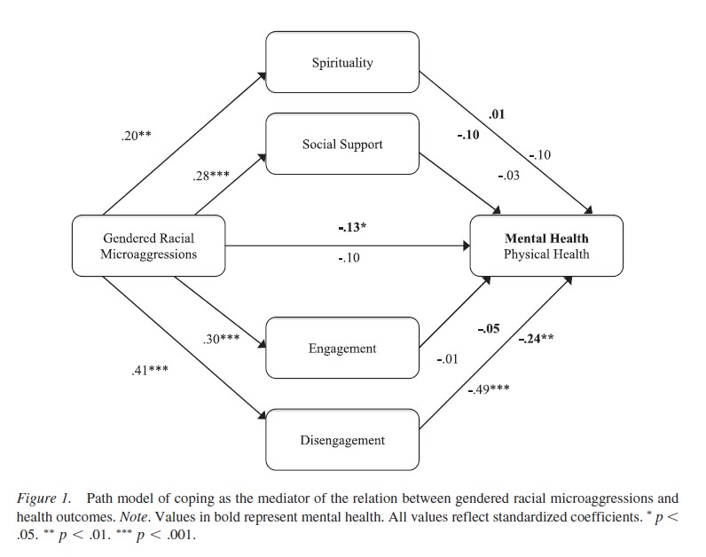

# Complex Mediation {#CompMed}

 [Screencasted Lecture Link](https://spu.hosted.panopto.com/Panopto/Pages/Viewer.aspx?pid=6991fd3d-22b6-44f5-ab5b-ad1000314b7f) 

The focus of this chapter is the extension of simple mediation to models with multiple mediatrs. In these models with greater complexity we look at both parallel and serial mediation.  There is also more elaboration on some of the conceptual issues related to the estimation of indirect effects. 

## Navigating this Lesson

There is about 1 hour and 20 minutes of lecture.  If you work through the materials with me it would be plan for an additional two hours.

While the majority of R objects and data you will need are created within the R script that sources the chapter, there are a few that cannot be created from within the R framework. Additionally, sometimes links fail.  All original materials are provided at the [Github site](https://https://github.com/lhbikos/ReC_MultivModel) that hosts the book. More detailed guidelines for ways to access all these materials are provided in the OER's [introduction](#ReCintro)

### Learning Objectives

Learning objectives from this lecture include the following:

* Define *epiphenomality* and explain how it is related to (and supports the notion of) multiple mediation.
*	Distinguish between parallel and serial mediation models.
*	Locate and interpret *lavaan* output from multiply mediated models including 
  * identifying coefficients, 
  * percentage of variance accounted for,   
  * all the effects (total, direct, indirec. total indirect), 
  * contrasts.
*	Explain the limitations of the classic approach [@baron_moderator-mediator_1986] to mediation. 


### Planning for Practice

The suggestions for practice in this chapter include conducting parallel, serial, and/or mediation models. Options of graded complexity could incude:

* Rework the problem in the chapter by changing the random seed in the code that simulates the data.  This should provide minor changes to the data, but the results will likely be very similar.
* There are a number of variables in the dataset that sourced the research vignettes for this and the prior chapter on [simple mediation](#SimpleMed).  Swap out one or more variables in a parallel or serial (or both) model.
* Conduct a parallel or serial (or both) mediation with data to which you have access. This could include data you simulate on your own or from a published article.

### Readings & Resources

In preparing this chapter, I drew heavily from the following resource(s). Other resources are cited (when possible, linked) in the text with complete citations in the reference list.

* Hayes, A. F. (2018).  *Introduction to mediation, moderation, and conditional process anlaysis:  A regression-based approach*. New York, NY: Guilford Press. Available as an ebook from the SPU library:  https://ebookcentral-proquest-com.ezproxy.spu.edu/lib/spu/detail.action?docID=5109647 
  - **Chapter 5: More than One Mediator**: This chapter walks the reader through parallel and serial mediation models.  We will do both! 
  - **Appendix A:  Using Process**:  An essential tool for PROCESS users because, even when we are in the R environment, this is the "idea book." That is, the place where all the path models are presented in figures.
* Lewis, J. A., Williams, M. G., Peppers, E. J., & Gadson, C. A. (2017). Applying intersectionality to explore the relations between gendered racism and health among Black women. *Journal of Counseling Psychology*, *64*(5), 475–486. https://doi-org.ezproxy.spu.edu/10.1037/cou0000231

### Packages

The script below will (a) check to see if the following packages are installed on your computer and, if not (b) install them.

<!-- TODO: Build out this section. -->

```r
# will install the package if not already installed
if (!require(lavaan)) {
    install.packages("lavaan")
}
if (!require(semPlot)) {
    install.packages("semPlot")
}
if (!require(tidyverse)) {
    install.packages("tidyverse")
}
if (!require(psych)) {
    install.packages("psych")
}
if (!require(apaTables)) {
    install.packages("apaTables")
}
if (!require(formattable)) {
    install.packages("formattable")
}
```

## Complex Mediation

The simple mediation model is quite popular, but also limiting in that it:

* frequently oversimplifies the processes we want to study, and
* is likely mis-specified, in that there are unmodeled mechanisms.

Hayes [-@hayes_introduction_2018] identified four reasons to consider multiply mediated models: 

* We are generally interested in MULTIPLE mechanisms
* A mechanism (such as a mediator) in the model, might, itself be mediated (i.e., mediated mediation)
* *Epiphenomenality* ("unknown confounds"):  a proposed mediator could be related to an outcome not because it causes the outcome, but because it is correlated with another variable that is causally influencing the outcome.  This is a noncausal alternative explanation for an association. 
*	Including multiple mediators allows formal comparison of the strength of the mediating mechanisms.

There are two multiple mediator models that we will consider:  parallel, serial.


## Parallel Mediation

**Parallel multiple mediation**:  An antecedent variable X is modeled as influencing consequent Y directly as well as indirectly through two or more mediators, with the condition that no mediator causally influences another [@hayes_introduction_2018, p. 149]

With multiple mediation we introduce additional effects:

* *Direct effect*, $c'$  (this is not new) quantifies how much two cases that differ by a unit on X are estimated to differ on Y -- independent of all mediators.
* *Specific indirect effect*, $a_{i}b_{i}$,  the individual mediated effects
* *Total indirect effects *, $\sum_{i=1}^{k}a_{i}b_{i}$ the sum of the values of the specific indirect effects. The total indirect effect can also be calculated by subtracting the direct effects from the total effects: $c - c'$
* *Total effect of X on Y*, $c = c' + \sum_{i=1}^{k}a_{i}b_{i}$ (also not new) the sum of the direct and indirect effects. The total effect can also be estimated by regressing Y on X alone.
* *Contrasts* allow us to directly compare separate mediating effects to see if one indirect effect is stronger than the other.


In this parallel model, we can describe these effects this way:

* *Direct effect*: The effect of IV on the DV, accounting for two mediators (indirect effects) in the model.
* *Specific indirect effects*: There are indirect (or mediating) paths from the IV to the DV; through M1 and M2, respectively.
* *Total indirect effect of X on Y*:  A sum of the value of indirect effects through the specific indirect effects (M1 and M2). 
* *Total effect*:  The sum of the direct and indirect effects.  Also calculated by regressing Y (dependent variable) on X (independent variable) alone, without any other variables in the model.

Recall that for a complex mediation to be parallel, there can be no causal links between mediators.  This is true in this example. 

As before, let's work a mechanical example with simulated data that assures a statistically significant outcome. Credit to this example is from the PAULOTOFFANIN website [@toffanin_multiple-mediator_2017].

### A Mechanical Example

We can bake our own data by updating the script we used in simple mediation to add a second mediator.

#### Data Simulation


```r
# Concerned that identical variable names across book chapters may be
# problematic, I'm adding 'p' in front the 'Data' variable.
set.seed(210417)
X <- rnorm(100)
M1 <- 0.5 * X + rnorm(100)
M2 <- -0.35 * X + rnorm(100)
Y <- 0.7 * M2 + 0.48 * M1 + rnorm(100)
pData <- data.frame(X = X, Y = Y, M1 = M1, M2 = M2)
```

Using what we learned in conducting a simple mediation in *lavaan*, we can look at the figure of our proposed model and *backwardstrace* the paths to write the code.

Remember...

* The model exists between 2 single quotation marks (the odd looking ' and ' at the beginning and end).
*  You can write the Y as I have done in the R chunk below, or you can write the Y separately from each arrow, such as
   +  Y ~ b1*M1 
   +  Y ~ b2*M2 
   +  Y ~ c_p*X
* Everything else transfers from our simple mediation, remember that 
  +  the asterisk ("*") allows us to assign labels (a1, a2, b1, b2, etc.) to the paths; these are helpful for intuitive interpretation
  +  that eyes/nose notation (:=) is used when creating a new variable that is a function of variables in the model, but not in the dataset (i.e., the a and b path).
  +  in traditional mediation speak, the direct path from X to Y is c' (c prime) and the total effect of X to Y (with nothing else in the model) is just c.  Hence the c_p label for c prime.
* Something new:  the *contrast* statement (only one in this example, but you could have more) allows us to compare the indirect effects to each other. We specify it in the lavaan model, but then need to test it in a subsequent set of script.
  
*  *Note*:  In the online example, the writer adds code to correlate M1 and M2.  This didn't/doesn't seem right to me and then, later, when we amend it to be a serial model, it made even less sense to have them be correlated.  

#### Specifying *lavaan* code

```r
library(lavaan)
```

```
## This is lavaan 0.6-16
## lavaan is FREE software! Please report any bugs.
```

```r
set.seed(210418)
parallel_med <- "
    Y ~ b1*M1 + b2*M2 + c_p*X
    M1 ~ a1*X
    M2 ~ a2*X
    indirect1 := a1 * b1
    indirect2 := a2 * b2
    contrast := indirect1 - indirect2
    total_indirects := indirect1 + indirect2
    total_c    := c_p + (indirect1) + (indirect2)
    direct := c_p
 "
parallel_fit <- sem(parallel_med, data = pData, se = "bootstrap", missing = "fiml",
    bootstrap = 1000)
pfit_sum <- summary(parallel_fit, standardized = TRUE, rsq = T, fit = TRUE,
    ci = TRUE)
pfit_ParEsts <- parameterEstimates(parallel_fit, boot.ci.type = "bca.simple",
    standardized = TRUE)
pfit_sum
```

```
## lavaan 0.6.16 ended normally after 3 iterations
## 
##   Estimator                                         ML
##   Optimization method                           NLMINB
##   Number of model parameters                        11
## 
##   Number of observations                           100
##   Number of missing patterns                         1
## 
## Model Test User Model:
##                                                       
##   Test statistic                                 0.095
##   Degrees of freedom                                 1
##   P-value (Chi-square)                           0.757
## 
## Model Test Baseline Model:
## 
##   Test statistic                                91.109
##   Degrees of freedom                                 6
##   P-value                                        0.000
## 
## User Model versus Baseline Model:
## 
##   Comparative Fit Index (CFI)                    1.000
##   Tucker-Lewis Index (TLI)                       1.064
##                                                       
##   Robust Comparative Fit Index (CFI)             1.000
##   Robust Tucker-Lewis Index (TLI)                1.064
## 
## Loglikelihood and Information Criteria:
## 
##   Loglikelihood user model (H0)               -425.933
##   Loglikelihood unrestricted model (H1)       -425.885
##                                                       
##   Akaike (AIC)                                 873.866
##   Bayesian (BIC)                               902.522
##   Sample-size adjusted Bayesian (SABIC)        867.782
## 
## Root Mean Square Error of Approximation:
## 
##   RMSEA                                          0.000
##   90 Percent confidence interval - lower         0.000
##   90 Percent confidence interval - upper         0.181
##   P-value H_0: RMSEA <= 0.050                    0.785
##   P-value H_0: RMSEA >= 0.080                    0.178
##                                                       
##   Robust RMSEA                                   0.000
##   90 Percent confidence interval - lower         0.000
##   90 Percent confidence interval - upper         0.181
##   P-value H_0: Robust RMSEA <= 0.050             0.785
##   P-value H_0: Robust RMSEA >= 0.080             0.178
## 
## Standardized Root Mean Square Residual:
## 
##   SRMR                                           0.009
## 
## Parameter Estimates:
## 
##   Standard errors                            Bootstrap
##   Number of requested bootstrap draws             1000
##   Number of successful bootstrap draws            1000
## 
## Regressions:
##                    Estimate  Std.Err  z-value  P(>|z|) ci.lower ci.upper
##   Y ~                                                                   
##     M1        (b1)    0.540    0.111    4.851    0.000    0.312    0.752
##     M2        (b2)    0.690    0.119    5.805    0.000    0.430    0.923
##     X        (c_p)    0.105    0.130    0.812    0.417   -0.149    0.354
##   M1 ~                                                                  
##     X         (a1)    0.528    0.114    4.623    0.000    0.308    0.746
##   M2 ~                                                                  
##     X         (a2)   -0.324    0.107   -3.031    0.002   -0.548   -0.111
##    Std.lv  Std.all
##                   
##     0.540    0.478
##     0.690    0.529
##     0.105    0.074
##                   
##     0.528    0.419
##                   
##    -0.324   -0.297
## 
## Intercepts:
##                    Estimate  Std.Err  z-value  P(>|z|) ci.lower ci.upper
##    .Y                -0.187    0.105   -1.788    0.074   -0.398    0.009
##    .M1                0.010    0.106    0.096    0.924   -0.187    0.226
##    .M2               -0.043    0.097   -0.445    0.657   -0.236    0.147
##    Std.lv  Std.all
##    -0.187   -0.142
##     0.010    0.009
##    -0.043   -0.043
## 
## Variances:
##                    Estimate  Std.Err  z-value  P(>|z|) ci.lower ci.upper
##    .Y                 0.948    0.152    6.248    0.000    0.633    1.226
##    .M1                1.131    0.121    9.308    0.000    0.880    1.350
##    .M2                0.938    0.126    7.424    0.000    0.687    1.182
##    Std.lv  Std.all
##     0.948    0.542
##     1.131    0.825
##     0.938    0.912
## 
## R-Square:
##                    Estimate
##     Y                 0.458
##     M1                0.175
##     M2                0.088
## 
## Defined Parameters:
##                    Estimate  Std.Err  z-value  P(>|z|) ci.lower ci.upper
##     indirect1         0.285    0.086    3.331    0.001    0.129    0.472
##     indirect2        -0.224    0.085   -2.645    0.008   -0.408   -0.073
##     contrast          0.509    0.124    4.090    0.000    0.272    0.787
##     total_indircts    0.061    0.116    0.527    0.598   -0.171    0.287
##     total_c           0.167    0.160    1.043    0.297   -0.160    0.482
##     direct            0.105    0.130    0.812    0.417   -0.149    0.354
##    Std.lv  Std.all
##     0.285    0.200
##    -0.224   -0.157
##     0.509    0.357
##     0.061    0.043
##     0.167    0.117
##     0.105    0.074
```

```r
pfit_ParEsts
```

```
##                lhs op                         rhs           label    est    se
## 1                Y  ~                          M1              b1  0.540 0.111
## 2                Y  ~                          M2              b2  0.690 0.119
## 3                Y  ~                           X             c_p  0.105 0.130
## 4               M1  ~                           X              a1  0.528 0.114
## 5               M2  ~                           X              a2 -0.324 0.107
## 6                Y ~~                           Y                  0.948 0.152
## 7               M1 ~~                          M1                  1.131 0.121
## 8               M2 ~~                          M2                  0.938 0.126
## 9                X ~~                           X                  0.862 0.000
## 10               Y ~1                                             -0.187 0.105
## 11              M1 ~1                                              0.010 0.106
## 12              M2 ~1                                             -0.043 0.097
## 13               X ~1                                              0.010 0.000
## 14       indirect1 :=                       a1*b1       indirect1  0.285 0.086
## 15       indirect2 :=                       a2*b2       indirect2 -0.224 0.085
## 16        contrast :=         indirect1-indirect2        contrast  0.509 0.124
## 17 total_indirects :=         indirect1+indirect2 total_indirects  0.061 0.116
## 18         total_c := c_p+(indirect1)+(indirect2)         total_c  0.167 0.160
## 19          direct :=                         c_p          direct  0.105 0.130
##         z pvalue ci.lower ci.upper std.lv std.all std.nox
## 1   4.851  0.000    0.306    0.747  0.540   0.478   0.478
## 2   5.805  0.000    0.432    0.923  0.690   0.529   0.529
## 3   0.812  0.417   -0.162    0.344  0.105   0.074   0.080
## 4   4.623  0.000    0.311    0.749  0.528   0.419   0.451
## 5  -3.031  0.002   -0.548   -0.110 -0.324  -0.297  -0.320
## 6   6.248  0.000    0.723    1.411  0.948   0.542   0.542
## 7   9.308  0.000    0.926    1.419  1.131   0.825   0.825
## 8   7.424  0.000    0.731    1.234  0.938   0.912   0.912
## 9      NA     NA    0.862    0.862  0.862   1.000   0.862
## 10 -1.788  0.074   -0.391    0.021 -0.187  -0.142  -0.142
## 11  0.096  0.924   -0.188    0.217  0.010   0.009   0.009
## 12 -0.445  0.657   -0.222    0.156 -0.043  -0.043  -0.043
## 13     NA     NA    0.010    0.010  0.010   0.011   0.010
## 14  3.331  0.001    0.135    0.479  0.285   0.200   0.216
## 15 -2.645  0.008   -0.447   -0.092 -0.224  -0.157  -0.169
## 16  4.090  0.000    0.293    0.801  0.509   0.357   0.385
## 17  0.527  0.598   -0.171    0.287  0.061   0.043   0.046
## 18  1.043  0.297   -0.193    0.460  0.167   0.117   0.126
## 19  0.812  0.417   -0.162    0.344  0.105   0.074   0.080
```

#### A note on indirect effects and confidence intervals

Before we move onto interpretation, I want to stop and look at both $p$ values and confidence intervals. Especially with Hayes [-@hayes_introduction_2018] PROCESS macro, there is a great deal of emphasis on the use of bootstrapped confidence intervals to determine the statistical significance of the indirect effects. In fact, PROCESS output has (at least historically) not provided $p$ values with the indirect effects.  This is because, especially in the ordinary least squares context,  bias-corrected bootstrapped confidence intervals are more powerful (i.e., they are more likely to support a statistically significant result) than $p$ values.   

An excellent demonstration of this phenomena was provided by Mallinckrodt et al. [-@mallinckrodt_advances_2006] where they compared confidence intervals produced by the normal theory method to those that are bias corrected. The bias corrected intervals were more powerful to determining if there were statistically significant indirect effects.  

The method we have specified in *lavaan* produced bias-corrected confidence intervals. The $p$ values and corresponding confidence intervals should be consistent with each other. That is, if $p$ < .05, then the CI95s should not pass through zero. Of course we can always check to be certain this is true.  For this reason, I will report $p$ values in my results.  There are reviewers, though, who may prefer that you report CI95s (or both).


#### Figures and Tables


```r
library(semTable)
Tb1FDataparallel <- semTable(parallel_fit, columns = c("est", "se", "p",
    "rsquare"), columnLabels = c(eststars = "Estimate"), paramSets = c("composites",
    "loadings", "slopes", "intercepts", "residualvariances"), file = "Tb1FakyDataparallel",
    type = "csv", print.results = TRUE)
```


```r
library(semPlot)
#note change in layout 
semPaths(parallel_fit, #must identiy the model you want to map
         what = "est", #"est" plots the estimates, but keeps it greyscale with no fading
         #whatLabels = "stand", #"stand" changes to standardized values
         #layout = 'tree', rotation = 2, #together, puts predictors on left, IVs on right 
         layout = 'spring', 
         edge.label.cex = 1.00, #font size of parameter values
         #edge.color = "black", #overwrites the green/black coloring
         sizeMan=10, #size of squares/observed/"manifest" variables
         fade=FALSE, #if TRUE, there lines are faded such that weaker lines correspond with lower values -- a cool effect, but tough for journals
         esize=2, 
         asize=3,
         #label.prop = .5,
         label.font = 2.5, #controls size (I think) of font for labels
         label.scale = TRUE, #if false, the labels will not scale to fit inside the nodes
         nDigits = 3, #decimal places (default is 2)
         residuals = FALSE,#excludes residuals (and variances) from the path diagram
         nCharNodes = 0, #specifies how many characters to abbreviate variable lables; default is 3.  If 0, uses your entire variable label and adjusts fontsize (which could be a downside)
         intercepts = FALSE, #gets rid of those annoying triangles (intercepts) in the path diagram)
)
title("Baked Data:  Parallel Mediation")
```

<!-- -->


There are a number of ways to tabalize the data.  You might be surprised to learn that a number of articles that analyze mediating effects focus their presentation on those values and not the traditional intercepts and B weights.  This is the approach I have taken in this chapter.

**Table 1 ** 

|Model Coefficients Assessing M1 and M2 as Parallel Mediators Between X and Y
|:-----------------------------------------------------------------------------------------------|

|                         
|:----:|:-:|:-:|:-:|:--:|:------------------------:|:-:|:----------:|:------------:|:-----------:|
|IV    |   |M  |   |DV  |$B$ for *a* and *b* paths |   |$B$         | $SE$         |$p$          |
|X     |-->|M1 |-->|DV  |(0.528) X (0.540)     |=  |0.285   |0.086   |0.001  |
|X     |-->|M2 |-->|DV  |(-0.324) X (0.690)     |=  |-0.224   |0.085   |0.008  |

|
|:----------------------------------------------------:|:----------:|:------------:|:-----------:|
|                                                      |$B$         | $SE$         |$p$          |
|Total indirect effect                                 |0.061 |0.116|0.598|
|Total effect of X on Y (c path)                       |0.167    |0.160   |0.297   |
|Direct effect of X on Y (c')                          |0.105    |0.130   |0.130  |

|
|------------------------------------------------------------------------------------------------|
*Note*. X =definition; M1 = definition; M2 = definition; Y = definition. The significance of the indirect effects was calculated with bias-corrected confidence intervals (.95) bootstrap analysis.


#### APA Style Writeup

A model of parallel multiple mediation was analyzed examining the degree to which importance of M1 and M2 mediated the relation of X on Y. Hayes [-@hayes_introduction_2018] recommended this strategy over simple mediation models because it allows for all mediators to be examined, simultaneously.  The resultant direct and indirect values for each path account for other mediation paths.  Using the *lavaan (v. 0.6-7)* package in R, coefficients for specific indirect, total indirect, direct, and total were computed.  Path coefficients refer to regression weights, or slopes, of the expected changes in the dependent variable given a unit change in the independent variables.  

Results (depicted in Figure 1 and presented in Table 2) suggest that  of the variance in Y is accounted for by the model.  While each of the specific indirect effects (X through M1 and M2, respectively) were statistically significant, the total indirect effect (i.e., the sum of the specific indirect effects was not.  This is likely because the indirect effect passing through M1 was positive in valence and the indirect effect passing through M2 was negative; hence, they "cancelled each other out." A pairwise comparison of the specific indirect effects indicated that the strength of the effects were statistically significantly different from each other ($B$ = 0.509, $p$ = 0.000). This means that the indirect effect passing through M1 was statistically stronger than the indirect effect passing through M2. 

Let's turn now to the research vignette and work an example with simulated data from that example. Because the research vignette use an entirely new set of output I will either restart R or clear my environment so that there are a few less objects "in the way."

### Research Vignette

The research vignette comes from the Lewis, Williams, Peppers, and Gadson's [-@lewis_applying_2017] study titled, "Applying Intersectionality to Explore the Relations Between Gendered Racism and Health Among Black Women."  The study was published in the Journal of Counseling Psychology. Participants were 231 Black women who completed an online survey. 

Variables used in the study included:

* **GRMS**:  Gendered Racial Microaggressions Scale [@lewis_construction_2015] is a 26-item scale that assesses the frequency of nonverbal, verbal, and behavioral negative racial and gender slights experienced by Black women. Scaling is along six points ranging from 0 (never) to 5 (once a week or more).  Higher scores indicate a greater frequency of gendered racial microaggressions. An example item is, "Someone has made a sexually inappropriate comment about my butt, hips, or thighs."

* **MntlHlth** and **PhysHlth**: Short Form Health Survey - Version 2 [@ware_comparison_1995] is a 12-item scale used to report self-reported mental (six items) and physical health (six items).
Higher scores indicate higher mental health (e.g., little or no psychological ldistress) and physical health (e.g., little or no reported symptoms in physical functioning). An example of an item assessing mental health was, "How much of the time during the last 4 weeks have you felt calm and peaceful?"; an example of a physical health item was, "During the past 4 weeks, how much did pain interfere with your normal work?"

* **Sprtlty**, **SocSup**, **Engmgt**, and **DisEngmt** are four subscales from the Brief Coping with Problems Experienced Inventory [@carver_you_1997]. The 28 items on this scale are presented on a 4-point scale ranging from 1 (*I usually do not do this at all*) to 4(*I usually do this a lot*).  Higher scores indicate a respondents' tendency to engage in a particular strategy.  Instructions were modified to ask how the female participants responded to recent experiences of racism and sexism as Black women. The four subscales included spirituality (religion, acceptance, planning), interconnectedness/social support (vent emotions, emotional support,instrumental social support), problem-oriented/engagement coping (active coping, humor, positive reinterpretation/positive reframing), and disengagement coping (behavioral disengagement, substance abuse, denial, self-blame, self-distraction).

* **GRIcntlty**:  The Multidimensional Inventory of Black Identity Centrality subscale [@sellers_multidimensional_nodate] was modified to measure the intersection of racial and gender identity centrality.  The scale included 10 items scaled from 1 (*strongly disagree*) to 7 (*strongly agree*). An example item was, "Being a *Black woman* is important to my self-image."  Higher scores indicated higher levels of gendered racial identity centrality.

#### Data Simulation

Simulating the data:

```r
# Entering the intercorrelations, means, and standard deviations from
# the journal article
mu <- c(1.99, 2.82, 2.48, 2.32, 1.75, 5.71, 21.37, 21.07)
sd <- c(0.9, 0.7, 0.81, 0.61, 0.53, 1.03, 3.83, 4.66)
r_mat <- matrix(c(1, 0.2, 0.28, 0.3, 0.41, 0.19, -0.32, -0.18, 0.2, 1,
    0.49, 0.57, 0.22, 0.13, -0.06, -0.13, 0.28, 0.49, 1, 0.46, 0.26, 0.38,
    -0.18, -0.08, 0.3, 0.57, 0.46, 1, 0.37, 0.08, -0.14, -0.06, 0.41, 0.22,
    0.26, 0.37, 1, 0.05, -0.54, -0.28, 0.19, 0.13, 0.38, 0.08, 0.05, 1,
    -0.1, 0.14, -0.32, -0.06, -0.18, -0.14, -0.54, -0.1, 1, 0.47, -0.18,
    -0.13, -0.08, -0.06, -0.28, 0.14, 0.47, 1), ncol = 8)
# Creating a covariance matrix

cov_mat <- sd %*% t(sd) * r_mat
cov_mat
```

```
##          [,1]     [,2]      [,3]      [,4]      [,5]      [,6]      [,7]
## [1,]  0.81000  0.12600  0.204120  0.164700  0.195570  0.176130 -1.103040
## [2,]  0.12600  0.49000  0.277830  0.243390  0.081620  0.093730 -0.160860
## [3,]  0.20412  0.27783  0.656100  0.227286  0.111618  0.317034 -0.558414
## [4,]  0.16470  0.24339  0.227286  0.372100  0.119621  0.050264 -0.327082
## [5,]  0.19557  0.08162  0.111618  0.119621  0.280900  0.027295 -1.096146
## [6,]  0.17613  0.09373  0.317034  0.050264  0.027295  1.060900 -0.394490
## [7,] -1.10304 -0.16086 -0.558414 -0.327082 -1.096146 -0.394490 14.668900
## [8,] -0.75492 -0.42406 -0.301968 -0.170556 -0.691544  0.671972  8.388466
##           [,8]
## [1,] -0.754920
## [2,] -0.424060
## [3,] -0.301968
## [4,] -0.170556
## [5,] -0.691544
## [6,]  0.671972
## [7,]  8.388466
## [8,] 21.715600
```

```r
#Set random seed so that the following matrix always gets the same results.
set.seed(210403)
library(MASS)
```

```
## 
## Attaching package: 'MASS'
```

```
## The following object is masked from 'package:formattable':
## 
##     area
```

```r
Lewis_df <- mvrnorm(n = 212, mu=mu, Sigma = cov_mat, empirical = TRUE)
colMeans(Lewis_df)
```

```
## [1]  1.99  2.82  2.48  2.32  1.75  5.71 21.37 21.07
```

```r
#Checking our work against the original correlation matrix
cor(Lewis_df)
```

```
##       [,1]  [,2]  [,3]  [,4]  [,5]  [,6]  [,7]  [,8]
## [1,]  1.00  0.20  0.28  0.30  0.41  0.19 -0.32 -0.18
## [2,]  0.20  1.00  0.49  0.57  0.22  0.13 -0.06 -0.13
## [3,]  0.28  0.49  1.00  0.46  0.26  0.38 -0.18 -0.08
## [4,]  0.30  0.57  0.46  1.00  0.37  0.08 -0.14 -0.06
## [5,]  0.41  0.22  0.26  0.37  1.00  0.05 -0.54 -0.28
## [6,]  0.19  0.13  0.38  0.08  0.05  1.00 -0.10  0.14
## [7,] -0.32 -0.06 -0.18 -0.14 -0.54 -0.10  1.00  0.47
## [8,] -0.18 -0.13 -0.08 -0.06 -0.28  0.14  0.47  1.00
```

Rename the variables

```r
as.data.frame(Lewis_df, row.names = NULL, optional = FALSE, make.names = TRUE)
library(tidyverse)
Lewis_df <- Lewis_df %>%
    as.data.frame %>%
    rename(GRMS = V1, Sprtlty = V2, SocSup = V3, Engmt = V4, DisEngmt = V5,
        GRIcntlty = V6, MtnlHlth = V7, PhysHlth = V8)
```


```r
head(Lewis_df)
```

```
##        GRMS  Sprtlty   SocSup    Engmt DisEngmt GRIcntlty MtnlHlth PhysHlth
## 1 0.7792361 2.628957 1.758948 1.691459 1.062341  5.533258 22.70042 19.42231
## 2 1.5729406 1.943789 1.101567 2.446707 1.885076  5.806530 22.67086 22.25516
## 3 1.9586843 3.039406 1.591625 2.428866 1.635518  5.166721 19.06958 23.23199
## 4 0.6532324 2.624590 1.039778 1.495290 1.506393  4.276244 23.90836 18.74549
## 5 2.8280150 3.242341 2.202956 1.553723 1.024422  5.730293 22.86224 18.80227
## 6 1.2809196 3.052410 4.097964 2.727955 1.565009  8.474002 19.13631 24.48153
```

#### Quick Descriptives

Of course it is is a good idea to examine our data ahead of time.  While we won't take time to do a thorough analysis, we can at least take a peek.

```r
library(psych)
```

```
## 
## Attaching package: 'psych'
```

```
## The following objects are masked from 'package:ggplot2':
## 
##     %+%, alpha
```

```
## The following object is masked from 'package:lavaan':
## 
##     cor2cov
```

```r
psych::describe(Lewis_df)
```

```
##           vars   n  mean   sd median trimmed  mad   min   max range  skew
## GRMS         1 212  1.99 0.90   2.01    2.00 0.93 -0.75  4.24  4.99 -0.12
## Sprtlty      2 212  2.82 0.70   2.75    2.82 0.65  0.46  4.68  4.23 -0.06
## SocSup       3 212  2.48 0.81   2.47    2.46 0.77 -0.32  4.68  5.00  0.11
## Engmt        4 212  2.32 0.61   2.33    2.32 0.57  0.37  4.08  3.71 -0.02
## DisEngmt     5 212  1.75 0.53   1.75    1.75 0.55  0.58  3.00  2.42 -0.04
## GRIcntlty    6 212  5.71 1.03   5.67    5.68 1.00  3.08  9.40  6.32  0.32
## MtnlHlth     7 212 21.37 3.83  21.60   21.46 4.29 11.65 31.90 20.25 -0.15
## PhysHlth     8 212 21.07 4.66  20.79   21.03 4.68  8.43 33.71 25.28  0.07
##           kurtosis   se
## GRMS         -0.14 0.06
## Sprtlty       0.34 0.05
## SocSup        0.41 0.06
## Engmt         0.22 0.04
## DisEngmt     -0.64 0.04
## GRIcntlty     0.36 0.07
## MtnlHlth     -0.54 0.26
## PhysHlth     -0.18 0.32
```
We note that our means and standard deviations map exactly onto those in the article. Because we asked for a normal distribution, we do not violate any of the assumptions related to univariate normality; our skew and kurtosis are well within the limits.

The pairs panel from the *psych* package is an efficient way to see

* the distribution of each variable with a normal curve superimposed (on the diagonal)
* the value of the bivariate correlation (upper diagonal)
* a scatterplot with a regression line between each pair of variables (lower diagonal)


```r
psych::pairs.panels(Lewis_df)
```

<!-- -->

The Lewis et al. article [-@lewis_applying_2017] reports four mediation analyses, each repeated for mental and physical outcomes. Thus, their write-up reports eight simple mediation models. Graphically, this is efficiently represented in a figure that looks like parallel mediation. Note that the figure is reporting standardized estimates.  In Hayes' [-@hayes_introduction_2018] we have been using raw, $B$ weights. However, the standardized weights are reported in the output.


Because the figure looked like a parallel mediation, it made sense to me that we could try this in our research vignette. In the chapter on conditional process analysis, we will work the moderated mediation as they have done.  Below is the model we will work.  Specifically, we will evaluate whether gendered racial microaggressions impact mental health separately, thorough mediated paths of engagement and disengagement. We will also be able to see if the strength of those mediated paths are statistically, significantly, different from each other.


#### Specifying the *lavaan* model

We can use the guidelines above to specify our model and then request summaries of the fit indices and parameter estimates.

```r
set.seed(210403)
library(lavaan)

parallel_Lewis <- "
    MtnlHlth ~ b1*Engmt + b2*DisEngmt + c_p*GRMS
    Engmt ~ a1*GRMS    
    DisEngmt ~ a2*GRMS
    indirect1 := a1 * b1
    indirect2 := a2 * b2
    contrast := indirect1 - indirect2
    total_indirects := indirect1 + indirect2
    total_c := c_p + (indirect1) + (indirect2)
    direct := c_p
"
para_Lewis_fit <- sem(parallel_Lewis, data = Lewis_df, se = "bootstrap",
    bootstrap = 1000, missing = "fiml")  #holds the 'whole' result
pLewis_sum <- summary(para_Lewis_fit, standardized = TRUE, rsq = T, fit = TRUE,
    ci = TRUE)  #today, we really only need the R-squared from here    
pLewis_ParEsts <- parameterEstimates(para_Lewis_fit, boot.ci.type = "bca.simple",
    standardized = TRUE)  #provides our estimates, se, p values for all the elements we specified
```

```r
pLewis_sum
```

```
## lavaan 0.6.16 ended normally after 1 iteration
## 
##   Estimator                                         ML
##   Optimization method                           NLMINB
##   Number of model parameters                        11
## 
##   Number of observations                           212
##   Number of missing patterns                         1
## 
## Model Test User Model:
##                                                       
##   Test statistic                                17.813
##   Degrees of freedom                                 1
##   P-value (Chi-square)                           0.000
## 
## Model Test Baseline Model:
## 
##   Test statistic                               155.625
##   Degrees of freedom                                 6
##   P-value                                        0.000
## 
## User Model versus Baseline Model:
## 
##   Comparative Fit Index (CFI)                    0.888
##   Tucker-Lewis Index (TLI)                       0.326
##                                                       
##   Robust Comparative Fit Index (CFI)             0.888
##   Robust Tucker-Lewis Index (TLI)                0.326
## 
## Loglikelihood and Information Criteria:
## 
##   Loglikelihood user model (H0)               -877.337
##   Loglikelihood unrestricted model (H1)       -868.431
##                                                       
##   Akaike (AIC)                                1776.675
##   Bayesian (BIC)                              1813.597
##   Sample-size adjusted Bayesian (SABIC)       1778.742
## 
## Root Mean Square Error of Approximation:
## 
##   RMSEA                                          0.282
##   90 Percent confidence interval - lower         0.177
##   90 Percent confidence interval - upper         0.403
##   P-value H_0: RMSEA <= 0.050                    0.000
##   P-value H_0: RMSEA >= 0.080                    0.999
##                                                       
##   Robust RMSEA                                   0.282
##   90 Percent confidence interval - lower         0.177
##   90 Percent confidence interval - upper         0.403
##   P-value H_0: Robust RMSEA <= 0.050             0.000
##   P-value H_0: Robust RMSEA >= 0.080             0.999
## 
## Standardized Root Mean Square Residual:
## 
##   SRMR                                           0.075
## 
## Parameter Estimates:
## 
##   Standard errors                            Bootstrap
##   Number of requested bootstrap draws             1000
##   Number of successful bootstrap draws            1000
## 
## Regressions:
##                    Estimate  Std.Err  z-value  P(>|z|) ci.lower ci.upper
##   MtnlHlth ~                                                            
##     Engmt     (b1)    0.581    0.431    1.346    0.178   -0.287    1.447
##     DisEngmt  (b2)   -3.750    0.471   -7.954    0.000   -4.670   -2.851
##     GRMS     (c_p)   -0.575    0.243   -2.363    0.018   -1.071   -0.126
##   Engmt ~                                                               
##     GRMS      (a1)    0.203    0.044    4.584    0.000    0.116    0.292
##   DisEngmt ~                                                            
##     GRMS      (a2)    0.241    0.037    6.570    0.000    0.169    0.312
##    Std.lv  Std.all
##                   
##     0.581    0.091
##    -3.750   -0.513
##    -0.575   -0.133
##                   
##     0.203    0.300
##                   
##     0.241    0.410
## 
## Intercepts:
##                    Estimate  Std.Err  z-value  P(>|z|) ci.lower ci.upper
##    .MtnlHlth         27.728    1.027   27.004    0.000   25.525   29.753
##    .Engmt             1.915    0.100   19.140    0.000    1.720    2.110
##    .DisEngmt          1.270    0.080   15.877    0.000    1.106    1.423
##    Std.lv  Std.all
##    27.728    7.172
##     1.915    3.147
##     1.270    2.401
## 
## Variances:
##                    Estimate  Std.Err  z-value  P(>|z|) ci.lower ci.upper
##    .MtnlHlth         10.067    0.846   11.895    0.000    8.249   11.477
##    .Engmt             0.337    0.035    9.718    0.000    0.270    0.402
##    .DisEngmt          0.233    0.021   10.927    0.000    0.190    0.275
##    Std.lv  Std.all
##    10.067    0.674
##     0.337    0.910
##     0.233    0.832
## 
## R-Square:
##                    Estimate
##     MtnlHlth          0.326
##     Engmt             0.090
##     DisEngmt          0.168
## 
## Defined Parameters:
##                    Estimate  Std.Err  z-value  P(>|z|) ci.lower ci.upper
##     indirect1         0.118    0.095    1.249    0.212   -0.062    0.310
##     indirect2        -0.905    0.182   -4.974    0.000   -1.305   -0.574
##     contrast          1.023    0.224    4.578    0.000    0.618    1.491
##     total_indircts   -0.787    0.185   -4.259    0.000   -1.152   -0.440
##     total_c          -1.362    0.253   -5.392    0.000   -1.841   -0.864
##     direct           -0.575    0.243   -2.362    0.018   -1.071   -0.126
##    Std.lv  Std.all
##     0.118    0.027
##    -0.905   -0.210
##     1.023    0.238
##    -0.787   -0.183
##    -1.362   -0.316
##    -0.575   -0.133
```

```r
pLewis_ParEsts
```

```
##                lhs op                         rhs           label    est    se
## 1         MtnlHlth  ~                       Engmt              b1  0.581 0.431
## 2         MtnlHlth  ~                    DisEngmt              b2 -3.750 0.471
## 3         MtnlHlth  ~                        GRMS             c_p -0.575 0.243
## 4            Engmt  ~                        GRMS              a1  0.203 0.044
## 5         DisEngmt  ~                        GRMS              a2  0.241 0.037
## 6         MtnlHlth ~~                    MtnlHlth                 10.067 0.846
## 7            Engmt ~~                       Engmt                  0.337 0.035
## 8         DisEngmt ~~                    DisEngmt                  0.233 0.021
## 9             GRMS ~~                        GRMS                  0.806 0.000
## 10        MtnlHlth ~1                                             27.728 1.027
## 11           Engmt ~1                                              1.915 0.100
## 12        DisEngmt ~1                                              1.270 0.080
## 13            GRMS ~1                                              1.990 0.000
## 14       indirect1 :=                       a1*b1       indirect1  0.118 0.095
## 15       indirect2 :=                       a2*b2       indirect2 -0.905 0.182
## 16        contrast :=         indirect1-indirect2        contrast  1.023 0.224
## 17 total_indirects :=         indirect1+indirect2 total_indirects -0.787 0.185
## 18         total_c := c_p+(indirect1)+(indirect2)         total_c -1.362 0.253
## 19          direct :=                         c_p          direct -0.575 0.243
##         z pvalue ci.lower ci.upper std.lv std.all std.nox
## 1   1.346  0.178   -0.339    1.354  0.581   0.091   0.091
## 2  -7.954  0.000   -4.703   -2.892 -3.750  -0.513  -0.513
## 3  -2.363  0.018   -1.047   -0.099 -0.575  -0.133  -0.149
## 4   4.584  0.000    0.116    0.292  0.203   0.300   0.334
## 5   6.570  0.000    0.170    0.313  0.241   0.410   0.457
## 6  11.895  0.000    8.599   11.773 10.067   0.674   0.674
## 7   9.718  0.000    0.279    0.414  0.337   0.910   0.910
## 8  10.927  0.000    0.199    0.286  0.233   0.832   0.832
## 9      NA     NA    0.806    0.806  0.806   1.000   0.806
## 10 27.004  0.000   25.599   29.794 27.728   7.172   7.172
## 11 19.140  0.000    1.719    2.109  1.915   3.147   3.147
## 12 15.877  0.000    1.094    1.416  1.270   2.401   2.401
## 13     NA     NA    1.990    1.990  1.990   2.216   1.990
## 14  1.249  0.212   -0.061    0.311  0.118   0.027   0.031
## 15 -4.974  0.000   -1.370   -0.602 -0.905  -0.210  -0.234
## 16  4.578  0.000    0.650    1.561  1.023   0.238   0.265
## 17 -4.259  0.000   -1.198   -0.471 -0.787  -0.183  -0.204
## 18 -5.392  0.000   -1.873   -0.891 -1.362  -0.316  -0.352
## 19 -2.362  0.018   -1.047   -0.099 -0.575  -0.133  -0.149
```


#### Figures and Tables

When I interpret the data I first plot it and then create the table.  Both processes force me to slow down and work conceptually through and deeply in the data.


```r
library(semPlot)
#note change in layout 
semPaths(para_Lewis_fit, #must identiy the model you want to map
         what = "est", #"est" plots the estimates, but keeps it greyscale with no fading
         #whatLabels = "stand", #"stand" changes to standardized values
         #layout = 'tree', rotation = 2, #together, puts predictors on left, IVs on right 
         layout = 'spring', 
         edge.label.cex = 1.00, #font size of parameter values
         #edge.color = "black", #overwrites the green/black coloring
         sizeMan=10, #size of squares/observed/"manifest" variables
         fade=FALSE, #if TRUE, there lines are faded such that weaker lines correspond with lower values -- a cool effect, but tough for journals
         esize=2, 
         asize=3,
         #label.prop = .5,
         label.font = 2.5, #controls size (I think) of font for labels
         label.scale = TRUE, #if false, the labels will not scale to fit inside the nodes
         nDigits = 3, #decimal places (default is 2)
         residuals = FALSE,#excludes residuals (and variances) from the path diagram
         nCharNodes = 0, #specifies how many characters to abbreviate variable lables; default is 3.  If 0, uses your entire variable label and adjusts fontsize (which could be a downside)
         intercepts = FALSE, #gets rid of those annoying triangles (intercepts) in the path diagram)
)
title("Mental Health from Gendered Racial Microaggressions, Mediated by Engagement and Disengagement Coping")
```

<!-- -->

Now let's make a table.

**Table 2 ** 

|Model Coefficients Assessing Engagement and Disengagement Coping as Parallel Mediators Between Predicting Mental Health from Gendered Racial Microaggressions
|:------------------------------------------------------------------------------------------------------------|

|                         
|:----:|:-:|:-------:|:-:|:--------:|:-----------------------:|:-:|:----------:|:-------------:|:------------:|
|IV    |   |M        |   |DV        |$B$ for *a* and *b* paths|   |$B$         | $SE$          |$p$           |
|GRMS  |-->|Engmt    |-->|MntlHlth  |(0.203) X (0.581)  |=  |0.118  |0.095   |0.212  |
|GRMS  |-->|DisEngmt |-->|MntlHlth  |(0.241) X (-3.750)  |=  |-0.905  |0.182   |0.000  |

|
|:---------------------------------------------------------------:|:----------:|:-------------:|:------------:|
|                                                                 |$B$         | $SE$          |$p$           |
|Total indirect effect                                            |-0.787|0.185|0.000|
|Total effect of X on Y (c path)                                  |-1.362   |0.253   |0.000   |
|Direct effect of X on Y (c')                                     |-0.575   |0.243   |0.243  |

|
|-------------------------------------------------------------------------------------------------------------|
*Note*. IV = gendered racial microaggressions; M1 = engagement coping; M2 = disengagement coping; Y = mental health. The significance of the indirect effects was calculated with bias-corrected confidence intervals (.95) bootstrap analysis.

* The model accounts for  of the variance in predicting mental health outcomes.
* The total effect of GRMS on mental health is -1.362 ($p$ = 0.000) is negative and statistically significant.  That is, gendered racial microaggressions have a statistically significant negative effect on mental health.
* The direct effect of GRMS on mental health is -0.575 (*p* = 0.243) is still negative but not statistically significant.  
  * Using Baron and Kenny's [-@baron_moderator-mediator_1986] causal steps logic, the smaller and non-significant direct effect (compared to the total effect) provides helpful, logical support for mediation. According to Hayes [-@hayes_introduction_2018] this difference is not necessary. However it is logically helpful.
*  Indirect effect #1 (a1 x b1 or GRMS through engagement coping) is 0.118 ($p$ = 0.000) and not statistically significant.  Looking at the paths we see that *a1* is positive and statistically significant (GRMS leds to increased engagement coping), but the next link, *b1* (engagement to mental health) is not statistically significant. 
*  Indirect effect #2 (a2 x b2, or GRMS through disengagement to coping) is -0.905($p$ = 0.000). Gendered racial microaggressions lead to greater disengagement (*a1*). In turn, disengagement has negative effects on mental health (*b2*)
* The total indirect effect (i.e., sum of M1 and M2) -0.787 ($p$ = 0.000 ) The sum of all specific indirect effects; statistically significant.
* We look at the contrast to see if the indirect effects statistically significantly different from each other?  $B$ = 1.023, $p$ = 0.000.  They are. This is not surprising since the path mediated by engagement was not statistically significant but the path mediated by disengagement was statistically significant.


```r
LewisparaTable <- semTable(para_Lewis_fit, columns = c("est", "se", "p",
    "rsquare"), columnLabels = c(eststars = "Estimate"), paramSets = c("composites",
    "loadings", "slopes", "intercepts", "residualvariances"), file = "LewisParaTable",
    type = "csv", print.results = TRUE)
```

```
## ,Model,
##  
## ,Estimate,Std. Err.,p,R Square,
## 
## ,Regression Slopes,
##  MtnlHlth,
## 
## Engmt,0.58,0.43,.178,,
## 
## DisEngmt,-3.75,0.47,.000,,
## 
## GRMS,-0.57,0.24,.018,,
## 
##  Engmt,
## 
## GRMS,0.20,0.04,.000,,
## 
##  DisEngmt,
## 
## GRMS,0.24,0.04,.000,,
## 
## ,Intercepts,
## 
## MtnlHlth,27.73,1.03,.000,,
## 
## Engmt,1.92,0.10,.000,,
## 
## DisEngmt,1.27,0.08,.000,,
## 
## GRMS,1.99+,,,,
## 
## ,Residual Variances,
## 
## MtnlHlth,10.07,0.85,.000,,
## 
## Engmt,0.34,0.03,.000,,
## 
## DisEngmt,0.23,0.02,.000,,
## 
## GRMS,0.81+,,,,
## 
## ,Fit Indices,
## 
## chi^2,17.81(1),,.000,,
## 
## CFI,0.89,,,,
## 
## TLI,0.33,,,,
## 
## RMSEA,0.28,,,,
## 
## +Fixed parameter,
## 
## 
## 
## 
```

#### APA Style Writeup

Hayes [-@hayes_introduction_2018] provides helpful guidelines for presenting statistical results.  Here is a summary of his recommendations.

* Pack as much statistical info as possible into a table(s) or figure (s).
* Use statistics in the text as punctuation; avoid redundancy in text and table.
*	Avoid using abbreviations for variables in the text itself; rather focus on the construct names rather than their shorthand
*	Avoid focusing on what you hypothesized (e.g., avoid, "Results supported/did not support hypothesis A1") and instead focus on what you found.  The reader is more interested in the results, not your forecasts.
*	Hayes uses unstandardized metrics. He prefers reporting unstandardized metrics because they map onto the measurement scales used in the study. He believes this is especially important when dichotomous variables are used.
*	There is "no harm" in reporting hypothesis tests and CIs for the a and b paths, but whether/not these paths are statistically significant does not determine the significance of the indirect effect.
*	Be precise with language:
  + OK:  X exerts an effect on Y directly and/or indirectly through M.
  + Not OK:  the indirect effect of M	
* Report direct and indirect effects and their corresponding inferential tests
*	Hayes argues that a statistically significant indirect effect is, in fact statistic.  He dislikes narration of the Baron and Kenny [-@baron_moderator-mediator_1986] process and steps.

Here's my attempt to write up the simulated data from the Lewis et al. [-@lewis_applying_2017] article.

**Method**

Data Analysis

Parallel multiple mediation is appropriate when testing the influence of an independent variable (X) on the dependent variable (Y) directly, as well as indirectly through two or more mediators. A condition of parallel multiple mediation is that no mediator causally influences another [@hayes_introduction_2018]. Using data simulated from Lewis et al. [-@lewis_applying_2017] we utilized parallel multiple mediation analysis to test the influence of gendered racial microaggressions (X, GRMS) on mental health outcomes (Y, MntlHlth) directly as well as indirectly through the mediators engagement coping (M1, Engmt) and disengaged coping (M2, DisEngmt).  Using the *lavaan* (v. 0.6-7) package in R we followed the procedures outlined in Hayes [-@hayes_introduction_2018] by analyzing the strength and significance of four sets of effects:  specific indirect, the total indirect, the direct, and total. 

**Results**

**Preliminary Analyses**
Descriptive statistics were computed, and all variables were assessed for skewness and kurtosis. *More narration,here.*  A summary of descriptive statistics and a correlation matrix for the study is provided in Table #.  These bivariate relations provide evidence to support the test of mediation analysis.
	
**Parallel Multiple Mediation Analysis**
A model of parallel multiple mediation was analyzed examining the degree to which engagement and disengagement coping strategies mediated the relation of gendered racial microaggressions on mental health outcomes in Black women. Hayes [-@hayes_introduction_2018] recommended this strategy over simple mediation models because it allows for all mediators to be examined, simultaneously.  The resultant direct and indirect values for each path account for other mediation paths.  Using the *lavaan* (v. 0.6-7) package in R, coefficients for specific indirect, total indirect, direct, and total were computed.  Path coefficients refer to regression weights, or slopes, of the expected changes in the dependent variable given a unit change in the independent variables.  

Results (depicted in Figure # and presented in Table #) suggest that  of the variance in mental health outcomes is accounted for by the three variables in the model. The indirect effect predicting mental health from gendered racial microaggressions via engagement coping was not statistically significant ($B$ = 0.118, $p$ = 0.000). Looking at the individual paths we see that $a_{1}$ was positive and statistically significant (GRMS leds to increased engagement coping), but the subsequent link, $b_{1}$ (engagement to mental health) was not. The indirect effect predicting mental health from gendered racial microaggressions through disengagement to coping was statistically significant ($B$ = -0.905, $p$ = 0.000). In this case, gendered racial microaggressions led to greater disengagement coping ($a_{2}$). In turn, disengagement coping had negative effects on mental health ($b_{2}$).  Correspondingly, the total indirect effect (i.e., the sum of the specific indirect effects was statistically significant.  A pairwise comparison of the specific indirect effects indicated that the strength of the effects were statistically significantly different from each other ($B$ = 1.023, $p$ = 0.000). Given that the path through engagement coping was not significant, but the path through disengagement coping was, this statistically signifciant difference is not surprising. Further support for understanding mediation as the mechanism of change is found in the drop in statistical significance from the total effect (*c*) to the direct effect (*c'*).


**Hints for Writing Method/Results Sections**

* When you find an article you like, make note of it and put it in a very special folder. In recent years, I have learned to rely on full-text versions stored in my Zotero app.
* Once you know your method (measure, statistic, etc.) begin collecting others articles that are similar to it.  To write results sections I will often reference multiple articles.  
* When it iss time to write have all these resources handy and use them as guides/models.
* Put as much info as possible in the table.  Become a table-pro. That is, learn how to merge/split cells, use borders/shading, the decimal tab, and so forth.  Don't make the borders disappear until the last thing you do before submitting.  This is because you ALWAYS have to update your tables and seeing the borders makes it easier.


## Serial Multiple Mediator Model

Recall that one of the conditions of the *parallel mediator model*  was that "no mediator causally influences another."

Regarding these correlated mediators [-@hayes_introduction_2018]:

* Typically, two or more mediators that are causally located between X and Y will be correlated - if for no other reason than that they share a common cause (X).
*	Estimating the partial correlation between two mediators after controlling for X is one way to examine whether all of their association is accounted for by this common cause.
  + *Partial correlation* is the Pearson correlation between the residuals from a model estimating Y from a set of covariates, and the residuals from a model estimating X from the same set of covariates.
  + Partial correlations allow the assessment of their association, independent of what they have in common with the covariates that were regressed onto Y and X, separately.
*	If two (or more) mediators remain correlated after adjusting for X, then 
  + the correlation is *spurious,* they share another (unmodeled) common cause.
  + the remaining association is *epiphenomenal*.  That is, a proposed mediator could be related to an outcome not because it causes the outcome, but because it is correlated with another variable that is causally influencing the outcome.  This is a noncausal alternative explanation for an association.  Also,	many things correlated with the cause of Y will also tend to be correlated with X, but it doesn't make all those things cause Y
  + *or one mediator causally affects another*

The goal of a serial multiple mediator model is to investigate the direct and indirect effects of X on Y while modeling a process in which X causes M1, which in turn causes M2, and so forth, concluding with  Y as the final consequent.

As before, we will calculate:

*	*Direct effect, c':*  the estimated difference in Y between two cases that differ by one unit on X but who are equal on all mediators in the model.
* *Specific indirect effects, a1b1, a2b2, a3b3, etc.:*  constructed by multiplying the regression weights corresponding to each step in an indirect pathway; interpreted as the estimated difference in Y between two cases that differ by one unit on X through the causal sequence from X to mediator(s) to Y.
*	*Total indirect effect of X:* sum of all specific indirect effects
* *Total effect of X:*  the total indirect effect of X plus the direct effect of X; can also be estimated by regressing Y from X only.
*	*Pairwise comparisons (contrasts) between indirect effects* (i.e., is one indirect effect stronger than another)


### We stick with the Lewis et al. [-@lewis_applying_2017] example, but modify it.


Our parallel multiple mediator model of gendered racial microaggressions on mental health through engagement and disengagement coping strategies assumed no causal association between the mediators. Noting the statistically significant correlation between engagement and disengagement, what if engagement influenced disengagement, which, in turn influenced mental health.

If this is our goal (image), how many direct and indirect effects are contained in this model? Using the same processes as before, let's plan our model:

*  We add a path predicting disengagement from engagement, and label it with a $d_{21}$ 
   * Regarding the notation, it makes sense that we use a *d* to designate a new type of path; I don't know why we use a subscript of 21
*  We specify a third indirect path that multiplies those 3 paths (a1, d21, b2) together
*  We add a third contrast so that we get all the combinations of indirect comparisons:  1-2, 1-3 2-3
*  We update our total_indirects calculation to include indirect#3
*  We update our total_c calculation to include indirect#3

### Specify the *lavaan* model


```r
set.seed(210403)
library(lavaan)
serial_Lewis <- "
    MtnlHlth ~ b1*Engmt + b2*DisEngmt + c_p*GRMS
    Engmt ~ a1*GRMS    
    DisEngmt ~ a2*GRMS
    DisEngmt ~ d21*Engmt
    indirect1 := a1 * b1
    indirect2 := a2 * b2
    indirect3 := a1 * d21 * b2
    contrast1 := indirect1 - indirect2
    contrast2 := indirect1 - indirect3
    contrast3 := indirect2 - indirect3
    total_indirects := indirect1 + indirect2 + indirect3
    total_c := c_p + indirect1 + indirect2 + indirect3
    direct := c_p
"
serial_Lewis_fit <- sem(serial_Lewis, data = Lewis_df, se = "bootstrap",
    missing = "fiml", bootstrap = 1000)
sLewis_sum <- summary(serial_Lewis_fit, standardized = TRUE, rsq = T, fit = TRUE,
    ci = TRUE)
sLewis_ParEsts <- parameterEstimates(serial_Lewis_fit, boot.ci.type = "bca.simple",
    standardized = TRUE)
```


```r
sLewis_sum
```

```
## lavaan 0.6.16 ended normally after 1 iteration
## 
##   Estimator                                         ML
##   Optimization method                           NLMINB
##   Number of model parameters                        12
## 
##   Number of observations                           212
##   Number of missing patterns                         1
## 
## Model Test User Model:
##                                                       
##   Test statistic                                 0.000
##   Degrees of freedom                                 0
## 
## Model Test Baseline Model:
## 
##   Test statistic                               155.625
##   Degrees of freedom                                 6
##   P-value                                        0.000
## 
## User Model versus Baseline Model:
## 
##   Comparative Fit Index (CFI)                    1.000
##   Tucker-Lewis Index (TLI)                       1.000
##                                                       
##   Robust Comparative Fit Index (CFI)             1.000
##   Robust Tucker-Lewis Index (TLI)                1.000
## 
## Loglikelihood and Information Criteria:
## 
##   Loglikelihood user model (H0)               -868.431
##   Loglikelihood unrestricted model (H1)       -868.431
##                                                       
##   Akaike (AIC)                                1760.862
##   Bayesian (BIC)                              1801.141
##   Sample-size adjusted Bayesian (SABIC)       1763.117
## 
## Root Mean Square Error of Approximation:
## 
##   RMSEA                                          0.000
##   90 Percent confidence interval - lower         0.000
##   90 Percent confidence interval - upper         0.000
##   P-value H_0: RMSEA <= 0.050                       NA
##   P-value H_0: RMSEA >= 0.080                       NA
##                                                       
##   Robust RMSEA                                   0.000
##   90 Percent confidence interval - lower         0.000
##   90 Percent confidence interval - upper         0.000
##   P-value H_0: Robust RMSEA <= 0.050                NA
##   P-value H_0: Robust RMSEA >= 0.080                NA
## 
## Standardized Root Mean Square Residual:
## 
##   SRMR                                           0.000
## 
## Parameter Estimates:
## 
##   Standard errors                            Bootstrap
##   Number of requested bootstrap draws             1000
##   Number of successful bootstrap draws            1000
## 
## Regressions:
##                    Estimate  Std.Err  z-value  P(>|z|) ci.lower ci.upper
##   MtnlHlth ~                                                            
##     Engmt     (b1)    0.581    0.431    1.346    0.178   -0.287    1.447
##     DisEngmt  (b2)   -3.750    0.471   -7.954    0.000   -4.670   -2.851
##     GRMS     (c_p)   -0.575    0.243   -2.363    0.018   -1.071   -0.126
##   Engmt ~                                                               
##     GRMS      (a1)    0.203    0.044    4.584    0.000    0.116    0.292
##   DisEngmt ~                                                            
##     GRMS      (a2)    0.193    0.038    5.150    0.000    0.117    0.266
##     Engmt    (d21)    0.236    0.057    4.163    0.000    0.132    0.355
##    Std.lv  Std.all
##                   
##     0.581    0.092
##    -3.750   -0.519
##    -0.575   -0.135
##                   
##     0.203    0.300
##                   
##     0.193    0.329
##     0.236    0.271
## 
## Intercepts:
##                    Estimate  Std.Err  z-value  P(>|z|) ci.lower ci.upper
##    .MtnlHlth         27.728    1.027   27.004    0.000   25.525   29.753
##    .Engmt             1.915    0.100   19.140    0.000    1.720    2.110
##    .DisEngmt          0.818    0.128    6.400    0.000    0.564    1.073
##    Std.lv  Std.all
##    27.728    7.257
##     1.915    3.147
##     0.818    1.547
## 
## Variances:
##                    Estimate  Std.Err  z-value  P(>|z|) ci.lower ci.upper
##    .MtnlHlth         10.067    0.846   11.895    0.000    8.249   11.477
##    .Engmt             0.337    0.035    9.718    0.000    0.270    0.402
##    .DisEngmt          0.214    0.019   11.318    0.000    0.175    0.249
##    Std.lv  Std.all
##    10.067    0.690
##     0.337    0.910
##     0.214    0.765
## 
## R-Square:
##                    Estimate
##     MtnlHlth          0.310
##     Engmt             0.090
##     DisEngmt          0.235
## 
## Defined Parameters:
##                    Estimate  Std.Err  z-value  P(>|z|) ci.lower ci.upper
##     indirect1         0.118    0.095    1.249    0.212   -0.062    0.310
##     indirect2        -0.726    0.169   -4.295    0.000   -1.067   -0.417
##     indirect3        -0.180    0.065   -2.750    0.006   -0.337   -0.076
##     contrast1         0.844    0.207    4.069    0.000    0.471    1.252
##     contrast2         0.298    0.125    2.384    0.017    0.089    0.572
##     contrast3        -0.546    0.180   -3.028    0.002   -0.896   -0.206
##     total_indircts   -0.787    0.185   -4.259    0.000   -1.152   -0.440
##     total_c          -1.362    0.253   -5.392    0.000   -1.841   -0.864
##     direct           -0.575    0.243   -2.362    0.018   -1.071   -0.126
##    Std.lv  Std.all
##     0.118    0.028
##    -0.726   -0.170
##    -0.180   -0.042
##     0.844    0.198
##     0.298    0.070
##    -0.546   -0.128
##    -0.787   -0.185
##    -1.362   -0.320
##    -0.575   -0.135
```

```r
sLewis_ParEsts
```

```
##                lhs op                               rhs           label    est
## 1         MtnlHlth  ~                             Engmt              b1  0.581
## 2         MtnlHlth  ~                          DisEngmt              b2 -3.750
## 3         MtnlHlth  ~                              GRMS             c_p -0.575
## 4            Engmt  ~                              GRMS              a1  0.203
## 5         DisEngmt  ~                              GRMS              a2  0.193
## 6         DisEngmt  ~                             Engmt             d21  0.236
## 7         MtnlHlth ~~                          MtnlHlth                 10.067
## 8            Engmt ~~                             Engmt                  0.337
## 9         DisEngmt ~~                          DisEngmt                  0.214
## 10            GRMS ~~                              GRMS                  0.806
## 11        MtnlHlth ~1                                                   27.728
## 12           Engmt ~1                                                    1.915
## 13        DisEngmt ~1                                                    0.818
## 14            GRMS ~1                                                    1.990
## 15       indirect1 :=                             a1*b1       indirect1  0.118
## 16       indirect2 :=                             a2*b2       indirect2 -0.726
## 17       indirect3 :=                         a1*d21*b2       indirect3 -0.180
## 18       contrast1 :=               indirect1-indirect2       contrast1  0.844
## 19       contrast2 :=               indirect1-indirect3       contrast2  0.298
## 20       contrast3 :=               indirect2-indirect3       contrast3 -0.546
## 21 total_indirects :=     indirect1+indirect2+indirect3 total_indirects -0.787
## 22         total_c := c_p+indirect1+indirect2+indirect3         total_c -1.362
## 23          direct :=                               c_p          direct -0.575
##       se      z pvalue ci.lower ci.upper std.lv std.all std.nox
## 1  0.431  1.346  0.178   -0.339    1.354  0.581   0.092   0.092
## 2  0.471 -7.954  0.000   -4.703   -2.892 -3.750  -0.519  -0.519
## 3  0.243 -2.363  0.018   -1.047   -0.099 -0.575  -0.135  -0.150
## 4  0.044  4.584  0.000    0.116    0.292  0.203   0.300   0.334
## 5  0.038  5.150  0.000    0.117    0.267  0.193   0.329   0.366
## 6  0.057  4.163  0.000    0.141    0.366  0.236   0.271   0.271
## 7  0.846 11.895  0.000    8.599   11.773 10.067   0.690   0.690
## 8  0.035  9.718  0.000    0.279    0.414  0.337   0.910   0.910
## 9  0.019 11.318  0.000    0.183    0.257  0.214   0.765   0.765
## 10 0.000     NA     NA    0.806    0.806  0.806   1.000   0.806
## 11 1.027 27.004  0.000   25.599   29.794 27.728   7.257   7.257
## 12 0.100 19.140  0.000    1.719    2.109  1.915   3.147   3.147
## 13 0.128  6.400  0.000    0.542    1.047  0.818   1.547   1.547
## 14 0.000     NA     NA    1.990    1.990  1.990   2.216   1.990
## 15 0.095  1.249  0.212   -0.061    0.311  0.118   0.028   0.031
## 16 0.169 -4.295  0.000   -1.130   -0.452 -0.726  -0.170  -0.190
## 17 0.065 -2.750  0.006   -0.359   -0.084 -0.180  -0.042  -0.047
## 18 0.207  4.069  0.000    0.493    1.325  0.844   0.198   0.221
## 19 0.125  2.384  0.017    0.108    0.605  0.298   0.070   0.078
## 20 0.180 -3.028  0.002   -0.965   -0.227 -0.546  -0.128  -0.143
## 21 0.185 -4.259  0.000   -1.198   -0.471 -0.787  -0.185  -0.206
## 22 0.253 -5.392  0.000   -1.873   -0.891 -1.362  -0.320  -0.356
## 23 0.243 -2.362  0.018   -1.047   -0.099 -0.575  -0.135  -0.150
```


### Figures and Tables

**Table 2 ** 

|Model Coefficients Assessing Engagement and Disengagement Coping as Serial Mediators Between Predicting Mental Health from Gendered Racial Microaggressions
|:------------------------------------------------------------------------------------------------------------------------------------|

|                         
|:----:|:-:|:------:|:-:|:------:|:-:|:--------:|:-----------------------------------:|:-:|-----------:|:-------------:|:------------:|
|IV    |   |M1      |   |M2      |   |DV        |$B$ for *a*,  *b*, and $d_{21}$ paths|   |$B$         |$SE$           |$p$           |
|GRMS  |-->|Engmt   |-->|        |   |MntlHlth  |(0.203) X (0.581)              |=  |0.118  |0.095   |0.212  |
|GRMS  |-->|DisEngmt|-->|        |   |MntlHlth  |(0.193) X (-3.750)              |=  |-0.726  |0.169   |0.000  |
|GRMS  |-->|Engmt   |-->|DisEngmt|-->|MntlHlth  |(0.203) X (0.236) X (-3.750)|=  |-0.180  |0.065   |0.000  |

|
|:---------------------------------------------------------------------------------------:|:----------:|:-------------:|:------------:|
|                                                                                         |$B$         | $SE$          |$p$           |
|Total indirect effect                                                                    |-0.787|0.185|0.000|
|Total effect of GRMS (X) on mental health (Y; c path)                                    |-1.362   |0.253   |0.000   |
|Direct effect of GRMS (X) on mental health (Y; c' path)                                  |-0.575   |0.243   |0.018   |
|Contrast comparing indirects 1 (via engagement) and 2 (via disengagement)                |0.844 |0.207 |0.000 |
|Contrast comparing indirects 1 (via engagement) and 3 (serially via disengagement)       |0.298 |0.125 |0.017 |
|Contrast comparing indirects 2 (via disengagement) and 3 (serially via disengagement)    |-0.546 |0.180 |0.002 |

|
|-------------------------------------------------------------------------------------------------------------------------------------|
*Note*. IV = gendered racial microaggressions; M1 = engagement coping; M2 = disengagement coping; Y = mental health. The significance of the indirect effects was calculated with bias-corrected confidence intervals (.95) bootstrap analysis.

Working through the data, we should be able to find these items:

*  The model accounts for  of the variance in predicting mental health outcomes.
*  The total effect of GRMS (X) on mental health (Y) is -1.362 ($p$ = 0.000) is negative and statistically significant.
*  The direct effect of GRMS (X) on mental health (Y) (-0.575,  $p$ = 0.018) is still negative, but weaker in magnitude (relative to the total effect).  While the $p$ value is statistically significant, it is closer to being not significant (than the total effect).  This reduction in magnitude and strength of significance is consistent with the Baron and Kenny [-@baron_moderator-mediator_1986] logic of mediation.
*  Indirect effect #1 ($a_{1}$ x $b_{1}$ or GRMS through engagement coping to mental health) is 0.118 ($p$ = 0.212).  Again, $p$ is > .05. Examining the individual paths, there is a statistically significant relationship from GRMS to engagement, but not from engagement to mental health.
*  Indirect effect #2 ($a_{2}$ x $b_{2}$, or GRMS through disengagement coping to mental health, is -0.726 ($p$ = 0.000). Each of the paths is statistically significant from zero and so is the indirect effect.
*  Indirect effect #3 ($a_{2}$ x $d_{21}$ x $b_{2}$; GRMS through engagement coping through disengagement coping to mental health) is -0.180 ($p$ = 0.000). This indirect effect involves $a_{1}$ (GRMS to engagement) which is not significant.  However, the remaining paths were significant.  That is engagement coping led to increased disengagement coping, which led to poorer mental health outcomes.
* Total indirect:  -0.787 ($p$ = 0.000) is the sum of all specific indirect effects and is statistically significant.
* With **contrasts** we ask:  Are the indirect effects statistically significantly different from each other?
  *  Contrast 1 (indirect 1 v 2) = 0.844 ($p$ = 0.000), yes
  *  Contrast 2 (indirect 1 v 3) = 0.844 ($p$ = 0.017), yes
  *  Contrast 3 (indirect 2 v 3) = 0.844 ($p$ = -0.546), yes
  *  This formal test of contrasts is an important one.  It is not ok to infer that effects are statistically significantly different than each other on the basis of their estimates or $p$ values. The formal test allows us to claim (with justification) that the strongest indirect effect is #2 -- GRMS through disengagement coping to mental health.  


```r
library(semTable)
LewisserialTbl <- semTable(serial_Lewis_fit, columns = c("est", "se", "p",
    "rsquare"), columnLabels = c(eststars = "Estimate"), paramSets = c("composites",
    "loadings", "slopes", "intercepts", "residualvariances"), file = "LewisSerialTbl",
    type = "csv", print.results = TRUE)
```

This is not the greatest figure.  There is much to learn in *semPlot*.

```r
semPaths(serial_Lewis_fit, #must identiy the model you want to map
         what = "est", #"est" plots the estimates, but keeps it greyscale with no fading
         #whatLabels = "stand", #"stand" changes to standardized values
         #layout = 'tree', rotation = 2, #together, puts predictors on left, IVs on right 
         layout = 'circle',
         edge.label.cex = 1.00, #font size of parameter values
         #edge.color = "black", #overwrites the green/black coloring
         sizeMan=10, #size of squares/observed/"manifest" variables
         fade=FALSE, #if TRUE, there lines are faded such that weaker lines correspond with lower values -- a cool effect, but tough for journals
         esize=2, 
         asize=3,
         #label.prop = .5,
         label.font = 2.5, #controls size (I think) of font for labels
         label.scale = TRUE, #if false, the labels will not scale to fit inside the nodes
         nDigits = 3, #decimal places (default is 2)
         residuals = FALSE,#excludes residuals (and variances) from the path diagram
         nCharNodes = 0, #specifies how many characters to abbreviate variable lables; default is 3.  If 0, uses your entire variable label and adjusts fontsize (which could be a downside)
         intercepts = FALSE, #gets rid of those annoying triangles (intercepts) in the path diagram)
)
title("The Effect of Gendered Racial Microaggressions on Mental Health through Engaged and Disengaged Coping Styles")
```

<!-- -->


### APA Style Writeup

**Method**
**Data Analysis**
Serial multiple mediation is appropriate when testing the influence of an independent variable (X) on the dependent variable (Y) directly, as well as indirectly through two or more mediators (M) and there is reason to hypothesize that variables that are causally prior in the model affect all variables later in the causal sequence [@hayes_introduction_2018]. We utilized serial multiple mediation analysis to test the influence of gendered racial microaggressions (X, GRMS) on mental health (Y, MntlHlth) directly as well as indirectly through the mediators engagement coping (M1, Engmt) and disengagement coping (M2, DisEngmt).  Moreover, we hypothesized a causal linkage between from the engagement coping mediator to the disengagement coping mediator such that a third specific indirect effect began with GRMS (X) through engagement coping (M1) through disengagement coping (M2) to mental health (Y).  Using the *lavaan* (v. 0.6-7) package in R we followed the procedures outlined in Hayes [-@hayes_introduction_2018] by analyzing the strength and significance of four sets of effects:  specific indirect, the total indirect, the direct, and total. Bootstrap analysis, a nonparametric sampling procedure, was used to test the significance of the indirect effects. 

*Hayes would likely recommend that we say this with fewer acronyms and more words/story.*

**Results**
**Preliminary Analyses**
Descriptive statistics were computed, and all variables were assessed univariate normality.  *You would give your results regarding skew, kurtosis, Shapiro Wilks', here. If relevant, you could also describe multivariate normality.*  A summary of descriptive statistics and a correlation matrix for the study is provided in Table 1.  These bivariate relations provide evidence to support the test of mediation analysis.
	
**Serial Multiple Mediation Analysis**
A model of serial multiple mediation was analyzed examining the degree to which engagement and disengagement coping mediated the relationship between gendered racial microaggressions and mental health outcomes. Hayes [-@hayes_introduction_2018] recommended this strategy over simple mediation models because it allows for all mediators to be examined, simultaneously and allows the testing of the seriated effect of prior mediators onto subsequent ones.  Using the *lavaan* (v. 0.6-7) package in R, coefficients for specific indirect, total indirect, direct, and total were computed.  Path coefficients refer to regression weights, or slopes, of the expected changes in the dependent variable given a unit change in the independent variables.  

Results (depicted in Figure # and presented in Table #) suggest that  of the variance in behavioral intentions is accounted for by the three variables in the model.  Two of the specific indirect effects were significant and were statistically significantly different from each other.   Specifically, the effect of gendered racial microaggressions through disengagement coping to mental health ($B$ = 0.118, $p$ = 0.212) was stronger than the indirect effect from gendered racial microaggressions through engagement coping through disengagement coping to mental health ($B$ = -0.180, $p$ = 0.000).  Interpreting the results suggests that, mental health outcomes are negatively impacted by gendered racial microaggressions direct and indirectly through disengagement coping. It is this latter path that has the greatest impact. 

*Note*:  In a manner consistent with the Lewis et al. [-@lewis_applying_2017] article, the APA Results section can be fairly short.  This is especially true when a well-organized table presents the results.  In fact, I oculd have left all the numbers out of this except for the $R^2$ (because it was not reported in the table).

## Troubleshooting and FAQs

An indirect effect that was (seemingly) significant in a simple (single) mediation disappears when additional mediators are added.

* Correlated mediators (e.g., multicollinearity) is a likely possibility.
* Which is correct?  Maybe both...

A total effect was not significant, but there is one or more statistically significant specific indirect effect

* Recall that a total effect equals the sum of direct and indirect effects.  If one specific indirect effect is positive and another is negative, this could account for the NS total effect.
* If the direct effect is NS, but the indirect effects are significant, this might render the total effect NS.
* The indirect effects might operate differently in subpopulations (males, females).

Your editor/peer reviewer/dissertation chair-or-committee member may insist that you do this the Baron & Kenny way (aka "the causal steps approach").

* Hayes 4.1 [-@hayes_introduction_2018] provides fabulous narration and justification for how to justify your (I believe correct) decision to just use the PROCESS (aka, bootstrapped, bias corrected, CIs )approach.
* My favorite line in his text reads, " (the B&K way).is still being taught and recommended by researchers who don't follow the methodology literature."

How can I extend a mediation (only) model to include multiple Xs, Ys, or COVs?

* There is fabulous, fabulous narration and syntax for doing all of this in Hayes text.  Of course his mechanics are in PROCESS, but *lavaan* is easy to use by just "drawing more paths" via the syntax.  We'll get more practice as we go along. 

What about effect sizes? Shouldn't we be including/reporting them?

* Yes!  The closest thing we have reported to an effect size is $R^2$, which assess proportion of variance accounted for in the M and Y variables.  
* In PROCESS and path analysis this is still emerging.  Hayes chapter 4 presents a handful of options for effect sizes beyond $R^2$.


## Practice Problems

The three problems described below are designed to be grow in this series of chapters that begins with simple mediation and progresses through complex mediation, moderated moderation, and conditional process analysis. I recommend that you select a dataset that includes at least four variables. If you are new to this topic, you may wish to select variables that are all continuously scaled.  The IV and moderator (in subsequent chapters) could be categorical (if they are dichotomous, please use 0/1 coding; if they have more than one category it is best if they are ordered).  You will likely encounter challenges that were not covered in this chapter. Search for and try out solutions, knowing that there are multiple paths through the analysis.

The suggested practice problem for this chapter is to conduct a parallel or serial mediation (or both).

### Problem #1: Rework the research vignette as demonstrated, but change the random seed

If this topic feels a bit overwhelming, simply change the random seed in the data simulation, then rework the problem. This should provide minor changes to the data (maybe in the second or third decimal point), but the results will likely be very similar.

|Assignment Component  
|:---------------------------------------------------------------------------------------------|:-------------: |:------------:|
|1. Assign each variable to the X, Y, M1, and M2 roles (ok but not required  to include a cov) |      5         |    _____     |      
|2. Specify and run the lavaan model                                                           |      5         |    _____     |
|3. Use semPlot to create a figure                                                             |      5         |    _____     |
|4. Create a table that includes a summary of the effects (indirect, direct, total, total indirect) as well as contrasts (if you chose a serially mediated model)          |      5         |    _____     |   
|5. Represent your work in an APA-style write-up                                               |      5         |    _____     |          
|6. Explanation to grader                                                                      |      5         |    _____     |   
|7. Be able to hand-calculate the indirect, direct, and total effects from the a, b, & c' paths|      5         |    _____     |
|**Totals**                                                                                    |      35        |    _____     |

### Problem #2:  Rework the research vignette, but swap one or more variables

Use the simulated data provided in this chapter, but swap out one or more of the variables.  This could mean changing roles for the variables that were the focus of the chapter, or substituting one or more variables for those in the simulated data but not modeled in the chapter.

|Assignment Component  
|:---------------------------------------------------------------------------------------------|:-------------: |:------------:|
|1. Assign each variable to the X, Y, M1, and M2 roles (ok but not required  to include a cov) |      5         |    _____     |      
|2. Specify and run the lavaan model                                                           |      5         |    _____     |
|3. Use semPlot to create a figure                                                             |      5         |    _____     |
|4. Create a table that includes a summary of the effects (indirect, direct, total, total indirect) as well as contrasts (if you chose a serially mediated model)          |      5         |    _____     |   
|5. Represent your work in an APA-style write-up                                               |      5         |    _____     |          
|6. Explanation to grader                                                                      |      5         |    _____     |   
|7. Be able to hand-calculate the indirect, direct, and total effects from the a, b, & c' paths|      5         |    _____     |
|**Totals**                                                                                    |      35        |    _____     |
             
                                                                 

### Problem #3:  Use other data that is available to you

Use data for which you have permission and access. This could be IRB approved data you have collected or from your lab; data you simulate from a published article; data from an open science repository; or data from other chapters in this OER.

|Assignment Component  
|:---------------------------------------------------------------------------------------------|:-------------: |:------------:|
|1. Assign each variable to the X, Y, M1, and M2 roles (ok but not required  to include a cov) |      5         |    _____     |      
|2. Specify and run the lavaan model                                                           |      5         |    _____     |
|3. Use semPlot to create a figure                                                             |      5         |    _____     |
|4. Create a table that includes a summary of the effects (indirect, direct, total, total indirect) as well as contrasts (if you chose a serially mediated model)          |      5         |    _____     |   
|5. Represent your work in an APA-style write-up                                               |      5         |    _____     |          
|6. Explanation to grader                                                                      |      5         |    _____     |   
|7. Be able to hand-calculate the indirect, direct, and total effects from the a, b, & c' paths|      5         |    _____     |
|**Totals**                                                                                    |      35        |    _____     |
                                                                                                               


