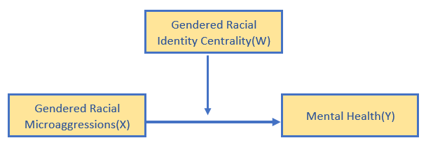
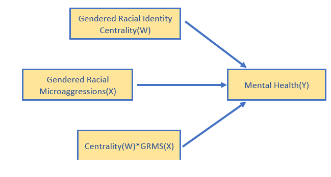
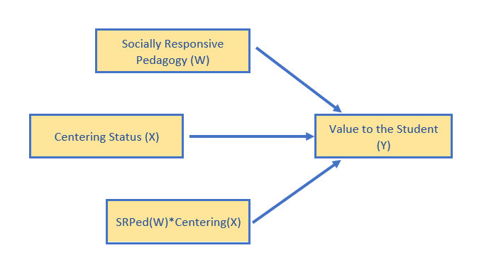

# MODERATION  {-#MOD}

# Simple Moderation in OLS and MLE {#SimpMod}

 [Screencasted Lecture Link](https://youtube.com/playlist?list=PLtz5cFLQl4KO0A8duyLqVouSTYo1o-e9r&si=zq9bfRJxE13RogzG) 


The focus of this lecture is an overview of simple moderation.  Sounds simple?  Wait, there's more!  The focus of this lecture is the transition:

* from null hypothesis significance testing (NHST) to modeling
* from *ordinary least squares* (OLS) to *maximum likelihood estimation* (MLE)

In making the transition we will work a moderation/interaction problem with both *lm()* and *lavvan/sem()* functions. 

## Navigating this Lesson

There is about 1 hour and 10 minutes of lecture.  If you work through the materials with me it would be plan for an additional hour

While the majority of R objects and data you will need are created within the R script that sources the chapter, occasionally there are some that cannot be created from within the R framework. Additionally, sometimes links fail.  All original materials are provided at the [Github site](https://github.com/lhbikos/ReC_MultivModel) that hosts the book. More detailed guidelines for ways to access all these materials are provided in the OER's [introduction](#ReCintro)

### Learning Objectives

Learning objectives from this lecture include the following:

* Distinguish between NHST and model building approaches
* Name the primary characteristics that distinguish ordinary least squares from maximum likelihood approaches to regression.
* Interpret "the usual" things we find in regression:  B/beta weights, R, $R^{2}$.
* Define and interpret simple slopes and probing an interaction, this includes
  - pick-a-point and Johnson-Neyman approaches
  - interpreting interaction plots/figures
* Recognize the path specification in *lavaan*. That is, you should be able to figure out a diagram from the *lavaan* code.  In reverse, you should be able to write (or identify) the proper code in *lavaan*.

### Planning for Practice

As is typical for this OER, the suggestions for homework are graded in complexity.  I recommend you select an option that builds on your confidence but provides a bit of stretch. I also suggest you utilize a dataset that has at least four variables that are suitable for growing into a complex moderation (additive or moderated) or moderated mediation as well as a moderated mediation. This will be easiest if the variables are continuous in nature. In these chapters, I do not describe how to use categorical variables in dependent (e.g., consequent or endogenous) roles.  However, dichotomous and ordered factors are suitable as independent variables and covariates.  

* Rework the problem in the chapter by changing the random seed in the code that simulates the data.  This should provide minor changes to the data, but the results will likely be very similar. 
* There are a number of variables in the dataset.  Swap out one or more variables in the simple moderation and compare your solution to the one in the chapter (and/or one you mimicked in the journal article).
* Conduct a simple moderation with data to which you have access. This could include data you simulate on your own or from a published article.

### Readings & Resources

In preparing this chapter, I drew heavily from the following resource(s). Other resources are cited (when possible, linked) in the text with complete citations in the reference list.

Regarding ordinary least squares (OLS) versus maximum likelihood estimation (MLE), these articles are extremely helpful:

* Cohen, J. (2003). Maximum likelihood estimation. Section 13.2.9 (pp. 498-499).  *Applied multiple regression/correlation analysis for the behavioral sciences* (3rd ed.). Erlbaum Associates.
* Cumming, G. (2014). The New Statistics: Why and How. Psychological Science, 25(1), 7–29. https://doi.org/10.1177/0956797613504966
* Myung, I. J. (2003). Tutorial on maximum likelihood estimation. *Journal of Mathematical Psychology, 47*(1), 90–100. https://doi.org/10.1016/S0022-2496(02)00028-7 (skim for big ideas)
* Rodgers, J. L. (2010). The epistemology of mathematical and statistical modeling: A quiet methodological revolution. *American Psychologist, 65*(1), 1–12. https://doi.org/10.1037/a0018326

Regarding the topic of moderation, I drew heavily from these resources.  

* Hayes, A. F. (2022).  *Introduction to mediation, moderation, and conditional process analysis:  A regression-based approach*. New York, NY: Guilford Press.  
  - **Chapter 7: Fundamentals of moderation analysis**: This chapter focuses on the basics of moderation analysis.  Our goal is to transfer and apply the knowledge to models we run in lavaan.  An excellent review of centering, visualizations, and probing moderation models.
  - **Chapter 8:  Extending the fundamental principles of moderation analysis**:  Hayes addresses common regression concerns such as (a) hierarchical vs. simultaneous entry and (b) comparison of moderated regression with 2x2 factorial ANOVA.
  - **Chapter 9:  Some myths and additional extensions of moderation Aanalysis**. Hayes identifies "truths and myths" about mean centering and standardization. For sure these are important topics and his take on them is clear and compelling.
  - **Appendix A Using PROCESS**:  An essential tool for PROCESS users because, even when we are in the R environment, this is the "idea book." That is, the place where all the path models are presented in figures.

The research vignette for this chapter:

* Lewis, J. A., Williams, M. G., Peppers, E. J., & Gadson, C. A. (2017). Applying intersectionality to explore the relations between gendered racism and health among Black women. *Journal of Counseling Psychology*, *64*(5), 475–486. https://doi-org.ezproxy.spu.edu/10.1037/cou0000231

### Packages

The script below will (a) check to see if the following packages are installed on your computer and, if not (b) install them. 

```r
# will install the package if not already installed
if (!require(apaTables)) {
    install.packages("apaTables")
}
if (!require(lavaan)) {
    install.packages("lavaan")
}
if (!require(tidyverse)) {
    install.packages("tidyverse")
}
if (!require(psych)) {
    install.packages("psych")
}
if (!require(jtools)) {
    install.packages("jtools")
}
if (!require(broom)) {
    install.packages("broom")
}
if (!require(interactions)) {
    install.packages("interactions")
}
if (!require(tidySEM)) {
    install.packages("tidySEM")
}
```

## On *Modeling*:  Introductory Comments on the simultaneously invisible and paradigm-shifting transition we are making

### NHST versus modeling

At least a decade old now, Rogers' [-@rodgers_epistemology_2010] article in the *American Psychologist* is one of my favorites.  In it, he explores the notion of *statistical modeling*.  He begins with criticisms of null hypothesis statistical testing by describing how it has become a awkward and incongruent blend of Fisherian (i.e., R.A. Fisher) and Neyman-Pearson (i.e., Jerzy Neyman and E. S. Pearson) approaches.

**Table 1**

|Contributions of the Fisherian and Neyman-Pearson Approaches to NHST [@rodgers_epistemology_2010]
|:----------------------------------------------------------------------------------------------------------|

|                         
|:----------------------------------------------------:|:--------------------------------------------------:|
|**Fisher**                                            |**Neyman-Pearson**                                  |

|                         
|:-----------------------------------------------------|:---------------------------------------------------|
|Developed NHST to answer scientific questions and evaluate theory. |Sought to draw conclusions in applied settings such as quality control.|
|Took an incremental approach to hypothesis testing that involved replication and (potentially) self-correcting; as such viewed *replication* as a critical element.|Placed emphasis on the importance of each individual decision.|
|Never used the terms, "alternative hypothesis" or "alpha level." Rather, Fisher used the distribution of the null model to examine "whether the data look weird or not."|Designed their approach to detect an "alternative hypothesis."|
|Gave us the null hypothesis and *p* value. |Gave us the alternative hypothesis, alpha level, and power.|

Over time, these overlapping, but inconsistent, approaches became intertwined. Many students of statistics do not recognize the incompatibilities. Undoubtedly, it makes statistics more difficult to learn (and teach). Below are some of the challenges that Rodgers [-@rodgers_epistemology_2010] outlined.

* Rejecting the null does not provide logical or strong support for the alternative
* Failing to rejct the null does not provide logical or strong support for the null.
* NHST is backwards because it evaluates the probability of the data given the hypothesis, rather than the probability of the hypothesis given the data.
* All point-estimate null hypotheses can be rejected if the sample size is large enough.
* Statistical significance does not necessitate practical significance.

Consequently, we have ongoing discussion/debates about power, effect sizes, sample size, Type I and II errors, confidence intervals, fit statistics, and the relations between them.

### Introducing:  *The Model*

Understanding modeling in our *scientist-practitioner* context probably needs to start with understanding the *mathematical model*.  Niemark and Este [-@niemark_stimulus_1967] defined a mathematical model as a set of assumptions together with implications drawn from them by mathematical reasoning. Luce [@luce_four_1995] suggested that mathematical equations capture model-specific features by highlighting some aspects while ignoring others. The use of mathematics helps us uncover the "structure." For example, the *mean* is a mathematical model. *I always like to stop and think about that notion...about what the mean represents and what it doesn't.*  Pearl [-@pearl_causality_2000] defined the model as an idealized representation of reality that highlights some aspects and ignores others by suggesting that a model:

* matches the reality it describes in some important ways.
* is simpler than that reality.

As we transition from the NHST approach to statistical modeling there is [@rodgers_epistemology_2010]:

* decreased emphasis on
  - null hypothesis
  - *p* values
* increased emphasis on
  - model residuals
  - degrees of freedom
  - additional indices of *fit*
  
Further, statistical models [@rodgers_epistemology_2010]:

* are more readily falsifiable
* require greater theoretical precision
* include assumptions that are more readily evaluated
* offer more practical application

Circling back around to Fisher and Neyman-Pearson, Rogers [-@rodgers_epistemology_2010] contended that Fisher's work provided a framework for modeling because of the model process of specification, estimation, and goodness of fit. As we move into more complex modeling, we will spend a great deal of time understanding parameters and their relationship to degrees of freedom.  Fisher viewed degrees of freedom as *statistical currency* that could be used in exchange for the estimation of parameters.

If this topic is exciting to you, let me refer you to Cumming's [@cumming_new_2014] article, "The New Statistics:  Why and How," in the Journal, *Psychological Science"


## OLS to ML for Estimation

### Ordinary least squares (OLS)

Known by a variety of names, the estimation algorithm typically used in regression models (linear, hierarchical, multiple, sequential) is *ordinary least squares* (OLS; also termed least squares criterion, general least squares, etc.). As we move into multivariate (and then psychometrics) we are going to transition our estimation method from OLS to MLE.  Consequently, it is essential to understand some underlying differences [@cohen_applied_2003; @myung_tutorial_2003]

In OLS regression:

* The estimated values of regression coefficients are chosen so that the sum of squared errors is minimized (aka, the *least squares criteria*). Consequently, 
  - the mean of errors is zero, and
  - the errors correlate *zero* with each predictor
* The solution to OLS regression is *analytic*
  - the equations from which the coefficients are created are *known normal equations*. Among other places, you can look them up in CCW&A [@cohen_introduction_1934] Appendix 1)


<!-- -->

### Maximum likelihood estimation (MLE):  A brief orientation

Although I started this chapter with a critique of NHST, Fisher is credited [@myung_tutorial_2003] with the original development of the central principal of *maximum likelihood estimation* which is that the desired probability distribution is the one that makes the observed data *most likely*. As such, the *MLE estimate* is a resulting parameter vector that maximizes the likelihood function. Myung's [-@myung_tutorial_2003] tutorial provides an excellent review. My summary is derived from Dr. Myung article.  A *likelihood* is a measure of how *typical* a person (or sample) is of that population. 

  * When there is one IV the MLE distribution behaves like a chi-square distribution (which also tests observed versus expected data).
  * There is a point in the MLE curve that represents where the maximum likelihood exists that the data is likely given the model.
  * When there are multiple IVs, this simple curve takes the shape of a *k* dimensional geometrical surface.

Extended to regression, we are interested in the *likelihoods* of individuals having particular scores on Y, given values on predictors $x_{1}$ to $x_{k}$ (and the specific values of regression coefficients chosen as the parameter estimates)

* MLE provides *maximum likelihood estimates* of the regression coefficients (and SEs) that is, estimates that make a sample as likely or typical as possible
* *L* is a symbol for *maximum likelihood of a sample*
* The solutions are *iterative* (i.e., identified by trial-and-error; with each trial informed by the prior)
  - a statistical criteria is specified for the coefficients to be chosen
  - different values of coefficients are tried
  - these *iterations* continue until the regression coefficients cease to change by more than a small amount (i.e., the *convergence criteria*)
  - hopefully, a set of coefficients is found that makes the solution as close to the statistical criteria (i.e., maximum likelihood) as possible
* The *optimization algorithm* does not guarantee that a set of parameters will be found; convergence failures may be caused by
  - multicollinearity among predictors
  - a large number of predictors
  - the *local maxima problem*; the optimization algorithm returns sub-optimal parameter values [@myung_tutorial_2003]
* MLE is a *full information model*
  - calculates the estimates of model parameters all at once
* MLE is for large samples
* MLE assumptions include
  - independence of observations
  - multivariate normality of endogenous variables
  - independence of exogeneous variables and disturbances
  - correct specification of the model (MLE is only appropriate for testing theoretically informed models)
  
### OLS and MLE Comparison

In this table we can compare OLS and MLE in a side-by-side manner.
**Table 2**

|Comparing OLS and MLE [@cohen_applied_2003; @myung_tutorial_2003]
|:------------------------------------------------------------------------------------------------------|

|                         
|:---------------:|:----------------------------------------:|:----------------------------------------:|
|**Criterion**    |**Ordinary Least Squares (OSL)**          |**Maximum Likelihood Estimation (MLE)**   |

|                         
|:---------------:|:----------------------------------------:|:----------------------------------------:|
|Parameter values chosen to...|minimize the distance between the predictions from regression line and the observations; considered to be those that are *most accurate*|be those that are *most likely* to have produced the data|
|Parameter values are obtained by|equations that are known and linear (you can find them in the "back of the book")|a non-linear optimization algorithm|
|Preferred when...|sample size is small|sample size is large, for complex models, non-linear models, and when OLS and MLE results differ|
|In R...|the *lm()* function in base R|*lavaan* and other packages*; specifying the FIML option allows for missing data (without imputation)|

### Hayes and PROCESS (aka conditional process analysis)

In the early 2000s, the bias-corrected, bootstrapped, confidence interval (CI) was identifed as a more powerful approach to assessing indirect effects than the classic Sobel test. Because programs did not produce them,  no one was using them. Preacher, Edwards, Lambert, Hayes, and colleagues created Excel worksheets that would calculate these (they were so painful).  Hayes turned this process into a *series* of macros to do a variety of things for SPSS and other programs.  Because of his clear, instructional, text, PROCESS is popular. In 2021, Hayes released the PROCESS macro for R. It can be downloaded at the [ProcessMacro website](https://www.processmacro.org/download.html). The 2022 of Hayes' textbook now includes instruction for using the Process Macro for R. Although PROCESS produces bias-corrected, bootstrapped confidence intervals, for models with indirect effects, PROCESS utilizes OLS as the estimator. Additionally, the Process Macro for R does not work like a typical R package. Further, at my latest review, I could not determine how to create figures (in R) that would represent the results. Thus, I am continuing to teach this topic with *lavaan*.

Although most regression models can be completed with the *lm()* function in base R, it can be instructive to run a handful of these familiar models with *lavaan* (or even PROCESS) as a precursor to more complicated models.

## Introducing the *lavaan* package

In the regression classes (as well as in research designs that are cross-sectional, non-linear, and can be parsimoniously and adequately measured with OLS regression) we typically use the base R function, *lm()* ("linear model") which relies on an OLS algorithm. You can learn about it with this simple code:


```r
#?lm
```

Rosseel's [-@rosseel_lavaan_2020] *lavaan* package was developed for SEM, but is readily adaptable to most multiple regression models. Which do we use and when?

* For relatively simple models that involve only predictors, covariates, and moderators, *lm()* is adequate.
* Models that involve mediation need to use *lavaan*
* SEM/CFA needs *lavaan*
* If your sample size is small, *but* you are planning a mediation, it gets tricky (try to increase your sample size) because MLE estimators rely on large sample sizes (how big?  hard to say).


### The FIML magic for which we have been waiting

There are different types of maximum likelihood.  In this chapter we'll utilize *full information maximum likelihood* (FIML).  FIML is one of the most practical missing data estimation approaches around and is especially used in SEM and CFA.  When data are thought to be MAR (missing at random) or MCAR (missing completely at random), it has been shown to produce unbiased parameter estimates and standard errors.

The FIML approach works by estimating a likelihood function for each individual based on the variables that are present so that all available data are used.  Model fit is calculated from (or informed by) the fit functions for all individual cases. Hence, "FIML" is *full information* maximum likelihood. 

When I am able to use *lavaan*, my approach is to use Parent's AIA (available information analysis, -@parent_handling_2013) approach to scoring data, then specify a FIML approach (i.e., adding *missing = 'fiml'*) in my lavaan code. Even though the text-book examples we work have complete data, I will try to include this code so that it will be readily available for you, should you use the as templates for your own data.

In this portion of the ReCentering Psych Stats series we are headed toward more complex models that include both mediation and moderation. Hayes [@hayes_introduction_2018] would call this "conditional process analysis."  Others would simply refer to it as "path analysis."  Although all these terms are sometimes overlapping, *path analysis* is a distinction from *structural equation modeling* (SEM) where latent variables are composed of the observed variables. Let's take a look at some of the nuances of the whole SEM world and how it relates to PROCESS.

**SEM** is broad term (that could include CFA and path analysis) but is mostly reserved for models with some type of latent variable (i.e., some might exclude path analysis from its definitions).  SEM typically uses some form of MLE (not ordinary least squares).

*Latent variables* (circles in the model, below) are those that are "created" in the analytic process but will never appear as a column in your dataset. It may be easiest to think of a latent variable as a scale score -- where you sum (or average) the indicator item values to get the score (except we don't do that).  Rather, the LV is "indicated" by variance the indicator/observed/manifest variables share with each other.

The image below is of a simple mediation model but the variables in the model are latent, and indicated by each of the 3 observed/manifest variables.  PROCESS (in SPSS) could not assess this model because PROCESS uses ordinary least squares regression and SEM will use a maximum likelihood estimator.


**Confirmatory factor analysis** (CFA) is what we will do (or have done) in psychometrics. CFA is used to evaluate the structural validity of a scale or measure.  In CFA, first-order factors represent subscales and a second-order factor (not required) might provide support for a total scale score.  For example, in the above figure, the three squares represent the observed (or manifest) items to which a person respond.  In CFA, we evaluate their adequacy to represent the latent variable (circle) construct. It's a little more complicated than this, but this will get you started.  Mediation/indirect effects are not assessed in a pure CFA.

**Path analysis** is a form of SEM, but without latent variables.  That is, all the variables in the model are directly observed.  They are represented by squares/rectangles and each has a corresponding column in a dataset.  PROCESS in SPSS is entirely path analysis.


**Hybrid models** are a form of SEM that include observed/manifest variables as predictors along with other latent variables.  In the diagram below, you see tiny little measurement models (3 indicators that "create" or "inform" an LV, think baby CFA) and one predictor that is manifest.  An example might be a categorical predictor (e.g., treatment, control).


## Picking up with Moderation

**Moderation**:  The effect of X (IV) on some variable Y (DV) is moderated if its size, sign, or strength depends on or can be predicted by W (moderator). In that case, W is said to be a *moderator* of X's effect on Y.  Or, that W and X *interact* in their influence on Y.

Identifying a moderator of an effect helps establish the *boundary conditions* of that effect or the circumstances, stimuli, or type of people for which the effect is large versus small, present versus absent, positive versus negative, and so forth.

**Conditional vs Unconditional Effects**:  Consider the following two equations:

$$\hat{Y} = i_{y}+b_{1}X + b_{2}W + e_{y}$$

and 

$$\hat{Y} = i_{y}+b_{1}X + b_{2}W + b_{3}XW+ e_{y}$$

The first equation constrains X's effect to be unconditional on W, meaning that it is invariant across all values of W.  By introducting the interaction term ($b_{3}XW$), we can evaluate a model where X's effect can be dependent on W.  That is, for different values of W, X's effect on Y is different.  The resulting equation (#2) is the *simple linear moderation model.*  In it, X's effect on Y is *conditional*.


## Workflow for a Simple Moderation

Below is a workflow comparing the approaches to analyzing a regression model (moderators only) with OLS and MLE. Of course you would precede both options with a thorough scrubbing, scoring, and data diagnostics. Please refer to the earlier lessons for workflows for those processes.


The Bonus Track at the end of the chapter includes script templates with just X and Y variables.


### Research Vignette

The research vignette comes from the Lewis, Williams, Peppers, and Gadson's [-@lewis_applying_2017] study titled, "Applying Intersectionality to Explore the Relations Between Gendered Racism and Health Among Black Women."  The study was published in the Journal of Counseling Psychology. Participants were 231 Black women who completed an online survey. 

Variables used in the study included:

* **GRMS**:  Gendered Racial Microaggressions Scale [@lewis_construction_2015] is a 26-item scale that assesses the frequency of nonverbal, verbal, and behavioral negative racial and gender slights experienced by Black women. Scaling is along six points ranging from 0 (*never*) to 5 (*once a week or more*).  Higher scores indicate a greater frequency of gendered racial microaggressions. An example item is, "Someone has tried to 'put me in my place.'"

* **MntlHlth** and **PhysHlth**: Short Form Health Survey - Version 2 [@ware_comparison_1995] is a 12-item scale used to report self-reported mental (six items) and physical health (six items). Although the article did not specify, when this scale is used in other contexts [e.g., @kim_racial_2017], a 6-point scale has been reported. Higher scores indicate higher mental health (e.g., little or no psychological distress) and physical health (e.g., little or no reported symptoms in physical functioning). An example of an item assessing mental health was, "How much of the time during the last 4 weeks have you felt calm and peaceful?"; an example of a physical health item was, "During the past 4 weeks, how much did pain interfere with your normal work?"

* **Sprtlty**, **SocSup**, **Engmgt**, and **DisEngmt** are four subscales from the Brief Coping with Problems Experienced Inventory [@carver_you_1997]. The 28 items on this scale are presented on a 4-point scale ranging from 1 (*I usually do not do this at all*) to 4(*I usually do this a lot*).  Higher scores indicate a respondents' tendency to engage in a particular strategy.  Instructions were modified to ask how the female participants responded to recent experiences of racism and sexism as Black women. The four subscales included spirituality (religion, acceptance, planning), interconnectedness/social support (vent emotions, emotional support,instrumental social support), problem-oriented/engagement coping (active coping, humor, positive reinterpretation/positive reframing), and disengagement coping (behavioral disengagement, substance abuse, denial, self-blame, self-distraction).

* **GRIcntlty**:  The Multidimensional Inventory of Black Identity Centrality subscale [@sellers_multidimensional_nodate] was modified to measure the intersection of racial and gender identity centrality.  The scale included 10 items scaled from 1 (*strongly disagree*) to 7 (*strongly agree*). An example item was, "Being a *Black woman* is important to my self-image."  Higher scores indicated higher levels of gendered racial identity centrality.

#### Data Simulation

The *lavaan::simulateData* function was used. If you have taken psychometrics, you may recognize the code as one that creates latent variables form item-level data. In trying to be as authentic as possible, we retrieved factor loadings from psychometrically oriented articles that evaluated the measures [@nadal_racial_2011; @veit_structure_1983]. For all others we specified a factor loading of 0.80. We then approximated the *measurement model* by specifying the correlations between the latent variable. We sourced these from the correlation matrix from the research vignette  [@lewis_applying_2017]. The process created data with multiple decimals and values that exceeded the boundaries of the variables. For example, in all scales there were negative values. Therefore, the final element of the simulation was a linear transformation that rescaled the variables back to the range described in the journal article and rounding the values to integer (i.e., with no decimal places).


```r
#Entering the intercorrelations, means, and standard deviations from the journal article

Lewis_generating_model <- '
        ##measurement model
        GRMS  =~ .69*Ob1 + .69*Ob2 + .60*Ob3 + .59*Ob4 + .55*Ob5 + .55*Ob6 + .54*Ob7 + .50*Ob8 + .41*Ob9 + .41*Ob10 + .93*Ma1 + .81*Ma2 + .69*Ma3 + .67*Ma4 + .61*Ma5 + .58*Ma6 + .54*Ma7 + .59*St1 + .55*St2 + .54*St3 + .54*St4 + .51*St5 + .70*An1 + .69*An2 + .68*An3
        MntlHlth  =~ .8*MH1 + .8*MH2 + .8*MH3 + .8*MH4 + .8*MH5 + .8*MH6
        PhysHlth  =~ .8*PhH1 + .8*PhH2 + .8*PhH3 + .8*PhH4 + .8*PhH5 + .8*PhH6
        Spirituality  =~ .8*Spirit1 + .8*Spirit2
        SocSupport  =~ .8*SocS1 + .8*SocS2
        Engagement  =~ .8*Eng1 + .8*Eng2
        Disengagement  =~  .8*dEng1 + .8*dEng2
        GRIC  =~ .8*Cntrlty1 + .8*Cntrlty2 + .8*Cntrlty3 + .8*Cntrlty4 + .8*Cntrlty5 + .8*Cntrlty6 + .8*Cntrlty7 + .8*Cntrlty8 + .8*Cntrlty9 + .8*Cntrlty10
   
        # Means
         GRMS ~ 1.99*1
         Spirituality ~2.82*1
         SocSupport ~ 2.48*1
         Engagement ~ 2.32*1
         Disengagement ~ 1.75*1
         GRIC ~ 5.71*1
         MntlHlth ~3.56*1 #Lewis et al used sums instead of means, I recast as means to facilitate simulation
         PhysHlth ~ 3.51*1 #Lewis et al used sums instead of means, I recast as means to facilitate simulation
         
        # Correlations (ha!)
         GRMS ~ 0.20*Spirituality
         GRMS ~ 0.28*SocSupport
         GRMS ~ 0.30*Engagement
         GRMS ~ 0.41*Disengagement
         GRMS ~ 0.19*GRIC
         GRMS ~ -0.32*MntlHlth
         GRMS ~ -0.18*PhysHlth
         
         Spirituality ~ 0.49*SocSupport
         Spirituality ~ 0.57*Engagement
         Spirituality ~ 0.22*Disengagement
         Spirituality ~ 0.12*GRIC
         Spirituality ~ -0.06*MntlHlth
         Spirituality ~ -0.13*PhysHlth
         
         SocSupport ~ 0.46*Engagement
         SocSupport ~ 0.26*Disengagement
         SocSupport ~ 0.38*GRIC
         SocSupport ~ -0.18*MntlHlth
         SocSupport ~ -0.08*PhysHlth
         
         Engagement ~ 0.37*Disengagement
         Engagement ~ 0.08*GRIC
         Engagement ~ -0.14*MntlHlth
         Engagement ~ -0.06*PhysHlth
         
         Disengagement ~ 0.05*GRIC
         Disengagement ~ -0.54*MntlHlth
         Disengagement ~ -0.28*PhysHlth
         
         GRIC ~ -0.10*MntlHlth
         GRIC ~ 0.14*PhysHlth
     
         MntlHlth ~ 0.47*PhysHlth         
        '

set.seed(230925)
dfLewis <- lavaan::simulateData(model = Lewis_generating_model,
                              model.type = "sem",
                              meanstructure = T,
                              sample.nobs=231,
                              standardized=FALSE)

#used to retrieve column indices used in the rescaling script below
#col_index <- as.data.frame(colnames(dfLewis))

for(i in 1:ncol(dfLewis)){  # for loop to go through each column of the dataframe 
  if(i >= 1 & i <= 25){   # apply only to GRMS variables
    dfLewis[,i] <- scales::rescale(dfLewis[,i], c(0, 5))
  }
  if(i >= 26 & i <= 37){   # apply only to mental and physical health variables 
    dfLewis[,i] <- scales::rescale(dfLewis[,i], c(0, 6))
  }
  if(i >= 38 & i <= 45){   # apply only to coping variables
    dfLewis[,i] <- scales::rescale(dfLewis[,i], c(1, 4))
  }
  if(i >= 46 & i <= 55){   # apply only to GRIC variables
    dfLewis[,i] <- scales::rescale(dfLewis[,i], c(1, 7))
  }
}

#rounding to integers so that the data resembles that which was collected
library(tidyverse)
dfLewis <- dfLewis %>% round(0) 

#quick check of my work
#psych::describe(dfLewis) 
```
The script below allows you to store the simulated data as a file on your computer. This is optional -- the entire lesson can be worked with the simulated data.

If you prefer the .rds format, use this script (remove the hashtags). The .rds format has the advantage of preserving any formatting of variables. A disadvantage is that you cannot open these files outside of the R environment.

Script to save the data to your computer as an .rds file.


```r
# saveRDS(dfLewis, 'dfLewis.rds')
```

Once saved, you could clean your environment and bring the data back in from its .csv format.

```r
# dfLewis<- readRDS('dfLewis.rds')
```

If you prefer the .csv format (think "Excel lite") use this script (remove the hashtags). An advantage of the .csv format is that you can open the data outside of the R environment. A disadvantage is that it may not retain any formatting of variables

Script to save the data to your computer as a .csv file.


```r
# write.table(dfLewis, file = 'dfLewis.csv', sep = ',',
# col.names=TRUE, row.names=FALSE)
```

Once saved, you could clean your environment and bring the data back in from its .csv format.

```r
# dfLewis<- read.csv ('dfLewis.csv', header = TRUE)
```


### Scrubbing, Scoring, and Data Diagnostics

Because the focus of this lesson is on moderation, we have used simulated data (which serves to avoid problems like missingness and non-normal distributions). If this were real, raw, data, it would be important to [scrub](https://lhbikos.github.io/ReC_MultivModel/scrub.html), [score](https://lhbikos.github.io/ReC_MultivModel/score.html), and conduct [data diagnostics](https://lhbikos.github.io/ReC_MultivModel/DataDx.html) to evaluate the suitability of the data for the proposes anlayses.

Because we are working with item level data we do need to score the scales used in the researcher's model. Because we are using simulated data and the authors already reverse coded any such items, we will omit that step.

As described in the [Scoring](https://lhbikos.github.io/ReC_MultivModel/score.html) chapter, we  calculate mean scores of these variables by first creating concatenated lists of variable names. Next we apply the *sjstats::mean_n* function to obtain mean scores when a given percentage (we'll specify 80%) of variables are non-missing. Functionally, this would require the two-item variables (e.g., engagement coping and disengagement coping) to have non-missingness. We simulated a set of data that does not have missingness, none-the-less, this specification is useful in real-world settings.

Note that I am only scoring the variables used in the models demonstrated in this lesson. The remaining variables are available as practice options.


```r
GRMS_vars <- c("Ob1", "Ob2", "Ob3", "Ob4", "Ob5", "Ob6", "Ob7", "Ob8",
    "Ob9", "Ob10", "Ma1", "Ma2", "Ma3", "Ma4", "Ma5", "Ma6", "Ma7", "St1",
    "St2", "St3", "St4", "St5", "An1", "An2", "An3")
Eng_vars <- c("Eng1", "Eng2")
dEng_vars <- c("dEng1", "dEng2")
MntlHlth_vars <- c("MH1", "MH2", "MH3", "MH4", "MH5", "MH6")
Cntrlty_vars <- c("Cntrlty1", "Cntrlty2", "Cntrlty3", "Cntrlty4", "Cntrlty5",
    "Cntrlty6", "Cntrlty7", "Cntrlty8", "Cntrlty9", "Cntrlty10")

dfLewis$GRMS <- sjstats::mean_n(dfLewis[, GRMS_vars], 0.8)
dfLewis$Engmt <- sjstats::mean_n(dfLewis[, Eng_vars], 0.8)
dfLewis$DisEngmt <- sjstats::mean_n(dfLewis[, dEng_vars], 0.8)
dfLewis$MntlHlth <- sjstats::mean_n(dfLewis[, MntlHlth_vars], 0.8)
dfLewis$Centrality <- sjstats::mean_n(dfLewis[, Cntrlty_vars], 0.8)

# If the scoring code above does not work for you, try the format
# below which involves inserting to periods in front of the variable
# list. One example is provided. dfLewis$GRMS <-
# sjstats::mean_n(dfLewis[, ..GRMS_vars], 0.80)
```

Now that we have scored our data, let's trim the variables to just those we need.

```r
Lewis_df <- dplyr::select(dfLewis, GRMS, Centrality, MntlHlth)
```

Let's check a table of means, standard deviations, and correlations to see if they align with the published article.


```r
Lewis_table <- apaTables::apa.cor.table(Lewis_df, table.number = 1, show.sig.stars = TRUE,
    landscape = TRUE, filename = "Lewis_Corr.doc")
print(Lewis_table)
```

```


Table 1 

Means, standard deviations, and correlations with confidence intervals
 

  Variable      M    SD   1            2          
  1. GRMS       2.56 0.72                         
                                                  
  2. Centrality 3.94 0.76 .24**                   
                          [.11, .36]              
                                                  
  3. MntlHlth   3.16 0.81 -.56**       -.09       
                          [-.64, -.47] [-.21, .04]
                                                  

Note. M and SD are used to represent mean and standard deviation, respectively.
Values in square brackets indicate the 95% confidence interval.
The confidence interval is a plausible range of population correlations 
that could have caused the sample correlation (Cumming, 2014).
 * indicates p < .05. ** indicates p < .01.
 
```

The *psych::pairs.panels* function provides another view.


```r
library(psych)
psych::pairs.panels(Lewis_df)
```

<!-- -->

While they are not exact, they approximate the magnitude and patterns in the correlation matrix in the article [@lewis_applying_2017].


The Lewis et al. [-@lewis_applying_2017] article included a moderated mediation. Within this larger model were two moderated paths. As we work up to analyzing that moderated mediation, we will work a simple moderation predicting mental health from gendered racial microaggressions, moderated by gendered racial identity centrality. 






Here is the formulaic rendering:
$$Y = i_{Y}+ b_{1}X+ b_{2}W + b_{3}XW +e_{Y}$$

## Working the Simple Moderation with OLS and MLE

### OLS with *lm()*

In this demonstration we will use the *lm()* function in base R to evaluate gendered racial identity centrality (Centrality) as a moderator to the relationship between gendered racial microaggressions (GRMS) on mental health (MntlHlth). Ordinary least squares is the estimator used in *lm()*. We will probe the moderating effect with both pick-a-point and Johnson-Neyman approaches.

Let's specify this simple moderation model with base R's *lm()* function. We'll use the *jtools::summ* function to produce a journal-friendly table and *interactions::interaction_plot* for information rich figures.


```r
LewisSimpMod <- lm(MntlHlth ~ GRMS * Centrality, data = Lewis_df)
# the base R output if you prefer this view summary(LewisSimpMod)
```
**Table 3**

```r
LewisSimpMod_summ <- jtools::summ(LewisSimpMod, digits = 3)
LewisSimpMod_summ
```

<table class="table table-striped table-hover table-condensed table-responsive" style="width: auto !important; margin-left: auto; margin-right: auto;">
<tbody>
  <tr>
   <td style="text-align:left;font-weight: bold;"> Observations </td>
   <td style="text-align:right;"> 231 </td>
  </tr>
  <tr>
   <td style="text-align:left;font-weight: bold;"> Dependent variable </td>
   <td style="text-align:right;"> MntlHlth </td>
  </tr>
  <tr>
   <td style="text-align:left;font-weight: bold;"> Type </td>
   <td style="text-align:right;"> OLS linear regression </td>
  </tr>
</tbody>
</table> <table class="table table-striped table-hover table-condensed table-responsive" style="width: auto !important; margin-left: auto; margin-right: auto;">
<tbody>
  <tr>
   <td style="text-align:left;font-weight: bold;"> F(3,227) </td>
   <td style="text-align:right;"> 37.386 </td>
  </tr>
  <tr>
   <td style="text-align:left;font-weight: bold;"> R² </td>
   <td style="text-align:right;"> 0.331 </td>
  </tr>
  <tr>
   <td style="text-align:left;font-weight: bold;"> Adj. R² </td>
   <td style="text-align:right;"> 0.322 </td>
  </tr>
</tbody>
</table> <table class="table table-striped table-hover table-condensed table-responsive" style="width: auto !important; margin-left: auto; margin-right: auto;border-bottom: 0;">
 <thead>
  <tr>
   <th style="text-align:left;">   </th>
   <th style="text-align:right;"> Est. </th>
   <th style="text-align:right;"> S.E. </th>
   <th style="text-align:right;"> t val. </th>
   <th style="text-align:right;"> p </th>
  </tr>
 </thead>
<tbody>
  <tr>
   <td style="text-align:left;font-weight: bold;"> (Intercept) </td>
   <td style="text-align:right;"> 6.138 </td>
   <td style="text-align:right;"> 0.767 </td>
   <td style="text-align:right;"> 8.007 </td>
   <td style="text-align:right;"> 0.000 </td>
  </tr>
  <tr>
   <td style="text-align:left;font-weight: bold;"> GRMS </td>
   <td style="text-align:right;"> -1.248 </td>
   <td style="text-align:right;"> 0.290 </td>
   <td style="text-align:right;"> -4.299 </td>
   <td style="text-align:right;"> 0.000 </td>
  </tr>
  <tr>
   <td style="text-align:left;font-weight: bold;"> Centrality </td>
   <td style="text-align:right;"> -0.351 </td>
   <td style="text-align:right;"> 0.199 </td>
   <td style="text-align:right;"> -1.764 </td>
   <td style="text-align:right;"> 0.079 </td>
  </tr>
  <tr>
   <td style="text-align:left;font-weight: bold;"> GRMS:Centrality </td>
   <td style="text-align:right;"> 0.157 </td>
   <td style="text-align:right;"> 0.073 </td>
   <td style="text-align:right;"> 2.132 </td>
   <td style="text-align:right;"> 0.034 </td>
  </tr>
</tbody>
<tfoot><tr><td style="padding: 0; " colspan="100%">
<sup></sup> Standard errors: OLS</td></tr></tfoot>
</table>
The following code can export the OLS regression results into a .csv. This can be opened with Excel for use in table-making. Note that this makes use of the *broom* package.

```r
LewSimpModOLS <- as.data.frame(broom::tidy(LewisSimpMod))
write.csv(LewSimpModOLS, "LewSimpModOLS.csv")
```

Looking at these results we can see that the predictors account for about 33% of variance in anxiety. Further, there is a statistically significant interaction of GRMS and Centrality on MntlHlth  The *interaction_plot()* function from the package, *interactions* can illustrate these effects.  In the case of interactions/moderations, I like to run them "both ways" to see which makes more sense.


```r
interactions::interact_plot(LewisSimpMod, pred = GRMS, modx = Centrality) +
    ylim(1, 6)
```

<!-- -->

```r
interactions::interact_plot(LewisSimpMod, pred = Centrality, modx = GRMS) +
    ylim(1, 6)
```

<!-- -->

The first figure (where Centrality is the moderator) illustrates that the slope representing the effect of gendered racial microaggressions on mental health is steepest for those with the lowest levels of gendered racial identity centrality. In fact, those with the lowest levels of gendered racial identity centrality have the highest mental health (when gendered racial microaggressions are low) and the lowest mental health (when gendered racial microaggressions are high). In contrast, the slope is less steep for those with the highest levels of gendered racial identity centrality. 
 
The second figure represents the same data, but positions gendered racial microaggressions as the moderator. Here we really see the effect of gendered racial micoaggresions as both a main effect (i.e., alone, it had a statistically significant effect on mental health) and as it interacts with gendered racial identity centrality. Those who experience the lowest levels of gendered racial microaggressions have the highest levels of mental health and there  *appears to be* (we'll need to check the simple slopes to be certain) a negative slope such that mental health scores are lower as centrality scores increase. In contrast, those reporting the highest levels of microaggresions have the highest mental health scores. However, there is a positive slope such that mental health scores increase (again we'll need to check the simple slopes to see if this is a statistically significant increase) with centrality.  

Next, let's probe the interaction with simple slopes.  With these additional inferential tests we can see where in the distribution of the moderator, X has an effect on Y that is different from zero (and where it does not). There are two common approaches.

The Johnson-Neyman is a *floodlight* approach and provides an indication of the places in the distribution of W (moderator) that X has an effect on Y that is different than zero. The *analysis of simple slopes* or a *spotlight* approach, probes the distribution at specific values (often the *M* +/- 1*SD*).  

This first analysis corresponds with the first plot, where centrality is the moderator. 


```r
interactions::sim_slopes(LewisSimpMod, pred = GRMS, modx = Centrality)
```

```
JOHNSON-NEYMAN INTERVAL 

When Centrality is OUTSIDE the interval [5.92, 58.37], the slope of GRMS is
p < .05.

Note: The range of observed values of Centrality is [1.90, 6.00]

SIMPLE SLOPES ANALYSIS 

Slope of GRMS when Centrality = 3.182522 (- 1 SD): 

   Est.   S.E.   t val.      p
------- ------ -------- ------
  -0.75   0.08    -9.36   0.00

Slope of GRMS when Centrality = 3.938095 (Mean): 

   Est.   S.E.   t val.      p
------- ------ -------- ------
  -0.63   0.06   -10.01   0.00

Slope of GRMS when Centrality = 4.693668 (+ 1 SD): 

   Est.   S.E.   t val.      p
------- ------ -------- ------
  -0.51   0.09    -5.85   0.00
```
The Johnson-Neyman in this case is a bit tricky to interpret. It tells us that the slope representing the effect of GRMS on mental health is statistically significant when the value of centrality is *outside* the values of 5.92 to 58.37. Curiously, our centrality values ranged from 1 to 6. Thus, in our sample, there would be a statistically significant effect of GRMS on mental health at nearly all levels of centrality. 

I find the simple slopes analysis to be easier to read. Here, we are presented the regression coefficient representing the effect of GRMS on mental  health at three levels of centrality (i.e., mean and +/1 1SD). With all *p* values less than 0.05, GRMS has a statistically significant effect on mental health irrespective of the level of gendered racial identity centrality.

If we switch the roles of the independent and moderator values, we can see the same data, differently.


```r
interactions::sim_slopes(LewisSimpMod, pred = Centrality, modx = GRMS)
```

```
JOHNSON-NEYMAN INTERVAL 

When GRMS is OUTSIDE the interval [-2.70, 3.17], the slope of Centrality is
p < .05.

Note: The range of observed values of GRMS is [0.32, 4.24]

SIMPLE SLOPES ANALYSIS 

Slope of Centrality when GRMS = 1.835658 (- 1 SD): 

   Est.   S.E.   t val.      p
------- ------ -------- ------
  -0.06   0.08    -0.78   0.44

Slope of Centrality when GRMS = 2.557056 (Mean): 

  Est.   S.E.   t val.      p
------ ------ -------- ------
  0.05   0.06     0.83   0.41

Slope of Centrality when GRMS = 3.278455 (+ 1 SD): 

  Est.   S.E.   t val.      p
------ ------ -------- ------
  0.16   0.08     2.06   0.04
```
Again, the Johnson-Neyman can be a little tricky to interpret. Our GRMS scores could range from 0 to 5. Keeping this range in mind, we know that centrality has a statistically significant effect on mental health when centrality scores are 3.17 or greater.

This is consistent with the simple slopes results where the statistically significant effect of centrality on mental health is observed when GRMS levels are one standard deviation above the mean.

To write up these results you would report the follow-up analysis that is consistend with how you stated the hypothesis. In this case we evaluated "the moderating effect of gendered racial identity centrality on the relationship between gendered racial microaggressions on mental health." Correspondingly, we would show the first figure and the first simple slopes analyses.

#### An APA Style Write-up of OLS results

**Method/Analytic Strategy**

Data were analyzed with an ordinary least squares approach with the base R (v. 4.3.1) function, *lm()*. We specified a model predicting mental health (MntlHlth) from the interacting effects of gendered racial microaggressions (GRMS) and gendered racial identity centrality (Centrality).

**Results**

**Preliminary Analyses**

*  Missing data analyses and managing missing data
*  Bivariate correlations, means, SDs
*  Distributional characteristics, assumptions, etc.
*  Address limitations and concerns

**Primary Analyses**
A multiple regression analysis was conducted to predict mental health from gendered racial microaggressions, moderated by gendered racial identity centrality. Results supported a statistically significant interaction effect that accounted for 33% of the variance $(B = 0.157, SE = 0.073, t =0.034)$. Probing the interaction effect with Johnson-Neyman and analysis of simple slopes approaches indicated that the relationship between gendered racial microaggressions and mental health is statistically significant throughout the range of gendered racial identity centrality. Results are listed in Table 1 and illustrated in Figure 1.  

### MLE with *lavaan::sem()*

Let's specify this same problem with a path analysis (i.e., using manifest or observed variables) in *lavaan*. There are a few things to note:

* The code below "draws our model."  It opens and close with ' marks
* "Labels" (e.g., b1, b2) are useful for identifying the paths. 
  - Later, in SEM/CFA (latent variable modeling) we can use them to "fix and free" constraints; the asterisk makes them look like interactions, but they are not
* Interactions are specified with a colon
* We can use hashtags internal to the code to makes notes to ourselves (or, in the case where your script will be available in an open science respository, inform others of your thought process)
* Following the specification of the model, we use the lavaan function *sem()* to conduct the estimation 
  - adding *missing = 'fiml'* is the magic we have been waiting for with regard to missing data
  - bootstraping is an MLE tool that gives us greater power (more later in mediation)
  - the *summary()* and *parameterEstimates()* functions get us the desired output
  


```r
LewisSimpModMLE <- "
    MntlHlth ~ b1*GRMS + b2*Centrality + b3*GRMS:Centrality
    
    #intercept (constant) of MntlHlth
    MntlHlth ~ MntlHlth.mean*1
    #mean of W (Centrality, in this case) for use in simple slopes
    Centrality ~ Centrality.mean*1
    #variance of W (Centrality, in this case) for use in simple slopes
    Centrality ~~Centrality.var*Centrality

    #simple slopes
    SD.below := b1 + b3*(Centrality.mean - sqrt(Centrality.var))
    mean := b1 + b3*(Centrality.mean)
    SD.above := b1 + b3*(Centrality.mean + sqrt(Centrality.var))
"
set.seed(230925)  #needed for reproducibility especially when asking for bootstrapped confidence intervals
LewMLEfit <- lavaan::sem(LewisSimpModMLE, data = Lewis_df, missing = "fiml",
    se = "bootstrap", bootstrap = 1000)
```

```
Warning in lav_partable_vnames(FLAT, "ov.x", warn = TRUE): lavaan WARNING:
    model syntax contains variance/covariance/intercept formulas
    involving (an) exogenous variable(s): [Centrality]; These
    variables will now be treated as random introducing additional
    free parameters. If you wish to treat those variables as fixed,
    remove these formulas from the model syntax. Otherwise, consider
    adding the fixed.x = FALSE option.
```

```r
LewisMLEsummary <- lavaan::summary(LewMLEfit, standardized = TRUE, fit = TRUE,
    ci = TRUE)
LewisMLEParamEsts <- lavaan::parameterEstimates(LewMLEfit, boot.ci.type = "bca.simple",
    standardized = TRUE)
LewisMLEsummary
```

```
lavaan 0.6.16 ended normally after 14 iterations

  Estimator                                         ML
  Optimization method                           NLMINB
  Number of model parameters                         7

  Number of observations                           231
  Number of missing patterns                         1

Model Test User Model:
                                                      
  Test statistic                               567.225
  Degrees of freedom                                 2
  P-value (Chi-square)                           0.000

Model Test Baseline Model:

  Test statistic                               659.975
  Degrees of freedom                                 5
  P-value                                        0.000

User Model versus Baseline Model:

  Comparative Fit Index (CFI)                    0.137
  Tucker-Lewis Index (TLI)                      -1.157
                                                      
  Robust Comparative Fit Index (CFI)             0.137
  Robust Tucker-Lewis Index (TLI)               -1.157

Loglikelihood and Information Criteria:

  Loglikelihood user model (H0)               -494.947
  Loglikelihood unrestricted model (H1)       -211.334
                                                      
  Akaike (AIC)                                1003.894
  Bayesian (BIC)                              1027.991
  Sample-size adjusted Bayesian (SABIC)       1005.805

Root Mean Square Error of Approximation:

  RMSEA                                          1.106
  90 Percent confidence interval - lower         1.031
  90 Percent confidence interval - upper         1.184
  P-value H_0: RMSEA <= 0.050                    0.000
  P-value H_0: RMSEA >= 0.080                    1.000
                                                      
  Robust RMSEA                                   1.106
  90 Percent confidence interval - lower         1.031
  90 Percent confidence interval - upper         1.184
  P-value H_0: Robust RMSEA <= 0.050             0.000
  P-value H_0: Robust RMSEA >= 0.080             1.000

Standardized Root Mean Square Residual:

  SRMR                                           0.218

Parameter Estimates:

  Standard errors                            Bootstrap
  Number of requested bootstrap draws             1000
  Number of successful bootstrap draws            1000

Regressions:
                   Estimate  Std.Err  z-value  P(>|z|) ci.lower ci.upper
  MntlHlth ~                                                            
    GRMS      (b1)   -1.248    0.308   -4.052    0.000   -1.820   -0.550
    Centralty (b2)   -0.351    0.205   -1.712    0.087   -0.713    0.097
    GRMS:Cntr (b3)    0.157    0.079    1.984    0.047   -0.016    0.304
   Std.lv  Std.all
                  
   -1.248   -1.033
   -0.351   -0.304
    0.157    0.684

Intercepts:
                   Estimate  Std.Err  z-value  P(>|z|) ci.lower ci.upper
   .MntlHlt (MnH.)    6.138    0.783    7.840    0.000    4.285    7.481
    Cntrlty (Cnt.)    3.938    0.049   79.569    0.000    3.836    4.035
   Std.lv  Std.all
    6.138    7.054
    3.938    5.223

Variances:
                   Estimate  Std.Err  z-value  P(>|z|) ci.lower ci.upper
    Cntrlty (Cnt.)    0.568    0.054   10.608    0.000    0.464    0.675
   .MntlHlt           0.438    0.040   10.834    0.000    0.357    0.510
   Std.lv  Std.all
    0.568    1.000
    0.438    0.578

Defined Parameters:
                   Estimate  Std.Err  z-value  P(>|z|) ci.lower ci.upper
    SD.below         -0.750    0.078   -9.605    0.000   -0.884   -0.570
    mean             -0.632    0.059  -10.760    0.000   -0.742   -0.511
    SD.above         -0.514    0.088   -5.812    0.000   -0.688   -0.341
   Std.lv  Std.all
   -0.750    1.855
   -0.632    2.539
   -0.514    3.223
```

```r
LewisMLEParamEsts
```

```
               lhs op                                          rhs
1         MntlHlth  ~                                         GRMS
2         MntlHlth  ~                                   Centrality
3         MntlHlth  ~                              GRMS:Centrality
4         MntlHlth ~1                                             
5       Centrality ~1                                             
6       Centrality ~~                                   Centrality
7         MntlHlth ~~                                     MntlHlth
8             GRMS ~~                                         GRMS
9             GRMS ~~                              GRMS:Centrality
10 GRMS:Centrality ~~                              GRMS:Centrality
11            GRMS ~1                                             
12 GRMS:Centrality ~1                                             
13        SD.below := b1+b3*(Centrality.mean-sqrt(Centrality.var))
14            mean :=                      b1+b3*(Centrality.mean)
15        SD.above := b1+b3*(Centrality.mean+sqrt(Centrality.var))
             label    est    se       z pvalue ci.lower ci.upper std.lv std.all
1               b1 -1.248 0.308  -4.052  0.000   -1.822   -0.550 -1.248  -1.033
2               b2 -0.351 0.205  -1.712  0.087   -0.706    0.118 -0.351  -0.304
3               b3  0.157 0.079   1.984  0.047   -0.013    0.305  0.157   0.684
4    MntlHlth.mean  6.138 0.783   7.840  0.000    4.191    7.438  6.138   7.054
5  Centrality.mean  3.938 0.049  79.569  0.000    3.834    4.035  3.938   5.223
6   Centrality.var  0.568 0.054  10.608  0.000    0.469    0.682  0.568   1.000
7                   0.438 0.040  10.834  0.000    0.372    0.536  0.438   0.578
8                   0.518 0.000      NA     NA    0.518    0.518  0.518   1.000
9                   2.334 0.000      NA     NA    2.334    2.334  2.334   0.853
10                 14.446 0.000      NA     NA   14.446   14.446 14.446   1.000
11                  2.557 0.000      NA     NA    2.557    2.557  2.557   3.552
12                 10.199 0.000      NA     NA   10.199   10.199 10.199   2.683
13        SD.below -0.750 0.078  -9.605  0.000   -0.887   -0.574 -0.750   1.855
14            mean -0.632 0.059 -10.760  0.000   -0.742   -0.513 -0.632   2.539
15        SD.above -0.514 0.088  -5.812  0.000   -0.688   -0.341 -0.514   3.223
   std.nox
1   -1.435
2   -0.290
3    0.180
4    7.054
5    5.223
6    1.000
7    0.578
8    0.518
9    2.334
10  14.446
11   2.557
12  10.199
13  -0.675
14  -0.495
15  -0.315
```

```r
# adding rsquare=TRUE or rsq=T to both summary and parameterEstimates
# resulted in an error related to missing values in row names; could
# not find a solution
```
For reasons unknown to me, I haven't been able to use the commands to produce r-square values without receiving errors. Fortunately, there is a workaround and we can call for the r-square results directly.

```r
lavaan::lavInspect(LewMLEfit, "rsquare")
```

```
MntlHlth 
   0.422 
```

Our model accounts for 42% of the variance in mental health.


To create a table outside of R, you can export these results as a .csv file (which can be opened in Excel).


```r
write.csv(LewisMLEParamEsts, file = "LewisMLEParamEsts.csv")
```


Recall, this was our formula:

Here is the formulaic rendering:
$$Y = i_{Y}+ b_{1}X+ b_{2}W + b_{3}XW +e_{Y}$$

Looking at our data here's what we've learned:
$$\hat{Y} = 6.138 + (-1.248)X + (-0.351)W + 1.57XW$$
While the *p* values will wiggle around, it is reassuring that the regression weights are consistent across the OLS and MLE results. It is typical for the MLE *p* values to be less significant. This is, in part, due to the large sample size nature of this approach to data analysis.

We can use our *lavaan* output to create a figure that is typical of path and structural equation modeling analyses. We start by feeding the *tidySEM::graph_model* function the fit object. The function will make it's best guess for a figure. Typically, we will update it.


```r
# only worked when I used the library to turn on all these pkgs
library(lavaan)
```

```
This is lavaan 0.6-16
lavaan is FREE software! Please report any bugs.
```

```

Attaching package: 'lavaan'
```

```
The following object is masked from 'package:psych':

    cor2cov
```

```r
library(dplyr)
library(ggplot2)
library(tidySEM)
```

```
Loading required package: OpenMx
```

```

Attaching package: 'OpenMx'
```

```
The following object is masked from 'package:psych':

    tr
```

```
Registered S3 method overwritten by 'tidySEM':
  method          from  
  predict.MxModel OpenMx
```

```r
tidySEM::graph_sem(model = LewMLEfit)
```

<!-- -->
We can use the *tidySEM::get_layout* function to understand how our model is being mapped.


```r
tidySEM::get_layout(LewMLEfit)
```

```
     [,1]              [,2]   [,3]        
[1,] "GRMS:Centrality" NA     "Centrality"
[2,] "MntlHlth"        "GRMS" NA          
attr(,"class")
[1] "layout_matrix" "matrix"        "array"        
```
We can write code to remap them

```r
mod_map <- tidySEM::get_layout("GRMS", "", "Centrality", "MntlHlth", "GRMS:Centrality",
    "", rows = 3)
mod_map
```

```
     [,1]              [,2]      
[1,] "GRMS"            ""        
[2,] "Centrality"      "MntlHlth"
[3,] "GRMS:Centrality" ""        
attr(,"class")
[1] "layout_matrix" "matrix"        "array"        
```
We can update the *tidySEM::graph_sem* function with our new model to produce something that will better convey our analyses and its results.

```r
tidySEM::graph_sem(LewMLEfit, layout = mod_map, rect_width = 1.25, rect_height = 1.25,
    spacing_x = 2, spacing_y = 3, text_size = 4.5)
```

<!-- -->

If I had just run this with lavaan, I would want to plot the interaction and would do so with the OLS methods I demonstrated above.


### Tabling the data

In this table, I gather the output from both the OLS and MLE approaches. Youll notice below that the $B$ weights are identical to the third decimal place (shown).  The standard errors and *p* values wiggle around a bit, but are consistent with each other (and lead to the same significant/non-significant conclusion).  The $R^2$ values are different by nearly 10%.

Further comparison shows that the OLS output provides an $F$ statistic that indicates whether or not the overall model is significant. These are commonly reported in Results. In contrast, the MLE output has a page or more of *fit statistics* (e.g., CFI, RMSEA, Chi-square goodness of fit) that are commonly reported in latent variable modeling such as SEM and CFA.  Although some researchers will report them in path analysis, I tend to preer the focus on the strength and significance of the regression weights.

Table 4  

|A Comparison of OLS and MLE Regression Results
|:-------------------------------------------------------------------------------------|

|                         
|:------------------:|:------------------------------:|:------------------------------:|
|                    |OLS with the *lm()* in base R   |MLE with *lavaan*               |

|
|:-------------------|:--------:|:--------:|:--------:|:--------:|:--------:|:--------:|
|                    |$B$       |$SE$      |$p$       |$B$       |$SE$      |$p$       |
|MntlHlth (Intercept)|6.138	    |0.767	   |0.000     |6.138     |0.783     |<0.001    |
|GRMS (X)            |-1.248    |0.290	   |0.000     |-1.248	   |0.308	    |<0.001    |
|Centrality (W)      |-0.351    |0.199	   |0.079     |-0.351	   |0.205     |0.087     |
|GRMS:GRIC (XY)      |0.157	    |0.073	   |0.034     |0.157	   |0.079	    |0.047     |

|
|:-------------------|:-------------------------------|:------------------------------:|
|                    |$R^2$                           |$R^2$                           |
|                    |0.331                           |0.422                           |


### APA Style Writeup

**Method/Analytic Strategy**

Data were analyzed with a maximum likelihood approach the package, *lavaan* (v. 0.6-16). We specified a model predicting mental health (MntlHlth) from the interacting effects of gendered racial microaggressions (GRMS) and gendered racial identity centrality (GRIC).

**Results**

**Preliminary Analyses**

*  Missing data analyses and managing missing data
*  Bivariate correlations, means, SDs
*  Distributional characteristics, assumptions, etc.
*  Address limitations and concerns

**Primary Analyses**
A multiple regression analysis was conducted to predict anxiety from racial and ethnic microaggressions and attitudes toward help-seeking. Results supported a model with a statistically significant interaction effect that accounted for 42% of the variance. Probing the interaction effect with a simple slopes analysis indicated that the relationship between gendered racial microaggressions and mental health was significant throughout the centrality distribution (i.e., $M \pm  1SD$). Results are listed in Table 2. The effect of the significant interaction can be seen in Figure 1 where the slope of the gendered racial microaggresions and mental health relationship is sharpest for those with the lowest levels of gendered racial identity centrality.

## STAY TUNED

A section on power analysis is planned and coming soon! My apologies that it's not quite *R*eady.


## Residual and Related Questions...

Wait.  Why did we do this?  And which would you use when?

* As we transition from NHST to statistical modeling we also (generally) transition between OLS and MLE.
* I would use OLS with
  * smaller sample sizes
  * straightforward regression models (linear, multiple, simultaneous, hierarchical)
* I would use MLE with
  * nonlinear models
  * models involving latent variables
  * models with indirect effects
  * (larger sample sizes is prerequisite)

   
## Practice Problems

The suggested practice problem for this chapter is to conduct a simple moderation with both the OLS(i.e., *lm()*) approach and the MLE(i.e., *lavaan*) approach and compare the results.  


### Problem #1: Rework the research vignette as demonstrated, but change the random seed

If this topic feels a bit overwhelming, simply change the random seed in the data simulation, then rework the problem. This should provide minor changes to the data (maybe in the second or third decimal point), but the results will likely be very similar.

### Problem #2:  Rework the research vignette, but swap one or more variables

Use the simulated data, but select one of the other models that was evaluated in the Lewis et al. [-@lewis_applying_2017] study. 


### Problem #3:  Use other data that is available to you

Using data for which you have permission and access (e.g.,  IRB approved data you have collected or from your lab; data you simulate from a published article; data from an open science repository; data from other chapters in this OER), complete the simple moderation with both approaches.

### Grading Rubric

|Assignment Component  
|:-----------------------------------------------------------------------------------------|:-------------: |:------------:|
|1. Assign each variable to the X, Y, and W roles                                          |      5         |    _____     | 
|2. Import the data and format the variables in the model                                  |      5         |    _____     | 
|3. Specify and run the OLS (i.e., *lm()*) model                                                   |      5         |    _____     | 
|4. Probe the interaction with the simple slopes and Johnson-Neyman approaches             |      5         |    _____     |
|5. Create an interaction figure                                                           |      5         |    _____     |
|6. Create a table (a package-produced table is fine)                                      |      5         |    _____     | 
|7. Create an APA style write-up of the results                                            |      5         |    _____     |  
|8. Repeat the analysis in *lavaan* (specify the model to include probing the interaction) |      5         |    _____     | 
|9. Create a model figure                                                                  |      5         |    _____     | 
|10. Create a table                                                                        |      5         |    _____     | 
|11. Note similarities and differences in the OLS results                                  |      5         |    _____     | 
|12. Represent your work in an APA-style write-up                                          |      5         |    _____     | 
|13. Explanation to grader                                                                 |      5         |    _____     | 
|**Totals**                                                                                |      65        |    _____     |
  

## Bonus Track: 

{#id .class width=620 height=211}

Below is template for a simple moderation conducted with the OLS approach using the base R function, *lm()*

```r
library(jtools)  #the summ function creates a terrific regression table
```

```

Attaching package: 'jtools'
```

```
The following object is masked from 'package:tidySEM':

    get_data
```

```r
library(interactions)
library(ggplot2)

# The regression OLSmodel <- lm(Y~X*W, data=my_df) summary(OLSmodel)

# Cool Table summ(OLSmodel, digits = 3)

# Probe Simple Slopes sim_slopes(OLSmodel, pred = X, modx = W)

# Figures interact_plot(OLSmodel, pred = W, modx = X)
# interact_plot(OLSmodel, pred = X, modx = W)
```

Below is a template for a simple moderation conducted with the MLE approach using the package, *lavaan*.


```r
library(lavaan)
# set.seed(210501)#needed for reproducibility because lavaan
# introduces randomness in the calculations MLEmodel <- ' Y ~ b1*X +
# b2*W + b3*X:W intercept (constant) of Y Y ~ Y.mean*1 mean of W for
# use in simple slopes W ~ W.mean*1 variance of W for use in simple
# slopes W ~~ W .var*W

# simple slopes SD.below := b1 + b3*(W.mean - sqrt(W.var)) mean := b1
# + b3*(W.mean) SD.above := b1 + b3*(W.mean + sqrt(W.var))
#'
# MLEmod_fit <- sem(MLEmodel, data = my_df, missing = 'fiml', se =
# 'bootstrap', bootstrap = 1000) MLEmod_fit_summary <-
# summary(MLEmod_fit, standardized = TRUE, rsq=T, ci=TRUE)
# MLEmodParamEsts <- parameterEstimates(MLEmod_fit, boot.ci.type =
# 'bca.simple', standardized=TRUE) MLEmod_fit_summary MLEmodParamEsts
```


## Homeworked Example
[Screencast Link](https://youtu.be/wOv4YONNytQ)

For more information about the data used in this homeworked example, please refer to the description and codebook located at the end of the [introductory lesson](https://lhbikos.github.io/ReCenterPsychStats/ReCintro.html#introduction-to-the-data-set-used-for-homeworked-examples) in [ReCentering Psych Stats](https://lhbikos.github.io/ReCenterPsychStats/). An .rds file which holds the data is located in the [Worked Examples](https://github.com/lhbikos/ReC_MultivModel/tree/main/Worked_Examples) folder at the GitHub site the hosts the OER. The file name is *ReC.rds*.

The suggested practice problem for this chapter is to conduct a simple moderation (i.e., moderated regression) with both ordinary least squares (i.e., with the *lm()* function in base R) and maximum likelihood estimators (i.e., with the *lavaan::sem* function package) and compare the results. 

### Assign each variable to the X, Y, and W roles {-}  

Is the effect of centering on perceived value to the student moderated by socially responsive pedagogy?

* X = Centering, pre/re (0,1)
* W = Socially responsive pedagogy (1 to 4 scaling)
* Y = Value to the student (1 to 4 scaling)




### Import the data and format the variables in the model  {-}


```r
raw <- readRDS("ReC.rds")
```

The approach we are taking to complex mediation does not allow dependency in the data. Therefore, we will include only those who took the multivariate class (i.e., excluding responses for the ANOVA and psychometrics courses).

```r
raw <- (dplyr::filter(raw, Course == "Multivariate"))
```

I need to score the SRPed and Valued variables


```r
Valued_vars <- c("ValObjectives", "IncrUnderstanding", "IncrInterest")
raw$Valued <- sjstats::mean_n(raw[, ..Valued_vars], 0.75)

SRPed_vars <- c("InclusvClassrm", "EquitableEval", "MultPerspectives",
    "DEIintegration")
raw$SRPed <- sjstats::mean_n(raw[, ..SRPed_vars], 0.75)
```


I will create a babydf.


```r
babydf <- dplyr::select(raw, Centering, Valued, SRPed)
```

Let's check the structure of the variables:


```r
str(babydf)
```

```
Classes 'data.table' and 'data.frame':	84 obs. of  3 variables:
 $ Centering: Factor w/ 2 levels "Pre","Re": 2 2 2 2 2 2 2 2 2 2 ...
 $ Valued   : num  4.33 5 4.67 3.33 4 3.67 5 4 4.67 4.67 ...
 $ SRPed    : num  4.5 5 5 5 4.75 4.5 5 4.5 5 5 ...
 - attr(*, ".internal.selfref")=<externalptr> 
```
Quick peek at relations between variables:


```r
psych::pairs.panels(babydf)
```

<!-- -->


### Specify and run the OLS/*lm()* model {-} 


```r
ReC_SimpMod <- lm(Valued ~ Centering * SRPed, data = babydf)
# the base R output if you prefer this view
summary(ReC_SimpMod)
```

```

Call:
lm(formula = Valued ~ Centering * SRPed, data = babydf)

Residuals:
    Min      1Q  Median      3Q     Max 
-1.7173 -0.3092  0.1286  0.4027  1.1286 

Coefficients:
                  Estimate Std. Error t value    Pr(>|t|)    
(Intercept)         1.0567     0.5631   1.876      0.0644 .  
CenteringRe        -0.5703     1.3183  -0.433      0.6665    
SRPed               0.7037     0.1272   5.530 0.000000422 ***
CenteringRe:SRPed   0.1185     0.2813   0.421      0.6748    
---
Signif. codes:  0 '***' 0.001 '**' 0.01 '*' 0.05 '.' 0.1 ' ' 1

Residual standard error: 0.5606 on 77 degrees of freedom
  (3 observations deleted due to missingness)
Multiple R-squared:  0.3674,	Adjusted R-squared:  0.3427 
F-statistic:  14.9 on 3 and 77 DF,  p-value: 0.00000009678
```


Although there is a statistically significant main effect for socially responsive pedagogy, all other effects (including the moderation effect) is non-significant. If this were "real research" we might stop, but let's continue.

The following code can export the OLS regression results into a .csv. This can be opened with Excel for use in table-making. Note that this makes use of the *broom* package.

```r
ReC_SimpModOLS <- as.data.frame(broom::tidy(ReC_SimpMod))
write.csv(ReC_SimpModOLS, "ReC_SimpModOLS.csv")
```

### Probe the interaction with the simple slopes and Johnson-Neyman approaches {-}


```r
interactions::sim_slopes(ReC_SimpMod, pred = SRPed, modx = Centering)
```

```
Warning: Johnson-Neyman intervals are not available for factor moderators.
```

```
SIMPLE SLOPES ANALYSIS 

Slope of SRPed when Centering = Re: 

  Est.   S.E.   t val.      p
------ ------ -------- ------
  0.82   0.25     3.28   0.00

Slope of SRPed when Centering = Pre: 

  Est.   S.E.   t val.      p
------ ------ -------- ------
  0.70   0.13     5.53   0.00
```
Consistent with the main effect of socially responsive pedagogy, it has a positive effect on value at pre- and re-centered stages.

### Create an interaction figure {-}


```r
library(ggplot2)
interactions::interact_plot(ReC_SimpMod, pred = SRPed, modx = Centering) +
    ylim(1, 5)
```

<!-- -->

```r
# the following code will not run because for this function, the x
# variable cannot be a factor
# interactions::interact_plot(ReC_SimpMod, pred = Centering, modx =
# SRPed)
```
### Create a table (a package-produced table is fine) {-} 


```r
ReC_SimpMod_summ <- jtools::summ(ReC_SimpMod, digits = 3)
ReC_SimpMod_summ
```

<table class="table table-striped table-hover table-condensed table-responsive" style="width: auto !important; margin-left: auto; margin-right: auto;">
<tbody>
  <tr>
   <td style="text-align:left;font-weight: bold;"> Observations </td>
   <td style="text-align:right;"> 81 (3 missing obs. deleted) </td>
  </tr>
  <tr>
   <td style="text-align:left;font-weight: bold;"> Dependent variable </td>
   <td style="text-align:right;"> Valued </td>
  </tr>
  <tr>
   <td style="text-align:left;font-weight: bold;"> Type </td>
   <td style="text-align:right;"> OLS linear regression </td>
  </tr>
</tbody>
</table> <table class="table table-striped table-hover table-condensed table-responsive" style="width: auto !important; margin-left: auto; margin-right: auto;">
<tbody>
  <tr>
   <td style="text-align:left;font-weight: bold;"> F(3,77) </td>
   <td style="text-align:right;"> 14.904 </td>
  </tr>
  <tr>
   <td style="text-align:left;font-weight: bold;"> R² </td>
   <td style="text-align:right;"> 0.367 </td>
  </tr>
  <tr>
   <td style="text-align:left;font-weight: bold;"> Adj. R² </td>
   <td style="text-align:right;"> 0.343 </td>
  </tr>
</tbody>
</table> <table class="table table-striped table-hover table-condensed table-responsive" style="width: auto !important; margin-left: auto; margin-right: auto;border-bottom: 0;">
 <thead>
  <tr>
   <th style="text-align:left;">   </th>
   <th style="text-align:right;"> Est. </th>
   <th style="text-align:right;"> S.E. </th>
   <th style="text-align:right;"> t val. </th>
   <th style="text-align:right;"> p </th>
  </tr>
 </thead>
<tbody>
  <tr>
   <td style="text-align:left;font-weight: bold;"> (Intercept) </td>
   <td style="text-align:right;"> 1.057 </td>
   <td style="text-align:right;"> 0.563 </td>
   <td style="text-align:right;"> 1.876 </td>
   <td style="text-align:right;"> 0.064 </td>
  </tr>
  <tr>
   <td style="text-align:left;font-weight: bold;"> CenteringRe </td>
   <td style="text-align:right;"> -0.570 </td>
   <td style="text-align:right;"> 1.318 </td>
   <td style="text-align:right;"> -0.433 </td>
   <td style="text-align:right;"> 0.667 </td>
  </tr>
  <tr>
   <td style="text-align:left;font-weight: bold;"> SRPed </td>
   <td style="text-align:right;"> 0.704 </td>
   <td style="text-align:right;"> 0.127 </td>
   <td style="text-align:right;"> 5.530 </td>
   <td style="text-align:right;"> 0.000 </td>
  </tr>
  <tr>
   <td style="text-align:left;font-weight: bold;"> CenteringRe:SRPed </td>
   <td style="text-align:right;"> 0.118 </td>
   <td style="text-align:right;"> 0.281 </td>
   <td style="text-align:right;"> 0.421 </td>
   <td style="text-align:right;"> 0.675 </td>
  </tr>
</tbody>
<tfoot><tr><td style="padding: 0; " colspan="100%">
<sup></sup> Standard errors: OLS</td></tr></tfoot>
</table>

### Create an APA style write-up of the results {-}  

A multiple regression analysis was conducted to predict course value to the student from the centering (pre-, re-) stage, moderated by evaluation of socially responsive pedagogy. Although the model accounted for 37% of the variance, there was not a statistically significant interaction. Rather, socially responsive pedagogy had a strong main effect $(B = 0.704, SE = 0.127, p < 0.001)$ that was true for both pre- and re-centered levels. Results are listed in Table 1 and illustrated in Figure 1.  

### Repeat the analysis in *lavaan* (specify the model to include probing the interaction) {-} 


```r
str(babydf)
```

```
Classes 'data.table' and 'data.frame':	84 obs. of  3 variables:
 $ Centering: Factor w/ 2 levels "Pre","Re": 2 2 2 2 2 2 2 2 2 2 ...
 $ Valued   : num  4.33 5 4.67 3.33 4 3.67 5 4 4.67 4.67 ...
 $ SRPed    : num  4.5 5 5 5 4.75 4.5 5 4.5 5 5 ...
 - attr(*, ".internal.selfref")=<externalptr> 
```


```r
babydf$CENTERING <- as.numeric(babydf$Centering)
babydf$CENTERING <- (babydf$CENTERING - 1)
str(babydf)
```

```
Classes 'data.table' and 'data.frame':	84 obs. of  4 variables:
 $ Centering: Factor w/ 2 levels "Pre","Re": 2 2 2 2 2 2 2 2 2 2 ...
 $ Valued   : num  4.33 5 4.67 3.33 4 3.67 5 4 4.67 4.67 ...
 $ SRPed    : num  4.5 5 5 5 4.75 4.5 5 4.5 5 5 ...
 $ CENTERING: num  1 1 1 1 1 1 1 1 1 1 ...
 - attr(*, ".internal.selfref")=<externalptr> 
```


```r
ReC_SimpMod_MLE <- "
    Valued ~ b1*CENTERING + b2*SRPed + b3*CENTERING:SRPed
    
    #intercept (constant) of Valued
    Valued ~ Valued.mean*1
    #mean of W (SRPed, in this case) for use in simple slopes
    SRPed ~ SRPed.mean*1
    #variance of W (SRPed, in this case) for use in simple slopes
    SRPed ~~SRPed.var*SRPed

    #simple slopes evaluating effect of SCRPed on Valued at each of the levels of centering
    Pre := b2 + b3*(0)
    Re := b2 + b3*(1)
"
set.seed(231002)  #needed for reproducibility because lavaan introduces randomness in calculations
ReCMLEfit <- lavaan::sem(ReC_SimpMod_MLE, data = babydf, missing = "fiml",
    se = "bootstrap", bootstrap = 1000)
```

```
Warning in lav_data_full(data = data, group = group, cluster = cluster, : lavaan WARNING: 3 cases were deleted due to missing values in 
		  exogenous variable(s), while fixed.x = TRUE.
```

```
Warning in lav_partable_vnames(FLAT, "ov.x", warn = TRUE): lavaan WARNING:
    model syntax contains variance/covariance/intercept formulas
    involving (an) exogenous variable(s): [SRPed]; These variables
    will now be treated as random introducing additional free
    parameters. If you wish to treat those variables as fixed, remove
    these formulas from the model syntax. Otherwise, consider adding
    the fixed.x = FALSE option.
```

```r
ReCMLEsummary <- lavaan::summary(ReCMLEfit, standardized = TRUE, fit = TRUE,
    ci = TRUE)
ReCMLEParamEsts <- lavaan::parameterEstimates(ReCMLEfit, boot.ci.type = "bca.simple",
    standardized = TRUE)
ReCMLEsummary
```

```
lavaan 0.6.16 ended normally after 12 iterations

  Estimator                                         ML
  Optimization method                           NLMINB
  Number of model parameters                         7

                                                  Used       Total
  Number of observations                            81          84
  Number of missing patterns                         1            

Model Test User Model:
                                                      
  Test statistic                                25.909
  Degrees of freedom                                 2
  P-value (Chi-square)                           0.000

Model Test Baseline Model:

  Test statistic                                62.994
  Degrees of freedom                                 5
  P-value                                        0.000

User Model versus Baseline Model:

  Comparative Fit Index (CFI)                    0.588
  Tucker-Lewis Index (TLI)                      -0.031
                                                      
  Robust Comparative Fit Index (CFI)             0.588
  Robust Tucker-Lewis Index (TLI)               -0.031

Loglikelihood and Information Criteria:

  Loglikelihood user model (H0)               -136.024
  Loglikelihood unrestricted model (H1)       -123.069
                                                      
  Akaike (AIC)                                 286.048
  Bayesian (BIC)                               302.809
  Sample-size adjusted Bayesian (SABIC)        280.733

Root Mean Square Error of Approximation:

  RMSEA                                          0.384
  90 Percent confidence interval - lower         0.261
  90 Percent confidence interval - upper         0.522
  P-value H_0: RMSEA <= 0.050                    0.000
  P-value H_0: RMSEA >= 0.080                    1.000
                                                      
  Robust RMSEA                                   0.384
  90 Percent confidence interval - lower         0.261
  90 Percent confidence interval - upper         0.522
  P-value H_0: Robust RMSEA <= 0.050             0.000
  P-value H_0: Robust RMSEA >= 0.080             1.000

Standardized Root Mean Square Residual:

  SRMR                                           0.140

Parameter Estimates:

  Standard errors                            Bootstrap
  Number of requested bootstrap draws             1000
  Number of successful bootstrap draws            1000

Regressions:
                   Estimate  Std.Err  z-value  P(>|z|) ci.lower ci.upper
  Valued ~                                                              
    CENTERING (b1)   -0.570    1.138   -0.501    0.616   -2.882    1.692
    SRPed     (b2)    0.704    0.152    4.634    0.000    0.356    0.953
    CENTERING (b3)    0.118    0.250    0.474    0.635   -0.373    0.643
   Std.lv  Std.all
                  
   -0.570   -0.405
    0.704    0.594
    0.118    0.400

Intercepts:
                   Estimate  Std.Err  z-value  P(>|z|) ci.lower ci.upper
   .Valued  (Vld.)    1.057    0.675    1.564    0.118   -0.025    2.594
    SRPed   (SRP.)    4.512    0.061   74.224    0.000    4.389    4.635
   Std.lv  Std.all
    1.057    1.553
    4.512    7.856

Variances:
                   Estimate  Std.Err  z-value  P(>|z|) ci.lower ci.upper
    SRPed   (SRP.)    0.330    0.060    5.500    0.000    0.214    0.453
   .Valued            0.299    0.055    5.428    0.000    0.182    0.391
   Std.lv  Std.all
    0.330    1.000
    0.299    0.645

Defined Parameters:
                   Estimate  Std.Err  z-value  P(>|z|) ci.lower ci.upper
    Pre               0.704    0.152    4.632    0.000    0.356    0.953
    Re                0.822    0.199    4.124    0.000    0.368    1.182
   Std.lv  Std.all
    0.704    0.594
    0.822    0.994
```

```r
ReCMLEParamEsts
```

```
               lhs op             rhs       label    est    se      z pvalue
1           Valued  ~       CENTERING          b1 -0.570 1.138 -0.501  0.616
2           Valued  ~           SRPed          b2  0.704 0.152  4.634  0.000
3           Valued  ~ CENTERING:SRPed          b3  0.118 0.250  0.474  0.635
4           Valued ~1                 Valued.mean  1.057 0.675  1.564  0.118
5            SRPed ~1                  SRPed.mean  4.512 0.061 74.224  0.000
6            SRPed ~~           SRPed   SRPed.var  0.330 0.060  5.500  0.000
7           Valued ~~          Valued              0.299 0.055  5.428  0.000
8        CENTERING ~~       CENTERING              0.233 0.000     NA     NA
9        CENTERING ~~ CENTERING:SRPed              1.104 0.000     NA     NA
10 CENTERING:SRPed ~~ CENTERING:SRPed              5.286 0.000     NA     NA
11       CENTERING ~1                              0.370 0.000     NA     NA
12 CENTERING:SRPed ~1                              1.753 0.000     NA     NA
13             Pre :=       b2+b3*(0)         Pre  0.704 0.152  4.632  0.000
14              Re :=       b2+b3*(1)          Re  0.822 0.199  4.124  0.000
   ci.lower ci.upper std.lv std.all std.nox
1    -2.760    1.778 -0.570  -0.405  -0.838
2     0.390    0.974  0.704   0.594   0.499
3    -0.415    0.589  0.118   0.400   0.174
4    -0.153    2.465  1.057   1.553   1.553
5     4.373    4.620  4.512   7.856   7.856
6     0.229    0.470  0.330   1.000   1.000
7     0.205    0.423  0.299   0.645   0.645
8     0.233    0.233  0.233   1.000   0.233
9     1.104    1.104  1.104   0.994   1.104
10    5.286    5.286  5.286   1.000   5.286
11    0.370    0.370  0.370   0.767   0.370
12    1.753    1.753  1.753   0.762   1.753
13    0.390    0.974  0.704   0.594   0.499
14    0.336    1.156  0.822   0.994   0.674
```

```r
# adding rsquare=TRUE or rsq=T to both summary and parameterEstimates
# resulted in an error related to missing values in row names; could
# not find a solution
```

For reasons unknown to me, I haven't been able to use the commands to produce r-square values without receiving errors. Fortunately, there is a workaround and we can call for the r-square results directly.

```r
lavaan::lavInspect(ReCMLEfit, "rsquare")
```

```
Valued 
 0.355 
```
Our model accounts for 36% of the variance in value to the student.

To create a table outside of R, I can export these results as a .csv file (which can be opened in Excel).


```r
write.csv(ReCMLEParamEsts, file = "ReCMLEParamEsts.csv")
```

### Create a model figure {-} 


```r
#only worked when I used the library to turn on all these pkgs
library(lavaan)
library(dplyr)
library(ggplot2)
library(tidySEM)
tidySEM::graph_sem(model = ReCMLEfit)
```

<!-- -->


```r
tidySEM::get_layout(ReCMLEfit)
```

```
     [,1]              [,2]        [,3]   
[1,] NA                "CENTERING" NA     
[2,] "CENTERING:SRPed" "Valued"    "SRPed"
attr(,"class")
[1] "layout_matrix" "matrix"        "array"        
```

```r
ReCmod_map <- tidySEM::get_layout("CENTERING", "", "SRPed", "Valued", "CENTERING:SRPed",
    "", rows = 3)
ReCmod_map
```

```
     [,1]              [,2]    
[1,] "CENTERING"       ""      
[2,] "SRPed"           "Valued"
[3,] "CENTERING:SRPed" ""      
attr(,"class")
[1] "layout_matrix" "matrix"        "array"        
```
We can update the *tidySEM::graph_sem* function with our new model to produce something that will better convey our analyses and its results.

```r
tidySEM::graph_sem(ReCMLEfit, layout = ReCmod_map, rect_width = 1.25, rect_height = 1.25,
    spacing_x = 2, spacing_y = 3, text_size = 4.25)
```

<!-- -->

### Create a table {-} 

For a regular write-up, I would have only done the OLS or the MLE and had half of the table below. However, tabling it together will help me contrast the results.

Table 4  

|A Comparison of OLS and MLE Regression Results for the ReCentering Analysis
|:-------------------------------------------------------------------------------------|

|                         
|:------------------:|:------------------------------:|:------------------------------:|
|                    |OLS with the *lm()* in base R   |MLE with *lavaan*               |

|
|:-------------------|:--------:|:--------:|:--------:|:--------:|:--------:|:--------:|
|                    |$B$       |$SE$      |$p$       |$B$       |$SE$      |$p$       |
|Valued (Intercept)  |1.057	    |0.563	   |0.064     |1.057	   |0.675	    |0.118     |
|Centering (X)       |-0.570	  |1.318	   |0.667     |-0.570	   |1.138	    |0.616     |
|SRPed (W)           |0.704	    |0.127	   |<0.001    |0.704 	   |0.152	    |<0.001    |
|Centering:SRPed(XY) |0.118	    |0.281	   |0.675     |0.118	   |0.250	    |0.635     |
 |

|
|:-------------------|:-------------------------------|:------------------------------:|
|                    |$R^2$                           |$R^2$                           |
|                    |0.367                           | 0.355 

|
|--------------------------------------------------------------------------------------|

### Note similarities and differences in the OLS results  

Regression weights are identical; *p* values of the lavaan/MLE results are more conservative and $R^2$ of lavaan results is a tad lower.

### Represent your work in an APA-style write-up {-}    

A multiple regression analysis was conducted to predict course value to the student from the centering (pre-, re-) stage, moderated by evaluation of socially responsive pedagogy. Although the model accounted for 36% of the variance, there was not a statistically significant interaction. Rather, socially responsive pedagogy had a strong main effect $(B = 0.704, SE = 0.163, p < 0.001)$ that was true for both pre- and re-centered levels. Results are listed in Table 1 and illustrated in Figure 1.  


