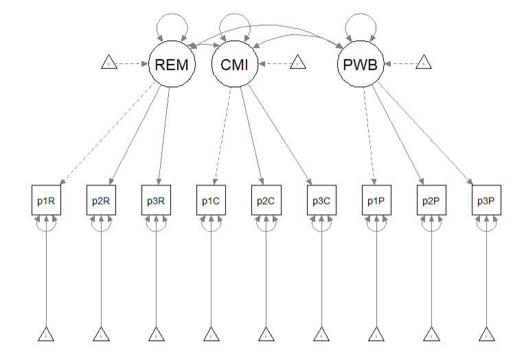
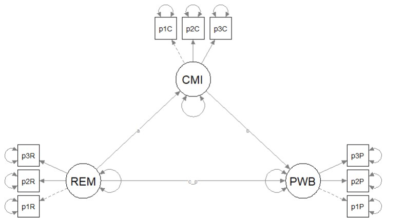
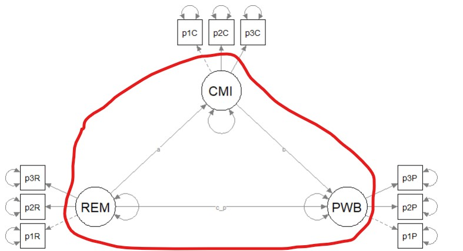
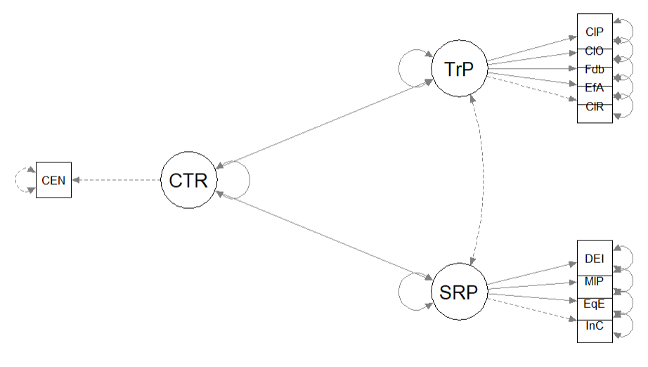

# Specifying and Evaluating the Structural Model {#StructMod}

[Screencasted Lecture Link](https://youtube.com/playlist?list=PLtz5cFLQl4KMUEpAgSY_lFqd7dtTMfeiw&si=9Yk_CU2xmdecbNRu) 

In the prior lesson we engaged in the first of two stages in SEM by establishing the *measurement model.*  In this stage we specify and evaluate the *structural model.* Additionally, using the same data we specify, evaluate, and compare *alternative models* and learn about the interpretive challenge of *equivalent* models.

## Navigating this Lesson

There is about 1 hour and 30 minutes of lecture.  If you work through the materials with me it would be plan for an additional two hours.

While the majority of R objects and data you will need are created within the R script that sources the chapter, occasionally there are some that cannot be created from within the R framework. Additionally, sometimes links fail.  All original materials are provided at the [Github site](https://https://github.com/lhbikos/ReC_MultivModel) that hosts the book. More detailed guidelines for ways to access all these materials are provided in the OER's [introduction](#ReCintro)

### Learning Objectives

Learning objectives from this lecture include the following:

* Specify an SEM structural model.
* Interpret *global* fit indices (e.g., Chi-square, CFI, RMSEA).
* Interpret *local* fit indices (e.g., regression weights/factor loadings, parameter estimates that we specify).
* With the same data and variables, specify and interpret results from an alternative model.
* Compare the fit of nested models.
* Describe the interpretive challenge of *equivalent models*.

### Planning for Practice

This is the second of a two-part lesson on structural equation modeling. In the prior lesson we established the *measurement model*. In this lesson we specify and evaluate a full *structural model*, respecify and evaluate an *alternative* model, and compare the two on the basis of their global fit indices. Your models should involve a minimum of three latent variables and should extend from the prior lesson on measurement models. As always, the suggestions for homework are graded in complexity.  

* Rework the problem in the chapter by changing the random seed in the code that simulates the data.  This should provide minor changes to the data, but the results will likely be very similar.
* Use the research data from the chapter, but evaluate a different set of variables.
* Use data from another lesson or data that is available to you.

### Readings & Resources

In preparing this chapter, I drew heavily from the following resource(s). Other resources are cited (when possible, linked) in the text with complete citations in the reference list.

* Kline, R. (2016). Principles and practice of structural equation modeling (Fourth ed., Methodology in the social sciences). New York: The Guilford Press.
  - Chapter 10, Specification and Identification of Structural Regression Models
  - Chapter 14, Analysis of Structural Regression Models
* Byrne, B. M. (2016). Structural equation modeling with AMOS: Basic concepts, applications, and programming (3rd ed.). Routledge. http://ebookcentral.proquest.com/lib/spu/detail.action?docID=4556523
  - Chapter 1, Structural Equation Modeling: The basics
  - Chapter 6, Application 4:  Testing the Factorial Validity of a Causal Structure
* Kim, P. Y., Kendall, D. L., & Cheon, H.-S. (2017). Racial microaggressions, cultural mistrust, and mental health outcomes among Asian American college students. *American Journal of Orthopsychiatry, 87*(6), 663–670. https://doi-org.ezproxy.spu.edu/10.1037/ort0000203
  - This is the research vignette for this lesson.

### Packages

The script below will (a) check to see if the following packages are installed on your computer and, if not (b) install them.

```r
# will install the package if not already installed
# if(!require(lavaan)){install.packages('lavaan')}
# if(!require(semPlot)){install.packages('semPlot')}
# if(!require(tidyverse)){install.packages('tidyverse')}
# if(!require(psych)){install.packages('psych')}
# if(!require(jtools)){install.packages('jtools')}
```

## Evaluating Structural Models


The model we are testing in this lesson is *hybrid* that is, it contains both CFA and the structural paths. Although there are several detours along the way, the analytic approach has two large stages:

In the prior lesson we tested the *measurement model*. This included each of the factors and its indicators with covariances between each of the latent variables. We learned that the measurement model will generally have the best fit because all of the structural paths are saturated (i.e., there is a covariance between them). Consequently, it is critical that good fit be established in the measurement model because fit will not improve in subsequent models.

In this lesson we will test the *structural model.* This means we delete the covariances and respecify the model to include the directional paths and covariances we have hypothesized. Once we have tested our model, we will follow the lead of our research vignette [@kim_racial_2017] by rearranging the variables to test *alternative* or competing models. This introduces the challenge that is unique to SEM -- one of *equivalent* models. 

## Workflow for Evaluating a Structural Model

 
Evaluating a structural model involves the following steps:

* A Priori Power Analysis
  - Conduct an a priori power analysis to determine the appropriate sample size.
  _ Draw estimates of effect from pilot data and/or the literature.
* Scrubbing & Scoring
  - Import data and format (i.e., variable naming, reverse-scoring) item level variables.
  - Analyze item-level missingness.
  - If using scales, create the mean scores of the scales.
  - Determine and execute approach for managing missingness. Popular choices are available item analysis (e.g., Parent, 2013) and multiple imputation.
  - Analyze scale-level missingness.
  - Create a df with only the items (scaled in the proper direction).
* Data Diagnostics
  - Evaluate univariate normality (i.e., one variable at a time) with Shapiro-Wilks tests; p < .05 indicates a violation of univariate normality.
  - Evaluate multivariate normality (i.e., all continuously scaled variables simultaneously) with Mahalanobis test. Identify outliers (e.g., cases with Mahal values > 3 SDs from the centroid). Consider deleting (or transforming if there is an extreme-ish “jump” in the sorted values.
  - Evaluate internal consistency of the scaled scores with Cronbach’s alpha or omega; the latter is increasingly preferred.
Specify and evaluate a measurement model
  - In this just-identified (saturated) model, all latent variables are specified as covarying.
    + For LVs with 3 items or more, remember to set a marker/reference variable,
    + For LVs with 2 items, constrain the loadings to be equal,
    + For single-item indicators fix the error variance to zero (or a non-zero estimate of unreliability).
  - Evaluate results with global (e.g., X2, CFI, RMSEA, SRMR) and local (i.e., factor loadings and covariances) fit indices.
  - In the event of poor fit, respecify LVs with multiple indicators with parcels.
  - Nested alternative measurement models can be compared with Χ2 difference, ΔCFI tests; non-nested models with AIC, and BIC tests .
* Specify and evaluate a structural model.
  - Replace the covariances with paths that represent the a priori hypotheses.
    + These models could take a variety of forms.
    + It is possible to respecify models through trimming or building approaches.
  - Evaluate results using
    + *global* fit indices (e.g., X2, CFI, RMSEA, SRMS),
    + *local* fit indices (i.e., strength and significance of factor loadings, covariances, and additional model parameters [e.g., indirect effects]).
  - Consider respecifying and evaluating one or more *alternative* models.
    + *Forward searching* involves freeing parameters (adding paths or covariances) and can use modification indices as a guide.
    + *Backward searching* involves restraining parameters (deleting paths or covariances) and can use low and non-significant paths as a guide.
  - Compare the fit of the alternate models.
    + Nested models can be compared with Χ2 difference and ΔCFI tests.
    + Non-nested models can be compared with AIC and BIC (lower values suggest better fit).
* Quick Guide for Global and Comparative Fit Statistics.
  - $\chi^2$, p < .05; this test is sensitive to sample size and this value can be difficult to attain
  - CFI > .95 (or at least .90)
  - RMSEA (and associated 90%CI) are < .05 ( < .08, or at least < .10)
  - SRMR < .08 (or at least <.10)
  - Combination rule:  CFI < .95 and SRMR < .08
  - AIC and BIC are compared; the lowest values suggest better models
  - $\chi^2\Delta$ is statistically significant; the model with the superior fit is the better model
  - $\delta CFI$ is greater than 0.01; the model with CFI values closest to 1.0 has better fit


## Research Vignette

The research vignette comes from the Kim, Kendall, and Cheon's [-@kim_racial_2017], "Racial Microaggressions, Cultural Mistrust, and Mental Health Outcomes Among Asian American College Students."  Participants were 156 Asian American undergraduate students in the Pacific Northwest. The researchers posited the a priori hypothesis that cultural mistrust would mediate the relationship between racial microaggressions and two sets of outcomes:  mental health (e.g., depression, anxiety, well-being) and help-seeking.

Variables used in the study included:

* **REMS**:  Racial and Ethnic Microaggressions Scale (Nadal, 2011). The scale includes 45 items on a 2-point scale where 0 indicates no experience of a microaggressive event and 1 indicates it was experienced at least once within the past six months.  Higher scores indicate more experience of microaggressions.
* **CMI**:  Cultural Mistrust Inventory (Terrell & Terrell, 1981). This scale was adapted to assess cultural mistrust harbored among Asian Americans toward individuals from the mainstream U.S. culture (e.g., Whites). The CMI includes 47 items on a 7-point scale where higher scores indicate a higher degree of cultural mistrust.
* **ANX**, **DEP**, **PWB**:  Subscales of the Mental Health Inventory (Veit & Ware, 1983) that assess the mental health outcomes of anxiety (9 items), depression (4 items), and psychological well-being (14 items).  Higher scores (on a 6 point scale) indicate stronger endorsement of the mental health outcome being assessed.
* **HlpSkg**:  The Attiudes Toward Seeking Professional Psychological Help -- Short Form (Fischer & Farina, 1995) includes 10 items on a 4-point scale (0 = disagree, 3 = agree) where higher scores indicate more favorable attitudes toward help seeking.

Below is a figure of the model that we will be using structural equation modeling to test


### Simulating the data from the journal article

We used the *lavaan::simulateData* function for the simulation. If you have taken psychometrics, you may recognize the code as one that creates latent variables form item-level data. In trying to be as authentic as possible, we retrieved factor loadings from psychometrically oriented articles that evaluated the measures [@nadal_racial_2011; @veit_structure_1983]. For all others we specified a factor loading of 0.80. We then approximated the *measurement model* by specifying the correlations between the latent variable. We sourced these from the correlation matrix from the research vignette [@kim_racial_2017]. The process created data with multiple decimals and values that exceeded the boundaries of the variables. For example, in all scales there were negative values. Therefore, the final element of the simulation was a linear transformation that rescaled the variables back to the range described in the journal article and rounding the values to integer (i.e., with no decimal places).


```r
# Entering the intercorrelations, means, and standard deviations from
# the journal article

Kim_generating_model <- "
        #measurement model
         REMS =~ .82*Inf32 + .75*Inf38 + .74*Inf21 + .72*Inf17 + .69*Inf9 + .61*Inf36 + .51*Inf5 + .49*Inf22 + .81*SClass6 + .81*SClass31 + .74*SClass8 + .74*SClass40 + .72*SClass2 + .65*SClass34 + .55*SClass11 + .84*mInv27 + .84*mInv30 + .80*mInv39 + .72*mInv7 + .62*mInv26 + .61*mInv33 + .53*mInv4 + .47*mInv14 + .47*mInv10 + .74*Exot3 + .74*Exot29 + .71*Exot45 + .69*Exot35 + .60*Exot42 + .59*Exot23 + .51*Exot13 + .51*Exot20 + .49*Exot43 + .84*mEnv37 + .85*mEnv24 + .78*mEnv19 + .70*mEnv28 + .69*mEnv18 + .55*mEnv41 + .55*mEnv12 + .76*mWork25 + .67*mWork15 + .65*mWork1 + .64*mWork16 + .62*mWork44
         
         CMI =~ .8*cmi1 + .8*cmi2 + .8*cmi3 + .8*cmi4 + .8*cmi5 + .8*cmi6 + .8*cmi7 + .8*cmi8 + .8*cmi9 + .8*cmi10 + .8*cmi11 + .8*cmi12 + .8*cmi13 + .8*cmi14 + .8*cmi15 + .8*cmi16 + .8*cmi17 + .8*cmi18 + .8*cmi19 + .8*cmi20 + .8*cmi21 + .8*cmi22 + .8*cmi23 + .8*cmi24 + .8*cmi25 + .8*cmi26 + .8*cmi27 + .8*cmi28 + .8*cmi29 + .8*cmi30 + .8*cmi31 + .8*cmi32 + .8*cmi33 + .8*cmi34 + .8*cmi35 + .8*cmi36 + .8*cmi37 + .8*cmi38 + .8*cmi39 + .8*cmi40 + .8*cmi41 + .8*cmi42 + .8*cmi43 + .8*cmi44 + .8*cmi45 + .8*cmi46 + .8*cmi47
         
         ANX =~ .80*Anx1 + .80*Anx2 + .77*Anx3 + .74*Anx4 + .74*Anx5 + .69*Anx6 + .69*Anx7 + .68*Anx8 + .50*Anx9  
         DEP =~ .74*Dep1 + .83*Dep2 + .82*Dep3 + .74*Dep4
         PWB =~ .83*pwb1 + .72*pwb2 + .67*pwb3 + .79*pwb4 + .77*pwb5 + .75*pwb6 + .74*pwb7 +.71*pwb8 +.67*pwb9 +.61*pwb10 +.58*pwb11
         
         HlpSkg =~ .8*hlpskg1 + .8*hlpskg2 + .8*hlpskg3 + .8*hlpskg4 + .8*hlpskg5 + .8*hlpskg6 + .8*hlpskg7 + .8*hlpskg8 + .8*hlpskg9 + .8*hlpskg10 
   
        #Means
         REMS ~ 0.34*1
         CMI ~ 3*1
         ANX ~ 2.98*1
         DEP ~ 2.36*1
         PWB ~ 3.5*1
         HlpSkg ~ 1.64*1
        
        #Correlations 
         REMS ~ 0.58*CMI
         REMS ~ 0.26*ANX
         REMS ~ 0.34*DEP
         REMS ~ -0.25*PWB
         REMS ~ -0.02*HlpSkg
         CMI ~ 0.12*ANX
         CMI ~ 0.19*DEP
         CMI ~ -0.28*PWB
         CMI ~ 0*HlpSkg
         ANX ~ 0.66*DEP
         ANX ~ -0.55*PWB
         ANX ~ 0.07*HlpSkg
         DEP ~ -0.66*PWB
         DEP ~ 0.05*HlpSkg
         PWB ~ 0.08*HlpSkg
        "

set.seed(230916)
dfKim <- lavaan::simulateData(model = Kim_generating_model, model.type = "sem",
    meanstructure = T, sample.nobs = 156, standardized = FALSE)
library(tidyverse)

# used to retrieve column indices used in the rescaling script below
# col_index <- as.data.frame(colnames(dfKim))

for (i in 1:ncol(dfKim)) {
    # for loop to go through each column of the dataframe apply only
    # to REMS variables
    if (i >= 1 & i <= 45) {
        dfKim[, i] <- scales::rescale(dfKim[, i], c(0, 1))
    }
    if (i >= 46 & i <= 116) {
        # apply only to CMI variables
        dfKim[, i] <- scales::rescale(dfKim[, i], c(1, 7))
    }
    if (i >= 93 & i <= 116) {
        # apply only to mental health variables
        dfKim[, i] <- scales::rescale(dfKim[, i], c(1, 5))
    }
    if (i >= 117 & i <= 126) {
        # apply only to HlpSkng variables
        dfKim[, i] <- scales::rescale(dfKim[, i], c(0, 3))
    }
}

library(tidyverse)
dfKim <- dfKim %>%
    round(0)
```

The script below allows you to store the simulated data as a file on your computer. This is optional -- the entire lesson can be worked with the simulated data.

If you prefer the .rds format, use this script (remove the hashtags). The .rds format has the advantage of preserving any formatting of variables. A disadvantage is that you cannot open these files outside of the R environment.

Script to save the data to your computer as an .rds file.


```r
#saveRDS(dfKim, 'dfKim.rds')  
```

Once saved, you could clean your environment and bring the data back in from its .csv format.

```r
#dfKim<- readRDS('dfKim.rds')
```

If you prefer the .csv format (think "Excel lite") use this script (remove the hashtags). An advantage of the .csv format is that you can open the data outside of the R environment. A disadvantage is that it may not retain any formatting of variables

Script to save the data to your computer as a .csv file.


```r
# write.table(dfKim, file = 'dfKim.csv', sep = ',', col.names=TRUE,
# row.names=FALSE)
```

Once saved, you could clean your environment and bring the data back in from its .csv format.

```r
# dfKim<- read.csv ('dfKim.csv', header = TRUE)
```

## Scrubbing, Scoring, and Data Diagnostics

Because the focus of this lesson is on the specific topic of specifying and evaluating a structural model for SEM and have used simulated data, we are skipping many of the steps in scrubbing, scoring and data diagnostics. If this were real, raw, data, it would be important to [scrub](https://lhbikos.github.io/ReC_MultivModel/scrub.html), if needed [score](https://lhbikos.github.io/ReC_MultivModel/score.html), and conduct [data diagnostics](https://lhbikos.github.io/ReC_MultivModel/DataDx.html) to evaluate the suitability of the data for the proposes anlayses.

## Script for Specifying Models in *lavaan*

SEM in *lavaan* requires fluency with the R script. Below is a brief overview of the operators we use most frequently:

* Latent variables (factors) must be *defined* by their manifest or latent indicators.  
  + the special operator (=~, *is measured/defined by*) is used for this
  + Example:  f1 =~ y1 + y2 + y3
* Regression equations use the single tilda (~, *is regressed on*)
  + place DV (y) on left of operator
  + place IVs, separate by + on the right
  + Example:  y ~ f1 + f2 + x1 + x2
    - *f* is a latent variable in this example
    - *y*, *x1*, and *x2* are observed variables in this example
  + An asterisk can affix a label in subsequent calculations and in interpreting output
* Variances and covariances are specified with a double tilde operator (~~, *is correlated with*)
  + Example of variance:  y1 ~~ y1 (the relationship with itself)
  + Example of covariance:  y1 ~~ y2 (relationship with another variable)
  + Example of covariance of a factor:  f1 ~~ f2
*Intercepts (~ 1) for observed and LVs are simple, intercept-only regression formulas
  + Example of variable intercept:  y1 ~ 1
  + Example of factor intercept:  f1 ~ 1

A complete lavaan model is a combination of these formula types, enclosed between single quotation models. Readibility of model syntax is improved by:

* splitting formulas over multiple lines
* using blank lines within single quote
* labeling with the hashtag

## Quick Specification of the Measurement Model

Recall that the first step in establishing a structural model is to specify, evaluate, and if necessary re-specify the measurement model. In the prior lesson I decided to randomly assigning items to three indicators per parcel. Because our data simulation produced item-level data, I will briefly repeat the code for the solution we chose. For more information on this process please revisit the lesson on [establishing the measurement model](https://lhbikos.github.io/ReC_MultivModel/MeasMod.html). Here is a representation of the measurement model we are specifying.

 

This code randomly assigns the PWB items to three parcels.

```r
set.seed(230916)
items <- c("pwb1", "pwb2", "pwb3", "pwb4", "pwb5", "pwb6", "pwb7", "pwb8",
    "pwb9", "pwb10", "pwb11")
parcels <- c("PWB_p1", "PWB_p_2", "PWB_p3")
data.frame(items = sample(items), parcel = rep(parcels, length = length(items)))
```

```
##    items  parcel
## 1   pwb7  PWB_p1
## 2   pwb9 PWB_p_2
## 3   pwb1  PWB_p3
## 4  pwb11  PWB_p1
## 5   pwb2 PWB_p_2
## 6   pwb3  PWB_p3
## 7   pwb4  PWB_p1
## 8  pwb10 PWB_p_2
## 9   pwb5  PWB_p3
## 10  pwb8  PWB_p1
## 11  pwb6 PWB_p_2
```
We can now create the parcels using the same scoring procedure as we did for the REMS and CMI instruments.

```r
PWB_p1_vars <- c("pwb7", "pwb11", "pwb4", "pwb8")
PWB_p2_vars <- c("pwb9", "pwb2", "pwb10", "pwb2")
PWB_p3_vars <- c("pwb1", "pwb3", "pwb5")

dfKim$p1PWB <- sjstats::mean_n(dfKim[, PWB_p1_vars], 0.75)
dfKim$p2PWB <- sjstats::mean_n(dfKim[, PWB_p2_vars], 0.75)
dfKim$p3PWB <- sjstats::mean_n(dfKim[, PWB_p3_vars], 0.75)

# If the scoring code above does not work for you, try the format
# below which involves inserting to periods in front of the variable
# list. One example is provided. dfKim$p3PWB <-
# sjstats::mean_n(dfKim[, ..PWB_p3_vars], .75)
```

This code randomly assigns the REMS items to three parcels.

```r
set.seed(230916)
items <- c("Inf32", "Inf38", "Inf21", "Inf17", "Inf9", "Inf36", "Inf5",
    "Inf22", "SClass6", "SClass31", "SClass8", "SClass40", "SClass2", "SClass34",
    "SClass11", "mInv27", "mInv30", "mInv39", "mInv7", "mInv26", "mInv33",
    "mInv4", "mInv14", "mInv10", "Exot3", "Exot29", "Exot45", "Exot35",
    "Exot42", "Exot23", "Exot13", "Exot20", "Exot43", "mEnv37", "mEnv24",
    "mEnv19", "mEnv28", "mEnv18", "mEnv41", "mEnv12", "mWork25", "mWork15",
    "mWork1", "mWork16", "mWork44")
parcels <- c("REMS_p1", "REMS_p2", "REMS_p3")
data.frame(items = sample(items), parcel = rep(parcels, length = length(items)))
```

```
##       items  parcel
## 1   mWork44 REMS_p1
## 2    mEnv41 REMS_p2
## 3   mWork25 REMS_p3
## 4    Exot20 REMS_p1
## 5  SClass11 REMS_p2
## 6     Inf38 REMS_p3
## 7   SClass8 REMS_p1
## 8      Inf5 REMS_p2
## 9     Inf17 REMS_p3
## 10   Exot43 REMS_p1
## 11   mEnv19 REMS_p2
## 12   Exot23 REMS_p3
## 13    mInv4 REMS_p1
## 14   mInv39 REMS_p2
## 15   mInv33 REMS_p3
## 16 SClass31 REMS_p1
## 17    Inf22 REMS_p2
## 18   mEnv28 REMS_p3
## 19 SClass40 REMS_p1
## 20   mEnv18 REMS_p2
## 21    Inf36 REMS_p3
## 22  mWork16 REMS_p1
## 23   mInv30 REMS_p2
## 24   mInv14 REMS_p3
## 25   Exot45 REMS_p1
## 26    Inf32 REMS_p2
## 27   mEnv37 REMS_p3
## 28  SClass2 REMS_p1
## 29 SClass34 REMS_p2
## 30    Inf21 REMS_p3
## 31    Exot3 REMS_p1
## 32   Exot29 REMS_p2
## 33   mEnv12 REMS_p3
## 34   mEnv24 REMS_p1
## 35   mInv27 REMS_p2
## 36   Exot42 REMS_p3
## 37   Exot35 REMS_p1
## 38   mInv10 REMS_p2
## 39  SClass6 REMS_p3
## 40    mInv7 REMS_p1
## 41   mWork1 REMS_p2
## 42     Inf9 REMS_p3
## 43   Exot13 REMS_p1
## 44  mWork15 REMS_p2
## 45   mInv26 REMS_p3
```

This code provides means for each of the three REMS parcels.

```r
REMS_p1_vars <- c("mWork44", "Exot20", "SClass8", "Exot43", "mInv4", "SClass31",
    "SClass40", "mWork16", "Exot45", "SClass2", "Exot3", "mEnv24", "Exot35",
    "mInv7", "Exot13")
REMS_p2_vars <- c("mEnv41", "SClass11", "Inf5", "mEnv19", "mInv39", "Inf22",
    "mEnv18", "mInv30", "Inf32", "SClass34", "Exot29", "mInv27", "mInv10",
    "mWork1", "mWork15")
REMS_p3_vars <- c("mWork25", "Inf38", "Inf17", "Exot23", "mInv33", "mEnv28",
    "Inf36", "mInv14", "mEnv37", "Inf21", "mEnv12", "Exot42", "SClass6",
    "Inf9", "mInv26")

dfKim$p1REMS <- sjstats::mean_n(dfKim[, REMS_p1_vars], 0.8)
dfKim$p2REMS <- sjstats::mean_n(dfKim[, REMS_p2_vars], 0.8)
dfKim$p3REMS <- sjstats::mean_n(dfKim[, REMS_p3_vars], 0.8)

# If the scoring code above does not work for you, try the format
# below which involves inserting to periods in front of the variable
# list. One example is provided. dfKim$p3REMS <-
# sjstats::mean_n(dfKim[, ..REMS_p3_vars], .80)
```

We can repeat the process for the CMI. First, we assign the 47 CMI items to the three parcels.


```r
set.seed(230916)
items <- c(IntRel_vars <- c("cmi1", "cmi2", "cmi3", "cmi4", "cmi5", "cmi6",
    "cmi7", "cmi8", "cmi9", "cmi10", "cmi11", "cmi12", "cmi13", "cmi14",
    "cmi15", "cmi16", "cmi17", "cmi18", "cmi19", "cmi20", "cmi21", "cmi22",
    "cmi23", "cmi24", "cmi25", "cmi26", "cmi27", "cmi28", "cmi29", "cmi30",
    "cmi31", "cmi32", "cmi33", "cmi34", "cmi35", "cmi36", "cmi37", "cmi38",
    "cmi39", "cmi40", "cmi41", "cmi42", "cmi43", "cmi44", "cmi45", "cmi46",
    "cmi47"))
parcels <- c("CMI_p1", "CMI_p2", "CMI_p3")
data.frame(items = sample(items), parcel = rep(parcels, length = length(items)))
```

```
##    items parcel
## 1  cmi45 CMI_p1
## 2  cmi39 CMI_p2
## 3  cmi41 CMI_p3
## 4  cmi32 CMI_p1
## 5  cmi15 CMI_p2
## 6   cmi2 CMI_p3
## 7  cmi11 CMI_p1
## 8   cmi7 CMI_p2
## 9   cmi4 CMI_p3
## 10 cmi33 CMI_p1
## 11 cmi38 CMI_p2
## 12 cmi30 CMI_p3
## 13 cmi22 CMI_p1
## 14 cmi18 CMI_p2
## 15 cmi46 CMI_p3
## 16 cmi12 CMI_p1
## 17 cmi40 CMI_p2
## 18  cmi6 CMI_p3
## 19 cmi26 CMI_p1
## 20 cmi47 CMI_p2
## 21 cmi17 CMI_p3
## 22 cmi25 CMI_p1
## 23 cmi27 CMI_p2
## 24 cmi23 CMI_p3
## 25 cmi44 CMI_p1
## 26  cmi1 CMI_p2
## 27 cmi10 CMI_p3
## 28 cmi13 CMI_p1
## 29 cmi14 CMI_p2
## 30  cmi3 CMI_p3
## 31 cmi31 CMI_p1
## 32 cmi42 CMI_p2
## 33 cmi29 CMI_p3
## 34 cmi34 CMI_p1
## 35  cmi8 CMI_p2
## 36 cmi28 CMI_p3
## 37 cmi37 CMI_p1
## 38 cmi19 CMI_p2
## 39 cmi21 CMI_p3
## 40 cmi43 CMI_p1
## 41 cmi20 CMI_p2
## 42 cmi35 CMI_p3
## 43 cmi24 CMI_p1
## 44  cmi5 CMI_p2
## 45 cmi36 CMI_p3
## 46  cmi9 CMI_p1
## 47 cmi16 CMI_p2
```
This code provides means for each of the three CMI parcels.

```r
CMI_p1_vars <- c("cmi45", "cmi32", "cmi11", "cmi33", "cmi22", "cmi12",
    "cmi26", "cmi25", "cmi44", "cmi13", "cmi31", "cmi34", "cmi37", "cmi43",
    "cmi24", "cmi9")
CMI_p2_vars <- c("cmi39", "cmi15", "cmi7", "cmi38", "cmi18", "cmi40", "cmi47",
    "cmi27", "cmi1", "cmi14", "cmi42", "cmi8", "cmi19", "cmi20", "cmi5",
    "cmi16")
CMI_p3_vars <- c("cmi41", "cmi2", "cmi4", "cmi30", "cmi46", "cmi6", "cmi17",
    "cmi23", "cmi10", "cmi3", "cmi29", "cmi28", "cmi21", "cmi35", "cmi36")

dfKim$p1CMI <- sjstats::mean_n(dfKim[, CMI_p1_vars], 0.8)
dfKim$p2CMI <- sjstats::mean_n(dfKim[, CMI_p2_vars], 0.8)
dfKim$p3CMI <- sjstats::mean_n(dfKim[, CMI_p3_vars], 0.8)

# If the scoring code above does not work for you, try the format
# below which involves inserting to periods in front of the variable
# list. One example is provided. dfKim$p3CMI <-
# sjstats::mean_n(dfKim[, ..CMI_p3_vars], .80)
```

Below is code for specifying the measurement model. Each of the latent variables/factors (REMS, CMI, PWB) is identified by three parcels. Each of the latent variables is allowed to covary with the others.

```r
rp3_msmt_mod <- "
        ##measurement model
         REMS =~ p1REMS + p2REMS + p3REMS
         
         CMI =~ p1CMI + p2CMI + p3CMI  
         
         PWB =~ p1PWB + p2PWB + p3PWB 
         
        
        # Covariances
         REMS ~~ CMI
         REMS ~~ PWB
         CMI ~~ PWB
        "

set.seed(230916)
rp3_msmt_fit <- lavaan::cfa(rp3_msmt_mod, data = dfKim, missing = "fiml")
rp3_msmt_fit_sum <- lavaan::summary(rp3_msmt_fit, fit.measures = TRUE,
    standardized = TRUE)
rp3_msmt_fit_sum
```

```
## lavaan 0.6.17 ended normally after 106 iterations
## 
##   Estimator                                         ML
##   Optimization method                           NLMINB
##   Number of model parameters                        30
## 
##   Number of observations                           156
##   Number of missing patterns                         1
## 
## Model Test User Model:
##                                                       
##   Test statistic                                15.965
##   Degrees of freedom                                24
##   P-value (Chi-square)                           0.889
## 
## Model Test Baseline Model:
## 
##   Test statistic                              1366.804
##   Degrees of freedom                                36
##   P-value                                        0.000
## 
## User Model versus Baseline Model:
## 
##   Comparative Fit Index (CFI)                    1.000
##   Tucker-Lewis Index (TLI)                       1.009
##                                                       
##   Robust Comparative Fit Index (CFI)             1.000
##   Robust Tucker-Lewis Index (TLI)                1.009
## 
## Loglikelihood and Information Criteria:
## 
##   Loglikelihood user model (H0)               -368.149
##   Loglikelihood unrestricted model (H1)       -360.166
##                                                       
##   Akaike (AIC)                                 796.297
##   Bayesian (BIC)                               887.793
##   Sample-size adjusted Bayesian (SABIC)        792.834
## 
## Root Mean Square Error of Approximation:
## 
##   RMSEA                                          0.000
##   90 Percent confidence interval - lower         0.000
##   90 Percent confidence interval - upper         0.031
##   P-value H_0: RMSEA <= 0.050                    0.988
##   P-value H_0: RMSEA >= 0.080                    0.000
##                                                       
##   Robust RMSEA                                   0.000
##   90 Percent confidence interval - lower         0.000
##   90 Percent confidence interval - upper         0.031
##   P-value H_0: Robust RMSEA <= 0.050             0.988
##   P-value H_0: Robust RMSEA >= 0.080             0.000
## 
## Standardized Root Mean Square Residual:
## 
##   SRMR                                           0.017
## 
## Parameter Estimates:
## 
##   Standard errors                             Standard
##   Information                                 Observed
##   Observed information based on                Hessian
## 
## Latent Variables:
##                    Estimate  Std.Err  z-value  P(>|z|)   Std.lv  Std.all
##   REMS =~                                                               
##     p1REMS            1.000                               0.271    0.944
##     p2REMS            1.055    0.044   23.770    0.000    0.286    0.946
##     p3REMS            1.031    0.046   22.399    0.000    0.280    0.929
##   CMI =~                                                                
##     p1CMI             1.000                               0.773    0.963
##     p2CMI             1.006    0.035   28.780    0.000    0.778    0.957
##     p3CMI             0.937    0.034   27.373    0.000    0.724    0.948
##   PWB =~                                                                
##     p1PWB             1.000                               0.306    0.635
##     p2PWB             1.606    0.228    7.055    0.000    0.491    0.801
##     p3PWB             1.372    0.206    6.662    0.000    0.420    0.709
## 
## Covariances:
##                    Estimate  Std.Err  z-value  P(>|z|)   Std.lv  Std.all
##   REMS ~~                                                               
##     CMI               0.128    0.021    6.199    0.000    0.608    0.608
##     PWB              -0.047    0.010   -4.712    0.000   -0.562   -0.562
##   CMI ~~                                                                
##     PWB              -0.132    0.028   -4.763    0.000   -0.559   -0.559
## 
## Intercepts:
##                    Estimate  Std.Err  z-value  P(>|z|)   Std.lv  Std.all
##    .p1REMS            0.494    0.023   21.448    0.000    0.494    1.717
##    .p2REMS            0.504    0.024   20.790    0.000    0.504    1.665
##    .p3REMS            0.522    0.024   21.642    0.000    0.522    1.733
##    .p1CMI             3.888    0.064   60.479    0.000    3.888    4.842
##    .p2CMI             3.886    0.065   59.667    0.000    3.886    4.777
##    .p3CMI             4.051    0.061   66.190    0.000    4.051    5.299
##    .p1PWB             3.014    0.039   78.207    0.000    3.014    6.262
##    .p2PWB             3.207    0.049   65.324    0.000    3.207    5.230
##    .p3PWB             3.141    0.047   66.276    0.000    3.141    5.306
## 
## Variances:
##                    Estimate  Std.Err  z-value  P(>|z|)   Std.lv  Std.all
##    .p1REMS            0.009    0.002    5.466    0.000    0.009    0.109
##    .p2REMS            0.010    0.002    5.330    0.000    0.010    0.106
##    .p3REMS            0.012    0.002    6.278    0.000    0.012    0.137
##    .p1CMI             0.047    0.009    5.046    0.000    0.047    0.072
##    .p2CMI             0.056    0.010    5.597    0.000    0.056    0.084
##    .p3CMI             0.060    0.009    6.292    0.000    0.060    0.102
##    .p1PWB             0.138    0.019    7.309    0.000    0.138    0.597
##    .p2PWB             0.135    0.029    4.646    0.000    0.135    0.358
##    .p3PWB             0.174    0.028    6.320    0.000    0.174    0.498
##     REMS              0.074    0.009    7.838    0.000    1.000    1.000
##     CMI               0.598    0.073    8.171    0.000    1.000    1.000
##     PWB               0.093    0.024    3.963    0.000    1.000    1.000
```

As we determined in the prior lesson, the factor loadings were all strong, statistically significant, and properly valenced. Further, global fit statistics were within acceptable thresholds ($\chi^2(24) = 15.965, p = 0.889, CFI = 1.000, RMSEA = 0.000, 90CI[0.000,	 0.031], SRMR =  0.017$).

The figure below is an illustration of our measurement model with its results. It also conveys that each latent variable is indicated by three parcels and all of the latent variables are allowed to covary.


```r
semPlot::semPaths(rp3_msmt_fit, what = "col", whatLabels = "stand", sizeMan = 5,
    node.width = 1, edge.label.cex = 0.75, style = "lisrel", mar = c(5,
        5, 5, 5))
```

<!-- -->

```r
# semPlot::semPaths(rp3_msmt_fit) #ignore -- used to create a
# no-results figure earlier in the chapter
```

## The Structural Model:  Specification and Evaluation

The **structural model** evaluates the hypothesized relations between the latent variables.  The structural model is typically more parsimonious (i.e., not saturated) than the measurement model and is characterized by directional paths (not covariances) between some  (not all) of the variables.  

When there are positive degrees of freedom in the structural mode (technically this becomes an *over-identified* model), it will have lower fit than the measurement model. This is why it was critical to establish a well-fitting measurement model, first.

Here's a quick reminder of the hypothesized model we are testing from Kim et al. [@kim_racial_2017]. We are evaluating a simple mediation model, predicting psychological well-being from racial microaggressions mediated by cultural mistrust. The model is *hybrid* because it include measurement models (i.e., latent variables indicated by their parcels), plus the hypothesized paths.



Having just confirmed that our measurement model is adequate, we now replace the covariances between latent variables with the paths (directional) and covariances (bidirectional) we hypothesize. These paths and covariances are *soft* hypotheses. That is, we are "freeing" them to relate. In SEM, *hard* hypotheses are where no path/covariance exists and the relationship between these variables is "fixed" to zero. This is directly related to degrees of freedom and the identification status (just-identified, over-identified, underidentified) of the model. 

### Model Identification

There are two necessary elements for identifying any type of SEM [@kline_principles_2016], these include 

* having degrees of freedom greater-than-or-equal to zero ($df_{M}\geq 0$), and
* assigning a scale to every latent variable (including disturbances or error terms)
  - *lavaan::sem* and *lavaan::cfa* automatically assign "1" to the first indicator in each latent variable

In the case of the specification of standard CFA models (i.e., the models we use in the psychometric evaluation of measures and surveys), the extent of our "your model must be identified" conversation stopped at:  

* unidimensional models need to have a minimum of 3 items/indicators (manifest variables) per factor/scale (latent variable)  
* multidimensional models need to have a minimum of 2 items/indicators (manifest variables) per factor/scale (latent variable)  
* second order factors need three first-order factors in order to be identified  
* nonstandard models include error variances that are free to correlate -- they need closer scrutiny with regard to identification status  

Model identification, though, is more complicated than that. At the risk of repetition, let's look again at model identification in hybrid models as it relates to the  $df_{M}\geq 0$ criteria.

**Underidentified or undetermined** models have fewer observations (knowns) than free model parameters (unknowns). This results in negative degrees of freedom ($df_{M}\leq 0$). This means that it is impossible to find a unique set of estimates. The classic example for this is:  $a + b = 6$ where there are an infinite number of solutions.

**Just-identified or just-determined** models have an equal number of observations (knowns) as free parameters (unknowns). This results in zero degrees of freedom ($df_{M}= 0$). Just-identified scenarios will result in a unique solution. The classic example for this is

$$a + b = 6$$
$$2a + b = 10$$
The unique solution is *a* = 4, *b* = 2.

**Over-identified or overdetermined** models have more observations (knowns) than free parameters (unknowns). This results in positive degrees of freedom ($df_{M}> 0$). In this circumstance, there is no single solution, but one can be calculated when a statistical criterion is applied. For exampe, there is no single solution that satisfies all three of these formulas:

$$a + b = 6$$
$$2a + b = 10$$
$$3a + b = 12$$

When we add this instruction "Find value of *a* and *b* that yield total scores such that the sum of squared differences between the observations (6, 10, 12) and these total scores is as small as possible."  Curious about the answer?  An excellent description is found in Kline [-@kline_principles_2016]. 

Model identification is an incredibly complex topic. It is possible to have theoretically identified models and yet they are statistically unidentified and then the researcher must hunt for the source of the problem. For this lesson, I will simply walk through the steps that are commonly used in determining the identification status of a structural model.

#### Model identification for the overal SEM

In order to be evaluated, structural models need to be *just identifed* ($df_M = 0$) or *overidentified* ($df_M > 0$). Computer programs are not (yet) good at estimating identification status because it is based on symbolism and not numbers.  Therefore, we researchers must do the mental math to ensure that our *knowns* (measured/observed variables) are equal (just-identified) or greater than (overidentified) our *unknowns* (parameters that will be estimated).  

We calculate the *knowns* by identifying the number of measured variables (*n*) and popping that number into this equation:  $\frac{n(n+1)}{2}$. *Unknowns* are counted and include:  measurement regression paths, structural regression paths, error covariances, residual error variances, and covariances.

Lets calculate this for our model.

* **Knowns**:  There are 9 observed variables, so we have 45 (9(9+1)/2) pieces of information from which to drive the parameters of the model.
* **Unknowns**:  We must estimate the following parameters
  - 6 measurement regression paths (we don't count marker variables or the single-indicator items)
  - 3 structural regression paths
  - 9 error covariances (1 for each indicator variable)
  - 2 residual error variances (any endogenous [predicted] latent variable has one of these)
  - 0 covariances
  - We have a total of: 20 unknowns
  

```r
(9*(9+1))/2
```

```
## [1] 45
```
Our overall model is overidentified with  $df_M = 20$. We know this because subtracted the unknowns (20) from the knowns (45). If we calculated this correctly, 25 will be the degrees of freedom associated with the chi-square test.


```r
45-20
```

```
## [1] 25
```


#### Model identification for the structural portion of the model

It is possible to have an overidentified model but still be underidentified in the structural portion. In order to be evaluated, structural models need to be *just identifed* ($df_M = 0$) or *overidentified* ($df_M > 0$). Before continuing, it is essential to understand that the structural part is (generally) the relations between the latent variables (although in some models there could be observed variables). In our case, our structural model consists only of four latent variables.



Especially for the structural portion of the model, statistical packages are not (yet) good at estimating identification status because it is based on symbolism and not numbers.  Therefore, we researchers must make the calculations to ensure that our *knowns* are equal (just-identified) or greater than (overidentified) our *unknowns*.  

**Knowns**: $\frac{k(k+1)}{2}$ where *k* is the number of *constructs* (humoR:  konstructs?)in the model.  In our case, we have three constructs:  3(3+1)/2 = 6


```r
(3*(3+1))/2
```

```
## [1] 6
```

**Unknowns**: are calculated with the following

  - Exogenous (predictor) variables (1 variance estimated for each):  we have 1 (REM) 
  - Endogenous (predicted) variables (1 disturbance variance for each):  we have 2 (CMI, PWB)
  - Correlations between variables (1 covariance for each pairing): we have 0
  - Regression paths (arrows linking exogenous variables to endogenous variables): we have 3  
    
With 6 knowns and 6 unknowns, we have 0 degrees of freedom in the structural portion of the model. This is a *just-identified*, fully saturated, model. This model is the nested model and will always have the best fit. When models are especially complex, some researchers will start with a just-identified model and trim paths to get to their hypothesized model and compare the fit to see if there are statistically significant differences as the trimming progresses. The researcher hopes that the fit of the more parsimonious model will not be statistically significantly different from the just-identified model. 

Today, we already know the results of our *global fit indices* because when models are just-identified/fully saturated, the fit of the test of the structural model will be identical to the fit of the measurement model. As you might imagine, this introduces some challenge to our interpretation. Stated another way, the *measurement* model will always have the best fit because it is fully saturated (i.e., covariances between all latent variables) and its structure will best replicate the sample covariance matrix. When we have over-identified models (i.e., models with positive degrees of freedom), our hope is that replacing covariances (double-headed arrows) with unidirectional paths and constraining some relations to be 0.0 will not result in a substantial deterioration of fit.

#### Specifying and Evaluating the Structural Model

Specifying our structural model in *lavaan* includes script for the measurement model, the structural model, and any additional model parameters (e.g., indirect and total effects) that we might add. In the script below you will see each of these elements. In fact, in today's example the script in the structural model is identical to that in the lesson on [simple mediation](https://lhbikos.github.io/ReC_MultivModel/SimpleMed.html). Specifically,

* the mediator (CMI) is predicted by the independent variable (REMS),
* the dependent variable (PWB) is predicted by the independent variable (REMS) and the mediator (CMI),
* labels are assigned to represent the $a$, $b$, and $c'$ paths
* calculations that use the labels will estimate the indirect, direct, and total paths

In the model specification below, there are more elements to note. Because *lavaan* has elements of randomness in its algorithms (particularly around its version of bias-corrected, bootstrapped confidence intervals), including a *set.seed* function will facilitate the reproducibility of results. 

If the data contain missing values, the default behavior in *lavaan::sem* is listwise deletion.  If we can presume that the missing mechanism is MCAR or MAR (e.g., there is no systematic missingness), we can specify a *full information maximum likelihood* (FIML) estimation procedure with the *missing = "fiml"* argument. Recall that we retained cases if they had 20% or less missing. Using the "fiml" option is part of the AIA approach [@parent_handling_2013].  

In the *lavaan::summary* function, we will want to retrieve the global fit indices with the *fit.measures=TRUE.* Because SEM figures are often represented with standardized values, we will want *standardized = TRUE*. And if we wish to know the proportion of variance predicted in our endogenous variables, we will include *rsq = TRUE*.

In the *lavaan::parameterEstimates* we can obtain *lavaan*'s version of bias-corrected bootstrapped confidence intervals (they aren't quite the same) by including *boot.ci.type = "bca.simple"*.


```r
Kim_struct_mod <- "
        ##measurement model
         REMS =~ p1REMS + p2REMS + p3REMS
         CMI =~ p1CMI + p2CMI + p3CMI  
         PWB =~ p1PWB + p2PWB + p3PWB 
         
        #structural model with labels for calculation of the indirect effect
         PWB ~ b*CMI + c_p*REMS 
         CMI ~ a*REMS
          
        #calculations
         indirect :=  a*b
         direct  := c_p
         total_c  := c_p + (a*b)
          "
set.seed(230916)  #needed for reproducibility especially when specifying bootstrapped confidence intervals
Kim_struct_fit <- lavaan::sem(Kim_struct_mod, data = dfKim, missing = "fiml")
Kim_struct_summary <- lavaan::summary(Kim_struct_fit, fit.measures = TRUE,
    standardized = TRUE, rsq = TRUE)
Kim_struct_pEsts <- lavaan::parameterEstimates(Kim_struct_fit, boot.ci.type = "bca.simple",
    standardized = TRUE)
Kim_struct_summary
```

```
## lavaan 0.6.17 ended normally after 95 iterations
## 
##   Estimator                                         ML
##   Optimization method                           NLMINB
##   Number of model parameters                        30
## 
##   Number of observations                           156
##   Number of missing patterns                         1
## 
## Model Test User Model:
##                                                       
##   Test statistic                                15.965
##   Degrees of freedom                                24
##   P-value (Chi-square)                           0.889
## 
## Model Test Baseline Model:
## 
##   Test statistic                              1366.804
##   Degrees of freedom                                36
##   P-value                                        0.000
## 
## User Model versus Baseline Model:
## 
##   Comparative Fit Index (CFI)                    1.000
##   Tucker-Lewis Index (TLI)                       1.009
##                                                       
##   Robust Comparative Fit Index (CFI)             1.000
##   Robust Tucker-Lewis Index (TLI)                1.009
## 
## Loglikelihood and Information Criteria:
## 
##   Loglikelihood user model (H0)               -368.149
##   Loglikelihood unrestricted model (H1)       -360.166
##                                                       
##   Akaike (AIC)                                 796.297
##   Bayesian (BIC)                               887.793
##   Sample-size adjusted Bayesian (SABIC)        792.834
## 
## Root Mean Square Error of Approximation:
## 
##   RMSEA                                          0.000
##   90 Percent confidence interval - lower         0.000
##   90 Percent confidence interval - upper         0.031
##   P-value H_0: RMSEA <= 0.050                    0.988
##   P-value H_0: RMSEA >= 0.080                    0.000
##                                                       
##   Robust RMSEA                                   0.000
##   90 Percent confidence interval - lower         0.000
##   90 Percent confidence interval - upper         0.031
##   P-value H_0: Robust RMSEA <= 0.050             0.988
##   P-value H_0: Robust RMSEA >= 0.080             0.000
## 
## Standardized Root Mean Square Residual:
## 
##   SRMR                                           0.017
## 
## Parameter Estimates:
## 
##   Standard errors                             Standard
##   Information                                 Observed
##   Observed information based on                Hessian
## 
## Latent Variables:
##                    Estimate  Std.Err  z-value  P(>|z|)   Std.lv  Std.all
##   REMS =~                                                               
##     p1REMS            1.000                               0.271    0.944
##     p2REMS            1.055    0.044   23.770    0.000    0.286    0.946
##     p3REMS            1.031    0.046   22.399    0.000    0.280    0.929
##   CMI =~                                                                
##     p1CMI             1.000                               0.773    0.963
##     p2CMI             1.006    0.035   28.780    0.000    0.778    0.957
##     p3CMI             0.937    0.034   27.373    0.000    0.724    0.948
##   PWB =~                                                                
##     p1PWB             1.000                               0.306    0.635
##     p2PWB             1.606    0.228    7.055    0.000    0.491    0.801
##     p3PWB             1.372    0.206    6.662    0.000    0.420    0.709
## 
## Regressions:
##                    Estimate  Std.Err  z-value  P(>|z|)   Std.lv  Std.all
##   PWB ~                                                                 
##     CMI        (b)   -0.136    0.042   -3.267    0.001   -0.345   -0.345
##     REMS     (c_p)   -0.396    0.122   -3.250    0.001   -0.352   -0.352
##   CMI ~                                                                 
##     REMS       (a)    1.732    0.199    8.698    0.000    0.608    0.608
## 
## Intercepts:
##                    Estimate  Std.Err  z-value  P(>|z|)   Std.lv  Std.all
##    .p1REMS            0.494    0.023   21.448    0.000    0.494    1.717
##    .p2REMS            0.504    0.024   20.790    0.000    0.504    1.665
##    .p3REMS            0.522    0.024   21.642    0.000    0.522    1.733
##    .p1CMI             3.888    0.064   60.479    0.000    3.888    4.842
##    .p2CMI             3.886    0.065   59.667    0.000    3.886    4.777
##    .p3CMI             4.051    0.061   66.190    0.000    4.051    5.299
##    .p1PWB             3.014    0.039   78.207    0.000    3.014    6.262
##    .p2PWB             3.207    0.049   65.324    0.000    3.207    5.230
##    .p3PWB             3.141    0.047   66.276    0.000    3.141    5.306
## 
## Variances:
##                    Estimate  Std.Err  z-value  P(>|z|)   Std.lv  Std.all
##    .p1REMS            0.009    0.002    5.466    0.000    0.009    0.109
##    .p2REMS            0.010    0.002    5.330    0.000    0.010    0.106
##    .p3REMS            0.012    0.002    6.278    0.000    0.012    0.137
##    .p1CMI             0.047    0.009    5.046    0.000    0.047    0.072
##    .p2CMI             0.056    0.010    5.597    0.000    0.056    0.084
##    .p3CMI             0.060    0.009    6.292    0.000    0.060    0.102
##    .p1PWB             0.138    0.019    7.309    0.000    0.138    0.597
##    .p2PWB             0.135    0.029    4.646    0.000    0.135    0.358
##    .p3PWB             0.174    0.028    6.320    0.000    0.174    0.498
##     REMS              0.074    0.009    7.838    0.000    1.000    1.000
##    .CMI               0.377    0.048    7.871    0.000    0.631    0.631
##    .PWB               0.057    0.015    3.716    0.000    0.610    0.610
## 
## R-Square:
##                    Estimate
##     p1REMS            0.891
##     p2REMS            0.894
##     p3REMS            0.863
##     p1CMI             0.928
##     p2CMI             0.916
##     p3CMI             0.898
##     p1PWB             0.403
##     p2PWB             0.642
##     p3PWB             0.502
##     CMI               0.369
##     PWB               0.390
## 
## Defined Parameters:
##                    Estimate  Std.Err  z-value  P(>|z|)   Std.lv  Std.all
##     indirect         -0.236    0.077   -3.085    0.002   -0.210   -0.210
##     direct           -0.396    0.122   -3.250    0.001   -0.352   -0.352
##     total_c          -0.633    0.114   -5.557    0.000   -0.562   -0.562
```

```r
# Kim_struct_pEsts #although creating the object is useful to export
# as a .csv I didn't ask it to print into the book
```

Below is script that will export the global fit indices (via *tidySEM::table_fit*) and the parameter estimates (e.g., factor loadings, structural regression weights, and parameters we requested such as the indirect effect) to .csv files that you can manipulate outside of R.  

```r
# global fit indices
Kim_struct_fitstats <- tidySEM::table_fit(Kim_struct_fit)
```

```
## Registered S3 method overwritten by 'tidySEM':
##   method          from  
##   predict.MxModel OpenMx
```

```r
write.csv(Kim_struct_fitstats, file = "Kim_struct_fitstats.csv")
# the code below writes the parameter estimates into a .csv file
write.csv(Kim_struct_pEsts, file = "Kim_struct_pEsts.csv")
```

#### Interpreting the Output

We can begin to interpret the output by tabling the regression weights. As we can see, our model accounts for 37% of the variance in our mediator, cultural mistrust and 39% of the variance in the dependent variable, psychological well-being. Our regression weights are all statistically significant. Specifically we note that:

* REMS has a negative effect on CMI
* CMI has a negative effect on PWB
* REMS has a negative effect on PWB
* There is a statistically significant indirect effect that is evidence in both the *p* value and 95% confidence interval

To be consistent with my figure, in this table I have included the standardized results (i.e., $\beta$).

**Table 2 ** 

|Model Coefficients Assessing the Effect of Racial Microaggressions on Psychological Well-Being Through Cultural Mistrust
|:--------------------------------------------------------------------------------------|

| Predictor                        |$B$     |$SE_{B}$|$p$      |$\beta$ |$R^2$          |                   
|:---------------------------------|:------:|:------:|:-------:|:-------|:-------------:|
|Cultural Mistrust (M)             |        |        |         |        |.37            |  
|Racial microaggressions ($a$)     |1.732	  |0.199   |< 0.001  |0.608   |               |
|Psychological Well-Being (DV)     |        |        |         |        |.39            |     
|Cultural mistrust ($b$)           |-0.136	|0.042	 |0.001    |-0.345  |               |
|Racial microaggressions ($c'$)    |-0.396  |0.122	 |0.001    |-0.352  |               |

|Effects                           |$B$     |$SE_{B}$|$p$      |        |95% CI 
|:---------------------------------|:------:|:------:|:-------:|:------:|:-------------:|
|Indirect($a*b$)                   |-0.236	|0.077   |0.002    |-0.210  |-0.386, -0.086 |
|Total effect                      |-0.633  |0.114	 |< 0.001  |-0.633  |-0.856, -0.410 |

|
|---------------------------------------------------------------------------------------|
|*Note*. The significance of the indirect effects was calculated with bootstrapped, bias-corrected, confidence intervals (.95).|

In structural equation modeling we also interpret the global fit indices. Let's start by comparing them to our a priorily identified thresholds. 

Criteria                                            | Our Results                         | Criteria met?|
|:--------------------------------------------------|:-----------------------------------:|:------------:|
|Non-significant chi-square                         |$\chi ^{2}(24) = 15.965, p = 0.889$  |Yes           |  
|$CFI\geq .95$ (or at least .90)                    |CFI = 1.000                          |Yes           |  
|$RMSEA\leq .05$ (or < .08, at least < .10, also 90CI)|RMSEA = 0.000, 90CI[0.000,	 0.031] |Yes           |  
|$SRMR\leq .08$ (at least < .10)                    |SRMR = 0.017                         |Yes           | 
|Combination rule: $CFI \geq .95$ & $SRMR \leq .08$ |CFI = 1.000, SRMR = 0.017            |Yes           |

The statistical string for the global fit indices can be represented this way: $\chi^2(24) = 15.965, p = 0.889, CFI = 1.000, RMSEA = 0.000, 90CI[0.000, 0.031], SRMR =  0.017$.

As I predicted, the global fit indices of the measurement model are identical to the structural model. Recall that in terms of model both models are *just-identified*. This means there are zero degrees of freedom in the structural model. That is, there are no additional paths (directional or bidirectional) that could be drawn between the latent variables.

Plotting the results can be useful in checking our work and, if correct, understanding the relations between the variables.  The *semPlot::semPaths* function will produce an initial guess at what we might like that can be further tweaked.


```r
plot_Kim_struct <- semPlot::semPaths(Kim_struct_fit, what = "col", whatLabels = "stand",
    sizeMan = 5, node.width = 1, edge.label.cex = 0.75, style = "lisrel",
    mar = c(5, 5, 5, 5))
```

<!-- -->
Although the code below may look daunting, I find it to be a fairly straightforward way to obtain figures that convey the model we are testing. We first start by identifying the desired location of our latent variables, using numbers to represent their position by "(column, row)". In the table below, I have mapped my variables. 

|Grid for Plotting semplot::sempath      
|:-------------|:-------------|:------------|
|(1,1) empty   |(1,2) CMI     |(1,3) empty  | 
|(2,1) REM     |(2,2) empty   |(2,3) PWB    |

We place these values along with the names of our latent variables in to the *semptools::layout_matrix* function.

```r
# IMPORTANT: Must use the node names (take directly from the SemPlot)
# assigned by SemPlot You can change them as the last thing
m1_msmt <- semptools::layout_matrix(REM = c(2, 1), CMI = c(1, 2), PWB = c(2,
    3))
```

Next we provide instruction on the direction (up, down, left, right) we want the indicator/observed variables to face. We identify the direction by the location of each of our latent variables. For example, in the code below we want the indicators for the REM variable (2,1) to face left.

```r
# tell where you want the indicators to face
m1_point_to <- semptools::layout_matrix(left = c(2, 1), up = c(1, 2), right = c(2,
    3))
```

The next two sets of code work together to specify the order of the observed variables for each factor. in the top set of code the variable names indicate the order in which they will appear (i.e., p1R, p2R, p3R). In the second set of code, the listing the variable name three times (i.e., REM, REM, REM) serves as a placeholder for each of the indicators.

It is critical to note that we need to use the abbreviated variable names assigned by *semTools::semPaths* and not necessarily the names that are in the dataframe.

```r
# the next two codes -- indicator_order and indicator_factor are
# paired together, they specify the order of observed variables for
# each factor
m1_indicator_order <- c("p1R", "p2R", "p3R", "p1C", "p2C", "p3C", "p1P",
    "p2P", "p3P")

m1_indicator_factor <- c("REM", "REM", "REM", "CMI", "CMI", "CMI", "PWB",
    "PWB", "PWB")
```


The next two sets of codes provide some guidance about how far away the indicator (square/rectangular) variables should be away from the latent (oval/circular) variables. Subsequently, the next set of values indicate how far away each of the indicator (square/rectangular) variables should be spread apart.

```r
# next set of code pushes the indicator variables away from the
# factor
m1_indicator_push <- c(REM = 0.5, CMI = 1, PWB = 1)

# spreading the boxes away from each other
m1_indicator_spread <- c(REM = 1, CMI = 1, PWB = 1)
```

Finally, we can feed all of the objects that whole these instructions into the *semptools::sem_set_layout* function. If desired, we can use the *semptools::change_node_label* function to rename the latent variables. Again, make sure to use the variable names that *semPlot::semPaths* has assigned.

```r
plot1 <- semptools::set_sem_layout(plot_Kim_struct, indicator_order = m1_indicator_order,
    indicator_factor = m1_indicator_factor, factor_layout = m1_msmt, factor_point_to = m1_point_to,
    indicator_push = m1_indicator_push, indicator_spread = m1_indicator_spread)

# changing node labels
plot1 <- semptools::change_node_label(plot1, c(REM = "mAggress", CMI = "cMistrust",
    PWB = "Wellbeing"), label.cex = 1.1)

plot(plot1)
```

<!-- -->
It can be useful to have a representation of the model without the results. This set of code produces those results. It does so by including only the name of the fitted object into the *semPlot::semPaths* function. Then it uses all the objects we just created as instructions for the figure's appearance.


```r
# Code to plot the theoretical model (in case you don't want to print
# the results on the graph):
p_theoretical <- semPlot::semPaths(Kim_struct_fit)
```

<!-- -->

```r
p_theoretical <- semptools::set_sem_layout(p_theoretical, indicator_order = m1_indicator_order,
    indicator_factor = m1_indicator_factor, factor_layout = m1_msmt, factor_point_to = m1_point_to,
    indicator_push = m1_indicator_push, indicator_spread = m1_indicator_spread)
plot(p_theoretical)
```

<!-- -->

With tables and figures prepared, we can write up the results.

### APA Style Write-up of the Results

>**Method/Analytic Strategy**

>We specified a structural equation model predicting psychological well-being (PWB) from racial microaggressions (REM), mediated by cultural mistrust (CMI). The primary analysis occurred in two stages. First, we specified and evaluated a measurement model. Data were analyzed with a maximum likelihood approach the package, *lavaan* (v. 0.6-16). 

>**Results**

>**Preliminary Analyses**

>*  Missing data analyses and managing missing data>
>*  Bivariate correlations, means, SDs
>*  Distributional characteristics, assumptions, etc.
>*  Address limitations and concerns

>**Primary Analyses**
>Analyzing our proposed multiple mediator model followed the two-step procedure of first evaluating a measurement model with acceptable fit to the data and then proceeding to test the structural model. Given that different researchers recommend somewhat differing thresholds to determine the adequacy of fit, We used the following as evidence of good fit: comparative fit indix (CFI) $\geq 0.95$, root-mean-square error of approximation (RMSEA) $\leq 0.06$, and the standard root-mean-square residual (SRMR) $\leq 0.08$. To establish aceptable fit, we used CFI $\geq 0.90$, RMSEA $\leq 0.10$, and SRMR $\leq 0.10$ [@weston_brief_2006].

>We evaluated the measurement model by following recommendations by Little et al. [@little_parcel_2002; @little_why_2013]. Specifically,each each latent variable was represented by three parcels. Parcels were created by randomly assigning scale items to the parcels and then calculating the mean, if at least 65% of the items were non-missing.  Factor loadings were all strong, statistically significant, and properly valenced. Global fit statistics were within acceptable thresholds ($\chi^2(24) = 15.965, p = 0.889, CFI = 1.000, RMSEA = 0.000, 90CI[0.000, 0.031], SRMR =  0.017$). Factor loadings associated with the parcelled measurement model are presented in Table 1 (i.e., [in the previous lesson](https://lhbikos.github.io/ReC_MultivModel/MeasMod.html#measurement-model-with-just-identified-random-parcels)). Thus, we proceeded to testing the structural model.

>Our structural model was a simple mediation, predicting psychological well-being (PWB) from racial microaggressions (REM), mediated by cultural mistrust (CMI). Given the just-identified nature (i.e., zero degrees of freedom in the structural portion), the global fit indices were identical to those of the measurement model ($\chi^2(24) = 15.965, p = 0.889, CFI = 1.000, RMSEA = 0.000, 90CI[0.000,	 0.031], SRMR =  0.017$). As shown in Table 2, all regression weights were statistically significant. Further, there was a statistically significant indirect effect $(B =-0.236, p = 0.002)$, supporting the hypothesis that cultural mistrust is a mediating mechanism for racial microaggressions' negative impact on psychological well-being. That is, racial microaggressions increase cultural mistrust $(B = 1.732, p < 0.001)$ which in turn has a negative impact on psychological well-being $(B = -0.136, p = 0.001)$. Results are illustrated in Figure 1.

## What About Alternative Models?

The Kim et al. [-@kim_racial_2017] article is extra-excellent because it addressed concerns about alternative models. The authors tested two alternative models. In the first they switched the role of mediating and dependent variables. In the second, they predicted cultural mistrust and psychological well-being from racial microaggressions. The additional testing they did is rather serendipitous for our lesson because it allows us to address issues of model equivalency. 

Because we will use the same three variables across these three analyses, there is no need to respecify the measurement model. Further, when we simply add, delete, or swap paths we have a circumstance of *nested models*. This allows us to formally compare the global fit indices of our models $(\Delta \chi^2, \Delta CFI, AIC, BIC$).

### Swapping the Mediator and the Outcome

The first alternative model predicted cultural mistrust from racial microaggressions, mediated by psychological well-being.


```r
Kim_swap_mod <- "
        ##measurement model
         REMS =~ p1REMS + p2REMS + p3REMS
         CMI =~ p1CMI + p2CMI + p3CMI  
         PWB =~ p1PWB + p2PWB + p3PWB 
         
        #structural model with labels for calculation of the indirect effect
         CMI ~ b*PWB + c_p*REMS
         PWB ~a*REMS
          
        #calculations
         indirect :=  a*b
         direct  := c_p
         total_c  := c_p + (a*b)
          "
set.seed(230916)  #needed for reproducibility especially when specifying bootstrapped confidence intervals
Kim_swap_fit <- lavaan::sem(Kim_swap_mod, data = dfKim, missing = "fiml")
Kim_swap_summary <- lavaan::summary(Kim_swap_fit, fit.measures = TRUE,
    standardized = TRUE, rsq = TRUE)
Kim_swap_pEsts <- lavaan::parameterEstimates(Kim_swap_fit, boot.ci.type = "bca.simple",
    standardized = TRUE)
Kim_swap_summary
```

```
## lavaan 0.6.17 ended normally after 100 iterations
## 
##   Estimator                                         ML
##   Optimization method                           NLMINB
##   Number of model parameters                        30
## 
##   Number of observations                           156
##   Number of missing patterns                         1
## 
## Model Test User Model:
##                                                       
##   Test statistic                                15.965
##   Degrees of freedom                                24
##   P-value (Chi-square)                           0.889
## 
## Model Test Baseline Model:
## 
##   Test statistic                              1366.804
##   Degrees of freedom                                36
##   P-value                                        0.000
## 
## User Model versus Baseline Model:
## 
##   Comparative Fit Index (CFI)                    1.000
##   Tucker-Lewis Index (TLI)                       1.009
##                                                       
##   Robust Comparative Fit Index (CFI)             1.000
##   Robust Tucker-Lewis Index (TLI)                1.009
## 
## Loglikelihood and Information Criteria:
## 
##   Loglikelihood user model (H0)               -368.149
##   Loglikelihood unrestricted model (H1)       -360.166
##                                                       
##   Akaike (AIC)                                 796.297
##   Bayesian (BIC)                               887.793
##   Sample-size adjusted Bayesian (SABIC)        792.834
## 
## Root Mean Square Error of Approximation:
## 
##   RMSEA                                          0.000
##   90 Percent confidence interval - lower         0.000
##   90 Percent confidence interval - upper         0.031
##   P-value H_0: RMSEA <= 0.050                    0.988
##   P-value H_0: RMSEA >= 0.080                    0.000
##                                                       
##   Robust RMSEA                                   0.000
##   90 Percent confidence interval - lower         0.000
##   90 Percent confidence interval - upper         0.031
##   P-value H_0: Robust RMSEA <= 0.050             0.988
##   P-value H_0: Robust RMSEA >= 0.080             0.000
## 
## Standardized Root Mean Square Residual:
## 
##   SRMR                                           0.017
## 
## Parameter Estimates:
## 
##   Standard errors                             Standard
##   Information                                 Observed
##   Observed information based on                Hessian
## 
## Latent Variables:
##                    Estimate  Std.Err  z-value  P(>|z|)   Std.lv  Std.all
##   REMS =~                                                               
##     p1REMS            1.000                               0.271    0.944
##     p2REMS            1.055    0.044   23.770    0.000    0.286    0.946
##     p3REMS            1.031    0.046   22.399    0.000    0.280    0.929
##   CMI =~                                                                
##     p1CMI             1.000                               0.773    0.963
##     p2CMI             1.006    0.035   28.780    0.000    0.778    0.957
##     p3CMI             0.937    0.034   27.373    0.000    0.724    0.948
##   PWB =~                                                                
##     p1PWB             1.000                               0.306    0.635
##     p2PWB             1.606    0.228    7.055    0.000    0.491    0.801
##     p3PWB             1.372    0.206    6.662    0.000    0.420    0.709
## 
## Regressions:
##                    Estimate  Std.Err  z-value  P(>|z|)   Std.lv  Std.all
##   CMI ~                                                                 
##     PWB        (b)   -0.804    0.252   -3.197    0.001   -0.318   -0.318
##     REMS     (c_p)    1.223    0.243    5.027    0.000    0.429    0.429
##   PWB ~                                                                 
##     REMS       (a)   -0.633    0.114   -5.557    0.000   -0.562   -0.562
## 
## Intercepts:
##                    Estimate  Std.Err  z-value  P(>|z|)   Std.lv  Std.all
##    .p1REMS            0.494    0.023   21.448    0.000    0.494    1.717
##    .p2REMS            0.504    0.024   20.790    0.000    0.504    1.665
##    .p3REMS            0.522    0.024   21.642    0.000    0.522    1.733
##    .p1CMI             3.888    0.064   60.479    0.000    3.888    4.842
##    .p2CMI             3.886    0.065   59.667    0.000    3.886    4.777
##    .p3CMI             4.051    0.061   66.190    0.000    4.051    5.299
##    .p1PWB             3.014    0.039   78.207    0.000    3.014    6.262
##    .p2PWB             3.207    0.049   65.324    0.000    3.207    5.230
##    .p3PWB             3.141    0.047   66.276    0.000    3.141    5.306
## 
## Variances:
##                    Estimate  Std.Err  z-value  P(>|z|)   Std.lv  Std.all
##    .p1REMS            0.009    0.002    5.466    0.000    0.009    0.109
##    .p2REMS            0.010    0.002    5.330    0.000    0.010    0.106
##    .p3REMS            0.012    0.002    6.278    0.000    0.012    0.137
##    .p1CMI             0.047    0.009    5.046    0.000    0.047    0.072
##    .p2CMI             0.056    0.010    5.597    0.000    0.056    0.084
##    .p3CMI             0.060    0.009    6.292    0.000    0.060    0.102
##    .p1PWB             0.138    0.019    7.309    0.000    0.138    0.597
##    .p2PWB             0.135    0.029    4.646    0.000    0.135    0.358
##    .p3PWB             0.174    0.028    6.320    0.000    0.174    0.498
##     REMS              0.074    0.009    7.838    0.000    1.000    1.000
##    .CMI               0.336    0.044    7.557    0.000    0.562    0.562
##    .PWB               0.064    0.017    3.778    0.000    0.685    0.685
## 
## R-Square:
##                    Estimate
##     p1REMS            0.891
##     p2REMS            0.894
##     p3REMS            0.863
##     p1CMI             0.928
##     p2CMI             0.916
##     p3CMI             0.898
##     p1PWB             0.403
##     p2PWB             0.642
##     p3PWB             0.502
##     CMI               0.438
##     PWB               0.315
## 
## Defined Parameters:
##                    Estimate  Std.Err  z-value  P(>|z|)   Std.lv  Std.all
##     indirect          0.509    0.166    3.066    0.002    0.179    0.179
##     direct            1.223    0.243    5.027    0.000    0.429    0.429
##     total_c           1.732    0.199    8.698    0.000    0.608    0.608
```

```r
# Kim_swap_pEsts #although creating the object is useful to export as
# a .csv I didn't ask it to print into the book
```
Here is the script to export results to .csv files.

```r
# global fit indices
Kim_swap_fitstats <- tidySEM::table_fit(Kim_swap_fit)
write.csv(Kim_swap_fitstats, file = "Kim_swap_fitstats.csv")
# the code below writes the parameter estimates into a .csv file
write.csv(Kim_swap_pEsts, file = "Kim_swap_pEsts.csv")
```

Let's immediately plot this so we have a visual to assist our conceptualization.

```r
plot_Kim_swap <- semPlot::semPaths(Kim_swap_fit, what = "col", whatLabels = "stand", sizeMan = 5, node.width = 1, edge.label.cex = .75, style = "lisrel", mar = c(5,5,5,5))
```

<!-- -->
Below is the column/row mapping of my variables in their desired position.

|Grid for Plotting semplot::sempath      
|:-------------|:-------------|:------------|
|(1,1) empty   |(1,2) PWB     |(1,3) empty  | 
|(2,1) REM     |(2,2) empty   |(2,3) CMI    |

We place these values along with the names of our latent variables in to the *semptools::layout_matrix* function.

```r
# IMPORTANT: Must use the node names (take directly from the SemPlot)
# assigned by SemPlot You can change them as the last thing
m2_msmt <- semptools::layout_matrix(REM = c(2, 1), CMI = c(2, 3), PWB = c(1,
    2))
# tell where you want the indicators to face
m2_point_to <- semptools::layout_matrix(left = c(2, 1), up = c(1, 2), right = c(2,
    3))

# the next two codes -- indicator_order and indicator_factor are
# paired together, they specify the order of observed variables for
# each factor
m2_indicator_order <- c("p1R", "p2R", "p3R", "p1C", "p2C", "p3C", "p1P",
    "p2P", "p3P")

m2_indicator_factor <- c("REM", "REM", "REM", "CMI", "CMI", "CMI", "PWB",
    "PWB", "PWB")

# next set of code pushes the indicator variables away from the
# factor
m2_indicator_push <- c(REM = 0.5, CMI = 1, PWB = 1)
# spreading the boxes away from each other
m2_indicator_spread <- c(REM = 1, CMI = 1, PWB = 1)

# assemble all the instructions
plot2 <- semptools::set_sem_layout(plot_Kim_swap, indicator_order = m2_indicator_order,
    indicator_factor = m2_indicator_factor, factor_layout = m2_msmt, factor_point_to = m2_point_to,
    indicator_push = m2_indicator_push, indicator_spread = m2_indicator_spread)

# changing node labels
plot2 <- semptools::change_node_label(plot2, c(REM = "mAggress", CMI = "cMistrust",
    PWB = "Wellbeing"), label.cex = 1.1)

plot(plot2)
```

<!-- -->


**Table 3 ** 

|The Swap Model Coefficients Assessing the Effect of REMS on CMI through PWB
|:-------------------------------------------------------------------------------------|

| Predictor                       |$B$     |$SE_{B}$|$p$      |$\beta$ |$R^2$          |                   
|:--------------------------------|:------:|:------:|:-------:|:-------|:-------------:|
|Psychological well-being (M)     |        |        |         |        |.34            |  
|Racial microaggressions ($a$)    |-0.633	 |0.114	  |< 0.001  |-0.562  |               |
|Cultural mistrust (DV)           |        |        |         |        |.44            |     
|Racial microaggressions ($b$)    |-0.804	 |0.252	  |0.001	  |-0.318  |               |
|Psychological well-being ($c'$)  |1.223   |0.243	  |< 0.001  |0.429   |               |

|Effects                          |$B$     |$SE_{B}$|$p$      |        |95% CI 
|:--------------------------------|:------:|:------:|:-------:|:------:|:-------------:|
|Indirect($a*b$)                  |0.509	 |0.166	  |0.002	  |0.179	 |0.184,	0.834  |
|Total effect                     |1.732	 |0.199	  |0.000	  |0.608	 |1.342,	2.122  |

|
|--------------------------------------------------------------------------------------|
|*Note*. The significance of the indirect effects was calculated with bootstrapped, bias-corrected, confidence intervals (.95).|

Our string of global fit indices is: $\chi^2(24) = 15.965, p = 0.889, CFI = 1.000, RMSEA = 0.000, 90CI[0.000, 0.031], SRMR =  0.017$.

While the values of the individual paths as well as the indirect and total effects differ, the just-identified nature of this and the original model mean that global fit indices will be the identical. This problem of *model identification* is a known and troubling one that contributes to *equivalent models*. Researchers are challenged to have strong justification via research design and theory to support the models they have chosen and the results they are reporting.

If you read the Kim et al. [-@kim_racial_2017] closely, you will notice that they did find differences in their estimates of global fit. Their modeling was all at the path analytic (i.e., no latent variable) level. The differences were such that they preferred their original model.

### REMS as a Predictor of Both CMI and PWB

Kim et al. [-@kim_racial_2017] also tested a model where racial microaggressions predicted both cultural mistrust and psychological well-being. Having two, simultaneous, dependent variables is a benefit of structural equation modeling.


The default in *lavaan::sem* is to allow all variables to covary if they aren't already involved in a directional relationship. To fix their relationship to zero we need to add "fixed.x = FALSE" to the *lavaan::summary* function and add 
"CMI~~0*PWB" to the model syntax.

In this model, fixing the relationship between CMI and REMS to zero will allow us to have an unsaturated, over-identified, model with +1 degrees of freedom. A priorily we know that the fit will be worse in this model than in the saturated measurement models and simple mediations.


```r
Kim_2dvs_mod <- "
        ##measurement model
         REMS =~ p1REMS + p2REMS + p3REMS
         CMI =~ p1CMI + p2CMI + p3CMI  
         PWB =~ p1PWB + p2PWB + p3PWB 
         
        #structural model with labels for calculation of the indirect effect
         CMI ~ REMS 
         PWB ~ REMS
         
         CMI ~~ 0*PWB
          "
set.seed(230916)  #needed for reproducibility especially when specifying bootstrapped confidence intervals
Kim_2dvs_fit <- lavaan::sem(Kim_2dvs_mod, data = dfKim, missing = "fiml",
    fixed.x = FALSE)
Kim_2dvs_summary <- lavaan::summary(Kim_2dvs_fit, fit.measures = TRUE,
    standardized = TRUE, rsq = TRUE)
Kim_2dvs_pEsts <- lavaan::parameterEstimates(Kim_2dvs_fit, boot.ci.type = "bca.simple",
    standardized = TRUE)
Kim_2dvs_summary
```

```
## lavaan 0.6.17 ended normally after 101 iterations
## 
##   Estimator                                         ML
##   Optimization method                           NLMINB
##   Number of model parameters                        29
## 
##   Number of observations                           156
##   Number of missing patterns                         1
## 
## Model Test User Model:
##                                                       
##   Test statistic                                27.398
##   Degrees of freedom                                25
##   P-value (Chi-square)                           0.336
## 
## Model Test Baseline Model:
## 
##   Test statistic                              1366.804
##   Degrees of freedom                                36
##   P-value                                        0.000
## 
## User Model versus Baseline Model:
## 
##   Comparative Fit Index (CFI)                    0.998
##   Tucker-Lewis Index (TLI)                       0.997
##                                                       
##   Robust Comparative Fit Index (CFI)             0.998
##   Robust Tucker-Lewis Index (TLI)                0.997
## 
## Loglikelihood and Information Criteria:
## 
##   Loglikelihood user model (H0)               -373.865
##   Loglikelihood unrestricted model (H1)       -360.166
##                                                       
##   Akaike (AIC)                                 805.731
##   Bayesian (BIC)                               894.177
##   Sample-size adjusted Bayesian (SABIC)        802.382
## 
## Root Mean Square Error of Approximation:
## 
##   RMSEA                                          0.025
##   90 Percent confidence interval - lower         0.000
##   90 Percent confidence interval - upper         0.070
##   P-value H_0: RMSEA <= 0.050                    0.773
##   P-value H_0: RMSEA >= 0.080                    0.018
##                                                       
##   Robust RMSEA                                   0.025
##   90 Percent confidence interval - lower         0.000
##   90 Percent confidence interval - upper         0.070
##   P-value H_0: Robust RMSEA <= 0.050             0.773
##   P-value H_0: Robust RMSEA >= 0.080             0.018
## 
## Standardized Root Mean Square Residual:
## 
##   SRMR                                           0.059
## 
## Parameter Estimates:
## 
##   Standard errors                             Standard
##   Information                                 Observed
##   Observed information based on                Hessian
## 
## Latent Variables:
##                    Estimate  Std.Err  z-value  P(>|z|)   Std.lv  Std.all
##   REMS =~                                                               
##     p1REMS            1.000                               0.271    0.943
##     p2REMS            1.056    0.044   23.765    0.000    0.286    0.946
##     p3REMS            1.031    0.046   22.339    0.000    0.280    0.929
##   CMI =~                                                                
##     p1CMI             1.000                               0.774    0.963
##     p2CMI             1.006    0.035   28.748    0.000    0.778    0.957
##     p3CMI             0.936    0.034   27.395    0.000    0.724    0.948
##   PWB =~                                                                
##     p1PWB             1.000                               0.308    0.640
##     p2PWB             1.561    0.223    6.988    0.000    0.481    0.785
##     p3PWB             1.387    0.211    6.583    0.000    0.427    0.721
## 
## Regressions:
##                    Estimate  Std.Err  z-value  P(>|z|)   Std.lv  Std.all
##   CMI ~                                                                 
##     REMS              1.750    0.199    8.806    0.000    0.613    0.613
##   PWB ~                                                                 
##     REMS             -0.652    0.114   -5.696    0.000   -0.574   -0.574
## 
## Covariances:
##                    Estimate  Std.Err  z-value  P(>|z|)   Std.lv  Std.all
##  .CMI ~~                                                                
##    .PWB               0.000                               0.000    0.000
## 
## Intercepts:
##                    Estimate  Std.Err  z-value  P(>|z|)   Std.lv  Std.all
##    .p1REMS            0.494    0.023   21.448    0.000    0.494    1.717
##    .p2REMS            0.504    0.024   20.790    0.000    0.504    1.665
##    .p3REMS            0.522    0.024   21.642    0.000    0.522    1.733
##    .p1CMI             3.888    0.064   60.479    0.000    3.888    4.842
##    .p2CMI             3.886    0.065   59.667    0.000    3.886    4.777
##    .p3CMI             4.051    0.061   66.190    0.000    4.051    5.299
##    .p1PWB             3.014    0.039   78.207    0.000    3.014    6.262
##    .p2PWB             3.207    0.049   65.324    0.000    3.207    5.230
##    .p3PWB             3.141    0.047   66.276    0.000    3.141    5.306
## 
## Variances:
##                    Estimate  Std.Err  z-value  P(>|z|)   Std.lv  Std.all
##    .p1REMS            0.009    0.002    5.557    0.000    0.009    0.111
##    .p2REMS            0.010    0.002    5.356    0.000    0.010    0.105
##    .p3REMS            0.012    0.002    6.319    0.000    0.012    0.137
##    .p1CMI             0.046    0.009    5.001    0.000    0.046    0.072
##    .p2CMI             0.056    0.010    5.616    0.000    0.056    0.085
##    .p3CMI             0.060    0.010    6.267    0.000    0.060    0.102
##    .p1PWB             0.137    0.019    7.169    0.000    0.137    0.591
##    .p2PWB             0.145    0.030    4.827    0.000    0.145    0.385
##    .p3PWB             0.168    0.028    5.972    0.000    0.168    0.479
##     REMS              0.074    0.009    7.829    0.000    1.000    1.000
##    .CMI               0.373    0.047    7.864    0.000    0.624    0.624
##    .PWB               0.064    0.017    3.748    0.000    0.671    0.671
## 
## R-Square:
##                    Estimate
##     p1REMS            0.889
##     p2REMS            0.895
##     p3REMS            0.863
##     p1CMI             0.928
##     p2CMI             0.915
##     p3CMI             0.898
##     p1PWB             0.409
##     p2PWB             0.615
##     p3PWB             0.521
##     CMI               0.376
##     PWB               0.329
```

```r
# Kim_2dvs_pEsts#although creating the object is useful to export as
# a .csv I didn't ask it to print into the book
```
Here is the script to export results to .csv files.

```r
# global fit indices
Kim_2dvs_fitstats <- tidySEM::table_fit(Kim_2dvs_fit)
write.csv(Kim_2dvs_fitstats, file = "Kim_2dvs_fitstats.csv")
# the code below writes the parameter estimates into a .csv file
write.csv(Kim_2dvs_pEsts, file = "Kim_2dvs_pEsts.csv")
```


**Table 4 ** 

|The Two DVs Model: Predicting PWB from CMI and REMS
|:-----------------------------------------------------------------------------------------|

| Predictor                           |$B$     |$SE_{B}$|$p$      |$\beta$ |$R^2$          |                   
|:------------------------------------|:------:|:------:|:-------:|:-------|:-------------:|
|Cultural mistrust (DV1)              |        |        |         |        |.38            |  
|Racial microaggressions              |1.750	 |0.199   |< 0.001  |0.613   |               |
|Psychological Well-Being (DV2)       |        |        |         |        |.33            |     
|Racial microaggressions              |-0.652	 |0.114   |< 0.001  |-0.573  |               |

Our string of global fit indices is: $\chi^2(25) = 27.398, p = 0.336, CFI = 0.998, RMSEA = 0.025, 90CI[0.000, 0.070], SRMR =  0.059$. While the fit statistics are acceptable, they are slightly less strong than the fully saturated models with indirect effects.

I will use the techniques explained above to create a figure.


```r
plot_Kim_2dvs <- semPlot::semPaths(Kim_2dvs_fit, what = "col", whatLabels = "stand",
    sizeMan = 5, node.width = 1, edge.label.cex = 0.75, style = "lisrel",
    mar = c(5, 5, 5, 5))
```

<!-- -->
Below is the column/row mapping of my variables in their desired position.

|Grid for Plotting semplot::sempath      
|:-------------|:-------------|
|(1,1) empty   |(1,2) CMI     |
|(2,1) REM     |(2,2) empty   |
|(3,1) empty   |(3,2) PWB     |

We place these values along with the names of our latent variables in to the *semptools::layout_matrix* function.

```r
# IMPORTANT: Must use the node names (take directly from the SemPlot)
# assigned by SemPlot You can change them as the last thing
m3_msmt <- semptools::layout_matrix(REM = c(2, 1), CMI = c(1, 2), PWB = c(3,
    2))
# tell where you want the indicators to face
m3_point_to <- semptools::layout_matrix(left = c(2, 1), right = c(1, 2),
    right = c(3, 2))

# the next two codes -- indicator_order and indicator_factor are
# paired together, they specify the order of observed variables for
# each factor
m3_indicator_order <- c("p1R", "p2R", "p3R", "p1C", "p2C", "p3C", "p1P",
    "p2P", "p3P")

m3_indicator_factor <- c("REM", "REM", "REM", "CMI", "CMI", "CMI", "PWB",
    "PWB", "PWB")

# next set of code pushes the indicator variables away from the
# factor
m3_indicator_push <- c(REM = 0.5, CMI = 1, PWB = 1)

# spreading the boxes away from each other
m3_indicator_spread <- c(REM = 1, CMI = 1, PWB = 1)

# assemble all the instructions
plot3 <- semptools::set_sem_layout(plot_Kim_2dvs, indicator_order = m3_indicator_order,
    indicator_factor = m3_indicator_factor, factor_layout = m3_msmt, factor_point_to = m3_point_to,
    indicator_push = m3_indicator_push, indicator_spread = m3_indicator_spread)

# changing node labels
plot3 <- semptools::change_node_label(plot3, c(REM = "mAggress", CMI = "cMistrust",
    PWB = "Wellbeing"), label.cex = 1.1)

plot(plot3)
```

<!-- -->


### What if we allowed PWB and CMI to co-vary?

Let's try one last model. In this last model predicting two dependent variables, I fixed the relationship between CMI and PWB to be 0.00. That is, I did not allow them to covary/correlate. What if I freed them to relate?  This will return us to a saturated, just-identified, model with a single degree of freedom. Want to guess what our fit will be?


To uncorrelate the DVs. I am removing the code that fixed the two variables to be uncorrelated. I am also changing "fixed.x = FALSE" to "fixed.x = TRUE" (which is the *lavaan* default).


```r
Kim_2CorrDVs_mod <- "
        ##measurement model
         REMS =~ p1REMS + p2REMS + p3REMS
         CMI =~ p1CMI + p2CMI + p3CMI  
         PWB =~ p1PWB + p2PWB + p3PWB 
         
        #structural model with labels for calculation of the indirect effect
         CMI ~ REMS 
         PWB ~ REMS
         
         "
set.seed(230916)  #needed for reproducibility especially when specifying bootstrapped confidence intervals
Kim_2CorrDVs_fit <- lavaan::sem(Kim_2CorrDVs_mod, data = dfKim, missing = "fiml",
    fixed.x = TRUE)
Kim_2CorrDVs_summary <- lavaan::summary(Kim_2CorrDVs_fit, fit.measures = TRUE,
    standardized = TRUE, rsq = TRUE)
Kim_2CorrDVs_pEsts <- lavaan::parameterEstimates(Kim_2CorrDVs_fit, boot.ci.type = "bca.simple",
    standardized = TRUE)
Kim_2CorrDVs_summary
```

```
## lavaan 0.6.17 ended normally after 99 iterations
## 
##   Estimator                                         ML
##   Optimization method                           NLMINB
##   Number of model parameters                        30
## 
##   Number of observations                           156
##   Number of missing patterns                         1
## 
## Model Test User Model:
##                                                       
##   Test statistic                                15.965
##   Degrees of freedom                                24
##   P-value (Chi-square)                           0.889
## 
## Model Test Baseline Model:
## 
##   Test statistic                              1366.804
##   Degrees of freedom                                36
##   P-value                                        0.000
## 
## User Model versus Baseline Model:
## 
##   Comparative Fit Index (CFI)                    1.000
##   Tucker-Lewis Index (TLI)                       1.009
##                                                       
##   Robust Comparative Fit Index (CFI)             1.000
##   Robust Tucker-Lewis Index (TLI)                1.009
## 
## Loglikelihood and Information Criteria:
## 
##   Loglikelihood user model (H0)               -368.149
##   Loglikelihood unrestricted model (H1)       -360.166
##                                                       
##   Akaike (AIC)                                 796.297
##   Bayesian (BIC)                               887.793
##   Sample-size adjusted Bayesian (SABIC)        792.834
## 
## Root Mean Square Error of Approximation:
## 
##   RMSEA                                          0.000
##   90 Percent confidence interval - lower         0.000
##   90 Percent confidence interval - upper         0.031
##   P-value H_0: RMSEA <= 0.050                    0.988
##   P-value H_0: RMSEA >= 0.080                    0.000
##                                                       
##   Robust RMSEA                                   0.000
##   90 Percent confidence interval - lower         0.000
##   90 Percent confidence interval - upper         0.031
##   P-value H_0: Robust RMSEA <= 0.050             0.988
##   P-value H_0: Robust RMSEA >= 0.080             0.000
## 
## Standardized Root Mean Square Residual:
## 
##   SRMR                                           0.017
## 
## Parameter Estimates:
## 
##   Standard errors                             Standard
##   Information                                 Observed
##   Observed information based on                Hessian
## 
## Latent Variables:
##                    Estimate  Std.Err  z-value  P(>|z|)   Std.lv  Std.all
##   REMS =~                                                               
##     p1REMS            1.000                               0.271    0.944
##     p2REMS            1.055    0.044   23.770    0.000    0.286    0.946
##     p3REMS            1.031    0.046   22.399    0.000    0.280    0.929
##   CMI =~                                                                
##     p1CMI             1.000                               0.773    0.963
##     p2CMI             1.006    0.035   28.780    0.000    0.778    0.957
##     p3CMI             0.937    0.034   27.373    0.000    0.724    0.948
##   PWB =~                                                                
##     p1PWB             1.000                               0.306    0.635
##     p2PWB             1.606    0.228    7.055    0.000    0.491    0.801
##     p3PWB             1.372    0.206    6.662    0.000    0.420    0.709
## 
## Regressions:
##                    Estimate  Std.Err  z-value  P(>|z|)   Std.lv  Std.all
##   CMI ~                                                                 
##     REMS              1.732    0.199    8.698    0.000    0.608    0.608
##   PWB ~                                                                 
##     REMS             -0.633    0.114   -5.557    0.000   -0.562   -0.562
## 
## Covariances:
##                    Estimate  Std.Err  z-value  P(>|z|)   Std.lv  Std.all
##  .CMI ~~                                                                
##    .PWB              -0.051    0.017   -3.039    0.002   -0.331   -0.331
## 
## Intercepts:
##                    Estimate  Std.Err  z-value  P(>|z|)   Std.lv  Std.all
##    .p1REMS            0.494    0.023   21.448    0.000    0.494    1.717
##    .p2REMS            0.504    0.024   20.790    0.000    0.504    1.665
##    .p3REMS            0.522    0.024   21.642    0.000    0.522    1.733
##    .p1CMI             3.888    0.064   60.479    0.000    3.888    4.842
##    .p2CMI             3.886    0.065   59.667    0.000    3.886    4.777
##    .p3CMI             4.051    0.061   66.190    0.000    4.051    5.299
##    .p1PWB             3.014    0.039   78.207    0.000    3.014    6.262
##    .p2PWB             3.207    0.049   65.324    0.000    3.207    5.230
##    .p3PWB             3.141    0.047   66.276    0.000    3.141    5.306
## 
## Variances:
##                    Estimate  Std.Err  z-value  P(>|z|)   Std.lv  Std.all
##    .p1REMS            0.009    0.002    5.466    0.000    0.009    0.109
##    .p2REMS            0.010    0.002    5.330    0.000    0.010    0.106
##    .p3REMS            0.012    0.002    6.278    0.000    0.012    0.137
##    .p1CMI             0.047    0.009    5.046    0.000    0.047    0.072
##    .p2CMI             0.056    0.010    5.597    0.000    0.056    0.084
##    .p3CMI             0.060    0.009    6.292    0.000    0.060    0.102
##    .p1PWB             0.138    0.019    7.309    0.000    0.138    0.597
##    .p2PWB             0.135    0.029    4.646    0.000    0.135    0.358
##    .p3PWB             0.174    0.028    6.320    0.000    0.174    0.498
##     REMS              0.074    0.009    7.838    0.000    1.000    1.000
##    .CMI               0.377    0.048    7.871    0.000    0.631    0.631
##    .PWB               0.064    0.017    3.778    0.000    0.685    0.685
## 
## R-Square:
##                    Estimate
##     p1REMS            0.891
##     p2REMS            0.894
##     p3REMS            0.863
##     p1CMI             0.928
##     p2CMI             0.916
##     p3CMI             0.898
##     p1PWB             0.403
##     p2PWB             0.642
##     p3PWB             0.502
##     CMI               0.369
##     PWB               0.315
```

```r
# Kim_2CorrDVs_pEsts#although creating the object is useful to export
# as a .csv I didn't ask it to print into the book
```
Here is the script to export results to .csv files.

```r
# global fit indices
Kim_2CorrDVs_fitstats <- tidySEM::table_fit(Kim_2CorrDVs_fit)
write.csv(Kim_2CorrDVs_fitstats, file = "Kim_2CorrDVs_fitstats.csv")
# the code below writes the parameter estimates into a .csv file
write.csv(Kim_2CorrDVs_pEsts, file = "Kim_2CorrDVs_pEsts.csv")
```

**Table 4 ** 

|The Two DVs Model: Predicting PWB from CMI and REMS
|:-----------------------------------------------------------------------------------------|

| Predictor                           |$B$     |$SE_{B}$|$p$      |$\beta$ |$R^2$          |                   
|:------------------------------------|:------:|:------:|:-------:|:-------|:-------------:|
|Cultural mistrust (DV1)              |        |        |         |        |.38            |  
|Racial microaggressions              |1.732	 |0.199	  |< 0.001  |0608    |               |
|Psychological Well-Being (DV2)       |        |        |         |        |.33            |     
|Racial microaggressions              |-0.633	 |0.114   |< 0.001  |-0.562  |               |

|
|------------------------------------------------------------------------------------------|
|*Note*. In this model, CMI and PWB were free to covary. The correlation between these two variables was -0.33.|

Our string of global fit indices has returned to the same values as the previously mediated models. The commonality between the three models is that they are all just-idenfied. That is, the structural paths are fully saturated with a single degree of freedom: $\chi^2(24) = 15.965, p = 0.889, CFI = 1.000, RMSEA = 0.000, 90CI[0.000, 0.031], SRMR =  0.017$.

I will use the techniques explained above to create a figure.


```r
plot_Kim_2CorrDVs <- semPlot::semPaths(Kim_2CorrDVs_fit, what = "col",
    whatLabels = "stand", sizeMan = 5, node.width = 1, edge.label.cex = 0.75,
    style = "lisrel", mar = c(5, 5, 5, 5))
```

<!-- -->
Below is the column/row mapping of my variables in their desired position.

|Grid for Plotting semplot::sempath      
|:-------------|:-------------|
|(1,1) empty   |(1,2) CMI     |
|(2,1) REM     |(2,2) empty   |
|(3,1) empty   |(3,2) PWB     |

We place these values along with the names of our latent variables in to the *semptools::layout_matrix* function.

```r
# IMPORTANT: Must use the node names (take directly from the SemPlot)
# assigned by SemPlot You can change them as the last thing
m4_msmt <- semptools::layout_matrix(REM = c(2, 1), CMI = c(1, 2), PWB = c(3,
    2))
# tell where you want the indicators to face
m4_point_to <- semptools::layout_matrix(left = c(2, 1), right = c(1, 2),
    right = c(3, 2))

# the next two codes -- indicator_order and indicator_factor are
# paired together, they specify the order of observed variables for
# each factor
m4_indicator_order <- c("p1R", "p2R", "p3R", "p1C", "p2C", "p3C", "p1P",
    "p2P", "p3P")

m4_indicator_factor <- c("REM", "REM", "REM", "CMI", "CMI", "CMI", "PWB",
    "PWB", "PWB")

# next set of code pushes the indicator variables away from the
# factor
m4_indicator_push <- c(REM = 0.5, CMI = 1, PWB = 1)

# spreading the boxes away from each other
m4_indicator_spread <- c(REM = 1, CMI = 1, PWB = 1)

# assemble all the instructions
plot4 <- semptools::set_sem_layout(plot_Kim_2CorrDVs, indicator_order = m4_indicator_order,
    indicator_factor = m4_indicator_factor, factor_layout = m4_msmt, factor_point_to = m4_point_to,
    indicator_push = m4_indicator_push, indicator_spread = m4_indicator_spread)

# changing node labels
plot4 <- semptools::change_node_label(plot4, c(REM = "mAggress", CMI = "cMistrust",
    PWB = "Wellbeing"), label.cex = 1.1)

plot(plot4)
```

<!-- -->


### Model comparisons

Because these models all use the same data and same variables, they are nested. That is, they add and delete paths (or change directional paths to bidirectional covariances). As a result we can compare their fit.  I have used the *lavaan::lavTestLRT* function to demonstrate that with the exception of the "Kim_2dvs_fit" (the model that predicted CMI and PWB from REMS and did not allow PWB and REMS to covary), all model fit was the same. This is because of the just-identified, fully saturated nature of these models. 


```r
lavaan::lavTestLRT(rp3_msmt_fit, Kim_struct_fit, Kim_swap_fit, Kim_2dvs_fit,
    Kim_2CorrDVs_fit)
```

```
## Warning in lavaan::lavTestLRT(rp3_msmt_fit, Kim_struct_fit, Kim_swap_fit, :
## lavaan WARNING: some models have the same degrees of freedom
```

```
## 
## Chi-Squared Difference Test
## 
##                  Df    AIC    BIC  Chisq Chisq diff   RMSEA Df diff Pr(>Chisq)
## rp3_msmt_fit     24 796.30 887.79 15.965                                      
## Kim_struct_fit   24 796.30 887.79 15.965      0.000 0.00000       0           
## Kim_swap_fit     24 796.30 887.79 15.965      0.000 0.00000       0           
## Kim_2CorrDVs_fit 24 796.30 887.79 15.965      0.000 0.00000       0           
## Kim_2dvs_fit     25 805.73 894.18 27.398     11.433 0.25861       1  0.0007214
##                     
## rp3_msmt_fit        
## Kim_struct_fit      
## Kim_swap_fit        
## Kim_2CorrDVs_fit    
## Kim_2dvs_fit     ***
## ---
## Signif. codes:  0 '***' 0.001 '**' 0.01 '*' 0.05 '.' 0.1 ' ' 1
```
Note the line of output associated with *Kim_2dvs_fit*. This is the model (predicting two CMI and PWB from REM). As shown in this code, this model had 1 degree of freedom. In this test $p < 0.001$. This means that the fit of this model is statisticaly significantly worse than all of the just-identified models (where df = 0). While we might claim victory on all these other models, we must be careful. More saturated models (the nested models with fewer degrees of freedom that has more "sticks" [directional paths and bidirectional covariances]) will always have better fit. Allowing everything to relate, simply replicates the sample covariance matrix and doesn't say much more than, "Yep. Everything is related."

As we move into more complex models, we will work with over-identified models with positive degrees of freedom. We will then have the opportunity to engage in model trimming and model building.

## STAY TUNED

A section on power analysis is planned and coming soon! My apologies that it's not quite *R*eady.


## Practice Problems
   
In each of these lessons I provide suggestions for practice that allow you to select one or more problems that are graded in difficulty. With each of these options I encourage you to test a structural model that includes a simple mediation. Overall you will (a) start with an established measurement model, (b) test a structural model, (c) test a competing alternate model, (d) compare the fit of the initial and alternate models.

### Problem #1: Change the random seed

Simply change the random seed in the data simulation, then rework one of the simple mediations evaluated in this chapter (i.e., REMS to PWB through CMI; or REMS to CMI through PWB).

### Problem #2: Swap one or more of the variables

The Kim et al. [-@kim_racial_2017]study included additional variables:  anxiety, depression, and helping-seeking. Consider substituting one or more variables with one of these.

### Problem #3:  Try something entirely new.

Conduct a hybrid analysis using data for which you have permission and access (e.g.,  IRB approved data you have collected or from your lab; data you simulate from a published article; data from an open science repository; data from other chapters in this OER).

### Grading Rubric

Regardless of your choic(es) complete all the elements listed in the grading rubric.

Using the lecture and workflow (chart) as a guide, please work through all the steps listed in the proposed assignment/grading rubric.

|Assignment Component                    | Points Possible   | Points Earned|
|:-------------------------------------- |:----------------: |:------------:|
|1. Identify the structural model you will evaluate. It should have a minimum of three variables and could be one of the prior path-level models you already examined.|5              |_____         |  
|2. Import the data and format the variables in the model.|5 |_____         |           
|3. Specify and evaluate a *measurement* model that you have established.|10             |_____         |  
|4. Specify and evaluate a *structural* model.|    10          |_____         |   
|5. Respecify and evaluate an *alternative* structural model.|    10          |_____         |
|6. Conduct a formal comparison of *global* fit.|    5          |_____         |
|7. APA style results with table(s) and figure(s).|    5           |_____         |       
|8. Explanation to grader.                 |      5          |_____         |
|**Totals**                               |      55          |_____         |          


## Homeworked Example
[Screencast Link](https://youtu.be/gnzO7fpCL3A)

For more information about the data used in this homeworked example, please refer to the description and codebook located at the end of the [introductory lesson](https://lhbikos.github.io/ReCenterPsychStats/ReCintro.html#introduction-to-the-data-set-used-for-homeworked-examples) in [ReCentering Psych Stats](https://lhbikos.github.io/ReCenterPsychStats/). An .rds file which holds the data is located in the [Worked Examples](https://github.com/lhbikos/ReC_MultivModel/tree/main/Worked_Examples) folder at the GitHub site the hosts the OER. The file name is *ReC.rds*.

The suggested practice problem for this chapter is to evaluate the measurement model that would precede the evaluation of a structural model. And actually, we will need to evaluate two measurement models -- an "all items" on indicators model and a parceled model.


###  Identify the structural model you will evaluate {-} 

It should have a minimum of three variables and could be one of the prior path-level models you already examined   
 
I will repeat the simple mediation that I suggested in path analysis. Specifically, I hypothesize that the evaluation of socially responsive pedagogy will be predicted by intentional recentering through traditional pedagogy.

X = Centering: explicit recentering (0 = precentered; 1 = recentered)
M = TradPed: traditional pedagogy (continuously scaled with higher scores being more favorable)
Y = SRPed:  socially responsive pedagogy (continuously scaled with higher scores being more favorable)

 

### Specify a research model {-}

I am hypothesizing that the evaluation of social responsive pedagogy is predicted by intentional recentering through traditional pedagogy. 

### Import the data and format the variables in the model {-}


```r
raw <- readRDS("ReC.rds")
```

I don't need to score my scales, but it is important to know what they are:

TradPed has 5 items:  ClearResponsibilities, EffectiveAnswers, Feedback, ClearOrganization, ClearPresentation
SRPed has 4 items: InclusvClassrm, EquitableEval, MultPerspectives, DEIintegration
Centering is 1 item -- it's a factor with two levels pre, re.

I can create a babydf with just those items.


```r
babydf <- dplyr::select(raw, Centering, ClearResponsibilities, EffectiveAnswers,
    Feedback, ClearOrganization, ClearPresentation, InclusvClassrm, EquitableEval,
    MultPerspectives, DEIintegration)
```

Let's check the structure of the variables:


```r
str(babydf)
```

```
## Classes 'data.table' and 'data.frame':	310 obs. of  10 variables:
##  $ Centering            : Factor w/ 2 levels "Pre","Re": 2 2 2 2 2 2 2 2 2 2 ...
##  $ ClearResponsibilities: int  5 5 4 4 5 4 5 4 4 5 ...
##  $ EffectiveAnswers     : int  5 3 5 3 5 3 4 3 2 3 ...
##  $ Feedback             : int  5 3 4 2 5 NA 5 4 4 5 ...
##  $ ClearOrganization    : int  3 4 3 4 4 4 5 4 4 5 ...
##  $ ClearPresentation    : int  4 4 4 2 5 3 4 4 4 5 ...
##  $ InclusvClassrm       : int  5 5 5 5 5 4 5 5 4 5 ...
##  $ EquitableEval        : int  5 5 3 5 5 3 5 5 3 5 ...
##  $ MultPerspectives     : int  5 5 4 5 5 4 5 5 5 5 ...
##  $ DEIintegration       : int  5 5 5 5 5 4 5 5 5 5 ...
##  - attr(*, ".internal.selfref")=<externalptr>
```
The centering variable will need to be dummy coded as 0/1:


```r
babydf$CENTERING <- as.numeric(babydf$Centering)
babydf$CENTERING <- (babydf$CENTERING - 1)
str(babydf)
```

```
## Classes 'data.table' and 'data.frame':	310 obs. of  11 variables:
##  $ Centering            : Factor w/ 2 levels "Pre","Re": 2 2 2 2 2 2 2 2 2 2 ...
##  $ ClearResponsibilities: int  5 5 4 4 5 4 5 4 4 5 ...
##  $ EffectiveAnswers     : int  5 3 5 3 5 3 4 3 2 3 ...
##  $ Feedback             : int  5 3 4 2 5 NA 5 4 4 5 ...
##  $ ClearOrganization    : int  3 4 3 4 4 4 5 4 4 5 ...
##  $ ClearPresentation    : int  4 4 4 2 5 3 4 4 4 5 ...
##  $ InclusvClassrm       : int  5 5 5 5 5 4 5 5 4 5 ...
##  $ EquitableEval        : int  5 5 3 5 5 3 5 5 3 5 ...
##  $ MultPerspectives     : int  5 5 4 5 5 4 5 5 5 5 ...
##  $ DEIintegration       : int  5 5 5 5 5 4 5 5 5 5 ...
##  $ CENTERING            : num  1 1 1 1 1 1 1 1 1 1 ...
##  - attr(*, ".internal.selfref")=<externalptr>
```

### Specify and evaluate a measurement model that you have established {-} 

That is, it is not necessary to repeat all the steps of the prior lesson's instructions to first specify a model with all indicators and then compare it to one that is more parsimonious. In the prior lesson, I decdied that the unique characteristics of the items (5 indicators for TradPED, 4 indicators for SRPed) I would use all indicators for each variable. Here is a diagram of what we are specifying:

 

As shown below, the centering variable is a single item indicator.


```r
msmt_mod <- "
        ##measurement model
         CTR =~ CENTERING #this is a single item indicator, I had to add code below to set the variance

         TradPed =~ ClearResponsibilities + EffectiveAnswers + Feedback + ClearOrganization + ClearPresentation
         
         SRPed =~ InclusvClassrm + EquitableEval + MultPerspectives + DEIintegration
         
        # Variance of the single item indicator
        CENTERING ~~ 0*CENTERING
        
        # Covariances
         CTR ~~ TradPed
         CTR ~~ SRPed
         TradPed ~~ SRPed
        "

set.seed(230916)
msmt_fit <- lavaan::cfa(msmt_mod, data = babydf, missing = "fiml")
msmt_fit_sum <- lavaan::summary(msmt_fit, fit.measures = TRUE, standardized = TRUE)
msmt_fit_sum
```

```
## lavaan 0.6.17 ended normally after 63 iterations
## 
##   Estimator                                         ML
##   Optimization method                           NLMINB
##   Number of model parameters                        32
## 
##   Number of observations                           310
##   Number of missing patterns                        13
## 
## Model Test User Model:
##                                                       
##   Test statistic                               178.307
##   Degrees of freedom                                33
##   P-value (Chi-square)                           0.000
## 
## Model Test Baseline Model:
## 
##   Test statistic                              1680.505
##   Degrees of freedom                                45
##   P-value                                        0.000
## 
## User Model versus Baseline Model:
## 
##   Comparative Fit Index (CFI)                    0.911
##   Tucker-Lewis Index (TLI)                       0.879
##                                                       
##   Robust Comparative Fit Index (CFI)             0.906
##   Robust Tucker-Lewis Index (TLI)                0.872
## 
## Loglikelihood and Information Criteria:
## 
##   Loglikelihood user model (H0)              -2773.332
##   Loglikelihood unrestricted model (H1)      -2684.179
##                                                       
##   Akaike (AIC)                                5610.665
##   Bayesian (BIC)                              5730.235
##   Sample-size adjusted Bayesian (SABIC)       5628.743
## 
## Root Mean Square Error of Approximation:
## 
##   RMSEA                                          0.119
##   90 Percent confidence interval - lower         0.102
##   90 Percent confidence interval - upper         0.137
##   P-value H_0: RMSEA <= 0.050                    0.000
##   P-value H_0: RMSEA >= 0.080                    1.000
##                                                       
##   Robust RMSEA                                   0.125
##   90 Percent confidence interval - lower         0.108
##   90 Percent confidence interval - upper         0.143
##   P-value H_0: Robust RMSEA <= 0.050             0.000
##   P-value H_0: Robust RMSEA >= 0.080             1.000
## 
## Standardized Root Mean Square Residual:
## 
##   SRMR                                           0.060
## 
## Parameter Estimates:
## 
##   Standard errors                             Standard
##   Information                                 Observed
##   Observed information based on                Hessian
## 
## Latent Variables:
##                    Estimate  Std.Err  z-value  P(>|z|)   Std.lv  Std.all
##   CTR =~                                                                
##     CENTERING         1.000                               0.491    1.000
##   TradPed =~                                                            
##     ClearRspnsblts    1.000                               0.694    0.845
##     EffectivAnswrs    0.967    0.056   17.123    0.000    0.671    0.815
##     Feedback          0.915    0.063   14.455    0.000    0.635    0.725
##     ClearOrganiztn    1.193    0.075   15.871    0.000    0.828    0.771
##     ClearPresenttn    1.111    0.063   17.767    0.000    0.771    0.841
##   SRPed =~                                                              
##     InclusvClassrm    1.000                               0.477    0.702
##     EquitableEval     0.953    0.087   10.948    0.000    0.455    0.717
##     MultPerspectvs    1.466    0.116   12.623    0.000    0.699    0.839
##     DEIintegration    0.901    0.099    9.106    0.000    0.430    0.582
## 
## Covariances:
##                    Estimate  Std.Err  z-value  P(>|z|)   Std.lv  Std.all
##   CTR ~~                                                                
##     TradPed          -0.025    0.020   -1.235    0.217   -0.074   -0.074
##     SRPed             0.008    0.015    0.531    0.595    0.034    0.034
##   TradPed ~~                                                            
##     SRPed             0.284    0.033    8.598    0.000    0.858    0.858
## 
## Intercepts:
##                    Estimate  Std.Err  z-value  P(>|z|)   Std.lv  Std.all
##    .CENTERING         0.406    0.028   14.570    0.000    0.406    0.828
##    .ClearRspnsblts    4.439    0.047   94.893    0.000    4.439    5.405
##    .EffectivAnswrs    4.365    0.047   93.060    0.000    4.365    5.297
##    .Feedback          4.236    0.050   84.626    0.000    4.236    4.835
##    .ClearOrganiztn    4.006    0.061   65.611    0.000    4.006    3.732
##    .ClearPresenttn    4.236    0.052   81.215    0.000    4.236    4.620
##    .InclusvClassrm    4.613    0.039  118.389    0.000    4.613    6.788
##    .EquitableEval     4.572    0.036  126.725    0.000    4.572    7.216
##    .MultPerspectvs    4.391    0.048   92.287    0.000    4.391    5.265
##    .DEIintegration    4.512    0.044  102.435    0.000    4.512    6.105
## 
## Variances:
##                    Estimate  Std.Err  z-value  P(>|z|)   Std.lv  Std.all
##    .CENTERING         0.000                               0.000    0.000
##    .ClearRspnsblts    0.193    0.020    9.430    0.000    0.193    0.286
##    .EffectivAnswrs    0.228    0.023   10.118    0.000    0.228    0.336
##    .Feedback          0.364    0.033   10.987    0.000    0.364    0.475
##    .ClearOrganiztn    0.466    0.044   10.692    0.000    0.466    0.405
##    .ClearPresenttn    0.246    0.026    9.479    0.000    0.246    0.293
##    .InclusvClassrm    0.234    0.023   10.216    0.000    0.234    0.507
##    .EquitableEval     0.195    0.019   10.227    0.000    0.195    0.485
##    .MultPerspectvs    0.206    0.026    7.877    0.000    0.206    0.297
##    .DEIintegration    0.362    0.034   10.528    0.000    0.362    0.662
##     CTR               0.241    0.019   12.450    0.000    1.000    1.000
##     TradPed           0.482    0.054    8.968    0.000    1.000    1.000
##     SRPed             0.228    0.035    6.557    0.000    1.000    1.000
```

```r
msmt_fit_pEsts <- lavaan::parameterEstimates(msmt_fit, boot.ci.type = "bca.simple",
    standardized = TRUE)
# msmt_fit_pEsts #To reduce redundancy in the book, I did not print
# the parameter estimates. Their object is used in exporting a .csv
# file.
```

Below is script that will export the global fit indices (via *tidySEM::table_fit*) and the parameter estimates (e.g., factor loadings, structural regression weights, and parameters we requested such as the indirect effect) to .csv files that you can manipulate outside of R.  

```r
# global fit indices
msmt_globalfit <- tidySEM::table_fit(msmt_fit)
write.csv(msmt_globalfit, file = "msmt_globalfit.csv")
# the code below writes the parameter estimates into a .csv file
write.csv(msmt_fit_pEsts, file = "msmt_fit_pEsts.csv")
```

Here is how I wrote up the results:

>Analyzing our proposed multiple mediator model followed the two-step procedure of first evaluating a measurement model with acceptable fit to the data and then proceeding to test the structural model. Given that different researchers recommend somewhat differing thresholds to determine the adequacy of fit, We used the following as evidence of good fit: comparative fit indix (CFI) $\geq 0.95$, root-mean-square error of approximation (RMSEA) $\leq 0.06$, and the standard root-mean-square residual (SRMR) $\leq 0.08$. To establish aceptable fit, we used CFI $\geq 0.90$, RMSEA $\leq 0.10$, and SRMR $\leq 0.10$ [@weston_brief_2006].

>We evaluated the measurement model by following recommendations by Little et al. [@little_parcel_2002; @little_why_2013]. Specifically,each latent variable was represented by each of the items on its subscale. Given that TradPed and SRPed had 5 and 4 items, respectively, we did not parcel items. The Centering variable with two levels (pre-centered, re-centered) was recoded as a dummy variable with 0, 1 coding. In the specification, its measurement error was fixed at zero. While all factor loadings were strong, statistically significant, and properly valanced, global fit statistics were mixed: $\chi^2(33)= 178.307, p < 0.001, CFI =  0.911, RMSEA = 0.119, 90CI[0.102, 0.137], SRMR = 0.060$. Factor loadings of each of the parcels are presented in Table 1. We proceeded to testing the strutural model with caution.


Table 1  

|Factor Loadings for the Measurement Model 
|:-------------------------------------------------------------|

|                         
|:----------------------------:|:-----:|:----:|:-----:|:------:|
| Latent variable and indicator|est    |SE    | *p*   |est_std |

|
|:-----------------------------|:-----:|:----:|:-----:|:------:|
|**Traditional Pedagogy**      |       |      |       |        |
|ClearResponsibilities	       |1.000	 |0.000	|      	|0.845   |
|EffectiveAnswers	             |0.967	 |0.056	|<0.001	|0.815   |
|Feedback	                     |0.915	 |0.063	|<0.001	|0.725   |
|ClearOrganization	           |1.193	 |0.075	|<0.001	|0.771   |
|ClearPresentation	           |1.111	 |0.063	|<0.001	|0.841   |
|**Socially Responsive Pedagogy**|     |      |       |        |
|InclusvClassrm	               |1.000	 |0.000	|     	|0.702   |
|EquitableEval	               |0.953	 |0.087	|<0.001 |0.717   |
|MultPerspectives	             |1.466	 |0.116	|<0.001	|0.839   |
|DEIintegration	               |0.901	 |0.099	|<0.001	|0.582   |
|**CENTERING**	               |0.000	 |0.000	|       |0.000   |


Here is a figure of my measurement model:


```r
semPlot::semPaths(msmt_fit, what = "col", whatLabels = "stand", sizeMan = 5,
    node.width = 1, edge.label.cex = 0.75, style = "lisrel", mar = c(5,
        5, 5, 5))
```

<!-- -->

### Specify and evaluate a *structural* model {-}

As a reminder, I hypothesize that the evaluation of socially responsive pedagogy will be predicted by intentional recentering through traditional pedagogy.

X = Centering: explicit recentering (0 = precentered; 1 = recentered)
M = TradPed: traditional pedagogy (continuously scaled with higher scores being more favorable)
Y = SRPed:  socially responsive pedagogy (continuously scaled with higher scores being more favorable)

 


```r
ReC_struct_mod <- "
        #measurement model
        CTR =~ CENTERING #this is a single item indicator, I had to add code below to set the variance
        TradPed =~ ClearResponsibilities + EffectiveAnswers + Feedback + ClearOrganization + ClearPresentation
        SRPed =~ InclusvClassrm + EquitableEval + MultPerspectives + DEIintegration
         
        # Variance of the single item indicator
        CENTERING ~~ 0*CENTERING
         
        #structural model with labels for calculation of the indirect effect
         SRPed ~ b*TradPed + c_p*CTR 
         TradPed ~a*CTR
          
        #calculations
         indirect :=  a*b
         direct  := c_p
         total_c  := c_p + (a*b)
          "
set.seed(230916)  #needed for reproducibility especially when specifying bootstrapped confidence intervals
ReC_struct_fit <- lavaan::sem(ReC_struct_mod, data = babydf, missing = "fiml")
ReC_struct_summary <- lavaan::summary(ReC_struct_fit, fit.measures = TRUE,
    standardized = TRUE, rsq = TRUE)
ReC_struct_pEsts <- lavaan::parameterEstimates(ReC_struct_fit, boot.ci.type = "bca.simple",
    standardized = TRUE)
ReC_struct_summary
```

```
## lavaan 0.6.17 ended normally after 61 iterations
## 
##   Estimator                                         ML
##   Optimization method                           NLMINB
##   Number of model parameters                        32
## 
##   Number of observations                           310
##   Number of missing patterns                        13
## 
## Model Test User Model:
##                                                       
##   Test statistic                               178.307
##   Degrees of freedom                                33
##   P-value (Chi-square)                           0.000
## 
## Model Test Baseline Model:
## 
##   Test statistic                              1680.505
##   Degrees of freedom                                45
##   P-value                                        0.000
## 
## User Model versus Baseline Model:
## 
##   Comparative Fit Index (CFI)                    0.911
##   Tucker-Lewis Index (TLI)                       0.879
##                                                       
##   Robust Comparative Fit Index (CFI)             0.906
##   Robust Tucker-Lewis Index (TLI)                0.872
## 
## Loglikelihood and Information Criteria:
## 
##   Loglikelihood user model (H0)              -2773.332
##   Loglikelihood unrestricted model (H1)      -2684.179
##                                                       
##   Akaike (AIC)                                5610.665
##   Bayesian (BIC)                              5730.235
##   Sample-size adjusted Bayesian (SABIC)       5628.743
## 
## Root Mean Square Error of Approximation:
## 
##   RMSEA                                          0.119
##   90 Percent confidence interval - lower         0.102
##   90 Percent confidence interval - upper         0.137
##   P-value H_0: RMSEA <= 0.050                    0.000
##   P-value H_0: RMSEA >= 0.080                    1.000
##                                                       
##   Robust RMSEA                                   0.125
##   90 Percent confidence interval - lower         0.108
##   90 Percent confidence interval - upper         0.143
##   P-value H_0: Robust RMSEA <= 0.050             0.000
##   P-value H_0: Robust RMSEA >= 0.080             1.000
## 
## Standardized Root Mean Square Residual:
## 
##   SRMR                                           0.060
## 
## Parameter Estimates:
## 
##   Standard errors                             Standard
##   Information                                 Observed
##   Observed information based on                Hessian
## 
## Latent Variables:
##                    Estimate  Std.Err  z-value  P(>|z|)   Std.lv  Std.all
##   CTR =~                                                                
##     CENTERING         1.000                               0.491    1.000
##   TradPed =~                                                            
##     ClearRspnsblts    1.000                               0.694    0.845
##     EffectivAnswrs    0.967    0.056   17.123    0.000    0.671    0.815
##     Feedback          0.915    0.063   14.455    0.000    0.635    0.725
##     ClearOrganiztn    1.193    0.075   15.871    0.000    0.828    0.771
##     ClearPresenttn    1.111    0.063   17.767    0.000    0.771    0.841
##   SRPed =~                                                              
##     InclusvClassrm    1.000                               0.477    0.702
##     EquitableEval     0.953    0.087   10.948    0.000    0.455    0.717
##     MultPerspectvs    1.466    0.116   12.623    0.000    0.699    0.839
##     DEIintegration    0.901    0.099    9.106    0.000    0.430    0.582
## 
## Regressions:
##                    Estimate  Std.Err  z-value  P(>|z|)   Std.lv  Std.all
##   SRPed ~                                                               
##     TradPed    (b)    0.595    0.050   11.870    0.000    0.865    0.865
##     CTR      (c_p)    0.095    0.042    2.247    0.025    0.098    0.098
##   TradPed ~                                                             
##     CTR        (a)   -0.105    0.084   -1.241    0.215   -0.074   -0.074
## 
## Intercepts:
##                    Estimate  Std.Err  z-value  P(>|z|)   Std.lv  Std.all
##    .CENTERING         0.406    0.028   14.570    0.000    0.406    0.828
##    .ClearRspnsblts    4.439    0.047   94.893    0.000    4.439    5.405
##    .EffectivAnswrs    4.365    0.047   93.060    0.000    4.365    5.297
##    .Feedback          4.236    0.050   84.626    0.000    4.236    4.835
##    .ClearOrganiztn    4.006    0.061   65.611    0.000    4.006    3.732
##    .ClearPresenttn    4.236    0.052   81.215    0.000    4.236    4.620
##    .InclusvClassrm    4.613    0.039  118.389    0.000    4.613    6.788
##    .EquitableEval     4.572    0.036  126.725    0.000    4.572    7.216
##    .MultPerspectvs    4.391    0.048   92.287    0.000    4.391    5.265
##    .DEIintegration    4.512    0.044  102.435    0.000    4.512    6.105
## 
## Variances:
##                    Estimate  Std.Err  z-value  P(>|z|)   Std.lv  Std.all
##    .CENTERING         0.000                               0.000    0.000
##    .ClearRspnsblts    0.193    0.020    9.430    0.000    0.193    0.286
##    .EffectivAnswrs    0.228    0.023   10.118    0.000    0.228    0.336
##    .Feedback          0.364    0.033   10.987    0.000    0.364    0.475
##    .ClearOrganiztn    0.466    0.044   10.692    0.000    0.466    0.405
##    .ClearPresenttn    0.246    0.026    9.479    0.000    0.246    0.293
##    .InclusvClassrm    0.234    0.023   10.216    0.000    0.234    0.507
##    .EquitableEval     0.195    0.019   10.227    0.000    0.195    0.485
##    .MultPerspectvs    0.206    0.026    7.877    0.000    0.206    0.297
##    .DEIintegration    0.362    0.034   10.528    0.000    0.362    0.662
##     CTR               0.241    0.019   12.450    0.000    1.000    1.000
##    .TradPed           0.479    0.053    8.963    0.000    0.994    0.994
##    .SRPed             0.058    0.013    4.516    0.000    0.254    0.254
## 
## R-Square:
##                    Estimate
##     CENTERING         1.000
##     ClearRspnsblts    0.714
##     EffectivAnswrs    0.664
##     Feedback          0.525
##     ClearOrganiztn    0.595
##     ClearPresenttn    0.707
##     InclusvClassrm    0.493
##     EquitableEval     0.515
##     MultPerspectvs    0.703
##     DEIintegration    0.338
##     TradPed           0.006
##     SRPed             0.746
## 
## Defined Parameters:
##                    Estimate  Std.Err  z-value  P(>|z|)   Std.lv  Std.all
##     indirect         -0.062    0.050   -1.236    0.216   -0.064   -0.064
##     direct            0.095    0.042    2.247    0.025    0.098    0.098
##     total_c           0.033    0.061    0.531    0.595    0.034    0.034
```

```r
# ReC_struct_pEsts #although creating the object is useful to export
# as a .csv I didn't ask it to print into the book
```

Below is script that will export the global fit indices (via *tidySEM::table_fit*) and the parameter estimates (e.g., factor loadings, structural regression weights, and parameters we requested such as the indirect effect) to .csv files that you can manipulate outside of R.  

```r
# global fit indices
ReC_globalfit <- tidySEM::table_fit(ReC_struct_fit)
write.csv(ReC_globalfit, file = "ReC_globalfit.csv")
# the code below writes the parameter estimates into a .csv file
write.csv(ReC_struct_pEsts, file = "ReC_struct_pEsts.csv")
```

I will compare my results to the global fit criteria/thresholds:

Criteria                                            | Our Results                            | Criteria met?|
|:--------------------------------------------------|:--------------------------------------:|:------------:|
|Non-significant chi-square                         |$\chi ^{2}(33) = 178.307, p = < 0.001$  |No            |  
|$CFI\geq .95$ (or at least .90)                    |CFI = 0.911                             |Just barely   |  
|$RMSEA\leq .05$ (or < .08, at least < .10, also 90CI)|RMSEA = 0.119, 90CI[0.102, 0.137]     |No           |  
|$SRMR\leq .08$ (at least < .10)                    |SRMR = 0.060                            |Yes           | 
|Combination rule: $CFI \geq .95$ & $SRMR \leq .08$ |CFI = 0.911, SRMR = 0.060               |No            |

Tabling the factor loadings and parameter estimates provide an organized way to examine local fit.

**Table 2 ** 

|Model Coefficients Assessing the Effect of Recentering on Socially Responsive Pedagogy Through Traditional Pedagogy
|:--------------------------------------------------------------------------------------|

| Predictor                        |$B$     |$SE_{B}$|$p$      |$\beta$ |$R^2$          |                   
|:---------------------------------|:------:|:------:|:-------:|:-------|:-------------:|
|Traditional Pedagogy (M)          |        |        |         |        |.01            |  
|Centering ($a$)                   |-0.105	|0.084	 |0.215	   |-0.074  |               |
|Socially Responsive Pedagogy (DV) |        |        |         |        |.75            |     
|Traditional Pedagogy ($b$)        |0.595	  |0.050	 |0.000	   |0.865   |               |
|Centering ($c'$)                  |0.095	  |0.042	 |0.025	   |0.098   |               |

|Effects                           |$B$     |$SE_{B}$|$p$      |        |95% CI 
|:---------------------------------|:------:|:------:|:-------:|:------:|:-------------:|
|Indirect($a*b$)                   |-0.062	|0.050	 |0.216	   |-0.064	|-0.161, 0.037  |
|Total effect                      |0.033	  |0.061	 |0.595	   |0.034	  |-0.088, 0.153  |

|
|---------------------------------------------------------------------------------------|
|*Note*. The significance of the indirect effects was calculated with bootstrapped, bias-corrected, confidence intervals (.95).|

For a little extra leaRning, I compared these SEM results to the path analytic ones from the homeworked lesson on simple mediation. While the values are not identical, they are parallel. No indirect effect was found there, either.

Here's how I might write up this section of the results:

> Like our measurement model, our structural model is just-identified with zero degrees of freedom. Consequently, the global fit indices are identical and provided an inconsistent evaluation of fit: $\chi^2(33)= 178.307, p < 0.001, CFI =  0.911, RMSEA = 0.119, 90CI[0.102, 0.137], SRMR = 0.060$. Indices of local fit (e.g., regression weights, parameter estimates) are presented in Table 2 and Figure 1 provides a graphical representation of our results. While results suggest that Centering $(B = 0.095, p = 0.025)$ traditional pedagogy $(B = 0.595, p < 0.001)$ had statistically significant effects on socially responsive pedagogy, there was no evidence of an indirect effect $(B = -0.062, SE = 0.050, p = 0.216)$. The model accounted for only 1% of the variance in traditional pedagogy and 75% of the variance in socially responsive pedagogy.  

Let's work up a figure

```r
plot_ReC_struct <- semPlot::semPaths(ReC_struct_fit, what = "col", whatLabels = "stand",
    sizeMan = 5, node.width = 1, edge.label.cex = 0.75, style = "lisrel",
    mar = c(5, 5, 5, 5))
```

<!-- -->


|Grid for Plotting semplot::sempath  
|:-------------|:-------------|:------------|
|(1,1) empty   |(1,2) TrP     |(1,3) empty  | 
|(2,1) CTR     |(2,2) empty   |(2,3) SRP    |


We place these values along with the names of our latent variables in to the *semptools::layout_matrix* function.

Lots of things can go wrong in the code below. In preparing this example I lost time 

* because I could not distinguish between the capital "I" (i) and the lowercase "l" (L) in the SemPlot, and
* because in the *m1_indicator_factor* code I did not list the latent variables enough time to match the number of indicators in the *m1_indicator_order*

After traversing several rabbit trails, taking a break, and returning, I could see my errors.  That's just R.

```r
# IMPORTANT: Must use the node names (take directly from the SemPlot)
# assigned by SemPlot You can change them as the last thing
m1_msmt <- semptools::layout_matrix(CTR = c(2, 1), TrP = c(1, 2), SRP = c(2,
    3))

# tell where you want the indicators to face
m1_point_to <- semptools::layout_matrix(left = c(2, 1), up = c(1, 2), right = c(2,
    3))

# the next two codes -- indicator_order and indicator_factor are
# paired together, they specify the order of observed variables for
# each factor
m1_indicator_order <- c("ClR", "EfA", "Fdb", "ClO", "ClP", "InC", "EqE",
    "MlP", "DEI", "CEN")

m1_indicator_factor <- c("TrP", "TrP", "TrP", "TrP", "TrP", "SRP", "SRP",
    "SRP", "SRP", "CTR")

# next set of code pushes the indicator variables away from the
# factor
m1_indicator_push <- c(CTR = 1, TrP = 2, SRP = 5)

# spreading the boxes away from each other
m1_indicator_spread <- c(CTR = 1, TrP = 3, SRP = 5)
```

Finally, we can feed all of the objects that whole these instructions into the *semptools::sem_set_layout* function. If desired, we can use the *semptools::change_node_label* function to rename the latent variables. Again, make sure to use the variable names that *semPlot::semPaths* has assigned.

```r
plot1 <- semptools::set_sem_layout(plot_ReC_struct, indicator_order = m1_indicator_order,
    indicator_factor = m1_indicator_factor, factor_layout = m1_msmt, factor_point_to = m1_point_to,
    indicator_push = m1_indicator_push, indicator_spread = m1_indicator_spread)

# changing node labels
plot1 <- semptools::change_node_label(plot1, c(CTR = "Centering", TrP = "TradPed",
    SRP = "SRPed"), label.cex = 1.1)

plot(plot1)
```

<!-- -->


###  Respecify and evaluate an *alternative* structural model {-}

Having worked with this data quite a bit, traditional and socially responsive pedagogy are highly correlated. Thus, I think I would like to see how centering predicts both traditional pedagogy and socially responsive pedagogy. In this analysis, I want to fix the covariance between TradPed and SRPed to be 0.0. Why?  I'm *just curious* to see what will happen.

 


```r
ReC_ALT_mod <- "
        #measurement model
        CTR =~ CENTERING #this is a single item indicator, I had to add code below to set the variance
        TradPed =~ ClearResponsibilities + EffectiveAnswers + Feedback + ClearOrganization + ClearPresentation
        SRPed =~ InclusvClassrm + EquitableEval + MultPerspectives + DEIintegration
         
        # Variance of the single item indicator
        CENTERING ~~ 0*CENTERING
        TradPed~~0*SRPed
         
        #structural model with labels for calculation of the indirect effect
         SRPed ~ CTR 
         TradPed ~ CTR
          
          "
set.seed(230916)  #needed for reproducibility especially when specifying bootstrapped confidence intervals
ReC_ALT_fit <- lavaan::sem(ReC_ALT_mod, data = babydf, missing = "fiml",
    fixed.x = FALSE)
ReC_ALT_summary <- lavaan::summary(ReC_ALT_fit, fit.measures = TRUE, standardized = TRUE,
    rsq = TRUE)
ReC_ALT_pEsts <- lavaan::parameterEstimates(ReC_ALT_fit, boot.ci.type = "bca.simple",
    standardized = TRUE)
ReC_ALT_summary
```

```
## lavaan 0.6.17 ended normally after 61 iterations
## 
##   Estimator                                         ML
##   Optimization method                           NLMINB
##   Number of model parameters                        31
## 
##   Number of observations                           310
##   Number of missing patterns                        13
## 
## Model Test User Model:
##                                                       
##   Test statistic                               414.407
##   Degrees of freedom                                34
##   P-value (Chi-square)                           0.000
## 
## Model Test Baseline Model:
## 
##   Test statistic                              1680.505
##   Degrees of freedom                                45
##   P-value                                        0.000
## 
## User Model versus Baseline Model:
## 
##   Comparative Fit Index (CFI)                    0.767
##   Tucker-Lewis Index (TLI)                       0.692
##                                                       
##   Robust Comparative Fit Index (CFI)             0.767
##   Robust Tucker-Lewis Index (TLI)                0.692
## 
## Loglikelihood and Information Criteria:
## 
##   Loglikelihood user model (H0)              -2891.382
##   Loglikelihood unrestricted model (H1)      -2684.179
##                                                       
##   Akaike (AIC)                                5844.765
##   Bayesian (BIC)                              5960.598
##   Sample-size adjusted Bayesian (SABIC)       5862.278
## 
## Root Mean Square Error of Approximation:
## 
##   RMSEA                                          0.190
##   90 Percent confidence interval - lower         0.174
##   90 Percent confidence interval - upper         0.207
##   P-value H_0: RMSEA <= 0.050                    0.000
##   P-value H_0: RMSEA >= 0.080                    1.000
##                                                       
##   Robust RMSEA                                   0.193
##   90 Percent confidence interval - lower         0.177
##   90 Percent confidence interval - upper         0.210
##   P-value H_0: Robust RMSEA <= 0.050             0.000
##   P-value H_0: Robust RMSEA >= 0.080             1.000
## 
## Standardized Root Mean Square Residual:
## 
##   SRMR                                           0.278
## 
## Parameter Estimates:
## 
##   Standard errors                             Standard
##   Information                                 Observed
##   Observed information based on                Hessian
## 
## Latent Variables:
##                    Estimate  Std.Err  z-value  P(>|z|)   Std.lv  Std.all
##   CTR =~                                                                
##     CENTERING         1.000                               0.491    1.000
##   TradPed =~                                                            
##     ClearRspnsblts    1.000                               0.693    0.843
##     EffectivAnswrs    0.972    0.058   16.775    0.000    0.673    0.817
##     Feedback          0.886    0.065   13.687    0.000    0.614    0.700
##     ClearOrganiztn    1.220    0.076   15.960    0.000    0.845    0.787
##     ClearPresenttn    1.118    0.065   17.254    0.000    0.774    0.844
##   SRPed =~                                                              
##     InclusvClassrm    1.000                               0.531    0.782
##     EquitableEval     0.765    0.085    9.057    0.000    0.406    0.642
##     MultPerspectvs    1.202    0.117   10.282    0.000    0.638    0.765
##     DEIintegration    0.995    0.087   11.443    0.000    0.528    0.712
## 
## Regressions:
##                    Estimate  Std.Err  z-value  P(>|z|)   Std.lv  Std.all
##   SRPed ~                                                               
##     CTR               0.077    0.070    1.100    0.271    0.071    0.071
##   TradPed ~                                                             
##     CTR              -0.106    0.084   -1.254    0.210   -0.075   -0.075
## 
## Covariances:
##                    Estimate  Std.Err  z-value  P(>|z|)   Std.lv  Std.all
##  .TradPed ~~                                                            
##    .SRPed             0.000                               0.000    0.000
## 
## Intercepts:
##                    Estimate  Std.Err  z-value  P(>|z|)   Std.lv  Std.all
##    .CENTERING         0.406    0.028   14.570    0.000    0.406    0.828
##    .ClearRspnsblts    4.440    0.047   94.867    0.000    4.440    5.404
##    .EffectivAnswrs    4.365    0.047   93.061    0.000    4.365    5.298
##    .Feedback          4.237    0.050   84.611    0.000    4.237    4.836
##    .ClearOrganiztn    4.006    0.061   65.611    0.000    4.006    3.732
##    .ClearPresenttn    4.236    0.052   81.215    0.000    4.236    4.620
##    .InclusvClassrm    4.615    0.039  118.499    0.000    4.615    6.795
##    .EquitableEval     4.573    0.036  126.851    0.000    4.573    7.224
##    .MultPerspectvs    4.393    0.048   92.171    0.000    4.393    5.265
##    .DEIintegration    4.508    0.044  102.473    0.000    4.508    6.075
## 
## Variances:
##                    Estimate  Std.Err  z-value  P(>|z|)   Std.lv  Std.all
##    .CENTERING         0.000                               0.000    0.000
##    .ClearRspnsblts    0.195    0.022    8.903    0.000    0.195    0.289
##    .EffectivAnswrs    0.226    0.023    9.663    0.000    0.226    0.332
##    .Feedback          0.391    0.036   11.006    0.000    0.391    0.509
##    .ClearOrganiztn    0.438    0.043   10.185    0.000    0.438    0.380
##    .ClearPresenttn    0.241    0.027    8.888    0.000    0.241    0.287
##    .InclusvClassrm    0.179    0.026    6.935    0.000    0.179    0.389
##    .EquitableEval     0.236    0.024    9.772    0.000    0.236    0.588
##    .MultPerspectvs    0.289    0.040    7.252    0.000    0.289    0.415
##    .DEIintegration    0.272    0.032    8.387    0.000    0.272    0.493
##     CTR               0.241    0.019   12.450    0.000    1.000    1.000
##    .TradPed           0.477    0.054    8.838    0.000    0.994    0.994
##    .SRPed             0.280    0.040    6.977    0.000    0.995    0.995
## 
## R-Square:
##                    Estimate
##     CENTERING         1.000
##     ClearRspnsblts    0.711
##     EffectivAnswrs    0.668
##     Feedback          0.491
##     ClearOrganiztn    0.620
##     ClearPresenttn    0.713
##     InclusvClassrm    0.611
##     EquitableEval     0.412
##     MultPerspectvs    0.585
##     DEIintegration    0.507
##     TradPed           0.006
##     SRPed             0.005
```

```r
# ReC_ALT_pEsts #although creating the object is useful to export as
# a .csv I didn't ask it to print into the book
```

Below is script that will export the global fit indices (via *tidySEM::table_fit*) and the parameter estimates (e.g., factor loadings, structural regression weights, and parameters we requested such as the indirect effect) to .csv files that you can manipulate outside of R.  

```r
# global fit indices
ReC_ALT_globalfit <- tidySEM::table_fit(ReC_ALT_fit)
write.csv(ReC_ALT_globalfit, file = "ReC_ALT_globalfit.csv")
# the code below writes the parameter estimates into a .csv file
write.csv(ReC_ALT_pEsts, file = "ReC_ALT_pEsts.csv")
```

I will compare my results to the global fit criteria/thresholds:

Criteria                                            | Our Results                            | Criteria met?|
|:--------------------------------------------------|:--------------------------------------:|:------------:|
|Non-significant chi-square                         |$\chi ^{2}(34) = 414.408, p = < 0.001$  |No            |  
|$CFI\geq .95$ (or at least .90)                    |CFI = 0.767                             |No            |  
|$RMSEA\leq .05$ (or < .08, at least < .10, also 90CI)|RMSEA = 0.190, 90CI[0.174, 0.207]     |No            |  
|$SRMR\leq .08$ (at least < .10)                    |SRMR = 0.278                            |No            | 
|Combination rule: $CFI \geq .95$ & $SRMR \leq .08$ |CFI = 0.767, SRMR = 0.278               |No            |

Tabling the factor loadings and parameter estimates provide an organized way to examine local fit.

**Table 2 ** 

|Model Coefficients Assessing the Effect of Recentering on Socially Responsive Pedagogy Through Traditional Pedagogy
|:-------------------------------------------------------------------------------|

|Predictor                         |$B$     |$SE_{B}$|$p$      |$\beta$ |$R^2$   |                   
|:---------------------------------|:------:|:------:|:-------:|:-------|:------:|
|Traditional Pedagogy (M)          |        |        |         |        |.01     |  
|Centering                         |-0.106	|0.084	 |0.210	   |-0.075  |        |
|Socially Responsive Pedagogy (DV) |        |        |         |        |.01     |     
|Centering                         |0.077	  |0.070	 |0.271	   |0.071   |        |


Here's how I might write up this section of the results:

>In structural models where there is a cross-sectional analysis, the flow of causation is ambiguous. Therefore, we tested an alternative model, predicting both traditional and socially responsive pedagogy from centering status. The global fit indices of this alternative model suggested that fit was poor, $\chi^2(34) = 414.408, p = < 0.00, CFI =  0.767, RMSEA = 0.190, 90CI[0.174, 0.207], SRMR = 0.278$. Indices of local fit (e.g., regression weights, parameter estimates) are presented in Table 3 and Figure 2 provides a graphical representation of our results. Centering had non-significant effects on traditional pedagogy $(B = -0.106, p = 0.210)$ and socially responsive pedagogy $(B = 0.077, p < 0.271)$ Further, the model accounted for only 1% of the variance each, in traditional and socially responsive pedagogy.  


Let's work up a figure

```r
plot_ReC_ALT <- semPlot::semPaths(ReC_ALT_fit, what = "col", whatLabels = "stand",
    sizeMan = 5, node.width = 1, edge.label.cex = 0.75, style = "lisrel",
    mar = c(5, 5, 5, 5))
```

<!-- -->


|Grid for Plotting semplot::sempath  
|:-------------|:-------------|
|(1,1) empty   |(1,2) TrP     |
|(2,1) CTR     |(2,2) empty   |
|(3,1) empty   |(3,2) SRP     |


We place these values along with the names of our latent variables in to the *semptools::layout_matrix* function.

Lots of things can go wrong in the code below. In preparing this example I lost time 

* because I could not distinguish between the capital "I" (i) and the lowercase "l" (L) in the SemPlot, and
* because in the *m1_indicator_factor* code I did not list the latent variables enough time to match the number of indicators in the *m1_indicator_order*

After traversing several rabbit trails, taking a break, and returning, I could see my errors.  That's just R.

```r
# IMPORTANT: Must use the node names (take directly from the SemPlot)
# assigned by SemPlot You can change them as the last thing
m2_msmt <- semptools::layout_matrix(CTR = c(2, 1), TrP = c(1, 2), SRP = c(3,
    2))

# tell where you want the indicators to face
m2_point_to <- semptools::layout_matrix(left = c(2, 1), right = c(1, 2),
    right = c(3, 2))

# the next two codes -- indicator_order and indicator_factor are
# paired together, they specify the order of observed variables for
# each factor
m2_indicator_order <- c("ClR", "EfA", "Fdb", "ClO", "ClP", "InC", "EqE",
    "MlP", "DEI", "CEN")

m2_indicator_factor <- c("TrP", "TrP", "TrP", "TrP", "TrP", "SRP", "SRP",
    "SRP", "SRP", "CTR")

# next set of code pushes the indicator variables away from the
# factor
m2_indicator_push <- c(CTR = 1, TrP = 2, SRP = 5)

# spreading the boxes away from each other
m2_indicator_spread <- c(CTR = 1, TrP = 3, SRP = 5)
```

Finally, we can feed all of the objects that whole these instructions into the *semptools::sem_set_layout* function. If desired, we can use the *semptools::change_node_label* function to rename the latent variables. Again, make sure to use the variable names that *semPlot::semPaths* has assigned.

```r
plot2 <- semptools::set_sem_layout(plot_ReC_ALT, indicator_order = m2_indicator_order,
    indicator_factor = m2_indicator_factor, factor_layout = m2_msmt, factor_point_to = m2_point_to,
    indicator_push = m2_indicator_push, indicator_spread = m2_indicator_spread)

# changing node labels
plot21 <- semptools::change_node_label(plot2, c(CTR = "Centering", TrP = "TradPed",
    SRP = "SRPed"), label.cex = 1.1)

plot(plot2)
```

<!-- -->


### Conduct a formal comparison of *global* fit.

We can use the *lavaan::lavTestLRT* to compare the global fit of the models.


```r
lavaan::lavTestLRT(msmt_fit, ReC_struct_fit, ReC_ALT_fit)
```

```
## Warning in lavaan::lavTestLRT(msmt_fit, ReC_struct_fit, ReC_ALT_fit): lavaan
## WARNING: some models have the same degrees of freedom
```

```
## 
## Chi-Squared Difference Test
## 
##                Df    AIC    BIC  Chisq Chisq diff   RMSEA Df diff
## msmt_fit       33 5610.7 5730.2 178.31                           
## ReC_struct_fit 33 5610.7 5730.2 178.31        0.0 0.00000       0
## ReC_ALT_fit    34 5844.8 5960.6 414.41      236.1 0.87085       1
##                           Pr(>Chisq)    
## msmt_fit                                
## ReC_struct_fit                          
## ReC_ALT_fit    < 0.00000000000000022 ***
## ---
## Signif. codes:  0 '***' 0.001 '**' 0.01 '*' 0.05 '.' 0.1 ' ' 1
```
As predicted, the fit of the measurement and first structural models are identical. This is because they were both just-identified with zero degrees of freedom. The fit of the alternative model is statistically significantly different from the structural model. Results of the $\Delta \chi^2$ test were statistically significant: $\Delta \chi^2(1) = 236.1, p < 0.001$. We know from evaluating the global fit indices that the initial structural model (i.e., the simple mediation) is preferred.

### APA style results with table and figure {-}    

>**Method/Analytic Strategy**

>We specified a structural equation model predicting socially responsive pedagogy (SRPed) from centering status (Centering), mediated by traditional pedagogy (TradPed). The primary analysis occurred in two stages. First, we specified and evaluated a measurement model Data were analyzed with a maximum likelihood approach the package, *lavaan* (v. 0.6-16). 

>**Results**

>**Preliminary Analyses**

>*  Missing data analyses and managing missing data>
>*  Bivariate correlations, means, SDs
>*  Distributional characteristics, assumptions, etc.
>*  Address limitations and concerns

>**Primary Analyses**
>Analyzing our proposed multiple mediator model followed the two-step procedure of first evaluating a measurement model with acceptable fit to the data and then proceeding to test the structural model. Given that different researchers recommend somewhat differing thresholds to determine the adequacy of fit, We used the following as evidence of good fit: comparative fit indix (CFI) $\geq 0.95$, root-mean-square error of approximation (RMSEA) $\leq 0.06$, and the standard root-mean-square residual (SRMR) $\leq 0.08$. To establish aceptable fit, we used CFI $\geq 0.90$, RMSEA $\leq 0.10$, and SRMR $\leq 0.10$ [@weston_brief_2006].

>We evaluated the measurement model by following recommendations by Little et al. [@little_parcel_2002; @little_why_2013]. Specifically,each latent variable was represented by each of the items on its subscale. Given that TradPed and SRPed had 5 and 4 items, respectively, we did not parcel items. The Centering variable with two levels (pre-centered, re-centered) was recoded as a dummy variable with 0, 1 coding. In the specification, its measurement error was fixed at zero. While all factor loadings were strong, statistically significant, and properly valanced, global fit statistics were mixed: $\chi^2(33)= 178.307, p < 0.001, CFI =  0.911, RMSEA = 0.119, 90CI[0.102, 0.137], SRMR = 0.060$. Factor loadings of each of the parcels are presented in Table 1. We proceeded to testing the strutural model with caution.

> Like our measurement model, our structural model is just-identified with zero degrees of freedom. Consequently, the global fit indices are identical and provided an inconsistent evaluation of fit: $\chi^2(33)= 178.307, p < 0.001, CFI =  0.911, RMSEA = 0.119, 90CI[0.102, 0.137], SRMR = 0.060$. Indices of local fit (e.g., regression weights, parameter estimates) are presented in Table 2 and Figure 1 provides a graphical representation of our results. While results suggest that Centering $(B = 0.095, p = 0.025)$ traditional pedagogy $(B = 0.595, p < 0.001)$ had statistically significant effects on socially responsive pedagogy, there was no evidence of an indirect effect $(B = -0.062, SE = 0.050, p = 0.216)$. The model accounted for only 1% of the variance in traditional pedagogy and 75% of the variance in socially responsive pedagogy.  

>In structural models where there is a cross-sectional analysis, the flow of causation is ambiguous. Therefore, we tested an alternative model, predicting both traditional and socially responsive pedagogy from centering status. The global fit indices of this alternative model suggested that fit was poor, $\chi^2(34) = 414.408, p = < 0.00, CFI =  0.767, RMSEA = 0.190, 90CI[0.174, 0.207], SRMR = 0.278$. Indices of local fit (e.g., regression weights, parameter estimates) are presented in Table 3 and Figure 2 provides a graphical representation of our results. Centering had non-significant effects on traditional pedagogy $(B = -0.106, p = 0.210)$ and socially responsive pedagogy $(B = 0.077, p < 0.271)$ Further, the model accounted for only 1% of the variance each, in traditional and socially responsive pedagogy.  

>To formally compare the fit of the initial structural and alternative models we conducted a $\Delta \chi^2$ difference test. Resultstest were statistically significant: $\Delta \chi^2(1) = 236.1, p < 0.001$. We know from evaluating the global fit indices that the initial structural model (i.e., the simple mediation) is preferred.


### Explanation to grader {-}


### A homework suggestion {-}

There is one thing you could do to further improve this model's fit. Perhaps it could be one of your homework options!


