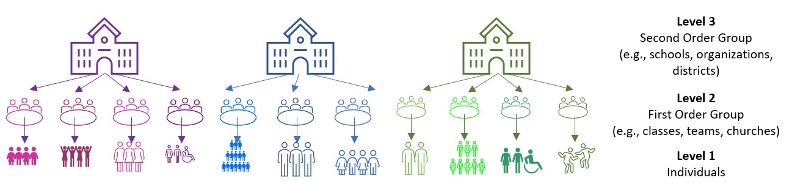
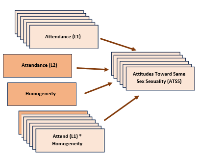

# MULTILEVEL MODELING {-#MLM}

# Nested Within Groups {#wGroups}

[Screencasted Lecture Link](https://youtube.com/playlist?list=PLtz5cFLQl4KNx6E2pCxMBNpZiiGMGFK-R&si=4yO_n5rUq3udJPdV) 
 

```r
options(scipen=999)#eliminates scientific notation
```

This chapter provides an introduction to multilevel modeling (MLM). Known by a variety of names, MLM offers researchers the ability to manage data that is *nested* within groups (cross-sectional),  within persons (longitudinal), or both. MLM is complex and powerful. This chapter will provide an introduction and worked example of MLM when data is collected in groups (churches). At the risk of oversimplification, my goal is to make it as accessible as possible. To that end, the chapter and lecture will err on the side of application. If you are interested in the more technical details of this procedure, there are tremendous resources that far exceed my capacity and the purpose of this OER [e.g., @bryk_hierarchical_1992]. 

At the outset of this series of chapters on MLM, let me share with you why I get so excited about this statistical approach.  Remember ANOVA?  And its assumptions?  Among these were assumptions of *balanced designs* (i.e., equal cell sizes); *independence* (i.e., unless using repeated measures ANOVA, participants could not be related/connected in other ways); and to rule out confounds, *random assignment* to treatment conditions. Unless the data to be analyzed comes from an experiment, these are difficult conditions to meet. When we use a multilevel approach to analyze cross-sectional research where there is clear nesting in groups (e.g., teams, classrooms) we are no longer bound by these restrictive assumptions. Presuming there is an adequate sample [@bell_how_2014 suggested a minimum of 10 clusters with 5 members each],even the group size can vary. Of course there are other benefits and challenges that we will address throughout the series of chapters.

## Navigating this Lesson

There is about 1 hour and 30 minutes of lecture.  If you work through the materials with me it would be plan for an additional 2 hours.

While the majority of R objects and data you will need are created within the R script that sources the chapter, occasionally there are some that cannot be created from within the R framework. Additionally, sometimes links fail.  All original materials are provided at the [Github site](https://github.com/lhbikos/ReC_CPA) that hosts the book. More detailed guidelines for ways to access all these materials are provided in the OER's [introduction](#ReCintro)

### Learning Objectives

Learning objectives from this lecture include the following:

* Recognize when MLM is appropriate as an analytic strategy for a particular research design and set of data.
* Distinguish between L1 and L2 variables.
* Describe the compositional effects approach to centering variables and explain how it completely captures within- and between- group variance.
* Write R script to group-mean center, grand-mean center, and aggregate L1 variables for their L2 representation.
* Utilize a sequential and systematic approach to testing a series of multilevel models.
* Create corresponding figures and tables.
* Write up the results of a cross-sectional multilevel model in APA style.

### Planning for Practice

In this chapter we offer three suggestions for practice.  Each are graded in complexity. At a minimum, we recommend that you analyze a multilevel model that contains one level-1 (within-group) predictor, one level-2 (between groups) predictor, and their interaction.

* Rework the problem in the chapter by changing the random seed in the code that simulates the data.  This should provide very minor changes to the data, but the results will likely be very similar. 
* The research vignette analyzes a number of variables, simultaneously. We selected only two for the example.  Swap out one or more variables in the multilevel model and compare your solution to the one in the chapter (and/or one you mimicked in the journal article). If you wish to increase your probability of finding statistically significant effects, look for hints in Table 2 of the [@lefevor_homonegativity_2020] research article that sources the vignettes by selecting a variable(s) with a significant relationship with your DV.
* Conduct a multilevel model with data to which you have access. This could include data you simulate on your own or from a published article.

### Readings & Resources

In preparing this chapter, I drew heavily from the following resource(s). Other resources are cited (when possible, linked) in the text with complete citations in the reference list.

* Cohen, J., Cohen, P., West, S. G., & Aiken, L. S. (2003). *Applied multiple regression/correlation analysis for the behavioral sciences, 3rd ed.* Lawrence Erlbaum Associates Publishers
* Enders, C. K., & Tofighi, D. (2007). Centering predictor variables in cross-sectional multilevel models: A new look at an old issue. *Psychological Methods, 12*(2), 121-138. doi:10.1037/1082-989X.12.2.121
* McCoach, D. B., & Adelson, J. L. (2010). Dealing with dependence (Part I): Understanding the effects of clustered data. *Gifted Child Quarterly, 54*(2), 152–155. https://doi-org.ezproxy.spu.edu/10.1177/0016986210363076
* McCoach, D. B. (2010).  Dealing with dependence (Part II):  A gentle introduction to hierarchical linear modeling. *Gifted Child Quarterly, 54*(3), 252-256. doi: 10.1177/0016986210373475
* Lefevor, G. T., Paiz, J. Y., Stone, W.-M., Huynh, K. D., Virk, H. E., Sorrell, S. A., & Gage, S. E. (2020). Homonegativity and the Black church: Is congregational variation the missing link? *The Counseling Psychologist, 48*(6), 826–851. https://doi-org.ezproxy.spu.edu/10.1177/0011000020918558

### Packages

The script below will (a) check to see if the following packages are installed on your computer and, if not (b) install them.

```r
#removing hashtags will check to see if the package is installed and if not, will install it
#if(!require(lme4)){install.packages("lme4")}
#if(!require(nlme)){install.packages("nlme")}
#if(!require(sjstats)){install.packages("sjstats")}
#if(!require(tidyverse)){install.packages("tidyverse")}
#if(!require(psych)){install.packages("psych")}
#if(!require(lmerTest)){install.packages("lmerTest")}
#if(!require(robumeta)){install.packages("robumeta")}
#if(!require(sjstats)){install.packages("sjstats")}
#if(!require(PerformanceAnalytics)){install.packages("PerformanceAnalytics")}
```

## Multilevel Modeling:  Nested within Groups

### The dilemma of aggregation and disaggregation

It was the 1980s and researchers were studying group attitudes and were confused about how to analyze the data [@singer_applied_2003].They ran into difficulties with *aggregation* and asked, "Do we aggregate the data" by summing individuals within groups (i.e., giving everyone in the group the same score)?" Or, "Do we disaggregate the data" by ignoring group membership and analyzing the individual cases.

Problems with aggregation (using group means) include the following:

* Regression equations describe the relationship of means of predictors in individual clusters to the mean of the dependent variable in those clusters.
* There is a decrease in variability regarding the the ability to explain what is going on with the dependent variable.
* It can be misleading to generalize from the group level variable to the individual.  This is termed the *ecological fallacy* (also known as the *Robinson Effect*). 

Problems with disaggregation (using individual scores and ignoring the group influence) include:

* Results that ignore group level variables.
* There is often clustering among group members. 
* Clustering (i.e., group effects, dependency in the data) violates the assumption of independence for most ANOVA and regression statistics.
* We are more likely to make a  Type I error (i.e., declaring a statistically significant relationship when there is none) because
  * Alpha inflation
  * Standard error is based on N; standard errors are smaller than they should be.
  * Dependency in the data may reduce within group variance.

### Multilevel modeling: The definitional and conceptual

Multilevel modeling (MLM) has a host of names:

* Hierarchical linear modeling (but this also references a specific, fee-for-use, package)
* Mixed effects
* Linear mixed effects (LME -- you'll see this acronym in our R package and functions)
* Random coefficient regression (RCR)
* Random coefficient modeling (RCM)

By whatever name we call it, the *random coefficient regression model* is an alternative to ordinary least squares regression (OLS) that is structured to handle clustered data. Random coefficient regression differs from OLS regression in the assumptions made about the nature of the regression coefficients and the correlational structure of the individual observations.

Highlights of RC regression models, 

* individuals are clustered into groups 
  * and we can have multiple levels of measurement at the individual and group levels),
* the equations are mathematically different from OLS regression, 
* they can be applied cross-sectional and repeated measures designs. 

In this chapter our focus is on the cross-sectional, nested analyses.



“Levels” on these figures are important and represent the hierarchical structure of RCR.

* Level 1:  lowest level of aggregation, the individual, a micro-level
* Level 2: cluster or group level, the macro-level
* Levels 3 +:  higher-order clustering; beyond the scope of this class (and instructor).

As we work through this chapter we will be reviewing essential elements to MLM.  These include:

* Levels
* Fixed and random effects
* Variance components
* Centering to maximize interpretability and a complete accounting of variance
* Equations

Because these are complicated, it makes sense to me to start introduce the research vignette a little earlier than usual so that we have a concrete example for locating these concepts. First, though, let's look at how we manage an MLM analysis.

## Workflow


## Research Vignette

The research vignette comes from Lefevor et al.'s [-@lefevor_homonegativity_2020] article, "Homonegativity and the Black Church:  Is congregational variation the missing link?"  The article was published in *The Counseling Psychlogist*. I am so grateful to the authors who provided their R script. It was a terrific source of consultation as I planned the chapter.

Data is from congregants in 15 Black churches (with at least 200 members in each church) in a mid-sized city in the South. Congregational participation ranged from 2 to 28. The research design allows the analysts to identify individual level and contextual (i.e., congregational) level predictors of attitudes toward same-sex sexuality.

The research question asks, what individual-level and church-level predictors influence an individual's attitudes toward same-sex sexuality (i.e., homonegativity).



In the figure, the stack boxes represent L1 variables. In this example it means that the variable is from the individual congregant, clustered within the church. That is, data regarding attendance and ATSS was provided by each individual congregant.  The single boxes represent church-level (L2) variables. In this example, LeFevor et al. (2020) provided a congregation level representation of attendance (i.e., church-wide attendance) racial homogeneity of the church. 

Variables used in the study included:

* **Attitudes toward Same Sex Sexuality(ATSS/homonegativity)**:  The short form of the Attitudes Toward Lesbian Women and Gay Men Scale [@herek_assessing_1994] is 10 items on a 5-point likert scale of agreement. Sample items include, "Sex between two men is just plan wrong" and "Lesbians are sick." Higher scores represent more homonegative views.

* **Religiousness** Organizational religiousness was assessed through with the single-item organizational religious activity scale of the Duke University Religiousness Index [@koenig_duke_2010]. The item asks participants to report how often they attend church or other religious meetings on a 9-point Likert-type scale ranging from 0 (*never*) to 9 (*several times a week*). Higher scores indicate more frequent attendance.

* **Racial homogeneity** This was calculated by estimating the proportion of respondents from a single race prior to excluding those who did not meet the inclusion criteria (e.g., one criteria was that the participants self-identify as Black).

* **Age, Education, Gender**:  Along with other demographic and background variables, age, education, and gender were collected. Gender is dichotomous with 0 = woman and 1 = man.

In the article, Lefevor [-@lefevor_homonegativity_2020] and colleagues predict attitudes toward same-sex sexuality from a number of person-level (L1) and congregation-level (L2) predictors. Because this is an instructional article, we are choosing one each:  attendance (used as both L1 and L2) and homogeneity of the congregation (L2). Although the authors do not include cross-level (i.e., an interaction between L1 and L2 variables), we will test a cross-level interaction of attendance*homogeneity.

### Simulating the data from the journal article

Muldoon [-@muldoon_simulate_2018] has provided clear and intuitive instructions for simulating multilevel data. 


Simulating the data gives us some information about the nature of MLM.  You can see that we have identified:

* the number of churches
* the number of members from each church
  * Note:  in this simulation we have the benefit of non-missing data (unless we specify it)
* the b weights (and ranges) reported in the Lefevor et al. [-@lefevor_homonegativity_2020] article
* the mean and standard deviation of the dependent variable

Further down in the code, we feed R the regression equation.

```r
set.seed(200407)
n_church = 15
n_mbrs = 15
b0 = 3.43 #intercept for ATSS
b1 = .14 #b weight for L1 var gender
b2 = .00 #b weight or L1 var age
b3 = .02 #b weight for L1 var education
b4 = .10 #b weight for the L1 variable religious attendance
b5 = -.89 #b weight for the L2 variable, racial homogeneity
( Gender = runif(n_church*n_mbrs, -1.09, 1.67)) #calc L1 gender
( Age = runif(n_church*n_mbrs, 6.44, 93.93)) #calc L1 age
( Education = runif(n_church*n_mbrs, 0, 8.46)) #calc L1 education
( Attendance = runif(n_church*n_mbrs,5.11, 10.39)) #calc L1 attendance by grabbing  its M +/- 3SD
( Homogeneity = rep (runif(n_church, .37, 1.45), each = n_mbrs)) #calc L2 homogeneity by grabbing  its M +/- 3SD
mu = 3.39 
sds = .64 #this is the SD of the DV
sd = 1 #this is the observation-level random effect variance that we set at 1

( church = rep(LETTERS[1:n_church], each = n_mbrs) )
#( mbrs = numbers[1:(n_church*n_mbrs)] )
( churcheff = rnorm(n_church, 0, sds) )
( churcheff = rep(churcheff, each = n_mbrs) )
( mbrseff = rnorm(n_church*n_mbrs, 0, sd) )
( ATSS = b0 + b1*Gender + b2*Age + b3*Education + b4*Attendance + b5*Homogeneity + churcheff + mbrseff)
( dat = data.frame(church, churcheff, mbrseff, Gender, Age, Education, Attendance, Homogeneity, ATSS) )

library(dplyr)
```

```
## 
## Attaching package: 'dplyr'
```

```
## The following objects are masked from 'package:stats':
## 
##     filter, lag
```

```
## The following objects are masked from 'package:base':
## 
##     intersect, setdiff, setequal, union
```

```r
dat <- dat %>% mutate(ID = row_number())
#moving the ID number to the first column; requires 
dat <- dat%>%select(ID, everything())

Lefevor2020 <- dat%>%
  select(ID, church, Gender, Age, Education, Attendance, Homogeneity, ATSS)
#rounded gender into dichotomous variable
Lefevor2020$Female0 <- round(Lefevor2020$Gender, 0)
Lefevor2020$Female0 <- as.integer(Lefevor2020$Gender)
Lefevor2020$Female0 <- plyr::mapvalues(Lefevor2020$Female0, from = c(-1, 0, 1), to = c(0, 0, 1))

#( dat$ATSS = with(dat, mu + churcheff + mbrseff ) )
```
Below is script that will allow you to export and reimport the dataset we just simulated. This may come in handy if you wish to start from the simulated data (and not wait for the simulation each time) and/or if you would like to use the dataset for further practice.


```r
write.table(Lefevor2020, file="Lefevor2020.csv", sep=",", col.names=TRUE, row.names=FALSE)
Lefevor2020 <- read.csv ("Lefevor2020.csv", head = TRUE, sep = ",")
```

Because we are simulating data, we have the benefit of no missingness and relatively normal distributions. Because of these reasons we will skip the formal data preparation stage.  We will, though, take a look at our characteristics and bivariate relations of our three variables of interest.

## Working the Problem (and learning MLM)

### Data diagnostics

Multilevel modeling holds assumptions that will likely be familiar to use:

* linearity
* homogeneity of variance
* normal distribution of the model's residuals

Because I cover strategies for evaluating these assumptions in the [Data Dx](https://lhbikos.github.io/ReC_MultivModel/DataDx.html) chapter, I won't review them here.  Another helpful resource for reviewing assumptions related to MLM is provided in by [Michael Palmeri](https://ademos.people.uic.edu/Chapter18.html#6_assumptions).

We should, though take a look at the relations between the variables in our model in their *natural* form.  In this case *natural* refers to their scored, ready-to-be-analyzed (but not further centered).


```r
library(psych)
psych::pairs.panels(Lefevor2020[c("ATSS", "Attendance", "Homogeneity")], stars = TRUE)
```

<!-- -->
What do we observe in this preliminary, zero-ordered relationship?

* As racial homogeneity increases, homonegativity decreases. 
  * Curiously, there is a non-linear curve between those two variables -- but that seems to be "pulled" by an outlier(?) in the lower right quandrant of the ATSS/Homonegativity relationship.
* ATTS appears to be normally distributed
* Attendance has a flat distribution

We can learn more by examining descriptive statistics.


```r
psych::describe(Lefevor2020[c("ATSS", "Attendance", "Homogeneity")])
```

```
##             vars   n mean   sd median trimmed  mad   min   max range  skew
## ATSS           1 225 3.32 1.18   3.43    3.34 1.11 -1.23  6.45  7.69 -0.30
## Attendance     2 225 7.52 1.52   7.36    7.47 1.84  5.12 10.35  5.22  0.24
## Homogeneity    3 225 1.04 0.25   1.14    1.04 0.34  0.69  1.40  0.71 -0.04
##             kurtosis   se
## ATSS            0.27 0.08
## Attendance     -1.19 0.10
## Homogeneity    -1.60 0.02
```

These descriptives allow us a glimpse of the means and standard deviations of our study variables.  Additionally, we can look at skew and kurtosis to see that our variables are within the normal ranges (i.e., below 3 for skew; below 8 for kurtosis [@kline_principles_2016]).

The *misty* package has some tools specific for preliminary statistics associated with multilevel models.

```r
misty::multilevel.descript(Lefevor2020[, c("ATSS", "Attendance", "Homogeneity")],
               cluster = Lefevor2020$church)
```

```
##  Multilevel Descriptive Statistics
## 
##                          ATSS Attendance Homogeneity
##   No. of cases            225        225         225
##   No. of missing values     0          0           0
##                                                     
##   No. of clusters          15         15          15
##   Average cluster size  15.00      15.00       15.00
##   SD cluster size        0.00       0.00        0.00
##   Min cluster size         15         15          15
##   Max cluster size         15         15          15
##                                                     
##   Mean                   3.32       7.52        1.04
##   Variance Within        1.13       2.30            
##   Variance Between       0.29       0.00        0.07
##   ICC(1)                0.205      0.000            
##   ICC(2)                0.795      0.000            
##                                                     
##   Design effect          3.87       1.00            
##   Design effect sqrt     1.97       1.00            
##   Effective sample size 58.09     225.00
```
From this table of descriptives we learn that we have 225 congregants who were affiliated with 15 churches, for an average of 15 individuals per cluster.  We can also see the means for our three variables:  ATSS, Attendance, Homogeneity.

A multilevel correlation matrix can be useful in helping us understand the correlations of our level 1 variables. Today, this is not converging so I have hashtagged it out.

```r
corrmatrix <- misty::multilevel.cor(Lefevor2020[, c("ATSS", "Attendance")],
               cluster = Lefevor2020$church, split=FALSE, output = TRUE, write = "MLMcorr.xlsx", print = c("cor", "p"), digits = 3, missing = "listwise")
```

```
## Warning: Some estimated variances of the observed variables at the Between
## level are negative.
```

```
##  Within-Group and Between-Group Correlation Matrix
##                                             
##   lavaan 0.6.16                             
##                                             
##    Estimator                        ML      
##    Standard Errors        Conventional      
##    Missing Data                   None      
##                                             
##                                   Used Total
##    Number of Observations          225   225
##    Number of Clusters               15      
## 
##                ATSS Attendance
##    ATSS                 -0.427
##    Attendance 0.141           
## 
##  Significance Value (p-value)
## 
##                ATSS Attendance
##    ATSS                  0.331
##    Attendance 0.037           
## 
##   Adjustment for multiple testing: none
## 
##  Note. n(within) = 225, n(between) = 15 
##        Lower triangular: Within-Group, Upper triangular: Between-Group
```

```r
corrmatrix
```

```
##  Within-Group and Between-Group Correlation Matrix
##                                             
##   lavaan 0.6.16                             
##                                             
##    Estimator                        ML      
##    Standard Errors        Conventional      
##    Missing Data                   None      
##                                             
##                                   Used Total
##    Number of Observations          225   225
##    Number of Clusters               15      
## 
##                ATSS Attendance
##    ATSS                 -0.427
##    Attendance 0.141           
## 
##  Significance Value (p-value)
## 
##                ATSS Attendance
##    ATSS                  0.331
##    Attendance 0.037           
## 
##   Adjustment for multiple testing: none
## 
##  Note. n(within) = 225, n(between) = 15 
##        Lower triangular: Within-Group, Upper triangular: Between-Group
```

### Levels 

*Levels* are a critical component of MLM. In the context of MLM models of nesting within groups/clusters (e.g., cross-sectional MLM):

* Level 1 (L1) variables "belong to the person"
  * Age, race, attitudinal or behavioral assessment 
* Level 2 (L2) variables "belong to the group/cluster" 
  * Leader characteristic, economic indicator that is unique to the group/cluster
  * Aggregate/composite representation of L1 variables

In our tiny model from the Lefevor et al. [-@lefevor_homonegativity_2020] vignette:

* ATSS/homonegativity is our DV; it is an L1 observation because we are predicting individual's attitudes toward same-sex sexuality.
* Attendance is an L1 observation *when* we are using it as the individual's own church attendance.
* Attendance *will be * an L2 observation when we aggregate it an use it as a value to represent the church.
* Racial homogeneity is only entered as an L2 variable. It was collected at the individual level via self-identification of race and calculated to represent the proportion of Black individuals in the church. 


```r
head(Lefevor2020[c("church", "ATSS", "Attendance", "Homogeneity")], n = 30L)
```

```
##    church      ATSS Attendance Homogeneity
## 1       A 4.7835442   6.318674   0.7957395
## 2       A 5.3851521   9.391428   0.7957395
## 3       A 4.3722317   9.832894   0.7957395
## 4       A 4.8635210   7.721731   0.7957395
## 5       A 4.9733886   9.917289   0.7957395
## 6       A 4.3455429   8.844333   0.7957395
## 7       A 3.5357514   6.630585   0.7957395
## 8       A 4.1572480   8.111701   0.7957395
## 9       A 4.2946421   9.658424   0.7957395
## 10      A 3.9311877   5.743799   0.7957395
## 11      A 4.9380802   6.048393   0.7957395
## 12      A 4.6318423   5.908200   0.7957395
## 13      A 3.4139728   7.685524   0.7957395
## 14      A 2.6348562   6.900703   0.7957395
## 15      A 4.8415811   6.594790   0.7957395
## 16      B 0.9835024   6.176724   1.1691398
## 17      B 1.9247771   7.907341   1.1691398
## 18      B 3.7576164   5.469059   1.1691398
## 19      B 3.6992782   9.262913   1.1691398
## 20      B 2.9125454   9.001514   1.1691398
## 21      B 4.0568240   7.486189   1.1691398
## 22      B 1.2471085   9.417031   1.1691398
## 23      B 3.2280375   6.066014   1.1691398
## 24      B 3.7688923   7.413705   1.1691398
## 25      B 4.0418646   6.047803   1.1691398
## 26      B 5.4240898   7.157878   1.1691398
## 27      B 3.8355654   9.687518   1.1691398
## 28      B 2.6657722   5.972512   1.1691398
## 29      B 2.8502831   9.761905   1.1691398
## 30      B 2.8982202   9.689345   1.1691398
```
In this display of the first 30 rows, we see the data for the first two churches (i.e., A and B).  The value is (potentially) different for each individual in each church for the two L1 variables:  *ATSS*, *Attendance.* In contrast, the value of the variable is constant for the L2 variable, *Homogeneity* for churches A and B. 

### Centering

Before we continue with modeling, we need to consider *centering*. That is, we transform our predictor variables to give the intercept parameters more useful interpretations. 

While there are some general practices, there are often arguments for different approaches:

* We usually focus centering on L1 predictors.
* We usually focus centering on continuously scaled variables.
* Dichotomous variables are considered to be centered, so long as there is a meaningful 0 (e.g., control group = 0; treatment group = 1), many do not further center.
  * Newsom [-@newsom_centering_2019], though, argues that if a binary variable is an L1 predictor, group mean centering produces intercepts weighted by the proportion of 1 to 0 values for each group; grand mean centering provides the sample weight adjustment to make the sample mean (each group's mean) proportionate to the population (full sample) 
* Dependent variables are generally not centered

we generally consider three centering strategies:

The **natural metric** is ideal if the variable has a meaningful zero point (e.g., drug dosage, time). It is more difficult when there is a non-zero metric.  When there are dichotomous variables, the natural metric works well (i.e., 0 = control group, 1 = treatment group).  The natural metric is an acceptable choice when the interest is only on the effects of L1 variables, rather than on the effects of group-level variables.

**Grand mean centering (GCM)** involves subtracting the mean from each case's score on the variable.  The intercept is interpreted as the expected value of the DV for a person/group that is compared with all individuals/groups.
 
* Intercepts are adjusted  group means (like an ANCOVA model)
* Variance in the intercepts represents between-group variance in the adjusted means (i.e., adjusted for L1 predictors)
* The effects of L1 predictors are partialed out (controlled for) of the between-group variance
* GCM is most useful when we are interested in
  * L2 predictors with L1 covariates
  * Interactions specified L2
* GCM is a good choice when the primary interest is on the effects of L2 variables, controlling for the L1 predictors.

**Group mean centering** or **Centering within Context (CWC)** involves subtracting the mean of the individual’s group from each score. The L1 intercept is interpreted as the expected mean on the DV for the person’s group. Group mean centering/CWC:

* Provides a measure of the IV that accounts for one’s relative standing within the group
* Removes between-group variability from the model (deviations rom the group means are now the predictors)
  * If we only use group mean centering (CWC), we lose information about between-group differences
* Assumes that relative standing within the group is an important factor
* Is most useful when we are interested in
  * Relations among L1 variables
  * Interactions among L1 variables
  * Interactions between L1 and L2 variables
* CWC is an acceptable choice when the interest is only on the effects of L1 variables, rather than on the effects of group-level variables because it provides unbiased estimates of the pooled within group effect of an individual variable.

In the case of making centering choices with our variables, we are must think about the *frog pond effect*.  That is, for the same size frog, the experience of being in a pond with big frogs may be different from being in a pond with small frogs.  When we consider our present research vignette, we might ask, 

* Does the effect of church attendance on ATSS depend only on the individual's own church attendance. Or,
* Does the overall church attendance ("size" of the pond) also related to ATSS?

**Compositional effects** [@enders_centering_2007] involves transforming the natural metric of the score into a group-mean centered (CWC) variable at L1 and a group mean **aggregate** at L2. Both the CWC/L1 and aggregate/L2 are entered into the MLM. 

* When the aggregate is added back in at L2, we get *direct* estimates of both the within- and between- group effects through group-mean centering
* We term it *compositional effects* because it represents the difference between the contextual-level effect and the person-level predictor.
* This is a great strategy when the interest is on distinguishing individual effects of variables (e.g., church attendance) from group-level effects of that same variable (e.g., overall church attendance).

Following the Lefevor and colleagues' [-@lefevor_homonegativity_2020] example, we will use the *compositional effects* approach with our data. The *group.center()* function in the R package, *robumeta* will group mean center (CWC) variables.  All we need to do is identify the clustering variable in our case, "church."

Similarly, *robumeta*'s *group.mean* function will aggregate variables at the group's mean.  


```r
library(robumeta)
Lefevor2020$AttendL1 <- as.numeric(group.center(Lefevor2020$Attendance, Lefevor2020$church))#centered within context (group mean centering)
Lefevor2020$AttendL2 <- as.numeric(group.mean(Lefevor2020$Attendance, Lefevor2020$church))#aggregated at group mean
```


```r
head(Lefevor2020[c("church", "ATSS", "Attendance", "AttendL1", "AttendL2", "Homogeneity")], n = 30L)
```

```
##    church      ATSS Attendance     AttendL1 AttendL2 Homogeneity
## 1       A 4.7835442   6.318674 -1.368556846 7.687231   0.7957395
## 2       A 5.3851521   9.391428  1.704196481 7.687231   0.7957395
## 3       A 4.3722317   9.832894  2.145662408 7.687231   0.7957395
## 4       A 4.8635210   7.721731  0.034499326 7.687231   0.7957395
## 5       A 4.9733886   9.917289  2.230057976 7.687231   0.7957395
## 6       A 4.3455429   8.844333  1.157102115 7.687231   0.7957395
## 7       A 3.5357514   6.630585 -1.056646112 7.687231   0.7957395
## 8       A 4.1572480   8.111701  0.424469781 7.687231   0.7957395
## 9       A 4.2946421   9.658424  1.971192960 7.687231   0.7957395
## 10      A 3.9311877   5.743799 -1.943432538 7.687231   0.7957395
## 11      A 4.9380802   6.048393 -1.638837820 7.687231   0.7957395
## 12      A 4.6318423   5.908200 -1.779031167 7.687231   0.7957395
## 13      A 3.4139728   7.685524 -0.001707147 7.687231   0.7957395
## 14      A 2.6348562   6.900703 -0.786528003 7.687231   0.7957395
## 15      A 4.8415811   6.594790 -1.092441414 7.687231   0.7957395
## 16      B 0.9835024   6.176724 -1.591106297 7.767830   1.1691398
## 17      B 1.9247771   7.907341  0.139510679 7.767830   1.1691398
## 18      B 3.7576164   5.469059 -2.298771340 7.767830   1.1691398
## 19      B 3.6992782   9.262913  1.495083015 7.767830   1.1691398
## 20      B 2.9125454   9.001514  1.233683676 7.767830   1.1691398
## 21      B 4.0568240   7.486189 -0.281641399 7.767830   1.1691398
## 22      B 1.2471085   9.417031  1.649200996 7.767830   1.1691398
## 23      B 3.2280375   6.066014 -1.701816135 7.767830   1.1691398
## 24      B 3.7688923   7.413705 -0.354124518 7.767830   1.1691398
## 25      B 4.0418646   6.047803 -1.720027268 7.767830   1.1691398
## 26      B 5.4240898   7.157878 -0.609951815 7.767830   1.1691398
## 27      B 3.8355654   9.687518  1.919687868 7.767830   1.1691398
## 28      B 2.6657722   5.972512 -1.795317977 7.767830   1.1691398
## 29      B 2.8502831   9.761905  1.994075223 7.767830   1.1691398
## 30      B 2.8982202   9.689345  1.921515292 7.767830   1.1691398
```

If we look again at the first two churches, we can see the 

* Natural metric (ATSS, Attendance) which differs for each person across all churches
  * This would be an L1 variable
* Group-mean centering (CWC; ATSSL2) which is identifiable because if you added up each of the values in each of the churches, the sum would be zero for each church
  * This would be an L1 variable
* Aggregate group mean (AttendL2) which is identifiable because the value is constant across each of the groups
  * This would be an L2 variable
* You might notice, I didn't mention the *homogeneity* variable.  This is because it was collected and entered as an L2 variable and needs no further centering/transformation. Similarly, we typically leave the dependent variable (*ATSS*) in the natural metric.

We can also see the effects of centering in our descriptives.

```r
psych::describe(Lefevor2020[c("ATSS", "Attendance", "AttendL1", "AttendL2", "Homogeneity")])
```

```
##             vars   n mean   sd median trimmed  mad   min   max range  skew
## ATSS           1 225 3.32 1.18   3.43    3.34 1.11 -1.23  6.45  7.69 -0.30
## Attendance     2 225 7.52 1.52   7.36    7.47 1.84  5.12 10.35  5.22  0.24
## AttendL1       3 225 0.00 1.48  -0.01   -0.02 1.88 -2.93  3.01  5.94  0.10
## AttendL2       4 225 7.52 0.32   7.55    7.52 0.33  7.01  8.06  1.05  0.02
## Homogeneity    5 225 1.04 0.25   1.14    1.04 0.34  0.69  1.40  0.71 -0.04
##             kurtosis   se
## ATSS            0.27 0.08
## Attendance     -1.19 0.10
## AttendL1       -1.14 0.10
## AttendL2       -0.93 0.02
## Homogeneity    -1.60 0.02
```
Note that the mean for the ATTSL1 and AttendL1 variables are now zero, while the aggregated group means are equal to the mean of the natural metric.

Looking at the descriptives for each church also helps clarify what we have done.


```r
psych::describeBy(ATSS + Attendance + AttendL1 + AttendL2 + Homogeneity ~ church, data = Lefevor2020)
```

```
## 
##  Descriptive statistics by group 
## church: A
##             vars  n mean   sd median trimmed  mad   min  max range  skew
## ATSS           1 15 4.34 0.72   4.37    4.39 0.70  2.63 5.39  2.75 -0.78
## Attendance     2 15 7.69 1.52   7.69    7.67 2.03  5.74 9.92  4.17  0.23
## AttendL1       3 15 0.00 1.52   0.00   -0.02 2.03 -1.94 2.23  4.17  0.23
## AttendL2       4 15 7.69 0.00   7.69    7.69 0.00  7.69 7.69  0.00   NaN
## Homogeneity    5 15 0.80 0.00   0.80    0.80 0.00  0.80 0.80  0.00   NaN
##             kurtosis   se
## ATSS           -0.21 0.19
## Attendance     -1.63 0.39
## AttendL1       -1.63 0.39
## AttendL2         NaN 0.00
## Homogeneity      NaN 0.00
## ------------------------------------------------------------ 
## church: B
##             vars  n mean   sd median trimmed  mad   min  max range  skew
## ATSS           1 15 3.15 1.15   3.23    3.15 0.83  0.98 5.42  4.44 -0.22
## Attendance     2 15 7.77 1.59   7.49    7.79 2.24  5.47 9.76  4.29 -0.01
## AttendL1       3 15 0.00 1.59  -0.28    0.02 2.24 -2.30 1.99  4.29 -0.01
## AttendL2       4 15 7.77 0.00   7.77    7.77 0.00  7.77 7.77  0.00   NaN
## Homogeneity    5 15 1.17 0.00   1.17    1.17 0.00  1.17 1.17  0.00   NaN
##             kurtosis   se
## ATSS           -0.50 0.30
## Attendance     -1.75 0.41
## AttendL1       -1.75 0.41
## AttendL2         NaN 0.00
## Homogeneity      NaN 0.00
## ------------------------------------------------------------ 
## church: C
##             vars  n mean   sd median trimmed  mad   min  max range skew
## ATSS           1 15 2.93 0.92   2.98    2.90 1.14  1.68 4.58  2.91 0.14
## Attendance     2 15 7.01 1.01   6.78    6.95 0.87  5.83 8.96  3.13 0.75
## AttendL1       3 15 0.00 1.01  -0.22   -0.06 0.87 -1.18 1.95  3.13 0.75
## AttendL2       4 15 7.01 0.00   7.01    7.01 0.00  7.01 7.01  0.00  NaN
## Homogeneity    5 15 1.22 0.00   1.22    1.22 0.00  1.22 1.22  0.00  NaN
##             kurtosis   se
## ATSS           -1.20 0.24
## Attendance     -0.88 0.26
## AttendL1       -0.88 0.26
## AttendL2         NaN 0.00
## Homogeneity      NaN 0.00
## ------------------------------------------------------------ 
## church: D
##             vars  n mean   sd median trimmed  mad   min   max range  skew
## ATSS           1 15 2.62 1.07   2.79    2.64 1.43  0.88  4.10  3.22 -0.21
## Attendance     2 15 8.06 1.85   8.41    8.12 2.27  5.12 10.20  5.08 -0.29
## AttendL1       3 15 0.00 1.85   0.36    0.06 2.27 -2.93  2.14  5.08 -0.29
## AttendL2       4 15 8.06 0.00   8.06    8.06 0.00  8.06  8.06  0.00   NaN
## Homogeneity    5 15 1.18 0.00   1.18    1.18 0.00  1.18  1.18  0.00   NaN
##             kurtosis   se
## ATSS           -1.54 0.28
## Attendance     -1.71 0.48
## AttendL1       -1.71 0.48
## AttendL2         NaN 0.00
## Homogeneity      NaN 0.00
## ------------------------------------------------------------ 
## church: E
##             vars  n mean   sd median trimmed  mad   min   max range  skew
## ATSS           1 15 3.42 0.92   3.57    3.41 0.49  1.70  5.33  3.63 -0.05
## Attendance     2 15 8.00 1.70   7.95    8.02 2.27  5.50 10.33  4.82 -0.01
## AttendL1       3 15 0.00 1.70  -0.05    0.01 2.27 -2.50  2.32  4.82 -0.01
## AttendL2       4 15 8.00 0.00   8.00    8.00 0.00  8.00  8.00  0.00   NaN
## Homogeneity    5 15 1.32 0.00   1.32    1.32 0.00  1.32  1.32  0.00   NaN
##             kurtosis   se
## ATSS           -0.49 0.24
## Attendance     -1.56 0.44
## AttendL1       -1.56 0.44
## AttendL2         NaN 0.00
## Homogeneity      NaN 0.00
## ------------------------------------------------------------ 
## church: F
##             vars  n mean   sd median trimmed  mad   min  max range skew
## ATSS           1 15 3.61 1.04   3.44    3.57 0.96  2.11 5.67  3.56 0.46
## Attendance     2 15 7.27 1.18   7.27    7.19 1.04  5.68 9.90  4.22 0.69
## AttendL1       3 15 0.00 1.18   0.00   -0.08 1.04 -1.59 2.63  4.22 0.69
## AttendL2       4 15 7.27 0.00   7.27    7.27 0.00  7.27 7.27  0.00  NaN
## Homogeneity    5 15 0.93 0.00   0.93    0.93 0.00  0.93 0.93  0.00  NaN
##             kurtosis   se
## ATSS           -0.95 0.27
## Attendance     -0.33 0.30
## AttendL1       -0.33 0.30
## AttendL2         NaN 0.00
## Homogeneity      NaN 0.00
## ------------------------------------------------------------ 
## church: G
##             vars  n mean   sd median trimmed  mad   min  max range  skew
## ATSS           1 15 4.51 0.94   4.49    4.44 1.08  3.48 6.45  2.98  0.65
## Attendance     2 15 7.01 0.94   7.18    7.01 1.27  5.50 8.47  2.96 -0.05
## AttendL1       3 15 0.00 0.94   0.17    0.00 1.27 -1.50 1.46  2.96 -0.05
## AttendL2       4 15 7.01 0.00   7.01    7.01 0.00  7.01 7.01  0.00   NaN
## Homogeneity    5 15 0.71 0.00   0.71    0.71 0.00  0.71 0.71  0.00   NaN
##             kurtosis   se
## ATSS           -0.94 0.24
## Attendance     -1.35 0.24
## AttendL1       -1.35 0.24
## AttendL2         NaN 0.00
## Homogeneity      NaN 0.00
## ------------------------------------------------------------ 
## church: H
##             vars  n mean   sd median trimmed  mad   min   max range  skew
## ATSS           1 15 3.55 1.19   3.48    3.55 0.84  1.20  5.83  4.63 -0.17
## Attendance     2 15 7.35 1.70   7.57    7.30 2.45  5.13 10.20  5.07  0.23
## AttendL1       3 15 0.00 1.70   0.22   -0.05 2.45 -2.22  2.86  5.07  0.23
## AttendL2       4 15 7.35 0.00   7.35    7.35 0.00  7.35  7.35  0.00   NaN
## Homogeneity    5 15 0.82 0.00   0.82    0.82 0.00  0.82  0.82  0.00   NaN
##             kurtosis   se
## ATSS           -0.43 0.31
## Attendance     -1.46 0.44
## AttendL1       -1.46 0.44
## AttendL2         NaN 0.00
## Homogeneity      NaN 0.00
## ------------------------------------------------------------ 
## church: I
##             vars  n mean   sd median trimmed  mad   min   max range skew
## ATSS           1 15 2.71 1.13   2.73    2.71 0.83  0.68  4.76  4.08 0.16
## Attendance     2 15 7.26 1.63   7.25    7.20 2.26  5.14 10.17  5.03 0.12
## AttendL1       3 15 0.00 1.63  -0.01   -0.06 2.26 -2.12  2.90  5.03 0.12
## AttendL2       4 15 7.26 0.00   7.26    7.26 0.00  7.26  7.26  0.00  NaN
## Homogeneity    5 15 1.28 0.00   1.28    1.28 0.00  1.28  1.28  0.00  NaN
##             kurtosis   se
## ATSS           -0.61 0.29
## Attendance     -1.43 0.42
## AttendL1       -1.43 0.42
## AttendL2         NaN 0.00
## Homogeneity      NaN 0.00
## ------------------------------------------------------------ 
## church: J
##             vars  n mean   sd median trimmed  mad   min   max range  skew
## ATSS           1 15 3.47 0.99   3.81    3.50 1.05  1.67  4.90  3.23 -0.44
## Attendance     2 15 7.86 1.89   7.89    7.88 2.89  5.25 10.25  5.00 -0.09
## AttendL1       3 15 0.00 1.89   0.03    0.02 2.89 -2.62  2.39  5.00 -0.09
## AttendL2       4 15 7.86 0.00   7.86    7.86 0.00  7.86  7.86  0.00   NaN
## Homogeneity    5 15 1.14 0.00   1.14    1.14 0.00  1.14  1.14  0.00   NaN
##             kurtosis   se
## ATSS           -0.94 0.26
## Attendance     -1.70 0.49
## AttendL1       -1.70 0.49
## AttendL2         NaN 0.00
## Homogeneity      NaN 0.00
## ------------------------------------------------------------ 
## church: K
##             vars  n mean   sd median trimmed  mad   min   max range skew
## ATSS           1 15 2.45 1.04   2.53    2.41 1.09  0.92  4.49  3.57 0.30
## Attendance     2 15 7.43 1.83   6.73    7.40 2.10  5.31 10.03  4.72 0.15
## AttendL1       3 15 0.00 1.83  -0.71   -0.04 2.10 -2.12  2.59  4.72 0.15
## AttendL2       4 15 7.43 0.00   7.43    7.43 0.00  7.43  7.43  0.00  NaN
## Homogeneity    5 15 1.37 0.00   1.37    1.37 0.00  1.37  1.37  0.00  NaN
##             kurtosis   se
## ATSS           -0.82 0.27
## Attendance     -1.81 0.47
## AttendL1       -1.81 0.47
## AttendL2         NaN 0.00
## Homogeneity      NaN 0.00
## ------------------------------------------------------------ 
## church: L
##             vars  n mean   sd median trimmed  mad   min  max range skew
## ATSS           1 15 2.87 0.95   2.94    2.82 1.12  1.73 4.67  2.94  0.5
## Attendance     2 15 7.68 1.27   7.54    7.69 1.36  5.57 9.71  4.14  0.1
## AttendL1       3 15 0.00 1.27  -0.15    0.01 1.36 -2.11 2.03  4.14  0.1
## AttendL2       4 15 7.68 0.00   7.68    7.68 0.00  7.68 7.68  0.00  NaN
## Homogeneity    5 15 1.40 0.00   1.40    1.40 0.00  1.40 1.40  0.00  NaN
##             kurtosis   se
## ATSS           -1.06 0.25
## Attendance     -1.33 0.33
## AttendL1       -1.33 0.33
## AttendL2         NaN 0.00
## Homogeneity      NaN 0.00
## ------------------------------------------------------------ 
## church: M
##             vars  n mean   sd median trimmed  mad   min   max range  skew
## ATSS           1 15 3.72 0.79   3.93    3.72 0.73  2.34  5.06  2.72 -0.27
## Attendance     2 15 7.56 1.52   7.80    7.52 1.94  5.45 10.07  4.63  0.12
## AttendL1       3 15 0.00 1.52   0.25   -0.03 1.94 -2.11  2.52  4.63  0.12
## AttendL2       4 15 7.56 0.00   7.56    7.56 0.00  7.56  7.56  0.00   NaN
## Homogeneity    5 15 0.81 0.00   0.81    0.81 0.00  0.81  0.81  0.00   NaN
##             kurtosis   se
## ATSS           -1.06 0.20
## Attendance     -1.42 0.39
## AttendL1       -1.42 0.39
## AttendL2         NaN 0.00
## Homogeneity      NaN 0.00
## ------------------------------------------------------------ 
## church: N
##             vars  n mean   sd median trimmed  mad   min  max range  skew
## ATSS           1 15 2.82 1.79   3.11    2.91 1.51 -1.23 5.61  6.84 -0.48
## Attendance     2 15 7.55 1.44   7.66    7.55 1.08  5.24 9.79  4.55 -0.10
## AttendL1       3 15 0.00 1.44   0.11    0.01 1.08 -2.31 2.24  4.55 -0.10
## AttendL2       4 15 7.55 0.00   7.55    7.55 0.00  7.55 7.55  0.00   NaN
## Homogeneity    5 15 0.69 0.00   0.69    0.69 0.00  0.69 0.69  0.00   NaN
##             kurtosis   se
## ATSS           -0.38 0.46
## Attendance     -1.27 0.37
## AttendL1       -1.27 0.37
## AttendL2         NaN 0.00
## Homogeneity      NaN 0.00
## ------------------------------------------------------------ 
## church: O
##             vars  n mean   sd median trimmed  mad   min   max range  skew
## ATSS           1 15 3.65 0.91   3.75    3.67 0.63  1.71  5.28  3.57 -0.67
## Attendance     2 15 7.34 1.53   6.68    7.23 1.31  5.70 10.35  4.64  0.58
## AttendL1       3 15 0.00 1.53  -0.65   -0.11 1.31 -1.63  3.01  4.64  0.58
## AttendL2       4 15 7.34 0.00   7.34    7.34 0.00  7.34  7.34  0.00   NaN
## Homogeneity    5 15 0.79 0.00   0.79    0.79 0.00  0.79  0.79  0.00   NaN
##             kurtosis   se
## ATSS            0.11 0.23
## Attendance     -1.16 0.40
## AttendL1       -1.16 0.40
## AttendL2         NaN 0.00
## Homogeneity      NaN 0.00
```
Tables are produced for each church's data. Again, because of group-mean centering (CWC) the mean of the ATSSL1 and AttendL1 variables are 0.  The values of the ATSSL2 and AttendL1 variables equal the natural metric. These, though, are different for each of the churches.

Looking at the correlations between all forms of these variables can further help clarify why the *compositional effects* approach is useful.


```r
#Multilevel level correlation matrix
apaTables::apa.cor.table(Lefevor2020[c(
"ATSS", "Attendance", "AttendL1", "AttendL2", "Homogeneity")], show.conf.interval = FALSE, landscape = TRUE, table.number = 1, filename="ML_CorMatrix.doc")
```

```
## The ability to suppress reporting of reporting confidence intervals has been deprecated in this version.
## The function argument show.conf.interval will be removed in a later version.
```

```
## 
## 
## Table 1 
## 
## Means, standard deviations, and correlations with confidence intervals
##  
## 
##   Variable       M     SD   1            2           3           4         
##   1. ATSS        3.32  1.18                                                
##                                                                            
##   2. Attendance  7.52  1.52 .10                                            
##                             [-.03, .23]                                    
##                                                                            
##   3. AttendL1    -0.00 1.48 .12          .98**                             
##                             [-.01, .25]  [.97, .98]                        
##                                                                            
##   4. AttendL2    7.52  0.32 -.10         .21**       -.00                  
##                             [-.23, .03]  [.08, .33]  [-.13, .13]           
##                                                                            
##   5. Homogeneity 1.04  0.25 -.33**       .07         .00         .32**     
##                             [-.44, -.21] [-.07, .19] [-.13, .13] [.19, .43]
##                                                                            
## 
## Note. M and SD are used to represent mean and standard deviation, respectively.
## Values in square brackets indicate the 95% confidence interval.
## The confidence interval is a plausible range of population correlations 
## that could have caused the sample correlation (Cumming, 2014).
##  * indicates p < .05. ** indicates p < .01.
## 
```

The AttendL2 (aggregated group means) we created correlates with the Attendance (natural metric) version.  However, it has ZERO correlation with the AttendL1 (group-mean centered, CWC) version. This means that it effectively and completely separates within- and between-subjects variance.  If we enter these both into the MLM prediction equation, we will completely capture the within- and between-subjects contributions of attendance.

The compositional effects approach to representing L1 variables also works well with longitudinal MLM.

### Model Building

Multilevel modelers often approach model building in a systematic and sequential manner. This approach was true for Lefevor and colleagues [-@lefevor_homonegativity_2020] who planned a four staged approach, but stopped after three because it appeared that adding the next term would not result in model improvement.  The four planned steps include:

* Examining an intercept-only model
* Adding the L1 variables
* Adding the L2 variables
* Adding cross-level interactions

#### Model 1:  The *empty* model

This preliminary model has several names: unconditional cell means model, one-way ANOVA with random effects, intercept-only model, and empty model.  Why?  The only variable in the model is the DV. That is, it is a model with no predictors.

As you can see in the script below, we are specifying its intercept (~1).  The "*(1 | church)*" portion of the code indicates there is a random intercept with a fixed mean. That is, the formula acknowledges that the ATSS means will differ across churches. This model will have no slope.  That is, each individual score is predicted solely from the mean. In another lecture, I talk about the transition from null hypothesis statistical testing to statistical modeling. In that lecture I reflected on Cumming's [-@cumming_new_2014] notion that "even the mean is a model" -- that it explains something and not others.  In this circumstance, the mean is a model!  What is, perhaps, unique about this model is that the code below allows the mean to vary across groups.

There are two packages (*lme4*, *nlme*) that are primarily used for MLM. Because of its integration with *sjPlot::tab_model()* for amazing tables and *sjPlot::plot-Model* for interaction graphs (both of which can be used for APA style journal articles), I will teach with *lme4*.


```r
Empty <- lme4::lmer(ATSS ~ 1 + (1 | church), REML = FALSE, data = Lefevor2020)

sjPlot::tab_model(Empty,  p.style = "numeric", show.ci = FALSE, show.se = TRUE, show.df = FALSE, show.re.var = TRUE, show.aic = TRUE, show.dev = TRUE, use.viewer = TRUE, dv.labels = c("Empty"), string.est = "est", string.se = "se", string.std = "Beta", string.std_se = "std se", string.p = "p", show.std = TRUE)
```

<table style="border-collapse:collapse; border:none;">
<tr>
<th style="border-top: double; text-align:center; font-style:normal; font-weight:bold; padding:0.2cm;  text-align:left; ">&nbsp;</th>
<th colspan="5" style="border-top: double; text-align:center; font-style:normal; font-weight:bold; padding:0.2cm; ">Empty</th>
</tr>
<tr>
<td style=" text-align:center; border-bottom:1px solid; font-style:italic; font-weight:normal;  text-align:left; ">Predictors</td>
<td style=" text-align:center; border-bottom:1px solid; font-style:italic; font-weight:normal;  ">est</td>
<td style=" text-align:center; border-bottom:1px solid; font-style:italic; font-weight:normal;  ">se</td>
<td style=" text-align:center; border-bottom:1px solid; font-style:italic; font-weight:normal;  ">Beta</td>
<td style=" text-align:center; border-bottom:1px solid; font-style:italic; font-weight:normal;  ">std se</td>
<td style=" text-align:center; border-bottom:1px solid; font-style:italic; font-weight:normal;  ">p</td>
</tr>
<tr>
<td style=" padding:0.2cm; text-align:left; vertical-align:top; text-align:left; ">(Intercept)</td>
<td style=" padding:0.2cm; text-align:left; vertical-align:top; text-align:center;  ">3.32</td>
<td style=" padding:0.2cm; text-align:left; vertical-align:top; text-align:center;  ">0.15</td>
<td style=" padding:0.2cm; text-align:left; vertical-align:top; text-align:center;  ">&#45;0.00</td>
<td style=" padding:0.2cm; text-align:left; vertical-align:top; text-align:center;  ">0.13</td>
<td style=" padding:0.2cm; text-align:left; vertical-align:top; text-align:center;  "><strong>&lt;0.001</strong></td>
</tr>
<tr>
<td colspan="6" style="font-weight:bold; text-align:left; padding-top:.8em;">Random Effects</td>
</tr>

<tr>
<td style=" padding:0.2cm; text-align:left; vertical-align:top; text-align:left; padding-top:0.1cm; padding-bottom:0.1cm;">&sigma;<sup>2</sup></td>
<td style=" padding:0.2cm; text-align:left; vertical-align:top; padding-top:0.1cm; padding-bottom:0.1cm; text-align:left;" colspan="5">1.13</td>
</tr>

<tr>
<td style=" padding:0.2cm; text-align:left; vertical-align:top; text-align:left; padding-top:0.1cm; padding-bottom:0.1cm;">&tau;<sub>00</sub> <sub>church</sub></td>
<td style=" padding:0.2cm; text-align:left; vertical-align:top; padding-top:0.1cm; padding-bottom:0.1cm; text-align:left;" colspan="5">0.27</td>

<tr>
<td style=" padding:0.2cm; text-align:left; vertical-align:top; text-align:left; padding-top:0.1cm; padding-bottom:0.1cm;">ICC</td>
<td style=" padding:0.2cm; text-align:left; vertical-align:top; padding-top:0.1cm; padding-bottom:0.1cm; text-align:left;" colspan="5">0.19</td>

<tr>
<td style=" padding:0.2cm; text-align:left; vertical-align:top; text-align:left; padding-top:0.1cm; padding-bottom:0.1cm;">N <sub>church</sub></td>
<td style=" padding:0.2cm; text-align:left; vertical-align:top; padding-top:0.1cm; padding-bottom:0.1cm; text-align:left;" colspan="5">15</td>
<tr>
<td style=" padding:0.2cm; text-align:left; vertical-align:top; text-align:left; padding-top:0.1cm; padding-bottom:0.1cm; border-top:1px solid;">Observations</td>
<td style=" padding:0.2cm; text-align:left; vertical-align:top; padding-top:0.1cm; padding-bottom:0.1cm; text-align:left; border-top:1px solid;" colspan="5">225</td>
</tr>
<tr>
<td style=" padding:0.2cm; text-align:left; vertical-align:top; text-align:left; padding-top:0.1cm; padding-bottom:0.1cm;">Marginal R<sup>2</sup> / Conditional R<sup>2</sup></td>
<td style=" padding:0.2cm; text-align:left; vertical-align:top; padding-top:0.1cm; padding-bottom:0.1cm; text-align:left;" colspan="5">0.000 / 0.191</td>
</tr>
<tr>
<td style=" padding:0.2cm; text-align:left; vertical-align:top; text-align:left; padding-top:0.1cm; padding-bottom:0.1cm;">Deviance</td>
<td style=" padding:0.2cm; text-align:left; vertical-align:top; padding-top:0.1cm; padding-bottom:0.1cm; text-align:left;" colspan="5">688.730</td>
</tr>
<tr>
<td style=" padding:0.2cm; text-align:left; vertical-align:top; text-align:left; padding-top:0.1cm; padding-bottom:0.1cm;">AIC</td>
<td style=" padding:0.2cm; text-align:left; vertical-align:top; padding-top:0.1cm; padding-bottom:0.1cm; text-align:left;" colspan="5">696.669</td>
</tr>

</table>

```r
#can swap this statement with the "file = "TabMod_Table"" to get Viewer output or the outfile that you can open in Word
#file = "TabMod_Table.doc"
```

The unconditional cell means model is equivalent to a one-factor random effects ANOVA of attitudes toward same-sex sexuality as the sole factor; the 15 churches become the 15 levels of the churches factor.

With the *plot_model()* function in *sjPlot*, we can plot the random effects.  For this intercept-only model, we see the mean and range of the ATSS variable

```r
sjPlot::plot_model (Empty, type="re")
```

```
## Warning in checkMatrixPackageVersion(): Package version inconsistency detected.
## TMB was built with Matrix version 1.6.1.1
## Current Matrix version is 1.5.4.1
## Please re-install 'TMB' from source using install.packages('TMB', type = 'source') or ask CRAN for a binary version of 'TMB' matching CRAN's 'Matrix' package
```

<!-- -->

Focusing on the information in viewer, we can first check to see if things look right.  We know we have 15 churches, each with 15 observations (225), so our data is reading correctly.

The top of the output includes our *fixed effects*. In this case, we have only the intercept, its standard error, and p value. We see that across all individuals in all churches, the mean (the grand mean) of ATSS is 3.32 (this is consistent with the *M* we saw in descriptives). The values of fixed effects do not vary between L2 units. The *tab_model* viewer is very customizable; we can ask for different features.

The section of *random effects* is different from OLS. Random effects include *variance components*; these are reported here.

$\sigma^{2}$ is within-church variance; the pooled scatter of each individual's response around the church's mean.
$\tau _{00}$ is between-church variance; the scatter of each church's data around the grand mean.
The *intraclass correlation coefficient* (ICC) describes the proportion of variance that lies *between* churches. It is the essential piece of data that we need from this model.  Because the total variation in *Y* is just the sum of the within- and between- church variance components, we could have calculated this value from $\sigma^{2}$ and $\tau _{00}$.  Yet, it is handy that the *lmer()* function does it or us.


```r
.27/(1.13+.27)
```

```
## [1] 0.1928571
```
The ICC value of 0.19 means that 19% of the total variation in attitudes toward same-sex sexuality is attributable to differences between churches. The balance -- 


```r
1.00 - .19
```

```
## [1] 0.81
```
(81%) is attributable to within-church variation (or differences in people).

We will monitor these variance components to see if the terms we have added reduce the variance. They can provide some sort of guide as to whether the remaining/unaccounted for variance is within-groups (where an L1 variable could help) or between-groups (where an L2 variable might be indicated). As they approach zero, it could be there is nothing left to explain.

**Marginal** $R^2$ provides the variance provided only by the fixed effects.

**Conditional** $R^2$ provides the variance provided by both the fixed and random effects (i.e., the mean random effect variances). Thus, the conditional $R^2$ is appropriate or mixed models with random slopes or nested random effects. Already, without any predictors in the model, we have accounted for 19% of the variance.  How is this possible?  Our empty model did include the clustering/nesting in churches.  This is a random effect.

The **deviance statistic** compares log-likelihood statistics for two models at a time:  (a) the current model and (b) a saturated model (e.g., a more general model that fits the sample data perfectly).  Deviance quantifies *how much worse* the current model is  in comparison to the best possible model.  The deviance is identical to the residual sums of squares used in regression.  While you cannot directly interpret any particular deviance statistic, you can compare *nested* models; the smaller value "wins."  The deviance statistic has a number of conditions. After we evaluate several models, we can formally test to if the decrease in deviance statistic is statistically significant.

The *AIC* is another fit index. The AIC (Akaike Information Criteria) allows the comparison of the relative *goodness of fit* of models that are not nested.  That is, they can involve different sets of parameters. Like the deviance statistic, the AIC is based on the log-likelihood statistic.  Instead of using the LL itself, the AIC penalizes (e.g., decreases) the LL based on the number of parameters.  Why?  Adding parameters (even if they have no effect) *will* increase the LL statistic and decrease the deviance statistic.  *As long as two models are fit to the identical same set of data*, the AICs can be compared.  The model with the smaller information critera "wins."  There are no established criteria for determining how large the difference is for it to matter.

#### Model 2:  Adding the L1 predictor

When we add the L1 predictor(s), we add them in their group-mean centered (CWC) form. In our specific research question, we are asking, "What effect does an individual's church attendance (relative to the attendance of others at the same church) have on an individual's attitudes toward same-sex sexuality (homonegativity)?

We update our script by:

* Naming the resultant object, I've called it "Level1" because I am adding only the L1 variable.
* Adding "Level1" (in the list of models) and "Adding Level 1" (to the list of dependent variable labels) in the *sjPlot::tab_model*


```r
# MODEL 2
Level1 <- lme4::lmer(ATSS ~ AttendL1 + (1 | church), REML=FALSE, data = Lefevor2020)

sjPlot::tab_model(Empty, Level1, p.style = "numeric", show.ci = FALSE, show.df = FALSE, show.re.var = TRUE, show.aic = TRUE, show.dev = TRUE, show.se = TRUE, use.viewer = TRUE, dv.labels = c("Empty", "Adding Level1"), string.est = "est", string.se = "se", string.std = "Beta", string.std_se = "std se", string.p = "p", show.std = TRUE)
```

<table style="border-collapse:collapse; border:none;">
<tr>
<th style="border-top: double; text-align:center; font-style:normal; font-weight:bold; padding:0.2cm;  text-align:left; ">&nbsp;</th>
<th colspan="5" style="border-top: double; text-align:center; font-style:normal; font-weight:bold; padding:0.2cm; ">Empty</th>
<th colspan="5" style="border-top: double; text-align:center; font-style:normal; font-weight:bold; padding:0.2cm; ">Adding Level1</th>
</tr>
<tr>
<td style=" text-align:center; border-bottom:1px solid; font-style:italic; font-weight:normal;  text-align:left; ">Predictors</td>
<td style=" text-align:center; border-bottom:1px solid; font-style:italic; font-weight:normal;  ">est</td>
<td style=" text-align:center; border-bottom:1px solid; font-style:italic; font-weight:normal;  ">se</td>
<td style=" text-align:center; border-bottom:1px solid; font-style:italic; font-weight:normal;  ">Beta</td>
<td style=" text-align:center; border-bottom:1px solid; font-style:italic; font-weight:normal;  ">std se</td>
<td style=" text-align:center; border-bottom:1px solid; font-style:italic; font-weight:normal;  ">p</td>
<td style=" text-align:center; border-bottom:1px solid; font-style:italic; font-weight:normal;  col7">est</td>
<td style=" text-align:center; border-bottom:1px solid; font-style:italic; font-weight:normal;  col8">se</td>
<td style=" text-align:center; border-bottom:1px solid; font-style:italic; font-weight:normal;  col9">Beta</td>
<td style=" text-align:center; border-bottom:1px solid; font-style:italic; font-weight:normal;  0">std se</td>
<td style=" text-align:center; border-bottom:1px solid; font-style:italic; font-weight:normal;  1">p</td>
</tr>
<tr>
<td style=" padding:0.2cm; text-align:left; vertical-align:top; text-align:left; ">(Intercept)</td>
<td style=" padding:0.2cm; text-align:left; vertical-align:top; text-align:center;  ">3.32</td>
<td style=" padding:0.2cm; text-align:left; vertical-align:top; text-align:center;  ">0.15</td>
<td style=" padding:0.2cm; text-align:left; vertical-align:top; text-align:center;  ">&#45;0.00</td>
<td style=" padding:0.2cm; text-align:left; vertical-align:top; text-align:center;  ">0.13</td>
<td style=" padding:0.2cm; text-align:left; vertical-align:top; text-align:center;  "><strong>&lt;0.001</strong></td>
<td style=" padding:0.2cm; text-align:left; vertical-align:top; text-align:center;  col7">3.32</td>
<td style=" padding:0.2cm; text-align:left; vertical-align:top; text-align:center;  col8">0.15</td>
<td style=" padding:0.2cm; text-align:left; vertical-align:top; text-align:center;  col9">&#45;0.00</td>
<td style=" padding:0.2cm; text-align:left; vertical-align:top; text-align:center;  0">0.13</td>
<td style=" padding:0.2cm; text-align:left; vertical-align:top; text-align:center;  1"><strong>&lt;0.001</strong></td>
</tr>
<tr>
<td style=" padding:0.2cm; text-align:left; vertical-align:top; text-align:left; ">AttendL1</td>
<td style=" padding:0.2cm; text-align:left; vertical-align:top; text-align:center;  "></td>
<td style=" padding:0.2cm; text-align:left; vertical-align:top; text-align:center;  "></td>
<td style=" padding:0.2cm; text-align:left; vertical-align:top; text-align:center;  "></td>
<td style=" padding:0.2cm; text-align:left; vertical-align:top; text-align:center;  "></td>
<td style=" padding:0.2cm; text-align:left; vertical-align:top; text-align:center;  "></td>
<td style=" padding:0.2cm; text-align:left; vertical-align:top; text-align:center;  col7">0.10</td>
<td style=" padding:0.2cm; text-align:left; vertical-align:top; text-align:center;  col8">0.05</td>
<td style=" padding:0.2cm; text-align:left; vertical-align:top; text-align:center;  col9">0.12</td>
<td style=" padding:0.2cm; text-align:left; vertical-align:top; text-align:center;  0">0.06</td>
<td style=" padding:0.2cm; text-align:left; vertical-align:top; text-align:center;  1"><strong>0.041</strong></td>
</tr>
<tr>
<td colspan="11" style="font-weight:bold; text-align:left; padding-top:.8em;">Random Effects</td>
</tr>

<tr>
<td style=" padding:0.2cm; text-align:left; vertical-align:top; text-align:left; padding-top:0.1cm; padding-bottom:0.1cm;">&sigma;<sup>2</sup></td>
<td style=" padding:0.2cm; text-align:left; vertical-align:top; padding-top:0.1cm; padding-bottom:0.1cm; text-align:left;" colspan="5">1.13</td>
<td style=" padding:0.2cm; text-align:left; vertical-align:top; padding-top:0.1cm; padding-bottom:0.1cm; text-align:left;" colspan="5">1.11</td>
</tr>

<tr>
<td style=" padding:0.2cm; text-align:left; vertical-align:top; text-align:left; padding-top:0.1cm; padding-bottom:0.1cm;">&tau;<sub>00</sub></td>
<td style=" padding:0.2cm; text-align:left; vertical-align:top; padding-top:0.1cm; padding-bottom:0.1cm; text-align:left;" colspan="5">0.27 <sub>church</sub></td>
<td style=" padding:0.2cm; text-align:left; vertical-align:top; padding-top:0.1cm; padding-bottom:0.1cm; text-align:left;" colspan="5">0.27 <sub>church</sub></td>

<tr>
<td style=" padding:0.2cm; text-align:left; vertical-align:top; text-align:left; padding-top:0.1cm; padding-bottom:0.1cm;">ICC</td>
<td style=" padding:0.2cm; text-align:left; vertical-align:top; padding-top:0.1cm; padding-bottom:0.1cm; text-align:left;" colspan="5">0.19</td>
<td style=" padding:0.2cm; text-align:left; vertical-align:top; padding-top:0.1cm; padding-bottom:0.1cm; text-align:left;" colspan="5">0.20</td>

<tr>
<td style=" padding:0.2cm; text-align:left; vertical-align:top; text-align:left; padding-top:0.1cm; padding-bottom:0.1cm;">N</td>
<td style=" padding:0.2cm; text-align:left; vertical-align:top; padding-top:0.1cm; padding-bottom:0.1cm; text-align:left;" colspan="5">15 <sub>church</sub></td>
<td style=" padding:0.2cm; text-align:left; vertical-align:top; padding-top:0.1cm; padding-bottom:0.1cm; text-align:left;" colspan="5">15 <sub>church</sub></td>
<tr>
<td style=" padding:0.2cm; text-align:left; vertical-align:top; text-align:left; padding-top:0.1cm; padding-bottom:0.1cm; border-top:1px solid;">Observations</td>
<td style=" padding:0.2cm; text-align:left; vertical-align:top; padding-top:0.1cm; padding-bottom:0.1cm; text-align:left; border-top:1px solid;" colspan="5">225</td>
<td style=" padding:0.2cm; text-align:left; vertical-align:top; padding-top:0.1cm; padding-bottom:0.1cm; text-align:left; border-top:1px solid;" colspan="5">225</td>
</tr>
<tr>
<td style=" padding:0.2cm; text-align:left; vertical-align:top; text-align:left; padding-top:0.1cm; padding-bottom:0.1cm;">Marginal R<sup>2</sup> / Conditional R<sup>2</sup></td>
<td style=" padding:0.2cm; text-align:left; vertical-align:top; padding-top:0.1cm; padding-bottom:0.1cm; text-align:left;" colspan="5">0.000 / 0.191</td>
<td style=" padding:0.2cm; text-align:left; vertical-align:top; padding-top:0.1cm; padding-bottom:0.1cm; text-align:left;" colspan="5">0.015 / 0.207</td>
</tr>
<tr>
<td style=" padding:0.2cm; text-align:left; vertical-align:top; text-align:left; padding-top:0.1cm; padding-bottom:0.1cm;">Deviance</td>
<td style=" padding:0.2cm; text-align:left; vertical-align:top; padding-top:0.1cm; padding-bottom:0.1cm; text-align:left;" colspan="5">688.730</td>
<td style=" padding:0.2cm; text-align:left; vertical-align:top; padding-top:0.1cm; padding-bottom:0.1cm; text-align:left;" colspan="5">684.526</td>
</tr>
<tr>
<td style=" padding:0.2cm; text-align:left; vertical-align:top; text-align:left; padding-top:0.1cm; padding-bottom:0.1cm;">AIC</td>
<td style=" padding:0.2cm; text-align:left; vertical-align:top; padding-top:0.1cm; padding-bottom:0.1cm; text-align:left;" colspan="5">696.669</td>
<td style=" padding:0.2cm; text-align:left; vertical-align:top; padding-top:0.1cm; padding-bottom:0.1cm; text-align:left;" colspan="5">698.719</td>
</tr>

</table>

```r
#can swap this statement with the "file = "TabMod_Table"" to get Viewer output or the outfile that you can open in Word
#file = "TabMod_Table.doc"
```

Looking at the Viewer we can look a the models side by side.  We observe:

* There is now a row that includes our AttendL1 predictor.
  * This is a statistically significant predictor. 
  * The value of the intercept is interpreted as meaning the ATSS value when all other predictors are 0.00. When an individual (relative to others in their church) increases church attendance by 1 unit, ATSS scores increase by 0.10 units.
  * $\sigma^{2}$ is an indicator of within-church variance. This value has declined (1.13 to 1.11). Given that we added an L1 (within-church) variable, this is sensible. Because there is within-church variance remaining, we might consider adding another L1 variable.
  * $\tau _{00}$ is an indicator of between-group variance. This value remains constant at 0.27. Given that AttendL1 was a within-church variable, this is sensible. Because there is between-church variance remaining, we are justified in proceeding to adding L2 variables.
  * The ICC has nudged up, indicating that 20% of the remaining (unaccounted for) variance is between groups.
  * **Marginal** $R^2$, the variance attributed to the fixed effects (in this case, the AttendL1 variable) has increased a smidge.
  * Similarly, **Conditional** $R^2$, the variance attributed to both the fixed and random effects has nudged upward.
  * AIC values that are lower indicate a better fitting model.  There is no formal way to compare these values, but we see that the Level1 value is a little lower.
  * If we meet the requirements to do so (listed below) we can formally evaluate the decrease of the **deviance** statistic by looking at the ANOVA model comparison we specified. The requirements include:
    * Identical dataset; there can be no missing or additional observations or variables.
    * The model must be *nested* within the other.  Every parameter must be in both models; the difference is in the constraints.
    * If we use FML (we did when we set REML = FALSE), a deviance comparison describes the fit of the entire model (both fixed and random effects).  Thus, deviance statistics test hypotheses about any combination of parameters, fixed effects, or variance components.
ed.

The difference in deviance statistics can be formally evaluated with a chi-square test. The new value is subtracted from the older value. If the difference is greater than the test critical value associated with the change in degrees of freedom, then the model with the lower deviance value is statistically significantly improved.  


```r
devM2 <- anova(Empty, Level1)
devM2
```

```
## Data: Lefevor2020
## Models:
## Empty: ATSS ~ 1 + (1 | church)
## Level1: ATSS ~ AttendL1 + (1 | church)
##        npar    AIC    BIC  logLik deviance  Chisq Df Pr(>Chisq)  
## Empty     3 694.73 704.98 -344.37   688.73                       
## Level1    4 692.53 706.19 -342.26   684.53 4.2042  1    0.04032 *
## ---
## Signif. codes:  0 '***' 0.001 '**' 0.01 '*' 0.05 '.' 0.1 ' ' 1
```
Our deviance values differed by 4.20 units and this was statistically significant ($p = 0.040$).

Plots can help us further understand what is happening.  The "pred" (predicted values) type of plot from *sjPlot* echoes statistically significant, positive, fixed effect result of individual church attendance (relative to their church attendance) on ATSS (homonegativity).

```r
sjPlot::plot_model (Level1, type="pred", terms= c("AttendL1"))
```

<!-- -->
MLM is a little different than other statistics in that our evaluation of the statistical assumptions continues through the evaluative process. The diagnostic plots (type = "diag") provide a check of the model assumptions. Each of the plots provides some guidance of how to interpret them to see if we have violated the assumptions. In the QQ plots, the points generally track along the lines. In the non-normality of residuals, our distribution approximates the superimposed normal curve. In the homoscedasticity plot, the points are scattered above/blow the line in a reasonably equal amounts with random spread. 

```r
sjPlot::plot_model (Empty, type="diag")
```

```
## [[1]]
```

```
## `geom_smooth()` using formula = 'y ~ x'
```

<!-- -->

```
## 
## [[2]]
## [[2]]$church
```

```
## `geom_smooth()` using formula = 'y ~ x'
```

<!-- -->

```
## 
## 
## [[3]]
```

<!-- -->

```
## 
## [[4]]
```

```
## `geom_smooth()` using formula = 'y ~ x'
```

<!-- -->

With the *plot_model()* function in *sjPlot*, we can plot the random effects.  For this intercept-only model, we see the mean and range of the ATSS variable.

Summarizing what we learned in the Level1 model:

* An individual's church attendance (relative to others in their church) has a significant effect on homonegativity.
* The addition of this L1 variable accounted for a little of the within-church variance, but there is justification for adding additional L1 variables.
* There appears to be between-church variance. Thus, adding L2 variables is justified.
* The L1 model is an improvement over the empty model.

Although Lefevor and colleagues [-@lefevor_homonegativity_2020] included more L1 variables (you can choose one or more of them for practice), because the purpose of this is instructional, we will proceed by adding two, L2 variables.  The first is the aggregate form of church attendance (AttendL2), the second is an exclusive L2 variable, homogeneity (proportion of Black congregants).

#### Model 3:  Adding the L2 predictors


```r
# MODEL 3
Level2 <- lme4::lmer(ATSS ~ AttendL1 + AttendL2 + Homogeneity + (1 | church), REML=FALSE, data = Lefevor2020)

sjPlot::tab_model(Empty, Level1, Level2, p.style = "numeric", show.ci = FALSE, show.se = TRUE, show.df = FALSE, show.re.var = TRUE, show.aic = TRUE, show.dev = TRUE, use.viewer = TRUE, dv.labels = c("Empty", "Adding Level1", "Adding Level2"), string.est = "est", string.se = "se", string.std = "Beta", string.std_se = "std se", string.p = "p", show.std = TRUE)
```

<table style="border-collapse:collapse; border:none;">
<tr>
<th style="border-top: double; text-align:center; font-style:normal; font-weight:bold; padding:0.2cm;  text-align:left; ">&nbsp;</th>
<th colspan="5" style="border-top: double; text-align:center; font-style:normal; font-weight:bold; padding:0.2cm; ">Empty</th>
<th colspan="5" style="border-top: double; text-align:center; font-style:normal; font-weight:bold; padding:0.2cm; ">Adding Level1</th>
<th colspan="5" style="border-top: double; text-align:center; font-style:normal; font-weight:bold; padding:0.2cm; ">Adding Level2</th>
</tr>
<tr>
<td style=" text-align:center; border-bottom:1px solid; font-style:italic; font-weight:normal;  text-align:left; ">Predictors</td>
<td style=" text-align:center; border-bottom:1px solid; font-style:italic; font-weight:normal;  ">est</td>
<td style=" text-align:center; border-bottom:1px solid; font-style:italic; font-weight:normal;  ">se</td>
<td style=" text-align:center; border-bottom:1px solid; font-style:italic; font-weight:normal;  ">Beta</td>
<td style=" text-align:center; border-bottom:1px solid; font-style:italic; font-weight:normal;  ">std se</td>
<td style=" text-align:center; border-bottom:1px solid; font-style:italic; font-weight:normal;  ">p</td>
<td style=" text-align:center; border-bottom:1px solid; font-style:italic; font-weight:normal;  col7">est</td>
<td style=" text-align:center; border-bottom:1px solid; font-style:italic; font-weight:normal;  col8">se</td>
<td style=" text-align:center; border-bottom:1px solid; font-style:italic; font-weight:normal;  col9">Beta</td>
<td style=" text-align:center; border-bottom:1px solid; font-style:italic; font-weight:normal;  0">std se</td>
<td style=" text-align:center; border-bottom:1px solid; font-style:italic; font-weight:normal;  1">p</td>
<td style=" text-align:center; border-bottom:1px solid; font-style:italic; font-weight:normal;  2">est</td>
<td style=" text-align:center; border-bottom:1px solid; font-style:italic; font-weight:normal;  3">se</td>
<td style=" text-align:center; border-bottom:1px solid; font-style:italic; font-weight:normal;  4">Beta</td>
<td style=" text-align:center; border-bottom:1px solid; font-style:italic; font-weight:normal;  5">std se</td>
<td style=" text-align:center; border-bottom:1px solid; font-style:italic; font-weight:normal;  6">p</td>
</tr>
<tr>
<td style=" padding:0.2cm; text-align:left; vertical-align:top; text-align:left; ">(Intercept)</td>
<td style=" padding:0.2cm; text-align:left; vertical-align:top; text-align:center;  ">3.32</td>
<td style=" padding:0.2cm; text-align:left; vertical-align:top; text-align:center;  ">0.15</td>
<td style=" padding:0.2cm; text-align:left; vertical-align:top; text-align:center;  ">&#45;0.00</td>
<td style=" padding:0.2cm; text-align:left; vertical-align:top; text-align:center;  ">0.13</td>
<td style=" padding:0.2cm; text-align:left; vertical-align:top; text-align:center;  "><strong>&lt;0.001</strong></td>
<td style=" padding:0.2cm; text-align:left; vertical-align:top; text-align:center;  col7">3.32</td>
<td style=" padding:0.2cm; text-align:left; vertical-align:top; text-align:center;  col8">0.15</td>
<td style=" padding:0.2cm; text-align:left; vertical-align:top; text-align:center;  col9">&#45;0.00</td>
<td style=" padding:0.2cm; text-align:left; vertical-align:top; text-align:center;  0">0.13</td>
<td style=" padding:0.2cm; text-align:left; vertical-align:top; text-align:center;  1"><strong>&lt;0.001</strong></td>
<td style=" padding:0.2cm; text-align:left; vertical-align:top; text-align:center;  2">4.86</td>
<td style=" padding:0.2cm; text-align:left; vertical-align:top; text-align:center;  3">2.71</td>
<td style=" padding:0.2cm; text-align:left; vertical-align:top; text-align:center;  4">0.00</td>
<td style=" padding:0.2cm; text-align:left; vertical-align:top; text-align:center;  5">0.09</td>
<td style=" padding:0.2cm; text-align:left; vertical-align:top; text-align:center;  6">0.074</td>
</tr>
<tr>
<td style=" padding:0.2cm; text-align:left; vertical-align:top; text-align:left; ">AttendL1</td>
<td style=" padding:0.2cm; text-align:left; vertical-align:top; text-align:center;  "></td>
<td style=" padding:0.2cm; text-align:left; vertical-align:top; text-align:center;  "></td>
<td style=" padding:0.2cm; text-align:left; vertical-align:top; text-align:center;  "></td>
<td style=" padding:0.2cm; text-align:left; vertical-align:top; text-align:center;  "></td>
<td style=" padding:0.2cm; text-align:left; vertical-align:top; text-align:center;  "></td>
<td style=" padding:0.2cm; text-align:left; vertical-align:top; text-align:center;  col7">0.10</td>
<td style=" padding:0.2cm; text-align:left; vertical-align:top; text-align:center;  col8">0.05</td>
<td style=" padding:0.2cm; text-align:left; vertical-align:top; text-align:center;  col9">0.12</td>
<td style=" padding:0.2cm; text-align:left; vertical-align:top; text-align:center;  0">0.06</td>
<td style=" padding:0.2cm; text-align:left; vertical-align:top; text-align:center;  1"><strong>0.041</strong></td>
<td style=" padding:0.2cm; text-align:left; vertical-align:top; text-align:center;  2">0.10</td>
<td style=" padding:0.2cm; text-align:left; vertical-align:top; text-align:center;  3">0.05</td>
<td style=" padding:0.2cm; text-align:left; vertical-align:top; text-align:center;  4">0.12</td>
<td style=" padding:0.2cm; text-align:left; vertical-align:top; text-align:center;  5">0.06</td>
<td style=" padding:0.2cm; text-align:left; vertical-align:top; text-align:center;  6"><strong>0.041</strong></td>
</tr>
<tr>
<td style=" padding:0.2cm; text-align:left; vertical-align:top; text-align:left; ">AttendL2</td>
<td style=" padding:0.2cm; text-align:left; vertical-align:top; text-align:center;  "></td>
<td style=" padding:0.2cm; text-align:left; vertical-align:top; text-align:center;  "></td>
<td style=" padding:0.2cm; text-align:left; vertical-align:top; text-align:center;  "></td>
<td style=" padding:0.2cm; text-align:left; vertical-align:top; text-align:center;  "></td>
<td style=" padding:0.2cm; text-align:left; vertical-align:top; text-align:center;  "></td>
<td style=" padding:0.2cm; text-align:left; vertical-align:top; text-align:center;  col7"></td>
<td style=" padding:0.2cm; text-align:left; vertical-align:top; text-align:center;  col8"></td>
<td style=" padding:0.2cm; text-align:left; vertical-align:top; text-align:center;  col9"></td>
<td style=" padding:0.2cm; text-align:left; vertical-align:top; text-align:center;  0"></td>
<td style=" padding:0.2cm; text-align:left; vertical-align:top; text-align:center;  1"></td>
<td style=" padding:0.2cm; text-align:left; vertical-align:top; text-align:center;  2">0.02</td>
<td style=" padding:0.2cm; text-align:left; vertical-align:top; text-align:center;  3">0.38</td>
<td style=" padding:0.2cm; text-align:left; vertical-align:top; text-align:center;  4">0.00</td>
<td style=" padding:0.2cm; text-align:left; vertical-align:top; text-align:center;  5">0.10</td>
<td style=" padding:0.2cm; text-align:left; vertical-align:top; text-align:center;  6">0.965</td>
</tr>
<tr>
<td style=" padding:0.2cm; text-align:left; vertical-align:top; text-align:left; ">Homogeneity</td>
<td style=" padding:0.2cm; text-align:left; vertical-align:top; text-align:center;  "></td>
<td style=" padding:0.2cm; text-align:left; vertical-align:top; text-align:center;  "></td>
<td style=" padding:0.2cm; text-align:left; vertical-align:top; text-align:center;  "></td>
<td style=" padding:0.2cm; text-align:left; vertical-align:top; text-align:center;  "></td>
<td style=" padding:0.2cm; text-align:left; vertical-align:top; text-align:center;  "></td>
<td style=" padding:0.2cm; text-align:left; vertical-align:top; text-align:center;  col7"></td>
<td style=" padding:0.2cm; text-align:left; vertical-align:top; text-align:center;  col8"></td>
<td style=" padding:0.2cm; text-align:left; vertical-align:top; text-align:center;  col9"></td>
<td style=" padding:0.2cm; text-align:left; vertical-align:top; text-align:center;  0"></td>
<td style=" padding:0.2cm; text-align:left; vertical-align:top; text-align:center;  1"></td>
<td style=" padding:0.2cm; text-align:left; vertical-align:top; text-align:center;  2">&#45;1.59</td>
<td style=" padding:0.2cm; text-align:left; vertical-align:top; text-align:center;  3">0.48</td>
<td style=" padding:0.2cm; text-align:left; vertical-align:top; text-align:center;  4">&#45;0.33</td>
<td style=" padding:0.2cm; text-align:left; vertical-align:top; text-align:center;  5">0.10</td>
<td style=" padding:0.2cm; text-align:left; vertical-align:top; text-align:center;  6"><strong>0.001</strong></td>
</tr>
<tr>
<td colspan="16" style="font-weight:bold; text-align:left; padding-top:.8em;">Random Effects</td>
</tr>

<tr>
<td style=" padding:0.2cm; text-align:left; vertical-align:top; text-align:left; padding-top:0.1cm; padding-bottom:0.1cm;">&sigma;<sup>2</sup></td>
<td style=" padding:0.2cm; text-align:left; vertical-align:top; padding-top:0.1cm; padding-bottom:0.1cm; text-align:left;" colspan="5">1.13</td>
<td style=" padding:0.2cm; text-align:left; vertical-align:top; padding-top:0.1cm; padding-bottom:0.1cm; text-align:left;" colspan="5">1.11</td>
<td style=" padding:0.2cm; text-align:left; vertical-align:top; padding-top:0.1cm; padding-bottom:0.1cm; text-align:left;" colspan="5">1.11</td>
</tr>

<tr>
<td style=" padding:0.2cm; text-align:left; vertical-align:top; text-align:left; padding-top:0.1cm; padding-bottom:0.1cm;">&tau;<sub>00</sub></td>
<td style=" padding:0.2cm; text-align:left; vertical-align:top; padding-top:0.1cm; padding-bottom:0.1cm; text-align:left;" colspan="5">0.27 <sub>church</sub></td>
<td style=" padding:0.2cm; text-align:left; vertical-align:top; padding-top:0.1cm; padding-bottom:0.1cm; text-align:left;" colspan="5">0.27 <sub>church</sub></td>
<td style=" padding:0.2cm; text-align:left; vertical-align:top; padding-top:0.1cm; padding-bottom:0.1cm; text-align:left;" colspan="5">0.11 <sub>church</sub></td>

<tr>
<td style=" padding:0.2cm; text-align:left; vertical-align:top; text-align:left; padding-top:0.1cm; padding-bottom:0.1cm;">ICC</td>
<td style=" padding:0.2cm; text-align:left; vertical-align:top; padding-top:0.1cm; padding-bottom:0.1cm; text-align:left;" colspan="5">0.19</td>
<td style=" padding:0.2cm; text-align:left; vertical-align:top; padding-top:0.1cm; padding-bottom:0.1cm; text-align:left;" colspan="5">0.20</td>
<td style=" padding:0.2cm; text-align:left; vertical-align:top; padding-top:0.1cm; padding-bottom:0.1cm; text-align:left;" colspan="5">0.09</td>

<tr>
<td style=" padding:0.2cm; text-align:left; vertical-align:top; text-align:left; padding-top:0.1cm; padding-bottom:0.1cm;">N</td>
<td style=" padding:0.2cm; text-align:left; vertical-align:top; padding-top:0.1cm; padding-bottom:0.1cm; text-align:left;" colspan="5">15 <sub>church</sub></td>
<td style=" padding:0.2cm; text-align:left; vertical-align:top; padding-top:0.1cm; padding-bottom:0.1cm; text-align:left;" colspan="5">15 <sub>church</sub></td>
<td style=" padding:0.2cm; text-align:left; vertical-align:top; padding-top:0.1cm; padding-bottom:0.1cm; text-align:left;" colspan="5">15 <sub>church</sub></td>
<tr>
<td style=" padding:0.2cm; text-align:left; vertical-align:top; text-align:left; padding-top:0.1cm; padding-bottom:0.1cm; border-top:1px solid;">Observations</td>
<td style=" padding:0.2cm; text-align:left; vertical-align:top; padding-top:0.1cm; padding-bottom:0.1cm; text-align:left; border-top:1px solid;" colspan="5">225</td>
<td style=" padding:0.2cm; text-align:left; vertical-align:top; padding-top:0.1cm; padding-bottom:0.1cm; text-align:left; border-top:1px solid;" colspan="5">225</td>
<td style=" padding:0.2cm; text-align:left; vertical-align:top; padding-top:0.1cm; padding-bottom:0.1cm; text-align:left; border-top:1px solid;" colspan="5">225</td>
</tr>
<tr>
<td style=" padding:0.2cm; text-align:left; vertical-align:top; text-align:left; padding-top:0.1cm; padding-bottom:0.1cm;">Marginal R<sup>2</sup> / Conditional R<sup>2</sup></td>
<td style=" padding:0.2cm; text-align:left; vertical-align:top; padding-top:0.1cm; padding-bottom:0.1cm; text-align:left;" colspan="5">0.000 / 0.191</td>
<td style=" padding:0.2cm; text-align:left; vertical-align:top; padding-top:0.1cm; padding-bottom:0.1cm; text-align:left;" colspan="5">0.015 / 0.207</td>
<td style=" padding:0.2cm; text-align:left; vertical-align:top; padding-top:0.1cm; padding-bottom:0.1cm; text-align:left;" colspan="5">0.126 / 0.208</td>
</tr>
<tr>
<td style=" padding:0.2cm; text-align:left; vertical-align:top; text-align:left; padding-top:0.1cm; padding-bottom:0.1cm;">Deviance</td>
<td style=" padding:0.2cm; text-align:left; vertical-align:top; padding-top:0.1cm; padding-bottom:0.1cm; text-align:left;" colspan="5">688.730</td>
<td style=" padding:0.2cm; text-align:left; vertical-align:top; padding-top:0.1cm; padding-bottom:0.1cm; text-align:left;" colspan="5">684.526</td>
<td style=" padding:0.2cm; text-align:left; vertical-align:top; padding-top:0.1cm; padding-bottom:0.1cm; text-align:left;" colspan="5">675.517</td>
</tr>
<tr>
<td style=" padding:0.2cm; text-align:left; vertical-align:top; text-align:left; padding-top:0.1cm; padding-bottom:0.1cm;">AIC</td>
<td style=" padding:0.2cm; text-align:left; vertical-align:top; padding-top:0.1cm; padding-bottom:0.1cm; text-align:left;" colspan="5">696.669</td>
<td style=" padding:0.2cm; text-align:left; vertical-align:top; padding-top:0.1cm; padding-bottom:0.1cm; text-align:left;" colspan="5">698.719</td>
<td style=" padding:0.2cm; text-align:left; vertical-align:top; padding-top:0.1cm; padding-bottom:0.1cm; text-align:left;" colspan="5">694.159</td>
</tr>

</table>

```r
#can swap this statement with the "file = "TabMod_Table"" to get Viewer output or the outfile that you can open in Word
#file = "TabMod_Table.doc"
```

Again, looking at the Viewer we can look at the three models side by side.  We observe:

 * The intercept changes values.  The value of 4.86 is the mean when AttendL1 is average for its church (recall we mean centered it so that 0.0 is the church mean), AttendL2 is the mean across churches, and racial homogeneity is 0.00.  
 * There is now a row that includes our two L2 predictors: AttendL2 (aggregate of AttendL1) and Homogeneity (racial homogeneity of each church).
 * AttendL1 remains significant (with the values of the $B$ and $p$ remaining the same; but the L2 aggregate does not add in a significant manner
 * AttendL2 is not a significant predictor.
 * Homogeneity is a significant predictor. For every 1 unit increase in racial homogeneity, ATSS values decrease (i.e., there is a decrease in homonegativity).
 * $\sigma^{2}$ is an indicator of within-church variance. This value declined from Empty to Level1 (1.13 to 1.11), but has held constant. Given that we added an L2 (between-church) variables, this is sensible. Because there is within-church variance remaining, we might consider adding another L1 variable.
 * $\tau _{00}$ is an indicator of between-group variance. This value dropped from 0.27 to .11. Given that AttendL2 and Homogeneity were between-church variables, this is sensible. There is some between church variance remaining. 
 * The ICC dropped, indicating that 9% of the remaining (unaccounted for) variance is between groups. 
 * **Marginal** $R^2$, the variance attributed to the fixed effects (in this case, the AttendL1 variable) increased to 13%.
 * Similarly, **Conditional** $R^2$, the variance attributed to both the fixed and random effects increased to 21%.
 * AIC values that are lower indicate a better fitting model.  There is no formal way to compare these values, but we see that the Level2 value is lower.
 * Deviance statistics can be formally compared with the *anova* function from base R. 


```r
devM3 <- anova(Empty, Level1, Level2) 
devM3
```

```
## Data: Lefevor2020
## Models:
## Empty: ATSS ~ 1 + (1 | church)
## Level1: ATSS ~ AttendL1 + (1 | church)
## Level2: ATSS ~ AttendL1 + AttendL2 + Homogeneity + (1 | church)
##        npar    AIC    BIC  logLik deviance  Chisq Df Pr(>Chisq)  
## Empty     3 694.73 704.98 -344.37   688.73                       
## Level1    4 692.53 706.19 -342.26   684.53 4.2042  1    0.04032 *
## Level2    6 687.52 708.01 -337.76   675.52 9.0093  2    0.01106 *
## ---
## Signif. codes:  0 '***' 0.001 '**' 0.01 '*' 0.05 '.' 0.1 ' ' 1
```
This repeats the comparison of Level1 to Empty (it was significant). The comparison of Level2 to Level1 suggests even more statistically significant improvement. Note that the chi-square value itself is the difference in deviance statistics from the Level2 and Level 1 models. Specifically,  $\chi ^{2}(2) = 9.009, p = .011$

Let's look at plots. With three predictors, we can examine each of their relations with the dependent variable.  Of course they are consistent with the fixed effects:

* as individual church attendance (relative to others in their church) increases, homonegativity increases,
* overall church attendance has no apparent effect on homonegativity, and
* as racial homogeneity increases, homonegativity decreases.


```r
sjPlot::plot_model (Level2, type="pred")
```

```
## $AttendL1
```

<!-- -->

```
## 
## $AttendL2
```

<!-- -->

```
## 
## $Homogeneity
```

<!-- -->

Because the next phase of model building will include cross-level interactions, let's display this mode by examining the relationship between individual attendance and homonegativity, chunked into clusters that let us also examine the influene of church-level attendance and racial homogeneity.  This is not a formal test of an interaction; however, I don't sense that there will be interacting effects.

```r
sjPlot::plot_model (Level2, type="pred",terms=c("AttendL1", "Homogeneity", "AttendL2"))
```

<!-- -->

Our diagnostic plots continue to support our modeling. In the QQ plots, the points generally track along the lines. In the non-normality of residuals, our distribution approximates the superimposed normal curve. In the homoscedasticity plot, the points are scattered above/blow the line in a reasonably equal amounts with random spread.

```r
sjPlot::plot_model (Empty, type="diag")
```

```
## [[1]]
```

```
## `geom_smooth()` using formula = 'y ~ x'
```

<!-- -->

```
## 
## [[2]]
## [[2]]$church
```

```
## `geom_smooth()` using formula = 'y ~ x'
```

<!-- -->

```
## 
## 
## [[3]]
```

<!-- -->

```
## 
## [[4]]
```

```
## `geom_smooth()` using formula = 'y ~ x'
```

<!-- -->

Lefevor and colleagues [@lefevor_homonegativity_2020] had intended to include interaction terms. However, because only one predictor was significant at each of the individual and congregational levels, their final model did not include interaction effects. I am guessing they tried it and trimmed it out. 

We add the interaction term by placing an asterisk between the two variables. There is no need (also no harm in) to enter them separately.

#### Model 4: Adding a cross-level interaction term

In multilevel modeling, we have the opportunity to cross the levels (individual, group) when we specify interactions. In this model, we include an interaction between individual attendance and racial homogeneity of the church.


```r
# MODEL 4
CrossLevelInt <- lme4::lmer(ATSS ~ AttendL2 + AttendL1*Homogeneity +(1 | church), REML=FALSE, data = Lefevor2020)

sjPlot::tab_model(Empty, Level1, Level2, CrossLevelInt, p.style = "numeric", show.ci = FALSE, show.df = FALSE, show.re.var = TRUE, show.se = TRUE, show.aic = TRUE, show.dev = TRUE, use.viewer = TRUE, dv.labels = c("Empty", "Adding Level 1", "Adding Level 2", "Adding CrossLevel Interaction"), string.est = "est", string.se = "se", string.std = "Beta", string.std_se = "std se", string.p = "p", show.std = TRUE, file = "TabMod_Table.doc")
```

<table style="border-collapse:collapse; border:none;">
<tr>
<th style="border-top: double; text-align:center; font-style:normal; font-weight:bold; padding:0.2cm;  text-align:left; ">&nbsp;</th>
<th colspan="5" style="border-top: double; text-align:center; font-style:normal; font-weight:bold; padding:0.2cm; ">Empty</th>
<th colspan="5" style="border-top: double; text-align:center; font-style:normal; font-weight:bold; padding:0.2cm; ">Adding Level 1</th>
<th colspan="5" style="border-top: double; text-align:center; font-style:normal; font-weight:bold; padding:0.2cm; ">Adding Level 2</th>
<th colspan="6" style="border-top: double; text-align:center; font-style:normal; font-weight:bold; padding:0.2cm; ">Adding CrossLevel Interaction</th>
</tr>
<tr>
<td style=" text-align:center; border-bottom:1px solid; font-style:italic; font-weight:normal;  text-align:left; ">Predictors</td>
<td style=" text-align:center; border-bottom:1px solid; font-style:italic; font-weight:normal;  ">est</td>
<td style=" text-align:center; border-bottom:1px solid; font-style:italic; font-weight:normal;  ">se</td>
<td style=" text-align:center; border-bottom:1px solid; font-style:italic; font-weight:normal;  ">Beta</td>
<td style=" text-align:center; border-bottom:1px solid; font-style:italic; font-weight:normal;  ">std se</td>
<td style=" text-align:center; border-bottom:1px solid; font-style:italic; font-weight:normal;  ">p</td>
<td style=" text-align:center; border-bottom:1px solid; font-style:italic; font-weight:normal;  col7">est</td>
<td style=" text-align:center; border-bottom:1px solid; font-style:italic; font-weight:normal;  col8">se</td>
<td style=" text-align:center; border-bottom:1px solid; font-style:italic; font-weight:normal;  col9">Beta</td>
<td style=" text-align:center; border-bottom:1px solid; font-style:italic; font-weight:normal;  0">std se</td>
<td style=" text-align:center; border-bottom:1px solid; font-style:italic; font-weight:normal;  1">p</td>
<td style=" text-align:center; border-bottom:1px solid; font-style:italic; font-weight:normal;  2">est</td>
<td style=" text-align:center; border-bottom:1px solid; font-style:italic; font-weight:normal;  3">se</td>
<td style=" text-align:center; border-bottom:1px solid; font-style:italic; font-weight:normal;  4">Beta</td>
<td style=" text-align:center; border-bottom:1px solid; font-style:italic; font-weight:normal;  5">std se</td>
<td style=" text-align:center; border-bottom:1px solid; font-style:italic; font-weight:normal;  6">p</td>
<td style=" text-align:center; border-bottom:1px solid; font-style:italic; font-weight:normal;  7">est</td>
<td style=" text-align:center; border-bottom:1px solid; font-style:italic; font-weight:normal;  8">se</td>
<td style=" text-align:center; border-bottom:1px solid; font-style:italic; font-weight:normal;  9">Beta</td>
<td style=" text-align:center; border-bottom:1px solid; font-style:italic; font-weight:normal;  0">std se</td>
<td style=" text-align:center; border-bottom:1px solid; font-style:italic; font-weight:normal;  1">p</td>
<td style=" text-align:center; border-bottom:1px solid; font-style:italic; font-weight:normal;  2">std. p</td>
</tr>
<tr>
<td style=" padding:0.2cm; text-align:left; vertical-align:top; text-align:left; ">(Intercept)</td>
<td style=" padding:0.2cm; text-align:left; vertical-align:top; text-align:center;  ">3.32</td>
<td style=" padding:0.2cm; text-align:left; vertical-align:top; text-align:center;  ">0.15</td>
<td style=" padding:0.2cm; text-align:left; vertical-align:top; text-align:center;  ">&#45;0.00</td>
<td style=" padding:0.2cm; text-align:left; vertical-align:top; text-align:center;  ">0.13</td>
<td style=" padding:0.2cm; text-align:left; vertical-align:top; text-align:center;  "><strong>&lt;0.001</strong></td>
<td style=" padding:0.2cm; text-align:left; vertical-align:top; text-align:center;  col7">3.32</td>
<td style=" padding:0.2cm; text-align:left; vertical-align:top; text-align:center;  col8">0.15</td>
<td style=" padding:0.2cm; text-align:left; vertical-align:top; text-align:center;  col9">&#45;0.00</td>
<td style=" padding:0.2cm; text-align:left; vertical-align:top; text-align:center;  0">0.13</td>
<td style=" padding:0.2cm; text-align:left; vertical-align:top; text-align:center;  1"><strong>&lt;0.001</strong></td>
<td style=" padding:0.2cm; text-align:left; vertical-align:top; text-align:center;  2">4.86</td>
<td style=" padding:0.2cm; text-align:left; vertical-align:top; text-align:center;  3">2.71</td>
<td style=" padding:0.2cm; text-align:left; vertical-align:top; text-align:center;  4">0.00</td>
<td style=" padding:0.2cm; text-align:left; vertical-align:top; text-align:center;  5">0.09</td>
<td style=" padding:0.2cm; text-align:left; vertical-align:top; text-align:center;  6">0.074</td>
<td style=" padding:0.2cm; text-align:left; vertical-align:top; text-align:center;  7">4.86</td>
<td style=" padding:0.2cm; text-align:left; vertical-align:top; text-align:center;  8">2.71</td>
<td style=" padding:0.2cm; text-align:left; vertical-align:top; text-align:center;  9">0.00</td>
<td style=" padding:0.2cm; text-align:left; vertical-align:top; text-align:center;  0">0.09</td>
<td style=" padding:0.2cm; text-align:left; vertical-align:top; text-align:center;  1">0.074</td>
<td style=" padding:0.2cm; text-align:left; vertical-align:top; text-align:center;  2">1.000</td>
</tr>
<tr>
<td style=" padding:0.2cm; text-align:left; vertical-align:top; text-align:left; ">AttendL1</td>
<td style=" padding:0.2cm; text-align:left; vertical-align:top; text-align:center;  "></td>
<td style=" padding:0.2cm; text-align:left; vertical-align:top; text-align:center;  "></td>
<td style=" padding:0.2cm; text-align:left; vertical-align:top; text-align:center;  "></td>
<td style=" padding:0.2cm; text-align:left; vertical-align:top; text-align:center;  "></td>
<td style=" padding:0.2cm; text-align:left; vertical-align:top; text-align:center;  "></td>
<td style=" padding:0.2cm; text-align:left; vertical-align:top; text-align:center;  col7">0.10</td>
<td style=" padding:0.2cm; text-align:left; vertical-align:top; text-align:center;  col8">0.05</td>
<td style=" padding:0.2cm; text-align:left; vertical-align:top; text-align:center;  col9">0.12</td>
<td style=" padding:0.2cm; text-align:left; vertical-align:top; text-align:center;  0">0.06</td>
<td style=" padding:0.2cm; text-align:left; vertical-align:top; text-align:center;  1"><strong>0.041</strong></td>
<td style=" padding:0.2cm; text-align:left; vertical-align:top; text-align:center;  2">0.10</td>
<td style=" padding:0.2cm; text-align:left; vertical-align:top; text-align:center;  3">0.05</td>
<td style=" padding:0.2cm; text-align:left; vertical-align:top; text-align:center;  4">0.12</td>
<td style=" padding:0.2cm; text-align:left; vertical-align:top; text-align:center;  5">0.06</td>
<td style=" padding:0.2cm; text-align:left; vertical-align:top; text-align:center;  6"><strong>0.041</strong></td>
<td style=" padding:0.2cm; text-align:left; vertical-align:top; text-align:center;  7">0.14</td>
<td style=" padding:0.2cm; text-align:left; vertical-align:top; text-align:center;  8">0.22</td>
<td style=" padding:0.2cm; text-align:left; vertical-align:top; text-align:center;  9">0.12</td>
<td style=" padding:0.2cm; text-align:left; vertical-align:top; text-align:center;  0">0.06</td>
<td style=" padding:0.2cm; text-align:left; vertical-align:top; text-align:center;  1">0.516</td>
<td style=" padding:0.2cm; text-align:left; vertical-align:top; text-align:center;  2"><strong>0.040</strong></td>
</tr>
<tr>
<td style=" padding:0.2cm; text-align:left; vertical-align:top; text-align:left; ">AttendL2</td>
<td style=" padding:0.2cm; text-align:left; vertical-align:top; text-align:center;  "></td>
<td style=" padding:0.2cm; text-align:left; vertical-align:top; text-align:center;  "></td>
<td style=" padding:0.2cm; text-align:left; vertical-align:top; text-align:center;  "></td>
<td style=" padding:0.2cm; text-align:left; vertical-align:top; text-align:center;  "></td>
<td style=" padding:0.2cm; text-align:left; vertical-align:top; text-align:center;  "></td>
<td style=" padding:0.2cm; text-align:left; vertical-align:top; text-align:center;  col7"></td>
<td style=" padding:0.2cm; text-align:left; vertical-align:top; text-align:center;  col8"></td>
<td style=" padding:0.2cm; text-align:left; vertical-align:top; text-align:center;  col9"></td>
<td style=" padding:0.2cm; text-align:left; vertical-align:top; text-align:center;  0"></td>
<td style=" padding:0.2cm; text-align:left; vertical-align:top; text-align:center;  1"></td>
<td style=" padding:0.2cm; text-align:left; vertical-align:top; text-align:center;  2">0.02</td>
<td style=" padding:0.2cm; text-align:left; vertical-align:top; text-align:center;  3">0.38</td>
<td style=" padding:0.2cm; text-align:left; vertical-align:top; text-align:center;  4">0.00</td>
<td style=" padding:0.2cm; text-align:left; vertical-align:top; text-align:center;  5">0.10</td>
<td style=" padding:0.2cm; text-align:left; vertical-align:top; text-align:center;  6">0.965</td>
<td style=" padding:0.2cm; text-align:left; vertical-align:top; text-align:center;  7">0.02</td>
<td style=" padding:0.2cm; text-align:left; vertical-align:top; text-align:center;  8">0.38</td>
<td style=" padding:0.2cm; text-align:left; vertical-align:top; text-align:center;  9">0.00</td>
<td style=" padding:0.2cm; text-align:left; vertical-align:top; text-align:center;  0">0.10</td>
<td style=" padding:0.2cm; text-align:left; vertical-align:top; text-align:center;  1">0.965</td>
<td style=" padding:0.2cm; text-align:left; vertical-align:top; text-align:center;  2">0.965</td>
</tr>
<tr>
<td style=" padding:0.2cm; text-align:left; vertical-align:top; text-align:left; ">Homogeneity</td>
<td style=" padding:0.2cm; text-align:left; vertical-align:top; text-align:center;  "></td>
<td style=" padding:0.2cm; text-align:left; vertical-align:top; text-align:center;  "></td>
<td style=" padding:0.2cm; text-align:left; vertical-align:top; text-align:center;  "></td>
<td style=" padding:0.2cm; text-align:left; vertical-align:top; text-align:center;  "></td>
<td style=" padding:0.2cm; text-align:left; vertical-align:top; text-align:center;  "></td>
<td style=" padding:0.2cm; text-align:left; vertical-align:top; text-align:center;  col7"></td>
<td style=" padding:0.2cm; text-align:left; vertical-align:top; text-align:center;  col8"></td>
<td style=" padding:0.2cm; text-align:left; vertical-align:top; text-align:center;  col9"></td>
<td style=" padding:0.2cm; text-align:left; vertical-align:top; text-align:center;  0"></td>
<td style=" padding:0.2cm; text-align:left; vertical-align:top; text-align:center;  1"></td>
<td style=" padding:0.2cm; text-align:left; vertical-align:top; text-align:center;  2">&#45;1.59</td>
<td style=" padding:0.2cm; text-align:left; vertical-align:top; text-align:center;  3">0.48</td>
<td style=" padding:0.2cm; text-align:left; vertical-align:top; text-align:center;  4">&#45;0.33</td>
<td style=" padding:0.2cm; text-align:left; vertical-align:top; text-align:center;  5">0.10</td>
<td style=" padding:0.2cm; text-align:left; vertical-align:top; text-align:center;  6"><strong>0.001</strong></td>
<td style=" padding:0.2cm; text-align:left; vertical-align:top; text-align:center;  7">&#45;1.59</td>
<td style=" padding:0.2cm; text-align:left; vertical-align:top; text-align:center;  8">0.48</td>
<td style=" padding:0.2cm; text-align:left; vertical-align:top; text-align:center;  9">&#45;0.33</td>
<td style=" padding:0.2cm; text-align:left; vertical-align:top; text-align:center;  0">0.10</td>
<td style=" padding:0.2cm; text-align:left; vertical-align:top; text-align:center;  1"><strong>0.001</strong></td>
<td style=" padding:0.2cm; text-align:left; vertical-align:top; text-align:center;  2"><strong>0.001</strong></td>
</tr>
<tr>
<td style=" padding:0.2cm; text-align:left; vertical-align:top; text-align:left; ">AttendL1 × Homogeneity</td>
<td style=" padding:0.2cm; text-align:left; vertical-align:top; text-align:center;  "></td>
<td style=" padding:0.2cm; text-align:left; vertical-align:top; text-align:center;  "></td>
<td style=" padding:0.2cm; text-align:left; vertical-align:top; text-align:center;  "></td>
<td style=" padding:0.2cm; text-align:left; vertical-align:top; text-align:center;  "></td>
<td style=" padding:0.2cm; text-align:left; vertical-align:top; text-align:center;  "></td>
<td style=" padding:0.2cm; text-align:left; vertical-align:top; text-align:center;  col7"></td>
<td style=" padding:0.2cm; text-align:left; vertical-align:top; text-align:center;  col8"></td>
<td style=" padding:0.2cm; text-align:left; vertical-align:top; text-align:center;  col9"></td>
<td style=" padding:0.2cm; text-align:left; vertical-align:top; text-align:center;  0"></td>
<td style=" padding:0.2cm; text-align:left; vertical-align:top; text-align:center;  1"></td>
<td style=" padding:0.2cm; text-align:left; vertical-align:top; text-align:center;  2"></td>
<td style=" padding:0.2cm; text-align:left; vertical-align:top; text-align:center;  3"></td>
<td style=" padding:0.2cm; text-align:left; vertical-align:top; text-align:center;  4"></td>
<td style=" padding:0.2cm; text-align:left; vertical-align:top; text-align:center;  5"></td>
<td style=" padding:0.2cm; text-align:left; vertical-align:top; text-align:center;  6"></td>
<td style=" padding:0.2cm; text-align:left; vertical-align:top; text-align:center;  7">&#45;0.04</td>
<td style=" padding:0.2cm; text-align:left; vertical-align:top; text-align:center;  8">0.20</td>
<td style=" padding:0.2cm; text-align:left; vertical-align:top; text-align:center;  9">&#45;0.01</td>
<td style=" padding:0.2cm; text-align:left; vertical-align:top; text-align:center;  0">0.06</td>
<td style=" padding:0.2cm; text-align:left; vertical-align:top; text-align:center;  1">0.838</td>
<td style=" padding:0.2cm; text-align:left; vertical-align:top; text-align:center;  2">0.838</td>
</tr>
<tr>
<td colspan="22" style="font-weight:bold; text-align:left; padding-top:.8em;">Random Effects</td>
</tr>

<tr>
<td style=" padding:0.2cm; text-align:left; vertical-align:top; text-align:left; padding-top:0.1cm; padding-bottom:0.1cm;">&sigma;<sup>2</sup></td>
<td style=" padding:0.2cm; text-align:left; vertical-align:top; padding-top:0.1cm; padding-bottom:0.1cm; text-align:left;" colspan="5">1.13</td>
<td style=" padding:0.2cm; text-align:left; vertical-align:top; padding-top:0.1cm; padding-bottom:0.1cm; text-align:left;" colspan="5">1.11</td>
<td style=" padding:0.2cm; text-align:left; vertical-align:top; padding-top:0.1cm; padding-bottom:0.1cm; text-align:left;" colspan="5">1.11</td>
<td style=" padding:0.2cm; text-align:left; vertical-align:top; padding-top:0.1cm; padding-bottom:0.1cm; text-align:left;" colspan="6">1.11</td>
</tr>

<tr>
<td style=" padding:0.2cm; text-align:left; vertical-align:top; text-align:left; padding-top:0.1cm; padding-bottom:0.1cm;">&tau;<sub>00</sub></td>
<td style=" padding:0.2cm; text-align:left; vertical-align:top; padding-top:0.1cm; padding-bottom:0.1cm; text-align:left;" colspan="5">0.27 <sub>church</sub></td>
<td style=" padding:0.2cm; text-align:left; vertical-align:top; padding-top:0.1cm; padding-bottom:0.1cm; text-align:left;" colspan="5">0.27 <sub>church</sub></td>
<td style=" padding:0.2cm; text-align:left; vertical-align:top; padding-top:0.1cm; padding-bottom:0.1cm; text-align:left;" colspan="5">0.11 <sub>church</sub></td>
<td style=" padding:0.2cm; text-align:left; vertical-align:top; padding-top:0.1cm; padding-bottom:0.1cm; text-align:left;" colspan="6">0.11 <sub>church</sub></td>

<tr>
<td style=" padding:0.2cm; text-align:left; vertical-align:top; text-align:left; padding-top:0.1cm; padding-bottom:0.1cm;">ICC</td>
<td style=" padding:0.2cm; text-align:left; vertical-align:top; padding-top:0.1cm; padding-bottom:0.1cm; text-align:left;" colspan="5">0.19</td>
<td style=" padding:0.2cm; text-align:left; vertical-align:top; padding-top:0.1cm; padding-bottom:0.1cm; text-align:left;" colspan="5">0.20</td>
<td style=" padding:0.2cm; text-align:left; vertical-align:top; padding-top:0.1cm; padding-bottom:0.1cm; text-align:left;" colspan="5">0.09</td>
<td style=" padding:0.2cm; text-align:left; vertical-align:top; padding-top:0.1cm; padding-bottom:0.1cm; text-align:left;" colspan="6">0.09</td>

<tr>
<td style=" padding:0.2cm; text-align:left; vertical-align:top; text-align:left; padding-top:0.1cm; padding-bottom:0.1cm;">N</td>
<td style=" padding:0.2cm; text-align:left; vertical-align:top; padding-top:0.1cm; padding-bottom:0.1cm; text-align:left;" colspan="5">15 <sub>church</sub></td>
<td style=" padding:0.2cm; text-align:left; vertical-align:top; padding-top:0.1cm; padding-bottom:0.1cm; text-align:left;" colspan="5">15 <sub>church</sub></td>
<td style=" padding:0.2cm; text-align:left; vertical-align:top; padding-top:0.1cm; padding-bottom:0.1cm; text-align:left;" colspan="5">15 <sub>church</sub></td>
<td style=" padding:0.2cm; text-align:left; vertical-align:top; padding-top:0.1cm; padding-bottom:0.1cm; text-align:left;" colspan="6">15 <sub>church</sub></td>
<tr>
<td style=" padding:0.2cm; text-align:left; vertical-align:top; text-align:left; padding-top:0.1cm; padding-bottom:0.1cm; border-top:1px solid;">Observations</td>
<td style=" padding:0.2cm; text-align:left; vertical-align:top; padding-top:0.1cm; padding-bottom:0.1cm; text-align:left; border-top:1px solid;" colspan="5">225</td>
<td style=" padding:0.2cm; text-align:left; vertical-align:top; padding-top:0.1cm; padding-bottom:0.1cm; text-align:left; border-top:1px solid;" colspan="5">225</td>
<td style=" padding:0.2cm; text-align:left; vertical-align:top; padding-top:0.1cm; padding-bottom:0.1cm; text-align:left; border-top:1px solid;" colspan="5">225</td>
<td style=" padding:0.2cm; text-align:left; vertical-align:top; padding-top:0.1cm; padding-bottom:0.1cm; text-align:left; border-top:1px solid;" colspan="6">225</td>
</tr>
<tr>
<td style=" padding:0.2cm; text-align:left; vertical-align:top; text-align:left; padding-top:0.1cm; padding-bottom:0.1cm;">Marginal R<sup>2</sup> / Conditional R<sup>2</sup></td>
<td style=" padding:0.2cm; text-align:left; vertical-align:top; padding-top:0.1cm; padding-bottom:0.1cm; text-align:left;" colspan="5">0.000 / 0.191</td>
<td style=" padding:0.2cm; text-align:left; vertical-align:top; padding-top:0.1cm; padding-bottom:0.1cm; text-align:left;" colspan="5">0.015 / 0.207</td>
<td style=" padding:0.2cm; text-align:left; vertical-align:top; padding-top:0.1cm; padding-bottom:0.1cm; text-align:left;" colspan="5">0.126 / 0.208</td>
<td style=" padding:0.2cm; text-align:left; vertical-align:top; padding-top:0.1cm; padding-bottom:0.1cm; text-align:left;" colspan="6">0.126 / 0.208</td>
</tr>
<tr>
<td style=" padding:0.2cm; text-align:left; vertical-align:top; text-align:left; padding-top:0.1cm; padding-bottom:0.1cm;">Deviance</td>
<td style=" padding:0.2cm; text-align:left; vertical-align:top; padding-top:0.1cm; padding-bottom:0.1cm; text-align:left;" colspan="5">688.730</td>
<td style=" padding:0.2cm; text-align:left; vertical-align:top; padding-top:0.1cm; padding-bottom:0.1cm; text-align:left;" colspan="5">684.526</td>
<td style=" padding:0.2cm; text-align:left; vertical-align:top; padding-top:0.1cm; padding-bottom:0.1cm; text-align:left;" colspan="5">675.517</td>
<td style=" padding:0.2cm; text-align:left; vertical-align:top; padding-top:0.1cm; padding-bottom:0.1cm; text-align:left;" colspan="6">675.475</td>
</tr>
<tr>
<td style=" padding:0.2cm; text-align:left; vertical-align:top; text-align:left; padding-top:0.1cm; padding-bottom:0.1cm;">AIC</td>
<td style=" padding:0.2cm; text-align:left; vertical-align:top; padding-top:0.1cm; padding-bottom:0.1cm; text-align:left;" colspan="5">696.669</td>
<td style=" padding:0.2cm; text-align:left; vertical-align:top; padding-top:0.1cm; padding-bottom:0.1cm; text-align:left;" colspan="5">698.719</td>
<td style=" padding:0.2cm; text-align:left; vertical-align:top; padding-top:0.1cm; padding-bottom:0.1cm; text-align:left;" colspan="5">694.159</td>
<td style=" padding:0.2cm; text-align:left; vertical-align:top; padding-top:0.1cm; padding-bottom:0.1cm; text-align:left;" colspan="6">697.496</td>
</tr>

</table>

```r
#can swap this statement with the "file = "TabMod_Table"" to get Viewer output or the outfile that you can open in Word
#file = "TabMod_Table.doc"
```
Again, looking at the Viewer we can look at the four models side by side.  We observe:

 * Although the B weight increases from 0.10 to 0.14, we lose the significance associated with AttendL1.
 * The AttendL1*Homogeneity interaction effect is non-significant.
 * There are no changes in our random effects (e.g., $\sigma^{2}$ and $\tau _{00}$, nor the  **Marginal** and **Conditional** $R^2$
 * The AIC value increases -- meaning that CrossLevelInt is worse than Level2 
 * Examining the formal comparison of CrossLevelint to Level2 suggests no statistically significant difference ($\chi_{2}(1) = 0.838$).


```r
devM4 <- anova(Empty, Level1, Level2, CrossLevelInt)
devM4
```

```
## Data: Lefevor2020
## Models:
## Empty: ATSS ~ 1 + (1 | church)
## Level1: ATSS ~ AttendL1 + (1 | church)
## Level2: ATSS ~ AttendL1 + AttendL2 + Homogeneity + (1 | church)
## CrossLevelInt: ATSS ~ AttendL2 + AttendL1 * Homogeneity + (1 | church)
##               npar    AIC    BIC  logLik deviance  Chisq Df Pr(>Chisq)  
## Empty            3 694.73 704.98 -344.37   688.73                       
## Level1           4 692.53 706.19 -342.26   684.53 4.2042  1    0.04032 *
## Level2           6 687.52 708.01 -337.76   675.52 9.0093  2    0.01106 *
## CrossLevelInt    7 689.47 713.39 -337.74   675.47 0.0420  1    0.83763  
## ---
## Signif. codes:  0 '***' 0.001 '**' 0.01 '*' 0.05 '.' 0.1 ' ' 1
```
 
Not surprisingly, our resultant models are consistent with the "peek" we took at an interaction term after Level2

```r
sjPlot::plot_model (CrossLevelInt, type="pred",terms=c("AttendL1", "Homogeneity", "AttendL2"), mdrt.values = "meansd")
```

<!-- -->
Another way to view this is to request the "int" (interaction) model type.

```r
sjPlot::plot_model (CrossLevelInt, type="int", terms=c("AttendL1", "AttendL2", "Homogeneity"), mdrt.values = "meansd")
```

<!-- -->
Even though the addition of the interaction term did not improve our model, it does not look like it harmed it. These diagnostics remain consistent with those we saw before.

```r
sjPlot::plot_model (CrossLevelInt, type="diag")
```

```
## [[1]]
```

```
## `geom_smooth()` using formula = 'y ~ x'
```

<!-- -->

```
## 
## [[2]]
## [[2]]$church
```

```
## `geom_smooth()` using formula = 'y ~ x'
```

<!-- -->

```
## 
## 
## [[3]]
```

<!-- -->

```
## 
## [[4]]
```

```
## `geom_smooth()` using formula = 'y ~ x'
```

<!-- -->

### Final Model

Our analysis is consistent with Lefevor and colleagues' decision to stop after the Level2 model. Therefore I will prefer the model with only L1 and L2 terms (we called it "Level2").

### Oh right, the Formulae

Finally, the formulae (yes, plural)  

Recall the simplicity of the OLS regresion equation with a single predictor:

$$\hat{Y}_{i} = \beta_{0} + \beta_{1}X_{i} + \epsilon_{i}$$ 
Where:

* $\hat{Y}_{i}$ (the outcome) has a subscript "$i$", indicating that it is predicted for each individual.
* $\beta_{0}$ is the population *intercept*
* $\beta_{1}X_{i}$ is the population unstandardized regression *slope*
* $X$ is a *linear* predictor of $Y$
* $\epsilon_{i}$ is the random error in prediction for case *i*

Importantly, the intercept and slope are both *fixed* in a basic linear regression model. You can recognize that the intercept and slope are fixed because they do not include a subscript $i$ or $j$ (as we will see later). The lack of a subscript indicates that these parameters each only take on a single value that is meant to represent the entire population intercept or slope, respectively. 

Now let's take a look at the most basic **multilevel model** and compare it to the simple linear regression model above:

$$ Y_{ij} = \beta_{0j} + \beta_{1j}X_{ij} + \epsilon_{ij} $$
Where…

*	$Y_{ij}$ outcome measure for individual *i* in group *j*
*	$X_{ij}$ is the value of the predictor for individual *i* in group *j*
*	$\beta_{0j}$ is the intercept for group *j*
*	$\beta_{1j}$ is the slope for group *j*
*	$\epsilon_{ij}$ is the residual 

Does it look familiar? The only difference in between this MLM equation and the linear regression equation is that the MLM equation contains more subscripts. As you will see, this *simple* update provides us with much more information. For the purpose of defining the model, let's assume that the subscript $j$ represents a group of individuals. In the multilevel model, $i$ can take on any value in $(1, ..., N)$, where $N$ is the number of individuals in the study. The subscript $j$ may take on values in $(1, ..., J)$, where $J$ is the number of groups in the study. In this model, recognize that each group is allowed its own unique intercept and slope. You could read the entire model as: 

*"The outcome value for person $i$ in group $j$ is equal to the intercept for group $j$, plus the slope for group $j$ multiplied by the x-value for person $i$ in group $j$, plus some error that cannot be explained by the model for person $i$ in group $j$."*

The errors in $\epsilon_{ij}$ are typically assumed to be independently and identically distributed $(iid)$ ~$N(0, \sigma^2)$. 

Level 2 (macro-level) regression equations carry the group structure.

$$\beta _{0j}=\gamma _{00}+\mu _{0j}$$
$$\beta _{1j}=\gamma _{10}+\mu_{1j}$$

$\beta _{0j}$ models the differences in the group intercepts, predicting the intercept for group *j*

* $\gamma _{00}$ is the population regression intercept
  * the grand mean
* $\gamma _{00}$ assesses how much group *j* differs from the grand mean
  * a measure of variance

$\beta _{1j}$ models the differences in group slopes

* $\gamma _{10}$ is a fixed or constant population slopes
* $u_{1j}$ assesses the extent to which group *j*'s slope differs from the *grand slope*.

$\mu _{0j}$ and $\mu_{1j}$ are the residuals from trying to predict the intercepts and slopes, respectively.


So far it lwe have treated the L1 and L2 equations are treated separately. We combine them to form a single *multilevel* regression equation referred to as the "mixed model."  This is Cohen et al.'s [-@cohen_applied_2003] rendition. As you view it, you may wonder what happened to the B- or beta weights. There are some curious traditions in MLM. When modeling nesting in groups, some researchers use the $\gamma$ ("g" is for group) and when modeling nesting within people, some researchers use the $\pi$ ("p" is for people):  

$$Y_{ij}=\gamma _{10}X_{ij}+\gamma _{00}+U_{0j}+U_{ij}X_{ij}+r_{ij}$$

### Power in Multilevel Models

Estimating the power in multilevel models (and in reverse, determining the sample size needed to find statistically significant effects, if there are any) is extremely complicated. For a number of years, I used rules-of-thumb made available in the multilevel literature. For example, McCoach’s [-@hancock_hierarchical_2010] summary of the literature suggested that while “a bare minimum of 10 clusters” (p. 129) could be sufficient, at least 30 clusters are required to produce unbiased estimates of variance components, and at least 100 clusters are necessary to have reasonable estimates of the standard errors of the level-two variance components. Increasingly, these rules-of-thumb are being criticized as oversimplistic.  

Arend and Schäfer [-@arend_statistical_2019] responded to these criticisms by using Monte Carlo simulations to understanding the relations between (a) Level 2 (L2; N; the number of clustering units) and Level 1 (L1; n; the number of observations per cluster) sample sizes, (b) a study’s intraclass correlation coefficient (ICC), and (c) minimum detectable effect sizes that yield a power greater than .80. One result of Arend and Schäfer’s work is a set of power tables that allow researchers to use project-specific parameters to understand the power in their own study.

Use of the tables requires knowing

* the ICC (actual or anticipated) from the empty model; where
  - .10 is regarded as small,
  - .30 is regarded as medium,
  - .50 is regarded as large,
* the number of clustering (L2) units; and
* the number (or average number) of observations per cluster (L1).

With this knowledge, for each of the three tables in the Arend and Schäfer [-@arend_statistical_2019] article to locate the *minimal detectable effect sizes that yield a power greater than .80*. The effect sizes reported in the Arend and Schäfer  Recall that when power is at 80%, we have an 80% chance that a statistical test will correctly detect a statistically significant effect, if in fact, it exists. When we have low power, we may only be able to detect the largest effects and we risk making a Type II error by an inability to detect small or medium ones. The effect sizes in the  Arend and Schäfer [-@arend_statistical_2019] tables are *standardized*. This means that we should request these in our code and report them in our tables.

While a benefit of Arend and Schäfer’s [-@arend_statistical_2019] guidelines is the use of sample-specific characteristics, a limitation is that our model is more complex than the models used to develop their guidelines. Further, Arend and Schäfer indicated that L1 sample sizes of up to 30 and L2 sample sizes of up to 200 would not be large enough to study small standardized L2 direct effects and cross-level interaction effects (or medium cross-level interaction effects with a small variance component). This becomes evident in their tables where the smallest L2 clustering across all tables is 30. Further, in the table for cross-level interactions, for a number of combinations where ICC is small, L2 clusters are low, and L1 observations are low, no effect sizes are provided. This means that the data is so low powered that statistically significant effects are likely to be missed.

Let's think about these guidelines in relation to the analyses we just completed.

* Our ICC was .19; this is small-to-medium.
* We had 15 churches (L2)
* We had an average of 15 individuals per church (L1)

Using these numbers we refer to the three tables in Arend and Schäfer [-@arend_statistical_2019]:

* Table 5 provides the minimum detectable effect size for L1 direct effects when power is $\geq .80$. Unfortunately, the L2 *N* is 15 and the lowest value in the table is 30. We can see that the effect size associated with L2 *N* = 15, L1 *n* = 15, and a small effect size is a standardized estimate/effect of .22.
  - Our L1 standardized effect size is $\beta = 0.12, p = 0.041$. While it was statistically, you can see that we were at risk for making a Type II error.
* Table 6 provides the minimum detectable effect size for L2 direct effects when power is $\geq .80$. Using our same sample characteristics, the minimum effect size (standardized) is .59
  - Our L2 standardized effect sizes were $\beta = 0.00, p = 0.965$ and $\beta = -0.33, p = 0.001$. Similarly, even though we found a statistically significant effect, its standardized value was below the minimally detectable level identified in the tables.
* Table 7 provides the minimum detectable effect size for cross-level interactions when power is $\geq .80$. The tables tell us that we are doubly underpowered to detect even the largest of standardized effects.
  - The effect associated with our cross-level interaction was $\beta -0.01, p = 0.838$. 

### APA Style Writeup

In this write-up, please presume that the *apa.cor.table* of L1 and L2 variables and the *tab_model()* table (Level3) we created will serve as the basis for the APA style tables.  I would use one of the Level3 predictions as the graph.

**Method/Analytic Strategy**
For the nested structure of our data (congregants [L1] nested within churches [L2]), multilevel modeling was appropriate because it allows for (a) the dependent nature of the congregants within their churches and (b) varying numbers of church members within each church. We analyzed the data with the *lme4* (v. 1.1-26) in R (v. 4.0.5) using full maximum likelihood. We used a compositional effect [@enders_centering_2007] approach to center our variables.  Specifically, we used group-mean centering (centering within context) for our L1 variables.  Calculating their group aggregate, we entered them back into the model as L2 predictors. This allowed each predictor to completely capture within- and between-group variance.

Model development and evaluation waas approached in a systematic and sequential manner. This exploratory approach is consistent with recommendations to pursue  model generating approaches in complex models [@bollen_testing_1993] by first understanding the relatively simpler relations between the variables [e.g., @hancock_hierarchical_2010; @petscher_linear_2013] and assessing the viability of more complexity based on the results. Accordingly, we began with an intercept-only model.  We followed sequentially by entering L1 (Model 2), L2 (Model 3), and a cross-level interaction (Model 4). Throughout we monitored variance components and fit decisions to determine our final model.

**Sample Size, Power, and Precision**

Sample size is a critical yet complex issue in multilevel models. In response to controversial and overly simplistic rules of thumb that have often guided the design and justification of sample sizes in multilevel models, Arend and Schäfer [-@arend_statistical_2019] used Monte Carlo simulations for understanding the relations between (a) Level 2 (L2; N; the number of clustering units) and Level 1 (L1; n; the number of observations per cluster) sample sizes, (b) a study’s intraclass correlation coefficient (ICC), and (c) minimum detectable effect sizes that yield a power greater than .80. One result of Arend and Schäfer’s work is a set of power tables that allow researchers to use project-specific parameters to understand the power in their own study.

With ATSS/homonegativity as the dependent variable, the ICC of our empty model was 0.19 (small-to-medium), we had 15 churchess (L2, *N*), and an average of 15 congregants per church (L1, *n*). Utilizing Arend and Schäfer's [-@arend_statistical_2019] table of minimum detectable effect sizes for L1 direct effects, if we had had a sample size of 30, our study would have had sufficient power (> 0.80) to detect a standardized effect size of .22 for L1 predictors (i.e., attendance L1), .59 for L2 predictors (i.e., attendance L2, homogeneity), and insufficient power for cross-level interactions. The magnitude of these minimally detectable effect sizes are large, this means that our sample size is likely too small to identify smaller effect sizes as statistically significant.

While a benefit of Arend and Schäfer’s [-@arend_statistical_2019] guidelines is the use of sample-specific characteristics, a limitation is that our model is more complex than the models used to develop their guidelines. Further, Arend and Schäfer indicated that L1 sample sizes of up to 30 and L2 sample sizes of up to 200 would not be large enough to study small standardized L2 direct effects and cross-level interaction effects (or medium cross-level interaction effects with a small variance component); as noted above, this applies to our model.


**Results**

**Preliminary Analyses**

*  Missing data analysis and managing missing data
*  Bivariate correlations, means, SDs
*  Address assumptions; in MLM this includes
   * linearity
   * homogeneity of variance
   * normal distribution of the model's residuals
*  Address any apriorily known limitations and concerns

**Primary Analyses**

Table # reports the the bivariate correlations between ATSS/homonegative attitudes and the L1 and L2 predictors.  Our first model was an intercept-only, "empty", model with ATSS/homonegative attitudes as the dependent variable and no predictors in the model. The intraclass correlation (ICC) suggested that 19% of the variance in homonegative attitudes was between congregations; correspondingly, 81% was within congregations (i.e., between individuals).

We added the L1 predictor of individual church attendance in the second model. As shown in Table #, there was a significant effect such that as individual church attendance increased, so did homonegative attitudes. We added the L2 variables of the aggregate form of church attendance and racial homogeneity in our third model. The L2 form of church attendance had a non-significant effect, however racial homogeneity was significant. Specifically, as homogeneity increased, homonegativity decreased; this relationship is illustrated in Figure #. Our fourth model (not shown) included a cross-level interaction between individual church attendance and homogeneity. Because it was non-significant, made no changes in the variance components, and caused the AIC to increase, we trimmed it from the model. Thus, Model 3 is our final model.  Further support for this model is noted by the corresponding decreases in $\sigma^{2}$ and $\tau _{00}$ when L1 and L2 variables were added, respectively. Additionally, marginal and conditional $R^2$ increased and formal evaluation of the deviance statistic suggested that each addition was a statistically significant improvement.

## A Conversation with Dr. Lefevor

Doctoral student (and student in one of my classes) Taniyah Roach and I were able to interview the first author (Tyler Lefevor, PhD) about the article and what it means. Here's a direct [link](https://spu.hosted.panopto.com/Panopto/Pages/Viewer.aspx?id=c13bb0e0-8b69-41ab-b53d-aeb001440ea7) to that interview.  

Among others, we asked:

* What were unexpected challenges to the research method or statistical analysis?
* Retrospectively, what additional variables might you like to have included?
* As a Principal Investigator you are a White male. How did you think about (and maybe what did you do) to see socially and culturally responsive to this particular topics which was focused on the Black church?
* How do you expect the article to change science, practice, and/or advocacy?
   
## Practice Problems

The suggested practice problem for this chapter is to conduct a MLM that includes at least one L1 predictor, at least one L2 predictor, and a cross-level interaction.

### Problem #1: Rework the research vignette as demonstrated, but change the random seed

If this topic feels a bit overwhelming, simply change the random seed in the data simulation, then rework the problem. This should provide minor changes to the data (maybe in the second or third decimal point), but the results will likely be very similar.

### Problem #2:  Rework the research vignette, but swap one or more variables

The research vignette analyzes a number of variables, simultaneously. We selected only two for the example.  Swap out one or more variables in the multilevel model and compare your solution to the one in the chapter (and/or one you mimicked in the journal article). If you wish to increase your probability of finding statistically significant effects, look for hints in Table 2 of the [@lefevor_homonegativity_2020] research article that sources the vignettes by selecting a variable(s) with a significant relationship with your DV.

Alternatively, swapping or rearranging variables in the homewoRked example provides some options for homework.

### Problem #3:  Use other data that is available to you

Conduct a multilevel model with data to which you have access. This could include data you simulate on your own or from a published article.

### Grading Rubric

|Assignment Component  
|:---------------------------------------------------------------------------------------------|:-------------: |:------------:|
|1. Identify the multilevel model you will evaluate and assign each predictor variable to the L1 or L2 roles.|5 |_____         |  
|2. Import the data and format the variables in the model.                                     |      5         |    _____     |
|3. Use a compositional effects approach to centering to group-mean center the L1 variables and then "bring back" their aggregate as an L2 variable                                                                                 |      5         |    _____     |
|4. Produce multilevel descriptives and a multilevel correlation matrix                        |      5         |    _____     |
|5. Model 1:  empty model                                                                      |      5         |    _____     |
|6. Model 2:  Add L1 predictors                                                                    |      5         |    _____     |  
|7. Model 3: Add L2 predictors                                                                     |      5         |    _____     |   
|8. Model 4: Add a cross-level interaction                                                         |      5         |    _____     |    
|9. Create a tab_model table with the final set of models                                      |      5         |    _____     |    
|10. Use Arend & Schäfer's [-@arend_statistical_2019] power tables to determine the power of the L1, L2, and cross-level interactions in your model                                                                                          |      5         |    _____     | 
|11. Create a figure to represent the result                                                   |      5         |    _____     | 
|12. APA Style writeup                                                                         |      5         |    _____     | 
|13. Explanation to grader                                                                     |      5         |    _____     |   
|**Totals**                                                                                    |      65        |    _____     |


## Homeworked Example
[Screencast Link](https://youtu.be/x3ffa5B50-s)

For more information about the data used in this homeworked example, please refer to the description and codebook located at the end of the [introductory lesson](https://lhbikos.github.io/ReCenterPsychStats/ReCintro.html#introduction-to-the-data-set-used-for-homeworked-examples) in [ReCentering Psych Stats](https://lhbikos.github.io/ReCenterPsychStats/). An .rds file which holds the data is located in the [Worked Examples](https://github.com/lhbikos/ReC_MultivModel/tree/main/Worked_Examples) folder at the GitHub site the hosts the OER. The file name is *ReC.rds*.

The suggested practice problem for this chapter is to test a multilevel model that is nested within groups. I am predicting socially responsive course evaluations from traditional pedagogy (L1), statistics package (L2), and centering status (L2). An option for homework might be to swap the perceived value to the student variable (L1) as the dependent variable and/or move the socially responsive variable (L1) to a predictor.

###  Identify the multilevel model you will evaluate and assign each predictor variable to the L1 or L2 roles. {-}

When I designed the Grad Psych Stats Recentered project, I intended a *cross-classified* multilevel analysis where data were nested within students (i.e., up to 3 observations across the 3 classes) and simultaneously nested within the classes (i.e., students in relationship with each other for a a quarter-long class). Why?

* There would clearly be dependency (i.e., consistent patterns of responding) across the student each time they completed the course evaluation, and
* Through the direct interaction between students, there could dependency in the data for students within the same classroom.

The analysis in original submission of the manuscript followed this cross-classified design. The reviewers/editor suggested that that the "nested within the classroom" wasn't likely needed and might be taking up too much power. Their review and  suggestion of removing it was useful in clarifying the results and streamlining the story of the data.

None-the-less, because this is the data set I have been using for the *homewoRked examples*, I will use it for the demonstration of multilevel analysis that is nested within groups. While the form of the data works -- this is not the best way to analyze the data.

Specifically, I will predict students' evaluation of the *social responsivity* (SRPed) of the course from their ratings of *traditional pedagogy* (TradPed; level 1 [L1]), *statistics package* (SPSS, R; level 2 [L2]) used in the course, *centering status* (Pre, Re [L2]) of the course, and cross-level interactions between *traditional pedagogy (L1) x stats package (L2)*, and *traditional pedagogy (L1) x centering status (L2)*.

In understanding which is L1 and which is L2, it may be useful for me to consistently define "course" as ANOVA, psychometrics, or multivariate broadly. Across the 2017 to 2021 these *courses* were taught multiple times. Thus, I will use the term "class" as the term to represent the clustering unit which holds a specific group of students. 

In this design, the course evaluation ratings (SRPed, TradPed) are L1 because all students in each class (the L2 clustering variable) took them. Thus, each class has a rating of each from every student. In contrast, the StatsPkg and Centering variables are L2 because each class was taught with in either SPSS or R and the class was in the pre- or re-centered state.

An image of the design may be useful in understanding what we are doing:


###  Import the data and format the variables in the model. {-}


```r
raw <- readRDS("ReC.rds")
```

Because students could complete up to three course evaluations across ANOVA, psychometrics, and multivariate -- ideally I should select ONE of the courses. However, when I did this, the sample size became so small that my multilevel correlations would not converge. For the purpose of demonstration, I will use the entire dataset. Please know that even though we are using multilevel modeling, we are not controlling for the repeated measures dependency in the dataset. We'll do that in the next lesson!


```r
# raw <-(dplyr::filter(raw, Course == 'ANOVA'))
```

Scoring the variables. 

```r
TradPed_vars <- c("ClearResponsibilities", "EffectiveAnswers", "Feedback",
    "ClearOrganization", "ClearPresentation")
raw$TradPed <- sjstats::mean_n(raw[, TradPed_vars], 0.75)

SRPed_vars <- c("InclusvClassrm", "EquitableEval", "MultPerspectives",
    "DEIintegration")
raw$SRPed <- sjstats::mean_n(raw[, SRPed_vars], 0.75)

# If the scoring code above does not work for you, try the format
# below which involves inserting to periods in front of the variable
# list. One example is provided. raw$TradPed <- sjstats::mean_n(raw[,
# ..TradPed_vars], .75))
```

I will create a babydf to include only the variables in the analysis.


```r
babydf <- dplyr::select(raw, CourseID, Centering, StatsPkg, TradPed, SRPed)
```

### Produce multilevel descriptives and a multilevel correlation matrix.

Using the multilevel descriptives and correlations function in *misty* requires dummy coding (i.e., 0,1) of my dichotomous variables.


```r
babydf$CEN <- as.numeric(babydf$Centering)
babydf$CEN <- (babydf$CEN - 1)
str(babydf)
```

```
## Classes 'data.table' and 'data.frame':	310 obs. of  6 variables:
##  $ CourseID : int  57085635 57085635 57085635 57085635 57085635 57085635 57085635 57085635 57085635 57085635 ...
##  $ Centering: Factor w/ 2 levels "Pre","Re": 2 2 2 2 2 2 2 2 2 2 ...
##  $ StatsPkg : Factor w/ 2 levels "SPSS","R": 2 2 2 2 2 2 2 2 2 2 ...
##  $ TradPed  : num  4.4 3.8 4 3 4.8 3.5 4.6 3.8 3.6 4.6 ...
##  $ SRPed    : num  5 5 4.25 5 5 3.75 5 5 4.25 5 ...
##  $ CEN      : num  1 1 1 1 1 1 1 1 1 1 ...
##  - attr(*, ".internal.selfref")=<externalptr>
```


```r
babydf$SPkg <- as.numeric(babydf$StatsPkg)
babydf$SPkg <- (babydf$SPkg - 1)
str(babydf)
```

```
## Classes 'data.table' and 'data.frame':	310 obs. of  7 variables:
##  $ CourseID : int  57085635 57085635 57085635 57085635 57085635 57085635 57085635 57085635 57085635 57085635 ...
##  $ Centering: Factor w/ 2 levels "Pre","Re": 2 2 2 2 2 2 2 2 2 2 ...
##  $ StatsPkg : Factor w/ 2 levels "SPSS","R": 2 2 2 2 2 2 2 2 2 2 ...
##  $ TradPed  : num  4.4 3.8 4 3 4.8 3.5 4.6 3.8 3.6 4.6 ...
##  $ SRPed    : num  5 5 4.25 5 5 3.75 5 5 4.25 5 ...
##  $ CEN      : num  1 1 1 1 1 1 1 1 1 1 ...
##  $ SPkg     : num  1 1 1 1 1 1 1 1 1 1 ...
##  - attr(*, ".internal.selfref")=<externalptr>
```
Below is script for obtaining multilevel descriptive statistics.

```r
misty::multilevel.descript(babydf[, c("CEN", "SPkg", "TradPed", "SRPed")],
               cluster = babydf$CourseID)
```

```
##  Multilevel Descriptive Statistics
## 
##                           CEN  SPkg TradPed  SRPed
##   No. of cases            310   310     307    299
##   No. of missing values     0     0       3     11
##                                                   
##   No. of clusters          25    25      25     25
##   Average cluster size  12.40 12.40   12.28  11.96
##   SD cluster size        7.16  7.16    7.20   7.14
##   Min cluster size          4     4       4      4
##   Max cluster size         26    26      26     26
##                                                   
##   Mean                   0.40  0.80    4.26   4.53
##   Variance Within                      0.50   0.33
##   Variance Between       0.25  0.17    0.08   0.01
##   ICC(1)                              0.137  0.034
##   ICC(2)                              0.660  0.299
##                                                   
##   Design effect                        2.54   1.38
##   Design effect sqrt                   1.59   1.17
##   Effective sample size              120.76 217.03
```
Results of these are reported either in the Method or preliminary analyses (we'll have to see which).  Essentially we say something like:

>Participants included 299 students enrolled in 25 classes. The average number of students in each class was 11.96 ($SD = 7.14)

Unfortunately, the dummy coded variables caused my multilevel correlation matrix to fail to converge. Thus, it only includes the continuously scaled variables.

```r
corrmatrix <- misty::multilevel.cor(babydf[, c("TradPed", "SRPed")],
               cluster = babydf$CourseID, split=FALSE, output = TRUE, write = "MLMcorr.xlsx", print = c("cor", "p"), digits = 3, missing = "listwise")
```

```
##  Within-Group and Between-Group Correlation Matrix
##                                                  
##   lavaan 0.6.16                                  
##                                                  
##    Estimator                             ML      
##    Standard Errors             Conventional      
##    Missing Data           Listwise Deletion      
##                                                  
##                                        Used Total
##    Number of Observations               298   310
##    Number of Clusters                    25      
## 
##            TradPed SRPed
##    TradPed         0.674
##    SRPed     0.725      
## 
##  Significance Value (p-value)
## 
##            TradPed SRPed
##    TradPed         0.024
##    SRPed     0.000      
## 
##   Adjustment for multiple testing: none
## 
##  Note. n(within) = 298, n(between) = 25 
##        Lower triangular: Within-Group, Upper triangular: Between-Group
```

```r
corrmatrix
```

```
##  Within-Group and Between-Group Correlation Matrix
##                                                  
##   lavaan 0.6.16                                  
##                                                  
##    Estimator                             ML      
##    Standard Errors             Conventional      
##    Missing Data           Listwise Deletion      
##                                                  
##                                        Used Total
##    Number of Observations               298   310
##    Number of Clusters                    25      
## 
##            TradPed SRPed
##    TradPed         0.674
##    SRPed     0.725      
## 
##  Significance Value (p-value)
## 
##            TradPed SRPed
##    TradPed         0.024
##    SRPed     0.000      
## 
##   Adjustment for multiple testing: none
## 
##  Note. n(within) = 298, n(between) = 25 
##        Lower triangular: Within-Group, Upper triangular: Between-Group
```
>The within-class correlation between traditional pedagogy and socially responsive pedagogy was 0.725 (*p* < 0.001) and the between class correlation was 0.674 (*p* = 0.024).

###  Use a compositional effects approach to centering to group-mean center the L1 variables and then "bring back" their aggregate as an L2 variable {-}

Below is the code for creating the level 1 and level 2 versions of the level 1 predictor, traditional pedagogy. This results in three versions of this variable in our dataset: natural/raw, centered within the classroom (where the mean = 0), and the classroom mean.


```r
babydf$TrP_L1 <- as.numeric(robumeta::group.center(babydf$TradPed, babydf$CourseID))#centered within context (group mean centering)
babydf$TrP_L2 <- as.numeric(robumeta::group.mean(babydf$TradPed, babydf$CourseID))#aggregated at group mean
```

If we look at the dataframe, we can see that TrPL1 centers the mean of traditional pedagogy within each classroom. That is, the student whose traditional pedagogy evaluation is at the mean within that particular classroom has a score of zero. The TrPL2 variable provides the classroom mean for all students in that classroom.


###  Model 1:  empty model {-}

Our first is the empty model where the DV and clustering variable are the only ones in the script.

```r
empty <- lme4::lmer(SRPed ~ 1 + (1 | CourseID), babydf, REML = FALSE)

sjPlot::tab_model(empty, p.style = "numeric", show.ci = FALSE, show.se = TRUE, show.df = FALSE, show.re.var = TRUE, show.aic = TRUE, show.dev = TRUE, use.viewer = TRUE, dv.labels = c("Empty"), string.est = "est", string.se = "se", string.std = "Beta", string.std_se = "std se", string.p = "p", show.std = TRUE)
```

<table style="border-collapse:collapse; border:none;">
<tr>
<th style="border-top: double; text-align:center; font-style:normal; font-weight:bold; padding:0.2cm;  text-align:left; ">&nbsp;</th>
<th colspan="5" style="border-top: double; text-align:center; font-style:normal; font-weight:bold; padding:0.2cm; ">Empty</th>
</tr>
<tr>
<td style=" text-align:center; border-bottom:1px solid; font-style:italic; font-weight:normal;  text-align:left; ">Predictors</td>
<td style=" text-align:center; border-bottom:1px solid; font-style:italic; font-weight:normal;  ">est</td>
<td style=" text-align:center; border-bottom:1px solid; font-style:italic; font-weight:normal;  ">se</td>
<td style=" text-align:center; border-bottom:1px solid; font-style:italic; font-weight:normal;  ">Beta</td>
<td style=" text-align:center; border-bottom:1px solid; font-style:italic; font-weight:normal;  ">std se</td>
<td style=" text-align:center; border-bottom:1px solid; font-style:italic; font-weight:normal;  ">p</td>
</tr>
<tr>
<td style=" padding:0.2cm; text-align:left; vertical-align:top; text-align:left; ">(Intercept)</td>
<td style=" padding:0.2cm; text-align:left; vertical-align:top; text-align:center;  ">4.53</td>
<td style=" padding:0.2cm; text-align:left; vertical-align:top; text-align:center;  ">0.04</td>
<td style=" padding:0.2cm; text-align:left; vertical-align:top; text-align:center;  ">0.01</td>
<td style=" padding:0.2cm; text-align:left; vertical-align:top; text-align:center;  ">0.07</td>
<td style=" padding:0.2cm; text-align:left; vertical-align:top; text-align:center;  "><strong>&lt;0.001</strong></td>
</tr>
<tr>
<td colspan="6" style="font-weight:bold; text-align:left; padding-top:.8em;">Random Effects</td>
</tr>

<tr>
<td style=" padding:0.2cm; text-align:left; vertical-align:top; text-align:left; padding-top:0.1cm; padding-bottom:0.1cm;">&sigma;<sup>2</sup></td>
<td style=" padding:0.2cm; text-align:left; vertical-align:top; padding-top:0.1cm; padding-bottom:0.1cm; text-align:left;" colspan="5">0.33</td>
</tr>

<tr>
<td style=" padding:0.2cm; text-align:left; vertical-align:top; text-align:left; padding-top:0.1cm; padding-bottom:0.1cm;">&tau;<sub>00</sub> <sub>CourseID</sub></td>
<td style=" padding:0.2cm; text-align:left; vertical-align:top; padding-top:0.1cm; padding-bottom:0.1cm; text-align:left;" colspan="5">0.01</td>

<tr>
<td style=" padding:0.2cm; text-align:left; vertical-align:top; text-align:left; padding-top:0.1cm; padding-bottom:0.1cm;">ICC</td>
<td style=" padding:0.2cm; text-align:left; vertical-align:top; padding-top:0.1cm; padding-bottom:0.1cm; text-align:left;" colspan="5">0.03</td>

<tr>
<td style=" padding:0.2cm; text-align:left; vertical-align:top; text-align:left; padding-top:0.1cm; padding-bottom:0.1cm;">N <sub>CourseID</sub></td>
<td style=" padding:0.2cm; text-align:left; vertical-align:top; padding-top:0.1cm; padding-bottom:0.1cm; text-align:left;" colspan="5">25</td>
<tr>
<td style=" padding:0.2cm; text-align:left; vertical-align:top; text-align:left; padding-top:0.1cm; padding-bottom:0.1cm; border-top:1px solid;">Observations</td>
<td style=" padding:0.2cm; text-align:left; vertical-align:top; padding-top:0.1cm; padding-bottom:0.1cm; text-align:left; border-top:1px solid;" colspan="5">299</td>
</tr>
<tr>
<td style=" padding:0.2cm; text-align:left; vertical-align:top; text-align:left; padding-top:0.1cm; padding-bottom:0.1cm;">Marginal R<sup>2</sup> / Conditional R<sup>2</sup></td>
<td style=" padding:0.2cm; text-align:left; vertical-align:top; padding-top:0.1cm; padding-bottom:0.1cm; text-align:left;" colspan="5">0.000 / 0.030</td>
</tr>
<tr>
<td style=" padding:0.2cm; text-align:left; vertical-align:top; text-align:left; padding-top:0.1cm; padding-bottom:0.1cm;">Deviance</td>
<td style=" padding:0.2cm; text-align:left; vertical-align:top; padding-top:0.1cm; padding-bottom:0.1cm; text-align:left;" colspan="5">524.483</td>
</tr>
<tr>
<td style=" padding:0.2cm; text-align:left; vertical-align:top; text-align:left; padding-top:0.1cm; padding-bottom:0.1cm;">AIC</td>
<td style=" padding:0.2cm; text-align:left; vertical-align:top; padding-top:0.1cm; padding-bottom:0.1cm; text-align:left;" colspan="5">535.074</td>
</tr>

</table>

Here we see that across all students in all classes, the mean socially responsive pedagogy score is 4.53. Further, the ICC (only interpreted in this empty model) indicates that 3% of the variance is between classes (the balance, 97% is within classes). This is not a lot of dependency as a function of classroom. Thus, as my reviewers/editors suggested, it really isn't necessary to nest within the classroom (but for sure it will be important to nest within the person...stay tuned).

###  Model 2:  Add L1 predictors {-}


```r
Level1 <- lme4::lmer(SRPed ~ TrP_L1 +  (1 | CourseID), babydf, REML = FALSE)

sjPlot::tab_model(empty, Level1, p.style = "numeric", show.ci = FALSE, show.se = TRUE, show.df = FALSE, show.re.var = TRUE, show.aic = TRUE, show.dev = TRUE, use.viewer = TRUE, dv.labels = c("Empty", "Level1"), string.est = "est", string.se = "se", string.std = "Beta", string.std_se = "std se", string.p = "p", show.std = TRUE)
```

<table style="border-collapse:collapse; border:none;">
<tr>
<th style="border-top: double; text-align:center; font-style:normal; font-weight:bold; padding:0.2cm;  text-align:left; ">&nbsp;</th>
<th colspan="5" style="border-top: double; text-align:center; font-style:normal; font-weight:bold; padding:0.2cm; ">Empty</th>
<th colspan="5" style="border-top: double; text-align:center; font-style:normal; font-weight:bold; padding:0.2cm; ">Level1</th>
</tr>
<tr>
<td style=" text-align:center; border-bottom:1px solid; font-style:italic; font-weight:normal;  text-align:left; ">Predictors</td>
<td style=" text-align:center; border-bottom:1px solid; font-style:italic; font-weight:normal;  ">est</td>
<td style=" text-align:center; border-bottom:1px solid; font-style:italic; font-weight:normal;  ">se</td>
<td style=" text-align:center; border-bottom:1px solid; font-style:italic; font-weight:normal;  ">Beta</td>
<td style=" text-align:center; border-bottom:1px solid; font-style:italic; font-weight:normal;  ">std se</td>
<td style=" text-align:center; border-bottom:1px solid; font-style:italic; font-weight:normal;  ">p</td>
<td style=" text-align:center; border-bottom:1px solid; font-style:italic; font-weight:normal;  col7">est</td>
<td style=" text-align:center; border-bottom:1px solid; font-style:italic; font-weight:normal;  col8">se</td>
<td style=" text-align:center; border-bottom:1px solid; font-style:italic; font-weight:normal;  col9">Beta</td>
<td style=" text-align:center; border-bottom:1px solid; font-style:italic; font-weight:normal;  0">std se</td>
<td style=" text-align:center; border-bottom:1px solid; font-style:italic; font-weight:normal;  1">p</td>
</tr>
<tr>
<td style=" padding:0.2cm; text-align:left; vertical-align:top; text-align:left; ">(Intercept)</td>
<td style=" padding:0.2cm; text-align:left; vertical-align:top; text-align:center;  ">4.53</td>
<td style=" padding:0.2cm; text-align:left; vertical-align:top; text-align:center;  ">0.04</td>
<td style=" padding:0.2cm; text-align:left; vertical-align:top; text-align:center;  ">0.01</td>
<td style=" padding:0.2cm; text-align:left; vertical-align:top; text-align:center;  ">0.07</td>
<td style=" padding:0.2cm; text-align:left; vertical-align:top; text-align:center;  "><strong>&lt;0.001</strong></td>
<td style=" padding:0.2cm; text-align:left; vertical-align:top; text-align:center;  col7">4.53</td>
<td style=" padding:0.2cm; text-align:left; vertical-align:top; text-align:center;  col8">0.04</td>
<td style=" padding:0.2cm; text-align:left; vertical-align:top; text-align:center;  col9">0.02</td>
<td style=" padding:0.2cm; text-align:left; vertical-align:top; text-align:center;  0">0.07</td>
<td style=" padding:0.2cm; text-align:left; vertical-align:top; text-align:center;  1"><strong>&lt;0.001</strong></td>
</tr>
<tr>
<td style=" padding:0.2cm; text-align:left; vertical-align:top; text-align:left; ">TrP L1</td>
<td style=" padding:0.2cm; text-align:left; vertical-align:top; text-align:center;  "></td>
<td style=" padding:0.2cm; text-align:left; vertical-align:top; text-align:center;  "></td>
<td style=" padding:0.2cm; text-align:left; vertical-align:top; text-align:center;  "></td>
<td style=" padding:0.2cm; text-align:left; vertical-align:top; text-align:center;  "></td>
<td style=" padding:0.2cm; text-align:left; vertical-align:top; text-align:center;  "></td>
<td style=" padding:0.2cm; text-align:left; vertical-align:top; text-align:center;  col7">0.59</td>
<td style=" padding:0.2cm; text-align:left; vertical-align:top; text-align:center;  col8">0.03</td>
<td style=" padding:0.2cm; text-align:left; vertical-align:top; text-align:center;  col9">0.69</td>
<td style=" padding:0.2cm; text-align:left; vertical-align:top; text-align:center;  0">0.04</td>
<td style=" padding:0.2cm; text-align:left; vertical-align:top; text-align:center;  1"><strong>&lt;0.001</strong></td>
</tr>
<tr>
<td colspan="11" style="font-weight:bold; text-align:left; padding-top:.8em;">Random Effects</td>
</tr>

<tr>
<td style=" padding:0.2cm; text-align:left; vertical-align:top; text-align:left; padding-top:0.1cm; padding-bottom:0.1cm;">&sigma;<sup>2</sup></td>
<td style=" padding:0.2cm; text-align:left; vertical-align:top; padding-top:0.1cm; padding-bottom:0.1cm; text-align:left;" colspan="5">0.33</td>
<td style=" padding:0.2cm; text-align:left; vertical-align:top; padding-top:0.1cm; padding-bottom:0.1cm; text-align:left;" colspan="5">0.16</td>
</tr>

<tr>
<td style=" padding:0.2cm; text-align:left; vertical-align:top; text-align:left; padding-top:0.1cm; padding-bottom:0.1cm;">&tau;<sub>00</sub></td>
<td style=" padding:0.2cm; text-align:left; vertical-align:top; padding-top:0.1cm; padding-bottom:0.1cm; text-align:left;" colspan="5">0.01 <sub>CourseID</sub></td>
<td style=" padding:0.2cm; text-align:left; vertical-align:top; padding-top:0.1cm; padding-bottom:0.1cm; text-align:left;" colspan="5">0.03 <sub>CourseID</sub></td>

<tr>
<td style=" padding:0.2cm; text-align:left; vertical-align:top; text-align:left; padding-top:0.1cm; padding-bottom:0.1cm;">ICC</td>
<td style=" padding:0.2cm; text-align:left; vertical-align:top; padding-top:0.1cm; padding-bottom:0.1cm; text-align:left;" colspan="5">0.03</td>
<td style=" padding:0.2cm; text-align:left; vertical-align:top; padding-top:0.1cm; padding-bottom:0.1cm; text-align:left;" colspan="5">0.14</td>

<tr>
<td style=" padding:0.2cm; text-align:left; vertical-align:top; text-align:left; padding-top:0.1cm; padding-bottom:0.1cm;">N</td>
<td style=" padding:0.2cm; text-align:left; vertical-align:top; padding-top:0.1cm; padding-bottom:0.1cm; text-align:left;" colspan="5">25 <sub>CourseID</sub></td>
<td style=" padding:0.2cm; text-align:left; vertical-align:top; padding-top:0.1cm; padding-bottom:0.1cm; text-align:left;" colspan="5">25 <sub>CourseID</sub></td>
<tr>
<td style=" padding:0.2cm; text-align:left; vertical-align:top; text-align:left; padding-top:0.1cm; padding-bottom:0.1cm; border-top:1px solid;">Observations</td>
<td style=" padding:0.2cm; text-align:left; vertical-align:top; padding-top:0.1cm; padding-bottom:0.1cm; text-align:left; border-top:1px solid;" colspan="5">299</td>
<td style=" padding:0.2cm; text-align:left; vertical-align:top; padding-top:0.1cm; padding-bottom:0.1cm; text-align:left; border-top:1px solid;" colspan="5">298</td>
</tr>
<tr>
<td style=" padding:0.2cm; text-align:left; vertical-align:top; text-align:left; padding-top:0.1cm; padding-bottom:0.1cm;">Marginal R<sup>2</sup> / Conditional R<sup>2</sup></td>
<td style=" padding:0.2cm; text-align:left; vertical-align:top; padding-top:0.1cm; padding-bottom:0.1cm; text-align:left;" colspan="5">0.000 / 0.030</td>
<td style=" padding:0.2cm; text-align:left; vertical-align:top; padding-top:0.1cm; padding-bottom:0.1cm; text-align:left;" colspan="5">0.471 / 0.545</td>
</tr>
<tr>
<td style=" padding:0.2cm; text-align:left; vertical-align:top; text-align:left; padding-top:0.1cm; padding-bottom:0.1cm;">Deviance</td>
<td style=" padding:0.2cm; text-align:left; vertical-align:top; padding-top:0.1cm; padding-bottom:0.1cm; text-align:left;" colspan="5">524.483</td>
<td style=" padding:0.2cm; text-align:left; vertical-align:top; padding-top:0.1cm; padding-bottom:0.1cm; text-align:left;" colspan="5">317.190</td>
</tr>
<tr>
<td style=" padding:0.2cm; text-align:left; vertical-align:top; text-align:left; padding-top:0.1cm; padding-bottom:0.1cm;">AIC</td>
<td style=" padding:0.2cm; text-align:left; vertical-align:top; padding-top:0.1cm; padding-bottom:0.1cm; text-align:left;" colspan="5">535.074</td>
<td style=" padding:0.2cm; text-align:left; vertical-align:top; padding-top:0.1cm; padding-bottom:0.1cm; text-align:left;" colspan="5">334.712</td>
</tr>

</table>

Here we learn that there is a significant L1 effect of traditional pedagogy. Within the classroom, as traditional pedagogy scores increase by 1 unit, socially responsive pedagogy increases by 0.59 units. This is consistent with the L1 correlation we saw earlier. Neither statistics package nor centering had main effects on evaluations of socially responsive pedagogy.

Further, our deviance and AIC values are lower for the Level 1 model and the marginal (fixed effects) and conditional (random effects) $R^2$ values suggested that the model explained 47% and 55% of the variance, respectively.

###  Model 3: Add L2 predictors {-} 


```r
Level2 <- lme4::lmer(SRPed ~ TrP_L1 + TrP_L2 + StatsPkg + Centering +(1 | CourseID), babydf, REML = FALSE)

sjPlot::tab_model(empty, Level1, Level2, p.style = "numeric", show.ci = FALSE, show.se = TRUE, show.df = FALSE, show.re.var = TRUE, show.aic = TRUE, show.dev = TRUE, use.viewer = TRUE, dv.labels = c("Empty", "Level1", "Level2"), string.est = "est", string.se = "se", string.std = "Beta", string.std_se = "std se", string.p = "p", show.std = TRUE)
```

<table style="border-collapse:collapse; border:none;">
<tr>
<th style="border-top: double; text-align:center; font-style:normal; font-weight:bold; padding:0.2cm;  text-align:left; ">&nbsp;</th>
<th colspan="5" style="border-top: double; text-align:center; font-style:normal; font-weight:bold; padding:0.2cm; ">Empty</th>
<th colspan="5" style="border-top: double; text-align:center; font-style:normal; font-weight:bold; padding:0.2cm; ">Level1</th>
<th colspan="5" style="border-top: double; text-align:center; font-style:normal; font-weight:bold; padding:0.2cm; ">Level2</th>
</tr>
<tr>
<td style=" text-align:center; border-bottom:1px solid; font-style:italic; font-weight:normal;  text-align:left; ">Predictors</td>
<td style=" text-align:center; border-bottom:1px solid; font-style:italic; font-weight:normal;  ">est</td>
<td style=" text-align:center; border-bottom:1px solid; font-style:italic; font-weight:normal;  ">se</td>
<td style=" text-align:center; border-bottom:1px solid; font-style:italic; font-weight:normal;  ">Beta</td>
<td style=" text-align:center; border-bottom:1px solid; font-style:italic; font-weight:normal;  ">std se</td>
<td style=" text-align:center; border-bottom:1px solid; font-style:italic; font-weight:normal;  ">p</td>
<td style=" text-align:center; border-bottom:1px solid; font-style:italic; font-weight:normal;  col7">est</td>
<td style=" text-align:center; border-bottom:1px solid; font-style:italic; font-weight:normal;  col8">se</td>
<td style=" text-align:center; border-bottom:1px solid; font-style:italic; font-weight:normal;  col9">Beta</td>
<td style=" text-align:center; border-bottom:1px solid; font-style:italic; font-weight:normal;  0">std se</td>
<td style=" text-align:center; border-bottom:1px solid; font-style:italic; font-weight:normal;  1">p</td>
<td style=" text-align:center; border-bottom:1px solid; font-style:italic; font-weight:normal;  2">est</td>
<td style=" text-align:center; border-bottom:1px solid; font-style:italic; font-weight:normal;  3">se</td>
<td style=" text-align:center; border-bottom:1px solid; font-style:italic; font-weight:normal;  4">Beta</td>
<td style=" text-align:center; border-bottom:1px solid; font-style:italic; font-weight:normal;  5">std se</td>
<td style=" text-align:center; border-bottom:1px solid; font-style:italic; font-weight:normal;  6">p</td>
</tr>
<tr>
<td style=" padding:0.2cm; text-align:left; vertical-align:top; text-align:left; ">(Intercept)</td>
<td style=" padding:0.2cm; text-align:left; vertical-align:top; text-align:center;  ">4.53</td>
<td style=" padding:0.2cm; text-align:left; vertical-align:top; text-align:center;  ">0.04</td>
<td style=" padding:0.2cm; text-align:left; vertical-align:top; text-align:center;  ">0.01</td>
<td style=" padding:0.2cm; text-align:left; vertical-align:top; text-align:center;  ">0.07</td>
<td style=" padding:0.2cm; text-align:left; vertical-align:top; text-align:center;  "><strong>&lt;0.001</strong></td>
<td style=" padding:0.2cm; text-align:left; vertical-align:top; text-align:center;  col7">4.53</td>
<td style=" padding:0.2cm; text-align:left; vertical-align:top; text-align:center;  col8">0.04</td>
<td style=" padding:0.2cm; text-align:left; vertical-align:top; text-align:center;  col9">0.02</td>
<td style=" padding:0.2cm; text-align:left; vertical-align:top; text-align:center;  0">0.07</td>
<td style=" padding:0.2cm; text-align:left; vertical-align:top; text-align:center;  1"><strong>&lt;0.001</strong></td>
<td style=" padding:0.2cm; text-align:left; vertical-align:top; text-align:center;  2">2.48</td>
<td style=" padding:0.2cm; text-align:left; vertical-align:top; text-align:center;  3">0.40</td>
<td style=" padding:0.2cm; text-align:left; vertical-align:top; text-align:center;  4">&#45;0.18</td>
<td style=" padding:0.2cm; text-align:left; vertical-align:top; text-align:center;  5">0.09</td>
<td style=" padding:0.2cm; text-align:left; vertical-align:top; text-align:center;  6"><strong>&lt;0.001</strong></td>
</tr>
<tr>
<td style=" padding:0.2cm; text-align:left; vertical-align:top; text-align:left; ">TrP L1</td>
<td style=" padding:0.2cm; text-align:left; vertical-align:top; text-align:center;  "></td>
<td style=" padding:0.2cm; text-align:left; vertical-align:top; text-align:center;  "></td>
<td style=" padding:0.2cm; text-align:left; vertical-align:top; text-align:center;  "></td>
<td style=" padding:0.2cm; text-align:left; vertical-align:top; text-align:center;  "></td>
<td style=" padding:0.2cm; text-align:left; vertical-align:top; text-align:center;  "></td>
<td style=" padding:0.2cm; text-align:left; vertical-align:top; text-align:center;  col7">0.59</td>
<td style=" padding:0.2cm; text-align:left; vertical-align:top; text-align:center;  col8">0.03</td>
<td style=" padding:0.2cm; text-align:left; vertical-align:top; text-align:center;  col9">0.69</td>
<td style=" padding:0.2cm; text-align:left; vertical-align:top; text-align:center;  0">0.04</td>
<td style=" padding:0.2cm; text-align:left; vertical-align:top; text-align:center;  1"><strong>&lt;0.001</strong></td>
<td style=" padding:0.2cm; text-align:left; vertical-align:top; text-align:center;  2">0.59</td>
<td style=" padding:0.2cm; text-align:left; vertical-align:top; text-align:center;  3">0.03</td>
<td style=" padding:0.2cm; text-align:left; vertical-align:top; text-align:center;  4">0.69</td>
<td style=" padding:0.2cm; text-align:left; vertical-align:top; text-align:center;  5">0.04</td>
<td style=" padding:0.2cm; text-align:left; vertical-align:top; text-align:center;  6"><strong>&lt;0.001</strong></td>
</tr>
<tr>
<td style=" padding:0.2cm; text-align:left; vertical-align:top; text-align:left; ">TrP L2</td>
<td style=" padding:0.2cm; text-align:left; vertical-align:top; text-align:center;  "></td>
<td style=" padding:0.2cm; text-align:left; vertical-align:top; text-align:center;  "></td>
<td style=" padding:0.2cm; text-align:left; vertical-align:top; text-align:center;  "></td>
<td style=" padding:0.2cm; text-align:left; vertical-align:top; text-align:center;  "></td>
<td style=" padding:0.2cm; text-align:left; vertical-align:top; text-align:center;  "></td>
<td style=" padding:0.2cm; text-align:left; vertical-align:top; text-align:center;  col7"></td>
<td style=" padding:0.2cm; text-align:left; vertical-align:top; text-align:center;  col8"></td>
<td style=" padding:0.2cm; text-align:left; vertical-align:top; text-align:center;  col9"></td>
<td style=" padding:0.2cm; text-align:left; vertical-align:top; text-align:center;  0"></td>
<td style=" padding:0.2cm; text-align:left; vertical-align:top; text-align:center;  1"></td>
<td style=" padding:0.2cm; text-align:left; vertical-align:top; text-align:center;  2">0.46</td>
<td style=" padding:0.2cm; text-align:left; vertical-align:top; text-align:center;  3">0.09</td>
<td style=" padding:0.2cm; text-align:left; vertical-align:top; text-align:center;  4">0.27</td>
<td style=" padding:0.2cm; text-align:left; vertical-align:top; text-align:center;  5">0.05</td>
<td style=" padding:0.2cm; text-align:left; vertical-align:top; text-align:center;  6"><strong>&lt;0.001</strong></td>
</tr>
<tr>
<td style=" padding:0.2cm; text-align:left; vertical-align:top; text-align:left; ">StatsPkg [R]</td>
<td style=" padding:0.2cm; text-align:left; vertical-align:top; text-align:center;  "></td>
<td style=" padding:0.2cm; text-align:left; vertical-align:top; text-align:center;  "></td>
<td style=" padding:0.2cm; text-align:left; vertical-align:top; text-align:center;  "></td>
<td style=" padding:0.2cm; text-align:left; vertical-align:top; text-align:center;  "></td>
<td style=" padding:0.2cm; text-align:left; vertical-align:top; text-align:center;  "></td>
<td style=" padding:0.2cm; text-align:left; vertical-align:top; text-align:center;  col7"></td>
<td style=" padding:0.2cm; text-align:left; vertical-align:top; text-align:center;  col8"></td>
<td style=" padding:0.2cm; text-align:left; vertical-align:top; text-align:center;  col9"></td>
<td style=" padding:0.2cm; text-align:left; vertical-align:top; text-align:center;  0"></td>
<td style=" padding:0.2cm; text-align:left; vertical-align:top; text-align:center;  1"></td>
<td style=" padding:0.2cm; text-align:left; vertical-align:top; text-align:center;  2">0.11</td>
<td style=" padding:0.2cm; text-align:left; vertical-align:top; text-align:center;  3">0.08</td>
<td style=" padding:0.2cm; text-align:left; vertical-align:top; text-align:center;  4">0.18</td>
<td style=" padding:0.2cm; text-align:left; vertical-align:top; text-align:center;  5">0.13</td>
<td style=" padding:0.2cm; text-align:left; vertical-align:top; text-align:center;  6">0.171</td>
</tr>
<tr>
<td style=" padding:0.2cm; text-align:left; vertical-align:top; text-align:left; ">Centering [Re]</td>
<td style=" padding:0.2cm; text-align:left; vertical-align:top; text-align:center;  "></td>
<td style=" padding:0.2cm; text-align:left; vertical-align:top; text-align:center;  "></td>
<td style=" padding:0.2cm; text-align:left; vertical-align:top; text-align:center;  "></td>
<td style=" padding:0.2cm; text-align:left; vertical-align:top; text-align:center;  "></td>
<td style=" padding:0.2cm; text-align:left; vertical-align:top; text-align:center;  "></td>
<td style=" padding:0.2cm; text-align:left; vertical-align:top; text-align:center;  col7"></td>
<td style=" padding:0.2cm; text-align:left; vertical-align:top; text-align:center;  col8"></td>
<td style=" padding:0.2cm; text-align:left; vertical-align:top; text-align:center;  col9"></td>
<td style=" padding:0.2cm; text-align:left; vertical-align:top; text-align:center;  0"></td>
<td style=" padding:0.2cm; text-align:left; vertical-align:top; text-align:center;  1"></td>
<td style=" padding:0.2cm; text-align:left; vertical-align:top; text-align:center;  2">0.06</td>
<td style=" padding:0.2cm; text-align:left; vertical-align:top; text-align:center;  3">0.06</td>
<td style=" padding:0.2cm; text-align:left; vertical-align:top; text-align:center;  4">0.11</td>
<td style=" padding:0.2cm; text-align:left; vertical-align:top; text-align:center;  5">0.10</td>
<td style=" padding:0.2cm; text-align:left; vertical-align:top; text-align:center;  6">0.281</td>
</tr>
<tr>
<td colspan="16" style="font-weight:bold; text-align:left; padding-top:.8em;">Random Effects</td>
</tr>

<tr>
<td style=" padding:0.2cm; text-align:left; vertical-align:top; text-align:left; padding-top:0.1cm; padding-bottom:0.1cm;">&sigma;<sup>2</sup></td>
<td style=" padding:0.2cm; text-align:left; vertical-align:top; padding-top:0.1cm; padding-bottom:0.1cm; text-align:left;" colspan="5">0.33</td>
<td style=" padding:0.2cm; text-align:left; vertical-align:top; padding-top:0.1cm; padding-bottom:0.1cm; text-align:left;" colspan="5">0.16</td>
<td style=" padding:0.2cm; text-align:left; vertical-align:top; padding-top:0.1cm; padding-bottom:0.1cm; text-align:left;" colspan="5">0.16</td>
</tr>

<tr>
<td style=" padding:0.2cm; text-align:left; vertical-align:top; text-align:left; padding-top:0.1cm; padding-bottom:0.1cm;">&tau;<sub>00</sub></td>
<td style=" padding:0.2cm; text-align:left; vertical-align:top; padding-top:0.1cm; padding-bottom:0.1cm; text-align:left;" colspan="5">0.01 <sub>CourseID</sub></td>
<td style=" padding:0.2cm; text-align:left; vertical-align:top; padding-top:0.1cm; padding-bottom:0.1cm; text-align:left;" colspan="5">0.03 <sub>CourseID</sub></td>
<td style=" padding:0.2cm; text-align:left; vertical-align:top; padding-top:0.1cm; padding-bottom:0.1cm; text-align:left;" colspan="5">0.00 <sub>CourseID</sub></td>

<tr>
<td style=" padding:0.2cm; text-align:left; vertical-align:top; text-align:left; padding-top:0.1cm; padding-bottom:0.1cm;">ICC</td>
<td style=" padding:0.2cm; text-align:left; vertical-align:top; padding-top:0.1cm; padding-bottom:0.1cm; text-align:left;" colspan="5">0.03</td>
<td style=" padding:0.2cm; text-align:left; vertical-align:top; padding-top:0.1cm; padding-bottom:0.1cm; text-align:left;" colspan="5">0.14</td>
<td style=" padding:0.2cm; text-align:left; vertical-align:top; padding-top:0.1cm; padding-bottom:0.1cm; text-align:left;" colspan="5">0.01</td>

<tr>
<td style=" padding:0.2cm; text-align:left; vertical-align:top; text-align:left; padding-top:0.1cm; padding-bottom:0.1cm;">N</td>
<td style=" padding:0.2cm; text-align:left; vertical-align:top; padding-top:0.1cm; padding-bottom:0.1cm; text-align:left;" colspan="5">25 <sub>CourseID</sub></td>
<td style=" padding:0.2cm; text-align:left; vertical-align:top; padding-top:0.1cm; padding-bottom:0.1cm; text-align:left;" colspan="5">25 <sub>CourseID</sub></td>
<td style=" padding:0.2cm; text-align:left; vertical-align:top; padding-top:0.1cm; padding-bottom:0.1cm; text-align:left;" colspan="5">25 <sub>CourseID</sub></td>
<tr>
<td style=" padding:0.2cm; text-align:left; vertical-align:top; text-align:left; padding-top:0.1cm; padding-bottom:0.1cm; border-top:1px solid;">Observations</td>
<td style=" padding:0.2cm; text-align:left; vertical-align:top; padding-top:0.1cm; padding-bottom:0.1cm; text-align:left; border-top:1px solid;" colspan="5">299</td>
<td style=" padding:0.2cm; text-align:left; vertical-align:top; padding-top:0.1cm; padding-bottom:0.1cm; text-align:left; border-top:1px solid;" colspan="5">298</td>
<td style=" padding:0.2cm; text-align:left; vertical-align:top; padding-top:0.1cm; padding-bottom:0.1cm; text-align:left; border-top:1px solid;" colspan="5">298</td>
</tr>
<tr>
<td style=" padding:0.2cm; text-align:left; vertical-align:top; text-align:left; padding-top:0.1cm; padding-bottom:0.1cm;">Marginal R<sup>2</sup> / Conditional R<sup>2</sup></td>
<td style=" padding:0.2cm; text-align:left; vertical-align:top; padding-top:0.1cm; padding-bottom:0.1cm; text-align:left;" colspan="5">0.000 / 0.030</td>
<td style=" padding:0.2cm; text-align:left; vertical-align:top; padding-top:0.1cm; padding-bottom:0.1cm; text-align:left;" colspan="5">0.471 / 0.545</td>
<td style=" padding:0.2cm; text-align:left; vertical-align:top; padding-top:0.1cm; padding-bottom:0.1cm; text-align:left;" colspan="5">0.529 / 0.531</td>
</tr>
<tr>
<td style=" padding:0.2cm; text-align:left; vertical-align:top; text-align:left; padding-top:0.1cm; padding-bottom:0.1cm;">Deviance</td>
<td style=" padding:0.2cm; text-align:left; vertical-align:top; padding-top:0.1cm; padding-bottom:0.1cm; text-align:left;" colspan="5">524.483</td>
<td style=" padding:0.2cm; text-align:left; vertical-align:top; padding-top:0.1cm; padding-bottom:0.1cm; text-align:left;" colspan="5">317.190</td>
<td style=" padding:0.2cm; text-align:left; vertical-align:top; padding-top:0.1cm; padding-bottom:0.1cm; text-align:left;" colspan="5">300.656</td>
</tr>
<tr>
<td style=" padding:0.2cm; text-align:left; vertical-align:top; text-align:left; padding-top:0.1cm; padding-bottom:0.1cm;">AIC</td>
<td style=" padding:0.2cm; text-align:left; vertical-align:top; padding-top:0.1cm; padding-bottom:0.1cm; text-align:left;" colspan="5">535.074</td>
<td style=" padding:0.2cm; text-align:left; vertical-align:top; padding-top:0.1cm; padding-bottom:0.1cm; text-align:left;" colspan="5">334.712</td>
<td style=" padding:0.2cm; text-align:left; vertical-align:top; padding-top:0.1cm; padding-bottom:0.1cm; text-align:left;" colspan="5">336.103</td>
</tr>

</table>

Here we learn that there are both statistically significant L1 and L2 effects of traditional pedagogy. The deviance and AIC values continue to decrease and the marginal and conditional $R^2$ values continue to increase.

###  Model 4: Add a cross-level interaction {-}  


```r
CrossLevel <- lme4::lmer(SRPed ~ TrP_L1*StatsPkg + TrP_L1*Centering + TrP_L2*StatsPkg + TrP_L2*Centering + (1 | CourseID), babydf, REML = FALSE)

sjPlot::tab_model(empty, Level1, Level2, CrossLevel, p.style = "numeric", show.ci = FALSE, show.se = TRUE, show.df = FALSE, show.re.var = TRUE, show.aic = TRUE, show.dev = TRUE, use.viewer = TRUE, dv.labels = c("Empty", "Level1", "Level2", "CrossLevel"), string.est = "est", string.se = "se", string.std = "Beta", string.std_se = "std se", string.p = "p", show.std = TRUE)
```

<table style="border-collapse:collapse; border:none;">
<tr>
<th style="border-top: double; text-align:center; font-style:normal; font-weight:bold; padding:0.2cm;  text-align:left; ">&nbsp;</th>
<th colspan="5" style="border-top: double; text-align:center; font-style:normal; font-weight:bold; padding:0.2cm; ">Empty</th>
<th colspan="5" style="border-top: double; text-align:center; font-style:normal; font-weight:bold; padding:0.2cm; ">Level1</th>
<th colspan="5" style="border-top: double; text-align:center; font-style:normal; font-weight:bold; padding:0.2cm; ">Level2</th>
<th colspan="6" style="border-top: double; text-align:center; font-style:normal; font-weight:bold; padding:0.2cm; ">CrossLevel</th>
</tr>
<tr>
<td style=" text-align:center; border-bottom:1px solid; font-style:italic; font-weight:normal;  text-align:left; ">Predictors</td>
<td style=" text-align:center; border-bottom:1px solid; font-style:italic; font-weight:normal;  ">est</td>
<td style=" text-align:center; border-bottom:1px solid; font-style:italic; font-weight:normal;  ">se</td>
<td style=" text-align:center; border-bottom:1px solid; font-style:italic; font-weight:normal;  ">Beta</td>
<td style=" text-align:center; border-bottom:1px solid; font-style:italic; font-weight:normal;  ">std se</td>
<td style=" text-align:center; border-bottom:1px solid; font-style:italic; font-weight:normal;  ">p</td>
<td style=" text-align:center; border-bottom:1px solid; font-style:italic; font-weight:normal;  col7">est</td>
<td style=" text-align:center; border-bottom:1px solid; font-style:italic; font-weight:normal;  col8">se</td>
<td style=" text-align:center; border-bottom:1px solid; font-style:italic; font-weight:normal;  col9">Beta</td>
<td style=" text-align:center; border-bottom:1px solid; font-style:italic; font-weight:normal;  0">std se</td>
<td style=" text-align:center; border-bottom:1px solid; font-style:italic; font-weight:normal;  1">p</td>
<td style=" text-align:center; border-bottom:1px solid; font-style:italic; font-weight:normal;  2">est</td>
<td style=" text-align:center; border-bottom:1px solid; font-style:italic; font-weight:normal;  3">se</td>
<td style=" text-align:center; border-bottom:1px solid; font-style:italic; font-weight:normal;  4">Beta</td>
<td style=" text-align:center; border-bottom:1px solid; font-style:italic; font-weight:normal;  5">std se</td>
<td style=" text-align:center; border-bottom:1px solid; font-style:italic; font-weight:normal;  6">p</td>
<td style=" text-align:center; border-bottom:1px solid; font-style:italic; font-weight:normal;  7">est</td>
<td style=" text-align:center; border-bottom:1px solid; font-style:italic; font-weight:normal;  8">se</td>
<td style=" text-align:center; border-bottom:1px solid; font-style:italic; font-weight:normal;  9">Beta</td>
<td style=" text-align:center; border-bottom:1px solid; font-style:italic; font-weight:normal;  0">std se</td>
<td style=" text-align:center; border-bottom:1px solid; font-style:italic; font-weight:normal;  1">p</td>
<td style=" text-align:center; border-bottom:1px solid; font-style:italic; font-weight:normal;  2">std. p</td>
</tr>
<tr>
<td style=" padding:0.2cm; text-align:left; vertical-align:top; text-align:left; ">(Intercept)</td>
<td style=" padding:0.2cm; text-align:left; vertical-align:top; text-align:center;  ">4.53</td>
<td style=" padding:0.2cm; text-align:left; vertical-align:top; text-align:center;  ">0.04</td>
<td style=" padding:0.2cm; text-align:left; vertical-align:top; text-align:center;  ">0.01</td>
<td style=" padding:0.2cm; text-align:left; vertical-align:top; text-align:center;  ">0.07</td>
<td style=" padding:0.2cm; text-align:left; vertical-align:top; text-align:center;  "><strong>&lt;0.001</strong></td>
<td style=" padding:0.2cm; text-align:left; vertical-align:top; text-align:center;  col7">4.53</td>
<td style=" padding:0.2cm; text-align:left; vertical-align:top; text-align:center;  col8">0.04</td>
<td style=" padding:0.2cm; text-align:left; vertical-align:top; text-align:center;  col9">0.02</td>
<td style=" padding:0.2cm; text-align:left; vertical-align:top; text-align:center;  0">0.07</td>
<td style=" padding:0.2cm; text-align:left; vertical-align:top; text-align:center;  1"><strong>&lt;0.001</strong></td>
<td style=" padding:0.2cm; text-align:left; vertical-align:top; text-align:center;  2">2.48</td>
<td style=" padding:0.2cm; text-align:left; vertical-align:top; text-align:center;  3">0.40</td>
<td style=" padding:0.2cm; text-align:left; vertical-align:top; text-align:center;  4">&#45;0.18</td>
<td style=" padding:0.2cm; text-align:left; vertical-align:top; text-align:center;  5">0.09</td>
<td style=" padding:0.2cm; text-align:left; vertical-align:top; text-align:center;  6"><strong>&lt;0.001</strong></td>
<td style=" padding:0.2cm; text-align:left; vertical-align:top; text-align:center;  7">0.42</td>
<td style=" padding:0.2cm; text-align:left; vertical-align:top; text-align:center;  8">1.46</td>
<td style=" padding:0.2cm; text-align:left; vertical-align:top; text-align:center;  9">&#45;0.41</td>
<td style=" padding:0.2cm; text-align:left; vertical-align:top; text-align:center;  0">0.19</td>
<td style=" padding:0.2cm; text-align:left; vertical-align:top; text-align:center;  1">0.773</td>
<td style=" padding:0.2cm; text-align:left; vertical-align:top; text-align:center;  2"><strong>0.028</strong></td>
</tr>
<tr>
<td style=" padding:0.2cm; text-align:left; vertical-align:top; text-align:left; ">TrP L1</td>
<td style=" padding:0.2cm; text-align:left; vertical-align:top; text-align:center;  "></td>
<td style=" padding:0.2cm; text-align:left; vertical-align:top; text-align:center;  "></td>
<td style=" padding:0.2cm; text-align:left; vertical-align:top; text-align:center;  "></td>
<td style=" padding:0.2cm; text-align:left; vertical-align:top; text-align:center;  "></td>
<td style=" padding:0.2cm; text-align:left; vertical-align:top; text-align:center;  "></td>
<td style=" padding:0.2cm; text-align:left; vertical-align:top; text-align:center;  col7">0.59</td>
<td style=" padding:0.2cm; text-align:left; vertical-align:top; text-align:center;  col8">0.03</td>
<td style=" padding:0.2cm; text-align:left; vertical-align:top; text-align:center;  col9">0.69</td>
<td style=" padding:0.2cm; text-align:left; vertical-align:top; text-align:center;  0">0.04</td>
<td style=" padding:0.2cm; text-align:left; vertical-align:top; text-align:center;  1"><strong>&lt;0.001</strong></td>
<td style=" padding:0.2cm; text-align:left; vertical-align:top; text-align:center;  2">0.59</td>
<td style=" padding:0.2cm; text-align:left; vertical-align:top; text-align:center;  3">0.03</td>
<td style=" padding:0.2cm; text-align:left; vertical-align:top; text-align:center;  4">0.69</td>
<td style=" padding:0.2cm; text-align:left; vertical-align:top; text-align:center;  5">0.04</td>
<td style=" padding:0.2cm; text-align:left; vertical-align:top; text-align:center;  6"><strong>&lt;0.001</strong></td>
<td style=" padding:0.2cm; text-align:left; vertical-align:top; text-align:center;  7">0.85</td>
<td style=" padding:0.2cm; text-align:left; vertical-align:top; text-align:center;  8">0.10</td>
<td style=" padding:0.2cm; text-align:left; vertical-align:top; text-align:center;  9">1.00</td>
<td style=" padding:0.2cm; text-align:left; vertical-align:top; text-align:center;  0">0.11</td>
<td style=" padding:0.2cm; text-align:left; vertical-align:top; text-align:center;  1"><strong>&lt;0.001</strong></td>
<td style=" padding:0.2cm; text-align:left; vertical-align:top; text-align:center;  2"><strong>&lt;0.001</strong></td>
</tr>
<tr>
<td style=" padding:0.2cm; text-align:left; vertical-align:top; text-align:left; ">TrP L2</td>
<td style=" padding:0.2cm; text-align:left; vertical-align:top; text-align:center;  "></td>
<td style=" padding:0.2cm; text-align:left; vertical-align:top; text-align:center;  "></td>
<td style=" padding:0.2cm; text-align:left; vertical-align:top; text-align:center;  "></td>
<td style=" padding:0.2cm; text-align:left; vertical-align:top; text-align:center;  "></td>
<td style=" padding:0.2cm; text-align:left; vertical-align:top; text-align:center;  "></td>
<td style=" padding:0.2cm; text-align:left; vertical-align:top; text-align:center;  col7"></td>
<td style=" padding:0.2cm; text-align:left; vertical-align:top; text-align:center;  col8"></td>
<td style=" padding:0.2cm; text-align:left; vertical-align:top; text-align:center;  col9"></td>
<td style=" padding:0.2cm; text-align:left; vertical-align:top; text-align:center;  0"></td>
<td style=" padding:0.2cm; text-align:left; vertical-align:top; text-align:center;  1"></td>
<td style=" padding:0.2cm; text-align:left; vertical-align:top; text-align:center;  2">0.46</td>
<td style=" padding:0.2cm; text-align:left; vertical-align:top; text-align:center;  3">0.09</td>
<td style=" padding:0.2cm; text-align:left; vertical-align:top; text-align:center;  4">0.27</td>
<td style=" padding:0.2cm; text-align:left; vertical-align:top; text-align:center;  5">0.05</td>
<td style=" padding:0.2cm; text-align:left; vertical-align:top; text-align:center;  6"><strong>&lt;0.001</strong></td>
<td style=" padding:0.2cm; text-align:left; vertical-align:top; text-align:center;  7">0.91</td>
<td style=" padding:0.2cm; text-align:left; vertical-align:top; text-align:center;  8">0.32</td>
<td style=" padding:0.2cm; text-align:left; vertical-align:top; text-align:center;  9">0.53</td>
<td style=" padding:0.2cm; text-align:left; vertical-align:top; text-align:center;  0">0.19</td>
<td style=" padding:0.2cm; text-align:left; vertical-align:top; text-align:center;  1"><strong>0.005</strong></td>
<td style=" padding:0.2cm; text-align:left; vertical-align:top; text-align:center;  2"><strong>0.005</strong></td>
</tr>
<tr>
<td style=" padding:0.2cm; text-align:left; vertical-align:top; text-align:left; ">StatsPkg [R]</td>
<td style=" padding:0.2cm; text-align:left; vertical-align:top; text-align:center;  "></td>
<td style=" padding:0.2cm; text-align:left; vertical-align:top; text-align:center;  "></td>
<td style=" padding:0.2cm; text-align:left; vertical-align:top; text-align:center;  "></td>
<td style=" padding:0.2cm; text-align:left; vertical-align:top; text-align:center;  "></td>
<td style=" padding:0.2cm; text-align:left; vertical-align:top; text-align:center;  "></td>
<td style=" padding:0.2cm; text-align:left; vertical-align:top; text-align:center;  col7"></td>
<td style=" padding:0.2cm; text-align:left; vertical-align:top; text-align:center;  col8"></td>
<td style=" padding:0.2cm; text-align:left; vertical-align:top; text-align:center;  col9"></td>
<td style=" padding:0.2cm; text-align:left; vertical-align:top; text-align:center;  0"></td>
<td style=" padding:0.2cm; text-align:left; vertical-align:top; text-align:center;  1"></td>
<td style=" padding:0.2cm; text-align:left; vertical-align:top; text-align:center;  2">0.11</td>
<td style=" padding:0.2cm; text-align:left; vertical-align:top; text-align:center;  3">0.08</td>
<td style=" padding:0.2cm; text-align:left; vertical-align:top; text-align:center;  4">0.18</td>
<td style=" padding:0.2cm; text-align:left; vertical-align:top; text-align:center;  5">0.13</td>
<td style=" padding:0.2cm; text-align:left; vertical-align:top; text-align:center;  6">0.171</td>
<td style=" padding:0.2cm; text-align:left; vertical-align:top; text-align:center;  7">2.17</td>
<td style=" padding:0.2cm; text-align:left; vertical-align:top; text-align:center;  8">1.54</td>
<td style=" padding:0.2cm; text-align:left; vertical-align:top; text-align:center;  9">0.42</td>
<td style=" padding:0.2cm; text-align:left; vertical-align:top; text-align:center;  0">0.20</td>
<td style=" padding:0.2cm; text-align:left; vertical-align:top; text-align:center;  1">0.159</td>
<td style=" padding:0.2cm; text-align:left; vertical-align:top; text-align:center;  2"><strong>0.041</strong></td>
</tr>
<tr>
<td style=" padding:0.2cm; text-align:left; vertical-align:top; text-align:left; ">Centering [Re]</td>
<td style=" padding:0.2cm; text-align:left; vertical-align:top; text-align:center;  "></td>
<td style=" padding:0.2cm; text-align:left; vertical-align:top; text-align:center;  "></td>
<td style=" padding:0.2cm; text-align:left; vertical-align:top; text-align:center;  "></td>
<td style=" padding:0.2cm; text-align:left; vertical-align:top; text-align:center;  "></td>
<td style=" padding:0.2cm; text-align:left; vertical-align:top; text-align:center;  "></td>
<td style=" padding:0.2cm; text-align:left; vertical-align:top; text-align:center;  col7"></td>
<td style=" padding:0.2cm; text-align:left; vertical-align:top; text-align:center;  col8"></td>
<td style=" padding:0.2cm; text-align:left; vertical-align:top; text-align:center;  col9"></td>
<td style=" padding:0.2cm; text-align:left; vertical-align:top; text-align:center;  0"></td>
<td style=" padding:0.2cm; text-align:left; vertical-align:top; text-align:center;  1"></td>
<td style=" padding:0.2cm; text-align:left; vertical-align:top; text-align:center;  2">0.06</td>
<td style=" padding:0.2cm; text-align:left; vertical-align:top; text-align:center;  3">0.06</td>
<td style=" padding:0.2cm; text-align:left; vertical-align:top; text-align:center;  4">0.11</td>
<td style=" padding:0.2cm; text-align:left; vertical-align:top; text-align:center;  5">0.10</td>
<td style=" padding:0.2cm; text-align:left; vertical-align:top; text-align:center;  6">0.281</td>
<td style=" padding:0.2cm; text-align:left; vertical-align:top; text-align:center;  7">0.36</td>
<td style=" padding:0.2cm; text-align:left; vertical-align:top; text-align:center;  8">0.72</td>
<td style=" padding:0.2cm; text-align:left; vertical-align:top; text-align:center;  9">0.10</td>
<td style=" padding:0.2cm; text-align:left; vertical-align:top; text-align:center;  0">0.10</td>
<td style=" padding:0.2cm; text-align:left; vertical-align:top; text-align:center;  1">0.619</td>
<td style=" padding:0.2cm; text-align:left; vertical-align:top; text-align:center;  2">0.322</td>
</tr>
<tr>
<td style=" padding:0.2cm; text-align:left; vertical-align:top; text-align:left; ">TrP L1 × StatsPkg [R]</td>
<td style=" padding:0.2cm; text-align:left; vertical-align:top; text-align:center;  "></td>
<td style=" padding:0.2cm; text-align:left; vertical-align:top; text-align:center;  "></td>
<td style=" padding:0.2cm; text-align:left; vertical-align:top; text-align:center;  "></td>
<td style=" padding:0.2cm; text-align:left; vertical-align:top; text-align:center;  "></td>
<td style=" padding:0.2cm; text-align:left; vertical-align:top; text-align:center;  "></td>
<td style=" padding:0.2cm; text-align:left; vertical-align:top; text-align:center;  col7"></td>
<td style=" padding:0.2cm; text-align:left; vertical-align:top; text-align:center;  col8"></td>
<td style=" padding:0.2cm; text-align:left; vertical-align:top; text-align:center;  col9"></td>
<td style=" padding:0.2cm; text-align:left; vertical-align:top; text-align:center;  0"></td>
<td style=" padding:0.2cm; text-align:left; vertical-align:top; text-align:center;  1"></td>
<td style=" padding:0.2cm; text-align:left; vertical-align:top; text-align:center;  2"></td>
<td style=" padding:0.2cm; text-align:left; vertical-align:top; text-align:center;  3"></td>
<td style=" padding:0.2cm; text-align:left; vertical-align:top; text-align:center;  4"></td>
<td style=" padding:0.2cm; text-align:left; vertical-align:top; text-align:center;  5"></td>
<td style=" padding:0.2cm; text-align:left; vertical-align:top; text-align:center;  6"></td>
<td style=" padding:0.2cm; text-align:left; vertical-align:top; text-align:center;  7">&#45;0.33</td>
<td style=" padding:0.2cm; text-align:left; vertical-align:top; text-align:center;  8">0.11</td>
<td style=" padding:0.2cm; text-align:left; vertical-align:top; text-align:center;  9">&#45;0.39</td>
<td style=" padding:0.2cm; text-align:left; vertical-align:top; text-align:center;  0">0.13</td>
<td style=" padding:0.2cm; text-align:left; vertical-align:top; text-align:center;  1"><strong>0.002</strong></td>
<td style=" padding:0.2cm; text-align:left; vertical-align:top; text-align:center;  2"><strong>0.002</strong></td>
</tr>
<tr>
<td style=" padding:0.2cm; text-align:left; vertical-align:top; text-align:left; ">TrP L1 × Centering [Re]</td>
<td style=" padding:0.2cm; text-align:left; vertical-align:top; text-align:center;  "></td>
<td style=" padding:0.2cm; text-align:left; vertical-align:top; text-align:center;  "></td>
<td style=" padding:0.2cm; text-align:left; vertical-align:top; text-align:center;  "></td>
<td style=" padding:0.2cm; text-align:left; vertical-align:top; text-align:center;  "></td>
<td style=" padding:0.2cm; text-align:left; vertical-align:top; text-align:center;  "></td>
<td style=" padding:0.2cm; text-align:left; vertical-align:top; text-align:center;  col7"></td>
<td style=" padding:0.2cm; text-align:left; vertical-align:top; text-align:center;  col8"></td>
<td style=" padding:0.2cm; text-align:left; vertical-align:top; text-align:center;  col9"></td>
<td style=" padding:0.2cm; text-align:left; vertical-align:top; text-align:center;  0"></td>
<td style=" padding:0.2cm; text-align:left; vertical-align:top; text-align:center;  1"></td>
<td style=" padding:0.2cm; text-align:left; vertical-align:top; text-align:center;  2"></td>
<td style=" padding:0.2cm; text-align:left; vertical-align:top; text-align:center;  3"></td>
<td style=" padding:0.2cm; text-align:left; vertical-align:top; text-align:center;  4"></td>
<td style=" padding:0.2cm; text-align:left; vertical-align:top; text-align:center;  5"></td>
<td style=" padding:0.2cm; text-align:left; vertical-align:top; text-align:center;  6"></td>
<td style=" padding:0.2cm; text-align:left; vertical-align:top; text-align:center;  7">0.08</td>
<td style=" padding:0.2cm; text-align:left; vertical-align:top; text-align:center;  8">0.07</td>
<td style=" padding:0.2cm; text-align:left; vertical-align:top; text-align:center;  9">0.09</td>
<td style=" padding:0.2cm; text-align:left; vertical-align:top; text-align:center;  0">0.08</td>
<td style=" padding:0.2cm; text-align:left; vertical-align:top; text-align:center;  1">0.277</td>
<td style=" padding:0.2cm; text-align:left; vertical-align:top; text-align:center;  2">0.277</td>
</tr>
<tr>
<td style=" padding:0.2cm; text-align:left; vertical-align:top; text-align:left; ">StatsPkg [R] × TrP L2</td>
<td style=" padding:0.2cm; text-align:left; vertical-align:top; text-align:center;  "></td>
<td style=" padding:0.2cm; text-align:left; vertical-align:top; text-align:center;  "></td>
<td style=" padding:0.2cm; text-align:left; vertical-align:top; text-align:center;  "></td>
<td style=" padding:0.2cm; text-align:left; vertical-align:top; text-align:center;  "></td>
<td style=" padding:0.2cm; text-align:left; vertical-align:top; text-align:center;  "></td>
<td style=" padding:0.2cm; text-align:left; vertical-align:top; text-align:center;  col7"></td>
<td style=" padding:0.2cm; text-align:left; vertical-align:top; text-align:center;  col8"></td>
<td style=" padding:0.2cm; text-align:left; vertical-align:top; text-align:center;  col9"></td>
<td style=" padding:0.2cm; text-align:left; vertical-align:top; text-align:center;  0"></td>
<td style=" padding:0.2cm; text-align:left; vertical-align:top; text-align:center;  1"></td>
<td style=" padding:0.2cm; text-align:left; vertical-align:top; text-align:center;  2"></td>
<td style=" padding:0.2cm; text-align:left; vertical-align:top; text-align:center;  3"></td>
<td style=" padding:0.2cm; text-align:left; vertical-align:top; text-align:center;  4"></td>
<td style=" padding:0.2cm; text-align:left; vertical-align:top; text-align:center;  5"></td>
<td style=" padding:0.2cm; text-align:left; vertical-align:top; text-align:center;  6"></td>
<td style=" padding:0.2cm; text-align:left; vertical-align:top; text-align:center;  7">&#45;0.45</td>
<td style=" padding:0.2cm; text-align:left; vertical-align:top; text-align:center;  8">0.34</td>
<td style=" padding:0.2cm; text-align:left; vertical-align:top; text-align:center;  9">&#45;0.27</td>
<td style=" padding:0.2cm; text-align:left; vertical-align:top; text-align:center;  0">0.20</td>
<td style=" padding:0.2cm; text-align:left; vertical-align:top; text-align:center;  1">0.184</td>
<td style=" padding:0.2cm; text-align:left; vertical-align:top; text-align:center;  2">0.184</td>
</tr>
<tr>
<td style=" padding:0.2cm; text-align:left; vertical-align:top; text-align:left; ">Centering [Re] × TrP L2</td>
<td style=" padding:0.2cm; text-align:left; vertical-align:top; text-align:center;  "></td>
<td style=" padding:0.2cm; text-align:left; vertical-align:top; text-align:center;  "></td>
<td style=" padding:0.2cm; text-align:left; vertical-align:top; text-align:center;  "></td>
<td style=" padding:0.2cm; text-align:left; vertical-align:top; text-align:center;  "></td>
<td style=" padding:0.2cm; text-align:left; vertical-align:top; text-align:center;  "></td>
<td style=" padding:0.2cm; text-align:left; vertical-align:top; text-align:center;  col7"></td>
<td style=" padding:0.2cm; text-align:left; vertical-align:top; text-align:center;  col8"></td>
<td style=" padding:0.2cm; text-align:left; vertical-align:top; text-align:center;  col9"></td>
<td style=" padding:0.2cm; text-align:left; vertical-align:top; text-align:center;  0"></td>
<td style=" padding:0.2cm; text-align:left; vertical-align:top; text-align:center;  1"></td>
<td style=" padding:0.2cm; text-align:left; vertical-align:top; text-align:center;  2"></td>
<td style=" padding:0.2cm; text-align:left; vertical-align:top; text-align:center;  3"></td>
<td style=" padding:0.2cm; text-align:left; vertical-align:top; text-align:center;  4"></td>
<td style=" padding:0.2cm; text-align:left; vertical-align:top; text-align:center;  5"></td>
<td style=" padding:0.2cm; text-align:left; vertical-align:top; text-align:center;  6"></td>
<td style=" padding:0.2cm; text-align:left; vertical-align:top; text-align:center;  7">&#45;0.07</td>
<td style=" padding:0.2cm; text-align:left; vertical-align:top; text-align:center;  8">0.17</td>
<td style=" padding:0.2cm; text-align:left; vertical-align:top; text-align:center;  9">&#45;0.04</td>
<td style=" padding:0.2cm; text-align:left; vertical-align:top; text-align:center;  0">0.10</td>
<td style=" padding:0.2cm; text-align:left; vertical-align:top; text-align:center;  1">0.686</td>
<td style=" padding:0.2cm; text-align:left; vertical-align:top; text-align:center;  2">0.686</td>
</tr>
<tr>
<td colspan="22" style="font-weight:bold; text-align:left; padding-top:.8em;">Random Effects</td>
</tr>

<tr>
<td style=" padding:0.2cm; text-align:left; vertical-align:top; text-align:left; padding-top:0.1cm; padding-bottom:0.1cm;">&sigma;<sup>2</sup></td>
<td style=" padding:0.2cm; text-align:left; vertical-align:top; padding-top:0.1cm; padding-bottom:0.1cm; text-align:left;" colspan="5">0.33</td>
<td style=" padding:0.2cm; text-align:left; vertical-align:top; padding-top:0.1cm; padding-bottom:0.1cm; text-align:left;" colspan="5">0.16</td>
<td style=" padding:0.2cm; text-align:left; vertical-align:top; padding-top:0.1cm; padding-bottom:0.1cm; text-align:left;" colspan="5">0.16</td>
<td style=" padding:0.2cm; text-align:left; vertical-align:top; padding-top:0.1cm; padding-bottom:0.1cm; text-align:left;" colspan="6">0.15</td>
</tr>

<tr>
<td style=" padding:0.2cm; text-align:left; vertical-align:top; text-align:left; padding-top:0.1cm; padding-bottom:0.1cm;">&tau;<sub>00</sub></td>
<td style=" padding:0.2cm; text-align:left; vertical-align:top; padding-top:0.1cm; padding-bottom:0.1cm; text-align:left;" colspan="5">0.01 <sub>CourseID</sub></td>
<td style=" padding:0.2cm; text-align:left; vertical-align:top; padding-top:0.1cm; padding-bottom:0.1cm; text-align:left;" colspan="5">0.03 <sub>CourseID</sub></td>
<td style=" padding:0.2cm; text-align:left; vertical-align:top; padding-top:0.1cm; padding-bottom:0.1cm; text-align:left;" colspan="5">0.00 <sub>CourseID</sub></td>
<td style=" padding:0.2cm; text-align:left; vertical-align:top; padding-top:0.1cm; padding-bottom:0.1cm; text-align:left;" colspan="6">0.00 <sub>CourseID</sub></td>

<tr>
<td style=" padding:0.2cm; text-align:left; vertical-align:top; text-align:left; padding-top:0.1cm; padding-bottom:0.1cm;">ICC</td>
<td style=" padding:0.2cm; text-align:left; vertical-align:top; padding-top:0.1cm; padding-bottom:0.1cm; text-align:left;" colspan="5">0.03</td>
<td style=" padding:0.2cm; text-align:left; vertical-align:top; padding-top:0.1cm; padding-bottom:0.1cm; text-align:left;" colspan="5">0.14</td>
<td style=" padding:0.2cm; text-align:left; vertical-align:top; padding-top:0.1cm; padding-bottom:0.1cm; text-align:left;" colspan="5">0.01</td>
<td style=" padding:0.2cm; text-align:left; vertical-align:top; padding-top:0.1cm; padding-bottom:0.1cm; text-align:left;" colspan="6">0.00</td>

<tr>
<td style=" padding:0.2cm; text-align:left; vertical-align:top; text-align:left; padding-top:0.1cm; padding-bottom:0.1cm;">N</td>
<td style=" padding:0.2cm; text-align:left; vertical-align:top; padding-top:0.1cm; padding-bottom:0.1cm; text-align:left;" colspan="5">25 <sub>CourseID</sub></td>
<td style=" padding:0.2cm; text-align:left; vertical-align:top; padding-top:0.1cm; padding-bottom:0.1cm; text-align:left;" colspan="5">25 <sub>CourseID</sub></td>
<td style=" padding:0.2cm; text-align:left; vertical-align:top; padding-top:0.1cm; padding-bottom:0.1cm; text-align:left;" colspan="5">25 <sub>CourseID</sub></td>
<td style=" padding:0.2cm; text-align:left; vertical-align:top; padding-top:0.1cm; padding-bottom:0.1cm; text-align:left;" colspan="6">25 <sub>CourseID</sub></td>
<tr>
<td style=" padding:0.2cm; text-align:left; vertical-align:top; text-align:left; padding-top:0.1cm; padding-bottom:0.1cm; border-top:1px solid;">Observations</td>
<td style=" padding:0.2cm; text-align:left; vertical-align:top; padding-top:0.1cm; padding-bottom:0.1cm; text-align:left; border-top:1px solid;" colspan="5">299</td>
<td style=" padding:0.2cm; text-align:left; vertical-align:top; padding-top:0.1cm; padding-bottom:0.1cm; text-align:left; border-top:1px solid;" colspan="5">298</td>
<td style=" padding:0.2cm; text-align:left; vertical-align:top; padding-top:0.1cm; padding-bottom:0.1cm; text-align:left; border-top:1px solid;" colspan="5">298</td>
<td style=" padding:0.2cm; text-align:left; vertical-align:top; padding-top:0.1cm; padding-bottom:0.1cm; text-align:left; border-top:1px solid;" colspan="6">298</td>
</tr>
<tr>
<td style=" padding:0.2cm; text-align:left; vertical-align:top; text-align:left; padding-top:0.1cm; padding-bottom:0.1cm;">Marginal R<sup>2</sup> / Conditional R<sup>2</sup></td>
<td style=" padding:0.2cm; text-align:left; vertical-align:top; padding-top:0.1cm; padding-bottom:0.1cm; text-align:left;" colspan="5">0.000 / 0.030</td>
<td style=" padding:0.2cm; text-align:left; vertical-align:top; padding-top:0.1cm; padding-bottom:0.1cm; text-align:left;" colspan="5">0.471 / 0.545</td>
<td style=" padding:0.2cm; text-align:left; vertical-align:top; padding-top:0.1cm; padding-bottom:0.1cm; text-align:left;" colspan="5">0.529 / 0.531</td>
<td style=" padding:0.2cm; text-align:left; vertical-align:top; padding-top:0.1cm; padding-bottom:0.1cm; text-align:left;" colspan="6">0.547 / 0.548</td>
</tr>
<tr>
<td style=" padding:0.2cm; text-align:left; vertical-align:top; text-align:left; padding-top:0.1cm; padding-bottom:0.1cm;">Deviance</td>
<td style=" padding:0.2cm; text-align:left; vertical-align:top; padding-top:0.1cm; padding-bottom:0.1cm; text-align:left;" colspan="5">524.483</td>
<td style=" padding:0.2cm; text-align:left; vertical-align:top; padding-top:0.1cm; padding-bottom:0.1cm; text-align:left;" colspan="5">317.190</td>
<td style=" padding:0.2cm; text-align:left; vertical-align:top; padding-top:0.1cm; padding-bottom:0.1cm; text-align:left;" colspan="5">300.656</td>
<td style=" padding:0.2cm; text-align:left; vertical-align:top; padding-top:0.1cm; padding-bottom:0.1cm; text-align:left;" colspan="6">288.729</td>
</tr>
<tr>
<td style=" padding:0.2cm; text-align:left; vertical-align:top; text-align:left; padding-top:0.1cm; padding-bottom:0.1cm;">AIC</td>
<td style=" padding:0.2cm; text-align:left; vertical-align:top; padding-top:0.1cm; padding-bottom:0.1cm; text-align:left;" colspan="5">535.074</td>
<td style=" padding:0.2cm; text-align:left; vertical-align:top; padding-top:0.1cm; padding-bottom:0.1cm; text-align:left;" colspan="5">334.712</td>
<td style=" padding:0.2cm; text-align:left; vertical-align:top; padding-top:0.1cm; padding-bottom:0.1cm; text-align:left;" colspan="5">336.103</td>
<td style=" padding:0.2cm; text-align:left; vertical-align:top; padding-top:0.1cm; padding-bottom:0.1cm; text-align:left;" colspan="6">340.652</td>
</tr>

</table>

Here we see that in addition to the L1 and L2 effects of traditional pedagogy, that the interaction between L1 traditional pedagogy and the stats package is statistically significant.

The deviance and AIC are starting to show some inconsistent results. We could consider trimming out the non-significant effects, but for now I will stop here.

###  Create a tab_model table with the final set of models {-}  

Created in the chunk above.

### Use Arend & Schäfer's [-@arend_statistical_2019] power tables to determine the power of the L1, L2, and cross-level interactions in your model 

See section in APA style write-up.

###  Create a figure to represent the result {-}


```r
sjPlot::plot_model(CrossLevel, type = "pred", axis.lim = c(1, 5), show.data = TRUE, terms =c("TrP_L1", "StatsPkg"))
```

```
## Scale for y is already present.
## Adding another scale for y, which will replace the existing scale.
```

```
## Warning: Removed 4 rows containing missing values (`geom_line()`).
```

<!-- -->

The above graph can be a little confusing. Recall that L1 variables are centered within their cluster. In this case, socially responsive pedagogy is clustered within each class and the mean is zero.

Earlier we learned that the SRPed mean was 4.53 on a 5.0 scale. In this data with substantial negative skew, there simply is not data much above the centered mean of zero.

What happens if we include a representation of the L2 (classroom average) of traditional pedagogy?


```r
sjPlot::plot_model(CrossLevel, type = "pred", axis.lim = c(1, 5), terms =c("TrP_L1", "StatsPkg", "TrP_L2"))
```

```
## Scale for y is already present.
## Adding another scale for y, which will replace the existing scale.
```

```
## Warning: Removed 4 rows containing missing values (`geom_line()`).
```

<!-- -->
Above the facets represent the $M \pm1SD$ of the classroom averages of traditional pedagogy. While there was an L2 main effect of traditional pedagogy on ratings of socially responsive pedagogy (i.e., if the classroom average of traditional pedagogy was higher, so were individual student ratings of socially responsive pedagogy), there was a non-significant interaction effect. Thus, the L1 interaction is fairly consistent across all three facets.

The effect of centering was non-significant. Here are the plots:


```r
sjPlot::plot_model(CrossLevel, type = "pred", axis.lim = c(1, 5), show.data = TRUE, terms =c("TrP_L1", "Centering"))
```

```
## Scale for y is already present.
## Adding another scale for y, which will replace the existing scale.
```

```
## Warning: Removed 4 rows containing missing values (`geom_line()`).
```

<!-- -->


```r
sjPlot::plot_model(CrossLevel, type = "pred", axis.lim = c(1, 5), terms =c("TrP_L1", "Centering", "TrP_L2"))
```

```
## Scale for y is already present.
## Adding another scale for y, which will replace the existing scale.
```

```
## Warning: Removed 4 rows containing missing values (`geom_line()`).
```

<!-- -->

###  APA Style writeup {-} 

**METHOD**

**Method/Analytic Strategy**
For the nested structure of our data (students [L1] nested within classrooms [L2]), multilevel modeling was appropriate because it allows for (a) the dependent nature of the students within their classrooms and (b) varying numbers of students within each class.  We analyzed the data with the *lme4* (v. 1.1-33) in R (v. 4.3.1) using full maximum likelihood. We used a compositional effect [@enders_centering_2007] approach to center our variables.  Specifically, we used group-mean centering (centering within context) for our L1 variables.  Calculating their group aggregate, we entered them back into the model as L2 predictors. This allowed each predictor to completely capture within- and between-group variance.

Model development and evaluation was approached in a systematic and sequential manner. This exploratory approach is consistent with recommendations to pursue  model generating approaches in complex models [@bollen_testing_1993] by first understanding the relatively simpler relations between the variables [e.g., @hancock_hierarchical_2010; @petscher_linear_2013] and assessing the viability of more complexity based on the results. Accordingly, we began with an intercept-only model.  We followed sequentially by entering L1 (model 2), L2 (model 3), and a cross-level interaction (model 4). Throughout we monitored variance components and fit decisions to determine our final model.

**Sample Size, Power, and Precision**

Sample size is a critical yet complex issue in multilevel models. In response to controversial and overly simplistic rules of thumb that have often guided the design and justification of sample sizes in multilevel models, Arend and Schäfer [-@arend_statistical_2019] used Monte Carlo simulations for understanding the relations between (a) Level 2 (L2; N; the number of clustering units) and Level 1 (L1; n; the number of observations per cluster) sample sizes, (b) a study’s intraclass correlation coefficient (ICC), and (c) minimum detectable effect sizes that yield a power greater than .80. One result of Arend and Schäfer’s work is a set of power tables that allow researchers to use project-specific parameters to understand the power in their own study.

With socially responsive pedagogy as the dependent variable, the ICC of our empty model was 0.03 (small), we had 25 classes (L2, *N*), and an average of 11.96 measures per class (L1, *n*). Utilizing Arend and Schäfer's [-@arend_statistical_2019] table of minimum detectable effect sizes for L1 direct effects, our study may have had sufficient power (> 0.80) to detect a standardized effect size of .22 for L1 predictors (i.e., traditional pedagogy L1), .62 for L2 predictors (i.e., traditional pedagogy L2, statistics package, centering), and insufficient power for cross-level interactions. The value of these standardized coefficients are on the high end, meaning that it our sample size is likely too small to identify smaller effect sizes as statistically significant.

While a benefit of Arend and Schäfer’s [-@arend_statistical_2019] guidelines is the use of sample-specific characteristics, a limitation is that our model is more complex than the models used to develop their guidelines. Further, Arend and Schäfer indicated that L1 sample sizes of up to 30 and L2 sample sizes of up to 200 would not be large enough to study small standardized L2 direct effects and cross-level interaction effects (or medium cross-level interaction effects with a small variance component); as noted above, this applies to our model.

**RESULTS**

**Preliminary Analyses**

*  Missing data analysis and managing missing data
*  Bivariate correlations, means, SDs
*  Address assumptions; in MLM this includes
   * linearity
   * homogeneity of variance
   * normal distribution of the model's residuals
*  Address any apriorily known limitations and concerns

**Primary Analyses**

Table 1 reports the the within (L1) and between (L2) correlations between socially responsive pedagogy and traditional pedagogy.  Our first model was an intercept-only, "empty", model with socially responsive pedagogy as the dependent variable and no predictors in the model. The intraclass correlation (ICC) suggested that 3% of the variance in evaluations of socially responsive teaching was between classes; correspondingly, 97% was within classes (i.e., between individuals).

We added the L1 predictor of traditional pedagogy in the second model. As shown in Table 2, there was a significant effect such that as an individual's evaluation of traditional pedagogy increased, so did socially responsive pedagogy. To our third model, we added the L2 variables of the aggregate form of traditional pedagogy as well as statistics package used and centering status. Both L1 and L2 forms of traditional pedagogy had statistically significant effects. The effects of statistics package and centering were non-significant. Our fourth model included two cross-level interactions (L1 traditional pedagogy with statistics package and centering, separately) and two L2 interactions (L2 traditional pedagogy with statistics package and centering, respectively). Only the L1 traditional pedagogy * statistics package interaction was significant. As shown in Figure 1,courses tended taught with R tended to be viewed as more socially responsive, however that perception was more pronounced at lower levels of traditional pedagogy. As evaluations of traditional pedagogy increased, the difference between appraisals of socially responsive pedagogy in the courses taught in SPSS and R disappeared.  Further support for this model is noted by the corresponding decreases in $\sigma^{2}$ and $\tau _{00}$ when L1 and L2 variables were added, respectively. Additionally, marginal and conditional $R^2$ increased and formal evaluation of the deviance statistic suggested that each addition was a statistically significant improvement.


###  Explanation to grader {-}


